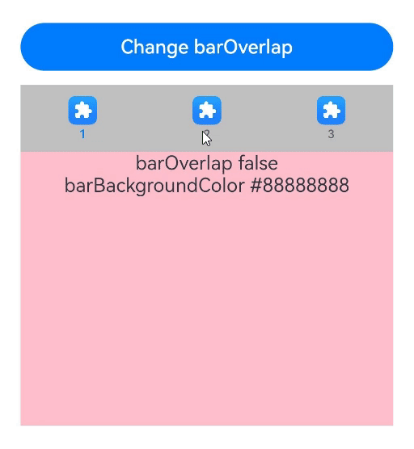
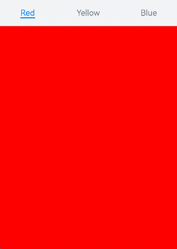
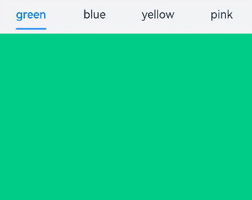
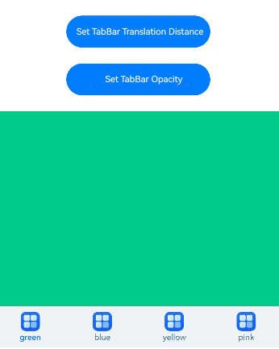
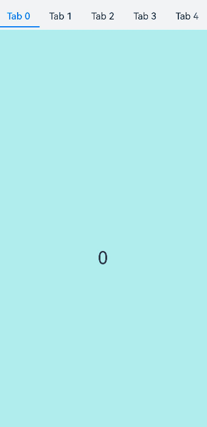

# Tabs

The **Tabs** component is a container component that allows users to switch between content views through tabs. Each tab page corresponds to a content view.

>  **NOTE**
>
>  This component is supported since API version 7. Updates will be marked with a superscript to indicate their earliest API version.
>
>  Since API version 11, this component supports the safe area attribute by default, with the default attribute value being **expandSafeArea([SafeAreaType.SYSTEM], [SafeAreaEdge.BOTTOM]))**. You can override this attribute to change the default behavior. In earlier versions, you need to use the [expandSafeArea](ts-universal-attributes-expand-safe-area.md) attribute to implement the safe area feature.


## Child Components

Custom components cannot be used as child components. Only the [TabContent](ts-container-tabcontent.md) child component is allowed, with support for [if/else](../../../quick-start/arkts-rendering-control-ifelse.md) and [ForEach](../../../quick-start/arkts-rendering-control-foreach.md) rendering control. In addition, the **if/else** and **ForEach** statements support **TabContent** components only, but not custom components.

>  **NOTE**
>
>  If the child component has the **visibility** attribute set to **None** or **Hidden**, it is hidden but still takes up space in the layout.
>
>  The **TabContent** child component is not destroyed once it is displayed. If you need to implement lazy loading and resource release of pages, see [Example 12](#example-12-implementing-lazy-loading-and-resource-release-of-pages).


## APIs

Tabs(options?: TabsOptions)

**Atomic service API**: This API can be used in atomic services since API version 11.

**System capability**: SystemCapability.ArkUI.ArkUI.Full

**Parameters**

| Name| Type        | Mandatory| Description|
| -------- | -------- | -------- | -------- |
| options | [TabsOptions](#tabsoptions14) | No| Options of the **Tabs** component.|

## TabsOptions<sup>14+</sup>

Provides options of the **Tabs** component, including the position, index of the currently displayed tab, and tab controller.

**Atomic service API**: This API can be used in atomic services since API version 14.

**System capability**: SystemCapability.ArkUI.ArkUI.Full

**Parameters**

| Name        | Type                             | Mandatory  | Description                                    |
| ----------- | --------------------------------- | ---- | ---------------------------------------- |
| barPosition | [BarPosition](#barposition)| No   | Position of the **Tabs** component.<br>Default value: **BarPosition.Start**  |
| index       | number                            | No   | Index of the currently displayed tab.<br>Default value: **0**<br>**NOTE**<br>A value less than 0 evaluates to the default value.<br>The value ranges from 0 to the number of **TabContent** nodes minus 1.<br>When the tab is switched by changing the index, the tab switching animation does not take effect. When **changeIndex** of **TabController** is used for tab switching, the tab switching animation is enabled by default. You can disable the animation by setting **animationDuration** to **0**.<br>Since API version 10, this parameter supports two-way binding through [$$](../../../quick-start/arkts-two-way-sync.md).|
| controller  | [TabsController](#tabscontroller) | No   | Tab controller.                              |

## BarPosition

Enumerates the positions of the **Tabs** component.

**Atomic service API**: This API can be used in atomic services since API version 11.

**System capability**: SystemCapability.ArkUI.ArkUI.Full

| Name | Description                                                        |
| ----- | ------------------------------------------------------------ |
| Start | If the **vertical** attribute is set to **true**, the tab is on the left of the container. If the **vertical** attribute is set to **false**, the tab is on the top of the container.|
| End   | If the **vertical** attribute is set to **true**, the tab is on the right of the container. If the **vertical** attribute is set to **false**, the tab is at the bottom of the container.|


## Attributes

In addition to the [universal attributes](ts-universal-attributes-size.md), the following attributes are supported.

### vertical

vertical(value: boolean)

Sets whether to use vertical tabs.

**Atomic service API**: This API can be used in atomic services since API version 11.

**System capability**: SystemCapability.ArkUI.ArkUI.Full

**Parameters**

| Name| Type   | Mandatory| Description                                                        |
| ------ | ------- | ---- | ------------------------------------------------------------ |
| value  | boolean | Yes  | Whether to use vertical tabs.<br>The value **true** means to use vertical tabs, and **false** means to use horizontal tabs.<br>Default value: **false**<br>If set to have a height of **auto**, horizontal tabs auto-adapt the height to child components, which is calculated as follows: Tab bar height + Divider width + Tab content height + Top and bottom paddings + Top and bottom border widths.<br>If set to have a width of **auto**, vertical tabs auto-adapt the width to child components, which is calculated as follows: Tab bar width + Divider width + Tab content width + Left and right paddings + Left and right border widths.<br>To avoid animation jitter when switching between tabs, maintain a consistent size for child components on each tab.|

### scrollable

scrollable(value: boolean)

Sets whether the tabs are scrollable.

**Atomic service API**: This API can be used in atomic services since API version 11.

**System capability**: SystemCapability.ArkUI.ArkUI.Full

**Parameters**

| Name| Type   | Mandatory| Description                                                        |
| ------ | ------- | ---- | ------------------------------------------------------------ |
| value  | boolean | Yes  | Whether the tabs are scrollable.<br>**true** (default): The tabs are scrollable.<br> **false**: The tabs are not scrollable.|

### barMode

barMode(value: BarMode, options?: ScrollableBarModeOptions)

Sets the tab bar layout mode.

**Atomic service API**: This API can be used in atomic services since API version 11.

**System capability**: SystemCapability.ArkUI.ArkUI.Full

**Parameters**

| Name               | Type                                                        | Mandatory| Description                                                        |
| --------------------- | ------------------------------------------------------------ | ---- | ------------------------------------------------------------ |
| value                 | [BarMode](#barmode)                                  | Yes  | Layout mode.<br>Default value: **BarMode.Fixed**                                                |
| options<sup>10+</sup> | [ScrollableBarModeOptions](#scrollablebarmodeoptions10)| No  | Layout style of the tab bar in scrollable mode.<br>**NOTE**<br>This parameter is effective only when the tab bar is in horizontal scrollable mode.|

### barMode<sup>10+</sup>

barMode(value: BarMode.Fixed)

Sets the tab bar layout mode to **BarMode.Fixed**.

**Atomic service API**: This API can be used in atomic services since API version 11.

**System capability**: SystemCapability.ArkUI.ArkUI.Full

**Parameters**

| Name   | Type                            | Mandatory| Description                                   |
| -------- | -------------------------------- | ---- | ------------------------------------ |
| value    | [BarMode.Fixed](#barmode)| Yes  | The width of each tab is determined by equally dividing the number of tabs by the bar width (or bar height in the vertical layout).  |

### barMode<sup>10+</sup>

barMode(value: BarMode.Scrollable, options: ScrollableBarModeOptions)

Sets the tab bar layout mode to **BarMode.Scrollable**.

**Atomic service API**: This API can be used in atomic services since API version 11.

**System capability**: SystemCapability.ArkUI.ArkUI.Full

**Parameters**

| Name   | Type                             | Mandatory| Description                                   |
| -------- | --------------------------------- | ---- | ------------------------------------- |
| value    | [BarMode.Scrollable](#barmode)| Yes  | The width of each tab is determined by the actual layout. The tabs are scrollable in the following case: In horizontal layout, the total width exceeds the tab bar width; in vertical layout, the total height exceeds the tab bar height.       |
| options | [ScrollableBarModeOptions](#scrollablebarmodeoptions10)| Yes  | Layout style of the tab bar in scrollable mode.<br>**NOTE**<br>This parameter is effective only when the tab bar is in scrollable mode. |

### barWidth

barWidth(value: Length)

Sets the width of the tab bar. If the set value is less than 0 or greater than the width of the **Tabs** component, the default value is used.

**Atomic service API**: This API can be used in atomic services since API version 11.

**System capability**: SystemCapability.ArkUI.ArkUI.Full

**Parameters**

| Name| Type                                     | Mandatory| Description                                                        |
| ------ | ----------------------------------------- | ---- | ------------------------------------------------------------ |
| value  | [Length](ts-types.md#length)<sup>8+</sup> | Yes  | Width of the tab bar.<br>Default value:<br>If neither [SubTabBarStyle](ts-container-tabcontent.md#subtabbarstyle9) nor [BottomTabBarStyle](ts-container-tabcontent.md#bottomtabbarstyle9) is set, and the **vertical** attribute is **false**, the default value is the width of the **Tabs** component.<br>If neither **SubTabBarStyle** nor **BottomTabBarStyle** is set, and the **vertical** attribute is **true**, the default value is 56 vp.<br>If **SubTabBarStyle** is set, and the **vertical** attribute is **false**, the default value is the width of the **Tabs** component.<br>If **SubTabBarStyle** is set, and the **vertical** attribute is **true**, the default value is 56 vp.<br>If **BottomTabBarStyle** is set, and the **vertical** attribute is **true**, the default value is 96 vp.<br>If **BottomTabBarStyle** is set, and the **vertical** attribute is **false**, the default value is the width of the **Tabs** component.|

### barHeight

barHeight(value: Length)

Sets the height of the tab bar. If this attribute is set to **'auto'**, which takes effect only in horizontal mode, the tab bar adapts to the height of its child components. If the set value is less than 0 or greater than the height of the **Tabs** component, the default value is used.

In versions earlier than API version 14, setting **barHeight** to a fixed value restricts the tab bar from extending beyond the bottom safe area. Since API version 14, the [safeAreaPadding](./ts-universal-attributes-size.md#safeareapadding14) attribute is supported. When **safeAreaPadding** is set to 0 or is not explicitly set, the tab bar is allowed to extend beyond the bottom safe area.

**Atomic service API**: This API can be used in atomic services since API version 11.

**System capability**: SystemCapability.ArkUI.ArkUI.Full

**Parameters**

| Name| Type                                     | Mandatory| Description                                                        |
| ------ | ----------------------------------------- | ---- | ------------------------------------------------------------ |
| value  | [Length](ts-types.md#length)<sup>8+</sup> | Yes  | Height of the tab bar.<br>Default value:<br>If the tab bar has the **vertical** attribute set to **false** and does not have a style specified, the default value is 56 vp.<br>If the tab bar has the **vertical** attribute set to **true** and does not have a style specified, the default value is the height of the **Tabs** component.<br>If [SubTabBarStyle](ts-container-tabcontent.md#subtabbarstyle9) is set, and the **vertical** attribute is **false**, the default value is 56 vp.<br>If **SubTabBarStyle** is set, and the **vertical** attribute is **true**, the default value is the height of the **Tabs** component.<br>If [BottomTabBarStyle](ts-container-tabcontent.md#bottomtabbarstyle9) is set, and the **vertical** attribute is **true**, the default value is the height of the **Tabs** component.<br>If **BottomTabBarStyle** is set, and the **vertical** attribute is **false**, the default value is 56 vp in versions earlier than API version 12 and 48 vp since API version 12.|

### animationDuration

animationDuration(value: number)

Sets the length of time required to complete the tab switching animation, which is initiated by clicking a specific tab or by calling the **changeIndex** API of **TabsController**. This parameter cannot be set in percentage.

**Atomic service API**: This API can be used in atomic services since API version 11.

**System capability**: SystemCapability.ArkUI.ArkUI.Full

**Parameters**

| Name| Type  | Mandatory| Description                                                        |
| ------ | ------ | ---- | ------------------------------------------------------------ |
| value  | number | Yes  | Length of time required to complete the tab switching animation, which is initiated by clicking a specific tab or by calling the **changeIndex** API of **TabsController**.<br>The default value varies.<br>API version 10 and earlier versions: If this parameter is set to **null** or is not set, the default value **0** is used, which means that no tab switching animation is displayed when a specific tab is clicked or the **changeIndex** API of **TabsController** is called. If this parameter is set to **undefined** or a value less than 0, the default value **300** is used.<br>API version 11 and later versions: If this parameter is set to an invalid value or is not set, the default value is **0** when the tab bar is set to **BottomTabBarStyle** and **300** when the tab bar is set to any other style.<br>Unit: ms|

### animationMode<sup>12+</sup>

animationMode(mode: Optional\<AnimationMode\>)

Sets the animation mode for switching between tabs.

**Atomic service API**: This API can be used in atomic services since API version 12.

**System capability**: SystemCapability.ArkUI.ArkUI.Full

**Parameters**

| Name| Type  | Mandatory| Description                                                        |
| ------ | ------ | ---- | ------------------------------------------------------------ |
| mode  | Optional\<[AnimationMode](#animationmode12)\>| Yes  | Animation mode for switching between tabs.<br>Default value:<br>**AnimationMode.CONTENT_FIRST**, indicating that the content of the target page is loaded before the switching animation starts in the process of switching between tabs.|

### barPosition<sup>9+</sup>

barPosition(value: BarPosition)

Position of the **Tabs** component.

**Atomic service API**: This API can be used in atomic services since API version 11.

**System capability**: SystemCapability.ArkUI.ArkUI.Full

**Parameters**

| Name| Type                              | Mandatory| Description                 |
| ----- | ---------------------------------- | ---- | -------------------- |
| value | [BarPosition](#barposition)| Yes | Position of the **Tabs** component.<br>Default value: **BarPosition.Start**  |

### divider<sup>10+</sup>

divider(value: DividerStyle | null)

Sets the divider style for the **TabBar** and **TabContent** components.

**Atomic service API**: This API can be used in atomic services since API version 11.

**System capability**: SystemCapability.ArkUI.ArkUI.Full

**Parameters**

| Name| Type                                                     | Mandatory| Description                                                        |
| ------ | --------------------------------------------------------- | ---- | ------------------------------------------------------------ |
| value  | [DividerStyle](#dividerstyle10) \| null | Yes  | Divider style. By default, the divider is not displayed.<br>**DividerStyle**: divider style.<br>**null**: The divider is not displayed.|

### fadingEdge<sup>10+</sup>

fadingEdge(value: boolean)

Sets whether the tab fades out when it exceeds the container width. It is recommended that this attribute be used together with the **barBackgroundColor** attribute. If the **barBackgroundColor** attribute is not defined, the tab fades out in white when it exceeds the container width by default.

**Atomic service API**: This API can be used in atomic services since API version 11.

**System capability**: SystemCapability.ArkUI.ArkUI.Full

**Parameters**

| Name| Type   | Mandatory| Description                                              |
| ------ | ------- | ---- | -------------------------------------------------- |
| value  | boolean | Yes  | Whether the tab fades out when it exceeds the container width.<br>Default value: **true**|

### barOverlap<sup>10+</sup>

barOverlap(value: boolean)

Sets whether the tab bar is superimposed on the **TabContent** component after having its background blurred.

**Atomic service API**: This API can be used in atomic services since API version 11.

**System capability**: SystemCapability.ArkUI.ArkUI.Full

**Parameters**

| Name| Type   | Mandatory| Description                                                        |
| ------ | ------- | ---- | ------------------------------------------------------------ |
| value  | boolean | Yes  | Whether the tab bar is superimposed on the **TabContent** component after having its background blurred. When **barOverlap** is set to **true**, the default value of **BlurStyle** for the **TabBar** is automatically changed to **'BlurStyle.COMPONENT_THICK'**.<br>Default value: **false**|

### barBackgroundColor<sup>10+</sup>

barBackgroundColor(value: ResourceColor)

Background color of the tab bar.

**Atomic service API**: This API can be used in atomic services since API version 11.

**System capability**: SystemCapability.ArkUI.ArkUI.Full

**Parameters**

| Name| Type                                      | Mandatory| Description                                |
| ------ | ------------------------------------------ | ---- | ------------------------------------ |
| value  | [ResourceColor](ts-types.md#resourcecolor) | Yes  | Background color of the tab bar.<br>Default value: **Color.Transparent**|

### barBackgroundBlurStyle<sup>11+</sup>

barBackgroundBlurStyle(value: BlurStyle)

Sets the background blur style of the tab bar.

**Atomic service API**: This API can be used in atomic services since API version 11.

**System capability**: SystemCapability.ArkUI.ArkUI.Full

**Parameters**

| Name| Type                                        | Mandatory| Description                                    |
| ------ | -------------------------------------------- | ---- | ---------------------------------------- |
| value  | [BlurStyle](ts-universal-attributes-background.md#blurstyle9) | Yes  | Background blur style of the tab bar.<br>Default value: **BlurStyle.NONE**|

### barBackgroundBlurStyle<sup>13+</sup>

barBackgroundBlurStyle(value: BlurStyle, options: BackgroundBlurStyleOptions)

Defines the blur style to apply between the background and content of a tab bar. It encapsulates various blur radius, mask color, mask opacity, saturation, and brightness values through enum values.

**Atomic service API**: This API can be used in atomic services since API version 13.

**System capability**: SystemCapability.ArkUI.ArkUI.Full

**Parameters**

| Name               | Type                                                        | Mandatory| Description                                                        |
| --------------------- | ------------------------------------------------------------ | ---- | ------------------------------------------------------------ |
| value                 | [BlurStyle](ts-universal-attributes-background.md#blurstyle9)                 | Yes  | Settings of the background blur style, including the blur radius, mask color, mask opacity, saturation, and brightness.|
| options | [BackgroundBlurStyleOptions](ts-universal-attributes-background.md#backgroundblurstyleoptions10) | Yes  | Background blur options.  

### barGridAlign<sup>10+</sup>

barGridAlign(value: BarGridColumnOptions)

Sets the visible area of the tab bar in grid mode. For details, see **BarGridColumnOptions**. This attribute is effective only in horizontal mode. It is not applicable to [XS, XL, and XXL devices](../../../ui/arkts-layout-development-grid-layout.md#grid-breakpoints).

**Atomic service API**: This API can be used in atomic services since API version 11.

**System capability**: SystemCapability.ArkUI.ArkUI.Full

**Parameters**

| Name| Type                                                   | Mandatory| Description                              |
| ------ | ------------------------------------------------------- | ---- | ---------------------------------- |
| value  | [BarGridColumnOptions](#bargridcolumnoptions10) | Yes  | Visible area of the tab bar in grid mode.|

### edgeEffect<sup>12+</sup>

edgeEffect(edgeEffect: Optional&lt;EdgeEffect&gt;)

Sets the edge effect used when the boundary of the scrolling area is reached.

**Atomic service API**: This API can be used in atomic services since API version 12.

**System capability**: SystemCapability.ArkUI.ArkUI.Full

**Parameters**

| Name| Type                                         | Mandatory| Description                                        |
| ------ | --------------------------------------------- | ---- | -------------------------------------------- |
| edgeEffect  | Optional&lt;[EdgeEffect](ts-appendix-enums.md#edgeeffect)&gt; | Yes  | Effect used when the boundary of the scrolling area is reached.<br>Default value: **EdgeEffect.Spring**|

### barBackgroundEffect<sup>13+</sup>

barBackgroundEffect(options: BackgroundEffectOptions)

Sets the background effect of the tab bar, including the blur radius, brightness, saturation, and color.

**Atomic service API**: This API can be used in atomic services since API version 13.

**System capability**: SystemCapability.ArkUI.ArkUI.Full

**Parameters**

| Name | Type                                                        | Mandatory| Description                                      |
| ------- | ------------------------------------------------------------ | ---- | ------------------------------------------ |
| options | [BackgroundEffectOptions](ts-universal-attributes-background.md#backgroundeffectoptions11) | Yes  | Background effect options, including the blur radius, brightness, saturation, and color.|

### pageFlipMode<sup>14+</sup>

pageFlipMode(value: PageFlipMode)

Sets the mode for flipping pages using the mouse wheel.

**Atomic service API**: This API can be used in atomic services since API version 14.

**System capability**: SystemCapability.ArkUI.ArkUI.Full

**Parameters**

| Name| Type                                                       | Mandatory| Description                                                        |
| ------ | ----------------------------------------------------------- | ---- | ------------------------------------------------------------ |
| value  | [PageFlipMode](ts-appendix-enums.md#pageflipmode14) | Yes  | Mode for flipping pages using the mouse wheel.<br>Default value: **PageFlipMode.CONTINUOUS**|

## DividerStyle<sup>10+</sup>

Describes the divider style.

**Atomic service API**: This API can be used in atomic services since API version 11.

**System capability**: SystemCapability.ArkUI.ArkUI.Full

| Name         | Type                                    | Mandatory  | Description                                      |
| ----------- | ---------------------------------------- | ---- | ---------------------------------------- |
| strokeWidth | [Length](ts-types.md#length)             | Yes   | Width of the divider. It cannot be set in percentage.<br>Default value: **0.0**<br>Unit: vp          |
| color       | [ResourceColor](ts-types.md#resourcecolor) | No   | Color of the divider.<br>Default value: **#33182431**               |
| startMargin | [Length](ts-types.md#length)             | No   | Distance between the divider and the top of the sidebar. It cannot be set in percentage.<br>Default value: **0.0**<br>Unit: vp|
| endMargin   | [Length](ts-types.md#length)             | No   | Distance between the divider and the bottom of the sidebar. It cannot be set in percentage.<br>Default value: **0.0**<br>Unit: vp|

## BarGridColumnOptions<sup>10+</sup>

Implements a **BarGridColumnOptions** object for setting the visible area of the tab bar in grid mode, including the column margin and gutter, as well as the number of columns occupied by tabs under small, medium, and large screen sizes.

**Atomic service API**: This API can be used in atomic services since API version 11.

**System capability**: SystemCapability.ArkUI.ArkUI.Full

| Name         | Type                                    | Mandatory  | Description                                      |
| ----------- | ---------------------------------------- | ---- | ---------------------------------------- |
| margin | [Dimension](ts-types.md#dimension10)             | No   | Column margin in grid mode. It cannot be set in percentage.<br>Default value: **24.0**<br>Unit: vp                       |
| gutter      | [Dimension](ts-types.md#dimension10) | No   | Column gutter (that is, gap between columns) in grid mode. It cannot be set in percentage.<br>Default value: **24.0**<br>Unit: vp                    |
| sm | number            | No   | Number of columns occupied by a tab on a screen whose width is greater than or equal to 320 vp but less than 600 vp.<br>The value must be a non-negative even number. The default value is **-1**, indicating that the tab takes up the entire width of the tab bar.|
| md   | number          | No   | Number of columns occupied by a tab on a screen whose width is greater than or equal to 600 vp but less than 800 vp.<br>The value must be a non-negative even number. The default value is **-1**, indicating that the tab takes up the entire width of the tab bar.|
| lg   | number           | No   | Number of columns occupied by a tab on a screen whose width is greater than or equal to 840 vp but less than 1024 vp.<br>The value must be a non-negative even number. The default value is **-1**, indicating that the tab takes up the entire width of the tab bar.|

## ScrollableBarModeOptions<sup>10+</sup>

Implements a **ScrollableBarModeOptions** object.

**Atomic service API**: This API can be used in atomic services since API version 11.

**System capability**: SystemCapability.ArkUI.ArkUI.Full

| Name         | Type                                    | Mandatory  | Description                                      |
| ----------- | ---------------------------------------- | ---- | ---------------------------------------- |
| margin | [Dimension](ts-types.md#dimension10)          | No   | Left and right margin of the tab bar in scrollable mode. It cannot be set in percentage.<br>Default value: **0.0**<br>Unit: vp                   |
| nonScrollableLayoutStyle      | [LayoutStyle](#layoutstyle10) | No   | Tab layout mode of the tab bar when not scrolling in scrollable mode.<br>Default value: **LayoutStyle.ALWAYS_CENTER**          |

## BarMode

Enumerates layout modes of the tab bar.

**Atomic service API**: This API can be used in atomic services since API version 11.

**System capability**: SystemCapability.ArkUI.ArkUI.Full

| Name       | Value| Description                                    |
| ---------- | -- | ---------------------------------------- |
| Scrollable | 0  | The width of each tab is determined by the actual layout. The tabs are scrollable in the following case: In horizontal layout, the total width exceeds the tab bar width; in vertical layout, the total height exceeds the tab bar height.|
| Fixed      | 1  | The width of each tab is determined by equally dividing the number of tabs by the bar width (or bar height in the vertical layout).|

## AnimationMode<sup>12+</sup>

Enumerates the animation modes for switching between tabs.

**Atomic service API**: This API can be used in atomic services since API version 12.

**System capability**: SystemCapability.ArkUI.ArkUI.Full

| Name         | Value  | Description                                                        |
| ------------- | ---- | ------------------------------------------------------------ |
| CONTENT_FIRST | 0    | Load the content of the target page before starting the switching animation.                            |
| ACTION_FIRST  | 1    | Start the switching animation before loading the content of the target page. For the settings to take effect, the height and width of tabs must be set to **auto**.|
| NO_ANIMATION  | 2    | The switching animation is disabled.                                                |

## LayoutStyle<sup>10+</sup>

Enumerates the tab layout styles of the tab bar when not scrolling in scrollable mode.

**Atomic service API**: This API can be used in atomic services since API version 11.

**System capability**: SystemCapability.ArkUI.ArkUI.Full

| Name        | Value| Description                                    |
| ---------- | -- | ---------------------------------------- |
| ALWAYS_CENTER | 0 | If the tab content exceeds the tab bar width, the tabs are scrollable.<br>If not, the tabs are compactly centered on the tab bar and not scrollable.|
| ALWAYS_AVERAGE_SPLIT | 1 | If the tab content exceeds the tab bar width, the tabs are scrollable.<br>If not, the tabs are not scrollable, and the width of the tab bar is evenly distributed among all tabs.|
| SPACE_BETWEEN_OR_CENTER      | 2 | If the tab content exceeds the tab bar width, the tabs are scrollable.<br>If the tab content exceeds half the width of the tab bar but is still within the tab bar width, the tabs are compactly centered and not scrollable.<br>If the tab content does not exceed half the width of the tab bar, the tabs are centered within half the width of the tab bar with even spacing between them and are not scrollable.|

## Events

In addition to the [universal events](ts-universal-events-click.md), the following events are supported.

### onChange

onChange(event: Callback\<number>)

Triggered when a tab is switched.

This event is triggered when any of the following conditions is met:

1. The swiping animation is completed, followed by tab switching.

2. The [Controller](#tabscontroller) API is called.

3. The attribute value is updated using a [state variable](../../../quick-start/arkts-state.md).

4. A tab is clicked.

>  **NOTE**
>
>  When a custom tab is used, the synchronization between tabs and swipe gestures in the **onChange** event may be performed only after tab switching occurs. This can lead to a delay in switching to the custom tab. To address this issue, listen for the current tab index in [onAnimationStart](#onanimationstart11) and update the tab index accordingly. For details about the implementation, see [Example 1](#example-1-setting-up-custom-tab-switching-synchronization).

**Atomic service API**: This API can be used in atomic services since API version 11.

**System capability**: SystemCapability.ArkUI.ArkUI.Full

**Parameters**

| Name| Type  | Mandatory| Description                                  |
| ------ | ------ | ---- | -------------------------------------- |
| event  | [Callback](./ts-types.md#callback12)\<number> | Yes  | Index of the active tab. The index starts from 0.|

### onTabBarClick<sup>10+</sup>

onTabBarClick(event: Callback\<number>)

Triggered when a tab is clicked.

**Atomic service API**: This API can be used in atomic services since API version 11.

**System capability**: SystemCapability.ArkUI.ArkUI.Full

**Parameters**

| Name| Type  | Mandatory| Description                                |
| ------ | ------ | ---- | ------------------------------------ |
| event  | [Callback](./ts-types.md#callback12)\<number> | Yes  | Index of the clicked tab. The index starts from 0.|

### onAnimationStart<sup>11+</sup>

onAnimationStart(handler: OnTabsAnimationStartCallback)

Triggered when the tab switching animation starts. This callback is not triggered when **animationDuration** is set to **0**, which effectively disables the animation.

**Atomic service API**: This API can be used in atomic services since API version 12.

**System capability**: SystemCapability.ArkUI.ArkUI.Full

**Parameters**

| Name| Type  | Mandatory| Description                |
| ------ | ------ | ---- | -------------------- |
| handler  | [OnTabsAnimationStartCallback](#ontabsanimationstartcallback14) | Yes  | Callback triggered when the switching animation starts.|

### onAnimationEnd<sup>11+</sup>

onAnimationEnd(handler: OnTabsAnimationEndCallback)

Triggered when the tab switching animation ends. This event is triggered when the tab switching animation ends, whether it is caused by gesture interruption or not. This callback is not triggered when **animationDuration** is set to **0**, which effectively disables the animation.

**Atomic service API**: This API can be used in atomic services since API version 12.

**System capability**: SystemCapability.ArkUI.ArkUI.Full

**Parameters**

| Name| Type  | Mandatory| Description                |
| ------ | ------ | ---- | -------------------- |
| handler  | [OnTabsAnimationEndCallback](#ontabsanimationendcallback14) | Yes  | Callback triggered when the switching animation ends.|

### onGestureSwipe<sup>11+</sup>

onGestureSwipe(handler: OnTabsGestureSwipeCallback)

Triggered on a frame-by-frame basis when the tab is switched by a swipe.

**Atomic service API**: This API can be used in atomic services since API version 12.

**System capability**: SystemCapability.ArkUI.ArkUI.Full

**Parameters**

| Name| Type  | Mandatory| Description                |
| ------ | ------ | ---- | -------------------- |
| handler  | [OnTabsGestureSwipeCallback](#ontabsgestureswipecallback14) | Yes  | Triggered on a frame-by-frame basis when the page is turned by a swipe.|

### customContentTransition<sup>11+</sup>

customContentTransition(delegate: TabsCustomContentTransitionCallback)

Sets the custom tab switching animation.

Instructions:

1. When the custom tab switching animation is used, the default switching animation of the **Tabs** component is disabled, and tabs cannot be switched through swiping.<br>2. The value **undefined** means not to use the custom tab switching animation, in which case the default switching animation is used.<br>3. The custom tab switching animation cannot be interrupted.<br>4. Currently, the custom tab switching animation can be triggered only by clicking a tab or by calling the **TabsController.changeIndex()** API.<br>5. When the custom tab switching animation is used, the **Tabs** component supports all events except **onGestureSwipe**.<br>6. Notes about the **onChange** and **onAnimationEnd** events: If the second custom animation is triggered during the execution of the first custom animation, the **onChange** and **onAnimationEnd** events of the first custom animation will be triggered when the second custom animation starts.<br>7. When the custom animation is used, the stack layout is used for pages involved in the animation. If the **zIndex** attribute is not set for related pages, the **zIndex** values of all pages are the same. In this case, the pages are rendered in the order in which they are added to the component tree (that is, the sequence of page indexes). In light of this, to control the rendering levels of pages, set the **zIndex** attribute of the pages.

**Widget capability**: This API can be used in ArkTS widgets since API version 11.

**Atomic service API**: This API can be used in atomic services since API version 12.

**System capability**: SystemCapability.ArkUI.ArkUI.Full

**Parameters**

| Name| Type  | Mandatory| Description                |
| ------ | ------ | ---- | -------------------- |
| delegate  | [TabsCustomContentTransitionCallback](#tabscustomcontenttransitioncallback14) | Yes  | Callback invoked when the custom tab switching animation starts.|

**Return value**

| Type                                                        | Description                    |
| ------------------------------------------------------------ | ------------------------ |
| [TabContentAnimatedTransition](#tabcontentanimatedtransition11) \| undefined | Information about the custom tab switching animation.|

### onContentWillChange<sup>12+</sup>

onContentWillChange(handler: OnTabsContentWillChangeCallback)

Triggered when a new page is about to be displayed.

Specifically, this event is triggered in the following cases:

1. When the user swipes on the **TabContent** component (provided that it supports swiping) to switch to a new page.

2. When **TabsController.changeIndex** is called to switch to a new page.

3. When the **index** attribute is changed to switch to a new page.

4. When the user clicks a tab on the tab bar to switch to a new page.

5. When the user presses the left or right arrow key on the keyboard to switch to a new page while the tab bar is focused.

**Atomic service API**: This API can be used in atomic services since API version 12.

**System capability**: SystemCapability.ArkUI.ArkUI.Full

**Parameters**

| Name| Type  | Mandatory| Description                |
| ------ | ------ | ---- | -------------------- |
| handler  | [OnTabsContentWillChangeCallback](#ontabscontentwillchangecallback14) | Yes  | Callback invoked when a new page is about to be displayed.|

**Return value**

| Type   | Description                                                        |
| ------- | ------------------------------------------------------------ |
| boolean | The value **true** means that the tab can switch to the new page.<br>The value **false** means that the tab cannot switch to the new page and will remain on the current page.|

## Callbacks

### OnTabsAnimationStartCallback<sup>14+</sup>

type OnTabsAnimationStartCallback = (index: number, targetIndex: number, extraInfo: TabsAnimationEvent) => void

Defines the callback triggered when the switching animation starts.

**Widget capability**: This API can be used in ArkTS widgets since API version 14.

**Atomic service API**: This API can be used in atomic services since API version 14.

**System capability**: SystemCapability.ArkUI.ArkUI.Full

**Parameters**

| Name     | Type                                                  | Mandatory| Description                                                        |
| ----------- | ------------------------------------------------------ | ---- | ------------------------------------------------------------ |
| index       | number                                                 | Yes  | Index of the currently displayed element.                                        |
| targetIndex | number                                                 | Yes  | Index of the target element to switch to.                                    |
| event       | [TabsAnimationEvent](#tabsanimationevent11) | Yes  | Extra information of the animation, including the offset of the currently displayed element and target element relative to the start position of the **Tabs** along the main axis, and the hands-off velocity.|

### OnTabsAnimationEndCallback<sup>14+</sup>

type OnTabsAnimationEndCallback = (index: number, extraInfo: TabsAnimationEvent) => void

Defines the callback triggered when the switching animation ends.

**Widget capability**: This API can be used in ArkTS widgets since API version 14.

**Atomic service API**: This API can be used in atomic services since API version 14.

**System capability**: SystemCapability.ArkUI.ArkUI.Full

**Parameters**

| Name| Type                                                  | Mandatory| Description                                                        |
| ------ | ------------------------------------------------------ | ---- | ------------------------------------------------------------ |
| index  | number                                                 | Yes  | Index of the currently displayed element.                                        |
| event  | [TabsAnimationEvent](#tabsanimationevent11) | Yes  | Extra information of the animation, which is the offset of the currently displayed element relative to the start position of the **Tabs** along the main axis.|

### OnTabsGestureSwipeCallback<sup>14+</sup>

type OnTabsGestureSwipeCallback = (index: number, extraInfo: TabsAnimationEvent) => void

Defines the callback invoked on a frame-by-frame basis when the page is turned by a swipe.

**Widget capability**: This API can be used in ArkTS widgets since API version 14.

**Atomic service API**: This API can be used in atomic services since API version 14.

**System capability**: SystemCapability.ArkUI.ArkUI.Full

**Parameters**

| Name| Type                                                  | Mandatory| Description                                                        |
| ------ | ------------------------------------------------------ | ---- | ------------------------------------------------------------ |
| index  | number                                                 | Yes  | Index of the currently displayed element.                                        |
| event  | [TabsAnimationEvent](#tabsanimationevent11) | Yes  | Extra information of the animation, which is the offset of the currently displayed element relative to the start position of the **Tabs** along the main axis.|

### TabsCustomContentTransitionCallback<sup>14+</sup>

type TabsCustomContentTransitionCallback = (from: number, to: number) => TabContentAnimatedTransition | undefined

Defines the callback invoked when the custom tab switching animation starts.

**Widget capability**: This API can be used in ArkTS widgets since API version 14.

**Atomic service API**: This API can be used in atomic services since API version 14.

**System capability**: SystemCapability.ArkUI.ArkUI.Full

**Parameters**

| Name| Type  | Mandatory| Description                           |
| ------ | ------ | ---- | ------------------------------- |
| from   | number | Yes  | Index of the currently displayed tab before the animation starts.|
| to     | number | Yes  | Index of the target tab before the animation starts.|

### OnTabsContentWillChangeCallback<sup>14+</sup>

type OnTabsContentWillChangeCallback = (currentIndex: number, comingIndex: number) => boolean

Defines the callback invoked when a new page is about to be displayed.

**Widget capability**: This API can be used in ArkTS widgets since API version 14.

**Atomic service API**: This API can be used in atomic services since API version 14.

**System capability**: SystemCapability.ArkUI.ArkUI.Full

**Parameters**

| Name      | Type  | Mandatory| Description                                      |
| ------------ | ------ | ---- | ------------------------------------------ |
| currentIndex | number | Yes  | Index of the active tab. The index starts from 0.|
| comingIndex  | number | Yes  | Index of the new tab to be displayed.             |

## TabsAnimationEvent<sup>11+</sup>

Describes the animation information of the **Tabs** component.

**Atomic service API**: This API can be used in atomic services since API version 12.

**System capability**: SystemCapability.ArkUI.ArkUI.Full

| Name           | Type     | Read Only| Optional| Description                                      |
| ------------- | ---------- | ---- | ---- | ------------------------ |
| currentOffset | number | No| No| Offset of the currently displayed element relative to the start position of the **Tabs** component along the main axis.<br> Unit: vp<br>Default value: **0**|
| targetOffset | number | No| No| Offset of the target element relative to the start position of the **Tabs** component along the main axis.<br> Unit: vp<br>Default value: **0**|
| velocity | number | No| No| Hands-off velocity at the beginning of the animation. Unit: VP/S<br>Default value: **0**|

## TabContentAnimatedTransition<sup>11+</sup>

Provides the information about the custom tab page switching animation.

**Widget capability**: This API can be used in ArkTS widgets since API version 11.

**Atomic service API**: This API can be used in atomic services since API version 12.

**System capability**: SystemCapability.ArkUI.ArkUI.Full

| Name           | Type        | Mandatory  | Description                                      |
| ------------- | ---------------------- | ---- |---------------------- |
| timeout | number | No| Timeout for the custom switching animation. The timer starts when the switching begins. If this timeframe passes without you calling the **finishTransition** API in [TabContentTransitionProxy](#tabcontenttransitionproxy11), the component will assume that the custom animation has ended and will proceed directly with subsequent operations. Unit: ms<br>Default value: **1000**|
| transition | [Callback](./ts-types.md#callback12)\<[TabContentTransitionProxy](#tabcontenttransitionproxy11)> | Yes| Content of the custom switching animation.|

## TabContentTransitionProxy<sup>11+</sup>

Implements the proxy object returned during the execution of the custom switching animation of the **Tabs** component. You can use this object to obtain the start and target pages for the custom tab switching animation. In addition, you can call the **finishTransition** API of this object to notify the **Tabs** component of the ending of the custom animation.

**Widget capability**: This API can be used in ArkTS widgets since API version 11.

**Atomic service API**: This API can be used in atomic services since API version 12.

**System capability**: SystemCapability.ArkUI.ArkUI.Full

### Attributes

| Name | Type    | Read Only| Optional| Description                        |
| ----- | ------- | ---- | ---- | --------------------------- |
| from | number | No| No| Index of the starting page of the custom animation.|
| to | number | No| No| Index of the target tab to switch to.|

### finishTransition

finishTransition(): void

Notifies the **Tabs** component that the custom animation has finished playing.

**Widget capability**: This API can be used in ArkTS widgets since API version 11.

**Atomic service API**: This API can be used in atomic services since API version 12.

**System capability**: SystemCapability.ArkUI.ArkUI.Full

## TabsController

Defines a tab controller, which is used to control switching of tabs. One **TabsController** cannot control multiple **Tabs** components.

**Atomic service API**: This API can be used in atomic services since API version 11.

**System capability**: SystemCapability.ArkUI.ArkUI.Full

### Objects to Import

```ts
let controller: TabsController = new TabsController()
```

### constructor

constructor()

A constructor used to create a **TabsController** object.

**Atomic service API**: This API can be used in atomic services since API version 11.

**System capability**: SystemCapability.ArkUI.ArkUI.Full

### changeIndex

changeIndex(value: number): void

Switches to the specified tab.

**Atomic service API**: This API can be used in atomic services since API version 11.

**System capability**: SystemCapability.ArkUI.ArkUI.Full

**Parameters**

| Name  | Type  | Mandatory  | Description                                    |
| ----- | ------ | ---- | ---------------------------------------- |
| value | number | Yes   | Index of the tab. The value starts from 0.<br>**NOTE**<br>If this parameter is set to a value less than 0 or greater than the maximum number, the default value **0** is used.|

### preloadItems<sup>12+</sup>

preloadItems(indices: Optional\<Array\<number>>): Promise\<void>

Preloads child nodes. After this API is called, all specified child nodes will be loaded at once. Therefore, for performance considerations, it is recommended that you load child nodes in batches.

**Atomic service API**: This API can be used in atomic services since API version 12.

**System capability**: SystemCapability.ArkUI.ArkUI.Full

**Parameters**

| Name  | Type  | Mandatory  | Description                                    |
| ----- | ------ | ---- | ---------------------------------------- |
| indices | Optional\<Array\<number>> | Yes| Array of indexes of the child nodes to preload.<br>The default value is an empty array.|

**Return value**

| Type                                                        | Description                    |
| ------------------------------------------------------------ | ------------------------ |
| Promise\<void> | Promise used to return the value.|

**Error codes**

For details about the error codes, see [Universal Error Codes](../../errorcode-universal.md).

| ID  | Error Message                                     |
| --------   | -------------------------------------------- |
| 401 | Parameter invalid. Possible causes: 1. The parameter type is not Array\<number>; 2. The parameter is an empty array; 3. The parameter contains an invalid index. |

### setTabBarTranslate<sup>13+</sup>

setTabBarTranslate(translate: TranslateOptions): void

Sets the translation distance of the tab bar.

> **NOTE**
>
> When **bindTabsToScrollable** or **bindTabsToNestedScrollable** is used to bind the **Tabs** component with a scrollable container, scrolling the container will trigger the display and hide animations of the tab bar for all **Tabs** components bound to it. In this case, calling the **setTabBarTranslate** API has no effect. Therefore, avoid using **bindTabsToScrollable**, **bindTabsToNestedScrollable**, and **setTabBarTranslate** simultaneously.
>

**Atomic service API**: This API can be used in atomic services since API version 13.

**System capability**: SystemCapability.ArkUI.ArkUI.Full

**Parameters**

| Name  | Type  | Mandatory  | Description                                    |
| ----- | ------ | ---- | ---------------------------------------- |
| translate | [TranslateOptions](ts-universal-attributes-transformation.md#translateoptions) | Yes| Translation distance of the tab bar.|

### setTabBarOpacity<sup>13+</sup>

setTabBarOpacity(opacity: number): void

Sets the opacity of the tab bar.

> **NOTE**
>
> When **bindTabsToScrollable** or **bindTabsToNestedScrollable** is used to bind the **Tabs** component with a scrollable container, scrolling the container will trigger the display and hide animations of the tab bar for all **Tabs** components bound to it. In this case, calling the **setTabBarOpacity** API has no effect. Therefore, avoid using **bindTabsToScrollable**, **bindTabsToNestedScrollable**, and **setTabBarOpacity** simultaneously.
>

**Atomic service API**: This API can be used in atomic services since API version 13.

**System capability**: SystemCapability.ArkUI.ArkUI.Full

**Parameters**

| Name  | Type  | Mandatory  | Description                                    |
| ----- | ------ | ---- | ---------------------------------------- |
| opacity | number | Yes| Opacity of the tab bar. The value range is [0.0, 1.0].|

## Example

### Example 1: Setting Up Custom Tab Switching Synchronization

This example demonstrates how to use **onAnimationStart** and **onChange** to synchronize tabs with swiping gestures during tab switching.

```ts
// xxx.ets
@Entry
@Component
struct TabsExample {
  @State fontColor: string = '#182431'
  @State selectedFontColor: string = '#007DFF'
  @State currentIndex: number = 0
  @State selectedIndex: number = 0
  private controller: TabsController = new TabsController()

  @Builder tabBuilder(index: number, name: string) {
    Column() {
      Text(name)
        .fontColor(this.selectedIndex === index ? this.selectedFontColor : this.fontColor)
        .fontSize(16)
        .fontWeight(this.selectedIndex === index ? 500 : 400)
        .lineHeight(22)
        .margin({ top: 17, bottom: 7 })
      Divider()
        .strokeWidth(2)
        .color('#007DFF')
        .opacity(this.selectedIndex === index ? 1 : 0)
    }.width('100%')
  }

  build() {
    Column() {
      Tabs({ barPosition: BarPosition.Start, index: this.currentIndex, controller: this.controller }) {
        TabContent() {
          Column().width('100%').height('100%').backgroundColor('#00CB87')
        }.tabBar(this.tabBuilder(0, 'green'))

        TabContent() {
          Column().width('100%').height('100%').backgroundColor('#007DFF')
        }.tabBar(this.tabBuilder(1, 'blue'))

        TabContent() {
          Column().width('100%').height('100%').backgroundColor('#FFBF00')
        }.tabBar(this.tabBuilder(2, 'yellow'))

        TabContent() {
          Column().width('100%').height('100%').backgroundColor('#E67C92')
        }.tabBar(this.tabBuilder(3, 'pink'))
      }
      .vertical(false)
      .barMode(BarMode.Fixed)
      .barWidth(360)
      .barHeight(56)
      .animationDuration(400)
      .onChange((index: number) => {
        // currentIndex controls which tab is displayed.
        this.currentIndex = index
        this.selectedIndex = index
      })
      .onAnimationStart((index: number, targetIndex: number, event: TabsAnimationEvent) => {
        if (index === targetIndex) {
          return
        }
        // selectedIndex controls the color switching for the image and text in the custom tab bar.
        this.selectedIndex = targetIndex
      })
      .width(360)
      .height(296)
      .margin({ top: 52 })
      .backgroundColor('#F1F3F5')
    }.width('100%')
  }
}
```


### Example 2: Setting the Basic Attributes of the Divider

This example uses **divider** to present dividers in different styles.

```ts
// xxx.ets
@Entry
@Component
struct TabsDivider1 {
  private controller1: TabsController = new TabsController()
  @State dividerColor: string = 'red'
  @State strokeWidth: number = 2
  @State startMargin: number = 0
  @State endMargin: number = 0
  @State nullFlag: boolean = false

  build() {
    Column() {
      Tabs({ controller: this.controller1 }) {
        TabContent() {
          Column().width('100%').height('100%').backgroundColor(Color.Pink)
        }.tabBar('pink')

        TabContent() {
          Column().width('100%').height('100%').backgroundColor(Color.Yellow)
        }.tabBar('yellow')

        TabContent() {
          Column().width('100%').height('100%').backgroundColor(Color.Blue)
        }.tabBar('blue')

        TabContent() {
          Column().width('100%').height('100%').backgroundColor(Color.Green)
        }.tabBar('green')

        TabContent() {
          Column().width('100%').height('100%').backgroundColor(Color.Red)
        }.tabBar('red')
      }
      .vertical(true)
      .scrollable(true)
      .barMode(BarMode.Fixed)
      .barWidth(70)
      .barHeight(200)
      .animationDuration(400)
      .onChange((index: number) => {
        console.info(index.toString())
      })
      .height('200vp')
      .margin({ bottom: '12vp' })
      .divider(this.nullFlag ? null : {
        strokeWidth: this.strokeWidth,
        color: this.dividerColor,
        startMargin: this.startMargin,
        endMargin: this.endMargin
      })

      Button('Regular Divider').width('100%').margin({ bottom: '12vp' })
        .onClick(() => {
          this.nullFlag = false;
          this.strokeWidth = 2;
          this.dividerColor = 'red';
          this.startMargin = 0;
          this.endMargin = 0;
        })
      Button('Empty Divider').width('100%').margin({ bottom: '12vp' })
        .onClick(() => {
          this.nullFlag = true
        })
      Button('Change to Blue').width('100%').margin({ bottom: '12vp'})
        .onClick(() => {
          this.dividerColor = 'blue'
        })
      Button('Increase Width').width('100%').margin({ bottom: '12vp' })
        .onClick(() => {
          this.strokeWidth += 2
        })
      Button('Decrease Width').width('100%').margin({ bottom: '12vp'})
        .onClick(() => {
          if (this.strokeWidth > 2) {
            this.strokeWidth -= 2
          }
        })
      Button('Increase Top Margin').width('100%').margin({ bottom: '12vp' })
        .onClick(() => {
          this.startMargin += 2
        })
      Button('Decrease Top Margin').width('100%').margin({ bottom: '12vp' })
        .onClick(() => {
          if (this.startMargin > 2) {
            this.startMargin -= 2
          }
        })
      Button('Increase Bottom Margin').width('100%').margin({ bottom:'12vp'})
        .onClick(() => {
          this.endMargin += 2
        })
      Button('Decrease Bottom Margin').width('100%').margin({ bottom:'12vp' })
        .onClick(() => {
          if (this.endMargin > 2) {
            this.endMargin -= 2
          }
        })
    }.padding({ top: '24vp', left: '24vp', right: '24vp' })
  }
}
```


### Example 3: Setting Tab Bar Fading

This example uses **fadingEdge** to specify whether to fade out tabs.

```ts
// xxx.ets
@Entry
@Component
struct TabsOpaque {
  @State message: string = 'Hello World'
  private controller: TabsController = new TabsController()
  private controller1: TabsController = new TabsController()
  @State selfFadingFade: boolean = true;

  build() {
    Column() {
      Button('Set Tab to Fade').width('100%').margin({ bottom: '12vp' })
        .onClick((event?: ClickEvent) => {
          this.selfFadingFade = true;
        })
      Button('Set Tab Not to Fade').width('100%').margin({ bottom: '12vp' })
        .onClick((event?: ClickEvent) => {
          this.selfFadingFade = false;
        })
      Tabs({ barPosition: BarPosition.End, controller: this.controller }) {
        TabContent() {
          Column().width('100%').height('100%').backgroundColor(Color.Pink)
        }.tabBar('pink')

        TabContent() {
          Column().width('100%').height('100%').backgroundColor(Color.Yellow)
        }.tabBar('yellow')

        TabContent() {
          Column().width('100%').height('100%').backgroundColor(Color.Blue)
        }.tabBar('blue')

        TabContent() {
          Column().width('100%').height('100%').backgroundColor(Color.Green)
        }.tabBar('green')

        TabContent() {
          Column().width('100%').height('100%').backgroundColor(Color.Green)
        }.tabBar('green')

        TabContent() {
          Column().width('100%').height('100%').backgroundColor(Color.Green)
        }.tabBar('green')

        TabContent() {
          Column().width('100%').height('100%').backgroundColor(Color.Green)
        }.tabBar('green')

        TabContent() {
          Column().width('100%').height('100%').backgroundColor(Color.Green)
        }.tabBar('green')
      }
      .vertical(false)
      .scrollable(true)
      .barMode(BarMode.Scrollable)
      .barHeight(80)
      .animationDuration(400)
      .onChange((index: number) => {
        console.info(index.toString())
      })
      .fadingEdge(this.selfFadingFade)
      .height('30%')
      .width('100%')

      Tabs({ barPosition: BarPosition.Start, controller: this.controller1 }) {
        TabContent() {
          Column().width('100%').height('100%').backgroundColor(Color.Pink)
        }.tabBar('pink')

        TabContent() {
          Column().width('100%').height('100%').backgroundColor(Color.Yellow)
        }.tabBar('yellow')

        TabContent() {
          Column().width('100%').height('100%').backgroundColor(Color.Blue)
        }.tabBar('blue')

        TabContent() {
          Column().width('100%').height('100%').backgroundColor(Color.Green)
        }.tabBar('green')

        TabContent() {
          Column().width('100%').height('100%').backgroundColor(Color.Green)
        }.tabBar('green')

        TabContent() {
          Column().width('100%').height('100%').backgroundColor(Color.Green)
        }.tabBar('green')
      }
      .vertical(true)
      .scrollable(true)
      .barMode(BarMode.Scrollable)
      .barHeight(200)
      .barWidth(80)
      .animationDuration(400)
      .onChange((index: number) => {
        console.info(index.toString())
      })
      .fadingEdge(this.selfFadingFade)
      .height('30%')
      .width('100%')
    }
    .padding({ top: '24vp', left: '24vp', right: '24vp' })
  }
}
```


### Example 4: Setting the Tab Bar to Be Superimposed on the TabContent Component

This example uses **barOverlap** to specify whether the tab bar is superimposed on the **TabContent** component after having its background blurred.

```ts
// xxx.ets
@Entry
@Component
struct barHeightTest {
  @State arr: number[] = [0, 1, 2, 3]
  @State barOverlap: boolean = true;
  build() {
    Column() {
      Text(`barOverlap ${this.barOverlap}`).fontSize(16)
      Button("Change barOverlap").width('100%').margin({ bottom: '12vp' })
        .onClick((event?: ClickEvent) => {
          if (this.barOverlap) {
            this.barOverlap = false;
          } else {
            this.barOverlap = true;
          }
        })

      Tabs({ barPosition: BarPosition.End }) {
        TabContent() {
          Column() {
            List({ space: 10 }) {
              ForEach(this.arr, (item: number) => {
                ListItem() {
                  Text("item" + item).width('80%').height(200).fontSize(16).textAlign(TextAlign.Center).backgroundColor('#fff8b81e')
                }
              }, (item: string) => item)
            }.width('100%').height('100%')
            .lanes(2).alignListItem(ListItemAlign.Center)
          }.width('100%').height('100%')
          .backgroundColor(Color.Pink)
        }
        .tabBar(new BottomTabBarStyle($r('sys.media.ohos_icon_mask_svg'), "test 0"))
      }
      .scrollable(false)
      .height('60%')
      .barOverlap(this.barOverlap)
    }
    .height(500)
    .padding({ top: '24vp', left: '24vp', right: '24vp' })
  }
}
```



### Example 5: Setting the Grid-Aligned Visible Area for the TabBar

This example uses **barGridAlign** to set the visible area of the tab bar in grid mode.

```ts
// xxx.ets
@Entry
@Component
struct TabsExample5 {
  private controller: TabsController = new TabsController()
  @State gridMargin: number = 10
  @State gridGutter: number = 10
  @State sm: number = -2
  @State clickedContent: string = "";

  build() {
    Column() {
      Row() {
        Button("gridMargin+10 " + this.gridMargin)
          .width('47%')
          .height(50)
          .margin({ top: 5 })
          .onClick((event?: ClickEvent) => {
            this.gridMargin += 10
          })
          .margin({ right: '6%', bottom: '12vp' })
        Button("gridMargin-10 " + this.gridMargin)
          .width('47%')
          .height(50)
          .margin({ top: 5 })
          .onClick((event?: ClickEvent) => {
            this.gridMargin -= 10
          })
          .margin({ bottom: '12vp' })
      }

      Row() {
        Button("gridGutter+10 " + this.gridGutter)
          .width('47%')
          .height(50)
          .margin({ top: 5 })
          .onClick((event?: ClickEvent) => {
            this.gridGutter += 10
          })
          .margin({ right: '6%', bottom: '12vp' })
        Button("gridGutter-10 " + this.gridGutter)
          .width('47%')
          .height(50)
          .margin({ top: 5 })
          .onClick((event?: ClickEvent) => {
            this.gridGutter -= 10
          })
          .margin({ bottom: '12vp' })
      }

      Row() {
        Button("sm+2 " + this.sm)
          .width('47%')
          .height(50)
          .margin({ top: 5 })
          .onClick((event?: ClickEvent) => {
            this.sm += 2
          })
          .margin({ right: '6%' })
        Button("sm-2 " + this.sm).width('47%').height(50).margin({ top: 5 })
          .onClick((event?: ClickEvent) => {
            this.sm -= 2
          })
      }

      Text("Clicked content: " + this.clickedContent).width('100%').height(200).margin({ top: 5 })


      Tabs({ barPosition: BarPosition.End, controller: this.controller }) {
        TabContent() {
          Column().width('100%').height('100%').backgroundColor(Color.Pink)
        }.tabBar(BottomTabBarStyle.of($r("sys.media.ohos_app_icon"), "1"))

        TabContent() {
          Column().width('100%').height('100%').backgroundColor(Color.Green)
        }.tabBar(BottomTabBarStyle.of($r("sys.media.ohos_app_icon"), "2"))

        TabContent() {
          Column().width('100%').height('100%').backgroundColor(Color.Blue)
        }.tabBar(BottomTabBarStyle.of($r("sys.media.ohos_app_icon"), "3"))
      }
      .width('350vp')
      .animationDuration(300)
      .height('60%')
      .barGridAlign({ sm: this.sm, margin: this.gridMargin, gutter: this.gridGutter })
      .backgroundColor(0xf1f3f5)
      .onTabBarClick((index: number) => {
        this.clickedContent += "index " + index + " was clicked\n";
      })
    }
    .width('100%')
    .height(500)
    .margin({ top: 5 })
    .padding('10vp')
  }
}
```


### Example 6: Setting the Layout Style for a Scrollable TabBar

This example implements the **ScrollableBarModeOptions** parameter of **barMode**. This parameter is effective only in **Scrollable** mode.

```ts
// xxx.ets
@Entry
@Component
struct TabsExample6 {
  private controller: TabsController = new TabsController()
  @State scrollMargin: number = 0
  @State layoutStyle: LayoutStyle = LayoutStyle.ALWAYS_CENTER
  @State text: string = "Text"

  build() {
    Column() {
      Row() {
        Button("scrollMargin+10 " + this.scrollMargin)
          .width('47%')
          .height(50)
          .margin({ top: 5 })
          .onClick((event?: ClickEvent) => {
            this.scrollMargin += 10
          })
          .margin({ right: '6%', bottom: '12vp' })
        Button("scrollMargin-10 " + this.scrollMargin)
          .width('47%')
          .height(50)
          .margin({ top: 5 })
          .onClick((event?: ClickEvent) => {
            this.scrollMargin -= 10
          })
          .margin({ bottom: '12vp' })
      }

      Row() {
        Button("Add Text")
          .width('47%')
          .height(50)
          .margin({ top: 5 })
          .onClick((event?: ClickEvent) => {
            this.text += 'Add Text'
          })
          .margin({ right: '6%', bottom: '12vp' })
        Button("Reset Text")
          .width('47%')
          .height(50)
          .margin({ top: 5 })
          .onClick((event?: ClickEvent) => {
            this.text = "Text"
          })
          .margin({ bottom: '12vp' })
      }

      Row() {
        Button("layoutStyle.ALWAYS_CENTER")
          .width('100%')
          .height(50)
          .margin({ top: 5 })
          .fontSize(15)
          .onClick((event?: ClickEvent) => {
            this.layoutStyle = LayoutStyle.ALWAYS_CENTER;
          })
          .margin({ bottom: '12vp' })
      }

      Row() {
        Button("layoutStyle.ALWAYS_AVERAGE_SPLIT")
          .width('100%')
          .height(50)
          .margin({ top: 5 })
          .fontSize(15)
          .onClick((event?: ClickEvent) => {
            this.layoutStyle = LayoutStyle.ALWAYS_AVERAGE_SPLIT;
          })
          .margin({ bottom: '12vp' })
      }

      Row() {
        Button("layoutStyle.SPACE_BETWEEN_OR_CENTER")
          .width('100%')
          .height(50)
          .margin({ top: 5 })
          .fontSize(15)
          .onClick((event?: ClickEvent) => {
            this.layoutStyle = LayoutStyle.SPACE_BETWEEN_OR_CENTER;
          })
          .margin({ bottom: '12vp' })
      }

      Tabs({ barPosition: BarPosition.End, controller: this.controller }) {
        TabContent() {
          Column().width('100%').height('100%').backgroundColor(Color.Pink)
        }.tabBar(SubTabBarStyle.of(this.text))

        TabContent() {
          Column().width('100%').height('100%').backgroundColor(Color.Green)
        }.tabBar(SubTabBarStyle.of(this.text))

        TabContent() {
          Column().width('100%').height('100%').backgroundColor(Color.Blue)
        }.tabBar(SubTabBarStyle.of(this.text))
      }
      .animationDuration(300)
      .height('60%')
      .backgroundColor(0xf1f3f5)
      .barMode(BarMode.Scrollable, { margin: this.scrollMargin, nonScrollableLayoutStyle: this.layoutStyle })
    }
    .width('100%')
    .height(500)
    .margin({ top: 5 })
    .padding('24vp')
  }
}
```


### Example 7: Implementing a Custom Tab Switching Animation

This example uses **customContentTransition** to implement a custom tab switching animation.

```ts
// xxx.ets
interface itemType {
  text: string,
  backgroundColor: Color
}

@Entry
@Component
struct TabsCustomAnimationExample {
  @State data: itemType[] = [
    {
      text: 'Red',
      backgroundColor: Color.Red
    },
    {
      text: 'Yellow',
      backgroundColor: Color.Yellow
    },
    {
      text: 'Blue',
      backgroundColor: Color.Blue
    }]
  @State opacityList: number[] = []
  @State scaleList: number[] = []

  private durationList: number[] = []
  private timeoutList: number[] = []
  private customContentTransition: (from: number, to: number) => TabContentAnimatedTransition = (from: number, to: number) => {
    let tabContentAnimatedTransition = {
      timeout: this.timeoutList[from],
      transition: (proxy: TabContentTransitionProxy) => {
        this.scaleList[from] = 1.0
        this.scaleList[to] = 0.5
        this.opacityList[from] = 1.0
        this.opacityList[to] = 0.5
        animateTo({
          duration: this.durationList[from],
          onFinish: () => {
            proxy.finishTransition()
          }
        }, () => {
          this.scaleList[from] = 0.5
          this.scaleList[to] = 1.0
          this.opacityList[from] = 0.5
          this.opacityList[to] = 1.0
        })
      }
    } as TabContentAnimatedTransition
    return tabContentAnimatedTransition
  }

  aboutToAppear(): void {
    let duration = 1000
    let timeout = 1000
    for (let i = 1; i <= this.data.length; i++) {
      this.opacityList.push(1.0)
      this.scaleList.push(1.0)
      this.durationList.push(duration * i)
      this.timeoutList.push(timeout * i)
    }
  }

  build() {
    Column() {
      Tabs() {
        ForEach(this.data, (item: itemType, index: number) => {
          TabContent() {}
          .tabBar(item.text)
          .backgroundColor(item.backgroundColor)
          // Customize the opacity and scale animation.
          .opacity(this.opacityList[index])
          .scale({ x: this.scaleList[index], y: this.scaleList[index] })
        })
      }
      .backgroundColor(0xf1f3f5)
      .width('100%')
      .height(500)
      .customContentTransition(this.customContentTransition)
    }
  }
}
```



### Example 8: Intercepting Page Switching

This example uses **onContentWillChange** to intercept and customize the gesture-based swiping actions for page switching.

```ts
//xxx.ets
@Entry
@Component
struct TabsExample {
  @State currentIndex: number = 2
  private controller: TabsController = new TabsController()
  @Builder tabBuilder(title: string,targetIndex: number) {
    Column(){
      Text(title).fontColor(this.currentIndex === targetIndex ? '#1698CE' : '#6B6B6B')
    }.width('100%')
    .height(50)
    .justifyContent(FlexAlign.Center)
  }
  build() {
    Column() {
      Tabs({ barPosition: BarPosition.End, controller: this.controller, index: this.currentIndex }) {
        TabContent() {
          Column(){
            Text('Content of the Home tab')
          }.width('100%').height('100%').backgroundColor('#00CB87').justifyContent(FlexAlign.Center)
        }.tabBar(this.tabBuilder('Home',0))

        TabContent() {
          Column(){
            Text('Content of the Discover tab')
          }.width('100%').height('100%').backgroundColor('#007DFF').justifyContent(FlexAlign.Center)
        }.tabBar(this.tabBuilder('Discover',1))

        TabContent() {
          Column(){
            Text('Content of the Recommended tab')
          }.width('100%').height('100%').backgroundColor('#FFBF00').justifyContent(FlexAlign.Center)
        }.tabBar(this.tabBuilder('Recommended',2))

        TabContent() {
          Column(){
            Text('Content of the Me tab')
          }.width('100%').height('100%').backgroundColor('#E67C92').justifyContent(FlexAlign.Center)
        }.tabBar(this.tabBuilder('Me',3))
      }
      .vertical(false)
      .barMode(BarMode.Fixed)
      .barWidth(360)
      .barHeight(60)
      .animationDuration(0)
      .onChange((index: number) => {
        this.currentIndex = index
      })
      .width(360)
      .height(600)
      .backgroundColor('#F1F3F5')
      .scrollable(true)
      .onContentWillChange((currentIndex, comingIndex) => {
        if (comingIndex == 2) {
          return false
        }
        return true
      })

      Button('Change Index').width('50%').margin({ top: 20 })
        .onClick(()=>{
          this.currentIndex = (this.currentIndex + 1) % 4
        })

      Button('changeIndex').width('50%').margin({ top: 20 })
        .onClick(()=>{
          this.currentIndex = (this.currentIndex + 1) % 4
          this.controller.changeIndex(this.currentIndex)
        })
    }.width('100%')
  }
}
```


### Example 9: Customizing the Tab Bar Switching Animation

This example uses **onChange**, **onAnimationStart**, **onAnimationEnd**, and **onGestureSwipe** APIs to customize the tab bar switching animation.

<!--code_no_check-->

```ts
// EntryAbility.ets
import { Configuration, UIAbility } from '@kit.AbilityKit'
import { i18n } from '@kit.LocalizationKit'
import { CommonUtil } from '../common/CommonUtil'

export default class EntryAbility extends UIAbility {
  onConfigurationUpdate(newConfig: Configuration): void {
    // Listen for system configuration changes.
    if (newConfig.language) {
      CommonUtil.setIsRTL(i18n.isRTL(newConfig.language))
    }
  }
}
```

<!--code_no_check-->

```ts
// CommonUtil.ets
import { i18n, intl } from '@kit.LocalizationKit'

export class CommonUtil {
  private static isRTL: boolean = i18n.isRTL((new intl.Locale()).language)

  public static setIsRTL(isRTL: boolean): void {
    CommonUtil.isRTL = isRTL
  }

  public static getIsRTL(): boolean {
    return CommonUtil.isRTL
  }
}
```

<!--code_no_check-->

```ts
// xxx.ets
import { LengthMetrics } from '@kit.ArkUI'
import { CommonUtil } from '../common/CommonUtil'

@Entry
@Component
struct TabsExample {
  @State currentIndex: number = 0
  @State animationDuration: number = 300
  @State indicatorLeftMargin: number = 0
  @State indicatorWidth: number = 0
  private tabsWidth: number = 0
  private textInfos: [number, number][] = []
  private isStartAnimateTo: boolean = false

  @Builder
  tabBuilder(index: number, name: string) {
    Column() {
      Text(name)
        .fontSize(16)
        .fontColor(this.currentIndex === index ? '#007DFF' : '#182431')
        .fontWeight(this.currentIndex === index ? 500 : 400)
        .id(index.toString())
        .onAreaChange((oldValue: Area, newValue: Area) => {
          this.textInfos[index] = [newValue.globalPosition.x as number, newValue.width as number]
        })
    }.width('100%')
  }

  build() {
    Stack({ alignContent: Alignment.TopStart }) {
      Tabs({ barPosition: BarPosition.Start }) {
        TabContent() {
          Column().width('100%').height('100%').backgroundColor('#00CB87')
        }.tabBar(this.tabBuilder(0, 'green'))

        TabContent() {
          Column().width('100%').height('100%').backgroundColor('#007DFF')
        }.tabBar(this.tabBuilder(1, 'blue'))

        TabContent() {
          Column().width('100%').height('100%').backgroundColor('#FFBF00')
        }.tabBar(this.tabBuilder(2, 'yellow'))

        TabContent() {
          Column().width('100%').height('100%').backgroundColor('#E67C92')
        }.tabBar(this.tabBuilder(3, 'pink'))
      }
      .onAreaChange((oldValue: Area, newValue: Area)=> {
        this.tabsWidth = newValue.width as number
        if (!this.isStartAnimateTo) {
          this.setIndicatorAttr(this.textInfos[this.currentIndex][0], this.textInfos[this.currentIndex][1])
        }
      })
      .barWidth('100%')
      .barHeight(56)
      .width('100%')
      .height(296)
      .backgroundColor('#F1F3F5')
      .animationDuration(this.animationDuration)
      .onChange((index: number) => {
        this.currentIndex = index // Listen for index changes to switch between tab pages.
      })
      .onAnimationStart((index: number, targetIndex: number, event: TabsAnimationEvent) => {
        // Triggered when the tab switching animation starts. The underline moves with the active tab, along with a width gradient.
        this.currentIndex = targetIndex
        this.startAnimateTo(this.animationDuration, this.textInfos[targetIndex][0], this.textInfos[targetIndex][1])
      })
      .onAnimationEnd((index: number, event: TabsAnimationEvent) => {
        // Triggered when the tab switching animation ends. The underline animation stops.
        let currentIndicatorInfo = this.getCurrentIndicatorInfo(index, event)
        this.startAnimateTo(0, currentIndicatorInfo.left, currentIndicatorInfo.width)
      })
      .onGestureSwipe((index: number, event: TabsAnimationEvent) => {
        // Triggered on a frame-by-frame basis when the tab is switched by a swipe.
        let currentIndicatorInfo = this.getCurrentIndicatorInfo(index, event)
        this.currentIndex = currentIndicatorInfo.index
        this.setIndicatorAttr(currentIndicatorInfo.left, currentIndicatorInfo.width)
      })

      Column()
        .height(2)
        .width(this.indicatorWidth)
        .margin({ start: LengthMetrics.vp(this.indicatorLeftMargin), top: LengthMetrics.vp(48) })
        .backgroundColor('#007DFF')
    }.width('100%')
  }

  private getCurrentIndicatorInfo(index: number, event: TabsAnimationEvent): Record<string, number> {
    let nextIndex = index
    if (index > 0 && (CommonUtil.getIsRTL() ? event.currentOffset < 0 : event.currentOffset > 0)) {
      nextIndex--
    } else if (index < 3 && (CommonUtil.getIsRTL() ? event.currentOffset > 0 : event.currentOffset < 0)) {
      nextIndex++
    }
    let indexInfo = this.textInfos[index]
    let nextIndexInfo = this.textInfos[nextIndex]
    let swipeRatio = Math.abs(event.currentOffset / this.tabsWidth)
    let currentIndex = swipeRatio > 0.5 ? nextIndex : index // If the swipe distance exceeds half the page width, the tab bar switches to the next page.
    let currentLeft = indexInfo[0] + (nextIndexInfo[0] - indexInfo[0]) * swipeRatio
    let currentWidth = indexInfo[1] + (nextIndexInfo[1] - indexInfo[1]) * swipeRatio
    return { 'index': currentIndex, 'left': currentLeft, 'width': currentWidth }
  }

  private startAnimateTo(duration: number, leftMargin: number, width: number) {
    this.isStartAnimateTo = true
    animateTo({
      duration: duration, // Animation duration.
      curve: Curve.Linear, // Animation curve.
      iterations: 1, // Number of playback times.
      playMode: PlayMode.Normal, // Animation playback mode.
      onFinish: () => {
        this.isStartAnimateTo = false
        console.info('play end')
      }
    }, () => {
      this.setIndicatorAttr(leftMargin, width)
    })
  }

  private setIndicatorAttr(leftMargin: number, width: number) {
    this.indicatorWidth = width
    if (CommonUtil.getIsRTL()) {
      this.indicatorLeftMargin = this.tabsWidth - leftMargin - width
    } else {
      this.indicatorLeftMargin = leftMargin
    }
  }
}
```



### Example 10: Preloading Child Nodes

In this example, the **preloadItems** API is used to preload specified child nodes.

```ts
// xxx.ets
import { BusinessError } from '@kit.BasicServicesKit'

@Entry
@Component
struct TabsPreloadItems {
  @State currentIndex: number = 1
  private tabsController: TabsController = new TabsController()

  build() {
    Column() {
      Tabs({ index: this.currentIndex, controller: this.tabsController }) {
        TabContent() {
          MyComponent({ color: '#00CB87' })
        }.tabBar(SubTabBarStyle.of('green'))

        TabContent() {
          MyComponent({ color: '#007DFF' })
        }.tabBar(SubTabBarStyle.of('blue'))

        TabContent() {
          MyComponent({ color: '#FFBF00' })
        }.tabBar(SubTabBarStyle.of('yellow'))

        TabContent() {
          MyComponent({ color: '#E67C92' })
        }.tabBar(SubTabBarStyle.of('pink'))
      }
      .width(360)
      .height(296)
      .backgroundColor('#F1F3F5')
      .onChange((index: number) => {
        this.currentIndex = index
      })

      Button('preload items: [0, 2, 3]')
        .margin(5)
        .onClick(() => {
          // Preload child nodes 0, 2, and 3 to improve the performance when users swipe or click to switch to these nodes.
          this.tabsController.preloadItems([0, 2, 3])
            .then(() => {
              console.info('preloadItems success.')
            })
            .catch((error: BusinessError) => {
              console.error('preloadItems failed, error code: ' + error.code + ', error message: ' + error.message)
            })
        })
    }
  }
}

@Component
struct MyComponent {
  private color: string = ""

  aboutToAppear(): void {
    console.info('aboutToAppear backgroundColor:' + this.color)
  }

  aboutToDisappear(): void {
    console.info('aboutToDisappear backgroundColor:' + this.color)
  }

  build() {
    Column()
      .width('100%')
      .height('100%')
      .backgroundColor(this.color)
  }
}
```

### Example 11: Setting Tab Bar Translation and Opacity

This example demonstrates how to set the translation distance and opacity of the tab bar using the **setTabBarTranslate** and **setTabBarOpacity** APIs.

```ts
// xxx.ets
@Entry
@Component
struct TabsExample {
  private controller: TabsController = new TabsController()

  build() {
    Column() {
      Button('Set TabBar Translation Distance').margin({ top: 20 })
        .onClick(() => {
          this.controller.setTabBarTranslate({ x: -20, y: -20 })
        })

      Button('Set TabBar Opacity').margin({ top: 20 })
        .onClick(() => {
          this.controller.setTabBarOpacity(0.5)
        })

      Tabs({ barPosition: BarPosition.End, controller: this.controller }) {
        TabContent() {
          Column().width('100%').height('100%').backgroundColor('#00CB87')
        }.tabBar(BottomTabBarStyle.of($r('app.media.startIcon'), 'green'))

        TabContent() {
          Column().width('100%').height('100%').backgroundColor('#007DFF')
        }.tabBar(BottomTabBarStyle.of($r('app.media.startIcon'), 'blue'))

        TabContent() {
          Column().width('100%').height('100%').backgroundColor('#FFBF00')
        }.tabBar(BottomTabBarStyle.of($r('app.media.startIcon'), 'yellow'))

        TabContent() {
          Column().width('100%').height('100%').backgroundColor('#E67C92')
        }.tabBar(BottomTabBarStyle.of($r('app.media.startIcon'), 'pink'))
      }
      .width(360)
      .height(296)
      .margin({ top: 20 })
      .barBackgroundColor('#F1F3F5')
    }
    .width('100%')
  }
}
```



### Example 12: Implementing Lazy Loading and Resource Release of Pages

This example demonstrates how to use a custom tab bar with the **Swiper** component and **LazyForEach** to implement lazy loading and resource release of pages.

```ts
// xxx.ets
class MyDataSource implements IDataSource {
  private list: number[] = []

  constructor(list: number[]) {
    this.list = list
  }

  totalCount(): number {
    return this.list.length
  }

  getData(index: number): number {
    return this.list[index]
  }

  registerDataChangeListener(listener: DataChangeListener): void {
  }

  unregisterDataChangeListener() {
  }
}

@Entry
@Component
struct TabsSwiperExample {
  @State fontColor: string = '#182431'
  @State selectedFontColor: string = '#007DFF'
  @State currentIndex: number = 0
  private list: number[] = []
  private tabsController: TabsController = new TabsController()
  private swiperController: SwiperController = new SwiperController()
  private swiperData: MyDataSource = new MyDataSource([])

  aboutToAppear(): void {
    for (let i = 0; i <= 9; i++) {
      this.list.push(i);
    }
    this.swiperData = new MyDataSource(this.list)
  }

  @Builder tabBuilder(index: number, name: string) {
    Column() {
      Text(name)
        .fontColor(this.currentIndex === index ? this.selectedFontColor : this.fontColor)
        .fontSize(16)
        .fontWeight(this.currentIndex === index ? 500 : 400)
        .lineHeight(22)
        .margin({ top: 17, bottom: 7 })
      Divider()
        .strokeWidth(2)
        .color('#007DFF')
        .opacity(this.currentIndex === index ? 1 : 0)
    }.width('20%')
  }

  build() {
    Column() {
      Tabs({ barPosition: BarPosition.Start, controller: this.tabsController }) {
        ForEach(this.list, (item: number) => {
          TabContent().tabBar(this.tabBuilder(item, 'Tab ' + this.list[item]))
        })
      }
      .onTabBarClick((index: number) => {
        this.currentIndex = index
        this.swiperController.changeIndex(index, true)
      })
      .barMode(BarMode.Scrollable)
      .backgroundColor('#F1F3F5')
      .height(56)
      .width('100%')

      Swiper(this.swiperController) {
        LazyForEach(this.swiperData, (item: string) => {
          Text(item.toString())
            .onAppear(()=>{
              console.info('onAppear ' + item.toString())
            })
            .onDisAppear(()=>{
              console.info('onDisAppear ' + item.toString())
            })
            .width('100%')
            .height('100%')
            .backgroundColor(0xAFEEEE)
            .textAlign(TextAlign.Center)
            .fontSize(30)
        }, (item: string) => item)
      }
      .loop(false)
      .onChange((index: number) => {
        this.currentIndex = index
      })
      .onAnimationStart((index: number, targetIndex: number, extraInfo: SwiperAnimationEvent) => {
        this.currentIndex = targetIndex
        this.tabsController.changeIndex(targetIndex)
      })
    }
  }
}
```


