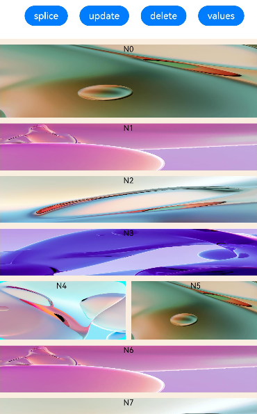
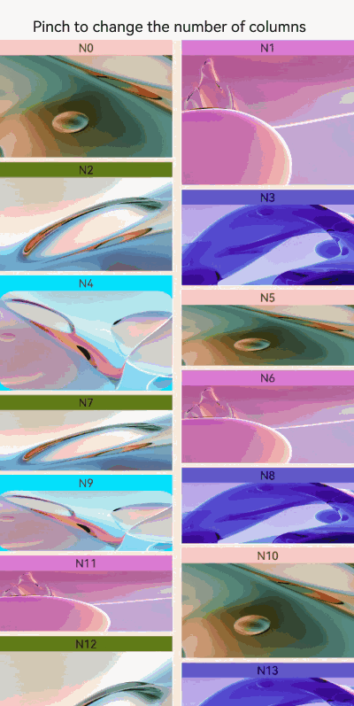

# WaterFlow


The **WaterFlow** component is a water flow container that consists of cells formed by rows and columns and arranges items of different sizes from top to bottom according to the preset rules.


> **NOTE**
>
> This component is supported since API version 9. Updates will be marked with a superscript to indicate their earliest API version.


## Child Components


Only the [FlowItem](ts-container-flowitem.md) child component is allowed, with support for [if/else](../../../quick-start/arkts-rendering-control-ifelse.md), [ForEach](../../../quick-start/arkts-rendering-control-foreach.md), [LazyForEach](../../../quick-start/arkts-rendering-control-lazyforeach.md), and [Repeat](../../../quick-start/arkts-new-rendering-control-repeat.md) rendering control.

>  **NOTE**
>
>  When its **visibility** attribute is set to **None**, a **FlowItem** is not displayed in the container, but its **columnsGap**, **rowsGap**, and **margin** settings are still effective.

## APIs

WaterFlow(options?:  WaterFlowOptions)

**Atomic service API**: This API can be used in atomic services since API version 11.

**System capability**: SystemCapability.ArkUI.ArkUI.Full

**Parameters**

| Name| Type| Mandatory| Description|
| -------- | -------- | -------- | -------- |
| options |  [WaterFlowOptions](#waterflowoptions)| No| Parameters of the **WaterFlow** component.|


## WaterFlowOptions

**System capability**: SystemCapability.ArkUI.ArkUI.Full

| Name    | Type                                       | Mandatory| Description                                    |
| ---------- | ----------------------------------------------- | ------ | -------------------------------------------- |
| footer |  [CustomBuilder](ts-types.md#custombuilder8) | No  | Footer of the **WaterFlow** component.<br>**Atomic service API**: This API can be used in atomic services since API version 11.|
| scroller | [Scroller](ts-container-scroll.md#scroller) | No  | Controller of the scrollable component, bound to the scrollable component.<br>**NOTE**<br>The same scroller cannot be bound to other scrollable components, such as [List](ts-container-list.md), [Grid](ts-container-grid.md), or [Scroll](ts-container-scroll.md).<br>**Atomic service API**: This API can be used in atomic services since API version 11.|
| sections<sup>12+</sup> |  [WaterFlowSections](#waterflowsections12) | No  | Water flow item sections. Different sections can have different numbers of columns.<br>**NOTE**<br>1. When **sections** is used, the **columnsTemplate** and **rowsTemplate** attributes are ignored.<br>2. When **sections** is used, the footer cannot be set separately. The last section can function as the footer.<br>**Atomic service API**: This API can be used in atomic services since API version 12. |
| layoutMode<sup>12+</sup> |[WaterFlowLayoutMode](#waterflowlayoutmode12)| No| Layout mode of the **WaterFlow** component.<br>**NOTE**<br>Default value: [ALWAYS_TOP_DOWN](#waterflowlayoutmode12)<br>**Atomic service API**: This API can be used in atomic services since API version 12.


## WaterFlowSections<sup>12+</sup>

Describes the water flow item sections.

### constructor

constructor()

A constructor used to create a **WaterFlowSections** object.

**Atomic service API**: This API can be used in atomic services since API version 12.

**System capability**: SystemCapability.ArkUI.ArkUI.Full

### splice<sup>12+</sup>

splice(start: number, deleteCount?: number, sections?: Array\<SectionOptions\>): boolean

Changes sections by removing or replacing an existing section and/or adding a section.

**Atomic service API**: This API can be used in atomic services since API version 12.

**System capability**: SystemCapability.ArkUI.ArkUI.Full

**Parameters**

| Name  | Type                           | Mandatory  | Description                  |
| ---- | ----------------------------- | ---- | -------------------- |
| start | number | Yes   | Zero-based index at which the changing starts. The value is converted to an integer.<br>**NOTE**<br>1. A negative index counts back from the end of the section list. If -**WaterFlowSections.length()** <= **start** < **0**, **start** + **array.length** is used.<br>2. If **start** < -**WaterFlowSections.length()**, **0** is used.<br>3. If **start** >= **WaterFlowSections.length()**, a new section is added at the end.|
| deleteCount | number | No   | Number of sections to be deleted from the position specified by **start**.<br>**NOTE**<br>1. If **deleteCount** is omitted, or if its value is greater than or equal to the number of sections from the position specified by **start** to the end of the **WaterFlowSections**, then all sections from the position specified by **start** to the end of the **WaterFlowSections** will be deleted.<br>2. If **deleteCount** is **0** or a negative number, no sections are deleted.|
| sections | Array<[SectionOptions](#sectionoptions12)> | No   | Sections to add to the section list, beginning from the position specified by **start**. If no section is specified, **splice()** will only delete sections from the **WaterFlow** component.|

**Return value**

| Type                                                        | Description                                                        |
| ------------------------------------------------------------ | ------------------------------------------------------------ |
| boolean | Whether the changing is successful. If the value of **itemsCount** in any section to add is not a positive integer, **false** is returned.|


### push<sup>12+</sup>

push(section: SectionOptions): boolean

Adds the specified sections to the end of the **WaterFlow** component.

**Atomic service API**: This API can be used in atomic services since API version 12.

**System capability**: SystemCapability.ArkUI.ArkUI.Full

**Parameters**

| Name  | Type                           | Mandatory  | Description                  |
| ---- | ----------------------------- | ---- | -------------------- |
| section | [SectionOptions](#sectionoptions12) | Yes   | Sections to add to the end of the **WaterFlow** component.|

**Return value**

| Type                                                        | Description                                                        |
| ------------------------------------------------------------ | ------------------------------------------------------------ |
| boolean | Whether the adding is successful. If the value of **itemsCount** in any section to add is not a positive integer, **false** is returned.|

### update<sup>12+</sup>

update(sectionIndex: number, section: SectionOptions): boolean

Updates the configuration of a specified water flow item section.

**Atomic service API**: This API can be used in atomic services since API version 12.

**System capability**: SystemCapability.ArkUI.ArkUI.Full

**Parameters**

| Name  | Type                           | Mandatory  | Description                  |
| ---- | ----------------------------- | ---- | -------------------- |
| sectionIndex | number | Yes   | Zero-based index of the water flow item section to update. The value is converted to an integer.<br>**NOTE**<br>1. A negative index counts back from the end of the section list. If -**WaterFlowSections.length()** <= **sectionIndex** < **0**, **sectionIndex** + **array.length** is used.<br>2. If **sectionIndex** < -**WaterFlowSections.length()**, **0** is used.<br>3. If **sectionIndex** >= **WaterFlowSections.length()**, a new section is added at the end.|
| section | [SectionOptions](#sectionoptions12) | Yes   | New section configuration.|

**Return value**

| Type                                                        | Description                                                        |
| ------------------------------------------------------------ | ------------------------------------------------------------ |
| boolean | Whether the update is successful. If the value of **itemsCount** in any section to add is not a positive integer, **false** is returned.|

### values<sup>12+</sup>

values(): Array\<SectionOptions\>

Obtains the configuration of all sections in the **WaterFlow** component.

**Atomic service API**: This API can be used in atomic services since API version 12.

**System capability**: SystemCapability.ArkUI.ArkUI.Full

**Return value**

| Type                                                        | Description                                                        |
| ------------------------------------------------------------ | ------------------------------------------------------------ |
| Array<[SectionOptions](#sectionoptions12)> | Configuration of all sections in the **WaterFlow** component.|

### length<sup>12+</sup>

length(): number

Obtains the number of sections in the **WaterFlow** component.

**Atomic service API**: This API can be used in atomic services since API version 12.

**System capability**: SystemCapability.ArkUI.ArkUI.Full

**Return value**

| Type                                                        | Description                                                        |
| ------------------------------------------------------------ | ------------------------------------------------------------ |
| number | Number of sections in the **WaterFlow** component.|

## SectionOptions<sup>12+</sup>

Describes the configuration of the water flow item section.

**Atomic service API**: This API can be used in atomic services since API version 12.

**System capability**: SystemCapability.ArkUI.ArkUI.Full

**Parameters**

| Name| Type| Mandatory| Description|
|------|-----|-----|-----|
| itemsCount | number | Yes| Number of water flow items in the section. The value must be a positive integer.|
| crossCount | number | No| Number of columns (in vertical layout) or rows (in horizontal layout).<br>Default value: **1**|
| columnsGap | [Dimension](ts-types.md#dimension10) | No| Gap between columns. If this parameter is not set, the value of **columnsGap** for the water flow is used. If this parameter is set to an invalid value, 0 vp is used.|
| rowsGap | [Dimension](ts-types.md#dimension10) | No| Gap between rows. If this parameter is not set, the value of **rowsGap** for the water flow is used. If this parameter is set to an invalid value, 0 vp is used.|
| margin | [Margin](ts-types.md#margin) \| [Dimension](ts-types.md#dimension10) | No| Padding of the section. A value of the Length type specifies the margin for all the four sides.<br>Default value: **0**<br>Unit: vp<br>When **margin** is set to a percentage, the width of the **WaterFlow** component is used as the base value for the top, bottom, left, and right margins.|
| onGetItemMainSizeByIndex | [GetItemMainSizeByIndex](#getitemmainsizebyindex12) | No| Callback used to obtain the main axis size, in vp, of the water flow item at a specified index during the layout process of the **WaterFlow** component. For a vertical **WaterFlow** component, this size refers to the height, and for a horizontal **WaterFlow** component, it refers to the width.<br>**NOTE**<br>1. When both **onGetItemMainSizeByIndex** and the width or height attribute of the water flow item are used, the main axis size is determined by the return value of **onGetItemMainSizeByIndex**, which will override the main axis length of water flow item.<br>2. Using **onGetItemMainSizeByIndex** can improve the efficiency of jumping to a specific position or index in the **WaterFlow** component. Avoid mixing the use of **onGetItemMainSizeByIndex** with sections that do not have it set, as this can cause layout exceptions.<br>3. If **onGetItemMainSizeByIndex** returns a negative number, the height of the water flow item is 0.|


## GetItemMainSizeByIndex<sup>12+</sup>

type GetItemMainSizeByIndex = (index: number) => number

Obtains the main axis size of a specified water flow item based on its index.

**Atomic service API**: This API can be used in atomic services since API version 12.

**System capability**: SystemCapability.ArkUI.ArkUI.Full

**Parameters**

| Name  | Type                           | Mandatory  | Description                  |
| ---- | ----------------------------- | ---- | -------------------- |
| index | number | Yes   | Index of the target water flow item.|

**Return value**

| Type                                                        | Description                                                        |
| ------------------------------------------------------------ | ------------------------------------------------------------ |
| number | Main axis size, in vp, of the water flow item at the specified index, which is the height for a vertical **WaterFlow** component and the width for a horizontal **WaterFlow** component.|

## WaterFlowLayoutMode<sup>12+</sup>

**Atomic service API**: This API can be used in atomic services since API version 12.

**System capability**: SystemCapability.ArkUI.ArkUI.Full

| Name| Value| Description|
| ------ | ------ | -------------------- |
| ALWAYS_TOP_DOWN | 0 | Default layout mode from top to bottom. The water flow item within the viewport depends on the layout information of all water flow items above it. As such, in cases of redirection or changing the number of columns, it is necessary to calculate the layout information for all water flow items above.|
| SLIDING_WINDOW | 1 | Sliding window layout mode. It only takes into account the layout information within the viewport and has no dependency on water flow items above the viewport. As such, in cases of redirection backward or switching the number of columns, only the layout of water flow items within the viewport needs to be handled. This mode is recommended for applications that frequently switch between different numbers of columns.<br>**NOTE**<br>1. During a non-animated redirection to a distant location, the layout of water flow items is based on the target position, either before or after it. If you then swipe back to the position prior to the redirection, the layout of the content may not be consistent with its previous state. This can lead to misalignment of the top nodes when you swipe back to the top after the redirection. To counteract this issue, in this layout mode, an automatic adjustment of the layout is made after reaching the top of the viewport to ensure that the top is aligned. In cases with multiple sections, the section at the top of the viewport will be adjusted once the swipe action is completed.<br> 2. The mode does not support the use of a scrollbar; even if a scrollbar is set, it will not be displayed.<br> 3. This mode does not support the [scrollTo](ts-container-scroll.md#scrollto) API of [scroller](#waterflowoptions).<br> 4. If a jump action (for example, by calling a non-animated [scrollToIndex](ts-container-scroll.md#scrolltoindex) or [scrollEdge](ts-container-scroll.md#scrolledge)) and an input offset (such as from a swipe gesture or a scrolling animation) are both initiated within the same frame, both will be executed.|


## Attributes

In addition to [universal attributes](ts-universal-attributes-size.md) and [scrollable component common attributes](ts-container-scrollable-common.md#attributes), the following attributes are also supported.

### columnsTemplate

columnsTemplate(value: string)

Sets the number of columns in the layout. If this attribute is not set, one column is used by default.

For example, **'1fr 1fr 2fr'** indicates three columns, with the first column taking up 1/4 of the parent component's full width, the second column 1/4, and the third column 2/4.

You can use **columnsTemplate('repeat(auto-fill,track-size)')** to automatically calculate the number of columns based on the specified column width **track-size**. **repeat** and **auto-fill** are keywords. The units for **track-size** can be px, vp (default), %, or a valid number. For details, see Example 2.

**Atomic service API**: This API can be used in atomic services since API version 11.

**System capability**: SystemCapability.ArkUI.ArkUI.Full

**Parameters**

| Name| Type  | Mandatory| Description                                          |
| ------ | ------ | ---- | ---------------------------------------------- |
| value  | string | Yes  | Number of columns in the layout.<br>Default value: **'1fr'**|

### rowsTemplate

rowsTemplate(value: string)

Sets the number of rows in the layout. If this attribute is not set, one row is used by default.

For example, **'1fr 1fr 2fr'** indicates three rows, with the first row taking up 1/4 of the parent component's full height, the second row 1/4, and the third row 2/4.

You can use **rowsTemplate('repeat(auto-fill,track-size)')** to automatically calculate the number of rows based on the specified row height **track-size**. **repeat** and **auto-fill** are keywords. The units for **track-size** can be px, vp (default), %, or a valid number.

**Atomic service API**: This API can be used in atomic services since API version 11.

**System capability**: SystemCapability.ArkUI.ArkUI.Full

**Parameters**

| Name| Type  | Mandatory| Description                                          |
| ------ | ------ | ---- | ---------------------------------------------- |
| value  | string | Yes  | Number of rows in the layout.<br>Default value: **'1fr'**|

### itemConstraintSize

itemConstraintSize(value: ConstraintSizeOptions)

Sets the size constraints of the child components during layout.

**Atomic service API**: This API can be used in atomic services since API version 11.

**System capability**: SystemCapability.ArkUI.ArkUI.Full

**Parameters**

| Name| Type                                                      | Mandatory| Description      |
| ------ | ---------------------------------------------------------- | ---- | ---------- |
| value  | [ConstraintSizeOptions](ts-types.md#constraintsizeoptions) | Yes  | Size constraints of the child components during layout. If the value specified is less than 0, this parameter does not take effect.<br>**NOTE**<br>1. If both **itemConstraintSize** and the [constraintSize](ts-universal-attributes-size.md#constraintsize) attribute of the **FlowItem** are set, the **minWidth** (or **minHeight**) will be the larger of the two values, and the **maxWidth** (or **maxHeight**) will be the smaller of the two values. The resulting values will then be used as the **constraintSize** for the **FlowItem**. 2. When only **itemConstraintSize** is set, it effectively applies a uniform size constraint to all child components in the **WaterFlow**. 3. The **itemConstraintSize** attribute, once converted to the **constraintSize** attribute of the **FlowItem** through the two methods mentioned above, follows the same rules for taking effect as the universal attribute [constraintSize](./ts-universal-attributes-size.md#constraintsize).|

### columnsGap

columnsGap(value: Length)

Sets the gap between columns.

**Atomic service API**: This API can be used in atomic services since API version 11.

**System capability**: SystemCapability.ArkUI.ArkUI.Full

**Parameters**

| Name| Type                        | Mandatory| Description                         |
| ------ | ---------------------------- | ---- | ----------------------------- |
| value  | [Length](ts-types.md#length) | Yes  | Gap between columns.<br>Default value: **0**|

### rowsGap

rowsGap(value: Length)

Sets the gap between rows.

**Atomic service API**: This API can be used in atomic services since API version 11.

**System capability**: SystemCapability.ArkUI.ArkUI.Full

**Parameters**

| Name| Type                        | Mandatory| Description                         |
| ------ | ---------------------------- | ---- | ----------------------------- |
| value  | [Length](ts-types.md#length) | Yes  | Gap between rows.<br>Default value: **0**|

### layoutDirection

layoutDirection(value: FlexDirection)

Sets the main axis direction of the layout.

**Atomic service API**: This API can be used in atomic services since API version 11.

**System capability**: SystemCapability.ArkUI.ArkUI.Full

**Parameters**

| Name| Type                                               | Mandatory| Description                                             |
| ------ | --------------------------------------------------- | ---- | ------------------------------------------------- |
| value  | [FlexDirection](ts-appendix-enums.md#flexdirection) | Yes  | Main axis direction of the layout.<br>Default value: **FlexDirection.Column**|

The priority of **layoutDirection** is higher than that of **rowsTemplate** and **columnsTemplate**. Depending on the **layoutDirection** settings, there are three layout modes:

- **layoutDirection** is set to **FlexDirection.Column** or **FlexDirection.ColumnReverse**

  In this case, **columnsTemplate** is valid. If it is not set, the default value is used. For example, if **columnsTemplate** is set to **"1fr 1fr"** and **rowsTemplate** **"1fr 1fr 1fr"**, child components are arranged in vertical layout, with the cross axis equally divided into two columns.

- **layoutDirection** set to **FlexDirection.Row** or **FlexDirection.RowReverse**

  In this case, **rowsTemplate** is valid. If it is not set, the default value is used. For example, if **columnsTemplate** is set to **"1fr 1fr"** and **rowsTemplate** **"1fr 1fr 1fr"**, child components are arranged in horizontal layout, with the cross axis equally divided into three columns.

- **layoutDirection** is not set

  In this case, the default value of **layoutDirection** is used, which is **FlexDirection.Column**, and **columnsTemplate** is valid. For example, if **columnsTemplate** is set to **"1fr 1fr"** and **rowsTemplate** **"1fr 1fr 1fr"**, child components are arranged in vertical layout, with the cross axis equally divided into two columns.

### enableScrollInteraction<sup>10+</sup>

enableScrollInteraction(value: boolean)

Sets whether to support scroll gestures. When this attribute is set to **false**, scrolling by finger or mouse is not supported, but the scrolling controller API is not affected.

**Atomic service API**: This API can be used in atomic services since API version 11.

**System capability**: SystemCapability.ArkUI.ArkUI.Full

**Parameters**

| Name| Type   | Mandatory| Description                               |
| ------ | ------- | ---- | ----------------------------------- |
| value  | boolean | Yes  | Whether to support scroll gestures.<br>Default value: **true**|

### nestedScroll<sup>10+</sup>

nestedScroll(value: NestedScrollOptions)

Sets the nested scrolling mode in the forward and backward directions to implement scrolling linkage with the parent component.

**Atomic service API**: This API can be used in atomic services since API version 11.

**System capability**: SystemCapability.ArkUI.ArkUI.Full

**Parameters**

| Name| Type                                                        | Mandatory| Description          |
| ------ | ------------------------------------------------------------ | ---- | -------------- |
| value  | [NestedScrollOptions](ts-container-scrollable-common.md#nestedscrolloptions10) | Yes  | Nested scrolling options.|

### friction<sup>10+</sup>

friction(value: number | Resource)

Sets the friction coefficient. It applies only to gestures in the scrolling area, and it affects only indirectly the scroll chaining during the inertial scrolling process. If this attribute is set to a value less than or equal to 0, the default value is used.

**Atomic service API**: This API can be used in atomic services since API version 11.

**System capability**: SystemCapability.ArkUI.ArkUI.Full

**Parameters**

| Name| Type                                                | Mandatory| Description                                                     |
| ------ | ---------------------------------------------------- | ---- | --------------------------------------------------------- |
| value  | number \| [Resource](ts-types.md#resource) | Yes  | Friction coefficient.<br>Default value: **0.9** for wearable devices and **0.6** for non-wearable devices.<br>Since API version 11, the default value for non-wearable devices is **0.7**.<br>Since API version 12, the default value for non-wearable devices is **0.75**.|

### cachedCount<sup>11+</sup>

cachedCount(value: number)

Number of items to be cached. This attribute is effective only in [LazyForEach](../../../quick-start/arkts-rendering-control-lazyforeach.md). Items that exceed the display and cache range are released. A value less than 0 evaluates to the default value.

**Atomic service API**: This API can be used in atomic services since API version 12.

**System capability**: SystemCapability.ArkUI.ArkUI.Full

**Parameters**

| Name| Type  | Mandatory| Description                                    |
| ------ | ------ | ---- | ---------------------------------------- |
| value  | number | Yes  | Number of water flow items to be preloaded (cached).<br> Default value: **1**|

## Events

In addition to [universal events](ts-universal-events-click.md) and [scrollable component common events](ts-container-scrollable-common.md#events), the following events are also supported.

### onReachStart

onReachStart(event: () => void)

Triggered when the component reaches the start.

**Atomic service API**: This API can be used in atomic services since API version 11.

**System capability**: SystemCapability.ArkUI.ArkUI.Full

### onReachEnd

onReachEnd(event: () => void)

Triggered when the component reaches the end position.

**Atomic service API**: This API can be used in atomic services since API version 11.

**System capability**: SystemCapability.ArkUI.ArkUI.Full

### onScrollFrameBegin<sup>10+</sup>

onScrollFrameBegin(event: (offset: number, state: ScrollState) => { offsetRemain: number; })

Triggered when the component starts to scroll. The input parameters indicate the amount by which the component will scroll. The event handler then works out the amount by which the component needs to scroll based on the real-world situation and returns the result.

This event is triggered when the user starts dragging the component or the component starts inertial scrolling. It is not triggered when the component rebounds, the scrolling controller is used, or the scrollbar is dragged.

**Atomic service API**: This API can be used in atomic services since API version 11.

**System capability**: SystemCapability.ArkUI.ArkUI.Full

**Parameters**

| Name| Type                                                   | Mandatory| Description                      |
| ------ | ------------------------------------------------------- | ---- | -------------------------- |
| offset | number                                                  | Yes  | Amount to scroll by, in vp.|
| state  | [ScrollState](ts-container-list.md#scrollstate) | Yes  | Current scroll state.            |

**Return value**

| Type                    | Description                |
| ------------------------ | -------------------- |
| { offsetRemain: number } | Actual amount by which the component scrolls, in vp.|

### onScrollIndex<sup>11+</sup>

onScrollIndex(event: (first: number, last: number) => void)

Triggered when the first or last item displayed in the component changes. It is triggered once when the component is initialized.

This event is triggered when either of the preceding indexes changes.

**Atomic service API**: This API can be used in atomic services since API version 11.

**System capability**: SystemCapability.ArkUI.ArkUI.Full

**Parameters**

| Name| Type  | Mandatory| Description                                 |
| ------ | ------ | ---- | ------------------------------------- |
| first  | number | Yes  | Index of the first item of the component.|
| last   | number | Yes  | Index of the last item of the component.   |

## Example

### Example 1
This example shows the basic usage of **WaterFlow**:
```ts
// WaterFlowDataSource.ets

// Object that implements the IDataSource API, which is used by the WaterFlow component to load data.
export class WaterFlowDataSource implements IDataSource {
  private dataArray: number[] = []
  private listeners: DataChangeListener[] = []

  constructor() {
    for (let i = 0; i < 100; i++) {
      this.dataArray.push(i)
    }
  }

  // Obtain the data corresponding to the specified index.
  public getData(index: number): number {
    return this.dataArray[index]
  }

  // Notify the controller of data reloading.
  notifyDataReload(): void {
    this.listeners.forEach(listener => {
      listener.onDataReloaded()
    })
  }

  // Notify the controller of data addition.
  notifyDataAdd(index: number): void {
    this.listeners.forEach(listener => {
      listener.onDataAdd(index)
    })
  }

  // Notify the controller of data changes.
  notifyDataChange(index: number): void {
    this.listeners.forEach(listener => {
      listener.onDataChange(index)
    })
  }

  // Notify the controller of data deletion.
  notifyDataDelete(index: number): void {
    this.listeners.forEach(listener => {
      listener.onDataDelete(index)
    })
  }

  // Notify the controller of the data location change.
  notifyDataMove(from: number, to: number): void {
    this.listeners.forEach(listener => {
      listener.onDataMove(from, to)
    })
  }

  // Notify the controller of batch data modification.
  notifyDatasetChange(operations: DataOperation[]): void {
    this.listeners.forEach(listener => {
      listener.onDatasetChange(operations);
    })
  }

  // Obtain the total number of data records.
  public totalCount(): number {
    return this.dataArray.length
  }

  // Register the data change listener.
  registerDataChangeListener(listener: DataChangeListener): void {
    if (this.listeners.indexOf(listener) < 0) {
      this.listeners.push(listener)
    }
  }

  // Unregister the data change listener.
  unregisterDataChangeListener(listener: DataChangeListener): void {
    const pos = this.listeners.indexOf(listener)
    if (pos >= 0) {
      this.listeners.splice(pos, 1)
    }
  }

  // Add data.
  public add1stItem(): void {
    this.dataArray.splice(0, 0, this.dataArray.length)
    this.notifyDataAdd(0)
  }

  // Add an item to the end of the data.
  public addLastItem(): void {
    this.dataArray.splice(this.dataArray.length, 0, this.dataArray.length)
    this.notifyDataAdd(this.dataArray.length - 1)
  }

  // Add an item to the position corresponding to the specified index.
  public addItem(index: number): void {
    this.dataArray.splice(index, 0, this.dataArray.length)
    this.notifyDataAdd(index)
  }

  // Delete the first item.
  public delete1stItem(): void {
    this.dataArray.splice(0, 1)
    this.notifyDataDelete(0)
  }

  // Delete the second item.
  public delete2ndItem(): void {
    this.dataArray.splice(1, 1)
    this.notifyDataDelete(1)
  }

  // Delete the last item.
  public deleteLastItem(): void {
    this.dataArray.splice(-1, 1)
    this.notifyDataDelete(this.dataArray.length)
  }

  // Delete an item at the specified index position.
  public deleteItem(index: number): void {
    this.dataArray.splice(index, 1)
    this.notifyDataDelete(index)
  }

  // Reload data.
  public reload(): void {
    this.dataArray.splice(1, 1)
    this.dataArray.splice(3, 2)
    this.notifyDataReload()
  }
}
```

```ts
// Index.ets
import { WaterFlowDataSource } from './WaterFlowDataSource'

@Entry
@Component
struct WaterFlowDemo {
  @State minSize: number = 80
  @State maxSize: number = 180
  @State fontSize: number = 24
  @State colors: number[] = [0xFFC0CB, 0xDA70D6, 0x6B8E23, 0x6A5ACD, 0x00FFFF, 0x00FF7F]
  scroller: Scroller = new Scroller()
  dataSource: WaterFlowDataSource = new WaterFlowDataSource()
  private itemWidthArray: number[] = []
  private itemHeightArray: number[] = []

  // Calculate the width and height of a water flow item.
  getSize() {
    let ret = Math.floor(Math.random() * this.maxSize)
    return (ret > this.minSize ? ret : this.minSize)
  }

  // Set the width and height array of the water flow item.
  setItemSizeArray() {
    for (let i = 0; i < 100; i++) {
      this.itemWidthArray.push(this.getSize())
      this.itemHeightArray.push(this.getSize())
    }
  }

  aboutToAppear() {
    this.setItemSizeArray()
  }

  @Builder
  itemFoot() {
    Column() {
      Text(`Footer`)
        .fontSize(10)
        .backgroundColor(Color.Red)
        .width(50)
        .height(50)
        .align(Alignment.Center)
        .margin({ top: 2 })
    }
  }

  build() {
    Column({ space: 2 }) {
      WaterFlow() {
        LazyForEach(this.dataSource, (item: number) => {
          FlowItem() {
            Column() {
              Text("N" + item).fontSize(12).height('16')
              // The image is displayed only when there is a corresponding JPG file.
              Image('res/waterFlowTest(' + item % 5 + ').jpg')
                .objectFit(ImageFit.Fill)
                .width('100%')
                .layoutWeight(1)
            }
          }
          .onAppear(() => {
            // Add data in advance when scrolling is about to end.
            if (item + 20 == this.dataSource.totalCount()) {
              for (let i = 0; i < 100; i++) {
                this.dataSource.addLastItem()
              }
            }
          })
          .width('100%')
          .height(this.itemHeightArray[item % 100])
          .backgroundColor(this.colors[item % 5])
        }, (item: string) => item)
      }
      .columnsTemplate("1fr 1fr")
      .columnsGap(10)
      .rowsGap(5)
      .backgroundColor(0xFAEEE0)
      .width('100%')
      .height('100%')
      .onReachStart(() => {
        console.info('waterFlow reach start')
      })
      .onScrollStart(() => {
        console.info('waterFlow scroll start')
      })
      .onScrollStop(() => {
        console.info('waterFlow scroll stop')
      })
      .onScrollFrameBegin((offset: number, state: ScrollState) => {
        console.info('waterFlow scrollFrameBegin offset: ' + offset + ' state: ' + state.toString())
        return { offsetRemain: offset }
      })
    }
  }
}
```


### Example 2
This example shows the usage of **auto-fill**:
```ts
//index.ets
import { WaterFlowDataSource } from './WaterFlowDataSource'

@Entry
@Component
struct WaterFlowDemo {
  @State minSize: number = 80
  @State maxSize: number = 180
  @State colors: number[] = [0xFFC0CB, 0xDA70D6, 0x6B8E23, 0x6A5ACD, 0x00FFFF, 0x00FF7F]
  dataSource: WaterFlowDataSource = new WaterFlowDataSource()
  private itemWidthArray: number[] = []
  private itemHeightArray: number[] = []

  // Calculate the width and height of a water flow item.
  getSize() {
    let ret = Math.floor(Math.random() * this.maxSize)
    return (ret > this.minSize ? ret : this.minSize)
  }

  // Set the width and height array of the water flow item.
  setItemSizeArray() {
    for (let i = 0; i < 100; i++) {
      this.itemWidthArray.push(this.getSize())
      this.itemHeightArray.push(this.getSize())
    }
  }

  aboutToAppear() {
    this.setItemSizeArray()
  }

  build() {
    Column({ space: 2 }) {
      WaterFlow() {
        LazyForEach(this.dataSource, (item: number) => {
          FlowItem() {
            Column() {
              Text("N" + item).fontSize(12).height('16')
              Image('res/waterFlowTest(' + item % 5 + ').jpg')
            }
          }
          .width('100%')
          .height(this.itemHeightArray[item % 100])
          .backgroundColor(this.colors[item % 5])
        }, (item: string) => item)
      }
      .columnsTemplate('repeat(auto-fill,80)')
      .columnsGap(10)
      .rowsGap(5)
      .padding({left:5})
      .backgroundColor(0xFAEEE0)
      .width('100%')
      .height('100%')
    }
  }
}
```


### Example 3
This example shows how to use **WaterFlowSections**.
```ts
// Index.ets
import { WaterFlowDataSource } from './WaterFlowDataSource'

@Reusable
@Component
struct ReusableFlowItem {
  @State item: number = 0

  // Invoked when a reusable custom component is re-added to the component tree from the reuse cache. The component state variable can be updated here to display the correct content.
  aboutToReuse(params: Record<string, number>) {
    this.item = params.item;
    console.info('Reuse item:' + this.item)
  }

  aboutToAppear() {
    console.info('new item:' + this.item)
  }

  build() {
    Image('res/waterFlowTest(' + this.item % 5 + ').jpg')
        .overlay('N' + this.item, { align: Alignment.Top })
        .objectFit(ImageFit.Fill)
        .width('100%')
        .layoutWeight(1)
  }
}

@Entry
@Component
struct WaterFlowDemo {
  minSize: number = 80
  maxSize: number = 180
  fontSize: number = 24
  colors: number[] = [0xFFC0CB, 0xDA70D6, 0x6B8E23, 0x6A5ACD, 0x00FFFF, 0x00FF7F]
  scroller: Scroller = new Scroller()
  dataSource: WaterFlowDataSource = new WaterFlowDataSource()
  dataCount: number = this.dataSource.totalCount()
  private itemHeightArray: number[] = []
  @State sections: WaterFlowSections = new WaterFlowSections()
  sectionMargin: Margin = { top: 10, left: 5, bottom: 10, right: 5 }
  oneColumnSection: SectionOptions = {
    itemsCount: 4,
    crossCount: 1,
    columnsGap: '5vp',
    rowsGap: 10,
    margin: this.sectionMargin,
    onGetItemMainSizeByIndex: (index: number) => {
      return this.itemHeightArray[index % 100]
    }
  }
  twoColumnSection: SectionOptions = {
    itemsCount: 2,
    crossCount: 2,
    onGetItemMainSizeByIndex: (index: number) => {
      return 100
    }
  }
  lastSection: SectionOptions = {
    itemsCount: 20,
    crossCount: 2,
    onGetItemMainSizeByIndex: (index: number) => {
      return this.itemHeightArray[index % 100]
    }
  }

  // Calculate the FlowItem height.
  getSize() {
    let ret = Math.floor(Math.random() * this.maxSize)
    return (ret > this.minSize ? ret : this.minSize)
  }

  // Set the height array for FlowItems.
  setItemSizeArray() {
    for (let i = 0; i < 100; i++) {
      this.itemHeightArray.push(this.getSize())
    }
  }

  aboutToAppear() {
    this.setItemSizeArray()
    // Initialize the water flow section information.
    let sectionOptions: SectionOptions[] = []
    let count = 0
    let oneOrTwo = 0
    while (count < this.dataCount) {
      if (this.dataCount - count < 20) {
        this.lastSection.itemsCount = this.dataCount - count
        sectionOptions.push(this.lastSection)
        break;
      }
      if (oneOrTwo++ % 2 == 0) {
        sectionOptions.push(this.oneColumnSection)
        count += this.oneColumnSection.itemsCount
      } else {
        sectionOptions.push(this.twoColumnSection)
        count += this.twoColumnSection.itemsCount
      }
    }
    this.sections.splice(0, 0, sectionOptions)
  }

  build() {
    Column({ space: 2 }) {
      Row() {
        Button('splice')
          .height('5%')
          .onClick(() => {
            // Replace all sections with a new section. Ensure that the number of data array items in LazyForEach is the same as the value of itemsCount of the new section.
            let totalCount: number = this.dataSource.totalCount()
            let newSection: SectionOptions = {
              itemsCount: totalCount,
              crossCount: 2,
              onGetItemMainSizeByIndex: (index: number) => {
                return this.itemHeightArray[index % 100]
              }
            }
            let oldLength: number = this.sections.length()
            this.sections.splice(0, oldLength, [newSection])
          })
          .margin({ top: 10, left: 20 })
        Button('update')
          .height('5%')
          .onClick(() => {
            // Add four FlowItems to the second section. Ensure that the number of data array items in LazyForEach is the same as the sum of itemsCount values of all sections.
            let newSection: SectionOptions = {
              itemsCount: 6,
              crossCount: 3,
              columnsGap: 5,
              rowsGap: 10,
              margin: this.sectionMargin,
              onGetItemMainSizeByIndex: (index: number) => {
                return this.itemHeightArray[index % 100]
              }
            }
            this.dataSource.addItem(this.oneColumnSection.itemsCount)
            this.dataSource.addItem(this.oneColumnSection.itemsCount + 1)
            this.dataSource.addItem(this.oneColumnSection.itemsCount + 2)
            this.dataSource.addItem(this.oneColumnSection.itemsCount + 3)
            const result: boolean = this.sections.update(1, newSection)
            console.info('update:' + result)
          })
          .margin({ top: 10, left: 20 })
        Button('delete')
          .height('5%')
          .onClick(() => {
            // Click Update and then Delete.
            let newSection: SectionOptions = {
              itemsCount: 2,
              crossCount: 2,
              columnsGap: 5,
              rowsGap: 10,
              margin: this.sectionMargin,
              onGetItemMainSizeByIndex: (index: number) => {
                return this.itemHeightArray[index % 100]
              }
            }
            this.dataSource.deleteItem(this.oneColumnSection.itemsCount)
            this.dataSource.deleteItem(this.oneColumnSection.itemsCount)
            this.dataSource.deleteItem(this.oneColumnSection.itemsCount)
            this.dataSource.deleteItem(this.oneColumnSection.itemsCount)
            this.sections.update(1, newSection)
          })
          .margin({ top: 10, left: 20 })
        Button('values')
          .height('5%')
          .onClick(() => {
            const sections: Array<SectionOptions> = this.sections.values();
            for (const value of sections) {
              console.log(JSON.stringify(value));
            }
            console.info('count:' + this.sections.length())
          })
          .margin({ top: 10, left: 20 })
      }.margin({ bottom: 20 })

      WaterFlow({ scroller: this.scroller, sections: this.sections }) {
        LazyForEach(this.dataSource, (item: number) => {
          FlowItem() {
            ReusableFlowItem({ item: item })
          }
          .width('100%')
          // The value of onGetItemMainSizeByIndex is used.
          // .height(this.itemHeightArray[item % 100])
          .backgroundColor(this.colors[item % 5])
        }, (item: string) => item)
      }
      .columnsTemplate('1fr 1fr') // This attribute is ineffective when the sections parameter is used.
      .columnsGap(10)
      .rowsGap(5)
      .backgroundColor(0xFAEEE0)
      .width('100%')
      .height('100%')
      .layoutWeight(1)
      .onScrollIndex((first: number, last: number) => {
        // Add data in advance when scrolling is about to end.
        if (last + 20 >= this.dataSource.totalCount()) {
          for (let i = 0; i < 100; i++) {
            this.dataSource.addLastItem()
          }
          // After the data source is updated, update sections synchronously and change the number of FlowItems in the last section.
          const sections: Array<SectionOptions> = this.sections.values();
          let newSection: SectionOptions = sections[this.sections.length() - 1];
          newSection.itemsCount += 100;
          this.sections.update(-1, newSection);
        }
      })
    }
  }
}
```



### Example 4
This example implements the feature of using the pinch gesture to change the number of columns.

```ts
// Index.ets
import { WaterFlowDataSource } from './WaterFlowDataSource'

@Reusable
@Component
struct ReusableFlowItem {
  @State item: number = 0

  // Invoked when a reusable custom component is re-added to the component tree from the reuse cache. The component state variable can be updated here to display the correct content.
  aboutToReuse(params: Record<string, number>) {
    this.item = params.item;
    console.info('Reuse item:' + this.item)
  }

  aboutToAppear() {
    console.info('item:' + this.item)
  }

  build() {
    Column() {
      Text("N" + this.item).fontSize(12).height('16')
      Image('res/waterFlow (' + this.item % 5 + ').JPG')
        .objectFit(ImageFit.Fill)
        .width('100%')
        .layoutWeight(1)
    }
  }
}

@Entry
@Component
struct WaterFlowDemo {
  minSize: number = 80
  maxSize: number = 180
  colors: number[] = [0xFFC0CB, 0xDA70D6, 0x6B8E23, 0x6A5ACD, 0x00FFFF, 0x00FF7F]
  @State columns: number = 2
  dataSource: WaterFlowDataSource = new WaterFlowDataSource()
  private itemWidthArray: number[] = []
  private itemHeightArray: number[] = []

  // Calculate the width and height of a water flow item.
  getSize() {
    let ret = Math.floor(Math.random() * this.maxSize)
    return (ret > this.minSize ? ret : this.minSize)
  }

  // Set the width and height array of the water flow item.
  setItemSizeArray() {
    for (let i = 0; i < 100; i++) {
      this.itemWidthArray.push(this.getSize())
      this.itemHeightArray.push(this.getSize())
    }
  }

  aboutToAppear() {
    let lastCount = AppStorage.get<number>('columnsCount')
    if (typeof lastCount != 'undefined') {
      this.columns = lastCount
    }
    this.setItemSizeArray()
  }

  build() {
    Column({ space: 2 }) {
      Row() {
        Text('Pinch to change the number of columns')
          .height('5%')
          .margin({ top: 10, left: 20 })
      }

      WaterFlow() {
        LazyForEach(this.dataSource, (item: number) => {
          FlowItem() {
            ReusableFlowItem({ item: item })
          }
          .width('100%')
          .height(this.itemHeightArray[item % 100])
          .backgroundColor(this.colors[item % 5])
        }, (item: string) => item)
      }
      .columnsTemplate('1fr '.repeat(this.columns))
      .columnsGap(10)
      .rowsGap(5)
      .backgroundColor(0xFAEEE0)
      .width('100%')
      .height('100%')
      .layoutWeight(1)
      // Switching the number of columns triggers a reordering animation for the item positions.
      .animation({
        duration: 300,
        curve: Curve.Smooth
      })
      .priorityGesture(
        PinchGesture()
          .onActionEnd((event: GestureEvent) => {
            console.info('end scale:' + event.scale)
            // When a user performs a pinch-to-zoom gesture by moving their fingers apart, and the number of columns decreases to a certain threshold (in this case, 2), it will cause the items to enlarge.
            if (event.scale > 2) {
              this.columns--
            } else if (event.scale < 0.6) {
              this.columns++
            }
            // You can set the maximum and minimum number of columns based on the device screen width. Here, the minimum number of columns is 1, and the maximum number of columns is 4.
            this.columns = Math.min(4, Math.max(1, this.columns));
            AppStorage.setOrCreate<number>('columnsCount', this.columns)
          })
      )
    }
  }
}
```


