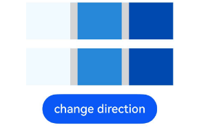

# WithEnv: Environment Variable Container

<!--Kit: ArkUI-->
<!--Subsystem: ArkUI-->
<!--Owner: @song-song-song-->
<!--Designer: @fenglinbailu-->
<!--Tester: @khq-->
<!--Adviser: @zhang_yixin13-->
<!-- md-trans-meta sourceCommit=470aeff66a0d6cd0ee98d903c413bdf0af6e810c translatedAt=2026-08-11T01:45:52.782Z pushedAt=2026-08-13T11:31:24.061Z -->

The **WithEnv** component is used to set a local environment variable scope for a child component tree. Developers can use this component to provide custom environment variables for descendant components, or set system environment variables.

**Since:** 26.0.0

> **NOTE**
>
> - This API can only be used in the stage model.
> - Custom environment variables can be set through [customEnv](#customenv).
> - System environment variable keys can be set through [env](#env). They are stored in [WritableEnvKey](ts-env-system-property.md#writableenvkey).
> - When **WithEnv** is nested, the nearest scope takes effect for environment variables with the same name.

## Child Components

This component supports only one child component.

## APIs

WithEnv()

Sets a local environment variable scope container.

**Since:** 26.0.0

**Atomic service API:** This API can be used in atomic services since API version 26.0.0.

**System capability:** SystemCapability.ArkUI.ArkUI.Full

**Model restriction:** This API can be used only in the stage model.

## Attributes

Supports the following **WithEnv**-specific attributes.

### env

env&lt;T&gt;(key: WritableSystemEnvKey&lt;T&gt;, value: T)

Sets the system environment variable within the scope. The currently officially supported system environment variable keys are **WritableEnvKey.FONT_SCALE** and **WritableEnvKey.DIRECTION**.

> **NOTE**
>
> - `WithEnv.env(WritableEnvKey.FONT_SCALE, value)` provides a local font scale for components within the scope of the trailing closure. `value` is of the number type, indicating the font scale multiplier. If the set `value` is less than 0, it is treated as 0.
> - The effective font scale of components within the scope of the **WithEnv** trailing closure is jointly determined by the value set through the **env** attribute with the key **WritableEnvKey.FONT_SCALE** and the component's own font scale constraints. These constraints can be set through the component's `minFontScale` and `maxFontScale` attributes, or through global configurations such as [fontSizeMaxScale](../../../quick-start/app-configuration-file.md) in the app configuration. The final effective value is the value of **WritableEnvKey.FONT_SCALE** within the range of each constraint.

**Since:** 26.0.0

**Atomic service API:** This API can be used in atomic services since API version 26.0.0.

**System capability:** SystemCapability.ArkUI.ArkUI.Full

**Model Constraints:** This API can be used only in the stage model.

**Parameters**

| Name | Type | Mandatory | Description |
| ----- | ----- | ---- | ---- |
| key | [WritableSystemEnvKey&lt;T&gt;](ts-env-system-property.md#writablesystemenvkeyt) | Yes | System environment variable key. Currently, **WritableEnvKey.FONT_SCALE** and **WritableEnvKey.DIRECTION** are officially supported. |
| value | T | Yes | System environment variable value. The type T of **value** corresponds to the type T in **WritableSystemEnvKey&lt;T&gt**;. When `key` is `WritableEnvKey.FONT_SCALE`, the type of `value` is number. When `key` is `WritableEnvKey.DIRECTION`, the type of `value` is Direction. |

### customEnv

customEnv&lt;T&gt;(key: CustomEnvKey&lt;T&gt;, value: T)

Sets a custom environment variable that can be read by descendant custom components within the scope.

**Since:** 26.0.0

**Atomic service API:** This API can be used in atomic services since API version 26.0.0.

**System capability:** SystemCapability.ArkUI.ArkUI.Full

**Model restriction:** This API can be used only in the stage model.

**Parameters**

| Name | Type | Mandatory | Description |
| ----- | ----- | ---- | ---- |
| key | [CustomEnvKey](ts-custom-env-property.md#customenvkeys)&lt;T&gt; | Yes | Key of the custom environment variable. |
| value | T | Yes | Value of the custom environment variable. The type T of value corresponds to the type T of CustomEnvKey&lt;T&gt;. |

## Events

The [universal events](ts-component-general-events.md) are not supported.

## Examples

### Example 1: Setting Local Font Scale

This example uses `env(WritableEnvKey.FONT_SCALE, value)` to set a local font scale for components within the scope.

Since API version 26.0.0, the **env** attribute and the key **WritableEnvKey.FONT_SCALE** are added.

```ts
// xxx.ets
import { WithEnv } from '@kit.ArkUI';
@Entry
@Component
struct WithEnvExample1 {
  @State fontScale: number = 1.0;

  build() {
    Column({ space: 12 }) {
      Row({ space: 8 }) {
        Button('Zoom out 0.5x')
          .onClick(() => {
            this.fontScale = 0.5;
          })
        Button('Normal 1.0x')
          .onClick(() => {
            this.fontScale = 1.0;
          })
        Button('Zoom in 1.5x')
          .onClick(() => {
            this.fontScale = 1.5;
          })
      }

      WithEnv() {
        Column({ space: 8 }) {
          Text('Text within the current font scale scope')
            .fontSize(16)
          Text('This text is also affected by the WithEnv font scaling')
            .fontSize(14)
            .fontColor('#99182431')
        }
        .width('100%')
        .alignItems(HorizontalAlign.Start)
      }
      .env(WritableEnvKey.FONT_SCALE, this.fontScale) // Set the local font scale ratio.
    }
    .padding(12)
    .width('100%')
  }
}
```

<!--Del-->![textFontScaleEnv] (figures/textFontScaleEnv.png)<!--DelEnd-->

### Example 2: Setting Local Layout Direction

This example uses `env(WritableEnvKey.DIRECTION, value)` to set the local layout direction for components within the scope.

Since API version 26.0.0, the **env** attribute and the key **WritableEnvKey.DIRECTION** are added.

```ts
// xxx.ets
import { WithEnv } from '@kit.ArkUI';

@Entry
@Component
struct WithEnvExample2 {
  @State directionValue: Direction = Direction.Ltr;

  build() {
    Column({ space: 12 }) {
      Row({ space: 10 }) {
        Column().backgroundColor('#F0FAFF').width(60).height('100%')
        Column().backgroundColor('#2787D9').width(60).height('100%')
        Column().backgroundColor('#004AAF').width(60).height('100%')

      }.backgroundColor('#D5D5D5').width(200).height(50)

      WithEnv() {
        Row({ space: 10 }) {
          Column().backgroundColor('#F0FAFF').width(60).height('100%')
          Column().backgroundColor('#2787D9').width(60).height('100%')
          Column().backgroundColor('#004AAF').width(60).height('100%')

        }.backgroundColor('#D5D5D5').width(200).height(50)
      }
      .env(WritableEnvKey.DIRECTION, this.directionValue) // Set local layout direction.

      Button('change direction').onClick(() => {
        if (this.directionValue === Direction.Ltr) {
          this.directionValue = Direction.Rtl;
        } else {
          this.directionValue = Direction.Ltr;
        }
      })
    }
    .width('80%')
    .height('30%')
  }
}
```


<!--no_check-->