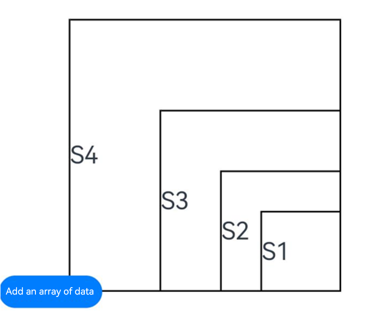

# Custom Component Layout

The custom layout of a custom component is used to lay out its child components through data calculation.

> **NOTE**
>
> The initial APIs of this module are supported since API version 9. Newly added APIs will be marked with a superscript to indicate their earliest API version.
>
> A custom component is considered to have a custom layout when either of the **onMeasureSize** or **onPlaceChildren** methods is implemented. For complete layout control, implement both methods simultaneously. For details about the specifications, see the API descriptions for these methods.
>
> Since API version 20, when child components within a custom layout have their [LayoutPolicy](ts-types.md#layoutpolicy15) object's **fixAtIdealSize** property set to **true**, these components will ignore any layout constraints from their parent component. Instead, they will adhere to the size ranges explicitly defined by the developer in the custom layout implementation.
> 
> Lazy loading (including [Repeat](../../../ui/state-management/arkts-new-rendering-control-repeat.md) and [LazyForEach](../../../ui/state-management/arkts-rendering-control-lazyforeach.md)) is not supported in custom layouts.

## onMeasureSize<sup>10+</sup>

onMeasureSize?(selfLayoutInfo: GeometryInfo, children: Array&lt;Measurable&gt;, constraint: ConstraintSizeOptions): SizeResult

Invoked when the custom component needs to determine its size. Through this callback the component receives its layout information and size constraints from the ArkUI framework. State variables should not be changed in this callback.

**Atomic service API**: This API can be used in atomic services since API version 11.

**System capability**: SystemCapability.ArkUI.ArkUI.Full

**Parameters**

| Name        | Type                                                      | Mandatory|Description                                                        |
| -------------- | ---------------------------------------------------------- | ---|------------------------------------------------------------ |
| selfLayoutInfo | [GeometryInfo](#geometryinfo10)                            | Yes|Information about the component's computed layout properties after measurement.<br>**NOTE**<br>During the first layout, the component will use its own set attributes as the basis for layout.                                   |
| children       | Array&lt;[Measurable](#measurable10)&gt;                   | Yes|Array containing layout information for all child components after measurement.<br>**NOTE**<br>When a child component does not have its layout information set, it retains the previous layout settings or, if no previous layout settings are available, stays at the default size of 0.|
| constraint     | [ConstraintSizeOptions](ts-types.md#constraintsizeoptions) | Yes|Layout constraints applied to the component.                                      |

**Return value**

| Type                       | Description          |
| --------------------------- | -------------- |
| [SizeResult](#sizeresult10) | Component size information.|

## onPlaceChildren<sup>10+</sup>

onPlaceChildren?(selfLayoutInfo: GeometryInfo, children: Array&lt;Layoutable&gt;, constraint: ConstraintSizeOptions):void

Invoked when the custom component needs to determine the positions of its child components. Through this callback the component receives its child component size constraints from the ArkUI framework. State variables should not be changed in this callback.

**Atomic service API**: This API can be used in atomic services since API version 11.

**System capability**: SystemCapability.ArkUI.ArkUI.Full

**Parameters**

| Name           | Type                                                        |Mandatory| Description              |
|----------------|------------------------------------------------------------|---|------------------|
| selfLayoutInfo | [GeometryInfo](#geometryinfo10)                            |Yes|Information about the component's computed layout properties after measurement.        |
| children       | Array&lt;[Layoutable](#layoutable10)&gt;                   |Yes|Array containing layout information for all child components after measurement.        |
| constraint     | [ConstraintSizeOptions](ts-types.md#constraintsizeoptions) |Yes|Layout constraints applied to the component.|

**Example**

See the [example for customizing a layout](#example).

## GeometryInfo<sup>10+</sup>

Provides the parent component layout information. Inherits from [SizeResult](#sizeresult10).

**Atomic service API**: This API can be used in atomic services since API version 11.

**System capability**: SystemCapability.ArkUI.ArkUI.Full

| Name         | Type     |Read-Only|Optional| Description                 |
|-------------|-----------|------|------|---------------------|
| borderWidth | [EdgeWidth](ts-types.md#edgewidths9) |No|No| Border width of the parent component.<br>Unit: vp           |
| margin      | [Margin](ts-types.md#margin)       | No|No|Margin of the parent component.<br>Unit: vp      |
| padding     | [Padding](ts-types.md#padding)   |No|No| Padding of the parent component.<br>Unit: vp|

## Layoutable<sup>10+</sup>

Provides the child component layout information.

**System capability**: SystemCapability.ArkUI.ArkUI.Full

### Name

| Name        | Type      | Read-Only|Optional|  Description                                                     |
|--------------|---------------------------------- | ------|-----------------------------------------------------|---------------------|
| measureResult| [MeasureResult](#measureresult10) |   No|No| Measurement result of the child component.<br>**Atomic service API**: This API can be used in atomic services since API version 11.<br>Unit: vp    |
| uniqueId<sup>18+</sup>| number | No|No| Unique ID that the system assigns to the child component.<br>Value range: [0, +∞).<br>**Atomic service API**: This API can be used in atomic services since API version 18.|

### layout

layout(position: Position)

Applies the specified position information to the child component.

**Atomic service API**: This API can be used in atomic services since API version 11.

**System capability**: SystemCapability.ArkUI.ArkUI.Full

**Parameters**

| Name        | Type                                                   | Mandatory                |Description        |
|-----------------|---------------------------------------------------------|---------------------|-------------|
|   position      | [Position](ts-types.md#position)                        | Yes                 |   Absolute position.  |

### getMargin<sup>12+</sup>

getMargin() : DirectionalEdgesT\<number>

Obtains the margin values of the child component.

**Atomic service API**: This API can be used in atomic services since API version 12.

**System capability**: SystemCapability.ArkUI.ArkUI.Full

**Return value**

| Type                         | Description                                       |
|------------------------------------|---------------------------------------------|
| [DirectionalEdgesT&lt;number&gt;](#directionaledgestt12)  |  Margin values of the child component.  |

 ### getPadding<sup>12+</sup>

getPadding() : DirectionalEdgesT\<number>

 Obtains the padding values of the child component.

**Atomic service API**: This API can be used in atomic services since API version 12.

**System capability**: SystemCapability.ArkUI.ArkUI.Full

 **Return value**

| Type                         | Description                                       |
|------------------------------------|---------------------------------------------|
| [DirectionalEdgesT&lt;number&gt;](#directionaledgestt12)  |  Padding values of the child component. |

### getBorderWidth<sup>12+</sup>

getBorderWidth() : DirectionalEdgesT\<number>

Obtains the border widths of the child component.

**Atomic service API**: This API can be used in atomic services since API version 12.

**System capability**: SystemCapability.ArkUI.ArkUI.Full

**Return value**

| Type                         | Description                                       |
|------------------------------------|---------------------------------------------|
| [DirectionalEdgesT&lt;number&gt;](#directionaledgestt12)  |  Border widths of the child component. |

## Measurable<sup>10+</sup>

Provides the child component position information.

**Atomic service API**: This API can be used in atomic services since API version 11.

**System capability**: SystemCapability.ArkUI.ArkUI.Full

### Name

**Atomic service API**: This API can be used in atomic services since API version 18.

**System capability**: SystemCapability.ArkUI.ArkUI.Full

| Name        | Type      | Mandatory     |  Description                                                     |
|--------------|---------------------------------- | -----------------------------------------------|---------------------|
| uniqueId<sup>18+</sup>| number | No| Unique ID that the system assigns to the child component.|

### measure

 measure(constraint: ConstraintSizeOptions) : MeasureResult

 Imposes size constraints on the child component.

 **Atomic service API**: This API can be used in atomic services since API version 11.

 **System capability**: SystemCapability.ArkUI.ArkUI.Full


**Parameters**

| Name        | Type                                                   | Mandatory                |Description        |
|-----------------|---------------------------------------------------------|---------------------|-------------|
|   constraint    | [ConstraintSizeOptions](ts-types.md#constraintsizeoptions)  | Yes           |   Size constraint. |

**Return value**

 | Type                              | Description                    |
 |------------------------------------|-------------------------|
 |[MeasureResult](#measureresult10)   | Provides the measurement result of the component.  |

 ### getMargin<sup>12+</sup>

 getMargin() : DirectionalEdgesT\<number\>

 Obtains the margin values of the child component.

**Atomic service API**: This API can be used in atomic services since API version 12.

**System capability**: SystemCapability.ArkUI.ArkUI.Full

**Return value**

 | Type                              | Description                    |
 |------------------------------------|-------------------------|
 |[DirectionalEdgesT&lt;number&gt;](#directionaledgestt12)  | Margin values of the child component.  |

### getPadding<sup>12+</sup>

getPadding() : DirectionalEdgesT\<number\>

Obtains the padding values of the child component.

**Atomic service API**: This API can be used in atomic services since API version 12.

**System capability**: SystemCapability.ArkUI.ArkUI.Full

**Return value**

 | Type                              | Description                    |
 |------------------------------------|-------------------------|
 |[DirectionalEdgesT&lt;number&gt;](#directionaledgestt12)  | Padding values of the child component.  |

 ### getBorderWidth<sup>12+</sup>

getBorderWidth() : DirectionalEdgesT\<number\>

Obtains the border widths of the child component.

**Atomic service API**: This API can be used in atomic services since API version 12.

**System capability**: SystemCapability.ArkUI.ArkUI.Full

**Return value**

 | Type                              | Description                    |
 |------------------------------------|-------------------------|
 |[DirectionalEdgesT&lt;number&gt;](#directionaledgestt12)  | Border widths of the child component.|


## MeasureResult<sup>10+</sup>

Provides the measurement result of the component. This API inherits from [SizeResult] (#sizeresult10).

**Atomic service API**: This API can be used in atomic services since API version 11.

**System capability**: SystemCapability.ArkUI.ArkUI.Full

## SizeResult<sup>10+</sup>

Provides the component size information.

**Atomic service API**: This API can be used in atomic services since API version 11.

**System capability**: SystemCapability.ArkUI.ArkUI.Full

| Name    | Type  |Read-Only|Optional| Description   |
|--------|--------|------|------|-------|
| width  | number | No|No|Width obtained from the measurement result.<br>Unit: vp|
| height | number | No|No|Height obtained from the measurement result.<br>Unit: vp|

## DirectionalEdgesT\<T><sup>12+</sup>

Defines the directional edges.

**Widget capability**: This API can be used in ArkTS widgets since API version 12.

**Atomic service API**: This API can be used in atomic services since API version 12.

**System capability**: SystemCapability.ArkUI.ArkUI.Full

| Name  | Type|Read-Only|Optional| Description            |
| ------ | ---- |------|------| ---------------- |
| start   | T    |No|No| Start edge. It is the left edge if the direction is left-to-right and the right edge if the direction is right-to-left.|
| end    | T    | No|No|End edge. It is the right edge if the direction is left-to-right and the left edge if the direction is right-to-left.|
| top  | T    | No|No|Top edge.|
| bottom | T    | No|No|Bottom edge.|

> **NOTE**
>
>- The custom layout does not support the LazyForEach syntax.
>- When a custom layout is created in builder mode, only **this.builder()** is allowed in the **build()** method of a custom component, as shown in the recommended usage in the example below.
>- The size parameters of the parent component (custom component), except **aspectRatio**, are at a lower priority than those specified by **onMeasureSize**.
>- The position parameters of the child component, except **offset**, **position**, and **markAnchor**, are at a lower priority than those specified by **onPlaceChildren**, and do not take effect.
>- When using the custom layout method, you must call **onMeasureSize** and **onPlaceChildren** at the same time for the layout to display properly.

## onLayout<sup>(deprecated)</sup>

onLayout?(children: Array&lt;LayoutChild&gt;, constraint: ConstraintSizeOptions): void

Invoked when the custom component lays out its child components. Through this callback the component receives its child component layout information and size constraint from the ArkUI framework. State variables should not be changed in this callback.

This API is supported since API version 9 and deprecated since API version 10. You are advised to use [onPlaceChildren](#onplacechildren10) instead.

**Widget capability**: This API can be used in ArkTS widgets since API version 9.

**System capability**: SystemCapability.ArkUI.ArkUI.Full

**Parameters**

| Name       | Type                                                        | Mandatory|Description              |
|------------|------------------------------------------------------------|------|------------------|
| children   | Array&lt;[LayoutChild](#layoutchilddeprecated)&gt;                | Yes | Child component layout information.        |
| constraint | [ConstraintSizeOptions](ts-types.md#constraintsizeoptions) | Yes |Size constraint of the parent component.|

## onMeasure<sup>(deprecated)</sup>

onMeasure?(children: Array&lt;LayoutChild&gt;, constraint: ConstraintSizeOptions): void

Invoked when the custom component needs to determine its size. Through this callback the component receives its child component layout information and its own size constraints from the ArkUI framework. State variables should not be changed in this callback.

This API is supported since API version 9 and deprecated since API version 10. You are advised to use [onMeasureSize](#onmeasuresize10) instead.

**Widget capability**: This API can be used in ArkTS widgets since API version 9.

**System capability**: SystemCapability.ArkUI.ArkUI.Full

**Parameters**

| Name       | Type                                                        |Mandatory| Description              |
|------------|------------------------------------------------------------|------|------------------|
| children   | Array&lt;[LayoutChild](#layoutchilddeprecated)&gt;                  | Yes |Child component layout information.        |
| constraint | [ConstraintSizeOptions](ts-types.md#constraintsizeoptions) | Yes |Size constraint of the parent component.|

## LayoutChild<sup>(deprecated)</sup>

Child component layout information.

This API is supported since API version 9 and deprecated since API version 10. It is supported in ArkTS widgets.

**Widget capability**: This API can be used in ArkTS widgets since API version 9.

**System capability**: SystemCapability.ArkUI.ArkUI.Full

| Name      | Type                                                    | Read-Only|Optional|Description                                  |
| ---------- | ------------------------------------------------------------ | ------|------|-------------------------------------- |
| name       | string                                                       | No|No|Name of the child component.                          |
| id         | string                                                       | No|No|ID of the child component.                            |
| constraint | [ConstraintSizeOptions](ts-types.md#constraintsizeoptions)   | No|No|Constraint size of the child component.                      |
| borderInfo | [LayoutBorderInfo](#layoutborderinfodeprecated)              | No|No|Provides the border information of the child component.                    |
| position   | [Position](ts-types.md#position)                             | No|No|Position coordinates of the child component.                      |
| measure    | (childConstraint: [ConstraintSizeOptions](ts-types.md#constraintsizeoptions)) =&gt; void |No|No| Method called to apply the size constraint to the child component.|
| layout     | (LayoutInfo: [LayoutInfo](#layoutinfodeprecated)) =&gt; void | No|No|Method called to apply the specified position information to the child component.|

## LayoutBorderInfo<sup>(deprecated)</sup>

Provides the border information of the child component.

This API is supported since API version 9 and deprecated since API version 10. It is supported in ArkTS widgets.

**Widget capability**: This API can be used in ArkTS widgets since API version 9.

**System capability**: SystemCapability.ArkUI.ArkUI.Full

| Name         | Type                                | Read-Only|Optional|Description                     |
|-------------|--------------------------------------|------|------|-------------------------|
| borderWidth | [EdgeWidths](ts-types.md#edgewidths9) | No|No|Edge widths in different directions of the component.|
| margin      | [Margin](ts-types.md#margin)         | No|No|Margin values in different directions of the component.  |
| padding     | [Padding](ts-types.md#padding)       | No|No|Padding values in different directions of the component.  |

## LayoutInfo<sup>(deprecated)</sup>

Provides the layout information of the child component.

This API is supported since API version 9 and deprecated since API version 10. It is supported in ArkTS widgets.

**Widget capability**: This API can be used in ArkTS widgets since API version 9.

**System capability**: SystemCapability.ArkUI.ArkUI.Full

| Name      | Type                                                  | Read-Only|Optional|Description            |
| ---------- | ---------------------------------------------------------- | ------|------|---------------- |
| position   | [Position](ts-types.md#position)                           |No|No| Position coordinates of the child component.|
| constraint | [ConstraintSizeOptions](ts-types.md#constraintsizeoptions) | No|No|Constraint size of the child component.|


## Example

### Example 1: Implementing a Custom Layout
This example demonstrates how to implement a custom layout.
```ts
// xxx.ets
@Entry
@Component
struct Index {
  build() {
    Column() {
      CustomLayout({ builder: ColumnChildren })
    }
  }
}

@Builder
function ColumnChildren() {
  ForEach([1, 2, 3], (index: number) => { // LazyForEach is not supported.
    Text('S' + index)
      .fontSize(30)
      .width(100)
      .height(100)
      .borderWidth(2)
      .offset({ x: 10, y: 20 })
  })
}

@Component
struct CustomLayout {
  @Builder
  doNothingBuilder() {
  };

  @BuilderParam builder: () => void = this.doNothingBuilder;
  @State startSize: number = 100;
  result: SizeResult = {
    width: 0,
    height: 0
  };

  onPlaceChildren(selfLayoutInfo: GeometryInfo, children: Array<Layoutable>, constraint: ConstraintSizeOptions) {
    let startPos = 300;
    children.forEach((child) => {
      let pos = startPos - child.measureResult.height;
      child.layout({ x: pos, y: pos })
    })
  }

  onMeasureSize(selfLayoutInfo: GeometryInfo, children: Array<Measurable>, constraint: ConstraintSizeOptions) {
    let size = 100;
    children.forEach((child) => {
      let result: MeasureResult = child.measure({ minHeight: size, minWidth: size, maxWidth: size, maxHeight: size })
      size += result.width / 2
      ;
    })
    this.result.width = 100;
    this.result.height = 400;
    return this.result;
  }

  build() {
    this.builder()
  }
}
```



### Example 2: Determining Whether to Participate in Layout Calculation
This example shows how to determine whether a component participates in layout calculation based on its position.
```ts
// xxx.ets
@Entry
@Component
struct Index {
  build() {
    Column() {
      CustomLayout({ builder: ColumnChildren })
    }
    .justifyContent(FlexAlign.Center)
    .width("100%")
    .height("100%")
  }
}

@Builder
function ColumnChildren() {
  ForEach([1, 2, 3], (item: number, index: number) => { // LazyForEach is not supported.
    Text('S' + item)
      .fontSize(20)
      .width(60 + 10 * index)
      .height(100)
      .borderWidth(2)
      .margin({ left:10 })
      .padding(10)
  })
}

@Component
struct CustomLayout {
  // Lay out only one row, and hide child components that are too large for the available space.
  @Builder
  doNothingBuilder() {
  };

  @BuilderParam builder: () => void = this.doNothingBuilder;
  result: SizeResult = {
    width: 0,
    height: 0
  };
  overFlowIndex: number = -1;

  onPlaceChildren(selfLayoutInfo: GeometryInfo, children: Array<Layoutable>, constraint: ConstraintSizeOptions) {
    let currentX = 0;
    let infinity = 100000;
    if (this.overFlowIndex == -1) {
      this.overFlowIndex = children.length;
    }
    for (let index = 0; index < children.length; ++index) {
      let child = children[index];
      if (index >= this.overFlowIndex) {
        // Hide any child component that extends beyond the area of its parent component by placing it in a distant position.
        child.layout({x: infinity, y: 0});
        continue;
      }
      child.layout({ x: currentX, y: 0 })
      let margin = child.getMargin();
      currentX += child.measureResult.width + margin.start + margin.end;
    }
  }

  onMeasureSize(selfLayoutInfo: GeometryInfo, children: Array<Measurable>, constraint: ConstraintSizeOptions) {
    let width = 0;
    let height = 0;
    this.overFlowIndex = -1;
    // Assume that the component width cannot exceed 200 vp or the maximum constraint.
    let maxWidth = Math.min(200, constraint.maxWidth as number);
    for (let index = 0; index < children.length; ++index) {
      let child = children[index];
      let childResult: MeasureResult = child.measure({
          minHeight: constraint.minHeight,
          minWidth: constraint.minWidth,
          maxWidth: constraint.maxWidth,
          maxHeight: constraint.maxHeight
      })
      let margin = child.getMargin();
      let newWidth = width + childResult.width + margin.start + margin.end;
      if (newWidth > maxWidth) {
        // Record the index of the component that should not be laid out.
        this.overFlowIndex = index;
        break;
      }
      // Accumulate the width and height of the parent component.
      width = newWidth;
      height = Math.max(height, childResult.height + margin.top + margin.bottom);
    }
    this.result.width = width;
    this.result.height = height;
    return this.result;
  }

  build() {
    this.builder()
  }
}
```


### Example 3: Obtaining the Child Component FrameNode and Setting Related Attributes
This example shows how to obtain the [FrameNode](../js-apis-arkui-frameNode.md) of a child component using **uniqueId** and change its size and background color using the FrameNode API.
```ts
import { FrameNode, NodeController } from '@kit.ArkUI';
@Entry
@Component
struct Index {
  build() {
    Column() {
      CustomLayout()
    }
  }
}

class MyNodeController extends NodeController {
  private rootNode: FrameNode | null = null;
  makeNode(uiContext: UIContext): FrameNode | null {
    this.rootNode = new FrameNode(uiContext)
    return this.rootNode
  }
}

@Component
struct CustomLayout {
  @Builder
  childrenBuilder() {
    ForEach([1, 2, 3], (index: number) => { // LazyForEach is not supported.
      NodeContainer(new MyNodeController())
    })
  };

  @BuilderParam builder: () => void = this.childrenBuilder;
  result: SizeResult = {
    width: 0,
    height: 0
  };

  onPlaceChildren(selfLayoutInfo: GeometryInfo, children: Array<Layoutable>, constraint: ConstraintSizeOptions) {
    let prev = 0;
    children.forEach((child) => {
      let pos = prev + 10;
      prev = pos + child.measureResult.width
      child.layout({ x: pos, y: 0 })
    })
  }

  onMeasureSize(selfLayoutInfo: GeometryInfo, children: Array<Measurable>, constraint: ConstraintSizeOptions) {
    let size = 100;
    children.forEach((child) => {
      console.log("child uniqueId: ", child.uniqueId)
      const uiContext = this.getUIContext()
      if (uiContext) {
        let node: FrameNode | null = uiContext.getFrameNodeByUniqueId(child.uniqueId) // Obtain the FrameNode of the NodeContainer component.
        if (node) {
          node.getChild(0)!.commonAttribute.width(100)
          node.getChild(0)!.commonAttribute.height(100)
          node.getChild(0)!.commonAttribute.backgroundColor(Color.Pink) // Change the size and background color of the FrameNode.
        }
      }
      child.measure({ minHeight: size, minWidth: size, maxWidth: size, maxHeight: size })
    })
    this.result.width = 320;
    this.result.height = 100;
    return this.result;
  }

  build() {
    this.builder()
  }
}
```


### Example 4: Allowing the Child Component to Ignore Parent Component Size Constraints
This example demonstrates how to use the **fixAtIdealSize** property of the [LayoutPolicy](ts-types.md#layoutpolicy15) object to allow the child component to ignore parent component size constraints.
```ts
@Entry
@Component
struct Index {
  @Builder
  ColumnChildrenText() {
    Text("=====Text=====Text=====Text=====Text=====Text=====Text=====Text=====Text" )
      .fontSize(16).fontColor(Color.Black)
      .borderWidth(2).backgroundColor("#fff8dc")
      .width(LayoutPolicy.fixAtIdealSize) // Set the child component's width to be unrestricted by the parent component.
      .height(LayoutPolicy.fixAtIdealSize)  // Set the child component's height to be unrestricted by the parent component.
  }

  build() {
    Column() {
      Column() {
        CustomLayoutText({ builder: this.ColumnChildrenText })
          .backgroundColor("#f0ffff").borderRadius(20).margin(10)
      }
      .width(300)
      .height(150)
      .margin(10)
      .backgroundColor(Color.Pink)
    }
    .width(350)
    .height(680)
    .margin(20)
    .alignItems(HorizontalAlign.Center)
  }
}

@Component
struct CustomLayoutText {
  @Builder
  doSomethingBuilder() {
  };

  @BuilderParam
  builder: () => void = this.doSomethingBuilder;
  result: SizeResult = {
    width: 0,
    height: 0
  };
  // The custom component implements custom layout.
  onPlaceChildren(selfLayoutInfo: GeometryInfo, children: Array<Layoutable>, constraint: ConstraintSizeOptions) {
    let posY = 20;
    children.forEach((child) => {
      let posX = (selfLayoutInfo.width - child.measureResult.width) / 2;
      child.layout({ x: posX, y: posY })
      posY += child.measureResult.height + 30;
    })
  }

  onMeasureSize(selfLayoutInfo: GeometryInfo, children: Array<Measurable>, constraint: ConstraintSizeOptions) {
    children.forEach((child) => {
      let result: MeasureResult = child.measure({ maxWidth: 335, maxHeight: 50 }) // Set constraints on the size of the child component of the custom component.
    })
    this.result.width = 200;
    this.result.height = 130;
    return this.result;
  }

  build() {
    this.builder()
  }
}
```


### Example 5: Modifying the Layout Through layout
This example shows how to modify a layout through **layout**.
<!--deprecated_code_no_check-->
```ts
// xxx.ets
@Entry
@Component
struct Index {
  build() {
    Column() {
      CustomLayout() {
        ForEach([1, 2, 3], (index: number) => {
          Text('Sub' + index)
            .fontSize(30)
            .borderWidth(2)
        })
      }
    }
  }
}


@Component
struct CustomLayout {
  @Builder
  doNothingBuilder() {
  };

  @BuilderParam builder: () => void = this.doNothingBuilder;

  onLayout(children: Array<LayoutChild>, constraint: ConstraintSizeOptions) {
    let pos = 0;
    children.forEach((child) => {
      child.layout({ position: { x: pos, y: pos }, constraint: constraint })
      pos += 70;
    })
  }

  onMeasure(children: Array<LayoutChild>, constraint: ConstraintSizeOptions) {
    let size = 100;
    children.forEach((child) => {
      child.measure({ minHeight: size, minWidth: size, maxWidth: size, maxHeight: size })
      size += 50;
    })
  }

  build() {
    this.builder()
  }
}
```


