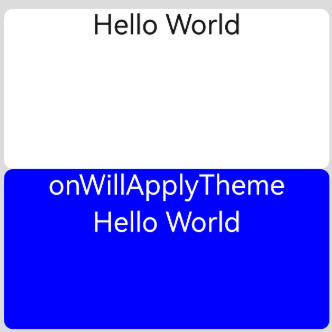

# Custom Component Lifecycle
<!--Kit: ArkUI-->
<!--Subsystem: ArkUI-->
<!--Owner: @seaside_wu1; @huyisuo-->
<!--Designer: @zhangboren-->
<!--Tester: @TerryTsao-->
<!--Adviser: @zhang_yixin13-->

The lifecycle callbacks of a custom component are used to notify users of the lifecycle of the component. These callbacks are private and are invoked by the development framework at a specified time at runtime. They cannot be manually invoked from applications. Do not reuse the same custom component node across multiple windows, as otherwise its lifecycle may become disrupted.

>**NOTE**
>
>- The initial APIs of this module are supported since API version 7. Newly added APIs will be marked with a superscript to indicate their earliest API version.
>- Promise and asynchronous callback functions can be used in lifecycle functions, for example, for obtaining network resources and setting timers.

## build

build(): void

The **build()** function is used to define the declarative UI description of a custom component. Every custom component must define a **build()** function.

**Widget capability**: This API can be used in ArkTS widgets since API version 9.

**Atomic service API**: This API can be used in atomic services since API version 11.

**System capability**: SystemCapability.ArkUI.ArkUI.Full

## aboutToAppear

aboutToAppear?(): void

Invoked after a new instance of the custom component is created and before its **build()** function is executed. You can change [state variables](../../../ui/state-management/arkts-state-management-glossary.md#state-variable) in the **aboutToAppear** function. The change will take effect during the subsequent execution of the **build()** function. The **aboutToAppear** lifecycle callback of a custom component with a [custom layout](./ts-custom-component-layout.md) is invoked during the layout process. For details, see [Custom Component Lifecycle](../../../ui/state-management/arkts-page-custom-components-lifecycle.md).

> **NOTE**
>
> * In this callback function, it is recommended that you only perform initialization logic for the current node component. Avoid high-time-consuming operations that may block the main thread. For high-time-consuming operations, consider caching or asynchronous solutions. For best practices, see [Optimizing Performance of UI Components: Avoiding Time-Consuming Operations During the Lifecycle of Custom Components](https://developer.huawei.com/consumer/en/doc/best-practices/bpta-ui-component-performance-optimization#section18755173594714).
> * In scenarios where components need to be frequently created and destroyed, this callback will be called frequently. For best practices, see [Optimizing Time-Consuming Operations in the Main Thread: Component Lifecycle Callback](https://developer.huawei.com/consumer/en/doc/best-practices/bpta-time-optimization-of-the-main-thread#section418843713435).

**Widget capability**: This API can be used in ArkTS widgets since API version 9.

**Atomic service API**: This API can be used in atomic services since API version 11.

**System capability**: SystemCapability.ArkUI.ArkUI.Full

## onDidBuild<sup>12+</sup>

onDidBuild?(): void

Invoked after the **build()** function of the custom component is executed. You can use this callback for actions that do not directly affect the UI, such as tracking data reporting. For details, see [Custom Component Lifecycle](../../../ui/state-management/arkts-page-custom-components-lifecycle.md).

**Atomic service API**: This API can be used in atomic services since API version 12.

**System capability**: SystemCapability.ArkUI.ArkUI.Full

## aboutToDisappear

aboutToDisappear?(): void

Invoked when this component is about to disappear. Do not change state variables in the **aboutToDisappear** function as doing this can cause unexpected errors. For example, the modification of the **@Link** decorated variable may cause unstable application running. For details, see [Custom Component Lifecycle](../../../ui/state-management/arkts-page-custom-components-lifecycle.md). It is not recommended to trigger logic such as [the creation a custom dialog box](./ts-methods-custom-dialog-box.md#open) after the **aboutToDisappear** function is called. Otherwise, the application behavior may be abnormal due to component tree information loss. For example, [@Consume](../../../ui/state-management/arkts-provide-and-consume.md) may be unable to find the corresponding [@Provide](../../../ui/state-management/arkts-provide-and-consume.md), or a blank dialog box where components are not displayed may occur.

> **NOTE**
>
> In scenarios where components need to be frequently created and destroyed, this callback will be called frequently. For best practices, see [Optimizing Time-Consuming Operations in the Main Thread: Component Lifecycle Callback](https://developer.huawei.com/consumer/en/doc/best-practices/bpta-time-optimization-of-the-main-thread#section418843713435).

**Widget capability**: This API can be used in ArkTS widgets since API version 9.

**Atomic service API**: This API can be used in atomic services since API version 11.

**System capability**: SystemCapability.ArkUI.ArkUI.Full

## onPageShow

onPageShow?(): void

Invoked each time a router-managed page (a custom component decorated with [\@Entry](../../../../application-dev/ui/state-management/arkts-create-custom-components.md#entry)) is displayed, including scenarios such as route navigation and the application returning to the foreground.

**Atomic service API**: This API can be used in atomic services since API version 11.

**System capability**: SystemCapability.ArkUI.ArkUI.Full

## onPageHide

onPageHide?(): void

Invoked each time a router-managed page (a custom component decorated with [\@Entry](../../../../application-dev/ui/state-management/arkts-create-custom-components.md#entry)) is hidden, including scenarios such as route navigation and the application moving to the background.

> **NOTE**
>
> To ensure smooth UI responsiveness, avoid executing time-consuming operations within the callback function that may block the main thread. For resource-intensive tasks such as camera resource deallocation, consider implementing asynchronous solutions. For best practices, see [Reducing Application Latency: Postponing Resource Release](https://developer.huawei.com/consumer/en/doc/best-practices/bpta-application-latency-optimization-cases#section8783201923819).

**Atomic service API**: This API can be used in atomic services since API version 11.

**System capability**: SystemCapability.ArkUI.ArkUI.Full

## onBackPress

onBackPress?(): void | boolean

Invoked when a user clicks the back button on a router-managed page (a custom component decorated with [\@Entry](../../../../application-dev/ui/state-management/arkts-create-custom-components.md#entry)). The value **true** means that the page executes its own return logic, and **false** (default) means that the default return logic is used.

**Atomic service API**: This API can be used in atomic services since API version 11.

**System capability**: SystemCapability.ArkUI.ArkUI.Full

**Return value**

| Type               | Description       |
| ------------------- | --------- |
| void \| boolean | Action of the back button. The value **true** means that the page executes its own return logic, and **false** (default) means that the default return logic is used.|

```ts
// xxx.ets
@Entry
@Component
struct IndexComponent {
  @State textColor: Color = Color.Black;

  onPageShow() {
    this.textColor = Color.Blue;
    console.info('IndexComponent onPageShow');
  }

  onPageHide() {
    this.textColor = Color.Transparent;
    console.info('IndexComponent onPageHide');
  }

  onBackPress() {
    this.textColor = Color.Red;
    console.info('IndexComponent onBackPress');
  }

  build() {
    Column() {
      Text('Hello World')
        .fontColor(this.textColor)
        .fontSize(30)
        .margin(30)
    }.width('100%')
  }
}
```


## onNewParam<sup>19+</sup>

onNewParam?(param: ESObject): void

Invoked when a page in the routing stack is moved to the top of the stack in the singleton mode of [RouterMode](../js-apis-router.md#routermode9). This callback takes effect only for custom components decorated with [\@Entry](../../../../application-dev/ui/state-management/arkts-create-custom-components.md#entry) within the [router](../js-apis-router.md) page stack.

**Atomic service API**: This API can be used in atomic services since API version 19.

**System capability**: SystemCapability.ArkUI.ArkUI.Full

**Parameters**

| Name| Type    | Mandatory    |             Description        |
|-------|----------|----------|---------------------------|
| param | ESObject |Yes| Data passed to the target page during redirection.|

```ts
// pages/Index.ets
import { router } from '@kit.ArkUI';

export class routerParam {
  msg: string = '__NA__';

  constructor(msg: string) {
    this.msg = msg;
  }
}

@Entry
@Component
struct Index {
  aboutToAppear(): void {
    console.info('onNewParam', 'Index aboutToAppear');
  }

  onNewParam(param: ESObject) {
    console.info('onNewParam', 'Index onNewParam, param: ' + JSON.stringify(param));
  }

  build() {
    Column() {
      Button('push pageOne Standard')
        .margin(10)
        .onClick(() => {
          this.getUIContext().getRouter().pushUrl({
            url: 'pages/PageOne',
            params: new routerParam('push pageOne Standard')
          }, router.RouterMode.Standard);
        })
      Button('push pageOne Single')
        .margin(10)
        .onClick(() => {
          this.getUIContext().getRouter().pushUrl({
            url: 'pages/PageOne',
            params: new routerParam('push pageOne Single')
          }, router.RouterMode.Single)
        })
    }
    .width('100%')
    .height('100%')
  }
}
```
<!--code_no_check-->
```ts
// pages/PageOne.ets
import { router } from '@kit.ArkUI';
import { routerParam } from './Index';

@Entry
@Component
struct PageOne {
  aboutToAppear(): void {
    console.info('onNewParam', 'PageOne aboutToAppear');
  }

  onNewParam(param: ESObject) {
    console.info('onNewParam', 'PageOne onNewParam, param: ' + JSON.stringify(param));
  }

  build() {
    Column() {
      Button('push Index Standard')
        .margin(10)
        .onClick(() => {
          this.getUIContext().getRouter().pushUrl({
            url: 'pages/Index',
            params: new routerParam('push Index Standard')
          }, router.RouterMode.Standard);
        })
      Button('push Index Single')
        .margin(10)
        .onClick(() => {
          this.getUIContext().getRouter().pushUrl({
            url: 'pages/Index',
            params: new routerParam('push Index Single')
          }, router.RouterMode.Single)
        })
    }
    .width('100%')
    .height('100%')
  }
}
```

## aboutToReuse<sup>10+</sup>

aboutToReuse?(params: Record\<string, Object | undefined | null>): void

Invoked when a reusable custom component is re-added to the node tree from the reuse cache to receive construction parameters of the component.

> **NOTE**
>
> * [Avoid repeatedly updating state variables that are automatically updated, such as @Link, @ObjectLink, and @Prop decorated variables, within aboutToReuse().](https://developer.huawei.com/consumer/en/doc/best-practices/bpta-component-reuse#section7441712174414).
> * In scrolling scenarios where component reuse is implemented, this callback is typically required to update the component's state variables. As such, avoid performing time-consuming operations within this callback to prevent frame drops and UI stuttering during scrolling animations. For best practices, see [Optimizing Time-Consuming Operations in the Main Thread: Component Reuse Callback](https://developer.huawei.com/consumer/en/doc/best-practices/bpta-time-optimization-of-the-main-thread#section20815336174316).

**Atomic service API**: This API can be used in atomic services since API version 11.

**System capability**: SystemCapability.ArkUI.ArkUI.Full

**Parameters**

| Name | Type                                     | Mandatory| Description               |
|--------|-------------------------------------------|-----|---------------------|
| params | Record\<string, Object \| undefined \| null> |   Yes  | Construction parameters of the custom component.|

```ts
// xxx.ets
export class Message {
  value: string | undefined;

  constructor(value: string) {
    this.value = value
  }
}

@Entry
@Component
struct Index {
  @State switch: boolean = true

  build() {
    Column() {
      Button('Hello World')
        .fontSize(50)
        .fontWeight(FontWeight.Bold)
        .onClick(() => {
          this.switch = !this.switch
        })
      if (this.switch) {
        Child({ message: new Message('Child') })
      }
    }
    .height("100%")
    .width('100%')
  }
}

@Reusable
@Component
struct Child {
  @State message: Message = new Message('AboutToReuse');

  aboutToReuse(params: Record<string, ESObject>) {
    console.info("Recycle Child")
    this.message = params.message as Message
  }

  build() {
    Column() {
      Text(this.message.value)
        .fontSize(20)
    }
    .borderWidth(2)
    .height(100)
  }
}
```

## aboutToReuse<sup>18+</sup>

aboutToReuse?(): void

Invoked when a reusable custom component managed by state management V2 is taken from the reuse pool and reinserted into the node tree.

For details, see [\@ReusableV2](../../../ui/state-management/arkts-new-reusableV2.md).

**Atomic service API**: This API can be used in atomic services since API version 18.

**System capability**: SystemCapability.ArkUI.ArkUI.Full

```ts
@Entry
@ComponentV2
struct Index {
  @Local condition: boolean = true;
  build() {
    Column() {
      Button('Recycle/Reuse').onClick(()=>{this.condition=!this.condition;}) // Click to toggle the recycle/reuse state.
      if (this.condition) {
        ReusableV2Component()
      }
    }
  }
}
@ReusableV2
@ComponentV2
struct ReusableV2Component {
  @Local message: string = 'Hello World';
  aboutToReuse() {
    console.info('ReusableV2Component aboutToReuse'); // Called when the component is reused.
  }
  build() {
    Column() {
      Text(this.message)
    }
  }
}
```


## aboutToRecycle<sup>10+</sup>

aboutToRecycle?(): void

Invoked when this reusable component is about to be added from the component tree to the reuse cache.

**Atomic service API**: This API can be used in atomic services since API version 11.

**System capability**: SystemCapability.ArkUI.ArkUI.Full

```ts
// xxx.ets
export class Message {
  value: string | undefined;

  constructor(value: string) {
    this.value = value;
  }
}

@Entry
@Component
struct Index {
  @State switch: boolean = true;

  build() {
    Column() {
      Button('Hello World')
        .fontSize(50)
        .fontWeight(FontWeight.Bold)
        .onClick(() => {
          this.switch = !this.switch;
        })
      if (this.switch) {
        Child({ message: new Message('Child') })
      }
    }
    .height("100%")
    .width('100%')
  }
}

@Reusable
@Component
struct Child {
  @State message: Message = new Message('AboutToReuse');

  aboutToReuse(params: Record<string, ESObject>) {
    console.info("Reuse Child");
    this.message = params.message as Message;
  }

  aboutToRecycle() {
    // This is where you can release memory-intensive content or other non-essential resource references to avoid continuous memory usage that could lead to memory leaks.
    console.info("The child enters the recycle pool.");
  }

  build() {
    Column() {
      Text(this.message.value)
        .fontSize(20)
    }
    .borderWidth(2)
    .height(100)
  }
}
```

## onWillApplyTheme<sup>12+</sup>

onWillApplyTheme?(theme: Theme): void

Invoked before the **build()** function of a new instance of the custom component is executed, to obtain the **Theme** object of the component context. You can change state variables in **onWillApplyTheme**. The change will take effect when you execute the **build()** function next time.

> **NOTE**
>
> Since API version 18, this API is supported in the components of V2.

**Atomic service API**: This API can be used in atomic services since API version 12.

**System capability**: SystemCapability.ArkUI.ArkUI.Full

**Parameters**

| Name   | Type                                      | Mandatory   | Description        |
|--------|------------------------------------------|------------|-------------------------|
| theme | [Theme](#theme12) | Yes    | Current theme object of the custom component.|

## Theme<sup>12+</sup>

type Theme = Theme

**Atomic service API**: This API can be used in atomic services since API version 12.

**System capability**: SystemCapability.ArkUI.ArkUI.Full

| Type                                                     | Description                   |
| --------------------------------------------------------- | ----------------------- |
| [Theme](../js-apis-arkui-theme.md#theme) | Current theme object of the custom component.|

V1:

```ts
// xxx.ets
import { CustomTheme, CustomColors, Theme, ThemeControl } from '@kit.ArkUI';

class BlueColors implements CustomColors {
  fontPrimary = Color.White;
  backgroundPrimary = Color.Blue;
  brand = Color.Blue; // Brand color
}

class PageCustomTheme implements CustomTheme {
  colors?: CustomColors;

  constructor(colors: CustomColors) {
    this.colors = colors;
  }
}
const BlueColorsTheme = new PageCustomTheme(new BlueColors());
// setDefaultTheme should be called on the application entry page or in an ability.
ThemeControl.setDefaultTheme(BlueColorsTheme);

@Entry
@Component
struct IndexComponent {
  @State textColor: ResourceColor = $r('sys.color.font_primary');
  @State columnBgColor: ResourceColor = $r('sys.color.background_primary');

  // Obtain the Theme object of the current component context. Set textColor and columnBgColor in onWillApplyTheme to the color (BlueColorsTheme) of the Theme object in use.
  onWillApplyTheme(theme: Theme) {
    this.textColor = theme.colors.fontPrimary;
    this.columnBgColor = theme.colors.backgroundPrimary;
    console.info('IndexComponent onWillApplyTheme');
  }

  build() {
    Column() {
      // Initial color style of the component
      Column() {
        Text('Hello World')
          .fontColor($r('sys.color.font_primary'))
          .fontSize(30)
      }
      .width('100%')
      .height('25%')
      .borderRadius('10vp')
      .backgroundColor($r('sys.color.background_primary'))

      // The color style configured in onWillApplyTheme is applied.
      Column() {
        Text('onWillApplyTheme')
          .fontColor(this.textColor)
          .fontSize(30)
        Text('Hello World')
          .fontColor(this.textColor)
          .fontSize(30)
      }
      .width('100%')
      .height('25%')
      .borderRadius('10vp')
      .backgroundColor(this.columnBgColor)
    }
    .padding('16vp')
    .backgroundColor('#dcdcdc')
    .width('100%')
    .height('100%')
  }
}
```


V2:

```ts
import { CustomTheme, CustomColors, Theme, ThemeControl } from '@kit.ArkUI';

class BlueColors implements CustomColors {
  fontPrimary = Color.White;
  backgroundPrimary = Color.Blue;
  brand = Color.Blue; // Brand color
}

class PageCustomTheme implements CustomTheme {
  colors?: CustomColors;

  constructor(colors: CustomColors) {
    this.colors = colors;
  }
}

const BlueColorsTheme = new PageCustomTheme(new BlueColors());
// setDefaultTheme should be called on the application entry page or in an ability.
ThemeControl.setDefaultTheme(BlueColorsTheme);

@Entry
@ComponentV2
struct IndexComponent {
  @Local textColor: ResourceColor = $r('sys.color.font_primary');
  @Local columnBgColor: ResourceColor = $r('sys.color.background_primary');

  // Obtain the Theme object of the current component context. Set textColor and columnBgColor in onWillApplyTheme to the color (BlueColorsTheme) of the Theme object in use.
  onWillApplyTheme(theme: Theme) {
    this.textColor = theme.colors.fontPrimary;
    this.columnBgColor = theme.colors.backgroundPrimary;
    console.info('IndexComponent onWillApplyTheme');
  }

  build() {
    Column() {
      // Initial color style of the component
      Column() {
        Text('Hello World')
          .fontColor($r('sys.color.font_primary'))
          .fontSize(30)
      }
      .width('100%')
      .height('25%')
      .borderRadius('10vp')
      .backgroundColor($r('sys.color.background_primary'))

      // The color style configured in onWillApplyTheme is applied.
      Column() {
        Text('onWillApplyTheme')
          .fontColor(this.textColor)
          .fontSize(30)
        Text('Hello World')
          .fontColor(this.textColor)
          .fontSize(30)
      }
      .width('100%')
      .height('25%')
      .borderRadius('10vp')
      .backgroundColor(this.columnBgColor)
    }
    .padding('16vp')
    .backgroundColor('#dcdcdc')
    .width('100%')
    .height('100%')
  }
}
```


## pageTransition<sup>9+</sup>

pageTransition?(): void

Defines the transition animation to play when the user accesses this page or is redirected from this page to another page.

**Atomic service API**: This API can be used in atomic services since API version 11.

**System capability**: SystemCapability.ArkUI.ArkUI.Full

## onFormRecycle<sup>11+</sup>

onFormRecycle?(): string

Invoked when the widget is recycled. The widget provider can return the data to be saved by the widget manager. This data is passed back to the widget provider using the [onFormRecover](#onformrecover11) API when the widget is recovered.

**Atomic service API**: This API can be used in atomic services since API version 12.

**Widget capability**: This API can be used in ArkTS widgets since API version 11.

**System capability**: SystemCapability.ArkUI.ArkUI.Full

**Return value**

| Type               | Description       |
| ------------------- | ---------   |
| string | Data that the widget provider requests the widget manager to save.|

**Example**
```ts
@Entry
@Component
struct WidgetCard {
  readonly title: string = 'Hello World';
  readonly actionType: string = 'router';
  readonly abilityName: string = 'EntryAbility';
  readonly message: string = 'add detail';
  readonly fullWidthPercent: string = '100%';
  readonly fullHeightPercent: string = '100%';

  onFormRecycle(): string {
    let formId: string = "1859635745"
    console.info("card is recycled, formID: " + formId);
    return formId;
  }

  onFormRecover(statusData: string): void {
    console.info("card has been restored, formID: " + statusData);
  }

  build() {
    Row() {
      Column() {
        Text(this.title)
          .fontSize($r('app.float.font_size'))
          .fontWeight(FontWeight.Medium)
          .fontColor($r('sys.color.font'))
      }
      .width(this.fullWidthPercent)
    }
    .height(this.fullHeightPercent)
    .backgroundColor($r('sys.color.comp_background_primary'))
    .onClick(() => {
      postCardAction(this, {
        action: this.actionType,
        abilityName: this.abilityName,
        params: {
          message: this.message
        }
      });
    })
  }
}
```

## onFormRecover<sup>11+</sup>

onFormRecover?(statusData: string): void

Invoked when the widget is recovered. The widget provider can obtain the data saved by the widget manager during widget recycling. This data can be saved to the widget manager using the [onFormRecycle](#onformrecycle11) callback.

**Atomic service API**: This API can be used in atomic services since API version 12.

**Widget capability**: This API can be used in ArkTS widgets since API version 11.

**System capability**: SystemCapability.ArkUI.ArkUI.Full

**Parameters**

| Name   | Type                                      | Mandatory   | Description        |
|--------|------------------------------------------|------------|-------------------------|
| statusData | string | Yes    | Data saved by the widget manager during widget recycling.|

**Example**
```ts
@Entry
@Component
struct WidgetCard {
  readonly title: string = 'Hello World';
  readonly actionType: string = 'router';
  readonly abilityName: string = 'EntryAbility';
  readonly message: string = 'add detail';
  readonly fullWidthPercent: string = '100%';
  readonly fullHeightPercent: string = '100%';

  onFormRecycle(): string {
    let formId: string = "1859635745"
    console.info("card is recycled, formID: " + formId);
    return formId;
  }

  onFormRecover(statusData: string): void {
    console.info("card has been restored, formID: " + statusData);
  }

  build() {
    Row() {
      Column() {
        Text(this.title)
          .fontSize($r('app.float.font_size'))
          .fontWeight(FontWeight.Medium)
          .fontColor($r('sys.color.font'))
      }
      .width(this.fullWidthPercent)
    }
    .height(this.fullHeightPercent)
    .backgroundColor($r('sys.color.comp_background_primary'))
    .onClick(() => {
      postCardAction(this, {
        action: this.actionType,
        abilityName: this.abilityName,
        params: {
          message: this.message
        }
      });
    })
  }
}
```
