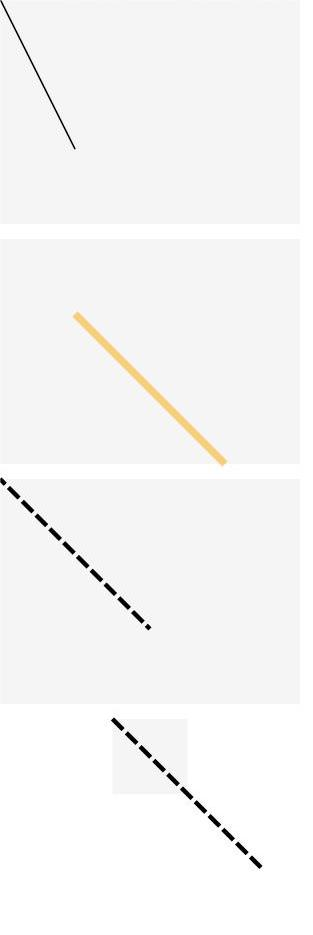

# Line

The **Line** component is used to draw a straight line.

>  **NOTE**
>
> This component is supported since API version 7. Updates will be marked with a superscript to indicate their earliest API version.

## Child Components

Not supported


## APIs

Line(options?: LineOptions)

**Widget capability**: This API can be used in ArkTS widgets since API version 9.

**Atomic service API**: This API can be used in atomic services since API version 11.

**System capability**: SystemCapability.ArkUI.ArkUI.Full

**Parameters**

| Name| Type| Mandatory| Description
| -------- | -------- | -------- | -------- |
| options | [LineOptions](ts-drawing-components-line.md#lineoptions18) | No| Options for drawing a line.|

## LineOptions<sup>18+</sup>
Describes the options for drawing a line.

**Widget capability**: This API can be used in ArkTS widgets since API version 18.

**Atomic service API**: This API can be used in atomic services since API version 18.

**System capability**: SystemCapability.ArkUI.ArkUI.Full

| Name| Type| Mandatory| Description|
| -------- | -------- | -------- | -------- |
| width | string \| number | No| Width.<br>If the value is invalid or the default value is used, the width required for the content is used.<br>Default unit: vp|
| height | string \| number | No| Height.<br>If the value is invalid or the default value is used, the width required for the content is used.<br>Default unit: vp|

## Attributes

In addition to the [universal attributes](ts-component-general-attributes.md), the following attributes are supported.

### startPoint

startPoint(value: Array&lt;any&gt;)

Sets the coordinates (relative coordinates) of the start point of the line. An invalid value is handled as the default value.

**Widget capability**: This API can be used in ArkTS widgets since API version 9.

**Atomic service API**: This API can be used in atomic services since API version 11.

**System capability**: SystemCapability.ArkUI.ArkUI.Full

**Parameters**

| Name| Type                                     | Mandatory| Description                                                        |
| ------ | ----------------------------------------- | ---- | ------------------------------------------------------------ |
| value  | Array&lt;[Length](ts-types.md#length)&gt; | Yes  | Coordinates (relative coordinates) of the start point of the line, in vp.<br>Default value: **[0, 0]**|

### endPoint

endPoint(value: Array&lt;any&gt;)

Sets the coordinates (relative coordinates) of the end point of the line. An invalid value is handled as the default value.

**Widget capability**: This API can be used in ArkTS widgets since API version 9.

**Atomic service API**: This API can be used in atomic services since API version 11.

**System capability**: SystemCapability.ArkUI.ArkUI.Full

**Parameters**

| Name| Type                                     | Mandatory| Description                                                        |
| ------ | ----------------------------------------- | ---- | ------------------------------------------------------------ |
| value  | Array&lt;[Length](ts-types.md#length)&gt; | Yes  | Coordinates (relative coordinates) of the end point of the line, in vp.<br>Default value: **[0, 0]**|

### fill

fill(value: ResourceColor)

Sets the color of the fill area. This attribute has no effect for the **Line** component, which cannot be used to draw a closed shape.

**Widget capability**: This API can be used in ArkTS widgets since API version 9.

**Atomic service API**: This API can be used in atomic services since API version 11.

**System capability**: SystemCapability.ArkUI.ArkUI.Full

**Parameters**

| Name| Type                                      | Mandatory| Description                                  |
| ------ | ------------------------------------------ | ---- | -------------------------------------- |
| value  | [ResourceColor](ts-types.md#resourcecolor) | Yes  | Color of the fill area.<br>Default value: **Color.Black**|

### fillOpacity

fillOpacity(value: number | string | Resource)

Sets the opacity of the fill area. This attribute has no effect for the **Line** component, which cannot be used to draw a closed shape.

**Widget capability**: This API can be used in ArkTS widgets since API version 9.

**Atomic service API**: This API can be used in atomic services since API version 11.

**System capability**: SystemCapability.ArkUI.ArkUI.Full

**Parameters**

| Name| Type                                                        | Mandatory| Description                          |
| ------ | ------------------------------------------------------------ | ---- | ------------------------------ |
| value  | number \| string \| [Resource](ts-types.md#resource) | Yes  | Opacity of the fill area.<br>Default value: **1**|

### stroke

stroke(value: ResourceColor)

Sets the stroke color. If this attribute is not set, the component does not have any stroke. If the value is invalid, no stroke will be drawn.

**Widget capability**: This API can be used in ArkTS widgets since API version 9.

**Atomic service API**: This API can be used in atomic services since API version 11.

**System capability**: SystemCapability.ArkUI.ArkUI.Full

**Parameters**

| Name| Type                                      | Mandatory| Description      |
| ------ | ------------------------------------------ | ---- | ---------- |
| value  | [ResourceColor](ts-types.md#resourcecolor) | Yes  | Stroke color.|

### strokeDashArray

strokeDashArray(value: Array&lt;any&gt;)

Sets stroke dashes. Line segments may overlap when they intersect. The value must be greater than or equal to 0. Invalid values are treated as the default value.

**Widget capability**: This API can be used in ArkTS widgets since API version 9.

**Atomic service API**: This API can be used in atomic services since API version 11.

**System capability**: SystemCapability.ArkUI.ArkUI.Full

**Parameters**

| Name| Type                                     | Mandatory| Description                     |
| ------ | ----------------------------------------- | ---- | ------------------------- |
| value  | Array&lt;[Length](ts-types.md#length)&gt; | Yes  | Stroke dashes.<br>Default value: **[]**<br>Default unit: vp|

### strokeDashOffset

strokeDashOffset(value: number | string)

Sets the offset of the start point for drawing the stroke.

**Widget capability**: This API can be used in ArkTS widgets since API version 9.

**Atomic service API**: This API can be used in atomic services since API version 11.

**System capability**: SystemCapability.ArkUI.ArkUI.Full

**Parameters**

| Name| Type                      | Mandatory| Description                                |
| ------ | -------------------------- | ---- | ------------------------------------ |
| value  | number \| string | Yes  | Offset of the start point for drawing the stroke.<br>Default value: **0**<br>Default unit: vp|

### strokeLineCap

strokeLineCap(value: LineCapStyle)

Sets the cap style of the stroke.

**Widget capability**: This API can be used in ArkTS widgets since API version 9.

**Atomic service API**: This API can be used in atomic services since API version 11.

**System capability**: SystemCapability.ArkUI.ArkUI.Full

**Parameters**

| Name| Type                                             | Mandatory| Description                                            |
| ------ | ------------------------------------------------- | ---- | ------------------------------------------------ |
| value  | [LineCapStyle](ts-appendix-enums.md#linecapstyle) | Yes  | Cap style of the stroke.<br>Default value: **LineCapStyle.Butt**|

### strokeLineJoin

strokeLineJoin(value: LineJoinStyle)

Sets the join style of the stroke. This attribute has no effect for the **Line** component, which does not have corners.

**Widget capability**: This API can be used in ArkTS widgets since API version 9.

**Atomic service API**: This API can be used in atomic services since API version 11.

**System capability**: SystemCapability.ArkUI.ArkUI.Full

**Parameters**

| Name| Type                                               | Mandatory| Description                                              |
| ------ | --------------------------------------------------- | ---- | -------------------------------------------------- |
| value  | [LineJoinStyle](ts-appendix-enums.md#linejoinstyle) | Yes  | Join style of the stroke.<br>Default value: **LineJoinStyle.Miter**|

### strokeMiterLimit

strokeMiterLimit(value: number | string)

Sets the limit value when the sharp angle is drawn as a miter. This attribute has no effect for the **Line** component, which cannot be used to draw a shape with a sharp angle.

**Widget capability**: This API can be used in ArkTS widgets since API version 9.

**Atomic service API**: This API can be used in atomic services since API version 11.

**System capability**: SystemCapability.ArkUI.ArkUI.Full

**Parameters**

| Name| Type                      | Mandatory| Description                                  |
| ------ | -------------------------- | ---- | -------------------------------------- |
| value  | number \| string | Yes  | Limit value when the sharp angle is drawn as a miter.<br>Default value: **4**|

### strokeOpacity

strokeOpacity(value: number | string | Resource)

Sets the stroke opacity. The value range is [0.0, 1.0]. A value less than 0.0 is treated as **0.0**. A value greater than 1.0 is treated as **1.0**. Any other value is treated as **1.0**.

**Widget capability**: This API can be used in ArkTS widgets since API version 9.

**Atomic service API**: This API can be used in atomic services since API version 11.

**System capability**: SystemCapability.ArkUI.ArkUI.Full

**Parameters**

| Name| Type                                                        | Mandatory| Description                      |
| ------ | ------------------------------------------------------------ | ---- | -------------------------- |
| value  | number \| string \| [Resource](ts-types.md#resource) | Yes  | Stroke opacity.<br>Default value: **1**|

### strokeWidth

strokeWidth(value: Length)

Sets the stroke width. If of the string type, this attribute cannot be set in percentage. A percentage is processed as 1px.

**Widget capability**: This API can be used in ArkTS widgets since API version 9.

**Atomic service API**: This API can be used in atomic services since API version 11.

**System capability**: SystemCapability.ArkUI.ArkUI.Full

**Parameters**

| Name| Type                        | Mandatory| Description                    |
| ------ | ---------------------------- | ---- | ------------------------ |
| value  | [Length](ts-types.md#length) | Yes  | Stroke width. The value must be greater than or equal to 0.<br>Default value: **1**<br>Default unit: vp<br>An invalid value is handled as the default value.|

### antiAlias

antiAlias(value: boolean)

Specifies whether anti-aliasing is enabled.

**Widget capability**: This API can be used in ArkTS widgets since API version 9.

**Atomic service API**: This API can be used in atomic services since API version 11.

**System capability**: SystemCapability.ArkUI.ArkUI.Full

**Parameters**

| Name| Type   | Mandatory| Description                                 |
| ------ | ------- | ---- | ------------------------------------- |
| value  | boolean | Yes  | Whether anti-aliasing is enabled.<br>**true**: Anti-aliasing is enabled.<br>**false**: Anti-aliasing is disabled.<br>Default value: **true**|

## Example

### Example 1: Drawing a Line

This example demonstrates how to use **startPoint**, **endPoint**, **fillOpacity**, **stroke**, **strokeDashArray**, and **strokeDashOffset** to set the start point, end point, opacity, stroke color, stroke dashes, and stroke offset of a line.

```ts
// xxx.ets
@Entry
@Component
struct LineExample {
  build() {
    Column({ space: 10 }) {
      // The coordinates of the start and end points of the line are determined relative to the coordinates of the drawing area of the <Line> component.
      Line()
        .width(200)
        .height(150)
        .startPoint([0, 0])
        .endPoint([50, 100])
        .stroke(Color.Black)
        .backgroundColor('#F5F5F5')
      Line()
        .width(200)
        .height(150)
        .startPoint([50, 50])
        .endPoint([150, 150])
        .strokeWidth(5)
        .stroke(Color.Orange)
        .strokeOpacity(0.5)
        .backgroundColor('#F5F5F5')
      // strokeDashOffset is used to define the offset when the associated strokeDashArray array is rendered.
      Line()
        .width(200)
        .height(150)
        .startPoint([0, 0])
        .endPoint([100, 100])
        .stroke(Color.Black)
        .strokeWidth(3)
        .strokeDashArray([10, 3])
        .strokeDashOffset(5)
        .backgroundColor('#F5F5F5')
      // If the coordinates of a point are beyond the width and height range of the <Line> component, the line will exceed the drawing area.
      Line()
        .width(50)
        .height(50)
        .startPoint([0, 0])
        .endPoint([100, 100])
        .stroke(Color.Black)
        .strokeWidth(3)
        .strokeDashArray([10, 3])
        .backgroundColor('#F5F5F5')
    }
  }
}
```



### Example 2: Setting the Stroke Cap Style

This example demonstrates how to use **strokeLineCap** to set the stroke cap style of a line.

```ts
// xxx.ets
@Entry
@Component
struct LineExample1 {
  build() {
    Row({ space: 10 }) {
      // Set LineCapStyle to Butt.
      Line()
        .width(100)
        .height(200)
        .startPoint([50, 50])
        .endPoint([50, 200])
        .stroke(Color.Black)
        .strokeWidth(20)
        .strokeLineCap(LineCapStyle.Butt)
        .backgroundColor('#F5F5F5')
        .margin(10)
      // Set LineCapStyle to Round.
      Line()
        .width(100)
        .height(200)
        .startPoint([50, 50])
        .endPoint([50, 200])
        .stroke(Color.Black)
        .strokeWidth(20)
        .strokeLineCap(LineCapStyle.Round)
        .backgroundColor('#F5F5F5')
      // Set LineCapStyle to Square.
      Line()
        .width(100)
        .height(200)
        .startPoint([50, 50])
        .endPoint([50, 200])
        .stroke(Color.Black)
        .strokeWidth(20)
        .strokeLineCap(LineCapStyle.Square)
        .backgroundColor('#F5F5F5')
    }
  }
}
```


### Example 3: Setting the Stroke Dashes

This example demonstrates how to use **strokeDashArray** to set the stroke dashes of a line.

```ts
// xxx.ets
@Entry
@Component
struct LineExample {
  build() {
    Column() {
      Line()
        .width(300)
        .height(30)
        .startPoint([50, 30])
        .endPoint([300, 30])
        .stroke(Color.Black)
        .strokeWidth(10)
      // Set the interval for strokeDashArray to 50.
      Line()
        .width(300)
        .height(30)
        .startPoint([50, 20])
        .endPoint([300, 20])
        .stroke(Color.Black)
        .strokeWidth(10)
        .strokeDashArray([50])
      // Set the interval for strokeDashArray to 50, 10.
      Line()
        .width(300)
        .height(30)
        .startPoint([50, 20])
        .endPoint([300, 20])
        .stroke(Color.Black)
        .strokeWidth(10)
        .strokeDashArray([50, 10])
      // Set the interval for strokeDashArray to 50, 10, 20.
      Line()
        .width(300)
        .height(30)
        .startPoint([50, 20])
        .endPoint([300, 20])
        .stroke(Color.Black)
        .strokeWidth(10)
        .strokeDashArray([50, 10, 20])
      // Set the interval for strokeDashArray to 50, 10, 20, 30.
      Line()
        .width(300)
        .height(30)
        .startPoint([50, 20])
        .endPoint([300, 20])
        .stroke(Color.Black)
        .strokeWidth(10)
        .strokeDashArray([50, 10, 20, 30])
    }
  }
}
```


