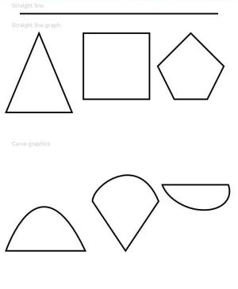

# Path

The **Path** component is used to draw a custom closed shape based on a specified drawing path.

> **NOTE**
>
> This component is supported since API version 7. Updates will be marked with a superscript to indicate their earliest API version.


## Child Components

Not supported

## APIs

Path(options?: PathOptions)

**Widget capability**: This API can be used in ArkTS widgets since API version 9.

**Atomic service API**: This API can be used in atomic services since API version 11.

**System capability**: SystemCapability.ArkUI.ArkUI.Full

**Parameters**

| Name                                            | Type        | Mandatory| Description                  |
| ------ | ---------------- | ---- | ------------------------------------------------------------ |
| options  | [PathOptions](ts-drawing-components-path.md#pathoptions18) | No  | Options for path drawing.|

## PathOptions<sup>18+</sup>
Describes the options for path drawing.

**Widget capability**: This API can be used in ArkTS widgets since API version 18.

**Atomic service API**: This API can be used in atomic services since API version 18.

**System capability**: SystemCapability.ArkUI.ArkUI.Full

| Name| Type| Mandatory| Description|
| -------- | -------- | -------- | -------- |
| width | string \| number | No| Width of the rectangle where the path is located.<br>If the value is invalid or the default value is used, the width required for the content is used.<br>Default unit: vp|
| height | string \| number | No| Height of the rectangle where the path is located.<br>If the value is invalid or the default value is used, the width required for the content is used.<br>Default unit: vp|
| [commands](ts-drawing-components-path.md#commands) | string  | No| Command string for drawing the path.<br>If the value is invalid or the default value is used, the width required for the content is used. Default value: **''**<br>An invalid value is handled as the default value.|

## Attributes

In addition to the [universal attributes](ts-component-general-attributes.md), the following attributes are supported.

### commands

commands(value: string)

Sets a string of path commands that comply with the [SVG path syntax](ts-drawing-components-path.md#svg-path-syntax). The unit is px. For details about how to convert pixel units, see [Pixel Units](ts-pixel-units.md).

**Widget capability**: This API can be used in ArkTS widgets since API version 9.

**Atomic service API**: This API can be used in atomic services since API version 11.

**System capability**: SystemCapability.ArkUI.ArkUI.Full

**Parameters**

| Name| Type  | Mandatory| Description                         |
| ------ | ------ | ---- | ----------------------------- |
| value  | string | Yes  | Path for drawing a line.<br>Default value: **''**<br>Default unit: px|

### fill

fill(value: ResourceColor)

Sets the color of the fill area. An invalid value is handled as the default value. If this attribute and the universal attribute **foregroundColor** are both set, whichever is set later takes effect.

**Widget capability**: This API can be used in ArkTS widgets since API version 9.

**Atomic service API**: This API can be used in atomic services since API version 11.

**System capability**: SystemCapability.ArkUI.ArkUI.Full

**Parameters**

| Name| Type                                      | Mandatory| Description                                  |
| ------ | ------------------------------------------ | ---- | -------------------------------------- |
| value  | [ResourceColor](ts-types.md#resourcecolor) | Yes  | Color of the fill area.<br>Default value: **Color.Black**|

### fillOpacity

fillOpacity(value: number | string | Resource)

Sets the opacity of the fill area. The value range is [0.0, 1.0]. If the value passed in is less than **0.0**, the opacity is set to **0.0**. If the value passed in is greater than **1.0**, the opacity is set to **1.0**. Any other value is regarded as **1.0**.

**Widget capability**: This API can be used in ArkTS widgets since API version 9.

**Atomic service API**: This API can be used in atomic services since API version 11.

**System capability**: SystemCapability.ArkUI.ArkUI.Full

**Parameters**

| Name| Type                                                        | Mandatory| Description                          |
| ------ | ------------------------------------------------------------ | ---- | ------------------------------ |
| value  | number \| string \| [Resource](ts-types.md#resource) | Yes  | Opacity of the fill area.<br>Default value: **1**|

### stroke

stroke(value: ResourceColor)

Sets the stroke color. If this attribute is not set, the component does not have any stroke. If the value is invalid, no stroke will be drawn.

**Widget capability**: This API can be used in ArkTS widgets since API version 9.

**Atomic service API**: This API can be used in atomic services since API version 11.

**System capability**: SystemCapability.ArkUI.ArkUI.Full

**Parameters**

| Name| Type                                      | Mandatory| Description      |
| ------ | ------------------------------------------ | ---- | ---------- |
| value  | [ResourceColor](ts-types.md#resourcecolor) | Yes  | Stroke color.|

### strokeDashArray

strokeDashArray(value: Array&lt;any&gt;)

Sets the stroke dashes. Line segments may overlap when they intersect. The value must be greater than or equal to 0. Invalid values are treated as the default value.

**Widget capability**: This API can be used in ArkTS widgets since API version 9.

**Atomic service API**: This API can be used in atomic services since API version 11.

**System capability**: SystemCapability.ArkUI.ArkUI.Full

**Parameters**

| Name| Type            | Mandatory| Description                     |
| ------ | ---------------- | ---- | ------------------------- |
| value  | Array&lt;any&gt; | Yes  | Stroke dashes.<br>Default value: **[]**<br>Default unit: vp|

### strokeDashOffset

strokeDashOffset(value: number | string)

Sets the line dash offset. An invalid value is handled as the default value.

**Widget capability**: This API can be used in ArkTS widgets since API version 9.

**Atomic service API**: This API can be used in atomic services since API version 11.

**System capability**: SystemCapability.ArkUI.ArkUI.Full

**Parameters**

| Name| Type                      | Mandatory| Description                                |
| ------ | -------------------------- | ---- | ------------------------------------ |
| value  | number \| string | Yes  | Line dash offset.<br>Default value: **0**<br>Default unit: vp|

### strokeLineCap

strokeLineCap(value: LineCapStyle)

Sets the style of end points of lines.

**Widget capability**: This API can be used in ArkTS widgets since API version 9.

**Atomic service API**: This API can be used in atomic services since API version 11.

**System capability**: SystemCapability.ArkUI.ArkUI.Full

**Parameters**

| Name| Type                                             | Mandatory| Description                                            |
| ------ | ------------------------------------------------- | ---- | ------------------------------------------------ |
| value  | [LineCapStyle](ts-appendix-enums.md#linecapstyle) | Yes  | Style of the end points of lines.<br>Default value: **LineCapStyle.Butt**|

### strokeLineJoin

strokeLineJoin(value: LineJoinStyle)

Sets the join style of lines.

**Widget capability**: This API can be used in ArkTS widgets since API version 9.

**Atomic service API**: This API can be used in atomic services since API version 11.

**System capability**: SystemCapability.ArkUI.ArkUI.Full

**Parameters**

| Name| Type                                               | Mandatory| Description                                              |
| ------ | --------------------------------------------------- | ---- | -------------------------------------------------- |
| value  | [LineJoinStyle](ts-appendix-enums.md#linejoinstyle) | Yes  | Join style of lines.<br>Default value: **LineJoinStyle.Miter**|

### strokeMiterLimit

strokeMiterLimit(value: number | string)

Sets the limit on the ratio of the miter length to the value of **strokeWidth** used to draw a miter join. The miter length indicates the distance from the outer tip to the inner corner of the miter. This attribute works only when **strokeLineJoin** is set to **LineJoinStyle.Miter**.

The value must be greater than or equal to 1.0. If the value is in the [0, 1) range, the value **1.0** will be used. In other cases, the default value will be used.

**Widget capability**: This API can be used in ArkTS widgets since API version 9.

**Atomic service API**: This API can be used in atomic services since API version 11.

**System capability**: SystemCapability.ArkUI.ArkUI.Full

**Parameters**

| Name| Type                      | Mandatory| Description                                          |
| ------ | -------------------------- | ---- | ---------------------------------------------- |
| value  | number \| string | Yes  | Limit on the ratio of the miter length to the value of **strokeWidth** used to draw a miter join.<br>Default value: **4**|

### strokeOpacity

strokeOpacity(value: number | string | Resource)

Sets the stroke opacity. The value range is [0.0, 1.0]. If the value passed in is less than **0.0**, the opacity is set to **0.0**. If the value passed in is greater than **1.0**, the opacity is set to **1.0**. Any other value is regarded as **1.0**.

**Widget capability**: This API can be used in ArkTS widgets since API version 9.

**Atomic service API**: This API can be used in atomic services since API version 11.

**System capability**: SystemCapability.ArkUI.ArkUI.Full

**Parameters**

| Name| Type                                                        | Mandatory| Description                      |
| ------ | ------------------------------------------------------------ | ---- | -------------------------- |
| value  | number \| string \| [Resource](ts-types.md#resource) | Yes  | Stroke opacity.<br>Default value: **1**|

### strokeWidth

strokeWidth(value: Length)

Sets the stroke width. If this attribute is of the string type, percentage values are not supported and will be treated as 1 px.

**Widget capability**: This API can be used in ArkTS widgets since API version 9.

**Atomic service API**: This API can be used in atomic services since API version 11.

**System capability**: SystemCapability.ArkUI.ArkUI.Full

**Parameters**

| Name| Type                        | Mandatory| Description                    |
| ------ | ---------------------------- | ---- | ------------------------ |
| value  | [Length](ts-types.md#length) | Yes  | Stroke width. The value must be greater than or equal to 0.<br>Default value: **1**<br>Default unit: vp<br>An invalid value is handled as the default value.|

### antiAlias

antiAlias(value: boolean)

Specifies whether anti-aliasing is enabled.

**Widget capability**: This API can be used in ArkTS widgets since API version 9.

**Atomic service API**: This API can be used in atomic services since API version 11.

**System capability**: SystemCapability.ArkUI.ArkUI.Full

**Parameters**

| Name| Type   | Mandatory| Description                                 |
| ------ | ------- | ---- | ------------------------------------- |
| value  | boolean | Yes  | Whether anti-aliasing is enabled.<br>**true**: Anti-aliasing is enabled.<br>**false**: Anti-aliasing is disabled.<br>Default value: **true**|

## SVG Path Syntax

The table below lists the supported SVG path commands.

| Command  | Name                              | Parameter                                      | Description                                      |
| ---- | -------------------------------- | ---------------------------------------- | ---------------------------------------- |
| M    | moveto                           | (x y)                                   | Starts a new subpath at the point specified by the given (x, y) coordinates. For example, `M 0 0` starts a new subpath at point (0, 0).|
| L    | lineto                           | (x y)                                   | Draws a line from the current point to the point specified by the given (x, y) coordinates. The specified point becomes the start point of the new subpath. For example, `L 50 50` draws a line from the current point to point (50, 50), which is the start point of the new subpath.|
| H    | horizontal lineto                | x                                        | Draws a horizontal line to the given X coordinate. This command is equivalent to an **L** command with the current Y coordinate. For example, **H 50** draws a horizontal line from the current point to (50, current y).|
| V    | vertical lineto                  | y                                        | Draws a vertical line to the given Y coordinate. This command is equivalent to an **L** command with the current X coordinate. For example, **V 50** draws a vertical line from the current point to (current x, 50).|
| C    | curveto                          | (x1 y1 x2 y2 x y)                        | Draws a cubic Bezier curve from the current point to the point specified by the given (x, y) coordinates, with (x1, y1) as the control point of the curve start point and (x2, y2) as the control point of the curve end point. For example, **C100 100 250 100 250 200** draws a cubic Bezier curve from the current point to point (250, 200), which is the start point of the new subpath.|
| S    | smooth curveto                   | (x2 y2 x y)                              | Draws a cubic Bezier curve from the current point to the point specified by the given (x, y) coordinates, with (x2, y2) as the control point of the curve end point. If the previous command is **C** or **S**, the control point of the curve start point is the mapping of the control point of the curve end point in the previous command relative to the start point. For example, in **C100 100 250 100 250 200 S400 300 400 200**, the second segment of the cubic Bezier curve uses point (250, 300) as the control point of the curve start point. If there is no previous command or the previous command is not **C** or **S**, the control point of the curve start point coincides with the current point.|
| Q    | quadratic Belzier curve          | (x1 y1 x y)                              | Draws a quadratic Bezier curve from the current point to the point specified by the given (x, y) coordinates, with (x1, y1) as the control point. For example, **Q400 50 600 300** draws a quadratic Bezier curve from the current point to point (600, 300), which is the start point of the new subpath.|
| T    | smooth quadratic Belzier curveto | (x y)                                    | Draws a quadratic Bezier curve from the current point to the point specified by the given (x, y) coordinates. If the previous command is **Q** or **T**, the control point is the mapping of the control point of the curve end point in the previous command relative to the start point. For example, in **Q400 50 600 300 T1000 300**, the second segment of the quadratic Bezier curve uses point (800, 350) as the control point. If there is no previous command or the previous command is not **Q** or **T**, the control point of the curve start point coincides with the current point.|
| A    | elliptical Arc                   | (rx ry x-axis-rotation large-arc-flag sweep-flag x y) | Draws an elliptical arc from the current point to the point specified by the given (x, y) coordinates. **(rx, ry)** and **x-axis-rotation** define the size and direction of the arc, indicating how the arc rotates relative to the current coordinate system (in degrees). **large-arc-flag** and **sweep-flag** define how the arc is drawn.|
| Z    | closepath                        | none                                     | Closes the current subpath by connecting the current path back to the initial point of the current subpath.            |

For example, **commands('M0 20 L50 50 L50 100 Z')** defines a triangle that starts from position (0, 20), by drawing a line from point (0, 20) to point (50, 50), then a line from point (50, 50) to point (50, 100), and finally a line from point (50, 100) to point (0, 20).

## Example

This example demonstrates how to use **commands**, **fillOpacity**, and **stroke** to draw a closed shape with the specified path, opacity, and stroke color.

```ts
// xxx.ets
@Entry
@Component
struct PathExample {
  build() {
    Column({ space: 10 }) {
      Text('Straight line')
        .fontSize(11)
        .fontColor(0xCCCCCC)
        .width('90%')
      // Draw a straight line whose length is 600 px and width is 3 vp.
      Path()
        .width('600px')
        .height('10px')
        .commands('M0 0 L600 0')
        .stroke(Color.Black)
        .strokeWidth(3)

      Text('Straight line graph')
        .fontSize(11)
        .fontColor(0xCCCCCC)
        .width('90%')
      // Draw a straight line.
      Flex({ justifyContent: FlexAlign.SpaceBetween }) {
        Path()
          .width('210px')
          .height('310px')
          .commands('M100 0 L200 240 L0 240 Z')
          .fillOpacity(0)
          .stroke(Color.Black)
          .strokeWidth(3)
        Path()
          .width('210px')
          .height('310px')
          .commands('M0 0 H200 V200 H0 Z')
          .fillOpacity(0)
          .stroke(Color.Black)
          .strokeWidth(3)
        Path()
          .width('210px')
          .height('310px')
          .commands('M100 0 L0 100 L50 200 L150 200 L200 100 Z')
          .fillOpacity(0)
          .stroke(Color.Black)
          .strokeWidth(3)
      }.width('95%')

      Text('Curve graphics').fontSize(11).fontColor(0xCCCCCC).width('90%')
      // Draw an arc.
      Flex({ justifyContent: FlexAlign.SpaceBetween }) {
        Path()
          .width('250px')
          .height('310px')
          .commands("M0 300 S100 0 240 300 Z")
          .fillOpacity(0)
          .stroke(Color.Black)
          .strokeWidth(3)
        Path()
          .width('210px')
          .height('310px')
          .commands('M0 150 C0 100 140 0 200 150 L100 300 Z')
          .fillOpacity(0)
          .stroke(Color.Black)
          .strokeWidth(3)
        Path()
          .width('210px')
          .height('310px')
          .commands('M0 100 A30 20 20 0 0 200 100 Z')
          .fillOpacity(0)
          .stroke(Color.Black)
          .strokeWidth(3)
      }.width('95%')
    }.width('100%')
    .margin({ top: 5 })
  }
}
```


