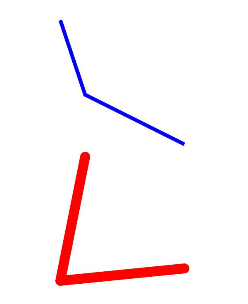

# Polyline

The **Polyline** component is used to draw a polyline.

>  **NOTE**
>
>  This component is supported since API version 7. Updates will be marked with a superscript to indicate their earliest API version.


## Child Components

Not supported


## APIs

Polyline(value?: {width?: string | number, height?: string | number})

**Widget capability**: This API can be used in ArkTS widgets since API version 9.

**Atomic service API**: This API can be used in atomic services since API version 11.

**Parameters**

| Name| Type| Mandatory| Description|
| -------- | -------- | -------- | -------- |
| value | {width?: string \| number, height?: string \| number} | No| **width**: width<br>Default value: **0**<br>An invalid value is handled as the default value.<br>**height**: height<br>Default value: **0**<br>An invalid value is handled as the default value.|

## Attributes

In addition to the [universal attributes](ts-universal-attributes-size.md), the following attributes are supported.

### points

points(value: Array&lt;any&gt;)

Sets the list of coordinates that the polyline passes through. An invalid value is handled as the default value.

**Widget capability**: This API can be used in ArkTS widgets since API version 9.

**Atomic service API**: This API can be used in atomic services since API version 11.

**System capability**: SystemCapability.ArkUI.ArkUI.Full

**Parameters**

| Name| Type                                                        | Mandatory| Description                               |
| ------ | ------------------------------------------------------------ | ---- | ----------------------------------- |
| value  | Array&lt;[Point](ts-drawing-components-polyline.md#point)&gt; | Yes  | List of coordinates that the polyline passes through.<br>Default value: **[]**|

### fill

fill(value: ResourceColor)

Sets the color of the fill area. An invalid value is handled as the default value.

**Widget capability**: This API can be used in ArkTS widgets since API version 9.

**Atomic service API**: This API can be used in atomic services since API version 11.

**System capability**: SystemCapability.ArkUI.ArkUI.Full

**Parameters**

| Name| Type                                      | Mandatory| Description                                  |
| ------ | ------------------------------------------ | ---- | -------------------------------------- |
| value  | [ResourceColor](ts-types.md#resourcecolor) | Yes  | Color of the fill area.<br>Default value: **Color.Black**|

### fillOpacity

fillOpacity(value: number | string | Resource)

Sets the opacity of the fill area. The value range is [0.0, 1.0]. A value less than 0.0 evaluates to the value **0.0**. A value greater than 1.0 evaluates to the value **1.0**. Any other value evaluates to the value **1.0**.

**Widget capability**: This API can be used in ArkTS widgets since API version 9.

**Atomic service API**: This API can be used in atomic services since API version 11.

**System capability**: SystemCapability.ArkUI.ArkUI.Full

**Parameters**

| Name| Type                                                        | Mandatory| Description                          |
| ------ | ------------------------------------------------------------ | ---- | ------------------------------ |
| value  | number \| string \| [Resource](ts-types.md#resource) | Yes  | Opacity of the fill area.<br>Default value: **1**|

### stroke

stroke(value: ResourceColor)

Sets the stroke color. If this attribute is not set, the component does not have any stroke. If the value is invalid, no stroke will be drawn.

**Widget capability**: This API can be used in ArkTS widgets since API version 9.

**Atomic service API**: This API can be used in atomic services since API version 11.

**System capability**: SystemCapability.ArkUI.ArkUI.Full

**Parameters**

| Name| Type                                      | Mandatory| Description      |
| ------ | ------------------------------------------ | ---- | ---------- |
| value  | [ResourceColor](ts-types.md#resourcecolor) | Yes  | Stroke color.|

### strokeDashArray

strokeDashArray(value: Array&lt;any&gt;)

Sets the stroke dashes. Line segments may overlap when they intersect. An invalid value is handled as the default value.

**Widget capability**: This API can be used in ArkTS widgets since API version 9.

**Atomic service API**: This API can be used in atomic services since API version 11.

**System capability**: SystemCapability.ArkUI.ArkUI.Full

**Parameters**

| Name| Type            | Mandatory| Description                     |
| ------ | ---------------- | ---- | ------------------------- |
| value  | Array&lt;any&gt; | Yes  | Stroke dashes.<br>Default value: **[]**|

### strokeDashOffset

strokeDashOffset(value: number | string)

Sets the offset of the line drawing start point. An invalid value is handled as the default value.

**Widget capability**: This API can be used in ArkTS widgets since API version 9.

**Atomic service API**: This API can be used in atomic services since API version 11.

**System capability**: SystemCapability.ArkUI.ArkUI.Full

**Parameters**

| Name| Type                      | Mandatory| Description                                |
| ------ | -------------------------- | ---- | ------------------------------------ |
| value  | number \| string | Yes  | Offset of the start point for drawing the stroke.<br>Default value: **0**|

### strokeLineCap

strokeLineCap(value: LineCapStyle)

Sets the style of end points of lines.

**Widget capability**: This API can be used in ArkTS widgets since API version 9.

**Atomic service API**: This API can be used in atomic services since API version 11.

**System capability**: SystemCapability.ArkUI.ArkUI.Full

**Parameters**

| Name| Type                                             | Mandatory| Description                                            |
| ------ | ------------------------------------------------- | ---- | ------------------------------------------------ |
| value  | [LineCapStyle](ts-appendix-enums.md#linecapstyle) | Yes  | Cap style of the stroke.<br>Default value: **LineCapStyle.Butt**|

### strokeLineJoin

strokeLineJoin(value: LineJoinStyle)

Sets the join style of the stroke.

**Widget capability**: This API can be used in ArkTS widgets since API version 9.

**Atomic service API**: This API can be used in atomic services since API version 11.

**System capability**: SystemCapability.ArkUI.ArkUI.Full

**Parameters**

| Name| Type                                               | Mandatory| Description                                              |
| ------ | --------------------------------------------------- | ---- | -------------------------------------------------- |
| value  | [LineJoinStyle](ts-appendix-enums.md#linejoinstyle) | Yes  | Join style of lines.<br>Default value: **LineJoinStyle.Miter**|

### strokeMiterLimit

strokeMiterLimit(value: number | string)

Sets the limit on the ratio of the miter length to the value of **strokeWidth** used to draw a miter join. The miter length indicates the distance from the outer tip to the inner corner of the miter. This attribute works only when **strokeLineJoin** is set to **LineJoinStyle.Miter**.

The value must be greater than or equal to 1.0. If the value is in the [0, 1) range, the value **1.0** will be used. In other cases, the default value will be used.

**Widget capability**: This API can be used in ArkTS widgets since API version 9.

**Atomic service API**: This API can be used in atomic services since API version 11.

**System capability**: SystemCapability.ArkUI.ArkUI.Full

**Parameters**

| Name| Type                      | Mandatory| Description                                          |
| ------ | -------------------------- | ---- | ---------------------------------------------- |
| value  | number \| string | Yes  | Limit on the ratio of the miter length to the value of **strokeWidth** used to draw a miter join.<br>Default value: **4**|

### strokeOpacity

strokeOpacity(value: number | string | Resource)

Sets the stroke opacity. The value range is [0.0, 1.0]. A value less than 0.0 evaluates to the value **0.0**. A value greater than 1.0 evaluates to the value **1.0**. Any other value evaluates to the value **1.0**.

**Widget capability**: This API can be used in ArkTS widgets since API version 9.

**Atomic service API**: This API can be used in atomic services since API version 11.

**System capability**: SystemCapability.ArkUI.ArkUI.Full

**Parameters**

| Name| Type                                                        | Mandatory| Description                      |
| ------ | ------------------------------------------------------------ | ---- | -------------------------- |
| value  | number \| string \| [Resource](ts-types.md#resource) | Yes  | Stroke opacity.<br>Default value: **1**|

### strokeWidth

strokeWidth(value: Length)

Sets the stroke width. If of the string type, this attribute cannot be set in percentage. A percentage is processed as 1px.

**Widget capability**: This API can be used in ArkTS widgets since API version 9.

**Atomic service API**: This API can be used in atomic services since API version 11.

**System capability**: SystemCapability.ArkUI.ArkUI.Full

**Parameters**

| Name| Type                        | Mandatory| Description                    |
| ------ | ---------------------------- | ---- | ------------------------ |
| value  | [Length](ts-types.md#length) | Yes  | Stroke width.<br>Default value: **1**|

### antiAlias

antiAlias(value: boolean)

Specifies whether anti-aliasing is enabled.

**Widget capability**: This API can be used in ArkTS widgets since API version 9.

**Atomic service API**: This API can be used in atomic services since API version 11.

**System capability**: SystemCapability.ArkUI.ArkUI.Full

**Parameters**

| Name| Type   | Mandatory| Description                                 |
| ------ | ------- | ---- | ------------------------------------- |
| value  | boolean | Yes  | Whether anti-aliasing is enabled.<br>Default value: **true**|

## Point

Describes the coordinates of a point.

**Widget capability**: This API can be used in ArkTS widgets since API version 9.

| Name     | Type            | Description                                                        |
| --------- | -------------------- | ------------------------------------------------------------ |
| Point | [number, number] | Coordinates of a point. The first parameter is the x-coordinate, and the second parameter is the y-coordinate (relative coordinate).|

## Example

```ts
// xxx.ets
@Entry
@Component
struct PolylineExample {
  build() {
    Column({ space: 10 }) {
      // Draw a polyline in a 100 x 100 rectangle. The start point is (0, 0), the end point is (100, 100), and the passing point is (20,60).
      Polyline({ width: 100, height: 100 })
        .points([[0, 0], [20, 60], [100, 100]])
        .fillOpacity(0)
        .stroke(Color.Blue)
        .strokeWidth(3)
      // Draw a polyline in a 100 x 100 rectangle. The start point is (20, 0), the end point is (100, 90), and the passing point is (0,100).
      Polyline()
        .width(100)
        .height(100)
        .fillOpacity(0)
        .stroke(Color.Red)
        .strokeWidth(8)
        .points([[20, 0], [0, 100], [100, 90]])
          // Set the join style of the stroke to a rounded corner.
        .strokeLineJoin(LineJoinStyle.Round)
          // Set the cap style of the stroke to a half circle.
        .strokeLineCap(LineCapStyle.Round)
    }.width('100%')
  }
}
```


