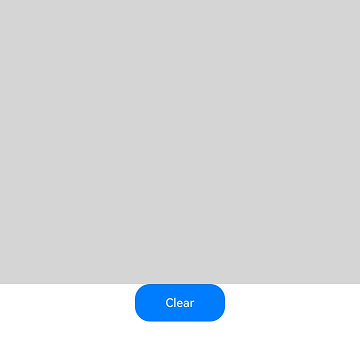

# DrawingRenderingContext

**DrawingRenderingContext** provides a rendering context for drawing rectangles, text, images, and other objects on a canvas.

> **NOTE**
>
> The initial APIs of this module are supported since API version 12. Updates will be marked with a superscript to indicate their earliest API version.

## APIs

DrawingRenderingContext(unit?: LengthMetricsUnit)

**Widget capability**: This API can be used in ArkTS widgets since API version 12.

**System capability**: SystemCapability.ArkUI.ArkUI.Full

**Parameters**

| Name     | Type| Mandatory  | Description|
| -------- | ---------------------------------------- | ---- | ---------------------------------------- |
| unit<sup>12+</sup>  | [LengthMetricsUnit](../js-apis-arkui-graphics.md#lengthmetricsunit12) | No   | Unit mode of the **DrawingRenderingContext** object. The value cannot be changed once set. The configuration method is the same as that of [CanvasRenderingContext2D](ts-canvasrenderingcontext2d.md#lengthmetricsunit12).<br>Default value: **DEFAULT**.|

## Attributes

**Atomic service API**: This API can be used in atomic services since API version 12.

**System capability**: SystemCapability.ArkUI.ArkUI.Full

| Name      | Type| Read Only| Optional| Description|
| ---------- | ------------ | -------------------- | ---------------------------- | ---------------------------- |
| size       | [Size](#size)    | No| No| Width and height of the context.<br>Default unit: vp                                           |
| canvas     | [Canvas](../../apis-arkgraphics2d/arkts-apis-graphics-drawing-Canvas.md) | No| No| **Canvas** object. For details, see [Canvas](../../apis-arkgraphics2d/arkts-apis-graphics-drawing-Canvas.md).|

### Size

**Atomic service API**: This API can be used in atomic services since API version 12.

**System capability**: SystemCapability.ArkUI.ArkUI.Full

| Name| Type| Read Only| Optional| Description|
| ---------- | -------------- | ------ | ---------------- | ------------------------ |
| width | number | No| No| Width of the **DrawingRenderingContext** object, which corresponds to the width of the associated **Canvas** component.|
| height | number | No| No| Height of the **DrawingRenderingContext** object, which corresponds to the height of the associated **Canvas** component.|

## Methods

### invalidate

invalidate(): void

**Atomic service API**: This API can be used in atomic services since API version 12.

**System capability**: SystemCapability.ArkUI.ArkUI.Full

Invalidates the component and triggers re-rendering of the component.

## DrawingCanvas<sup>12+</sup>

type DrawingCanvas = Canvas

Defines a canvas object for drawing content on the **XComponent** component.

**Atomic service API**: This API can be used in atomic services since API version 12.

**System capability**: SystemCapability.ArkUI.ArkUI.Full

| Type                 | Description          |
| --------------------- | -------------- |
| [Canvas](../../apis-arkgraphics2d/arkts-apis-graphics-drawing-Canvas.md) | Canvas object.|

## Example

This example shows how to use the APIs in **DrawingRenderingContext** for drawing.

```ts
import { common2D, drawing } from '@kit.ArkGraphics2D';

// xxx.ets
@Entry
@Component
struct CanvasExample {
  private context: DrawingRenderingContext = new DrawingRenderingContext();

  build() {
    Flex({ direction: FlexDirection.Column, alignItems: ItemAlign.Center, justifyContent: FlexAlign.Center }) {
      Canvas(this.context)
        .width('100%')
        .height('50%')
        .backgroundColor('#D5D5D5')
        .onReady(() => {
          let brush = new drawing.Brush();
          // Draw a circle with center at (200, 200) and radius of 100, filled with RGBA(39, 135, 217, 255).
          brush.setColor({
            alpha: 255,
            red: 39,
            green: 135,
            blue: 217
          });
          this.context.canvas.attachBrush(brush);
          this.context.canvas.drawCircle(200, 200, 100);
          this.context.canvas.detachBrush();
          this.context.invalidate();
        })
      Button("Clear")
        .width('120')
        .height('50')
        .onClick(() => {
          let color: common2D.Color = {
            alpha: 0,
            red: 0,
            green: 0,
            blue: 0
          };
          // Clear the canvas using RGBA(0, 0, 0, 0).
          this.context.canvas.clear(color);
          this.context.invalidate();
        })
    }
    .width('100%')
    .height('100%')
  }
}
```

Figure 1 Circle with center at (200, 200) and radius of 100, filled with RGBA(39, 135, 217, 255)
  
  

Figure 2 Clearing the canvas with the Clear button

  
<!--no_check-->