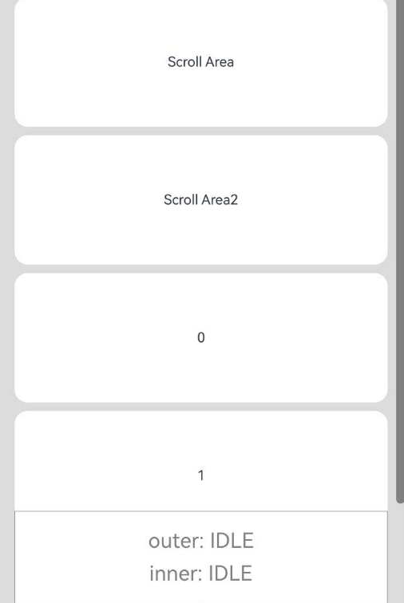
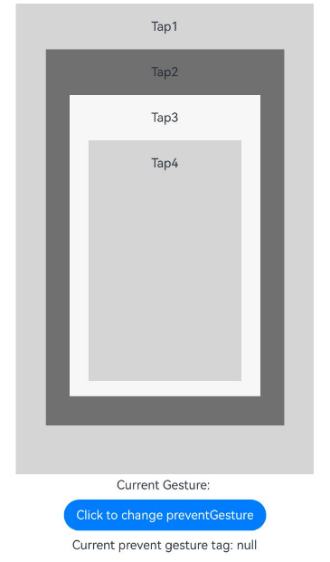

# Gesture Blocking Enhancement
<!--Kit: ArkUI-->
<!--Subsystem: ArkUI-->
<!--Owner: @jiangtao92-->
<!--Designer: @piggyguy-->
<!--Tester: @songyanhong-->
<!--Adviser: @HelloCrease-->

Gesture blocking enhancement offers components the capability to block gestures. You can handle built-in gestures in parallel with gestures that have a higher priority as needed, and can dynamically control the triggering of gesture events.

>  **NOTE**
>
>  The initial APIs of this module are supported since API version 12. Updates will be marked with a superscript to indicate their earliest API version.

## shouldBuiltInRecognizerParallelWith

shouldBuiltInRecognizerParallelWith(callback: ShouldBuiltInRecognizerParallelWithCallback): T

Provides a callback to set the parallel relationship between built-in gestures and gestures of other components in the response chain. The corresponding C API is [setInnerGestureParallelTo](../capi-arkui-nativemodule-arkui-nativegestureapi-1.md#setinnergestureparallelto).

**Atomic service API**: This API can be used in atomic services since API version 12.

**System capability**: SystemCapability.ArkUI.ArkUI.Full

**Parameters**
| Name       | Type                   | Mandatory | Description                         |
| ---------- | -------------------------- | ------- | ----------------------------- |
| callback      | [ShouldBuiltInRecognizerParallelWithCallback](#shouldbuiltinrecognizerparallelwithcallback) | Yes  |  Callback used to set the parallel relationship between built-in gestures and gestures of other components in the response chain. This callback is triggered during touch hit testing to form a gesture parallel relationship.|

**Return value**

| Type| Description|
| -------- | -------- |
| T | Current component.|

## ShouldBuiltInRecognizerParallelWithCallback

type ShouldBuiltInRecognizerParallelWithCallback = (current: GestureRecognizer, others: Array\<GestureRecognizer\>) => GestureRecognizer

Represents the callback used to set the parallel relationship between built-in gestures and gestures of other components in the response chain.

**Atomic service API**: This API can be used in atomic services since API version 12.

**System capability**: SystemCapability.ArkUI.ArkUI.Full

**Parameters**

| Name  | Type                     | Mandatory| Description                                                        |
| -------- | ------------------------- | ---- | ------------------------------------------------------------ |
| current | [GestureRecognizer](ts-gesture-common.md#gesturerecognizer12) | Yes  | Built-in gesture recognizer of the current component. Currently only a built-in gesture recognizer of the [GestureType](./ts-gesture-common.md#gesturetype11).PAN_GESTURE type is supported.|
| others | Array\<[GestureRecognizer](ts-gesture-common.md#gesturerecognizer12)\> | Yes  | Gesture recognizers of the same type from other components with higher priority in the response chain.|

**Return value**

| Type    | Description       |
| ------ | --------- |
| [GestureRecognizer](ts-gesture-common.md#gesturerecognizer12) | Gesture recognizer that is bound in parallel with the current recognizer.|

## onGestureRecognizerJudgeBegin<sup>13+</sup>

onGestureRecognizerJudgeBegin(callback: GestureRecognizerJudgeBeginCallback, exposeInnerGesture: boolean): T

Binds a custom gesture recognizer judgment callback to the component.

The **exposeInnerGesture** parameter indicates whether to expose gestures from built-in components within ArkUI system composite components to developers. When this parameter is set to **true**, these internal gestures are exposed.<br>
For scenarios where exposure of internal gestures is not required, use the original [onGestureRecognizerJudgeBegin](#ongesturerecognizerjudgebegin) API. Use this API with **exposeInnerGesture** set to **true** only when internal gesture exposure is necessary.

**Atomic service API**: This API can be used in atomic services since API version 13.

**System capability**: SystemCapability.ArkUI.ArkUI.Full

**Parameters**
| Name       | Type                   | Mandatory | Description                         |
| ---------- | -------------------------- | ------- | ----------------------------- |
| callback      | [GestureRecognizerJudgeBeginCallback](#gesturerecognizerjudgebegincallback) | Yes    |  Custom gesture recognizer judgment callback to bind to the component. This callback is triggered when the gesture bound to the component is about to succeed, to obtain the result.|
| exposeInnerGesture   | boolean         | Yes   | Whether to expose the internal gesture.<br>Default value: **false**<br>**NOTE**<br>For composite components, setting this parameter to **true** includes gesture recognizers from internal components in the current callback parameter.<br>Currently, only the [Tabs](ts-container-tabs.md) component is supported. Do not set this parameter for other components.<br>When this parameter is set to **false**, this API provides the same functionality as the [onGestureRecognizerJudgeBegin](#ongesturerecognizerjudgebegin) API.|

**Return value**

| Type| Description|
| -------- | -------- |
| T | Current component.|

## onGestureRecognizerJudgeBegin

onGestureRecognizerJudgeBegin(callback: GestureRecognizerJudgeBeginCallback): T

Binds a custom gesture recognizer judgment callback to the component.

**Atomic service API**: This API can be used in atomic services since API version 12.

**System capability**: SystemCapability.ArkUI.ArkUI.Full

**Parameters**
| Name       | Type                   | Mandatory | Description                         |
| ---------- | -------------------------- | ------- | ----------------------------- |
| callback      | [GestureRecognizerJudgeBeginCallback](#gesturerecognizerjudgebegincallback) | Yes    |  Custom gesture recognizer judgment callback. When a gesture bound to this component is about to succeed, the custom callback is triggered to obtain the result.|

**Return value**

| Type| Description|
| -------- | -------- |
| T | Current component.|

## GestureRecognizerJudgeBeginCallback

type GestureRecognizerJudgeBeginCallback = (event: BaseGestureEvent, current: GestureRecognizer, recognizers: Array\<GestureRecognizer\>, touchRecognizers?: Array\<TouchRecognizer\>) => GestureJudgeResult

Represents a custom gesture recognizer judgment callback type.

**System capability**: SystemCapability.ArkUI.ArkUI.Full

**Parameters**

| Name  | Type                     | Mandatory| Description                                                        |
| -------- | ------------------------- | ---- | ------------------------------------------------------------ |
| event | [BaseGestureEvent](./ts-gesture-common.md#basegestureevent11) | Yes  | Information about the current basic gesture event.<br>**Atomic service API**: This API can be used in atomic services since API version 12.|
| current | [GestureRecognizer](ts-gesture-common.md#gesturerecognizer12) | Yes  | Gesture recognizer object that is about to respond.<br>**Atomic service API**: This API can be used in atomic services since API version 12.|
| recognizers | Array\<[GestureRecognizer](ts-gesture-common.md#gesturerecognizer12)\> | Yes  | Other gesture recognizer objects in the response chain.<br>**Atomic service API**: This API can be used in atomic services since API version 12.|
| touchRecognizers<sup>20+</sup> | Array\<[TouchRecognizer](ts-gesture-common.md#touchrecognizer20)\> | No  | Touch recognizers in the response chain. The default value is **null**, indicating no responsive touch recognizers in the current gesture-bound component and its descendants.<br>**Atomic service API**: This API can be used in atomic services since API version 20.|
**Return value**

| Type    | Description       |
| ------ | --------- |
| [GestureJudgeResult](./ts-gesture-common.md#gesturejudgeresult12) | Judgment result indicating whether gesture recognition succeeds.|

## onTouchTestDone<sup>20+</sup>

onTouchTestDone(callback: TouchTestDoneCallback): T

Specifies whether gesture recognizers participate in subsequent processing after [hit testing](../../../ui/arkts-interaction-basic-principles.md#hit-testing) completes.

**Atomic service API**: This API can be used in atomic services since API version 20.

**System capability**: SystemCapability.ArkUI.ArkUI.Full

**Parameters**

| Name       | Type                   | Mandatory | Description                         |
| ---------- | -------------------------- | ------- | ----------------------------- |
| callback      | [TouchTestDoneCallback](#touchtestdonecallback20) | Yes  |  Callback to specify gesture recognizer participation in subsequent processing. Triggered after [hit testing](../../../ui/arkts-interaction-basic-principles.md#hit-testing) completes but before user gesture recognition begins.|

**Return value**

| Type| Description|
| -------- | -------- |
| T | Current component.|

## TouchTestDoneCallback<sup>20+</sup>

type TouchTestDoneCallback = (event: BaseGestureEvent, recognizers: Array\<GestureRecognizer\>) => void

Represents the callback type for dynamically specifying gesture recognizer participation in gesture processing.

**Atomic service API**: This API can be used in atomic services since API version 20.

**System capability**: SystemCapability.ArkUI.ArkUI.Full

**Parameters**

| Name  | Type                     | Mandatory| Description                                                        |
| -------- | ------------------------- | ---- | ------------------------------------------------------------ |
| event | [BaseGestureEvent](./ts-gesture-common.md#basegestureevent11) | Yes  | Basic gesture event information after [hit testing](../../../ui/arkts-interaction-basic-principles.md#hit-testing) completes.<br>**NOTE**<br>Only **BaseGestureEvent** information is contained, excluding child class extensions.<br>The values of **axisHorizontal** and **axisVertical** are **0**.|
| recognizers | Array\<[GestureRecognizer](ts-gesture-common.md#gesturerecognizer12)\> | Yes  | All gesture recognizers after [hit testing](../../../ui/arkts-interaction-basic-principles.md#hit-testing) completes.|

## Example

### Example 1: Implementing Nested Scrolling

This example demonstrates how to implement nested scrolling using **shouldBuiltInRecognizerParallelWith** and **onGestureRecognizerJudgeBegin**. The inner component takes precedence in responding to swipe gestures. When the inner component reaches the top or bottom, the outer component can then take over the scrolling.

```ts
// xxx.ets
@Entry
@Component
struct FatherControlChild {
  scroller: Scroller = new Scroller();
  scroller2: Scroller = new Scroller();
  private arr: number[] = [0, 1, 2, 3, 4, 5, 6, 7, 8, 9];
  private childRecognizer: GestureRecognizer = new GestureRecognizer();
  private currentRecognizer: GestureRecognizer = new GestureRecognizer();
  private lastOffset: number = 0;

  build() {
    Stack({ alignContent: Alignment.TopStart }) {
      Scroll(this.scroller) { // Outer scrollable container.
        Column() {
          Text("Scroll Area")
            .width('90%')
            .height(150)
            .backgroundColor(0xFFFFFF)
            .borderRadius(15)
            .fontSize(16)
            .textAlign(TextAlign.Center)
            .margin({ top: 10 })
          Scroll(this.scroller2) { // Inner scrollable container.
            Column() {
              Text("Scroll Area2")
                .width('90%')
                .height(150)
                .backgroundColor(0xFFFFFF)
                .borderRadius(15)
                .fontSize(16)
                .textAlign(TextAlign.Center)
                .margin({ top: 10 })
              Column() {
                ForEach(this.arr, (item: number) => {
                  Text(item.toString())
                    .width('90%')
                    .height(150)
                    .backgroundColor(0xFFFFFF)
                    .borderRadius(15)
                    .fontSize(16)
                    .textAlign(TextAlign.Center)
                    .margin({ top: 10 })
                }, (item: string) => item)
              }.width('100%')
            }
          }
          .id("inner")
          .width('100%')
          .height(800)
        }.width('100%')
      }
      .id("outer")
      .height(600)
      .scrollable(ScrollDirection.Vertical) // The scrollbar scrolls in the vertical direction.
      .scrollBar(BarState.On) // The scrollbar is always displayed.
      .scrollBarColor(Color.Gray) // The scrollbar color is gray.
      .scrollBarWidth(10) // The scrollbar width is 10.
      .edgeEffect(EdgeEffect.None)
      .shouldBuiltInRecognizerParallelWith((current: GestureRecognizer, others: Array<GestureRecognizer>) => {
        for (let i = 0; i < others.length; i++) {
          let target = others[i].getEventTargetInfo();
          if (target) {
            if (target.getId() == "inner" && others[i].isBuiltIn() &&
              others[i].getType() == GestureControl.GestureType.PAN_GESTURE) { // Identify the recognizer that to be bound to parallelGesture.
              this.currentRecognizer = current; // Save the recognizer of the current component.
              this.childRecognizer = others[i]; // Save the recognizer to form a parallel gesture.
              return others[i]; // Return the recognizer to form a parallel gesture.
            }
          }
        }
        return undefined;
      })
      .onGestureRecognizerJudgeBegin((event: BaseGestureEvent, current: GestureRecognizer,
        others: Array<GestureRecognizer>) => { // When the implementation is about to succeed, set the recognizer enabling state based on the current component state.
        if (current) {
          let target = current.getEventTargetInfo();
          if (target) {
            if (target.getId() == "outer" && current.isBuiltIn() &&
              current.getType() == GestureControl.GestureType.PAN_GESTURE) {
              if (others) {
                for (let i = 0; i < others.length; i++) {
                  let target = others[i].getEventTargetInfo() as ScrollableTargetInfo;
                  if (target instanceof ScrollableTargetInfo && target.getId() == "inner") { // Identify the recognizer to work in parallel on the response chain.
                    let panEvent = event as PanGestureEvent;
                    if (target.isEnd()) { // Dynamically control the recognizer's enabled state based on the current component state and direction of movement.
                      if (panEvent && panEvent.offsetY < 0) {
                        this.childRecognizer.setEnabled(false);
                        this.currentRecognizer.setEnabled(true);
                      } else {
                        this.childRecognizer.setEnabled(true);
                        this.currentRecognizer.setEnabled(false);
                      }
                    } else if (target.isBegin()) {
                      if (panEvent.offsetY > 0) {
                        this.childRecognizer.setEnabled(false);
                        this.currentRecognizer.setEnabled(true);
                      } else {
                        this.childRecognizer.setEnabled(true);
                        this.currentRecognizer.setEnabled(false);
                      }
                    } else {
                      this.childRecognizer.setEnabled(true);
                      this.currentRecognizer.setEnabled(false);
                    }
                  }
                }
              }
            }
          }
        }
        return GestureJudgeResult.CONTINUE;
      })
      .parallelGesture( // Bind a pan gesture as a dynamic controller.
        PanGesture()
          .onActionUpdate((event: GestureEvent) => {
            if (this.childRecognizer.getState() != GestureRecognizerState.SUCCESSFUL ||
              this.currentRecognizer.getState() != GestureRecognizerState.SUCCESSFUL) { // If the recognizer is not in the SUCCESSFUL state, no control is applied.
              return;
            }
            let target = this.childRecognizer.getEventTargetInfo() as ScrollableTargetInfo;
            let currentTarget = this.currentRecognizer.getEventTargetInfo() as ScrollableTargetInfo;
            if (target instanceof ScrollableTargetInfo && currentTarget instanceof ScrollableTargetInfo) {
              if (target.isEnd()) { // Adjust the enabled state of the gesture recognizers based on the current component state during movement.
                if ((event.offsetY - this.lastOffset) < 0) {
                  this.childRecognizer.setEnabled(false);
                  if (currentTarget.isEnd()) {
                    this.currentRecognizer.setEnabled(false);
                  } else {
                    this.currentRecognizer.setEnabled(true);
                  }
                } else {
                  this.childRecognizer.setEnabled(true);
                  this.currentRecognizer.setEnabled(false);
                }
              } else if (target.isBegin()) {
                if ((event.offsetY - this.lastOffset) > 0) {
                  this.childRecognizer.setEnabled(false);
                  if (currentTarget.isBegin()) {
                    this.currentRecognizer.setEnabled(false);
                  } else {
                    this.currentRecognizer.setEnabled(true);
                  }
                } else {
                  this.childRecognizer.setEnabled(true);
                  this.currentRecognizer.setEnabled(false);
                }
              } else {
                this.childRecognizer.setEnabled(true);
                this.currentRecognizer.setEnabled(false);
              }
            }
            this.lastOffset = event.offsetY;
          })
      )
    }.width('100%').height('100%').backgroundColor(0xDCDCDC)
  }
}
```


### Example 2: Blocking Inner Container Gestures in Nested Scrolling

This example demonstrates how to set the **exposeInnerGesture** parameter to **true** to enable a first-level **Tabs** container to intercept the swipe gestures of a nested second-level **Tabs** container, thereby triggering the swipe gestures of the built-in **Swiper** component of first-level **Tabs** container.
You can define variables to record the index of the inner **Tabs** container and use this index to determine when to trigger the callback to block the swipe gestures of the outer **Tabs** container when the inner **Tabs** container reaches its boundaries.

```ts
// xxx.ets
@Entry
@Component
struct Index {
  @State currentIndex: number = 0;
  @State selectedIndex: number = 0;
  @State fontColor: string = '#182431';
  @State selectedFontColor: string = '#007DFF';
  innerSelectedIndex: number = 0; // Record the index of the inner Tabs container.
  controller?: TabsController = new TabsController();

  @Builder
  tabBuilder(index: number, name: string) {
    Column() {
      Text(name)
        .fontColor(this.selectedIndex === index ? this.selectedFontColor : this.fontColor)
        .fontSize(16)
        .fontWeight(this.selectedIndex === index ? 500 : 400)
        .lineHeight(22)
        .margin({ top: 17, bottom: 7 })
      Divider()
        .strokeWidth(2)
        .color('#007DFF')
        .opacity(this.selectedIndex === index ? 1 : 0)
    }.width('100%')
  }

  build() {
    Column() {
      Tabs({ barPosition: BarPosition.Start, index: this.currentIndex, controller: this.controller }) {
        TabContent() {
          Column().width('100%').height('100%').backgroundColor(Color.Green)
        }.tabBar(this.tabBuilder(0, 'green'))

        TabContent() {
          Tabs() {
            TabContent() {
              Column().width('100%').height('100%').backgroundColor(Color.Blue)
            }.tabBar(new SubTabBarStyle('blue'))

            TabContent() {
              Column().width('100%').height('100%').backgroundColor(Color.Pink)
            }.tabBar(new SubTabBarStyle('pink'))
          }
          .onAnimationStart((index: number, targetIndex: number) => {
            console.info('ets onGestureRecognizerJudgeBegin child:' + targetIndex)
            this.innerSelectedIndex = targetIndex
          })
          .onGestureRecognizerJudgeBegin((event: BaseGestureEvent, current: GestureRecognizer,
            others: Array<GestureRecognizer>): GestureJudgeResult => { // When gesture recognition is about to be successful, set the recognizer's enabled state based on the current component state.
            console.info('ets onGestureRecognizerJudgeBegin child')
            if (current) {
              let target = current.getEventTargetInfo();
              if (target && current.isBuiltIn() && current.getType() == GestureControl.GestureType.PAN_GESTURE) {
                console.info('ets onGestureRecognizerJudgeBegin child PAN_GESTURE')
                let panEvent = event as PanGestureEvent;
                if (panEvent && panEvent.velocityX < 0 && this.innerSelectedIndex === 1) { // The inner Tabs component has reached the end.
                  console.info('ets onGestureRecognizerJudgeBegin child reject end')
                  return GestureJudgeResult.REJECT;
                }
                if (panEvent && panEvent.velocityX > 0 && this.innerSelectedIndex === 0) { // The inner Tabs component has reached the beginning.
                  console.info('ets onGestureRecognizerJudgeBegin child reject begin')
                  return GestureJudgeResult.REJECT;
                }
              }
            }
            return GestureJudgeResult.CONTINUE;
          }, true)
        }.tabBar(this.tabBuilder(1, 'blue and pink'))

        TabContent() {
          Column().width('100%').height('100%').backgroundColor(Color.Brown)
        }.tabBar(this.tabBuilder(2, 'brown'))
      }
      .onAnimationStart((index: number, targetIndex: number, event: TabsAnimationEvent) => {
        // Triggered when the switching animation starts. The target tab shows an underline.
        this.selectedIndex = targetIndex
      })
    }
  }
}
```

 

 
### Example 3: Blocking Gestures to Obtain Properties

This example demonstrates how to use the **onGestureRecognizerJudgeBegin** API to determine the gesture recognizer type and obtain corresponding properties.

```ts
// xxx.ets
@Entry
@Component
struct Index {
  @State message: string = 'Gesture';

  build() {
    Column() {
      Row({ space: 20 }) {
        Text(this.message)
          .width(400)
          .height(80)
          .fontSize(23)
      }.margin(25)
    }
    .margin(50)
    .width(400)
    .height(200)
    .borderWidth(2)
    .gesture(TapGesture())
    .gesture(LongPressGesture())
    .gesture(PanGesture({ direction: PanDirection.Vertical }))
    .gesture(PinchGesture())
    .gesture(RotationGesture())
    .gesture(SwipeGesture({ direction: SwipeDirection.Horizontal }))
    // Bind a custom gesture recognizer judgment callback to the component.
    .onGestureRecognizerJudgeBegin((event: BaseGestureEvent, current: GestureRecognizer,
      others: Array<GestureRecognizer>) => {
      if (current) {
        // Check whether the gesture is a pan gesture.
        if (current.getType() == GestureControl.GestureType.PAN_GESTURE) {
          let target = current as PanRecognizer;
          this.message = 'PanGesture\ndistance:' + target.getPanGestureOptions().getDistance() + '\nfingers:' +
          target.getFingerCount() + '\nisFingerCountLimited:' + target.isFingerCountLimit();
        }
        // Check whether the gesture is a long press gesture.
        if (current.getType() == GestureControl.GestureType.LONG_PRESS_GESTURE) {
          let target = current as LongPressRecognizer;
          this.message = 'LongPressGesture\nfingers:' + target.getFingerCount() + '\nisFingerCountLimited:' +
          target.isFingerCountLimit() + '\nrepeat:' + target.isRepeat() + '\nduration:' + target.getDuration();
        }
        // Check whether the gesture is a pinch gesture.
        if (current.getType() == GestureControl.GestureType.PINCH_GESTURE) {
          let target = current as PinchRecognizer;
          this.message = 'PinchGesture\ndistance:' + target.getDistance() + '\nfingers:' +
          target.getFingerCount() + '\nisFingerCountLimited:' + target.isFingerCountLimit();
        }
        // Check whether the gesture is a tap gesture.
        if (current.getType() == GestureControl.GestureType.TAP_GESTURE) {
          let target = current as TapRecognizer;
          this.message = 'TapGesture\ncount:' + target.getTapCount() + '\nfingers:' +
          target.getFingerCount() + '\nisFingerCountLimited:' + target.isFingerCountLimit();
        }
        // Check whether the gesture is a rotation gesture.
        if (current.getType() == GestureControl.GestureType.ROTATION_GESTURE) {
          let target = current as RotationRecognizer;
          this.message = 'RotationGesture\nangle:' + target.getAngle() + '\nfingers:' +
          target.getFingerCount() + '\nisFingerCountLimited:' + target.isFingerCountLimit();
        }
        // Check whether the gesture is a swipe gesture.
        if (current.getType() == GestureControl.GestureType.SWIPE_GESTURE) {
          let target = current as SwipeRecognizer;
          this.message = 'SwipeGesture\ndirection:' + target.getDirection() + '\nfingers:' +
          target.getFingerCount() + '\nisFingerCountLimited:' + target.isFingerCountLimit() + '\nspeed:' +
          target.getVelocityThreshold();
        }
      }
      return GestureJudgeResult.CONTINUE;
    })
  }
}
```

 

 ### Example 4: Canceling Child Component Touch Events on Successful Gesture Trigger

This example demonstrates how to use **onGestureRecognizerJudgeBegin** to implement gesture judgment. When the parent container's gesture is successfully triggered, it calls **cancelTouch()** to forcibly cancel touch events on child components, enabling precise switching between parent and child gesture control.

 ```ts
 // xxx.ets
@Entry
@Component
struct FatherControlChild {
  scroller: Scroller = new Scroller();
  scroller2: Scroller = new Scroller()
  private arr: number[] = [0, 1, 2, 3, 4, 5, 6, 7, 8, 9];
  private childRecognizer: GestureRecognizer = new GestureRecognizer();
  private currentRecognizer: GestureRecognizer = new GestureRecognizer();
  private lastOffset: number = 0;

  @State outerState: string = "IDLE";
  @State innerState: string = "IDLE";
  @State willCancel: boolean = false;

  build() {
    Stack({ alignContent: Alignment.TopStart }) {
      Scroll(this.scroller) { // Outer scrollable container.
        Column() {
          Text("Scroll Area")
            .width('90%')
            .height(150)
            .backgroundColor(0xFFFFFF)
            .borderRadius(15)
            .fontSize(16)
            .textAlign(TextAlign.Center)
            .margin({ top: 10 })

          Scroll(this.scroller2) { // Inner scrollable container.
            Column() {
              Text("Scroll Area2")
                .width('90%')
                .height(150)
                .backgroundColor(0xFFFFFF)
                .borderRadius(15)
                .fontSize(16)
                .textAlign(TextAlign.Center)
                .margin({ top: 10 })

              Column() {
                ForEach(this.arr, (item: number) => {
                  Text(item.toString())
                    .width('90%')
                    .height(150)
                    .backgroundColor(0xFFFFFF)
                    .borderRadius(15)
                    .fontSize(16)
                    .textAlign(TextAlign.Center)
                    .margin({ top: 10 })
                }, (item: string) => item)
              }.width('100%')
            }
          }
          .id("inner")
          .width('100%')
          .height(800)
          .onTouch((event) => {
            if (event.type === TouchType.Down) {
              this.innerState = "TOUCHING";
              this.willCancel = false;
            } else if (event.type === TouchType.Up || event.type === TouchType.Cancel) {
              if (this.willCancel) {
                this.innerState = "CANCELLED";
                setTimeout(() => {
                  this.innerState = "IDLE";
                  this.willCancel = false;
                }, 1000);
              } else {
                this.innerState = "IDLE";
              }
            }
          })
        }.width('100%')
      }
      .id("outer")
      .height('100%')
      .scrollable(ScrollDirection.Vertical)
      .scrollBar(BarState.On)
      .scrollBarColor(Color.Gray)
      .scrollBarWidth(10)
      .edgeEffect(EdgeEffect.None)
      .shouldBuiltInRecognizerParallelWith((current: GestureRecognizer, others: Array<GestureRecognizer>) => {
        for (let i = 0; i < others.length; i++) {
          let target = others[i].getEventTargetInfo();
          if (target) {
            if (target.getId() == "inner" && others[i].isBuiltIn() &&
              others[i].getType() == GestureControl.GestureType.PAN_GESTURE) { // Identify the recognizer that to be bound to parallelGesture.
              this.currentRecognizer = current; // Save the recognizer of the current component.
              this.childRecognizer = others[i]; // Save the recognizer to form a parallel gesture.
              return others[i]; // Return the recognizer to form a parallel gesture.
            }
          }
        }
        return undefined;
      })
      .onGestureRecognizerJudgeBegin((event: BaseGestureEvent, current: GestureRecognizer,
        others: Array<GestureRecognizer>,
        touchRecognizers?: Array<TouchRecognizer>) => { // When the implementation is about to succeed, set the recognizer enabling state based on the current component state.
        if (current && touchRecognizers) {
          let target = current.getEventTargetInfo();
          if (target) {
            if (target.getId() == "outer" && current.isBuiltIn() &&
              current.getType() == GestureControl.GestureType.PAN_GESTURE) {
              return GestureJudgeResult.CONTINUE
            }
            for (let index = 0; index < touchRecognizers.length; index++) {
              const element = touchRecognizers![index];
              let touchTarget = element.getEventTargetInfo()
              if (touchTarget && touchTarget.getId() == "inner") {
                this.willCancel = true;
                element.cancelTouch();
              }
            }
          }
        }
        return GestureJudgeResult.CONTINUE;
      })
      .onTouch((event) => {
        if (event.type === TouchType.Down) {
          this.outerState = "TOUCHING";
        } else if (event.type === TouchType.Up || event.type === TouchType.Cancel) {
          this.outerState = "IDLE";
        }
      })
      .parallelGesture( // Bind a pan gesture as a dynamic controller.
        PanGesture()
          .onActionUpdate((event: GestureEvent) => {
            if (this.childRecognizer.getState() != GestureRecognizerState.SUCCESSFUL ||
              this.currentRecognizer.getState() != GestureRecognizerState.SUCCESSFUL) { // If the recognizer is not in the SUCCESSFUL state, no control is applied.
              return;
            }
            let target = this.childRecognizer.getEventTargetInfo() as ScrollableTargetInfo;
            let currentTarget = this.currentRecognizer.getEventTargetInfo() as ScrollableTargetInfo;
            if (target instanceof ScrollableTargetInfo && currentTarget instanceof ScrollableTargetInfo) {
              if (target.isEnd()) { // Adjust the enabled state of the gesture recognizers based on the current component state during movement.
                if ((event.offsetY - this.lastOffset) < 0) {
                  this.childRecognizer.setEnabled(false)
                  if (currentTarget.isEnd()) {
                    this.currentRecognizer.setEnabled(false)
                  } else {
                    this.currentRecognizer.setEnabled(true)
                  }
                } else {
                  this.childRecognizer.setEnabled(true)
                  this.currentRecognizer.setEnabled(false)
                }
              } else if (target.isBegin()) {
                if ((event.offsetY - this.lastOffset) > 0) {
                  this.childRecognizer.setEnabled(false)
                  if (currentTarget.isBegin()) {
                    this.currentRecognizer.setEnabled(false)
                  } else {
                    this.currentRecognizer.setEnabled(true)
                  }
                } else {
                  this.childRecognizer.setEnabled(true)
                  this.currentRecognizer.setEnabled(false)
                }
              } else {
                this.childRecognizer.setEnabled(true)
                this.currentRecognizer.setEnabled(false)
              }
            }
            this.lastOffset = event.offsetY
          })
      )
      Column() { // Display the outer layer status.
        Text(`outer: ${this.outerState}`)
          .fontSize(24)
          .fontColor(this.outerState === "TOUCHING" ? Color.Green : Color.Gray)
          .margin({ bottom: 10 })
        // Display the inner layer status.
        Text(`inner: ${this.innerState === "TOUCHING" ? "TOUCHING" : this.innerState}`)
          .fontSize(24)
          .fontColor(
            this.innerState === "TOUCHING" ? Color.Blue :
              this.innerState === "CANCELLED" ? Color.Red : Color.Gray
          )
      }
      .width('90%')
      .backgroundColor(Color.White)
      .border({ width: 1, color: Color.Gray })
      .position({ x: '5%', y: '80%'})
      .padding(20)
    }
    .width('100%')
    .height('100%')
    .backgroundColor(0xDCDCDC)
  }
}
```


 ### Example 5: Customizing Gesture Recognizer Participation in Gesture Processing

This example shows how to use **onTouchTestDone** to specify whether gesture recognizers participate in subsequent gesture processing. When the callback is triggered, it calls **preventBegin()** to prevent gesture recognizers from participating in further processing.

```ts
// xxx.ets
@Entry
@Component
struct TouchTestDoneExample {
  @State tagList: string[] = ['Null', 'Tap1', 'Tap2', 'Tap3', 'Tap4'];
  @State tagId: number = 0;
  @State textValue: string = '';

  // In the multi-layer nesting scenario, bind a tap gesture to each layer of components.
  build() {
    Column() {
      Column() {
        Text('Tap1')
          .margin(20)
        Column() {
          Text('Tap2')
            .margin(20)
          Column() {
            Text('Tap3')
              .margin(20)
            Column() {
              Text('Tap4')
                .margin(20)
            }
            .backgroundColor('#D5D5D5')
            .width('80%')
            .height('80%')
            .gesture(TapGesture().tag('Tap4').onAction(() => {
              this.textValue = 'Tap4';
            }))
          }
          .backgroundColor('#F7F7F7')
          .width('80%')
          .height('80%')
          .gesture(TapGesture().tag('Tap3').onAction(() => {
            this.textValue = 'Tap3';
          }))
        }
        .backgroundColor('#707070')
        .width('80%')
        .height('80%')
        .gesture(TapGesture().tag('Tap2').onAction(() => {
          this.textValue = 'Tap2';
        }))
      }
      .backgroundColor('#D5D5D5')
      .width('80%')
      .height('80%')
      .gesture(TapGesture().tag('Tap1').onAction(() => {
        this.textValue = 'Tap1';
      }))
      // Use onTouchTestDone to customize gesture recognizer participation by calling preventBegin().
      .onTouchTestDone((event, recognizers) => {
        console.info('event is ' + JSON.stringify(event));
        for (let i = 0; i < recognizers.length; i++) {
          let recognizer = recognizers[i];
          console.info('type is ' + JSON.stringify(recognizer.getType()))
          // Block specific gesture recognizers based on the tag value.
          if (recognizer.getTag() == this.tagList[this.tagId]) {
            recognizer.preventBegin();
          }
        }
      })

      Text('Current Gesture: ' + this.textValue)
        .margin(5)

      Button('Click to change preventGesture')
        .margin(5)
        .onClick(() => {
          this.tagId++;
          this.tagId %= 5;
        })
      Text('Current prevent gesture tag: ' + this.tagList[this.tagId])
        .margin(5)

    }
    .width('100%')
    .height('100%')

    // Demo behavior: When the overlapping area of Tap2 and Tap1 is tapped: Without preventBegin: The Tap2 gesture is triggered; with preventBegin blocking Tap2: The Tap1 gesture is triggered.
  }
}
```

