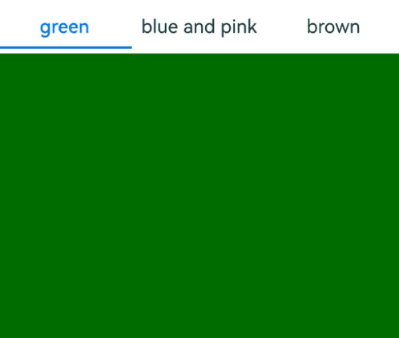

# Gesture Blocking Enhancement

Gesture blocking enhancement offers components the capability to block gestures. You can handle built-in gestures in parallel with gestures that have a higher priority as needed, and can dynamically control the triggering of gesture events.

>  **NOTE**
>
>  The initial APIs of this module are supported since API version 12. Updates will be marked with a superscript to indicate their earliest API version.

## shouldBuiltInRecognizerParallelWith

shouldBuiltInRecognizerParallelWith(callback: ShouldBuiltInRecognizerParallelWithCallback): T

Provides a callback to set the parallel relationship between built-in gestures and gestures of other components in the response chain.

**Atomic service API**: This API can be used in atomic services since API version 12.

**System capability**: SystemCapability.ArkUI.ArkUI.Full

**Parameters**
| Name       | Type                   | Mandatory | Description                         |
| ---------- | -------------------------- | ------- | ----------------------------- |
| callback      | [ShouldBuiltInRecognizerParallelWithCallback](#shouldbuiltinrecognizerparallelwithcallback) | Yes  |  Callback used to set the parallel relationship between built-in gestures and gestures of other components in the response chain. This callback is triggered during touch hit testing to form a gesture parallel relationship.|

**Return value**

| Type| Description|
| -------- | -------- |
| T | Current component.|

## ShouldBuiltInRecognizerParallelWithCallback

type ShouldBuiltInRecognizerParallelWithCallback = (current: GestureRecognizer, others: Array\<GestureRecognizer\>) => GestureRecognizer

Represents the callback used to set the parallel relationship between built-in gestures and gestures of other components in the response chain.

**Atomic service API**: This API can be used in atomic services since API version 12.

**System capability**: SystemCapability.ArkUI.ArkUI.Full

**Parameters**

| Name  | Type                     | Mandatory| Description                                                        |
| -------- | ------------------------- | ---- | ------------------------------------------------------------ |
| current | [GestureRecognizer](#gesturerecognizer) | Yes  | Built-in gesture recognizer of the current component. Currently only a built-in gesture recognizer of the [PAN_GESTURE](ts-gesture-customize-judge.md#gesturejudgeresult11) type is supported.|
| others | Array\<[GestureRecognizer](#gesturerecognizer)\> | Yes  | Gesture recognizers of the same type from other components with higher priority in the response chain.|

**Return value**

| Type    | Description       |
| ------ | --------- |
| [GestureRecognizer](#gesturerecognizer) | Gesture recognizer that is bound in parallel with the current recognizer.|

## GestureRecognizer

Defines a gesture recognizer object.

### getTag

getTag(): string

Obtains the tag of this gesture recognizer.

**Atomic service API**: This API can be used in atomic services since API version 12.

**System capability**: SystemCapability.ArkUI.ArkUI.Full

**Return value**

| Type    | Description       |
| ------ | --------- |
| string | Tag of the current gesture recognizer.|

### getType

getType(): GestureControl.GestureType

Obtains the type of this gesture recognizer.

**Atomic service API**: This API can be used in atomic services since API version 12.

**System capability**: SystemCapability.ArkUI.ArkUI.Full

**Return value**

| Type    | Description       |
| ------ | --------- |
| [GestureControl.GestureType](ts-gesture-customize-judge.md#gesturetype12) | Type of the current gesture recognizer.|

### isBuiltIn

isBuiltIn(): boolean

Obtains whether this gesture recognizer is a built-in gesture.

**Atomic service API**: This API can be used in atomic services since API version 12.

**System capability**: SystemCapability.ArkUI.ArkUI.Full

**Return value**

| Type    | Description       |
| ------ | --------- |
| boolean | Whether the current gesture recognizer is a built-in gesture. The value **true** means that the gesture recognizer is a built-in gesture, and **false** means the opposite.|

### setEnabled

setEnabled(isEnabled: boolean): void

Sets the enabled state of this gesture recognizer.

**Atomic service API**: This API can be used in atomic services since API version 12.

**System capability**: SystemCapability.ArkUI.ArkUI.Full

**Parameters**

| Name    | Type                          | Mandatory  | Description |
| ------- | ---------------------------------- | ---- | ----- |
| isEnabled   | boolean         | Yes   | Enabled state to set. The value **true** means that the gesture recognizer is enabled and will trigger events, and **false** means the opposite.|

### isEnabled

isEnabled(): boolean

Obtains the enabled state of this gesture recognizer.

**Atomic service API**: This API can be used in atomic services since API version 12.

**System capability**: SystemCapability.ArkUI.ArkUI.Full

**Return value**

| Type    | Description       |
| ------ | --------- |
| boolean | Enabled state of the gesture recognizer. The value **true** means that the gesture recognizer is enabled and will trigger events, and **false** means the opposite.|

### getState

getState(): GestureRecognizerState

Obtains the state of this gesture recognizer.

**Atomic service API**: This API can be used in atomic services since API version 12.

**System capability**: SystemCapability.ArkUI.ArkUI.Full

**Return value**

| Type    | Description       |
| ------ | --------- |
| [GestureRecognizerState](#gesturerecognizerstate) | State of the gesture recognizer.|

### getEventTargetInfo

getEventTargetInfo(): EventTargetInfo

Obtains the information about the component corresponding to this gesture recognizer.

**Atomic service API**: This API can be used in atomic services since API version 12.

**System capability**: SystemCapability.ArkUI.ArkUI.Full

**Return value**

| Type    | Description       |
| ------ | --------- |
| [EventTargetInfo](#eventtargetinfo) | Information about the component corresponding to the current gesture recognizer.|

### isValid

isValid(): boolean;

Whether the current gesture recognizer is valid.

**Atomic service API**: This API can be used in atomic services since API version 12.

**System capability**: SystemCapability.ArkUI.ArkUI.Full

**Return value**

| Type    | Description       |
| ------ | --------- |
| boolean | Whether the current gesture recognizer is valid. Returns **false** if the component bound to this recognizer is destructed or if the recognizer is not on the response chain.|

## GestureRecognizerState

Enumerates the gesture recognizer states.

**Atomic service API**: This API can be used in atomic services since API version 12.

**System capability**: SystemCapability.ArkUI.ArkUI.Full

| Name   | Value  | Description                              |
| ------- | ---- | ---------------------------------- |
| READY | 0    | Ready.|
| DETECTING    | 1    | Detecting.|
| PENDING    | 2    | Pending.|
| BLOCKED    | 3    | Blocked.|
| SUCCESSFUL    | 4    | Successful.|
| FAILED    | 5    | Failed.|

## EventTargetInfo

Provides the information about the component corresponding to the gesture recognizer.

### getId

getId(): string

Obtains the ID of this component.

**Atomic service API**: This API can be used in atomic services since API version 12.

**System capability**: SystemCapability.ArkUI.ArkUI.Full

**Return value**

| Type    | Description       |
| ------ | --------- |
| string | [ID](./ts-universal-attributes-component-id.md#id) of the current component.|

## ScrollableTargetInfo

Provides the information about the scrollable container component corresponding to the gesture recognizer. It inherits from [EventTargetInfo](#eventtargetinfo).

### isBegin

isBegin(): boolean

Checks whether this scrollable container component is scrolled to the top. If it is a **Swiper** component in loop mode, **false** is returned.

**Atomic service API**: This API can be used in atomic services since API version 12.

**System capability**: SystemCapability.ArkUI.ArkUI.Full

**Return value**

| Type    | Description       |
| ------ | --------- |
| boolean | Whether the current scrollable container component is scrolled to the top. The value **true** means that the component is scrolled to the top, and **false** means the opposite.|

### isEnd

isEnd(): boolean

Checks whether this scrollable container component is scrolled to the bottom. If it is a **Swiper** component in loop mode, **false** is returned.

**Atomic service API**: This API can be used in atomic services since API version 12.

**System capability**: SystemCapability.ArkUI.ArkUI.Full

**Return value**

| Type    | Description       |
| ------ | --------- |
| boolean | Whether the current scrollable container component is scrolled to the bottom. The value **true** means that the component is scrolled to the bottom, and **false** means the opposite.|

### getFingerCount<sup>18+</sup>

getFingerCount(): number

Obtains the number of fingers required to trigger the preset gesture.

**Atomic service API**: This API can be used in atomic services since API version 18.

**System capability**: SystemCapability.ArkUI.ArkUI.Full

**Return value**

| Type    | Description       |
| ------ | --------- |
| number | Number of fingers required to trigger the preset gesture.<br>Value range: an integer from 1 to 10.|

### isFingerCountLimit<sup>18+</sup>

isFingerCountLimit(): boolean

Checks whether the preset gesture will detect the number of fingers on the screen.

**Atomic service API**: This API can be used in atomic services since API version 18.

**System capability**: SystemCapability.ArkUI.ArkUI.Full

**Return value**

| Type    | Description       |
| ------ | --------- |
| boolean | Whether the preset gesture will detect the number of fingers on the screen. Returns **true** if the gesture will detect the number of fingers on the touch screen; returns **false** otherwise.|

## PanRecognizer

Defines a pan gesture recognizer object. It inherits from [GestureRecognizer](#gesturerecognizer).

### getPanGestureOptions

getPanGestureOptions(): PanGestureOptions

Obtains the properties of this pan gesture recognizer.

**Atomic service API**: This API can be used in atomic services since API version 12.

**System capability**: SystemCapability.ArkUI.ArkUI.Full

**Return value**

| Type    | Description       |
| ------ | --------- |
| [PanGestureOptions](./ts-basic-gestures-pangesture.md#pangestureoptions) | Properties of the current pan gesture recognizer.|

## TapRecognizer<sup>18+</sup>

Implements a tap gesture recognizer. It inherits from [GestureRecognizer](#gesturerecognizer).

### getTapCount<sup>18+</sup>

getTapCount(): number

Obtains the number of consecutive taps required for the tap gesture to be recognized.

**Atomic service API**: This API can be used in atomic services since API version 18.

**System capability**: SystemCapability.ArkUI.ArkUI.Full

**Return value**

| Type    | Description       |
| ------ | --------- |
| number | Number of consecutive taps required for the tap gesture to be recognized.<br>Value range: [0, +∞).|

## LongPressRecognizer<sup>18+</sup>

Implements a long press gesture recognizer. It inherits from [GestureRecognizer](#gesturerecognizer).

### isRepeat<sup>18+</sup>

isRepeat(): boolean

Checks whether the long press gesture recognizer is set to trigger repeated callbacks.

**Atomic service API**: This API can be used in atomic services since API version 18.

**System capability**: SystemCapability.ArkUI.ArkUI.Full

**Return value**

| Type    | Description       |
| ------ | --------- |
| boolean | Whether the long press gesture recognizer is set to trigger repeated callbacks. Returns **true** if the long press gesture recognizer is set to trigger repeated callbacks; returns **false** otherwise.|

### getDuration<sup>18+</sup>

getDuration(): number

Obtains the minimum duration required for the long press gesture to be recognized.

**Atomic service API**: This API can be used in atomic services since API version 18.

**System capability**: SystemCapability.ArkUI.ArkUI.Full

**Return value**

| Type    | Description       |
| ------ | --------- |
| number | Minimum duration required for the long press gesture to be recognized, in ms.<br>Value range: [0, +∞).|

## SwipeRecognizer<sup>18+</sup>

Implements a swipe gesture recognizer. It inherits from [GestureRecognizer](#gesturerecognizer).

### getVelocityThreshold<sup>18+</sup>

getVelocityThreshold(): number

Obtains the minimum velocity required for the swipe gesture to be recognized.

**Atomic service API**: This API can be used in atomic services since API version 18.

**System capability**: SystemCapability.ArkUI.ArkUI.Full

**Return value**

| Type    | Description       |
| ------ | --------- |
| number | Minimum velocity required for the swipe gesture to be recognized, in vp/s.<br>Value range: [0, +∞).|

### getDirection<sup>18+</sup>

getDirection(): SwipeDirection

Obtains the direction for recognizing swipe gestures.

**Atomic service API**: This API can be used in atomic services since API version 18.

**System capability**: SystemCapability.ArkUI.ArkUI.Full

**Return value**

| Type    | Description       |
| ------ | --------- |
| [SwipeDirection](./ts-basic-gestures-swipegesture.md#swipedirection) | Direction for recognizing swipe gestures.|

## PinchRecognizer<sup>18+</sup>

Implements a pinch gesture recognizer. It inherits from [GestureRecognizer](#gesturerecognizer).

### getDistance<sup>18+</sup>

getDistance(): number

Obtains the minimum distance required for the pinch gesture to be recognized.

**Atomic service API**: This API can be used in atomic services since API version 18.

**System capability**: SystemCapability.ArkUI.ArkUI.Full

**Return value**

| Type    | Description       |
| ------ | --------- |
| number | Minimum distance required for the pinch gesture to be recognized, in vp.<br>Value range: [0, +∞).|

## RotationRecognizer<sup>18+</sup>

Implements a rotation gesture recognizer. It inherits from [GestureRecognizer](#gesturerecognizer).

### getAngle<sup>18+</sup>

getAngle(): number

Obtains the minimum angle change required for the rotation gesture to be recognized.

**Atomic service API**: This API can be used in atomic services since API version 18.

**System capability**: SystemCapability.ArkUI.ArkUI.Full

**Return value**

| Type    | Description       |
| ------ | --------- |
| number | Minimum angle change required for the rotation gesture to be recognized, in degrees (deg).<br>Value range: [0, +∞).<br>**NOTE**<br>If the provided angle is less than or equal to 0 or greater than 360, it is converted to the default value **1**.|

## onGestureRecognizerJudgeBegin<sup>13+</sup>

onGestureRecognizerJudgeBegin(callback: GestureRecognizerJudgeBeginCallback, exposeInnerGesture: boolean): T

Binds a custom gesture recognizer judgment callback to the component.

The **exposeInnerGesture** parameter indicates whether to expose the callback to the built-in components of ArkUI native composite components.<br>
For scenarios where the callback does not need to be exposed to the built-in components of ArkUI native composite components, you are advised to use the [onGestureRecognizerJudgeBegin](#ongesturerecognizerjudgebegin) API. If the callback needs to be exposed to the built-in components of ArkUI native composite components, use this API and set **exposeInnerGesture** to **true**.

**Atomic service API**: This API can be used in atomic services since API version 13.

**System capability**: SystemCapability.ArkUI.ArkUI.Full

**Parameters**
| Name       | Type                   | Mandatory | Description                         |
| ---------- | -------------------------- | ------- | ----------------------------- |
| callback      | [GestureRecognizerJudgeBeginCallback](#gesturerecognizerjudgebegincallback) | Yes    |  Custom gesture recognizer judgment callback to bind to the component. This callback is triggered when the gesture bound to the component is accepted to obtain the result.|
| exposeInnerGesture   | boolean         | Yes   | Whether to expose the internal gesture.<br>Default value: **false**<br>**NOTE**<br>For a composite component, setting this parameter to **true** exposes the internal gesture recognizer of the composite component in the **current** parameter callback.<br>Currently, only the [Tabs](ts-container-tabs.md) component is supported. Do not set this parameter for other components.<br>When this parameter is set to **false**, this API provides the same functionality as the [onGestureRecognizerJudgeBegin](#ongesturerecognizerjudgebegin) API.|

## onGestureRecognizerJudgeBegin

onGestureRecognizerJudgeBegin(callback: GestureRecognizerJudgeBeginCallback): T

Binds a custom gesture recognizer judgment callback to the component.

**Atomic service API**: This API can be used in atomic services since API version 12.

**System capability**: SystemCapability.ArkUI.ArkUI.Full

**Parameters**
| Name       | Type                   | Mandatory | Description                         |
| ---------- | -------------------------- | ------- | ----------------------------- |
| callback      | [GestureRecognizerJudgeBeginCallback](#gesturerecognizerjudgebegincallback) | Yes    |  Custom gesture recognizer judgment callback to bind to the component. This callback is triggered when the gesture bound to the component is accepted to obtain the result.|

**Return value**

| Type| Description|
| -------- | -------- |
| T | Current component.|

## GestureRecognizerJudgeBeginCallback

type GestureRecognizerJudgeBeginCallback = (event: BaseGestureEvent, current: GestureRecognizer, recognizers: Array\<GestureRecognizer\>) => GestureJudgeResult

Represents a custom gesture recognizer judgment callback.

**Atomic service API**: This API can be used in atomic services since API version 12.

**System capability**: SystemCapability.ArkUI.ArkUI.Full

**Parameters**

| Name  | Type                     | Mandatory| Description                                                        |
| -------- | ------------------------- | ---- | ------------------------------------------------------------ |
| event | [BaseGestureEvent](./ts-gesture-customize-judge.md#basegestureevent) | Yes  | Information about the current basic gesture event.|
| current | [GestureRecognizer](#gesturerecognizer) | Yes  | Gesture recognizer object that is about to respond.|
| others | Array\<[GestureRecognizer](#gesturerecognizer)\> | Yes  | Other gesture recognizer objects in the response chain.|

**Return value**

| Type    | Description       |
| ------ | --------- |
| [GestureJudgeResult](ts-gesture-customize-judge.md#gesturejudgeresult11) | Result of whether the gesture judgment is successful.|

## Example

### Example 1: Implementing Nested Scrolling

This example demonstrates how to implement nested scrolling using **shouldBuiltInRecognizerParallelWith** and **onGestureRecognizerJudgeBegin**. The inner component takes precedence in responding to swipe gestures. When the inner component reaches the top or bottom, the outer component can then take over the scrolling.

```ts
// xxx.ets
@Entry
@Component
struct FatherControlChild {
  scroller: Scroller = new Scroller()
  scroller2: Scroller = new Scroller()
  private arr: number[] = [0, 1, 2, 3, 4, 5, 6, 7, 8, 9]
  private childRecognizer: GestureRecognizer = new GestureRecognizer()
  private currentRecognizer: GestureRecognizer = new GestureRecognizer()
  private lastOffset: number = 0

  build() {
    Stack({ alignContent: Alignment.TopStart }) {
      Scroll(this.scroller) { // Outer scrollable container.
        Column() {
          Text("Scroll Area")
            .width('90%')
            .height(150)
            .backgroundColor(0xFFFFFF)
            .borderRadius(15)
            .fontSize(16)
            .textAlign(TextAlign.Center)
            .margin({ top: 10 })
          Scroll(this.scroller2) { // Inner scrollable container.
            Column() {
              Text("Scroll Area2")
                .width('90%')
                .height(150)
                .backgroundColor(0xFFFFFF)
                .borderRadius(15)
                .fontSize(16)
                .textAlign(TextAlign.Center)
                .margin({ top: 10 })
              Column() {
                ForEach(this.arr, (item: number) => {
                  Text(item.toString())
                    .width('90%')
                    .height(150)
                    .backgroundColor(0xFFFFFF)
                    .borderRadius(15)
                    .fontSize(16)
                    .textAlign(TextAlign.Center)
                    .margin({ top: 10 })
                }, (item: string) => item)
              }.width('100%')
            }
          }
          .id("inner")
          .width('100%')
          .height(800)
        }.width('100%')
      }
      .id("outer")
      .height(600)
      .scrollable(ScrollDirection.Vertical) // The scrollbar scrolls in the vertical direction.
      .scrollBar(BarState.On) // The scrollbar is always displayed.
      .scrollBarColor(Color.Gray) // The scrollbar color is gray.
      .scrollBarWidth(10) // The scrollbar width is 10.
      .edgeEffect(EdgeEffect.None)
      .shouldBuiltInRecognizerParallelWith((current: GestureRecognizer, others: Array<GestureRecognizer>) => {
        for (let i = 0; i < others.length; i++) {
          let target = others[i].getEventTargetInfo();
          if (target) {
            if (target.getId() == "inner" && others[i].isBuiltIn() && others[i].getType() == GestureControl.GestureType.PAN_GESTURE) { // Find the recognizer to form a parallel gesture.
              this.currentRecognizer = current; // Save the recognizer of the current component.
              this.childRecognizer = others[i]; // Save the recognizer to form a parallel gesture.
              return others[i]; // Return the recognizer to form a parallel gesture.
            }
          }
        }
        return undefined;
      })
      .onGestureRecognizerJudgeBegin((event: BaseGestureEvent, current: GestureRecognizer, others: Array<GestureRecognizer>) => { // When gesture recognition is about to be successful, set the recognizer's enabled state based on the current component state.
        if (current) {
          let target = current.getEventTargetInfo();
          if (target) {
            if (target.getId() == "outer" && current.isBuiltIn() && current.getType() == GestureControl.GestureType.PAN_GESTURE) {
              if (others) {
                for (let i = 0; i < others.length; i++) {
                  let target = others[i].getEventTargetInfo() as ScrollableTargetInfo;
                  if (target instanceof ScrollableTargetInfo && target.getId() == "inner") { // Identify the recognizer to work in parallel on the response chain.
                    let panEvent = event as PanGestureEvent;
                    if (target.isEnd()) { // Dynamically control the recognizer's enabled state based on the current component state and direction of movement.
                      if (panEvent && panEvent.offsetY < 0) {
                        this.childRecognizer.setEnabled(false)
                        this.currentRecognizer.setEnabled(true)
                      } else {
                        this.childRecognizer.setEnabled(true)
                        this.currentRecognizer.setEnabled(false)
                      }
                    } else if (target.isBegin()) {
                      if (panEvent.offsetY > 0) {
                        this.childRecognizer.setEnabled(false)
                        this.currentRecognizer.setEnabled(true)
                      } else {
                        this.childRecognizer.setEnabled(true)
                        this.currentRecognizer.setEnabled(false)
                      }
                    } else {
                      this.childRecognizer.setEnabled(true)
                      this.currentRecognizer.setEnabled(false)
                    }
                  }
                }
              }
            }
          }
        }
        return GestureJudgeResult.CONTINUE;
      })
      .parallelGesture( // Bind a pan gesture as a dynamic controller.
        PanGesture()
          .onActionUpdate((event: GestureEvent)=>{
            if (this.childRecognizer.getState() != GestureRecognizerState.SUCCESSFUL || this.currentRecognizer.getState() != GestureRecognizerState.SUCCESSFUL) { // If neither recognizer is in the SUCCESSFUL state, no control is applied.
              return;
            }
            let target = this.childRecognizer.getEventTargetInfo() as ScrollableTargetInfo;
            let currentTarget = this.currentRecognizer.getEventTargetInfo() as ScrollableTargetInfo;
            if (target instanceof ScrollableTargetInfo && currentTarget instanceof ScrollableTargetInfo) {
              if (target.isEnd()) { // Adjust the enabled state of the gesture recognizers based on the current component state during movement.
                if ((event.offsetY - this.lastOffset) < 0) {
                  this.childRecognizer.setEnabled(false)
                  if (currentTarget.isEnd()) {
                    this.currentRecognizer.setEnabled(false)
                  } else {
                    this.currentRecognizer.setEnabled(true)
                  }
                } else {
                  this.childRecognizer.setEnabled(true)
                  this.currentRecognizer.setEnabled(false)
                }
              } else if (target.isBegin()) {
                if ((event.offsetY - this.lastOffset) > 0) {
                  this.childRecognizer.setEnabled(false)
                  if (currentTarget.isBegin()) {
                    this.currentRecognizer.setEnabled(false)
                  } else {
                    this.currentRecognizer.setEnabled(true)
                  }
                } else {
                  this.childRecognizer.setEnabled(true)
                  this.currentRecognizer.setEnabled(false)
                }
              } else {
                this.childRecognizer.setEnabled(true)
                this.currentRecognizer.setEnabled(false)
              }
            }
            this.lastOffset = event.offsetY
          })
      )
    }.width('100%').height('100%').backgroundColor(0xDCDCDC)
  }
}
```

### Example 2: Blocking Inner Container Gestures in Nested Scrolling

This example demonstrates how to set the **exposeInnerGesture** parameter to **true** to enable a first-level **Tabs** container to intercept the swipe gestures of a nested second-level **Tabs** container, thereby triggering the swipe gestures of the built-in **Swiper** component of first-level **Tabs** container.
You can define variables to record the index of the inner **Tabs** container and use this index to determine when to trigger the callback to block the swipe gestures of the outer **Tabs** container when the inner **Tabs** container reaches its boundaries.

```ts
// xxx.ets
@Entry
@Component
struct Index {
  @State currentIndex: number = 0
  @State selectedIndex: number = 0
  @State fontColor: string = '#182431'
  @State selectedFontColor: string = '#007DFF'
  innerSelectedIndex: number = 0 // Record the index of the inner Tabs container.
  controller?: TabsController = new TabsController();
  @Builder
  tabBuilder(index: number, name: string) {
    Column() {
      Text(name)
        .fontColor(this.selectedIndex === index ? this.selectedFontColor : this.fontColor)
        .fontSize(16)
        .fontWeight(this.selectedIndex === index ? 500 : 400)
        .lineHeight(22)
        .margin({ top: 17, bottom: 7 })
      Divider()
        .strokeWidth(2)
        .color('#007DFF')
        .opacity(this.selectedIndex === index ? 1 : 0)
    }.width('100%')
  }
  build() {
    Column() {
      Tabs({ barPosition: BarPosition.Start, index: this.currentIndex, controller: this.controller }) {
        TabContent() {
          Column().width('100%').height('100%').backgroundColor(Color.Green)
        }.tabBar(this.tabBuilder(0, 'green'))
        TabContent() {
          Tabs() {
            TabContent() {
              Column().width('100%').height('100%').backgroundColor(Color.Blue)
            }.tabBar(new SubTabBarStyle('blue'))
            TabContent() {
              Column().width('100%').height('100%').backgroundColor(Color.Pink)
            }.tabBar(new SubTabBarStyle('pink'))
          }
          .onAnimationStart((index: number, targetIndex: number) => {
            console.info('ets onGestureRecognizerJudgeBegin child:' + targetIndex)
            this.innerSelectedIndex = targetIndex
          })
          .onGestureRecognizerJudgeBegin((event: BaseGestureEvent, current: GestureRecognizer,
            others: Array<GestureRecognizer>): GestureJudgeResult => { // When gesture recognition is about to be successful, set the recognizer's enabled state based on the current component state.
            console.info('ets onGestureRecognizerJudgeBegin child')
            if (current) {
              let target = current.getEventTargetInfo();
              if (target && current.isBuiltIn() && current.getType() == GestureControl.GestureType.PAN_GESTURE) {
                console.info('ets onGestureRecognizerJudgeBegin child PAN_GESTURE')
                let panEvent = event as PanGestureEvent;
                if (panEvent && panEvent.velocityX < 0 && this.innerSelectedIndex === 1) { // The inner Tabs component has reached the end.
                  console.info('ets onGestureRecognizerJudgeBegin child reject end')
                  return GestureJudgeResult.REJECT;
                }
                if (panEvent && panEvent.velocityX > 0 && this.innerSelectedIndex === 0) { // The inner Tabs component has reached the beginning.
                  console.info('ets onGestureRecognizerJudgeBegin child reject begin')
                  return GestureJudgeResult.REJECT;
                }
              }
            }
            return GestureJudgeResult.CONTINUE;
          }, true)
        }.tabBar(this.tabBuilder(1, 'blue and pink'))
        TabContent() {
          Column().width('100%').height('100%').backgroundColor(Color.Brown)
        }.tabBar(this.tabBuilder(2, 'brown'))
      }
      .onAnimationStart((index: number, targetIndex: number, event: TabsAnimationEvent) => {
        // Triggered when the switching animation starts. The target tab shows an underline.
        this.selectedIndex = targetIndex
      })
    }
  }
}
```

 

 
### Example 3: Blocking Gestures to Obtain Properties

This example demonstrates how to use the **onGestureRecognizerJudgeBegin** API to determine the gesture recognizer type and obtain corresponding properties.

```ts
// xxx.ets
@Entry
@Component
struct Index {
  @State message: string = 'Gesture';

  build() {
    Column() {
      Row({ space: 20 }) {
        Text(this.message)
          .width(400)
          .height(80)
          .fontSize(23)
      }.margin(25)
    }
    .margin(50)
    .width(400)
    .height(200)
    .borderWidth(2)
    .gesture(TapGesture())
    .gesture(LongPressGesture())
    .gesture(PanGesture({ direction: PanDirection.Vertical }))
    .gesture(PinchGesture())
    .gesture(RotationGesture())
    .gesture(SwipeGesture({ direction: SwipeDirection.Horizontal }))
    // Bind a custom gesture recognizer judgment callback to the component.
    .onGestureRecognizerJudgeBegin((event: BaseGestureEvent, current: GestureRecognizer,
      others: Array<GestureRecognizer>) => {
      if (current) {
        // Check whether the gesture is a pan gesture.
        if (current.getType() == GestureControl.GestureType.PAN_GESTURE) {
          let target = current as PanRecognizer;
          this.message = 'PanGesture\ndistance:' + target.getPanGestureOptions().getDistance() + '\nfingers:' +
          target.getFingerCount() + '\nisFingerCountLimited:' + target.isFingerCountLimit();
        }
        // Check whether the gesture is a long press gesture.
        if (current.getType() == GestureControl.GestureType.LONG_PRESS_GESTURE) {
          let target = current as LongPressRecognizer;
          this.message = 'LongPressGesture\nfingers:' + target.getFingerCount() + '\nisFingerCountLimited:' +
          target.isFingerCountLimit() + '\nrepeat:' + target.isRepeat() + '\nduration:' + target.getDuration();
        }
        // Check whether the gesture is a pinch gesture.
        if (current.getType() == GestureControl.GestureType.PINCH_GESTURE) {
          let target = current as PinchRecognizer;
          this.message = 'PinchGesture\ndistance:' + target.getDistance() + '\nfingers:' +
          target.getFingerCount() + '\nisFingerCountLimited:' + target.isFingerCountLimit();
        }
        // Check whether the gesture is a tap gesture.
        if (current.getType() == GestureControl.GestureType.TAP_GESTURE) {
          let target = current as TapRecognizer;
          this.message = 'TapGesture\ncount:' + target.getTapCount() + '\nfingers:' +
          target.getFingerCount() + '\nisFingerCountLimited:' + target.isFingerCountLimit();
        }
        // Check whether the gesture is a rotation gesture.
        if (current.getType() == GestureControl.GestureType.ROTATION_GESTURE) {
          let target = current as RotationRecognizer;
          this.message = 'RotationGesture\nangle:' + target.getAngle() + '\nfingers:' +
          target.getFingerCount() + '\nisFingerCountLimited:' + target.isFingerCountLimit();
        }
        // Check whether the gesture is a swipe gesture.
        if (current.getType() == GestureControl.GestureType.SWIPE_GESTURE) {
          let target = current as SwipeRecognizer;
          this.message = 'SwipeGesture\ndirection:' + target.getDirection() + '\nfingers:' +
          target.getFingerCount() + '\nisFingerCountLimited:' + target.isFingerCountLimit() + '\nspeed:' +
          target.getVelocityThreshold();
        }
      }
      return GestureJudgeResult.CONTINUE;
    })
  }
}
```

 
