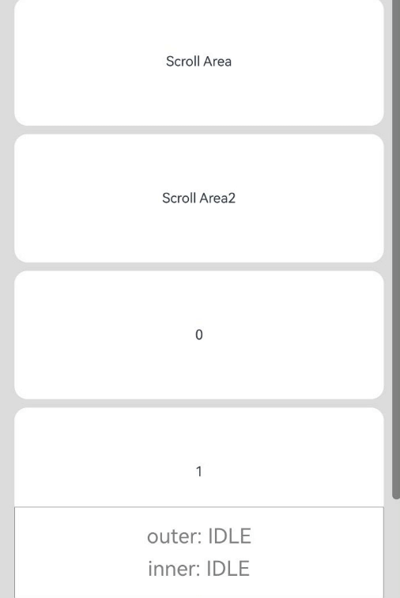
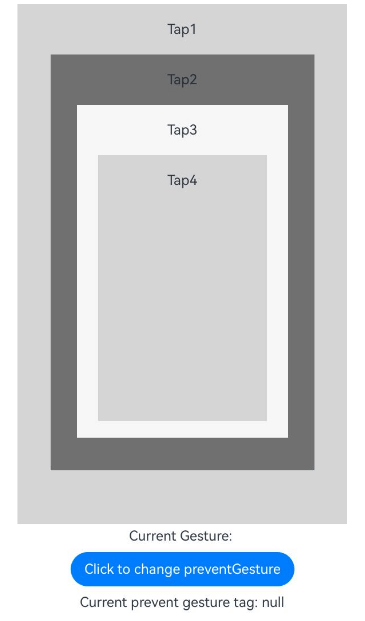
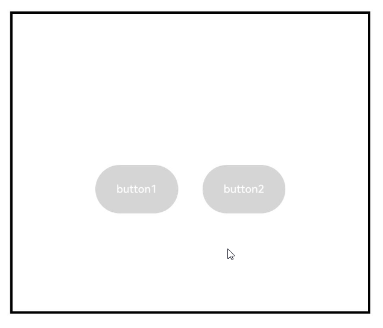
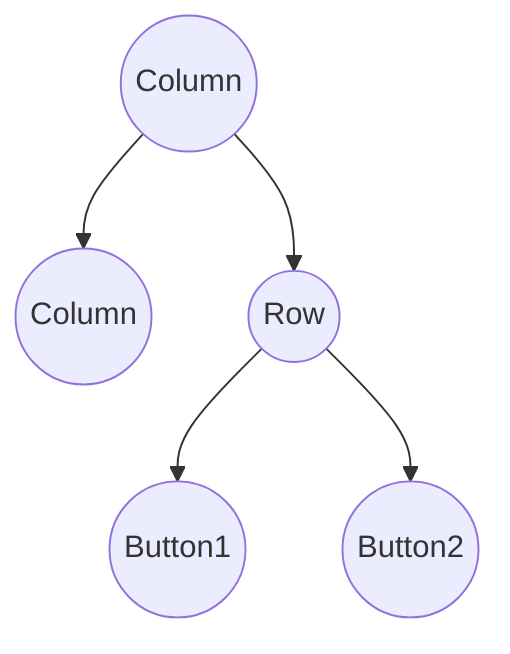

# Gesture Blocking Enhancement

<!--Kit: ArkUI-->
<!--Subsystem: ArkUI-->
<!--Owner: @yihao-lin-->
<!--Designer: @piggyguy-->
<!--Tester: @songyanhong-->
<!--Adviser: @Brilliantry_Rui-->
<!-- md-trans-meta sourceCommit=662447c36c692b2a7be0ad93d163f8f6a14bac67 translatedAt=2026-08-18T03:10:13.408Z pushedAt=2026-08-19T00:57:47.836Z -->

Provides components with gesture blocking capabilities, applicable to scenarios such as nested scrolling, gesture coordination between parent and child components, and gesture conflict handling. As needed, developers can process built-in gestures in parallel with gestures that have a higher priority, and dynamically control the triggering of gesture events, thereby managing the gesture response order and interaction behavior more precisely.

>  **NOTE**
>
> - The initial APIs of this module are supported since API version 12. Updates will be marked with a superscript to indicate their earliest API version.
>
> - The APIs of this module can be used only in the stage model.

## shouldBuiltInRecognizerParallelWith

shouldBuiltInRecognizerParallelWith(callback: ShouldBuiltInRecognizerParallelWithCallback): T

Provides a callback to set the parallel relationship between built-in gestures and gestures of other components in the response chain. The corresponding C API is [setInnerGestureParallelTo](../capi-arkui-nativemodule-arkui-nativegestureapi-1.md#setinnergestureparallelto).

Currently, this API does not support setting a parallel relationship between built-in gestures in system combination components (such as the [Tabs](ts-container-tabs.md) component) and other gestures.

**Model restriction:** This API can be used only in the stage model.

**Atomic service API**: This API can be used in atomic services since API version 12.

**System capability**: SystemCapability.ArkUI.ArkUI.Full

**Parameters**

| Name       | Type                   | Mandatory | Description                         |
| ---------- | -------------------------- | ------- | ----------------------------- |
| callback      | [ShouldBuiltInRecognizerParallelWithCallback](#shouldbuiltinrecognizerparallelwithcallback) | Yes   |  Callback event for setting the parallel relationship between the built-in gestures of the system and the gestures of other components in the response chain. When this component undergoes [hit testing](../../../ui/arkts-interaction-basic-principles.md#hit-testing), the user-defined callback is triggered to form the gesture parallel relationship. |

**Return value**

| Type| Description|
| -------- | -------- |
| T | Current component.|

## ShouldBuiltInRecognizerParallelWithCallback

type ShouldBuiltInRecognizerParallelWithCallback = (current: GestureRecognizer, others: Array\<GestureRecognizer\>) => GestureRecognizer

Represents the callback used to set the parallel relationship between built-in gestures and gestures of other components in the response chain.

**Model restriction:** This API can be used only in the stage model.

**Atomic service API**: This API can be used in atomic services since API version 12.

**System capability**: SystemCapability.ArkUI.ArkUI.Full

**Parameters**

| Name  | Type                     | Mandatory| Description                                                        |
| -------- | ------------------------- | ---- | ------------------------------------------------------------ |
| current | [GestureRecognizer](./ts-gesture-common.md#gesturerecognizer12) | Yes   | System built-in gesture recognizer of the current component. In the current version, only the built-in gesture recognizer of the [GestureType](./ts-gesture-common.md#gesturetype11).PAN_GESTURE type is provided. |
| others | Array\<[GestureRecognizer](ts-gesture-common.md#gesturerecognizer12)\> | Yes  | Gesture recognizers of the same type from other components with higher priority in the response chain.|

**Return value**

| Type    | Description       |
| ------ | --------- |
| [GestureRecognizer](ts-gesture-common.md#gesturerecognizer12) | A gesture recognizer that establishes a parallel relationship with the current recognizer; **undefined** indicates that no parallel relationship is established. |

## onGestureRecognizerJudgeBegin<sup>13+</sup>

onGestureRecognizerJudgeBegin(callback: GestureRecognizerJudgeBeginCallback, exposeInnerGesture: boolean): T

Binds a custom gesture recognizer judgment callback to the component.

**Model restriction:** This API can be used only in the stage model.

A new parameter **exposeInnerGesture** is added to indicate whether to expose the gestures of built-in components in ArkUI system combination components to developers. When this parameter is set to **true**, the gestures of built-in components in ArkUI system combination components are exposed to developers.<br>
For scenarios where the gestures of built-in components in ArkUI system combination components do not need to be exposed, you are advised to use the original [onGestureRecognizerJudgeBegin](#ongesturerecognizerjudgebegin) API. If the gestures need to be exposed, you are advised to use this API and set **exposeInnerGesture** to **true**.

**Atomic service API**: This API can be used in atomic services since API version 13.

**System capability**: SystemCapability.ArkUI.ArkUI.Full

**Parameters**

| Name       | Type                   | Mandatory | Description                         |
| ---------- | -------------------------- | ------- | ----------------------------- |
| callback      | [GestureRecognizerJudgeBeginCallback](#gesturerecognizerjudgebegincallback) | Yes    |  Custom gesture recognizer judgment callback to bind to the component. This callback is triggered when the gesture bound to the component is about to succeed, to obtain the result.|
| exposeInnerGesture   | boolean         | Yes    | Whether to expose the internal gesture identifier.<br>Default value: **false**<br>**NOTE**<br>If the target component is a composite component, when this parameter is set to **true**, the **current** parameter in the callback contains the gesture recognizers inside the composite component.<br>Currently, only [Tabs](ts-container-tabs.md) is supported. Do not set this parameter for other components.<br>When this parameter is set to **false**, the behavior is the same as that of the original API [onGestureRecognizerJudgeBegin](#ongesturerecognizerjudgebegin). |

**Return value**

| Type| Description|
| -------- | -------- |
| T | Current component.|

## onGestureRecognizerJudgeBegin

onGestureRecognizerJudgeBegin(callback: GestureRecognizerJudgeBeginCallback): T

Binds a custom gesture recognizer judgment callback to the component.

**Atomic service API**: This API can be used in atomic services since API version 12.

**System capability**: SystemCapability.ArkUI.ArkUI.Full

**Parameters**

| Name       | Type                   | Mandatory | Description                         |
| ---------- | -------------------------- | ------- | ----------------------------- |
| callback      | [GestureRecognizerJudgeBeginCallback](#gesturerecognizerjudgebegincallback) | Yes    |  Custom gesture recognizer judgment callback. When a gesture bound to this component is about to succeed, the custom callback is triggered to obtain the result.|

**Return value**

| Type| Description|
| -------- | -------- |
| T | Current component.|

## GestureRecognizerJudgeBeginCallback

type GestureRecognizerJudgeBeginCallback = (event: BaseGestureEvent, current: GestureRecognizer, recognizers: Array\<GestureRecognizer\>, touchRecognizers?: Array\<TouchRecognizer\>) => GestureJudgeResult

Represents a custom gesture recognizer judgment callback type.

**Atomic service API**: This API can be used in atomic services since API version 12.

**Model restriction:** This API can be used only in the stage model.

**System capability**: SystemCapability.ArkUI.ArkUI.Full

**Parameters**

| Name  | Type                     | Mandatory| Description                                                        |
| -------- | ------------------------- | ---- | ------------------------------------------------------------ |
| event | [BaseGestureEvent](./ts-gesture-common.md#basegestureevent11) | Yes  | Information about the current basic gesture event.|
| current | [GestureRecognizer](ts-gesture-common.md#gesturerecognizer12) | Yes | Recognizer object that is about to respond. |
| recognizers | Array\<[GestureRecognizer](ts-gesture-common.md#gesturerecognizer12)\> | Yes  | Other gesture recognizer objects in the response chain.|
| touchRecognizers<sup>20+</sup> | Array\<[TouchRecognizer](ts-gesture-common.md#touchrecognizer20)\> | No | Touch recognizer objects on the response chain. If not passed in, it indicates that there is no responsive Touch recognizer on the current gesture-bound component and its descendant components. |

**Return value**

| Type    | Description       |
| ------ | --------- |
| [GestureJudgeResult](./ts-gesture-common.md#gesturejudgeresult11) | Judgment result indicating whether gesture recognition succeeds.|

## onTouchTestDone<sup>20+</sup>

onTouchTestDone(callback: TouchTestDoneCallback): T

Specifies whether gesture recognizers participate in subsequent processing after [hit testing](../../../ui/arkts-interaction-basic-principles.md#hit-testing) completes.

**Model restriction:** This API can be used only in the stage model.

**Atomic service API**: This API can be used in atomic services since API version 20.

**System capability**: SystemCapability.ArkUI.ArkUI.Full

**Parameters**

| Name       | Type                   | Mandatory | Description                         |
| ---------- | -------------------------- | ------- | ----------------------------- |
| callback      | [TouchTestDoneCallback](#touchtestdonecallback20) | Yes  |  Callback to specify gesture recognizer participation in subsequent processing. Triggered after [hit testing](../../../ui/arkts-interaction-basic-principles.md#hit-testing) completes but before user gesture recognition begins.|

**Return value**

| Type| Description|
| -------- | -------- |
| T | Current component.|

## TouchTestDoneCallback<sup>20+</sup>

type TouchTestDoneCallback = (event: BaseGestureEvent, recognizers: Array\<GestureRecognizer\>) => void

Defines the callback event type for dynamically specifying whether a gesture recognizer participates in gesture processing. The lifecycle of the parameters in the callback follows the callback itself, and the methods in the parameters can be used only synchronously within the callback.

**Model restriction:** This API can be used only in the stage model.

**Atomic service API**: This API can be used in atomic services since API version 20.

**System capability**: SystemCapability.ArkUI.ArkUI.Full

**Parameters**

| Name   | Type                      | Mandatory | Description                                                         |
| -------- | ------------------------- | ---- | ------------------------------------------------------------ |
| event | [BaseGestureEvent](./ts-gesture-common.md#basegestureevent11) | Yes   | Information about the base gesture event after [hit testing](../../../ui/arkts-interaction-basic-principles.md#hit-testing) is complete. <br>**NOTE**<br>Only the information of **BaseGestureEvent** is included, excluding the extended information of its subclasses.<br>The values of **axisHorizontal** and **axisVertical** are 0. |
| recognizers | Array\<[GestureRecognizer](ts-gesture-common.md#gesturerecognizer12)\> | Yes   | All gesture recognizer objects after [hit testing](../../../ui/arkts-interaction-basic-principles.md#hit-testing) is complete. |

## onGestureCollectIntercept

onGestureCollectIntercept(callback: GestureCollectInterceptCallback): T

Triggered after the events and gestures on the current node and higher-priority nodes are collected. It can be used to intervene in the collection results of events and gestures.

**Since:** 26.0.0

**Atomic service API:** This API can be used in atomic services since API version 26.0.0.

**System capability**: SystemCapability.ArkUI.ArkUI.Full

**Model restriction:** This API can be used only in the stage model.

**Parameters**

| Name        | Type                    | Mandatory  | Description                          |
| ---------- | -------------------------- | ------- | ----------------------------- |
| callback      | [GestureCollectInterceptCallback](#gesturecollectinterceptcallback) | Yes   |  Callback used when the component performs hit testing. It is executed after the events and gestures on the current node and higher-priority nodes are collected, to intervene in the collection results. |

**Return value**

| Type | Description |
| -------- | -------- |
| T | Current component. |

## GestureCollectInterceptCallback

type GestureCollectInterceptCallback = (recognizers: Array\<GestureRecognizer\>, touchRecognizers?: Array\<TouchRecognizer\>) => GestureCollectIntervention

Defines the callback type used in [onGestureCollectIntercept](#ongesturecollectintercept).

**Since:** 26.0.0

**Atomic service API:** This API can be used in atomic services since API version 26.0.0.

**System capability**: SystemCapability.ArkUI.ArkUI.Full

**Model restriction:** This API can be used only in the stage model.

**Parameters**

| Name   | Type                      | Mandatory | Description                                                         |
| -------- | ------------------------- | ---- | ------------------------------------------------------------ |
| recognizers | Array\<[GestureRecognizer](ts-gesture-common.md#gesturerecognizer12)\> | Yes   | Gesture recognizer objects of the components in the response chain. |
| touchRecognizers | Array\<[TouchRecognizer](ts-gesture-common.md#touchrecognizer20)\> | No | Touch recognizer objects of the components in the response chain.<br/>The default value is **null**, indicating that there are no touch recognizer objects in the response chain. |

**Return value**

| Type     | Description        |
| ------ | --------- |
| [GestureCollectIntervention](./ts-appendix-enums.md#gesturecollectintervention) | Gesture collection intervention result.<br>If the return value is not a **GestureCollectIntervention** enum value, it is processed as [GestureCollectIntervention.CONTINUE](./ts-appendix-enums.md#gesturecollectintervention). |

## shouldRecognizerParallelWith

shouldRecognizerParallelWith(callback: ShouldRecognizerParallelWithCallback): T

Provides a callback event for setting the parallel relationship between non-built-in gestures and gestures of other components in the response chain. This API uses an asynchronous callback to return the result. The corresponding C API is [setGestureParallelTo](../capi-arkui-nativemodule-arkui-nativegestureapi-3.md#setgestureparallelto).

**Since:** 26.0.0

**Atomic service API:** This API can be used in atomic services since API version 26.0.0.

**System capability**: SystemCapability.ArkUI.ArkUI.Full

**Model restriction:** This API can be used only in the stage model.

**Parameters**

| Name        | Type                    | Mandatory  | Description                          |
| ---------- | -------------------------- | ------- | ----------------------------- |
| callback      | [ShouldRecognizerParallelWithCallback](#shouldrecognizerparallelwithcallback) | Yes   |  Callback event for setting the parallel relationship between a gesture and gestures of other components in the response chain. When the component performs [hit testing](../../../ui/arkts-interaction-basic-principles.md#hit-testing), the user-defined callback is triggered to form the gesture parallel relationship. |

**Return value**

| Type | Description |
| -------- | -------- |
| T | Current component. |

## ShouldRecognizerParallelWithCallback

type ShouldRecognizerParallelWithCallback = (current: GestureRecognizer, others: Array\<GestureRecognizer\>) => GestureRecognizer

Defines the callback event type for setting the parallel relationship between a gesture and gestures of other components in the response chain.

**Since:** 26.0.0

**Atomic service API:** This API can be used in atomic services since API version 26.0.0.

**System capability**: SystemCapability.ArkUI.ArkUI.Full

**Model restriction:** This API can be used only in the stage model.

**Parameters**

| Name  | Type                     | Mandatory| Description                                                        |
| -------- | ------------------------- | ---- | ------------------------------------------------------------ |
| current | [GestureRecognizer](ts-gesture-common.md#gesturerecognizer12) | Yes   | Gesture recognizer of the current component. Currently, only the gesture recognizer of the [GestureType](./ts-gesture-common.md#gesturetype11).PAN_GESTURE type is supported. |
| others | Array\<[GestureRecognizer](ts-gesture-common.md#gesturerecognizer12)\> | Yes   | Gesture recognizers of the same [GestureType](./ts-gesture-common.md#gesturetype11) held by other components with a higher priority than the current component in the response chain. |

**Return value**

| Type     | Description        |
| ------ | --------- |
| [GestureRecognizer](ts-gesture-common.md#gesturerecognizer12) | A gesture recognizer that is bound to the **current** recognizer in a parallel relationship. |

## Example

### Example 1: Implementing Nested Scrolling

This example demonstrates how to implement nested scrolling using **shouldBuiltInRecognizerParallelWith** and **onGestureRecognizerJudgeBegin**. The inner component takes precedence in responding to swipe gestures. When the inner component reaches the top or bottom, the outer component can then take over the scrolling.

```ts
// xxx.ets
@Entry
@Component
struct FatherControlChild {
  scroller: Scroller = new Scroller();
  scroller2: Scroller = new Scroller();
  private arr: number[] = [0, 1, 2, 3, 4, 5, 6, 7, 8, 9];
  private childRecognizer: GestureRecognizer = new GestureRecognizer();
  private currentRecognizer: GestureRecognizer = new GestureRecognizer();
  private lastOffset: number = 0;

  build() {
    Stack({ alignContent: Alignment.TopStart }) {
      Scroll(this.scroller) { // Outer scrollable container.
        Column() {
          Text('Scroll Area')
            .width('90%')
            .height(150)
            .backgroundColor(0xFFFFFF)
            .borderRadius(15)
            .fontSize(16)
            .textAlign(TextAlign.Center)
            .margin({ top: 10 })
          Scroll(this.scroller2) { // Inner scrollable container.
            Column() {
              Text('Scroll Area2')
                .width('90%')
                .height(150)
                .backgroundColor(0xFFFFFF)
                .borderRadius(15)
                .fontSize(16)
                .textAlign(TextAlign.Center)
                .margin({ top: 10 })
              Column() {
                ForEach(this.arr, (item: number) => {
                  Text(item.toString())
                    .width('90%')
                    .height(150)
                    .backgroundColor(0xFFFFFF)
                    .borderRadius(15)
                    .fontSize(16)
                    .textAlign(TextAlign.Center)
                    .margin({ top: 10 })
                }, (item: number) => item.toString())
              }.width('100%')
            }
          }
          .id('inner')
          .width('100%')
          .height(800)
        }.width('100%')
      }
      .id('outer')
      .height(600)
      .scrollable(ScrollDirection.Vertical) // The scrollbar scrolls in the vertical direction.
      .scrollBar(BarState.On) // The scrollbar is always displayed.
      .scrollBarColor(Color.Gray) // The scrollbar color is gray.
      .scrollBarWidth(10) // The scrollbar width is 10.
      .edgeEffect(EdgeEffect.None)
      .shouldBuiltInRecognizerParallelWith((current: GestureRecognizer, others: Array<GestureRecognizer>) => {
        for (let i = 0; i < others.length; i++) {
          let target = others[i].getEventTargetInfo();
          if (target) {
            if (target.getId() == 'inner' && others[i].isBuiltIn() &&
              others[i].getType() == GestureControl.GestureType.PAN_GESTURE) { // Identify the recognizer that to be bound to parallelGesture.
              this.currentRecognizer = current; // Save the recognizer of the current component.
              this.childRecognizer = others[i]; // Save the recognizer to form a parallel gesture.
              return others[i]; // Return the recognizer to form a parallel gesture.
            }
          }
        }
        return undefined;
      })
      .onGestureRecognizerJudgeBegin((event: BaseGestureEvent, current: GestureRecognizer,
        others: Array<GestureRecognizer>) => { // When the implementation is about to succeed, set the recognizer enabling state based on the current component state.
        if (current) {
          let target = current.getEventTargetInfo();
          if (target) {
            if (target.getId() == 'outer' && current.isBuiltIn() &&
              current.getType() == GestureControl.GestureType.PAN_GESTURE) {
              if (others) {
                for (let i = 0; i < others.length; i++) {
                  let target = others[i].getEventTargetInfo() as ScrollableTargetInfo;
                  if (target instanceof ScrollableTargetInfo && target.getId() == 'inner') { // Find the corresponding parallel recognizer on the response chain.
                    let panEvent = event as PanGestureEvent;
                    if (target.isEnd()) { // Dynamically control the recognizer's enabled state based on the current component state and direction of movement.
                      if (panEvent && panEvent.offsetY < 0) {
                        this.childRecognizer.setEnabled(false);
                        this.currentRecognizer.setEnabled(true);
                      } else {
                        this.childRecognizer.setEnabled(true);
                        this.currentRecognizer.setEnabled(false);
                      }
                    } else if (target.isBegin()) {
                      if (panEvent.offsetY > 0) {
                        this.childRecognizer.setEnabled(false);
                        this.currentRecognizer.setEnabled(true);
                      } else {
                        this.childRecognizer.setEnabled(true);
                        this.currentRecognizer.setEnabled(false);
                      }
                    } else {
                      this.childRecognizer.setEnabled(true);
                      this.currentRecognizer.setEnabled(false);
                    }
                  }
                }
              }
            }
          }
        }
        return GestureJudgeResult.CONTINUE;
      })
      .parallelGesture( // Bind a pan gesture as a dynamic controller.
        PanGesture()
          .onActionUpdate((event: GestureEvent) => {
            if (this.childRecognizer.getState() != GestureRecognizerState.SUCCESSFUL ||
              this.currentRecognizer.getState() != GestureRecognizerState.SUCCESSFUL) { // If the recognizer is not in the SUCCESSFUL state, no control is applied.
              return;
            }
            let target = this.childRecognizer.getEventTargetInfo() as ScrollableTargetInfo;
            let currentTarget = this.currentRecognizer.getEventTargetInfo() as ScrollableTargetInfo;
            if (target instanceof ScrollableTargetInfo && currentTarget instanceof ScrollableTargetInfo) {
              if (target.isEnd()) { // Adjust the enabled state of the gesture recognizers based on the current component state during movement.
                if ((event.offsetY - this.lastOffset) < 0) {
                  this.childRecognizer.setEnabled(false);
                  if (currentTarget.isEnd()) {
                    this.currentRecognizer.setEnabled(false);
                  } else {
                    this.currentRecognizer.setEnabled(true);
                  }
                } else {
                  this.childRecognizer.setEnabled(true);
                  this.currentRecognizer.setEnabled(false);
                }
              } else if (target.isBegin()) {
                if ((event.offsetY - this.lastOffset) > 0) {
                  this.childRecognizer.setEnabled(false);
                  if (currentTarget.isBegin()) {
                    this.currentRecognizer.setEnabled(false);
                  } else {
                    this.currentRecognizer.setEnabled(true);
                  }
                } else {
                  this.childRecognizer.setEnabled(true);
                  this.currentRecognizer.setEnabled(false);
                }
              } else {
                this.childRecognizer.setEnabled(true);
                this.currentRecognizer.setEnabled(false);
              }
            }
            this.lastOffset = event.offsetY;
          })
      )
    }.width('100%').height('100%').backgroundColor(0xDCDCDC)
  }
}
```


### Example 2: Blocking Inner Container Gestures in Nested Scrolling

This example demonstrates how to set the **exposeInnerGesture** parameter to **true** to enable a first-level **Tabs** container to intercept the swipe gestures of a nested second-level **Tabs** container, thereby triggering the swipe gestures of the built-in **Swiper** component of first-level **Tabs** container.

You can define variables to record the index of the inner **Tabs** container and use this index to determine whether the swipe has reached the boundary of the inner **Tabs** container. When the boundary is reached, the callback is triggered to return a rejection result, blocking the swipe gesture of the inner **Tabs** container so that the outer **Tabs** container generates the swipe gesture.

```ts
// xxx.ets
@Entry
@Component
struct Index {
  @State currentIndex: number = 0;
  @State selectedIndex: number = 0;
  @State fontColor: string = '#182431';
  @State selectedFontColor: string = '#007DFF';
  innerSelectedIndex: number = 0; // Record the index of the inner Tabs container.
  controller?: TabsController = new TabsController();

  @Builder
  tabBuilder(index: number, name: string) {
    Column() {
      Text(name)
        .fontColor(this.selectedIndex === index ? this.selectedFontColor : this.fontColor)
        .fontSize(16)
        .fontWeight(this.selectedIndex === index ? 500 : 400)
        .lineHeight(22)
        .margin({ top: 17, bottom: 7 })
      Divider()
        .strokeWidth(2)
        .color('#007DFF')
        .opacity(this.selectedIndex === index ? 1 : 0)
    }.width('100%')
  }

  build() {
    Column() {
      Tabs({ barPosition: BarPosition.Start, index: this.currentIndex, controller: this.controller }) {
        TabContent() {
          Column().width('100%').height('100%').backgroundColor(Color.Green)
        }.tabBar(this.tabBuilder(0, 'green'))

        TabContent() {
          Tabs() {
            TabContent() {
              Column().width('100%').height('100%').backgroundColor(Color.Blue)
            }.tabBar(new SubTabBarStyle('blue'))

            TabContent() {
              Column().width('100%').height('100%').backgroundColor(Color.Pink)
            }.tabBar(new SubTabBarStyle('pink'))
          }
          .onAnimationStart((index: number, targetIndex: number) => {
            console.info(`ets onGestureRecognizerJudgeBegin child: ${targetIndex}`);
            this.innerSelectedIndex = targetIndex;
          })
          .onGestureRecognizerJudgeBegin((event: BaseGestureEvent, current: GestureRecognizer,
            others: Array<GestureRecognizer>): GestureJudgeResult => { // Return the gesture recognition result based on the inner Tabs index and swipe direction when the recognizer is about to succeed.
            console.info('ets onGestureRecognizerJudgeBegin child');
            if (current) {
              let target = current.getEventTargetInfo();
              if (target && current.isBuiltIn() && current.getType() == GestureControl.GestureType.PAN_GESTURE) {
                console.info('ets onGestureRecognizerJudgeBegin child PAN_GESTURE');
                let panEvent = event as PanGestureEvent;
                if (panEvent && panEvent.velocityX < 0 && this.innerSelectedIndex === 1) { // The inner Tabs component has reached the end.
                  console.info('ets onGestureRecognizerJudgeBegin child reject end');
                  return GestureJudgeResult.REJECT;
                }
                if (panEvent && panEvent.velocityX > 0 && this.innerSelectedIndex === 0) { // The inner Tabs component has reached the beginning.
                  console.info('ets onGestureRecognizerJudgeBegin child reject begin');
                  return GestureJudgeResult.REJECT;
                }
              }
            }
            return GestureJudgeResult.CONTINUE;
          }, true)
        }.tabBar(this.tabBuilder(1, 'blue and pink'))

        TabContent() {
          Column().width('100%').height('100%').backgroundColor(Color.Brown)
        }.tabBar(this.tabBuilder(2, 'brown'))
      }
      .onAnimationStart((index: number, targetIndex: number, event: TabsAnimationEvent) => {
        // Triggered when the switching animation starts. The target tab shows an underline.
        this.selectedIndex = targetIndex;
      })
    }
  }
}
```

 

### Example 3: Blocking Gestures to Obtain Properties

This example configures **onGestureRecognizerJudgeBegin** to recognize gestures and obtain property parameters such as the gesture distance, number of fingers, whether to limit the number of fingers, repeated trigger state, duration, number of taps, rotation angle, swipe direction, and speed threshold.

```ts
// xxx.ets
@Entry
@Component
struct Index {
  @State message: string = 'Gesture';

  build() {
    Column() {
      Column() {
        Row({ space: 20 }) {
          Text(this.message)
            .width('100%')
            .height(80)
            .fontSize(23)
        }.margin(25)
      }
      .margin(25)
      .padding(20)
      .width('90%')
      .height(250)
      .borderWidth(2)
      .gesture(TapGesture())
      .gesture(LongPressGesture())
      .gesture(PanGesture({ direction: PanDirection.Vertical }))
      .gesture(PinchGesture())
      .gesture(RotationGesture())
      .gesture(SwipeGesture({ direction: SwipeDirection.Horizontal }))
      // Bind a custom gesture recognizer judgment callback to the component.
      .onGestureRecognizerJudgeBegin((event: BaseGestureEvent, current: GestureRecognizer,
        others: Array<GestureRecognizer>) => {
        if (current) {
          // Check whether the gesture is a pan gesture.
          if (current.getType() === GestureControl.GestureType.PAN_GESTURE) {
            let target = current as PanRecognizer;
            this.message = 'PanGesture\ndistance:' + target.getPanGestureOptions().getDistance() + '\nfingers:' +
            target.getFingerCount() + '\nisFingerCountLimited:' + target.isFingerCountLimit();
          }
          // Check whether the gesture is a long press gesture.
          if (current.getType() === GestureControl.GestureType.LONG_PRESS_GESTURE) {
            let target = current as LongPressRecognizer;
            this.message = 'LongPressGesture\nfingers:' + target.getFingerCount() + '\nisFingerCountLimited:' +
            target.isFingerCountLimit() + '\nrepeat:' + target.isRepeat() + '\nduration:' + target.getDuration();
          }
          // Check whether the gesture is a pinch gesture.
          if (current.getType() === GestureControl.GestureType.PINCH_GESTURE) {
            let target = current as PinchRecognizer;
            this.message = 'PinchGesture\ndistance:' + target.getDistance() + '\nfingers:' +
            target.getFingerCount() + '\nisFingerCountLimited:' + target.isFingerCountLimit();
          }
          // Check whether the gesture is a tap gesture.
          if (current.getType() === GestureControl.GestureType.TAP_GESTURE) {
            let target = current as TapRecognizer;
            this.message = 'TapGesture\ncount:' + target.getTapCount() + '\nfingers:' +
            target.getFingerCount() + '\nisFingerCountLimited:' + target.isFingerCountLimit();
          }
          // Check whether the gesture is a rotation gesture.
          if (current.getType() === GestureControl.GestureType.ROTATION_GESTURE) {
            let target = current as RotationRecognizer;
            this.message = 'RotationGesture\nangle:' + target.getAngle() + '\nfingers:' +
            target.getFingerCount() + '\nisFingerCountLimited:' + target.isFingerCountLimit();
          }
          // Check whether the gesture is a swipe gesture.
          if (current.getType() === GestureControl.GestureType.SWIPE_GESTURE) {
            let target = current as SwipeRecognizer;
            this.message = 'SwipeGesture\ndirection:' + target.getDirection() + '\nfingers:' +
            target.getFingerCount() + '\nisFingerCountLimited:' + target.isFingerCountLimit() + '\nspeed:' +
            target.getVelocityThreshold();
          }
        }
        return GestureJudgeResult.CONTINUE;
      })
    }
    .padding(15)
  }
}
```

 

### Example 4: Canceling Child Component Touch Events on Successful Gesture Trigger

This example demonstrates how to use **onGestureRecognizerJudgeBegin** to implement gesture judgment. When the parent container's gesture is successfully triggered, it calls **cancelTouch()** to forcibly cancel touch events on child components, enabling precise switching between parent and child gesture control.

```ts
// xxx.ets
@Entry
@Component
struct FatherControlChild {
  scroller: Scroller = new Scroller();
  scroller2: Scroller = new Scroller();
  private arr: number[] = [0, 1, 2, 3, 4, 5, 6, 7, 8, 9];
  private childRecognizer: GestureRecognizer = new GestureRecognizer();
  private currentRecognizer: GestureRecognizer = new GestureRecognizer();
  private lastOffset: number = 0;
  @State outerState: string = 'IDLE';
  @State innerState: string = 'IDLE';
  @State willCancel: boolean = false;

  build() {
    Stack({ alignContent: Alignment.TopStart }) {
      Scroll(this.scroller) { // Outer scrollable container.
        Column() {
          Text('Scroll Area')
            .width('90%')
            .height(150)
            .backgroundColor(0xFFFFFF)
            .borderRadius(15)
            .fontSize(16)
            .textAlign(TextAlign.Center)
            .margin({ top: 10 })

          Scroll(this.scroller2) { // Inner scrollable container.
            Column() {
              Text('Scroll Area2')
                .width('90%')
                .height(150)
                .backgroundColor(0xFFFFFF)
                .borderRadius(15)
                .fontSize(16)
                .textAlign(TextAlign.Center)
                .margin({ top: 10 })

              Column() {
                ForEach(this.arr, (item: number) => {
                  Text(item.toString())
                    .width('90%')
                    .height(150)
                    .backgroundColor(0xFFFFFF)
                    .borderRadius(15)
                    .fontSize(16)
                    .textAlign(TextAlign.Center)
                    .margin({ top: 10 })
                }, (item: string) => item)
              }.width('100%')
            }
          }
          .id('inner')
          .width('100%')
          .height(800)
          .onTouch((event) => {
            if (event.type === TouchType.Down) {
              this.innerState = 'TOUCHING';
              this.willCancel = false;
            } else if (event.type === TouchType.Up || event.type === TouchType.Cancel) {
              if (this.willCancel) {
                this.innerState = 'CANCELLED';
                setTimeout(() => {
                  this.innerState = 'IDLE';
                  this.willCancel = false;
                }, 1000);
              } else {
                this.innerState = 'IDLE';
              }
            }
          })
        }.width('100%')
      }
      .id('outer')
      .height('100%')
      .scrollable(ScrollDirection.Vertical)
      .scrollBar(BarState.On)
      .scrollBarColor(Color.Gray)
      .scrollBarWidth(10)
      .edgeEffect(EdgeEffect.None)
      .shouldBuiltInRecognizerParallelWith((current: GestureRecognizer, others: Array<GestureRecognizer>) => {
        for (let i = 0; i < others.length; i++) {
          let target = others[i].getEventTargetInfo();
          if (target) {
            if (target.getId() == 'inner' && others[i].isBuiltIn() &&
              others[i].getType() == GestureControl.GestureType.PAN_GESTURE) { // Identify the recognizer that to be bound to parallelGesture.
              this.currentRecognizer = current; // Save the recognizer of the current component.
              this.childRecognizer = others[i]; // Save the recognizer to form a parallel gesture.
              return others[i]; // Return the recognizer to form a parallel gesture.
            }
          }
        }
        return undefined;
      })
      .onGestureRecognizerJudgeBegin((event: BaseGestureEvent, current: GestureRecognizer,
        others: Array<GestureRecognizer>,
        touchRecognizers?: Array<TouchRecognizer>) => { // Find the child component's Touch recognizer and cancel its Touch event when the recognizer is about to succeed.
        if (current && touchRecognizers) {
          let target = current.getEventTargetInfo();
          if (target) {
            if (target.getId() == 'outer' && current.isBuiltIn() &&
              current.getType() == GestureControl.GestureType.PAN_GESTURE) {
              return GestureJudgeResult.CONTINUE;
            }
            for (let index = 0; index < touchRecognizers.length; index++) {
              const element = touchRecognizers[index];
              let touchTarget = element.getEventTargetInfo();
              if (touchTarget && touchTarget.getId() == 'inner') {
                this.willCancel = true;
                element.cancelTouch();
              }
            }
          }
        }
        return GestureJudgeResult.CONTINUE;
      })
      .onTouch((event) => {
        if (event.type === TouchType.Down) {
          this.outerState = 'TOUCHING';
        } else if (event.type === TouchType.Up || event.type === TouchType.Cancel) {
          this.outerState = 'IDLE';
        }
      })
      .parallelGesture( // Bind a pan gesture as a dynamic controller.
        PanGesture()
          .onActionUpdate((event: GestureEvent) => {
            if (this.childRecognizer.getState() != GestureRecognizerState.SUCCESSFUL ||
              this.currentRecognizer.getState() != GestureRecognizerState.SUCCESSFUL) { // If the recognizer is not in the SUCCESSFUL state, no control is applied.
              return;
            }
            let target = this.childRecognizer.getEventTargetInfo() as ScrollableTargetInfo;
            let currentTarget = this.currentRecognizer.getEventTargetInfo() as ScrollableTargetInfo;
            if (target instanceof ScrollableTargetInfo && currentTarget instanceof ScrollableTargetInfo) {
              if (target.isEnd()) { // Adjust the enabled state of the gesture recognizers based on the current component state during movement.
                if ((event.offsetY - this.lastOffset) < 0) {
                  this.childRecognizer.setEnabled(false);
                  if (currentTarget.isEnd()) {
                    this.currentRecognizer.setEnabled(false);
                  } else {
                    this.currentRecognizer.setEnabled(true);
                  }
                } else {
                  this.childRecognizer.setEnabled(true);
                  this.currentRecognizer.setEnabled(false);
                }
              } else if (target.isBegin()) {
                if ((event.offsetY - this.lastOffset) > 0) {
                  this.childRecognizer.setEnabled(false);
                  if (currentTarget.isBegin()) {
                    this.currentRecognizer.setEnabled(false);
                  } else {
                    this.currentRecognizer.setEnabled(true);
                  }
                } else {
                  this.childRecognizer.setEnabled(true)
                  this.currentRecognizer.setEnabled(false)
                }
              } else {
                this.childRecognizer.setEnabled(true)
                this.currentRecognizer.setEnabled(false)
              }
            }
            this.lastOffset = event.offsetY
          })
      )

      Column() { // Display the outer layer status.
        Text(`outer: ${this.outerState}`)
          .fontSize(24)
          .fontColor(this.outerState === 'TOUCHING' ? Color.Green : Color.Gray)
          .margin({ bottom: 10 })
        // Display the inner layer status.
        Text(`inner: ${this.innerState === 'TOUCHING' ? 'TOUCHING' : this.innerState}`)
          .fontSize(24)
          .fontColor(
            this.innerState === 'TOUCHING' ? Color.Blue :
              this.innerState === 'CANCELLED' ? Color.Red : Color.Gray
          )
      }
      .width('90%')
      .backgroundColor(Color.White)
      .border({ width: 1, color: Color.Gray })
      .position({ x: '5%', y: '80%' })
      .padding(20)
    }
    .width('100%')
    .height('100%')
    .backgroundColor(0xDCDCDC)
  }
}
```



### Example 5: Customizing Gesture Recognizer Participation in Gesture Processing

This example demonstrates how to use [onTouchTestDone](#ontouchtestdone20) to exclude a gesture recognizer from subsequent gesture processing, available from API version 20. When the callback is triggered, [preventBegin](./ts-gesture-common.md#preventbegin20) is called to prevent the recognizer from participating in further processing. Tapping the overlapping area of Tap2 and Tap1, if **preventBegin** is not called, triggers the gesture corresponding to Tap2. If **preventBegin** is called to block Tap2, the gesture corresponding to Tap1 is triggered.

```ts
// xxx.ets
@Entry
@Component
struct TouchTestDoneExample {
  @State tagList: string[] = ['Null', 'Tap1', 'Tap2', 'Tap3', 'Tap4'];
  @State tagId: number = 0;
  @State textValue: string = '';

  // In the multi-layer nesting scenario, bind a tap gesture to each layer of components.
  build() {
    Column() {
      Column() {
        Text('Tap1')
          .margin(20)
        Column() {
          Text('Tap2')
            .margin(20)
          Column() {
            Text('Tap3')
              .margin(20)
            Column() {
              Text('Tap4')
                .margin(20)
            }
            .backgroundColor('#D5D5D5')
            .width('80%')
            .height('80%')
            .gesture(TapGesture().tag('Tap4').onAction(() => {
              this.textValue = 'Tap4';
            }))
          }
          .backgroundColor('#F7F7F7')
          .width('80%')
          .height('80%')
          .gesture(TapGesture().tag('Tap3').onAction(() => {
            this.textValue = 'Tap3';
          }))
        }
        .backgroundColor('#707070')
        .width('80%')
        .height('80%')
        .gesture(TapGesture().tag('Tap2').onAction(() => {
          this.textValue = 'Tap2';
        }))
      }
      .backgroundColor('#D5D5D5')
      .width('80%')
      .height('80%')
      .gesture(TapGesture().tag('Tap1').onAction(() => {
        this.textValue = 'Tap1';
      }))
      // Use onTouchTestDone to customize gesture recognizer participation by calling preventBegin().
      .onTouchTestDone((event, recognizers) => {
        console.info(`event is ${JSON.stringify(event)}`);
        for (let i = 0; i < recognizers.length; i++) {
          let recognizer = recognizers[i];
          console.info(`type is ${JSON.stringify(recognizer.getType())}`);
          // Block specific gesture recognizers based on the tag value.
          if (recognizer.getTag() == this.tagList[this.tagId]) {
            recognizer.preventBegin();
          }
        }
      })

      Text('Current Gesture: ' + this.textValue)
        .margin(5)

      Button('Click to change preventGesture')
        .margin(5)
        .onClick(() => {
          this.tagId++;
          this.tagId %= 5;
        })
      Text('Current prevent gesture tag: ' + this.tagList[this.tagId])
        .margin(5)
    }
    .width('100%')
    .height('100%')
  }
}
```



### Example 6: Customizing the Collection Results of Events and Gestures

This example configures [onGestureCollectIntercept](#ongesturecollectintercept) to specify whether a gesture recognizer or touch recognizer is passed through to other nodes. When **button2** is tapped, the touch event is not passed through to **Column**. When **button1** is tapped, the touch event is passed through to **Column**, and **Column** changes color.

The **onGestureCollectIntercept** API is added since API version 26.0.0.

```ts
// xxx.ets
@Entry
@Component
struct Index {
  @State backgroundColorButton1: string = '#D5D5D5';
  @State backgroundColorButton2: string = '#D5D5D5';
  @State backgroundColorRow: string = '#FFFFFF';
  @State backgroundColorColumn: string = '#FFFFFF';

  build() {
    Column() {
      Column() {
        Row({ space: 20 } as RowOptions) {
          // The button1 component has no click event set.
          Button('button1')
            .width('30%')
            .height(40)
            .id('button1')
            .onTouch((touchEvent?: TouchEvent) => {
              this.backgroundColorButton1 = '#E5E5E5';
            })
            .backgroundColor(this.backgroundColorButton1)
          // The button2 component has a click event set.
          Button('button2')
            .width('30%')
            .height(40)
            .id('button2')
            .onTouch((touchEvent?: TouchEvent) => {
              this.backgroundColorButton2 = '#E5E5E5';
            })
            .onClick((clickEvent?: ClickEvent) => {
              console.info('button2 is clicked');
            })
            .backgroundColor(this.backgroundColorButton2)
        }
        .justifyContent(FlexAlign.Center)
        .width('90%')
        .height(200)
        .margin(25)
        .onTouch((e?: TouchEvent) => {
          this.backgroundColorRow = '#666666';
        })
        .backgroundColor(this.backgroundColorRow)
        .onGestureCollectIntercept((recognizers: Array<GestureRecognizer>,
          touchRecognizers?: Array<TouchRecognizer> | undefined) => {
          if (!touchRecognizers) {
            return GestureCollectIntervention.CONTINUE;
          } else {
            for (let i = 0; i < touchRecognizers.length; i++) {
              let id = touchRecognizers[i].getEventTargetInfo().getId();
              // When the hit area is button2, which has a click event, the event does not need to be passed to Column.
              if (id == 'button2') {
                return GestureCollectIntervention.DISCARD_LOWER;
              }
            }
          }
          return GestureCollectIntervention.CONTINUE;
        })
      }
      .margin(25)
      .padding(20)
      .width('90%')
      .height(250)
      .borderWidth(2)
      .onTouch((e?: TouchEvent) => {
        this.backgroundColorColumn = '#E5E5E5';
      })
      .backgroundColor(this.backgroundColorColumn)
    }
    .padding(15)
  }
}
```



The component tree corresponding to the example is shown in the following figure.


```mermaid
graph TD
    A((Column))
    B((Column))
    C((Row))
    D((Button1))
    E((Button2))

    A --> B
    A --> C
    C --> D
    C --> E
```

### Example 7: Nested Scrolling with Non-Built-in Gestures

This example implements nested scrolling using [shouldRecognizerParallelWith](#shouldrecognizerparallelwith) and [onGestureRecognizerJudgeBegin](#ongesturerecognizerjudgebegin). The inner component takes precedence in responding to the swipe gesture. When the inner component scrolls to the top or bottom, the outer component can take over the scrolling.

The **shouldRecognizerParallelWith** API is added since API version 26.0.0.

```ts
// xxx.ets
@Entry
@Component
struct FatherControlChild {
  scroller: Scroller = new Scroller();
  scroller2: Scroller = new Scroller();
  private arr: number[] = [0, 1, 2, 3, 4, 5, 6, 7, 8, 9];
  private childRecognizer: GestureRecognizer = new GestureRecognizer();
  private currentRecognizer: GestureRecognizer = new GestureRecognizer();
  private lastOffset: number = 0;

  build() {
    Stack({ alignContent: Alignment.TopStart }) {
      Scroll(this.scroller) { // Outer scroll container.
        Column() {
          Text('Scroll Area')
            .width('90%')
            .height(150)
            .backgroundColor(0xFFFFFF)
            .borderRadius(15)
            .fontSize(16)
            .textAlign(TextAlign.Center)
            .margin({ top: 10 })
          Scroll(this.scroller2) { // Inner scroll container.
            Column() {
              Text('Scroll Area2')
                .width('90%')
                .height(150)
                .backgroundColor(0xFFFFFF)
                .borderRadius(15)
                .fontSize(16)
                .textAlign(TextAlign.Center)
                .margin({ top: 10 })
              Column() {
                ForEach(this.arr, (item: number) => {
                  Text(item.toString())
                    .width('90%')
                    .height(150)
                    .backgroundColor(0xFFFFFF)
                    .borderRadius(15)
                    .fontSize(16)
                    .textAlign(TextAlign.Center)
                    .margin({ top: 10 })
                }, (item: string) => item)
              }.width('100%')
            }
          }
          .id('inner')
          .width('100%')
          .height(800)
        }.width('100%')
      }
      .id('outer')
      .height(600)
      .scrollable(ScrollDirection.Vertical) // Vertical scroll direction.
      .scrollBar(BarState.On) // Scroll bar always displayed.
      .scrollBarColor(Color.Gray) // Scroll bar color.
      .scrollBarWidth(10) // Scroll bar width.
      .edgeEffect(EdgeEffect.None)
      .enableScrollInteraction(false)
      .gesture(
        PanGesture()
          .onActionStart(() => {
            this.lastOffset = this.scroller.currentOffset().yOffset; // Record the current scroll position when the gesture starts.
          })
          .onActionUpdate((event: GestureEvent) => {
            let moveY = event.offsetY; // Calculate the new position when the gesture moves.
            let targetOffset = this.lastOffset - moveY; // Target position = initial position - movement distance.
            this.scroller.scrollTo({ xOffset: 0, yOffset: targetOffset });
          })
      )
      .shouldRecognizerParallelWith((current: GestureRecognizer, others: Array<GestureRecognizer>) => {
        for (let i = 0; i < others.length; i++) {
          let target = others[i].getEventTargetInfo();
          if (target) {
            if (target.getId() == 'inner' && others[i].isBuiltIn() &&
              others[i].getType() == GestureControl.GestureType.PAN_GESTURE) { // Find the recognizer that will form the parallel gesture.
              this.currentRecognizer = current; // Save the recognizer of the current component.
              this.childRecognizer = others[i]; // Save the recognizer that will form the parallel gesture.
              return others[i]; // Return the recognizer that will form the parallel gesture.
            }
          }
        }
        return undefined;
      })
      .onGestureRecognizerJudgeBegin((event: BaseGestureEvent, current: GestureRecognizer,
        others: Array<GestureRecognizer>) => { // When the recognizer is about to succeed, set the recognizer enable state based on the current component state.
        if (current) {
          let target = current.getEventTargetInfo();
          if (target) {
            if (target.getId() == 'outer' &&
              current.getType() == GestureControl.GestureType.PAN_GESTURE) {
              if (others) {
                for (let i = 0; i < others.length; i++) {
                  let target = others[i].getEventTargetInfo() as ScrollableTargetInfo;
                  if (target instanceof ScrollableTargetInfo && target.getId() == 'inner') { // Find the corresponding parallel recognizer on the response chain.
                    let panEvent = event as PanGestureEvent;
                    if (target.isEnd()) { // Dynamically control the recognizer enable state based on the current component state and movement direction.
                      if (panEvent && panEvent.offsetY < 0) {
                        this.childRecognizer.setEnabled(false);
                        this.currentRecognizer.setEnabled(true);
                      } else {
                        this.childRecognizer.setEnabled(true);
                        this.currentRecognizer.setEnabled(false);
                      }
                    } else if (target.isBegin()) {
                      if (panEvent.offsetY > 0) {
                        this.childRecognizer.setEnabled(false);
                        this.currentRecognizer.setEnabled(true);
                      } else {
                        this.childRecognizer.setEnabled(true);
                        this.currentRecognizer.setEnabled(false);
                      }
                    } else {
                      this.childRecognizer.setEnabled(true);
                      this.currentRecognizer.setEnabled(false);
                    }
                  }
                }
              }
            }
          }
        }
        return GestureJudgeResult.CONTINUE;
      })
    }.width('100%').height('100%').backgroundColor(0xDCDCDC)
  }
}
```

