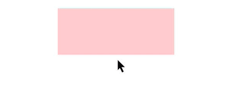
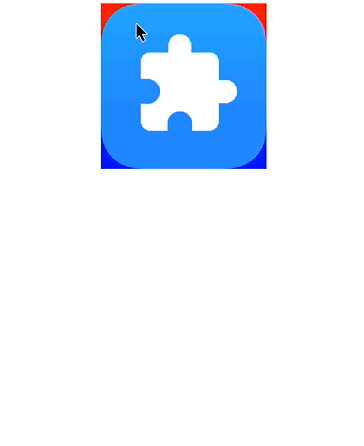

# Custom Gesture Judgment

You can use the custom gesture judgment APIs to specify whether to respond to specific gestures when they are being recognized.

>  **NOTE**
>
>  This feature is supported since API version 11. Updates will be marked with a superscript to indicate their earliest API version.


## onGestureJudgeBegin
onGestureJudgeBegin(callback: (gestureInfo: GestureInfo, event: BaseGestureEvent) => GestureJudgeResult): T

**Atomic service API**: This API can be used in atomic services since API version 12.

**Parameters**
| Name       | Type                   | Mandatory | Description                         |
| ---------- | -------------------------- | ------- | ----------------------------- |
| callback      | (gestureInfo: [GestureInfo](#gestureinfo), event: [BaseGestureEvent](#basegestureevent)) => [GestureJudgeResult](#gesturejudgeresult11) | Yes    |  Callback for custom gesture judgment. When the gesture bound to the component is accepted, the defined callback is triggered to obtain the result.|

**Return value**

| Type| Description|
| -------- | -------- |
| T | Current component.|


## GestureJudgeResult<sup>11+</sup>

**Atomic service API**: This API can be used in atomic services since API version 12.

**System capability**: SystemCapability.ArkUI.ArkUI.Full

| Name | Description                                  |
| ----- | -------------------------------------- |
| CONTINUE  | The system gesture recognition process continues.|
| REJECT  | Recognition of the custom gesture is determined as failed.|

## GestureInfo

**Atomic service API**: This API can be used in atomic services since API version 12.

| Name           | Type                       | Description        |
| ---------------  | -------------------------   | -----------|
| tag              | string                      | Gesture tag.<br>**NOTE**<br>If the event tag is not set, **undefined** or no gesture tag is returned. |
| type             | [GestureControl.GestureType](#gesturetype11)  | Gesture type.<br>**NOTE**<br> When the gesture is a built-in gesture event of an unexposed type, the value of **type** is **-1**.|
| isSystemGesture  | boolean                     | Whether the current gesture is system gesture, that is, a built-in gesture of the component.<br>Default value: **false**|

## GestureType<sup>11+</sup>

**Atomic service API**: This API can be used in atomic services since API version 11.

**System capability**: SystemCapability.ArkUI.ArkUI.Full

| Name | Value| Description                                  |
| ----- | -------- | -------------------------------------- |
| TAP_GESTURE   | 0 | Tap gesture.|
| LONG_PRESS_GESTURE  | 1 | Long press gesture.|
| PAN_GESTURE    | 2 | Pan gesture.|
| PINCH_GESTURE   | 3 | Pinch gesture.|
| SWIPE_GESTURE    | 4 | Swipe gesture.|
| ROTATION_GESTURE   | 5 | Rotation gesture.|
| DRAG    | 6 | Drag.|
| CLICK   | 7 | Click.|

## BaseEvent


| Name   | Type                                     | Description        |
| ---------| ----------------------------------------  | -----------|
| target   | [EventTarget](ts-universal-events-click.md#eventtarget8) | Display area of the element that triggers the gesture event.<br>**Widget capability**: This API can be used in ArkTS widgets since API version 9.<br>**Atomic service API**: This API can be used in atomic services since API version 11.|
| timestamp| number | Timestamp of the event. It is the interval between the time when the event is triggered and the time when the system starts.<br>Unit: ns<br>**Widget capability**: This API can be used in ArkTS widgets since API version 9.<br>**Atomic service API**: This API can be used in atomic services since API version 11.|
| source   | [SourceType](ts-gesture-settings.md#sourcetype)| Event input device.<br>**Widget capability**: This API can be used in ArkTS widgets since API version 9.<br>**Atomic service API**: This API can be used in atomic services since API version 11. |
| pressure | number | Press pressure.<br>Default value: **0**<br>Value range: [0, 1], typical value 0.913168, where higher values indicate greater pressure.<br>**Widget capability**: This API can be used in ArkTS widgets since API version 9.<br>**Atomic service API**: This API can be used in atomic services since API version 11. |
| tiltX | number | Angle between the projection of the stylus on the device plane and the x-axis.<br>**Widget capability**: This API can be used in ArkTS widgets since API version 9.<br>**Atomic service API**: This API can be used in atomic services since API version 11.|
| tiltY | number | Angle between the projection of the stylus on the device plane and the y-axis.<br>**Widget capability**: This API can be used in ArkTS widgets since API version 9.<br>**Atomic service API**: This API can be used in atomic services since API version 11.|
| sourceTool | [SourceTool](ts-gesture-settings.md#sourcetool9) | Event input source.<br>**Widget capability**: This API can be used in ArkTS widgets since API version 9.<br>**Atomic service API**: This API can be used in atomic services since API version 11. |
| axisHorizontal<sup>12+</sup> | number | Horizontal axis value.<br>**NOTE**<br>The value can only be obtained in the pan gesture initiated by mouse wheel scrolling or two-finger swipes on a touchpad.<br>**Widget capability**: This API can be used in ArkTS widgets since API version 12.<br>**Atomic service API**: This API can be used in atomic services since API version 12.|
| axisVertical<sup>12+</sup> | number | Vertical axis value.<br>**NOTE**<br>The value can only be obtained in the pan gesture initiated by mouse wheel scrolling or two-finger swipes on a touchpad.<br>**Widget capability**: This API can be used in ArkTS widgets since API version 12.<br>**Atomic service API**: This API can be used in atomic services since API version 12.|
| getModifierKeyState<sup>12+</sup> | (Array&lt;string&gt;) => bool | Obtains the pressed status of modifier keys. For details about the error message, see the following error codes. The following modifier keys are supported: 'Ctrl'\|'Alt'\|'Shift'\|'Fn'. This API does not work for the Fn key on an externally connected keyboard.<br>**Atomic service API**: This API can be used in atomic services since API version 12.|
| deviceId<sup>12+</sup> | number | ID of the input device that triggers the event.<br>**Widget capability**: This API can be used in ArkTS widgets since API version 12.<br>**Atomic service API**: This API can be used in atomic services since API version 12.|

**Error codes**

For details about the error codes, see [Universal Error Codes](../../errorcode-universal.md).

| ID| Error Message|
| ------- | -------- |
| 401 | Parameter error. Possible causes: 1. Incorrect parameter types. 2. Parameter verification failed. |

## BaseGestureEvent
Extended from [BaseEvent](#baseevent).

**Atomic service API**: This API can be used in atomic services since API version 12.

| Name     | Type                                     | Description        |
| ---------  | ----------------------------------------  | -----------|
| fingerList | [FingerInfo[]](ts-gesture-settings.md#fingerinfo8) | Information about all fingers that trigger the event. |

## TapGestureEvent
Extended from [BaseGestureEvent](#basegestureevent). This object can be passed in as the **event** parameter of [onGestureJudgeBegin](#ongesturejudgebegin).

**Atomic service API**: This API can be used in atomic services since API version 12.

## LongPressGestureEvent
Extended from [BaseGestureEvent](#basegestureevent). This object can be passed in as the **event** parameter of [onGestureJudgeBegin](#ongesturejudgebegin).

**Atomic service API**: This API can be used in atomic services since API version 12.

| Name     | Type                                     | Description        |
| ---------  | ----------------------------------------  | -----------|
| repeat     | boolean | Whether the event is triggered repeatedly. |

## PanGestureEvent
Extended from [BaseGestureEvent](#basegestureevent). This object can be passed in as the **event** parameter of [onGestureJudgeBegin](#ongesturejudgebegin).

**Atomic service API**: This API can be used in atomic services since API version 12.

| Name     | Type                                     | Description        |
| ---------  | ----------------------------------------  | -----------|
| offsetX    | number | Offset of the gesture event on the x-axis relative to the original area of the current component, in vp. A positive value means to pan from left to right, and a negative value means the opposite. |
| offsetY    | number | Offset of the gesture event on the y-axis relative to the original area of the current component, in vp. A positive value means to pan from top to bottom, and a negative value means the opposite. |
| velocityX  | number | Velocity along the x-axis. The origin of the coordinate axis is the upper left corner of the screen. The velocity is positive if the movement is from left to right, and it is negative if the movement is from right to left. The unit is vp/s. |
| velocityY  | number | Velocity along the y-axis. The origin of the coordinate axis is the upper left corner of the screen. The velocity is positive if the movement is from top to bottom, and it is negative if the movement is from bottom to top. The unit is vp/s.|
| velocity   | number | Velocity along the main axis. The value is the arithmetic square root of the sum of squares of the velocity along the x- and y-axis. The unit is vp/s. |

## PinchGestureEvent

**Atomic service API**: This API can be used in atomic services since API version 12.

Extended from [BaseGestureEvent](#basegestureevent). This object can be passed in as the **event** parameter of [onGestureJudgeBegin](#ongesturejudgebegin).
| Name        | Type                                     | Description        |
| ------------  | ----------------------------------------  | -----------|
| scale         | number | Scale factor. |
| pinchCenterX  | number | X coordinate of the center of the pinch gesture, in vp, relative to the original area of the current component. |
| pinchCenterY  | number | Y coordinate of the center of the pinch gesture, in vp, relative to the original area of the current component. |

## RotationGestureEvent

**Atomic service API**: This API can be used in atomic services since API version 12.

Extended from [BaseGestureEvent](#basegestureevent). This object can be passed in as the **event** parameter of [onGestureJudgeBegin](#ongesturejudgebegin).
| Name        | Type                                     | Description        |
| ------------  | ----------------------------------------  | -----------|
| angle         | number | Rotation angle, in deg.<br>**NOTE**<br>Angle calculation method: After a swipe gesture is recognized, a line connecting the two fingers is identified as the initial line. As the fingers swipe, the line between the fingers rotates. Based on the coordinates of the initial line's and current line's end points, the arc tangent function is used to calculate the respective included angle of the points relative to the horizontal direction by using the following formula: Rotation angle = arctan2(cy2-cy1,cx2-cx1) - arctan2(y2-y1,x2-x1). The initial line is used as the coordinate system. Values from 0 to 180 degrees represent clockwise rotation, while values from –180 to 0 degrees represent counterclockwise rotation. |

## SwipeGestureEvent
Extended from [BaseGestureEvent](#basegestureevent). This object can be passed in as the **event** parameter of [onGestureJudgeBegin](#ongesturejudgebegin).

**Atomic service API**: This API can be used in atomic services since API version 12.

| Name        | Type                                     | Description        |
| ------------  | ----------------------------------------  | -----------|
| angle         | number | Angle of the swipe gesture, that is, the change in the included angle between the line segment created by the two fingers and the horizontal direction. The unit is deg.<br>**NOTE**<br>Angle calculation method: After a swipe gesture is recognized, a line connecting the two fingers is identified as the initial line. As the fingers swipe, the line between the fingers rotates. Based on the coordinates of the initial line's and current line's end points, the arc tangent function is used to calculate the respective included angle of the points relative to the horizontal direction by using the following formula: Rotation angle = arctan2(cy2-cy1,cx2-cx1) - arctan2(y2-y1,x2-x1). The initial line is used as the coordinate system. The clockwise rotation is 0 to 180 degrees, and the counter-clockwise rotation is –180 to 0 degrees.|
| speed         | number | Swipe gesture speed, that is, the average swipe speed of all fingers relative to the original area of the current component. The unit is vp/s. |
## Example

### Example 1: Implementing Custom Gesture Judgment

This example demonstrates how to implement custom judgment for long press, swipe, and pan gestures using **onGestureJudgeBegin**.

```ts
// xxx.ets
@Entry
@Component
struct Index {
  @State message: string = '';

  build() {
    Column() {
      Row({ space: 20 }) {
        Text(this.message).width(200).height(80).backgroundColor(Color.Pink)
          .fontSize(25)
      }.margin(20)
    }
    .width('100%')
    .height(200)
    .borderWidth(2)
    .onDragStart(() => {
      this.message = 'drag'
      console.log("Drag start.")
    })
    .gesture(
      TapGesture()
        .tag("tap1")// Tag for the tap gesture.
        .onAction(() => {
          this.message = 'tap1'
        })
    )
    .gesture(
      LongPressGesture()
        .tag("longPress1")// Tag for the long press gesture.
        .onAction(() => {
          this.message = 'longPress'
        })
    )
    .gesture(
      SwipeGesture()
        .tag("swipe1")// Tag for the swipe gesture.
        .onAction(() => {
          this.message = 'swipe1'
        })
    )
    .gesture(
      PanGesture()
        .tag("pan1")// Tag for the pan gesture.
        .onActionStart(() => {
          this.message = 'pan1'
        })
    )
    .onGestureJudgeBegin((gestureInfo: GestureInfo, event: BaseGestureEvent) => {
      // If the gesture type is a long press gesture, convert the event to a long press gesture event.
      if (gestureInfo.type == GestureControl.GestureType.LONG_PRESS_GESTURE) {
        let longPressEvent = event as LongPressGestureEvent;
        console.log("repeat " + longPressEvent.repeat)
      }
      // If the gesture type is a swipe gesture, convert the event to a swipe gesture event.
      if (gestureInfo.type == GestureControl.GestureType.SWIPE_GESTURE) {
        let swipeEvent = event as SwipeGestureEvent;
        console.log("angle " + swipeEvent.angle)
      }
      // If the gesture type is a pan gesture, convert the event to a pan gesture event.
      if (gestureInfo.type == GestureControl.GestureType.PAN_GESTURE) {
        let panEvent = event as PanGestureEvent;
        console.log("velocity " + panEvent.velocity)
      }
      // Custom criteria
      if (gestureInfo.type == GestureControl.GestureType.DRAG) {
        // If REJECT is returned, the drag gesture fails.
        return GestureJudgeResult.REJECT;
      } else if (gestureInfo.tag == 'longPress1' && event.fingerList.length > 0 && event.fingerList[0].localY < 100) {
        // If CONTINUE is returned, the system recognition result is retained.
        return GestureJudgeResult.CONTINUE;
      }
      return GestureJudgeResult.CONTINUE;
    })
  }
}
```


### Example 2: Implementing Custom Area Gesture Judgment

This example demonstrates how to use **onGestureJudgeBegin** to determine whether to respond to long press and pan gestures based on the area.

```ts
// xxx.ets
import { promptAction } from '@kit.ArkUI';

@Entry
@Component
struct Index {
  scroller: Scroller = new Scroller()

  build() {
    Scroll(this.scroller) {
      Column({ space: 8 }) {
        Text("The upper red area is bound to the long press gesture, and the lower blue area is bound to a drag gesture. If a pan is performed after a long press in the upper red area, the area only responds to the long press. In the same case, the lower blue area only responds to the drag.").width('100%').fontSize(20).fontColor('0xffdd00')
          .backgroundColor(0xeeddaa00)
        Stack({ alignContent: Alignment.Center }) {
          Column() {
            // Simulate the upper and lower half areas.
            Stack().width('200vp').height('100vp').backgroundColor(Color.Red)
            Stack().width('200vp').height('100vp').backgroundColor(Color.Blue)
          }.width('200vp').height('200vp')
          // The lower half area of the stack is an image area bound to the pan gesture.
          Image($r('sys.media.ohos_app_icon'))
            .draggable(true)
            .onDragStart(()=>{
              promptAction.showToast({ message: "When the blue area is dragged, the image responds" })
            })
            .width('200vp').height('200vp')
          // The upper half area of the stack is a floating area bound to the long press gesture.
          Stack() {
          }
          .width('200vp')
          .height('200vp')
          .hitTestBehavior(HitTestMode.Transparent)
          .onGestureJudgeBegin((gestureInfo: GestureInfo, event: BaseGestureEvent) => {
            // Check whether the tag has a value.
            if (gestureInfo.tag) {
              console.log("gestureInfo tag" + gestureInfo.tag.toString())
            }
            console.log("gestureInfo Type " + gestureInfo.type.toString() + " isSystemGesture " + gestureInfo.isSystemGesture);
            console.log("pressure " + event.pressure + " fingerList.length " + event.fingerList.length
            + " timeStamp " + event.timestamp + " sourceType " + event.source.toString() + " titleX " + event.tiltX + " titleY " + event.tiltY + " sourcePool " + event.sourceTool.toString());
            // If the gesture is a long press gesture, check whether the touch position is in the upper half area.
            if (gestureInfo.type == GestureControl.GestureType.LONG_PRESS_GESTURE) {
              if (event.fingerList.length > 0 && event.fingerList[0].localY < 100) {
                return GestureJudgeResult.CONTINUE
              } else {
                return GestureJudgeResult.REJECT
              }
            }
            return GestureJudgeResult.CONTINUE
          })
          .gesture(GestureGroup(GestureMode.Parallel,
            LongPressGesture()
              .onAction((event: GestureEvent) => {
                promptAction.showToast({ message: "When long pressed, the red area responds." })
              })
              .tag("tap111")
          ))

        }.width('100%')
      }.width('100%')
    }
  }
}
```

