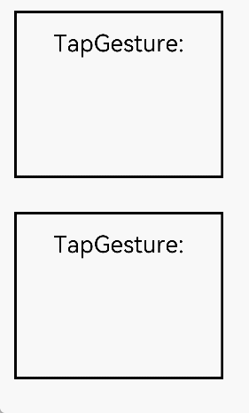

# Gesture Binding
<!--Kit: ArkUI-->
<!--Subsystem: ArkUI-->
<!--Owner: @jiangtao92-->
<!--Designer: @piggyguy-->
<!--Tester: @songyanhong-->
<!--Adviser: @HelloCrease-->

Bind different types of gesture events to components and set response methods for them.

>  **NOTE**
>
> The APIs of this module are supported since API version 7. Updates will be marked with a superscript to indicate their earliest API version.


## Binding Gesture Recognition

Use the following APIs to bind gesture recognition to a component. When a gesture is recognized, the event callback is invoked to notify the component.
A region in which a gesture can be recognized may be specified by the [touch target](ts-universal-attributes-touch-target.md).

**Atomic service API**: This API can be used in atomic services since API version 11.

>  **NOTE**
>
>  The **gesture**, **priorityGesture**, and **parallelGesture** APIs currently do not support switching gesture bindings using the ternary operator (condition ? expression1 : expression2).

### gesture

gesture(gesture: GestureType, mask?: GestureMask): T

Sets the gesture to bind.

**Atomic service API**: This API can be used in atomic services since API version 11.

**System capability**: SystemCapability.ArkUI.ArkUI.Full

**Parameters**

| Name| Type                                      | Mandatory| Description                        |
| ------ | ------------------------------------------ | ---- | ---------------------------- |
| gesture  |  [GestureType](#gesturetype) | Yes  | Type of the gesture to bind.|
| mask  |  [GestureMask](#gesturemask) | No  | Mask for gesture events.<br>Default value: **GestureMask.Normal**.|

**Return value**

| Type    | Description       |
| ------ | --------- |
| T | Current component.|

### priorityGesture

priorityGesture(gesture: GestureType, mask?: GestureMask): T

Sets the gesture to preferentially recognize. By default, the child component preferentially recognizes the gesture specified by **gesture**, and the parent component preferentially recognizes the gesture specified by **priorityGesture** (if set). 2. With regard to long press gestures, the component with the shortest minimum hold-down time responds first, ignoring the **priorityGesture** settings.

**Atomic service API**: This API can be used in atomic services since API version 11.

**System capability**: SystemCapability.ArkUI.ArkUI.Full

**Parameters**

| Name| Type                                      | Mandatory| Description                        |
| ------ | ------------------------------------------ | ---- | ---------------------------- |
| gesture  |  [GestureType](#gesturetype) | Yes  | Type of the gesture to bind.|
| mask  |  [GestureMask](#gesturemask) | No  | Mask for gesture events.<br>Default value: **GestureMask.Normal**.|

**Return value**

| Type    | Description       |
| ------ | --------- |
| T | Current component.|

### parallelGesture

parallelGesture(gesture: GestureType, mask?: GestureMask): T

Sets the gesture that can be recognized at once by the component and its child component. The gesture event is not a bubbling event. When **parallelGesture** is set for a component, both it and its child component can respond to the same gesture events, thereby implementing a quasi-bubbling effect.

**Atomic service API**: This API can be used in atomic services since API version 11.

**System capability**: SystemCapability.ArkUI.ArkUI.Full

**Parameters**

| Name| Type                                      | Mandatory| Description                        |
| ------ | ------------------------------------------ | ---- | ---------------------------- |
| gesture  |  [GestureType](#gesturetype) | Yes  | Type of the gesture to bind.|
| mask  |  [GestureMask](#gesturemask) | No  | Mask for gesture events.<br>Default value: **GestureMask.Normal**.|

**Return value**

| Type    | Description       |
| ------ | --------- |
| T | Current component.|


## GestureType

declare type GestureType = TapGesture | LongPressGesture | PanGesture | PinchGesture | SwipeGesture | RotationGesture | GestureGroup;

Defines the gesture type. The value type is a union of the types listed in the table below.

**Atomic service API**: This API can be used in atomic services since API version 11.

**System capability**: SystemCapability.ArkUI.ArkUI.Full

| Name| Description|
| -------- | -------- |
| [TapGesture](ts-basic-gestures-tapgesture.md) | Tap gesture, which can be a single-tap or multi-tap gesture.|
| [LongPressGesture](ts-basic-gestures-longpressgesture.md) | Long press gesture.|
| [PanGesture](ts-basic-gestures-pangesture.md) | Pan gesture, which requires a minimum 5 vp movement distance of a finger on the screen.|
| [PinchGesture](ts-basic-gestures-pinchgesture.md) | Pinch gesture.|
| [RotationGesture](ts-basic-gestures-rotationgesture.md) | Rotation gesture.|
| [SwipeGesture](ts-basic-gestures-swipegesture.md) | Swipe gesture, which can be recognized when the swipe speed is 100 vp/s or higher.|
| [GestureGroup](ts-combined-gestures.md) | A group of gestures. Continuous recognition, parallel recognition, and exclusive recognition are supported.|

## GestureInterface\<T><sup>11+</sup>

Defines the gesture API.

**Atomic service API**: This API can be used in atomic services since API version 11.

**System capability**: SystemCapability.ArkUI.ArkUI.Full

### tag<sup>11+</sup>

tag(tag: string): T

Sets a tag for the gesture.

**Atomic service API**: This API can be used in atomic services since API version 11.

**System capability**: SystemCapability.ArkUI.ArkUI.Full

**Parameters**

| Name| Type                                      | Mandatory| Description                       |
| ------ | ------------------------------------------ | ---- | ---------------------------- |
| tag  |  string | Yes  | Tag for the gesture.|

**Return value**

| Type    | Description       |
| ------ | --------- |
| T | Current component.|

### allowedTypes<sup>14+</sup>

allowedTypes(types: Array\<SourceTool>): T

Sets the input types that can trigger the gesture response.

**Atomic service API**: This API can be used in atomic services since API version 14.

**System capability**: SystemCapability.ArkUI.ArkUI.Full

**Parameters**

| Name| Type                                      | Mandatory| Description                       |
| ------ | ------------------------------------------ | ---- | ---------------------------- |
| types  |  Array\<SourceTool> | Yes  | Input types that can trigger the gesture response.|

**Return value**

| Type    | Description       |
| ------ | --------- |
| T | Current component.|


## GestureMask

**Atomic service API**: This API can be used in atomic services since API version 11.

**System capability**: SystemCapability.ArkUI.ArkUI.Full

| Name|Value| Description|
| -------- | ---- |-------- |
| Normal | - |The gestures of child components are enabled and recognized based on the default gesture recognition sequence.|
| IgnoreInternal | - | The gestures of child components are disabled, including the built-in gestures, such as the built-in swipe gesture for a **List** component. If the areas of the parent and child components are partly overlapped, only gestures in the overlapped areas are disabled.|

## Gesture Response Event

The component binds gesture objects of different **GestureType** instances through gesture events. Each gesture object provides gesture-related information in the gesture response event. In the following example, the **TapGesture** object provides gesture-related information in the **onAction** event. For details about the event definitions of other gestures, see the corresponding gesture sections. To bind multiple gestures, use [combined gestures](ts-combined-gestures.md).

**TapGesture**

| Name| Description|
| -------- | -------- |
| onAction((event:GestureEvent) =&gt; void) | Callback invoked when a tap gesture is recognized.|

## GestureEvent
Inherits from [BaseEvent](ts-gesture-customize-judge.md#baseevent8).

**System capability**: SystemCapability.ArkUI.ArkUI.Full

| Name| Type |   Read-Only | Optional   |  Description|
| -------- | -------- | ---- | ---- |-------- |
| repeat | boolean | No|  No |Whether the event is a repeat trigger event, used in the **LongPressGesture** scenarios. The value **true** means that the event is a repeat trigger event, and **false** means the opposite.<br>**Atomic service API**: This API can be used in atomic services since API version 11.|
| offsetX | number | No| No |X-axis offset of the gesture event relative to the finger press position, in vp. Used in **PanGesture** scenarios. A positive value means to pan from left to right, and a negative value means the opposite.<br>**Atomic service API**: This API can be used in atomic services since API version 11.<br>Value range: (-∞, +∞).|
| offsetY | number | No| No |Y-axis offset of the gesture event relative to the finger press position, in vp. Used in **PanGesture** scenarios. A positive value means to pan from top to bottom, and a negative value means the opposite.<br>**Atomic service API**: This API can be used in atomic services since API version 11.<br>Value range: (-∞, +∞). |
| angle | number | No| No |Rotation angle for the **RotationGesture** event;<br>angle of the swipe gesture for the **SwipeGesture** event, that is, the change in the included angle between the line segment created by the two fingers and the horizontal direction.<br>**NOTE**<br>Angle calculation method: After a swipe gesture is recognized, a line connecting the two fingers is identified as the initial line. As the fingers swipe, the line between the fingers rotates. Based on the coordinates of the initial line's and current line's end points, an arc tangent function is used to calculate the respective included angle of the points relative to the horizontal direction by using the following formula: Rotation angle = arctan2(cy2-cy1,cx2-cx1) - arctan2(y2-y1,x2-x1) The initial line is used as the coordinate system. The clockwise rotation is 0 to 180 degrees, and the counter-clockwise rotation is –180 to 0 degrees.<br>Value range: [-180, +180].<br>**Atomic service API**: This API can be used in atomic services since API version 11.|
| scale | number |No| No |Scale ratio. This attribute is used for the **PinchGesture** event.<br>Value range: [0, +∞).<br>**Atomic service API**: This API can be used in atomic services since API version 11.|
| pinchCenterX | number | No| No |X-coordinate of the pinch center, in vp. Used for the **PinchGesture** event.<br>Value range: [0, +∞).<br>**Atomic service API**: This API can be used in atomic services since API version 11.|
| pinchCenterY | number | No| No |Y-coordinate of the pinch center, in vp. Used for the **PinchGesture** event.<br>Value range: [0, +∞).<br>**Atomic service API**: This API can be used in atomic services since API version 11.|
| speed<sup>8+</sup> | number | No| No |Swipe gesture speed, that is, the average swipe speed of all fingers relative to the original area of the current component. The unit is vp/s. This attribute is used for the **SwipeGesture** event.<br>Value range: [0, +∞).<br>**Atomic service API**: This API can be used in atomic services since API version 11.|
| fingerList<sup>8+</sup> | [FingerInfo](#fingerinfo8)[] | No| No |List of touch points of the gesture event. If the event input device is touchscreen, the list includes all touch points. If the event input device is mouse or touchpad, the list contains only one touch point.<br>**NOTE**<br>The index of a finger corresponds to its position, that is, the ID of a finger in **fingerList[index]** refers to its index. If a finger is pressed first and does not participate in triggering of the current gesture, its position in **fingerList** is left empty.<br>**Atomic service API**: This API can be used in atomic services since API version 11.|
| fingerInfos<sup>20+</sup> | [FingerInfo](#fingerinfo8)[] | No| Yes |Information about touch points of the gesture event. For gesture events initiated by a touchscreen, **fingerInfos** includes information about all touch points. For gesture events initiated by a mouse or touchpad, **fingerInfos** contains only one touch point.<br> **NOTE**<br>**fingerInfos** only records information about effective fingers that participate in the touch. Fingers that are pressed first but do not participate in triggering of the current gesture will not be shown in **fingerInfos**. The default value is an empty array **[]**, and an empty array indicates no effective touch point information.<br>**Atomic service API**: This API can be used in atomic services since API version 20.|
| velocityX<sup>10+</sup> | number | No| No |Velocity along the x-axis. This parameter is used in [PanGesture](ts-basic-gestures-pangesture.md). The origin of the coordinate axis is the upper left corner of the screen. The velocity is positive if the movement is from left to right, and it is negative if the movement is from right to left. The unit is vp/s.<br>Value range: (-∞, +∞).<br>**Atomic service API**: This API can be used in atomic services since API version 11.|
| velocityY<sup>10+</sup> | number | No| No |Velocity along the y-axis. This parameter is used in [PanGesture](ts-basic-gestures-pangesture.md). The origin of the coordinate axis is the upper left corner of the screen. The velocity is positive if the movement is from top to bottom, and it is negative if the movement is from bottom to top. The unit is vp/s.<br>Value range: (-∞, +∞).<br>**Atomic service API**: This API can be used in atomic services since API version 11.|
| velocity<sup>10+</sup> | number | No| No |Velocity along the main axis. This parameter is used in [PanGesture](ts-basic-gestures-pangesture.md). The value is the arithmetic square root of the sum of squares of the velocity along the x- and y-axis. The unit is vp/s.<br>Value range: [0, +∞).<br>**Atomic service API**: This API can be used in atomic services since API version 11.|
| tapLocation<sup>20+</sup> | [EventLocationInfo](ts-basic-gestures-tapgesture.md#eventlocationinfo20) | No| Yes |Coordinate information of the current tap gesture.<br> **Atomic service API**: This API can be used in atomic services since API version 20.|

## SourceType<sup>8+</sup>

**Atomic service API**: This API can be used in atomic services since API version 11.

**System capability**: SystemCapability.ArkUI.ArkUI.Full

| Name| Value| Description|
| ---- | --- | -------- |
| Unknown | - | Unknown device type.|
| Mouse | - | Mouse.|
| TouchScreen | - | Touchscreen.|

## FingerInfo<sup>8+</sup>

**System capability**: SystemCapability.ArkUI.ArkUI.Full

| Name| Type| Read-Only| Optional| Description|
| -------- | -------- |  -------- |--------- |-------- |
| id | number | No | No    |Index of the finger, determined by the number of fingers pressed. The first pressed finger is assigned 0, with the index incrementing by one for each subsequent finger.<br>**NOTE**<br> Indexes for other input sources (mouse: 1001, stylus: 102, mouse wheel: 0, two-finger trackpad slide: 0) are also converted to finger indexes.<br>Value range: [0, 9).<br>**Atomic service API**: This API can be used in atomic services since API version 11.|
| globalX | number | No |  No    |X-coordinate relative to the upper left corner of the application window, in vp.<br>Value range: [0, +∞).<br>**Atomic service API**: This API can be used in atomic services since API version 11.|
| globalY | number | No |  No    |Y-coordinate relative to the upper left corner of the application window, in vp.<br>Value range: [0, +∞).<br>**Atomic service API**: This API can be used in atomic services since API version 11.|
| localX | number | No |  No    |X-coordinate relative to the upper left corner of the current component's original area, in vp.<br>Value range: [0, +∞).<br>**Atomic service API**: This API can be used in atomic services since API version 11.|
| localY | number | No |  No    |Y-coordinate relative to the upper left corner of the current component's original area, in vp.<br>Value range: [0, +∞).<br>**Atomic service API**: This API can be used in atomic services since API version 11.|
| displayX<sup>12+</sup> | number | No | No    | X-coordinate relative to the upper left corner of the screen, in vp.<br>Value range: [0, +∞).<br>**Atomic service API**: This API can be used in atomic services since API version 12.|
| displayY<sup>12+</sup> | number | No |  No    |Y-coordinate relative to the upper left corner of the screen, in vp.<br>Value range: [0, +∞).<br>**Atomic service API**: This API can be used in atomic services since API version 12.|
| hand<sup>15+</sup> | [InteractionHand](#interactionhand15) | No |  Yes    |Whether the event is triggered by a left-hand or right-hand tap.<br>**Atomic service API**: This API can be used in atomic services since API version 15.|
| globalDisplayX<sup>20+</sup> | number | No |  Yes    |X-coordinate relative to the upper left corner of the global display, in vp.<br>Value range: [0, +∞).<br>**Atomic service API**: This API can be used in atomic services since API version 20.|
| globalDisplayY<sup>20+</sup> | number | No |  Yes    |Y-coordinate relative to the upper left corner of the global display, in vp.<br>Value range: [0, +∞).<br>**Atomic service API**: This API can be used in atomic services since API version 20.|

## SourceTool<sup>9+</sup>

**System capability**: SystemCapability.ArkUI.ArkUI.Full

| Name| Value| Description|
| -------- | - | --------- |
| Unknown | - | Unknown input source.<br>**Atomic service API**: This API can be used in atomic services since API version 11.|
| Finger | - | Finger.<br>**Atomic service API**: This API can be used in atomic services since API version 11.|
| Pen | - | Stylus.<br>**Atomic service API**: This API can be used in atomic services since API version 11.|
| MOUSE<sup>12+</sup> | - | Mouse device.<br>**Atomic service API**: This API can be used in atomic services since API version 12.|
| TOUCHPAD<sup>12+</sup> | - | Touchpad. Single-finger input on the touchpad is treated as a mouse input operation.<br>**Atomic service API**: This API can be used in atomic services since API version 12.|
| JOYSTICK<sup>12+</sup> | - | Joystick.<br>**Atomic service API**: This API can be used in atomic services since API version 12.|

## InteractionHand<sup>15+</sup>

Defines whether an event is triggered by a left-hand or right-hand tap.

**Atomic service API**: This API can be used in atomic services since API version 15.

**System capability**: SystemCapability.ArkUI.ArkUI.Full

| Name| Description|
| -------- | -------- |
| NONE | Unknown.|
| LEFT | Left hand.|
| RIGHT | Right hand.|


## Example

### Example 1: Implementing Parent Component Prioritization and Simultaneous Gesture Triggering

This example demonstrates how to configure **priorityGesture** and **parallelGesture** to set up gesture recognition where the parent component has priority in recognizing gestures, and both parent and child components can trigger gestures simultaneously.

```ts
// xxx.ets
@Entry
@Component
struct GestureSettingsExample {
  @State priorityTestValue: string = ''
  @State parallelTestValue: string = ''

  build() {
    Column() {
      Column() {
        Text('TapGesture:' + this.priorityTestValue).fontSize(28)
          .gesture(
            TapGesture()
              .onAction((event: GestureEvent) => {
                this.priorityTestValue += '\nText'
              }))
      }
      .height(200)
      .width(250)
      .padding(20)
      .margin(20)
      .border({ width: 3 })
      // When priorityGesture is set, the tap gesture on the Column component is prioritized over the tap gesture on the child Text component.
      .priorityGesture(
        TapGesture()
          .onAction((event: GestureEvent) => {
            this.priorityTestValue += '\nColumn'
          }), GestureMask.IgnoreInternal)

      Column() {
        Text('TapGesture:' + this.parallelTestValue).fontSize(28)
          .gesture(
            TapGesture()
              .onAction((event: GestureEvent) => {
                this.parallelTestValue += '\nText'
              }))
      }
      .height(200)
      .width(250)
      .padding(20)
      .margin(20)
      .border({ width: 3 })
      // When parallelGesture is set, the tap gestures on the Column component and on the child Text component are both recognized.
      .parallelGesture(
        TapGesture()
          .onAction((event: GestureEvent) => {
            this.parallelTestValue += '\nColumn'
          }), GestureMask.Normal)
    }
  }
}
```



### Example 2: Implementing Real-time Monitoring of Effective Touch Points Involved in a Swipe Gesture

This example demonstrates how to configure **fingerInfos** to monitor the number of effective touch points involved in a swipe gesture in real time.

```ts
// xxx.ets
@Entry
@Component

struct PanGestureWithFingerCount {
  @State offsetX: number = 0
  @State offsetY: number = 0
  @State positionX: number = 0
  @State positionY: number = 0
  @State fingerCount: number = 0 // Used to record the number of touch points involved in the gesture.

  private panOption: PanGestureOptions = new PanGestureOptions({
    direction: PanDirection.All,
    fingers: 1
  })

  build() {
    Column() {
      // Display the number of effective touch points.
      Text(`Touch Points: ${this.fingerCount}`)
        .fontSize(20)
        .margin(10)

      Column() {
        Text('PanGesture offset:\nX: ' + this.offsetX + '\n' + 'Y: ' + this.offsetY)
      }
      .height(200)
      .width(300)
      .padding(20)
      .border({ width: 3 })
      .margin(50)
      .translate({ x: this.offsetX, y: this.offsetY, z: 0 })
      .gesture(
        PanGesture(this.panOption)
          .onActionStart((event: GestureEvent) => {
            console.info('Pan start')
            this.fingerCount = event.fingerInfos?.length || 0  // Record the number of touch points.
          })
          .onActionUpdate((event: GestureEvent) => {
            if (event) {
              console.info('fingerInfos',JSON.stringify(event.fingerInfos))
              this.offsetX = this.positionX + event.offsetX
              this.offsetY = this.positionY + event.offsetY
              this.fingerCount = event.fingerInfos?.length || 0  // Update the number of touch points, recording the effective touch points involved in the current gesture.
            }
          })
          .onActionEnd((event: GestureEvent) => {
            this.positionX = this.offsetX
            this.positionY = this.offsetY
            this.fingerCount = 0  // Reset the value to zero when the touch points leave the touch target.
            console.info('Pan end')
          })
          .onActionCancel(() => {
            this.fingerCount = 0 // Reset the value to zero when the gesture is canceled.
          })
      )

      Button('Switch to Two-Finger Swipe')
        .onClick(() => {
          this.panOption.setFingers(2)
        })
    }
  }
}
```
