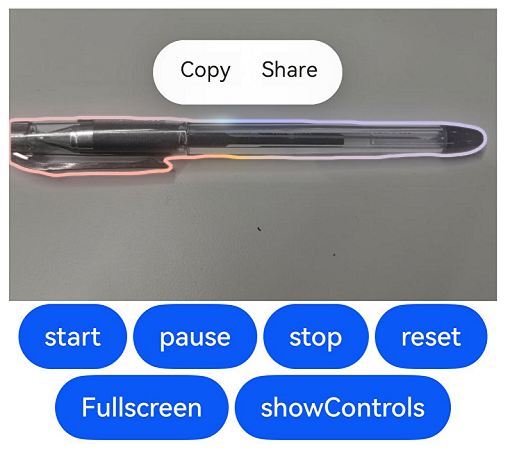

# Video

The **Video** component is used to play a video and control its playback.

>  **NOTE**
>
>  This component is supported since API version 7. Updates will be marked with a superscript to indicate their earliest API version.
>
>  The **Video** component provides only simple video playback features. For complex video playback control scenarios, consider using the [AVPlayer](../../apis-media-kit/arkts-apis-media-AVPlayer.md) APIs in conjunction with the [XComponent](ts-basic-components-xcomponent.md) component.
>
>  When using **expandSafeArea** to extend into safe areas, the **Video** component's content display area does not support expansion.

## Required Permissions

To use online videos, you must apply for the ohos.permission.INTERNET permission. For details about how to apply for a permission, see [Declaring Permissions](../../../security/AccessToken/declare-permissions.md).


## Child Components

Not supported


## APIs

### Video

Video(value: VideoOptions)

**Atomic service API**: This API can be used in atomic services since API version 11.

**System capability**: SystemCapability.ArkUI.ArkUI.Full

**Parameters**

| Name| Type| Mandatory| Description|
| -------- | -------- | -------- | -------- |
| value | [VideoOptions](#videooptions) | Yes| Video information.|

##  VideoOptions

Defines the options of the **Video** component.

**System capability**: SystemCapability.ArkUI.ArkUI.Full

| Name             | Type                                                    | Mandatory| Description                                                    |
| ------------------- | ------------------------------------------------------------ | ---- | ------------------------------------------------------------ |
| src                 | string \| [Resource](ts-types.md#resource)                            | No  | Video source, which can be either a local or a network video.<br>The Resource type allows cross-package and cross-module access to resource files and is commonly used for accessing local videos.<br>- Only resources in the rawfile folder are supported, which means that you can reference video files only with **$rawfile**.<br>The string type is used for loading local videos and, more frequently, network videos.<br>- Network video URLs are supported.<br>- Strings with the **file://** prefix, that is, [application sandbox URIs](../../apis-core-file-kit/js-apis-file-fileuri.md#constructor10): **file://\<bundleName>/\<sandboxPath>**, are supported. They are used to access resources in the application sandbox path. Ensure that the application has the read permission to the files in the specified path.<br>**NOTE**<br>The supported video formats are MP4, MKV, and TS.<br>**Atomic service API**: This API can be used in atomic services since API version 11.|
| currentProgressRate | number \| string \| [PlaybackSpeed<sup>8+</sup>](#playbackspeed8) | No  | Video playback speed.<br>**NOTE**<br>The value of the number type can only be **0.75**, **1.0**, **1.25**, **1.75**, or **2.0**.<br>For the string type, numeric string values, for example **0.75**, **1.0**, **1.25**, **1.75**, and **2.0**, are supported.<br>Default value: 1.0 \| PlaybackSpeed.Speed_Forward_1_00_X<br>**Atomic service API**: This API can be used in atomic services since API version 11.|
| previewUri          | string \| [PixelMap](../../apis-image-kit/arkts-apis-image-PixelMap.md) \| [Resource](ts-types.md#resource)  | No  | Path of the preview image displayed before the video playback starts. By default, no preview image is displayed.<br>The string type can be used to load online images and local images.<br>- URLs are supported for loading online images.<br>- Relative paths are supported for loading local images, for example, **previewUri: "common/test.jpg"**. When using an image referenced using a relative path, the component cannot be called across bundles or modules.<br>- Strings with the **file://** prefix, that is, [application sandbox URIs](../../apis-core-file-kit/js-apis-file-fileuri.md#constructor10): **file://\<bundleName>/\<sandboxPath>**, are supported. They are used to access resources in the application sandbox path. Ensure that the application has the read permission to the files in the specified path.<br>The Resource type allows cross-package and cross-module access to resource files.<br>- Resources in the **rawfile** folder are supported, which means that you can reference video files with **\\$rawfile**.<br>- You can use **\\$r** to reference images in system or application resources.<br>**Atomic service API**: This API can be used in atomic services since API version 11.                |
| controller          | [VideoController](#videocontroller)                          | No  | Video controller to control the video playback status.<br>**Atomic service API**: This API can be used in atomic services since API version 11.                    |
| imageAIOptions<sup>12+</sup>  | [ImageAIOptions](ts-image-common.md#imageaioptions) | No  | AI image analysis options. You can configure the analysis type or bind an analyzer controller through this parameter.<br>**Atomic service API**: This API can be used in atomic services since API version 12.|
| posterOptions<sup>18+</sup>  | [PosterOptions](#posteroptions18) | No  | Display options for the first frame of the video.<br>**Atomic service API**: This API can be used in atomic services since API version 18.|

## PlaybackSpeed<sup>8+</sup>

Enumerates video playback speed options.

**Atomic service API**: This API can be used in atomic services since API version 11.

**System capability**: SystemCapability.ArkUI.ArkUI.Full

| Name                | Description          |
| -------------------- | -------------- |
| Speed_Forward_0_75_X | 0.75x playback speed.|
| Speed_Forward_1_00_X | 1x playback speed.   |
| Speed_Forward_1_25_X | 1.25x playback speed.|
| Speed_Forward_1_75_X | 1.75x playback speed.|
| Speed_Forward_2_00_X | 2x playback speed.   |

## Attributes

In addition to the [universal attributes](ts-component-general-attributes.md), the following attributes are supported.

### muted

muted(value: boolean)

Sets whether to mute the video.

**Atomic service API**: This API can be used in atomic services since API version 11.

**System capability**: SystemCapability.ArkUI.ArkUI.Full

**Parameters**

| Name| Type   | Mandatory| Description                        |
| ------ | ------- | ---- | ---------------------------- |
| value  | boolean | Yes  | Whether to mute the video.<br>**true**: Mute the video.<br>**false**: Unmute the video.<br>Default value: **false**.|

> **NOTE**
>
> When not muted, the **Video** component will acquire audio focus when playback starts. To prevent it from interrupting other audio streams, make sure it is muted before initiating playback.

### autoPlay

autoPlay(value: boolean)

Specifies whether to enable autoplay.

**Atomic service API**: This API can be used in atomic services since API version 11.

**System capability**: SystemCapability.ArkUI.ArkUI.Full

**Parameters**

| Name| Type   | Mandatory| Description                            |
| ------ | ------- | ---- | -------------------------------- |
| value  | boolean | Yes  | Whether to enable autoplay.<br>**true**: Enable autoplay.<br>**false**: Disable autoplay.<br>Default value: **false**.|

### controls

controls(value: boolean)

Specifies whether to display the video playback control bar.

**Atomic service API**: This API can be used in atomic services since API version 11.

**System capability**: SystemCapability.ArkUI.ArkUI.Full

**Parameters**

| Name| Type   | Mandatory| Description                                           |
| ------ | ------- | ---- | ----------------------------------------------- |
| value  | boolean | Yes  | Whether to display the video playback control bar.<br>**true**: Display the video playback control bar.<br>**false**: Do not display the video playback control bar.<br>Default value: **true**|

> **NOTE**
>
> The **Video** component comes with a built-in controller that cannot be customized. If you require different functionality, you can hide the default controller and implement your own custom controller.  

### objectFit

objectFit(value: ImageFit)

Sets the fill mode for the video content.

**Atomic service API**: This API can be used in atomic services since API version 11.

**System capability**: SystemCapability.ArkUI.ArkUI.Full

**Parameters**

| Name| Type                                     | Mandatory| Description                            |
| ------ | ----------------------------------------- | ---- | -------------------------------- |
| value  | [ImageFit](ts-appendix-enums.md#imagefit) | Yes  | Fill mode of the video content.<br>Default value: **Cover**<br>Constraints: The enumerated value **Matrix** in **ImageFit** is not supported and will behave as **Cover**.<br>Invalid values, including **undefined**, **null**, and values outside the [ImageFit](ts-appendix-enums.md#imagefit) enumeration range, will result in an effect the same as **Cover**.|

### loop

loop(value: boolean)

Specifies whether to repeat the video.

**Atomic service API**: This API can be used in atomic services since API version 11.

**System capability**: SystemCapability.ArkUI.ArkUI.Full

**Parameters**

| Name| Type   | Mandatory| Description                                    |
| ------ | ------- | ---- | ---------------------------------------- |
| value  | boolean | Yes  | Whether to repeat the video.<br>**true**: Repeat the video.<br>**false**: Do not repeat the video.<br>Default value: **false**.|

### enableAnalyzer<sup>12+</sup>

enableAnalyzer(enable: boolean)

Sets whether to enable the AI image analyzer, which supports subject recognition, text recognition, and object lookup. This attribute can be dynamically set using [attributeModifier](ts-universal-attributes-attribute-modifier.md#attributemodifier).
After this feature is enabled, the video automatically enters an analysis state to process the current frame when playback is paused, and exits the analysis state when playback is resumed.
Note that if this attribute and the [overlay](ts-universal-attributes-overlay.md) attribute are both set, [CustomBuilder](ts-types.md#custombuilder8) specified in [overlay](ts-universal-attributes-overlay.md) has no effect.

**Atomic service API**: This API can be used in atomic services since API version 12.

**System capability**: SystemCapability.ArkUI.ArkUI.Full

**Parameters**

| Name| Type| Mandatory| Description|
| -------- | -------- | -------- | -------- |
| enable | boolean | Yes| Whether to enable the AI image analyzer.<br>**true**: Enable the AI image analyzer.<br>**false**: Disable the AI imageanalyzer.<br>Default value: **false**.|

> **NOTE**
>
> This feature is available only when the custom control bar is used (that is, when the [controls](#controls) attribute is set to **false**).
>
> This feature depends on device capabilities.

### analyzerConfig<sup>12+</sup>

analyzerConfig(config: ImageAnalyzerConfig)

Sets the AI image analysis types, including subject recognition, text recognition, and object lookup. This attribute can be dynamically set using [attributeModifier](ts-universal-attributes-attribute-modifier.md#attributemodifier).

**Atomic service API**: This API can be used in atomic services since API version 12.

**System capability**: SystemCapability.ArkUI.ArkUI.Full

| Name| Type| Mandatory| Description|
| -------- | -------- | -------- | -------- |
| config | [ImageAnalyzerConfig](ts-image-common.md#imageanalyzerconfig) | Yes| AI image analysis types.|

### enableShortcutKey<sup>15+</sup>

enableShortcutKey(enabled: boolean)

Sets whether the component responds to keyboard shortcuts when it has focus.

Currently, the component can respond to the following keys when it is in focus: spacebar for playing or pausing the video, up or down arrow key for adjusting the video volume, and left or right arrow key for fast forwarding or rewinding the video.

**Atomic service API**: This API can be used in atomic services since API version 15.

**System capability**: SystemCapability.ArkUI.ArkUI.Full

| Name | Type   | Mandatory| Description                                  |
| ------- | ------- | ---- | -------------------------------------- |
| enabled | boolean | Yes  | Whether the component responds to keyboard shortcuts when it has focus.<br>**true**: The component responds to keyboard shortcuts when it has focus.<br>**false**: The component does not respond to keyboard shortcuts when it has focus.<br>Default value: **false**.|

## Events

In addition to the [universal events](ts-component-general-events.md), the following events are supported.

### onStart

onStart(event: VoidCallback)

Triggered when video playback starts. Dynamic property modification using [attributeModifier](ts-universal-attributes-attribute-modifier.md#attributemodifier) is supported.

**Atomic service API**: This API can be used in atomic services since API version 11.

**System capability**: SystemCapability.ArkUI.ArkUI.Full

**Parameters**

| Name| Type                                          | Mandatory| Description                                |
| ------ | --------------------------------------------- | ---- | ----------------------------------- |
| event  | [VoidCallback](ts-types.md#voidcallback12)    | Yes  | Callback invoked when video playback starts.       |

### onPause

onPause(event: VoidCallback)

Triggered when video playback is paused. Dynamic property modification using [attributeModifier](ts-universal-attributes-attribute-modifier.md#attributemodifier) is supported.

**Atomic service API**: This API can be used in atomic services since API version 11.

**System capability**: SystemCapability.ArkUI.ArkUI.Full

**Parameters**

| Name| Type                                          | Mandatory| Description                                |
| ------ | --------------------------------------------- | ---- | ----------------------------------- |
| event  | [VoidCallback](ts-types.md#voidcallback12)    | Yes  | Callback invoked when video playback is paused.       |

### onFinish

onFinish(event: VoidCallback)

Triggered when video playback is finished. Dynamic property modification using [attributeModifier](ts-universal-attributes-attribute-modifier.md#attributemodifier) is supported.

**Atomic service API**: This API can be used in atomic services since API version 11.

**System capability**: SystemCapability.ArkUI.ArkUI.Full

**Parameters**

| Name| Type                                          | Mandatory| Description                                |
| ------ | --------------------------------------------- | ---- | ----------------------------------- |
| event  | [VoidCallback](ts-types.md#voidcallback12)    | Yes  | Callback invoked when video playback is finished.       |

### onError

onError(event: VoidCallback | ErrorCallback)

Triggered when video playback fails. Dynamic property modification using [attributeModifier](ts-universal-attributes-attribute-modifier.md#attributemodifier) is supported.

**Atomic service API**: This API can be used in atomic services since API version 11.

**System capability**: SystemCapability.ArkUI.ArkUI.Full

**Parameters**

| Name| Type                                          | Mandatory| Description                                |
| ------ | --------------------------------------------- | ---- | ----------------------------------- |
| event  | [VoidCallback](ts-types.md#voidcallback12) \| [ErrorCallback](../../apis-basic-services-kit/js-apis-base.md#errorcallback)<sup>20+</sup> | Yes  | Callback invoked when video playback fails. The [ErrorCallback](../../apis-basic-services-kit/js-apis-base.md#errorcallback) parameter is used to receive error information.|

For details about the following error codes, see [Video Component Error Codes](../errorcode-video.md). For details about other error codes, see [Media Error Codes](../../apis-media-kit/errorcode-media.md).

|Error Code|Error Message|
|--|--|
|103601 |Failed to create the media player.|
|103602 |Not a valid source.|

### onStop<sup>12+</sup>

onStop(event: Callback&lt;void&gt;)

Triggered when video playback is stopped (after **stop()** is called). Dynamic property modification using [attributeModifier](ts-universal-attributes-attribute-modifier.md#attributemodifier) is supported.

**Atomic service API**: This API can be used in atomic services since API version 12.

**System capability**: SystemCapability.ArkUI.ArkUI.Full

### onPrepared

onPrepared(callback: Callback\<PreparedInfo>)

Triggered when video preparation is complete. Dynamic property modification using [attributeModifier](ts-universal-attributes-attribute-modifier.md#attributemodifier) is supported.

**Atomic service API**: This API can be used in atomic services since API version 11.

**System capability**: SystemCapability.ArkUI.ArkUI.Full

**Parameters**

| Name  | Type  | Mandatory| Description                      |
| -------- | ------ | ---- | -------------------------- |
| callback | Callback\<[PreparedInfo](#preparedinfo18)> | Yes  | Duration of the video.|

### onSeeking

onSeeking(callback: Callback\<PlaybackInfo>)

Triggered to report the time information while seeking is in progress (the progress bar is being dragged). Dynamic property modification using [attributeModifier](ts-universal-attributes-attribute-modifier.md#attributemodifier) is supported.

**Atomic service API**: This API can be used in atomic services since API version 11.

**System capability**: SystemCapability.ArkUI.ArkUI.Full

**Parameters**

| Name| Type  | Mandatory| Description                          |
| ------ | ------ | ---- | ------------------------------ |
| callback   | Callback\<[PlaybackInfo](#playbackinfo18)> | Yes  | Callback that provides the current playback progress.|

### onSeeked

onSeeked(callback: Callback\<PlaybackInfo>)

Triggered to report the time information while seeking is completed. Dynamic property modification using [attributeModifier](ts-universal-attributes-attribute-modifier.md#attributemodifier) is supported.

**Atomic service API**: This API can be used in atomic services since API version 11.

**System capability**: SystemCapability.ArkUI.ArkUI.Full

**Parameters**

| Name| Type  | Mandatory| Description                          |
| ------ | ------ | ---- | ------------------------------ |
| callback   | Callback\<[PlaybackInfo](#playbackinfo18)> | Yes  | Callback that provides the current playback progress.|

### onUpdate

onUpdate(callback: Callback\<PlaybackInfo>)

Triggered when playback progress changes. Dynamic property modification using [attributeModifier](ts-universal-attributes-attribute-modifier.md#attributemodifier) is supported.

**Atomic service API**: This API can be used in atomic services since API version 11.

**System capability**: SystemCapability.ArkUI.ArkUI.Full

**Parameters**

| Name| Type  | Mandatory| Description                          |
| ------ | ------ | ---- | ------------------------------ |
| callback   | Callback\<[PlaybackInfo](#playbackinfo18)> | Yes  | Callback that provides the current playback progress.|

### onFullscreenChange

onFullscreenChange(callback: Callback\<FullscreenInfo>)

Triggered when video playback is switched between full-screen mode and non-full-screen mode. Dynamic property modification using [attributeModifier](ts-universal-attributes-attribute-modifier.md#attributemodifier) is supported.

**Atomic service API**: This API can be used in atomic services since API version 11.

**System capability**: SystemCapability.ArkUI.ArkUI.Full

**Parameters**

| Name    | Type   | Mandatory| Description                                                 |
| ---------- | ------- | ---- | ----------------------------------------------------- |
| callback | Callback\<[FullscreenInfo](#fullscreeninfo18)> | Yes  | Callback that indicates whether the video playback is in full-screen mode.|

## FullscreenInfo<sup>18+</sup>

Describes whether the video is in full-screen playback mode.

> **NOTE**
>
> To standardize anonymous object definitions, the element definitions here have been revised in API version 18. While historical version information is preserved for anonymous objects, there may be cases where the outer element's @since version number is higher than inner elements'. This does not affect interface usability.

**Atomic service API**: This API can be used in atomic services since API version 18.

**System capability**: SystemCapability.ArkUI.ArkUI.Full

| Name      | Type   | Read Only| Optional| Description                        |
| ----------- | ------- | ---- | ----  | ---------------------------- |
| fullscreen<sup>10+</sup>  | boolean | No| No | Callback that indicates whether the video playback is in full-screen mode.<br>**true**: The video playback is in full-screen mode.<br>**false**: The video playback is not in full-screen mode.<br>Default value: **false**<br>**Atomic service API**: This API can be used in atomic services since API version 11. |

## PreparedInfo<sup>18+</sup>

Describes the duration of the video.

> **NOTE**
>
> To standardize anonymous object definitions, the element definitions here have been revised in API version 18. While historical version information is preserved for anonymous objects, there may be cases where the outer element's @since version number is higher than inner elements'. This does not affect interface usability.

**Atomic service API**: This API can be used in atomic services since API version 18.

**System capability**: SystemCapability.ArkUI.ArkUI.Full

| Name      | Type   | Read Only| Optional| Description                        |
| ----------- | ------- | ---- | ----  | ---------------------------- |
| duration<sup>10+</sup> | number  | No| No | Duration of the video.<br>Unit: second<br>Value range: [0, +∞)<br>**Atomic service API**: This API can be used in atomic services since API version 11.|

## PlaybackInfo<sup>18+</sup>

Describes the current progress of video playback.

> **NOTE**
>
> To standardize anonymous object definitions, the element definitions here have been revised in API version 18. While historical version information is preserved for anonymous objects, there may be cases where the outer element's @since version number is higher than inner elements'. This does not affect interface usability.

**Atomic service API**: This API can be used in atomic services since API version 18.

**System capability**: SystemCapability.ArkUI.ArkUI.Full

| Name      | Type   | Read Only| Optional| Description                        |
| ----------- | ------- | ---- | ---- | ---------------------------- |
| time<sup>10+</sup> | number  | No| No | Callback that provides the current playback progress.<br>Unit: second<br>Value range: [0, +∞)<br>**Atomic service API**: This API can be used in atomic services since API version 11.|

## PosterOptions<sup>18+</sup>

Defines display options for the first frame of the video.

**Atomic service API**: This API can be used in atomic services since API version 18.

**System capability**: SystemCapability.ArkUI.ArkUI.Full

| Name      | Type   | Read Only| Optional| Description                        |
| ----------- | ------- | ---- | ---- | ---------------------------- |
| showFirstFrame   | boolean | No| Yes| Whether to enable first frame display, showing the first frame of the video as a preview.<br>**true**: Enable first frame display.<br>**false**: Disable first frame display.<br>Default value: **false**.     |

## VideoController

Defines a **VideoController** object to control one or more **Video** components. For details about available video playback examples, see [@ohos.multimedia.media](../../apis-media-kit/arkts-apis-media.md).

**Atomic service API**: This API can be used in atomic services since API version 11.

**System capability**: SystemCapability.ArkUI.ArkUI.Full

### Objects to Import

```ts
let controller: VideoController = new VideoController()
```

### constructor

constructor()

A constructor used to create a **VideoController** object.

**Atomic service API**: This API can be used in atomic services since API version 11.

**System capability**: SystemCapability.ArkUI.ArkUI.Full

### start

start()

Starts playback.

**Atomic service API**: This API can be used in atomic services since API version 11.

**System capability**: SystemCapability.ArkUI.ArkUI.Full

### pause

pause()

Pauses playback. The current frame is then displayed, and playback will be resumed from this paused position.

**Atomic service API**: This API can be used in atomic services since API version 11.

**System capability**: SystemCapability.ArkUI.ArkUI.Full

### stop

stop()

Stops playback. The current frame is then displayed, and playback will restart from the very beginning.

**Atomic service API**: This API can be used in atomic services since API version 11.

**System capability**: SystemCapability.ArkUI.ArkUI.Full

### reset<sup>12+</sup>

reset(): void

Resets the **AVPlayer** instance of this component, which displays the current frame and sets the playback to start from the beginning for subsequent playbacks.

**Atomic service API**: This API can be used in atomic services since API version 12.

**System capability**: SystemCapability.ArkUI.ArkUI.Full

### setCurrentTime

setCurrentTime(value: number)

Sets the video playback position.

> **NOTE**
>
> To start playback from a specific position, disable autoplay, wait for video preparation to complete, and then seek to the target position.

**Atomic service API**: This API can be used in atomic services since API version 11.

**System capability**: SystemCapability.ArkUI.ArkUI.Full

**Parameters**

| Name  | Type  | Mandatory  | Description          |
| ----- | ------ | ---- | -------------- |
| value | number | Yes   | Video playback position.<br>Value range: [0, [duration](ts-media-components-video.md#preparedinfo18)], in seconds<br>Since API version 8, seek mode configuration is supported. For details, see [setCurrentTime<sup>8+</sup>](#setcurrenttime8).|

### requestFullscreen

requestFullscreen(value: boolean)

Requests full-screen playback.

**Atomic service API**: This API can be used in atomic services since API version 11.

**System capability**: SystemCapability.ArkUI.ArkUI.Full

**Parameters**

| Name| Type| Mandatory| Description                        |
| ------ | -------- | ---- | -------------------------------- |
| value  | boolean  | Yes  | Whether to request full-screen playback (filling the application window).<br>**true**: Request full-screen playback.<br>**false**: Do not request full-screen playback.<br>Default value: **false**.|

> **NOTE**
>
>  The built-in full-screen feature of the **Video** component only sets the video content to full screen and displays the default controller. It does not support displaying a custom title or controller. If additional functionality is required, implement custom full-screen features.

### exitFullscreen

exitFullscreen()

Exits full-screen mode.

**Atomic service API**: This API can be used in atomic services since API version 11.

**System capability**: SystemCapability.ArkUI.ArkUI.Full

### setCurrentTime<sup>8+</sup>

setCurrentTime(value: number, seekMode: SeekMode)

Sets the video playback position with the specified seek mode.

**Atomic service API**: This API can be used in atomic services since API version 11.

**System capability**: SystemCapability.ArkUI.ArkUI.Full

**Parameters**

| Name     | Type    | Mandatory  | Description          |
| -------- | -------- | ---- | -------------- |
| value    | number   | Yes   |  Video playback position, in seconds.|
| seekMode | [SeekMode](#seekmode8) | Yes   | Seek mode.         |

## SeekMode<sup>8+</sup>

Enumerates video seek modes.

**Atomic service API**: This API can be used in atomic services since API version 11.

**System capability**: SystemCapability.ArkUI.ArkUI.Full

| Name            | Description                        |
| ---------------- | ---------------------------- |
| PreviousKeyframe | Seek to the nearest previous keyframe.  |
| NextKeyframe     | Seek to the nearest next keyframe.  |
| ClosestKeyframe  | Seek to the nearest keyframe.        |
| Accurate         | Seek to a specific frame, regardless of whether the frame is a keyframe.|

## Example

### Example 1: Implementing Basic Video Playback Features

This example covers the basic features of video playback, including how to manage the control bar, use preview images, handle autoplay, adjust the playback speed, respond to keyboard shortcuts, and operate the controller for playback control. Additionally, it demonstrates how to implement first frame display and the callbacks for various playback states.

```ts
// xxx.ets
@Entry
@Component
struct VideoCreateComponent {
  @State videoSrc: Resource = $rawfile('video1.mp4');
  @State previewUri: Resource = $r('app.media.poster1');
  @State curRate: PlaybackSpeed = PlaybackSpeed.Speed_Forward_1_00_X;
  @State isAutoPlay: boolean = false;
  @State showControls: boolean = true;
  @State isShortcutKeyEnabled: boolean = false;
  @State showFirstFrame: boolean = false;
  controller: VideoController = new VideoController();

  build() {
    Column() {
      Video({
        src: this.videoSrc,
        previewUri: this.previewUri, // Set the preview image.
        currentProgressRate: this.curRate, // Set the playback speed.
        controller: this.controller,
        posterOptions: { showFirstFrame: this.showFirstFrame } // Disable first frame display.
      })
        .width('100%')
        .height(600)
        .autoPlay(this.isAutoPlay)
        .controls(this.showControls)
        .enableShortcutKey(this.isShortcutKeyEnabled)
        .onStart(() => {
          console.info('onStart')
        })
        .onPause(() => {
          console.info('onPause')
        })
        .onFinish(() => {
          console.info('onFinish')
        })
        .onError(() => {
          console.info('onError')
        })
        .onStop(() => {
          console.info('onStop')
        })
        .onPrepared((e?: DurationObject) => {
          if (e != undefined) {
            console.info('onPrepared is ' + e.duration)
          }
        })
        .onSeeking((e?: TimeObject) => {
          if (e != undefined) {
            console.info('onSeeking is ' + e.time)
          }
        })
        .onSeeked((e?: TimeObject) => {
          if (e != undefined) {
            console.info('onSeeked is ' + e.time)
          }
        })
        .onUpdate((e?: TimeObject) => {
          if (e != undefined) {
            console.info('onUpdate is ' + e.time)
          }
        })
        .onFullscreenChange((e?: FullscreenObject) => {
          if (e != undefined) {
            console.info('onFullscreenChange is ' + e.fullscreen)
          }
        })

      Row() {
        Button('src').onClick(() => {
          this.videoSrc = $rawfile('video2.mp4') // Switch the video source.
        }).margin(5)
        Button('previewUri').onClick(() => {
          this.previewUri = $r('app.media.poster2') // Switch the preview image.
        }).margin(5)
        Button('controls').onClick(() => {
          this.showControls = !this.showControls // Specify whether to show the control bar.
        }).margin(5)
      }

      Row() {
        Button('start').onClick(() => {
          this.controller.start() // Start playback.
        }).margin(2)
        Button('pause').onClick(() => {
          this.controller.pause() // Pause playback.
        }).margin(2)
        Button('stop').onClick(() => {
          this.controller.stop() // Stop playback.
        }).margin(2)
        Button('reset').onClick(() => {
          this.controller.reset () // Reset the AVPlayer instance.
        }).margin(2)
        Button('setTime').onClick(() => {
          this.controller.setCurrentTime(10, SeekMode.Accurate) // Seek to the 10s position of the video.
        }).margin(2)
      }

      Row() {
        Button('rate 0.75').onClick(() => {
          this.curRate = PlaybackSpeed.Speed_Forward_0_75_X // Play the video at the 0.75x speed.
        }).margin(5)
        Button('rate 1').onClick(() => {
          this.curRate = PlaybackSpeed.Speed_Forward_1_00_X // Play the video at the 1x speed.
        }).margin(5)
        Button('rate 2').onClick(() => {
          this.curRate = PlaybackSpeed.Speed_Forward_2_00_X // Play the video at the 2x speed.
        }).margin(5)
      }
    }
  }
}

interface DurationObject {
  duration: number;
}

interface TimeObject {
  time: number;
}

interface FullscreenObject {
  fullscreen: boolean;
}
```

### Example 2: Enabling AI Image Analyzer

This example shows how to use the **enableAnalyzer** attribute to enable AI image analyzer.

```ts
// xxx.ets
@Entry
@Component
struct ImageAnalyzerExample {
  @State videoSrc: Resource = $rawfile('video1.mp4');
  @State previewUri: Resource = $r('app.media.poster1');
  controller: VideoController = new VideoController();
  config: ImageAnalyzerConfig = {
    types: [ImageAnalyzerType.SUBJECT, ImageAnalyzerType.TEXT]
  }
  private aiController: ImageAnalyzerController = new ImageAnalyzerController();
  private options: ImageAIOptions = {
    types: [ImageAnalyzerType.SUBJECT, ImageAnalyzerType.TEXT],
    aiController: this.aiController
  }

  build() {
    Column() {
      Video({
        src: this.videoSrc,
        previewUri: this.previewUri,
        controller: this.controller,
        imageAIOptions: this.options // Set the AI image analysis options.
      })
        .width('100%')
        .height(600)
        .controls(false)
        .enableAnalyzer(true)
        .analyzerConfig(this.config)
        .onStart(() => {
          console.info('onStart')
        })
        .onPause(() => {
          console.info('onPause')
        })

      Row() {
        Button('start').onClick(() => {
          this.controller.start() // Start playback.
        }).margin(5)
        Button('pause').onClick(() => {
          this.controller.pause() // Pause playback.
        }).margin(5)
        Button('getTypes').onClick(() => {
            this.aiController.getImageAnalyzerSupportTypes()
        }).margin(5)
      }
    }
  }
}
```

### Example 3: Playing a Dragged-in Video

This example demonstrates how to enable the **Video** component to play a video that is dragged into it.

```ts
// xxx.ets
import { unifiedDataChannel, uniformTypeDescriptor } from '@kit.ArkData';

@Entry
@Component
struct Index {
  @State videoSrc: Resource | string = $rawfile('video1.mp4');
  private controller: VideoController = new VideoController();

  build() {
    Column() {
      Video({
        src: this.videoSrc,
        controller: this.controller
      })
        .width('100%')
        .height(600)
        .onPrepared(() => {
          // Start playing the video when it is ready.
          this.controller.start();
        })
        .onDrop((e: DragEvent) => {
          // Handle the drop event when a video is dragged into the component.
          // The DragEvent contains the information about the dragged-in video source. After the information is obtained, assign a value to the state variable videoSrc to change the video source of the video.
          let record = e.getData().getRecords()[0];
          if (record.getType() == uniformTypeDescriptor.UniformDataType.VIDEO) {
            let videoInfo = record as unifiedDataChannel.Video;
            this.videoSrc = videoInfo.videoUri;
          }
        })
    }
  }
}
```
### Example 4: Setting the Video Fill Mode

This example shows how to set the video fill mode using the **objectFit** attribute.

```ts
// xxx.ets
@Entry
@Component
struct VideoObject {
  @State videoSrc: Resource = $rawfile('rabbit.mp4');
  @State previewUri: Resource = $r('app.media.tree');
  @State curRate: PlaybackSpeed = PlaybackSpeed.Speed_Forward_1_00_X;
  @State showControls: boolean = true;
  controller: VideoController = new VideoController();

  build() {
    Column() {
      Text("ImageFit.Contain").fontSize(12)
      Video({
        src: this.videoSrc,
        previewUri: this.previewUri,
        currentProgressRate: this.curRate,
        controller: this.controller
      })
        .width(350)
        .height(230)
        .controls(this.showControls)
        .objectFit(ImageFit.Contain)// Set the video fill mode to ImageFit.Contain.
        .margin(5)

      Text("ImageFit.Fill").fontSize(12)
      Video({
        src: this.videoSrc,
        previewUri: this.previewUri,
        currentProgressRate: this.curRate,
        controller: this.controller
      })
        .width(350)
        .height(230)
        .controls(this.showControls)
        .objectFit(ImageFit.Fill)// Set the video fill mode to ImageFit.Fill.
        .margin(5)

      Text("ImageFit.START").fontSize(12)
      Video({
        src: this.videoSrc,
        previewUri: this.previewUri,
        currentProgressRate: this.curRate,
        controller: this.controller
      })
        .width(350)
        .height(230)
        .controls(this.showControls)
        .objectFit(ImageFit.START)// Set the video fill mode to ImageFit.START.
        .margin(5)
    }.width('100%').alignItems(HorizontalAlign.Center)
  }
}
```


### Example 5: Handling Errors with onError

The following example uses an invalid video resource path to demonstrate how the **Video** component can obtain error codes through the **onError** event.

```ts
// xxx.ets
@Entry
@Component
struct VideoErrorComponent {
  @State videoSrc: string = "video.mp4"; // Enter an invalid video resource path.
  @State curRate: PlaybackSpeed = PlaybackSpeed.Speed_Forward_1_00_X;
  @State isAutoPlay: boolean = false;
  @State showControls: boolean = true;
  @State showFirstFrame: boolean = false;
  controller: VideoController = new VideoController();
  @State errorMessage: string = "";

  build() {
    Column() {
      Video({
        src: this.videoSrc,
        currentProgressRate: this.curRate,
        controller: this.controller,
      })
        .width(200)
        .height(120)
        .margin(5)
        .autoPlay(this.isAutoPlay)
        .controls(this.showControls)
        .onError((err) => {
          // Obtain the error code through the onError event, where code indicates the error code, and message indicates the error message.
          console.error(`code is ${err.code}, message is ${err.message}`);
          this.errorMessage = `code is ${err.code}, message is ${err.message}`;
        })
      // Pass in an invalid video resource path. Expected result: "code is 103602, message is Not a valid source."
      Text(this.errorMessage)
    }
    .width("100%")
    .height("100%")
    .backgroundColor('rgb(213,213,213)')
  }
}
```


### Example 6: Dynamically Setting Attributes and Methods of the Video Component Using attributeModifier

The following example demonstrates how to use **attributeModifier** to dynamically set the attributes and methods of the **Video** component, including AI image analysis features and playback event methods.

```ts
// xxx.ets
class MyVideoModifier implements AttributeModifier<VideoAttribute> {
  applyNormalAttribute(instance: VideoAttribute): void {
    // Enable the AI image analyzer, which can be triggered by a long press.
    instance.enableAnalyzer(true)
    let config: ImageAnalyzerConfig = {
      types: [ImageAnalyzerType.SUBJECT, ImageAnalyzerType.TEXT]
    }
    instance.analyzerConfig(config)
    instance.onStart(() => {
      console.info('video: onStart')
    })
    instance.onPause(() => {
      console.info('video: onPause')
    })
    instance.onFinish(() => {
      console.info('video: onFinish')
    })
    instance.onError((err) => {
      console.error('video: onError is code = ' + err.code + ', message = ' + err.message)
    })
    instance.onStop(() => {
      console.info('video: onStop')
    })
    instance.onPrepared((e?: DurationObject) => {
      if (e != undefined) {
        console.info('video: onPrepared is ' + e.duration)
      }
    })
    instance.onSeeking((e?: TimeObject) => {
      if (e != undefined) {
        console.info('video: onSeeking is ' + e.time)
      }
    })
    instance.onSeeked((e?: TimeObject) => {
      if (e != undefined) {
        console.info('video: onSeeked is ' + e.time)
      }
    })
    instance.onUpdate((e?: TimeObject) => {
      if (e != undefined) {
        console.info('video: onUpdate is ' + e.time)
      }
    })
    instance.onFullscreenChange((e?: FullscreenObject) => {
      if (e != undefined) {
        console.info('video: onFullscreenChange is ' + e.fullscreen)
      }
    })
  }
}

@Entry
@Component
struct VideoModifierDemo {
  @State videoSrc: Resource = $rawfile('video.mp4');
  @State curRate: PlaybackSpeed = PlaybackSpeed.Speed_Forward_1_00_X;
  @State isAutoPlay: boolean = false;
  @State showControls: boolean = false;
  controller: VideoController = new VideoController();
  @State modifier: MyVideoModifier = new MyVideoModifier();

  build() {
    Column() {
      Video({
        src: this.videoSrc,
        currentProgressRate: this.curRate, // Set the playback speed.
        controller: this.controller
      })
        .width(300)
        .height(180)
        .autoPlay(this.isAutoPlay)
        .controls(this.showControls)
        .attributeModifier(this.modifier)
      Row() {
        Button('start').onClick(() => {
          this.controller.start() // Start playback.
        }).margin(2)
        Button('pause').onClick(() => {
          this.controller.pause() // Pause playback.
        }).margin(2)
        Button('stop').onClick(() => {
          this.controller.stop() // Stop playback.
        }).margin(2)
        Button('reset').onClick(() => {
          this.controller.reset () // Reset the AVPlayer instance.
        }).margin(2)
      }

      Row() {
        Button('Fullscreen').onClick(() => {
          this.controller.requestFullscreen(true) // Enable full-screen mode.
        }).margin(2)
        Button('showControls').onClick(() => {
          this.showControls = !this.showControls // Specify whether to show the control bar.
        }).margin(2)
      }
    }
  }
}

interface DurationObject {
  duration: number;
}

interface TimeObject {
  time: number;
}

interface FullscreenObject {
  fullscreen: boolean;
}
```


<!--no_check-->