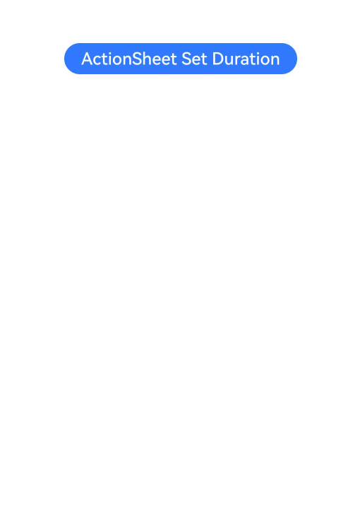

# Action Sheet (ActionSheet)

An action sheet is a dialog box that displays actions a user can take.

>  **NOTE**
>
>  The APIs of this module are supported since API version 8. Updates will be marked with a superscript to indicate their earliest API version.
>
> The functionality of this module depends on UI context. This means that the APIs of this module cannot be used where the UI context is unclear. For details, see [UIContext](../js-apis-arkui-UIContext.md#uicontext).
>
> Since API version 10, you can use the [showActionSheet](../js-apis-arkui-UIContext.md#showactionsheet) API in [UIContext](../js-apis-arkui-UIContext.md#uicontext) to obtain the UI context.

## ActionSheet.show

static show(value: ActionSheetOptions)

Shows an action sheet in the given settings.

**Atomic service API**: This API can be used in atomic services since API version 11.

**System capability**: SystemCapability.ArkUI.ArkUI.Full

**Parameters**

| Name| Type                                             | Mandatory| Description.                    |
| ------ | ------------------------------------------------- | ---- | ------------------------ |
| value  | [ActionSheetOptions](#actionsheetoptions) | Yes  | Parameters of the action sheet.|

## ActionSheetOptions

| Name     | Type                   | Mandatory | Description                         |
| ---------- | -------------------------- | ------- | ----------------------------- |
| title      | [Resource](ts-types.md#resource) \| string | Yes    |  Title of the dialog box.<br>**Atomic service API**: This API can be used in atomic services since API version 11.|
| subtitle<sup>10+</sup> | [ResourceStr](ts-types.md#resourcestr) | No| Subtitle of the dialog box.<br>**Atomic service API**: This API can be used in atomic services since API version 11.|
| message    | [Resource](ts-types.md#resource) \| string | Yes    | Content of the dialog box.<br>**Atomic service API**: This API can be used in atomic services since API version 11. |
| autoCancel | boolean                           | No    | Whether to close the dialog box when the overlay is clicked.<br>Default value: **true**<br>The value **true** means to close the dialog box when the overlay is clicked, and **false** means the opposite.<br>**Atomic service API**: This API can be used in atomic services since API version 11.|
| confirm    | {<br>enabled<sup>10+</sup>?: boolean,<br>defaultFocus<sup>10+</sup>?: boolean,<br>style<sup>10+</sup>?: [DialogButtonStyle](#dialogbuttonstyle10),<br>value: [Resource](ts-types.md#resource) \| string,<br>action: () =&gt; void<br>} | No | Information about the confirm button. When the dialog box has focus and the **Tab** key is not pressed for sequential focus navigation, the button responds to the **Enter** key by default.<br>**enabled**: whether the button responds to clicks. The value **true** means that the button responds to clicks, and **false** means the opposite.<br>Default value: **true**<br>**defaultFocus**: whether the button is the default focus. The value **true** means that the button is the default focus, and **false** means the opposite.<br>Default value: **false**<br>**style**: button style.<br>Default value: **DialogButtonStyle.DEFAULT**<br>**value**: button text.<br>**action**: callback upon button clicking.<br>**Atomic service API**: This API can be used in atomic services since API version 11.|
| cancel     | () =&gt; void           | No    | Callback invoked when the dialog box is closed after the overlay is clicked.<br>**Atomic service API**: This API can be used in atomic services since API version 11. |
| alignment  | [DialogAlignment](ts-methods-alert-dialog-box.md#dialogalignment) | No    |  Alignment mode of the dialog box in the vertical direction.<br>Default value: **DialogAlignment.Bottom**<br>**Atomic service API**: This API can be used in atomic services since API version 11.<br>**NOTE**<br>If **showInSubWindow** is set to **true** in **UIExtension**, the dialog box is aligned with the host window based on **UIExtension**.|
| offset     | {<br>dx: number \| string \| [Resource](ts-types.md#resource),<br>dy: number \| string \| [Resource](ts-types.md#resource)<br>} | No     | Offset of the dialog box relative to the alignment position.<br>Default value:<br>1. When alignment is set to **Top**, **TopStart**, or **TopEnd**: {dx: 0,dy: "40vp"}<br>2. When **alignment** is set to any other value: {dx: 0,dy: "-40vp"}<br>**Atomic service API**: This API can be used in atomic services since API version 11.|
| sheets     | Array&lt;[SheetInfo](#sheetinfo)&gt; | Yes      | Options in the dialog box. Each option supports the image, text, and callback.<br>**Atomic service API**: This API can be used in atomic services since API version 11.|
| maskRect<sup>10+</sup> | [Rectangle](ts-methods-alert-dialog-box.md#rectangle8) | No    | Mask area of the dialog box. Events outside the mask area are transparently transmitted, and events within the mask area are not.<br>Default value: **{ x: 0, y: 0, width: '100%', height: '100%' }**<br>**NOTE**<br>**maskRect** does not take effect when **showInSubWindow** is set to **true**.<br>**Atomic service API**: This API can be used in atomic services since API version 12.|
| showInSubWindow<sup>11+</sup> | boolean | No| Whether to show the dialog box in a sub-window when the dialog box needs to be displayed outside the main window.<br>Default value: **false**<br>**NOTE**<br>A dialog box whose **showInSubWindow** attribute is **true** cannot trigger the display of another dialog box whose **showInSubWindow** attribute is also **true**.<br>**Atomic service API**: This API can be used in atomic services since API version 12.|
| isModal<sup>11+</sup> | boolean | No| Whether the dialog box is a modal. A modal dialog box has a mask applied, while a non-modal dialog box does not.<br>Default value: **true**<br>**Atomic service API**: This API can be used in atomic services since API version 12.|
| backgroundColor<sup>11+</sup> | [ResourceColor](ts-types.md#resourcecolor)  | No| Background color of the dialog box.<br>Default value: **Color.Transparent**<br>**Atomic service API**: This API can be used in atomic services since API version 12.|
| backgroundBlurStyle<sup>11+</sup> | [BlurStyle](ts-appendix-enums.md#blurstyle9) | No| Background blur style of the dialog box.<br>Default value: **BlurStyle.COMPONENT_ULTRA_THICK**<br>**Atomic service API**: This API can be used in atomic services since API version 12.|
| onWillDismiss<sup>12+</sup> | Callback<[DismissDialogAction](ts-methods-alert-dialog-box.md#dismissdialogaction12)> | No| Callback for interactive closure of the dialog box.<br>**NOTE**<br>1. If this callback is registered, the dialog box will not be closed immediately after the user touches the mask or the Back button, presses the Esc key, or swipes left or right on the screen. The **reason** parameter in the callback is used to determine whether the dialog box can be closed. The reason returned by the component does not support the value **CLOSE_BUTTON**.<br>2. In the **onWillDismiss** callback, another **onWillDismiss** callback is not allowed.|
| cornerRadius<sup>12+</sup> | [BorderRadiuses](ts-types.md#borderradiuses9) \| [Dimension](ts-types.md#dimension10)  | No| Radius of the rounded corners of the background.<br>You can set separate radiuses for the four rounded corners.<br>Default value: **{ topLeft: '32vp', topRight: '32vp', bottomLeft: '32vp', bottomRight: '32vp' }**<br> The radius of the rounded corners is subject to the component size. Its maximum value is half of the component width or height. If the value is negative, the default value is used.<br> When set to a percentage, the value defines the radius as a percentage of the parent component's width or height.|
| borderWidth<sup>12+</sup> | [Dimension](ts-types.md#dimension10) \| [EdgeWidths](ts-types.md#edgewidths9)  | No| Border width of the dialog box.<br>You can set the width for all four sides or set separate widths for individual sides.<br>Default value: **0**<br> When set to a percentage, the value defines the border width as a percentage of the parent dialog box's width.<br>If the left and right borders are greater than its width, or the top and bottom borders are greater than its height, the dialog box may not display as expected.|
| borderColor<sup>12+</sup> | [ResourceColor](ts-types.md#resourcecolor) \| [EdgeColors](ts-types.md#edgecolors9)  | No| Border color of the dialog box.<br>Default value: **Color.Black**<br> **borderColor** must be used with **borderWidth** in pairs.|
| borderStyle<sup>12+</sup> | [BorderStyle](ts-appendix-enums.md#borderstyle) \| [EdgeStyles](ts-types.md#edgestyles9)  | No| Border style of the dialog box.<br>Default value: **BorderStyle.Solid**<br> **borderStyle** must be used with **borderWidth** in pairs.|
| width<sup>12+</sup> | [Dimension](ts-types.md#dimension10)   | No| Width of the dialog box.<br>**NOTE**<br>- Default maximum width of the dialog box: 400 vp<br>- When this parameter is set to a percentage, the reference width of the dialog box is the width of the window where the dialog box is located. You can decrease or increase the width as needed.|
| height<sup>12+</sup> | [Dimension](ts-types.md#dimension10)   | No| Height of the dialog box.<br>**NOTE**<br>- Default maximum height of the dialog box: 0.9 x (Window height – Safe area)<br>- When this parameter is set to a percentage, the reference height of the dialog box is the height of the window where the dialog box is located minus the safe area. You can decrease or increase the height as needed.|
| shadow<sup>12+</sup> | [ShadowOptions](ts-universal-attributes-image-effect.md#shadowoptions) \| [ShadowStyle](ts-universal-attributes-image-effect.md#shadowstyle10)   | No| Shadow of the dialog box.<br> Default value on 2-in-1 devices: **ShadowStyle.OUTER_FLOATING_MD** when the dialog box is focused and **ShadowStyle.OUTER_FLOATING_SM** otherwise|
| transition<sup>12+</sup> | [TransitionEffect](ts-transition-animation-component.md#transitioneffect10) | No| Transition effect for the entrance and exit of the dialog box.<br>**NOTE**<br>1. If this parameter is not set, the default effect is used.<br>2. Touching the Back button during the entrance animation pauses the entrance animation and starts the exit animation. The final effect is one obtained after the curves of the entrance and exit animations are combined.<br>3. Touching the Back button during the exit animation does not affect the animation playback. Touching the Back button again closes the application.|
## SheetInfo

**Atomic service API**: This API can be used in atomic services since API version 11.

| Name| Type                                                    | Mandatory| Description         |
| ------ | ------------------------------------------------------------ | ---- | ----------------- |
| title  | string \| [Resource](ts-types.md#resource) | Yes  | Sheet text.      |
| icon   | string \| [Resource](ts-types.md#resource) | No  | Sheet icon. By default, no icon is displayed.    |
| action | ()=&gt;void                                          | Yes  | Callback when the sheet is selected.|

## DialogButtonStyle<sup>10+</sup>

**Atomic service API**: This API can be used in atomic services since API version 11.

| Name     | Description.                             |
| --------- | --------------------------------- |
| DEFAULT   | Blue text on white background (black background under the dark theme).|
| HIGHLIGHT | White text on blue background.                       |

## Example

### Example 1

```ts
@Entry
@Component
struct ActionSheetExample {
  build() {
    Flex({ direction: FlexDirection.Column, alignItems: ItemAlign.Center, justifyContent: FlexAlign.Center }) {
      Button('Click to Show ActionSheet')
        .onClick(() => {
          ActionSheet.show({
            title: 'ActionSheet title',
            subtitle: 'ActionSheet subtitle',
            message: 'message',
            autoCancel: true,
            confirm: {
              defaultFocus: true,
              value: 'Confirm button',
              action: () => {
                console.log('Get Alert Dialog handled')
              }
            },
            cancel: () => {
              console.log('actionSheet canceled')
            },
              onWillDismiss:(dismissDialogAction: DismissDialogAction)=> {
                console.info("reason=" + JSON.stringify(dismissDialogAction.reason))
                console.log("dialog onWillDismiss")
                if (dismissDialogAction.reason == DismissReason.PRESS_BACK) {
                  dismissDialogAction.dismiss()
                }
                if (dismissDialogAction.reason == DismissReason.TOUCH_OUTSIDE) {
                  dismissDialogAction.dismiss()
                }
              },
            alignment: DialogAlignment.Bottom,
            offset: { dx: 0, dy: -10 },
            sheets: [
              {
                title: 'apples',
                action: () => {
                  console.log('apples')
                }
              },
              {
                title: 'bananas',
                action: () => {
                  console.log('bananas')
                }
              },
              {
                title: 'pears',
                action: () => {
                  console.log('pears')
                }
              }
            ]
          })
        })
    }.width('100%')
    .height('100%')
  }
}
```


### Example 2

```ts
@Entry
@Component
struct ActionSheetExample {
  build() {
    Flex({ direction: FlexDirection.Column, alignItems: ItemAlign.Center, justifyContent: FlexAlign.Center }) {
      Button('Click to Show ActionSheet')
        .onClick(() => {
          ActionSheet.show({
            title: 'ActionSheet title',
            subtitle: 'ActionSheet subtitle',
            message: 'message',
            autoCancel: true,
            showInSubWindow: true,
            isModal: true,
            confirm: {
              defaultFocus: true,
              value: 'Confirm button',
              action: () => {
                console.log('Get Alert Dialog handled')
              }
            },
            cancel: () => {
              console.log('actionSheet canceled')
            },
              onWillDismiss:(dismissDialogAction: DismissDialogAction)=> {
                console.info("reason=" + JSON.stringify(dismissDialogAction.reason))
                console.log("dialog onWillDismiss")
                if (dismissDialogAction.reason == DismissReason.PRESS_BACK) {
                  dismissDialogAction.dismiss()
                }
                if (dismissDialogAction.reason == DismissReason.TOUCH_OUTSIDE) {
                  dismissDialogAction.dismiss()
                }
              },
            alignment: DialogAlignment.Center,
            offset: { dx: 0, dy: -10 },
            sheets: [
              {
                title: 'apples',
                action: () => {
                  console.log('apples')
                }
              },
              {
                title: 'bananas',
                action: () => {
                  console.log('bananas')
                }
              },
              {
                title: 'pears',
                action: () => {
                  console.log('pears')
                }
              }
            ]
          })
        })
    }.width('100%')
    .height('100%')
  }
}
```


### Example 3
This example sets a 3s entrance animation and a 100 ms exit animation for the action sheet.
```ts
import router from '@ohos.router';
@Entry
@Component
struct ActionSheetExample {
  build() {
    Column({ space: 5 }) {
      Button('ActionSheet Set Duration')
        .onClick(() => {
            ActionSheet.show({
              title: 'ActionSheet 1',
              message: 'Set Animation Duration open 3 second, close 100 ms',
              autoCancel: true,
              alignment: DialogAlignment.Top,
              transition:TransitionEffect.asymmetric(TransitionEffect.OPACITY
                .animation({ duration: 3000, curve: Curve.Sharp }).combine(TransitionEffect.scale({x: 1.5, y: 1.5}).animation({duration: 3000, curve: Curve.Sharp})),
                TransitionEffect.OPACITY.animation({ duration: 100, curve: Curve.Smooth })
                  .combine(TransitionEffect.scale({x: 0.5, y: 0.5}).animation({duration: 100, curve: Curve.Smooth}))),
              offset: { dx: 0, dy: -20 },
              confirm: {
                value: 'button',
                action: () => {
                  console.info('Button-clicking callback')
                }
              },
              cancel: () => {
                console.info('Closed callbacks')
              },
              sheets: [
                {
                  title: 'apples',
                  action: () => {
                    console.log('apples')
                  }
                },
                {
                  title: 'bananas',
                  action: () => {
                    console.log('bananas')
                  }
                },
                {
                  title: 'pears',
                  action: () => {
                    console.log('pears')
                  }
                }
              ]
            })
        }).backgroundColor(0x317aff).height("88px")
    }.width('100%').margin({ top: 5 })
  }
}
```


