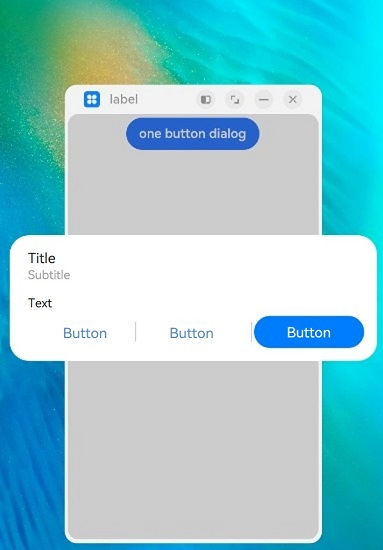
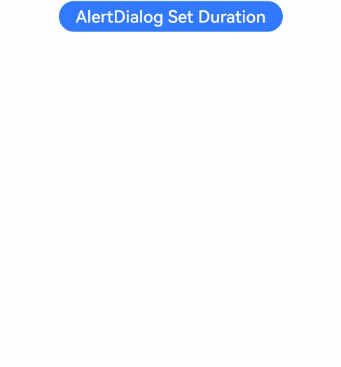

# Alert Dialog Box (AlertDialog)

You can set the text content and response callback for an alert dialog box.

>  **NOTE**
>
> The APIs of this module are supported since API version 7. Updates will be marked with a superscript to indicate their earliest API version.
>
> The functionality of this module depends on UI context. This means that the APIs of this module cannot be used where the UI context is unclear. For details, see [UIContext](../js-apis-arkui-UIContext.md#uicontext).
>
> Since API version 10, you can use the [showAlertDialog](../js-apis-arkui-UIContext.md#showalertdialog) API in [UIContext](../js-apis-arkui-UIContext.md#uicontext), which ensures that the alert dialog box is shown in the intended UI instance.

## AlertDialog

### show

static show(value: AlertDialogParamWithConfirm | AlertDialogParamWithButtons | AlertDialogParamWithOptions)

Shows an alert dialog box.

**Atomic service API**: This API can be used in atomic services since API version 11.

**System capability**: SystemCapability.ArkUI.ArkUI.Full

**Parameters**

| Name  | Type | Mandatory| Description|
| ---- | --------------- | -------- | -------- |
| value | [AlertDialogParamWithConfirm](#alertdialogparamwithconfirm) \| [AlertDialogParamWithButtons](#alertdialogparamwithbuttons) \| [AlertDialogParamWithOptions](#alertdialogparamwithoptions10)<sup>10+</sup> | Yes| Options of the alert dialog box.|

## AlertDialogParam

**System capability**: SystemCapability.ArkUI.ArkUI.Full

| Name                             | Type                                                        | Mandatory| Description                                                       |
| --------------------------------- | ------------------------------------------------------------ | ---- | ------------------------------------------------------------ |
| title                             | [ResourceStr](ts-types.md#resourcestr)                       | No  | Title of the dialog box.<br>**Atomic service API**: This API can be used in atomic services since API version 11.                                                 |
| subtitle<sup>10+</sup>            | [ResourceStr](ts-types.md#resourcestr)                       | No  | Subtitle of the dialog box.<br>**Atomic service API**: This API can be used in atomic services since API version 11.                                                |
| message                           | [ResourceStr](ts-types.md#resourcestr)                       | Yes  | Content of the dialog box.<br>**Atomic service API**: This API can be used in atomic services since API version 11.                                                |
| autoCancel                        | boolean                                                      | No  | Whether to close the dialog box when the overlay is clicked. The value **true** means to close the dialog box when the overlay is clicked, and **false** means the opposite.<br>Default value: **true**<br>**Atomic service API**: This API can be used in atomic services since API version 11.|
| cancel                            | () =&gt; void                                      | No  | Callback invoked when the dialog box is closed after the overlay is clicked.<br>**Atomic service API**: This API can be used in atomic services since API version 11.                              |
| alignment                         | [DialogAlignment](#dialogalignment)                  | No  | Alignment mode of the dialog box in the vertical direction.<br>Default value: **DialogAlignment.Default**<br>**Atomic service API**: This API can be used in atomic services since API version 11.<br>**NOTE**<br>If **showInSubWindow** is set to **true** in **UIExtension**, the dialog box is aligned with the host window based on **UIExtension**.|
| offset                            | [Offset](ts-types.md#offset)                                 | No  | Offset of the dialog box relative to the alignment position.<br>Default value: **{ dx: 0 , dy: 0 }**<br>**Atomic service API**: This API can be used in atomic services since API version 11.|
| gridCount                         | number                                                       | No  | Number of grid columns occupied by the width of the dialog box.<br>Default value: **4**<br>**Atomic service API**: This API can be used in atomic services since API version 11.                   |
| maskRect<sup>10+</sup>            | [Rectangle](#rectangle8)                             | No  | Mask area of the dialog box. Events outside the mask area are transparently transmitted, and events within the mask area are not.<br>Default value: **{ x: 0, y: 0, width: '100%', height: '100%' }**<br>**NOTE**<br>**maskRect** does not take effect when **showInSubWindow** is set to **true**.<br>**Atomic service API**: This API can be used in atomic services since API version 11.|
| showInSubWindow<sup>11+</sup>     | boolean                                                      | No  | Whether to show the dialog box in a sub-window when the dialog box needs to be displayed outside the main window.<br>Default value: **false**<br>**NOTE**<br>A dialog box whose **showInSubWindow** attribute is **true** cannot trigger the display of another dialog box whose **showInSubWindow** attribute is also **true**.<br>**Atomic service API**: This API can be used in atomic services since API version 12.|
| isModal<sup>11+</sup>             | boolean                                                      | No  | Whether the dialog box is a modal. A modal dialog box has a mask applied, while a non-modal dialog box does not.<br>Default value: **true**<br>**Atomic service API**: This API can be used in atomic services since API version 12.|
| backgroundColor<sup>11+</sup>     | [ResourceColor](ts-types.md#resourcecolor)                   | No  | Background color of the dialog box.<br>Default value: **Color.Transparent**<br>**NOTE**<br>When **backgroundColor** is set to a non-transparent color, **backgroundBlurStyle** must be set to **BlurStyle.NONE**; otherwise, the color display may not meet the expected effect.<br>**Atomic service API**: This API can be used in atomic services since API version 12.|
| backgroundBlurStyle<sup>11+</sup> | [BlurStyle](ts-universal-attributes-background.md#blurstyle9)                 | No  | Background blur style of the dialog box.<br>Default value: **BlurStyle.COMPONENT_ULTRA_THICK**<br>**NOTE**<br>Setting this parameter to **BlurStyle.NONE** disables the background blur. When **backgroundBlurStyle** is set to a value other than **NONE**, do not set **backgroundColor**. If you do, the color display may not produce the expected visual effect.<br>**Atomic service API**: This API can be used in atomic services since API version 12.|
| onWillDismiss<sup>12+</sup>       | Callback<[DismissDialogAction](#dismissdialogaction12)> | No  | Callback for interactive closure of the dialog box.<br>**NOTE**<br>1. If this callback is registered, the dialog box will not be closed immediately after the user touches the mask or the Back button, presses the Esc key, or swipes left or right on the screen. The **reason** parameter in the callback is used to determine whether the dialog box can be closed. The reason returned by the component does not support the value **CLOSE_BUTTON**.<br>2. In the **onWillDismiss** callback, another **onWillDismiss** callback is not allowed.<br>**Atomic service API**: This API can be used in atomic services since API version 12.|
| cornerRadius<sup>12+</sup>        |  [Dimension](ts-types.md#dimension10) \| [BorderRadiuses](ts-types.md#borderradiuses9) \| [LocalizedBorderRadiuses](ts-types.md#LocalizedBorderRadiuses12) | No  | Radius of the rounded corners of the background.<br>You can set separate radiuses for the four rounded corners.<br>Default value: **{ topLeft: '32vp', topRight: '32vp', bottomLeft: '32vp', bottomRight: '32vp' }**<br> The radius of the rounded corners is subject to the component size. Its maximum value is half of the component width or height. If the value is negative, the default value is used.<br> When set to a percentage, the value defines the radius as a percentage of the parent component's width or height.<br>**NOTE**<br>When **cornerRadius** is of type LocalizedBorderRadiuses, the layout order can be dynamically adjusted based on the user's language settings.<br>**Atomic service API**: This API can be used in atomic services since API version 12.|
| transition<sup>12+</sup>          | [TransitionEffect](ts-transition-animation-component.md#transitioneffect10) | No  | Transition effect for the entrance and exit of the dialog box.<br>**NOTE**<br> 1. If this parameter is not set, the default effect is used.<br> 2. Touching the Back button during the entrance animation pauses the entrance animation and starts the exit animation. The final effect is one obtained after the curves of the entrance and exit animations are combined.<br> 3. Touching the Back button during the exit animation does not affect the animation playback. Touching the Back button again closes the application.<br>**Atomic service API**: This API can be used in atomic services since API version 12.|
| width<sup>12+</sup>               | [Dimension](ts-types.md#dimension10) | No  | Width of the dialog box.<br>**NOTE**<br>- Default maximum width of the dialog box: 400 vp<br>- When this parameter is set to a percentage, the reference width of the dialog box is the width of the window where the dialog box is located. You can decrease or increase the width as needed.<br>**Atomic service API**: This API can be used in atomic services since API version 12.|
| height<sup>12+</sup>              | [Dimension](ts-types.md#dimension10)                         | No  | Height of the dialog box.<br>**NOTE**<br>- Default maximum height of the dialog box: 0.9 x (Window height – Safe area)<br>- When this parameter is set to a percentage, the reference height of the dialog box is the height of the window where the dialog box is located minus the safe area. You can decrease or increase the height as needed.<br>**Atomic service API**: This API can be used in atomic services since API version 12.|
| borderWidth<sup>12+</sup>         | [Dimension](ts-types.md#dimension10) \| [EdgeWidths](ts-types.md#edgewidths9) \| [LocalizedEdgeWidths](ts-types.md#LocalizedEdgeWidths12) | No  | <br>You can set the width for all four sides or set separate widths for individual sides.<br>Default value: **0**<br> When set to a percentage, the value defines the border width as a percentage of the parent dialog box's width.<br>If the left and right borders are greater than its width, or the top and bottom borders are greater than its height, the dialog box may not display as expected.<br>**NOTE**<br>When **borderWidth** is of type LocalizedEdgeWidths, the layout order can be dynamically adjusted based on the user's language settings.<br>**Atomic service API**: This API can be used in atomic services since API version 12.|
| borderColor<sup>12+</sup>         | [ResourceColor](ts-types.md#resourcecolor) \| [EdgeColors](ts-types.md#edgecolors9) \| [LocalizedEdgeColors](ts-types.md#LocalizedEdgeColors12) | No  | Border color of the dialog box.<br>Default value: **Color.Black**<br> **borderColor** must be used with **borderWidth** in pairs. **NOTE**<br>When **borderColor** is of type LocalizedEdgeColors, the layout order can be dynamically adjusted based on the user's language settings.<br>**Atomic service API**: This API can be used in atomic services since API version 12.|
| borderStyle<sup>12+</sup>         | [BorderStyle](ts-appendix-enums.md#borderstyle) \| [EdgeStyles](ts-types.md#edgestyles9) | No  | Border style of the dialog box.<br>Default value: **BorderStyle.Solid**<br>**borderStyle** must be used with **borderWidth** in pairs.<br>**Atomic service API**: This API can be used in atomic services since API version 12.|
| shadow<sup>12+</sup>              | [ShadowOptions](ts-universal-attributes-image-effect.md#shadowoptions) \| [ShadowStyle](ts-universal-attributes-image-effect.md#shadowstyle10) | No  | Shadow of the dialog box.<br> Default value on 2-in-1 devices: **ShadowStyle.OUTER_FLOATING_MD** when the dialog box is focused and **ShadowStyle.OUTER_FLOATING_SM** otherwise<br>**Atomic service API**: This API can be used in atomic services since API version 12.|
| textStyle<sup>12+</sup>              | [TextStyle](#textstyle12) | No  | Text style of the message in the dialog box.<br>**Atomic service API**: This API can be used in atomic services since API version 12.|

## AlertDialogParamWithConfirm

Inherits [AlertDialogParam](#alertdialogparam).

**Atomic service API**: This API can be used in atomic services since API version 11.

**System capability**: SystemCapability.ArkUI.ArkUI.Full

| Name      | Type    | Mandatory    | Description        |
| ---------- | ---------------- | ---------- | ------------------------------- |
| confirm    | {<br>enabled<sup>10+</sup>?: boolean,<br>defaultFocus<sup>10+</sup>?: boolean,<br>style<sup>10+</sup>?: [DialogButtonStyle](ts-appendix-enums.md#dialogbuttonstyle10),<br>value: [ResourceStr](ts-types.md#resourcestr),<br>fontColor?: [ResourceColor](ts-types.md#resourcecolor),<br>backgroundColor?:  [ResourceColor](ts-types.md#resourcecolor),<br>action: () =&gt; void<br>} | No  | Information about the confirm button. When the dialog box has focus and focus has not been shifted using the **Tab** key, the button responds to the **Enter** key by default, and multiple dialog boxes can gain focus consecutively to respond automatically. The default response to the **Enter** key does not work when **defaultFocus** is set to **true**.|

Priorities of the **confirm** parameters: **fontColor** and **backgroundColor** > **style** > **defaultFocus**

| backgroundColor | fontColor | style                       | defaultFocus | Effect    |
| --------------- | --------- | --------------------------- | ------------ | -------- |
| Green           | Red     | -                           | -            | Red text on green background|
| Green           | -         | DialogButtonStyle.HIGHLIGHT | -            | White text on green background|
| Green           | -         | DialogButtonStyle.DEFAULT   | -            | Blue text on green background|
| Green           | -         | -                           | TRUE         | White text on green background|
| Green           | -         | -                           | FALSE/-      | Blue text on green background|
| -               | Red     | DialogButtonStyle.HIGHLIGHT | -            | Red text on blue background|
| -               | Red     | DialogButtonStyle.DEFAULT   | -            | Red text on white background|
| -               | Red     | -                           | TRUE         | Red text on blue background|
| -               | Red     | -                           | FALSE/-      | Red text on white background|
| -               | -         | DialogButtonStyle.HIGHLIGHT | -            | White text on blue background|
| -               | -         | DialogButtonStyle.DEFAULT   | -            | Blue text on white background|
| -               | -         | -                           | TRUE         | White text on blue background|
| -               | -         | -                           | FALSE/-      | Blue text on white background|

## AlertDialogParamWithButtons

Inherits [AlertDialogParam](#alertdialogparam).

**Atomic service API**: This API can be used in atomic services since API version 11.

**System capability**: SystemCapability.ArkUI.ArkUI.Full

| Name            | Type               | Mandatory    | Description                    |
| --------------- | ---------------------- | ------------ | --------------------- |
| primaryButton   | {<br/>enabled<sup>10+</sup>?: boolean,<br/>defaultFocus<sup>10+</sup>?: boolean,<br />style<sup>10+</sup>?: [DialogButtonStyle](ts-appendix-enums.md#dialogbuttonstyle10),<br />value: [ResourceStr](ts-types.md#resourcestr),<br/>fontColor?: [ResourceColor](ts-types.md#resourcecolor),<br/>backgroundColor?: [ResourceColor](ts-types.md#resourcecolor),<br/>action: () =&gt; void;<br/>} | Yes| Information about the confirm button. When the dialog box has focus and focus has not been shifted using the **Tab** key, the button responds to the **Enter** key by default, and multiple dialog boxes can gain focus consecutively to respond automatically. The default response to the **Enter** key does not work when **defaultFocus** is set to **true**.|
| secondaryButton | {<br/>enabled<sup>10+</sup>?: boolean,<br/>defaultFocus<sup>10+</sup>?: boolean,<br />style<sup>10+</sup>?: [DialogButtonStyle](ts-appendix-enums.md#dialogbuttonstyle10),<br />value: [ResourceStr](ts-types.md#resourcestr),<br/>fontColor?: [ResourceColor](ts-types.md#resourcecolor),<br/>backgroundColor?: [ResourceColor](ts-types.md#resourcecolor),<br/>action: () =&gt; void;<br/>} | Yes| Information about the confirm button.|

## AlertDialogParamWithOptions<sup>10+</sup>

Inherits [AlertDialogParam](#alertdialogparam).

**Atomic service API**: This API can be used in atomic services since API version 11.

**System capability**: SystemCapability.ArkUI.ArkUI.Full

| Name            | Type               | Mandatory    | Description                    |
| --------------- | ---------------------- | ------------ | --------------------- |
| buttons       | Array&lt;[AlertDialogButtonOptions](#alertdialogbuttonoptions10)&gt;                 | Yes | Buttons in the dialog box.|
|buttonDirection      | [DialogButtonDirection](#dialogbuttondirection10)| No | Direction in which buttons are laid out.<br>Default value: **DialogButtonDirection.AUTO**<br>When there are more than three buttons, the Auto mode (which automatically switches to the vertical layout when there are more than two buttons) is recommended. In non-Auto mode, buttons that extend beyond the display area are clipped.|

## AlertDialogButtonOptions<sup>10+</sup>

**System capability**: SystemCapability.ArkUI.ArkUI.Full

| Name            | Type               | Mandatory    | Description                   |
| ------------------| ---------------------- | ------------ | --------------------- |
| enabled           | boolean | No    | Whether to respond when the button is clicked.<br>Default value: **true**|
| defaultFocus           | boolean | No    | Whether the button is the default focus.<br>Default value: **false**|
| style           | [DialogButtonStyle](ts-appendix-enums.md#dialogbuttonstyle10) | No    | Style of the button.<br>Default value: **DialogButtonStyle.DEFAULT**|
| value           | [ResourceStr](ts-types.md#resourcestr) | Yes    | Text of the button. If the value is null, the button is not displayed. |
| fontColor           | [ResourceColor](ts-types.md#resourcecolor) | No    | Font color of the button.|
| backgroundColor           | [ResourceColor](ts-types.md#resourcecolor) | No    | Background color of the button.|
| action           | () => void | Yes    | Callback upon button clicking.|
| primary<sup>12+</sup> | boolean | No  | Whether the button responds to the **Enter** key by default when the dialog box has focus and the **Tab** key is not pressed for sequential focus navigation. If there are multiple buttons, set this parameter to **true** for only one button. Otherwise, no button will respond. Multiple dialog boxes can automatically gain focus and respond to user interactions in a sequential manner. This parameter does not take effect when **defaultFocus** is set to **true**.<br>**Atomic service API**: This API can be used in atomic services since API version 12.|

## DialogButtonDirection<sup>10+</sup>

**Atomic service API**: This API can be used in atomic services since API version 11.

**System capability**: SystemCapability.ArkUI.ArkUI.Full

| Name                      | Description   |
| -------------------------- | --------- |
| AUTO                      | Buttons are laid out horizontally when there are two or fewer buttons and vertically otherwise.|
| HORIZONTAL                      | Buttons are laid out horizontally.|
| VERTICAL                      | Buttons are laid out vertically.|

## DialogAlignment

**Atomic service API**: This API can be used in atomic services since API version 11.

**System capability**: SystemCapability.ArkUI.ArkUI.Full

| Name                    | Description          |
| ------------------------ | -------------- |
| Top                      | Vertical top alignment.|
| Center                   | Vertical center alignment.|
| Bottom                   | Vertical bottom alignment.|
| Default                  | Default alignment.    |
| TopStart<sup>8+</sup>    | Top left alignment.    |
| TopEnd<sup>8+</sup>      | Top right alignment.    |
| CenterStart<sup>8+</sup> | Center left alignment.    |
| CenterEnd<sup>8+</sup>   | Center right alignment.    |
| BottomStart<sup>8+</sup> | Bottom left alignment.    |
| BottomEnd<sup>8+</sup>   | Bottom right alignment.    |

## Rectangle<sup>8+</sup>

The **Rectangle** type is used to represent a mask area of a dialog box.

**Widget capability**: This API can be used in ArkTS widgets since API version 9.

**Atomic service API**: This API can be used in atomic services since API version 11.

**System capability**: SystemCapability.ArkUI.ArkUI.Full

| Name    | Type                          | Mandatory| Description                              |
|--------|------------------------------|----|-----------------------------------|
| x      | [Length](ts-types.md#length) | No | X coordinate of the mask area of the dialog box relative to the upper left corner of the window.<br>Default value: **0vp**|
| y      | [Length](ts-types.md#length) | No | Y coordinate of the mask area of the dialog box relative to the upper left corner of the window.<br>Default value: **0vp**|
| width  | [Length](ts-types.md#length) | No | Width of the mask area of the dialog box.<br>Default value: **'100%'**       |
| height | [Length](ts-types.md#length) | No | Height of the mask area of the dialog box.<br>Default value: **'100%'**       |

>  **NOTE**
>
>  **x** and **y** can be set to a positive or negative percentage value. When **x** is set to **'100%'**, the mask area is moved rightward by the window width. When **x** is set to **'-100%'**, the mask area is moved leftward by the window width. When **y** is set to **'100%'**, the mask area is moved downward by the window height. When **y** is set to **'-100%'**, the mask area is moved upward by the window height.
>
>  **width** and **height** can be set in percentage and can only be set to positive values. If they are set to negative values, the default values are used instead.
>
>  The percentage is calculated based on the width and height of the window.

## DismissDialogAction<sup>12+</sup>

Provides information about the action to dismiss the dialog box.

**Atomic service API**: This API can be used in atomic services since API version 12.

**System capability**: SystemCapability.ArkUI.ArkUI.Full

### Properties

| Name   | Type                                                        | Readable| Writable| Description                                                        |
| ------- | ------------------------------------------------------------ | ---- | ---- | ------------------------------------------------------------ |
| dismiss | Callback&lt;void&gt;                                         | No  | No  | Callback for closing the dialog box. This API is called only when the dialog box needs to be exited.|
| reason  | [DismissReason](../js-apis-promptAction.md#dismissreason12) | No  | No  | Reason why the dialog box cannot be closed. You must specify whether to close the dialog box for each of the listed actions.|

## TextStyle<sup>12+</sup>

**Atomic service API**: This API can be used in atomic services since API version 12.

**System capability**: SystemCapability.ArkUI.ArkUI.Full

| Name    | Type                          | Mandatory| Description                               |
|--------|------------------------------|----|-----------------------------------|
| wordBreak      | [WordBreak](ts-appendix-enums.md#wordbreak11) | No | Word break rule.<br>Default value: **WordBreak.BREAK_ALL**|

## Example

### Example 1

> **NOTE**
> 
> To avoid confusion with **AlertDialog** instances, it is recommended that you obtain a **UIContext** instance using the [getUIContext](../js-apis-arkui-UIContext.md#uicontext) API, and then use the [showAlertDialog](../js-apis-arkui-UIContext.md#showalertdialog) API to invoke the instance's **AlertDialog.show()** method.

This example shows three alert dialog boxes, with one, two, and three buttons, respectively.

```ts
// xxx.ets
@Entry
@Component
struct AlertDialogExample {
  build() {
    Column({ space: 5 }) {
      Button('one button dialog')
        .onClick(() => {
          // You are advised to use this.getUIContext().showAlertDialog().
          AlertDialog.show(
            {
              title: 'title',
              message: 'text',
              autoCancel: true,
              alignment: DialogAlignment.Bottom,
              offset: { dx: 0, dy: -20 },
              gridCount: 3,
              confirm: {
                value: 'button',
                action: () => {
                  console.info('Button-clicking callback')
                }
              },
              cancel: () => {
                console.info('Closed callbacks')
              },
              onWillDismiss:(dismissDialogAction: DismissDialogAction)=> {
                console.info("reason=" + JSON.stringify(dismissDialogAction.reason))
                console.log("dialog onWillDismiss")
                if (dismissDialogAction.reason == DismissReason.PRESS_BACK) {
                  dismissDialogAction.dismiss()
                }
                if (dismissDialogAction.reason == DismissReason.TOUCH_OUTSIDE) {
                  dismissDialogAction.dismiss()
                }
              }
            }
          )
        })
        .backgroundColor(0x317aff)
      Button('two button dialog')
        .onClick(() => {
          // You are advised to use this.getUIContext().showAlertDialog().
          AlertDialog.show(
            {
              title: 'title',
              subtitle: 'subtitle',
              message: 'text',
              autoCancel: true,
              alignment: DialogAlignment.Bottom,
              gridCount: 4,
              offset: { dx: 0, dy: -20 },
              primaryButton: {
                value: 'cancel',
                action: () => {
                  console.info('Callback when the first button is clicked')
                }
              },
              secondaryButton: {
                enabled: true,
                defaultFocus: true,
                style: DialogButtonStyle.HIGHLIGHT,
                value: 'ok',
                action: () => {
                  console.info('Callback when the second button is clicked')
                }
              },
              cancel: () => {
                console.info('Closed callbacks')
              },
              onWillDismiss:(dismissDialogAction: DismissDialogAction)=> {
                console.info("reason=" + JSON.stringify(dismissDialogAction.reason))
                console.log("dialog onWillDismiss")
                if (dismissDialogAction.reason == DismissReason.PRESS_BACK) {
                  dismissDialogAction.dismiss()
                }
                if (dismissDialogAction.reason == DismissReason.TOUCH_OUTSIDE) {
                  dismissDialogAction.dismiss()
                }
              }
            }
          )
        }).backgroundColor(0x317aff)
        Button('three button dialog')
        .onClick(() => {
          // You are advised to use this.getUIContext().showAlertDialog().
          AlertDialog.show(
            {
              title: 'title',
              subtitle: 'subtitle',
              message: 'text',
              autoCancel: true,
              alignment: DialogAlignment.Bottom,
              gridCount: 4,
              offset: { dx: 0, dy: -20 },
              buttonDirection: DialogButtonDirection.HORIZONTAL,
              buttons: [
                {
                  value: 'Button',
                  action: () => {
                    console.info('Callback when button1 is clicked')
                  }
                },
                {
                  value: 'Button',
                  action: () => {
                    console.info('Callback when button2 is clicked')
                  }
                },
                {
                  value: 'Button',
                  enabled: true,
                  defaultFocus: true,
                  style: DialogButtonStyle.HIGHLIGHT,
                  action: () => {
                    console.info('Callback when button3 is clicked')
                  }
                },
              ],
              cancel: () => {
                console.info('Closed callbacks')
              },
              onWillDismiss:(dismissDialogAction: DismissDialogAction)=> {
                console.info("reason=" + JSON.stringify(dismissDialogAction.reason))
                console.log("dialog onWillDismiss")
                if (dismissDialogAction.reason == DismissReason.PRESS_BACK) {
                  dismissDialogAction.dismiss()
                }
                if (dismissDialogAction.reason == DismissReason.TOUCH_OUTSIDE) {
                  dismissDialogAction.dismiss()
                }
              }
            }
          )
        }).backgroundColor(0x317aff)
    }.width('100%').margin({ top: 5 })
  }
}
```


### Example 2

This example shows an alert dialog box that can be displayed outside the main window.

> **NOTE**
> 
> To avoid confusion with **AlertDialog** instances, it is recommended that you obtain a **UIContext** instance using the [getUIContext](../js-apis-arkui-UIContext.md#uicontext) API, and then use the [showAlertDialog](../js-apis-arkui-UIContext.md#showalertdialog) API to invoke the instance's **AlertDialog.show()** method.

```ts
// xxx.ets
@Entry
@Component
struct AlertDialogExample {
  build() {
    Column({ space: 5 }) {
      Button('one button dialog')
        .onClick(() => {
          // You are advised to use this.getUIContext().showAlertDialog().
          AlertDialog.show(
            {
              title: 'title',
              subtitle: 'subtitle',
              message: 'text',
              autoCancel: true,
              alignment: DialogAlignment.Center,
              gridCount: 4,
              showInSubWindow: true,
              isModal: true,
              offset: { dx: 0, dy: -20 },
              buttonDirection: DialogButtonDirection.HORIZONTAL,
              buttons: [
                {
                  value: 'Button',
                  action: () => {
                    console.info('Callback when button1 is clicked')
                  }
                },
                {
                  value: 'Button',
                  action: () => {
                    console.info('Callback when button2 is clicked')
                  }
                },
                {
                  value: 'Button',
                  enabled: true,
                  defaultFocus: true,
                  style: DialogButtonStyle.HIGHLIGHT,
                  action: () => {
                    console.info('Callback when button3 is clicked')
                  }
                },
              ],
              cancel: () => {
                console.info('Closed callbacks')
              },
              onWillDismiss: (dismissDialogAction: DismissDialogAction) => {
                console.info("reason=" + JSON.stringify(dismissDialogAction.reason))
                console.log("dialog onWillDismiss")
                if (dismissDialogAction.reason == DismissReason.PRESS_BACK) {
                  dismissDialogAction.dismiss()
                }
                if (dismissDialogAction.reason == DismissReason.TOUCH_OUTSIDE) {
                  dismissDialogAction.dismiss()
                }
              }
            })
        })
    }.width('100%').margin({ top: 5 }).backgroundColor(0x317aff)
  }
}
```



### Example 3
This example sets a 3s entrance animation and a 100 ms exit animation for the alert dialog.

> **NOTE**
> 
> To avoid confusion with **AlertDialog** instances, it is recommended that you obtain a **UIContext** instance using the [getUIContext](../js-apis-arkui-UIContext.md#uicontext) API, and then use the [showAlertDialog](../js-apis-arkui-UIContext.md#showalertdialog) API to invoke the instance's **AlertDialog.show()** method.

```ts
// xxx.ets
@Entry
@Component
struct AlertDialogExample {
  build() {
    Column({ space: 5 }) {
      Button('AlertDialog Set Duration')
        .onClick(()=>{
            // You are advised to use this.getUIContext().showAlertDialog().
            AlertDialog.show(
              {
                title: 'AlertDialog 1',
                message: 'Set Animation Duration open 3 second, close 100ms',
                autoCancel: true,
                alignment: DialogAlignment.Top,
                offset: { dx: 0, dy: -20 },
                gridCount: 3,
                transition:TransitionEffect.asymmetric(TransitionEffect.OPACITY
                  .animation({ duration: 3000, curve: Curve.Sharp }).combine(TransitionEffect.scale({x: 1.5, y: 1.5}).animation({duration: 3000, curve: Curve.Sharp})),
                  TransitionEffect.OPACITY.animation({ duration: 100, curve: Curve.Smooth })
                    .combine(TransitionEffect.scale({x: 0.5, y: 0.5}).animation({duration: 100, curve: Curve.Smooth}))),
                confirm: {
                  value: 'button',
                  action: () => {
                    console.info('Button-clicking callback')
                  }
                },
                cancel: () => {
                  console.info('Closed callbacks')
                }
              }
            )
        })
        .backgroundColor(0x317aff).height("88px")
    }.width('100%').margin({ top: 5 })
  }
}
```



### Example 4
This example demonstrates how to set styles of an alert dialog box, including the width, height, background color, and shadow.

> **NOTE**
> 
> To avoid confusion with **AlertDialog** instances, it is recommended that you obtain a **UIContext** instance using the [getUIContext](../js-apis-arkui-UIContext.md#uicontext) API, and then use the [showAlertDialog](../js-apis-arkui-UIContext.md#showalertdialog) API to invoke the instance's **AlertDialog.show()** method.

```ts
// xxx.ets
@Entry
@Component
struct AlertDialogExample {
  build() {
    Column({ space: 5 }) {
      Button('one button dialog')
        .onClick(() => {
          // You are advised to use this.getUIContext().showAlertDialog().
          AlertDialog.show(
            {
              title: 'title',
              message: 'text',
              autoCancel: true,
              alignment: DialogAlignment.Center,
              offset: { dx: 0, dy: -20 },
              gridCount: 3,
              width: 300,
              height: 200,
              cornerRadius: 20,
              borderWidth: 1,
              borderStyle: BorderStyle.Dashed,// borderStyle must be used with borderWidth in pairs.
              borderColor: Color.Blue,// borderColor must be used with borderWidth in pairs.
              backgroundColor: Color.White,
              shadow: ({ radius: 20, color: Color.Grey, offsetX: 50, offsetY: 0}),
              textStyle: { wordBreak: WordBreak.BREAK_ALL },
              confirm: {
                value: 'button',
                action: () => {
                  console.info('Button-clicking callback')
                }
              },
              cancel: () => {
                console.info('Closed callbacks')
              },
              onWillDismiss:(dismissDialogAction: DismissDialogAction)=> {
                console.info("reason=" + JSON.stringify(dismissDialogAction.reason))
                console.log("dialog onWillDismiss")
                if (dismissDialogAction.reason == DismissReason.PRESS_BACK) {
                  dismissDialogAction.dismiss()
                }
                if (dismissDialogAction.reason == DismissReason.TOUCH_OUTSIDE) {
                  dismissDialogAction.dismiss()
                }
              }
            }
          )
        })
        .backgroundColor(0x317aff)
    }.width('100%').margin({ top: 5 })
  }
}
```


