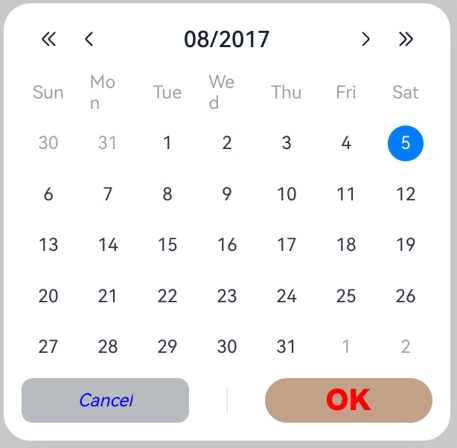

# Calendar Picker Dialog Box (CalendarPickerDialog)

A calendar picker dialog box is a dialog box that allows users to select a date from a calendar picker.

> **NOTE**
>
> This component is supported since API version 10. Updates will be marked with a superscript to indicate their earliest API version.
>
> The functionality of this module depends on UI context. This means that the APIs of this module cannot be used where the UI context is unclear. For details, see [UIContext](../js-apis-arkui-UIContext.md#uicontext).

## CalendarPickerDialog

### show

static show(options?: CalendarDialogOptions)

Shows a calendar picker dialog box.

**Atomic service API**: This API can be used in atomic services since API version 11.

**System capability**: SystemCapability.ArkUI.ArkUI.Full

**Parameters**

| Name | Type                                                   | Mandatory| Description                      |
| ------- | ------------------------------------------------------- | ---- | -------------------------- |
| options | [CalendarDialogOptions](#calendardialogoptions) | No  | Parameters of the calendar picker dialog box.|

## CalendarDialogOptions

Inherits from [CalendarOptions](ts-basic-components-calendarpicker.md#calendaroptions).

**System capability**: SystemCapability.ArkUI.ArkUI.Full

| Name      | Type                                           | Mandatory| Description                                                       |
| ---------- | ----------------------------------------------- | ---- | ------------------------------------------------------------ |
| onAccept   | [Callback](ts-types.md#callback12)\<Date> | No  | Triggered when the OK button in the dialog box is clicked.<br>The selected date value is returned.<br>**Atomic service API**: This API can be used in atomic services since API version 11.|
| onCancel   | [VoidCallback](ts-types.md#voidcallback12) | No  | Triggered when the Cancel button in the dialog box is clicked.<br>**Atomic service API**: This API can be used in atomic services since API version 11.                        |
| onChange   | [Callback](ts-types.md#callback12)\<Date> | No  | Triggered when the selection in the picker changes the selected date.<br>The selected date value is returned.<br>**Atomic service API**: This API can be used in atomic services since API version 11.|
| backgroundColor<sup>11+</sup> | [ResourceColor](ts-types.md#resourcecolor)  | No| Backplane color of the dialog box.<br>Default value: **Color.Transparent**<br>**NOTE**<br>When **backgroundColor** is set to a non-transparent color, **backgroundBlurStyle** must be set to **BlurStyle.NONE**; otherwise, the color display may not meet the expected effect.<br>**Atomic service API**: This API can be used in atomic services since API version 12.|
| backgroundBlurStyle<sup>11+</sup> | [BlurStyle](ts-universal-attributes-background.md#blurstyle9) | No| Background blur style of the dialog box.<br>Default value: **BlurStyle.COMPONENT_ULTRA_THICK**<br>**NOTE**<br>Setting this parameter to **BlurStyle.NONE** disables the background blur. When **backgroundBlurStyle** is set to a value other than **NONE**, do not set **backgroundColor**. If you do, the color display may not produce the expected visual effect.<br>**Atomic service API**: This API can be used in atomic services since API version 12.|
| backgroundBlurStyleOptions<sup>18+</sup> | [BackgroundBlurStyleOptions](ts-universal-attributes-background.md#backgroundblurstyleoptions10) | No| Options for customizing the background blur style.<br>**Atomic service API**: This API can be used in atomic services since API version 18.|
| backgroundEffect<sup>18+</sup> | [BackgroundEffectOptions](ts-universal-attributes-background.md#backgroundeffectoptions11) | No| Options for customizing the background effect.<br>**Atomic service API**: This API can be used in atomic services since API version 18.|
| acceptButtonStyle<sup>12+</sup> | [PickerDialogButtonStyle](ts-methods-datepicker-dialog.md#pickerdialogbuttonstyle12) | No| Style of the accept button.<br>**NOTE**<br>In the **acceptButtonStyle** and **cancelButtonStyle** configurations, only one **primary** field can be set to **true** at most. If both the **primary** fields are set to **true**, neither will take effect.<br>**Atomic service API**: This API can be used in atomic services since API version 12.|
| cancelButtonStyle<sup>12+</sup> | [PickerDialogButtonStyle](ts-methods-datepicker-dialog.md#pickerdialogbuttonstyle12) | No| Style of the cancel button.<br>**NOTE**<br>In the **acceptButtonStyle** and **cancelButtonStyle** configurations, only one **primary** field can be set to **true** at most. If both the **primary** fields are set to **true**, neither will take effect.<br>**Atomic service API**: This API can be used in atomic services since API version 12.|
| onDidAppear<sup>12+</sup> | [VoidCallback](ts-types.md#voidcallback12) | No| Event callback when the dialog box appears.<br>**NOTE**<br>1. The normal timing sequence is as follows: onWillAppear > onDidAppear > (onAccept/onCancel/onChange) > onWillDisappear > onDidDisappear.<br>2. You can set the callback event for changing the dialog box display effect in **onDidAppear**. The settings take effect next time the dialog box appears.<br>3. If the user dismisses the dialog box immediately after it appears, **onWillDisappear** is invoked before **onDidAppear**.<br>4. If the dialog box is dismissed before its entrance animation is finished, this callback is not invoked.<br>**Atomic service API**: This API can be used in atomic services since API version 12.|
| onDidDisappear<sup>12+</sup> | [VoidCallback](ts-types.md#voidcallback12) | No| Event callback when the dialog box disappears.<br>**NOTE**<br>1. The normal timing sequence is as follows: onWillAppear > onDidAppear > (onAccept/onCancel/onChange) > onWillDisappear > onDidDisappear.<br>**Atomic service API**: This API can be used in atomic services since API version 12.|
| onWillAppear<sup>12+</sup> | [VoidCallback](ts-types.md#voidcallback12) | No| Event callback when the dialog box is about to appear.<br>**NOTE**<br>1. The normal timing sequence is as follows: onWillAppear > onDidAppear > (onAccept/onCancel/onChange) > onWillDisappear > onDidDisappear.<br>2. You can set the callback event for changing the dialog box display effect in **onWillAppear**. The settings take effect next time the dialog box appears.<br>**Atomic service API**: This API can be used in atomic services since API version 12.|
| onWillDisappear<sup>12+</sup> | [VoidCallback](ts-types.md#voidcallback12) | No| Event callback when the dialog box is about to disappear.<br>**NOTE**<br>1. The normal timing sequence is as follows: onWillAppear > onDidAppear > (onAccept/onCancel/onChange) > onWillDisappear > onDidDisappear.<br>2. If the user closes the dialog box immediately after it appears, **onWillDisappear** is invoked before **onDidAppear**.<br>**Atomic service API**: This API can be used in atomic services since API version 12.|
| shadow<sup>12+</sup>              | [ShadowOptions](ts-universal-attributes-image-effect.md#shadowoptions) \| [ShadowStyle](ts-universal-attributes-image-effect.md#shadowstyle10) | No  | Shadow of the dialog box.<br> Default value on 2-in-1 devices: **ShadowStyle.OUTER_FLOATING_MD** when the dialog box is focused and **ShadowStyle.OUTER_FLOATING_SM** otherwise<br>**Atomic service API**: This API can be used in atomic services since API version 12.|
| enableHoverMode<sup>14+</sup>     | boolean | No  | Whether to enable the hover mode.<br>Default value: **false**, meaning not to enable the hover mode.<br>**Atomic service API**: This API can be used in atomic services since API version 14.|
| hoverModeArea<sup>14+</sup>       | [HoverModeAreaType](ts-appendix-enums.md#hovermodeareatype14) | No  | Display area of the dialog box in hover mode.<br>Default value: **HoverModeAreaType.BOTTOM_SCREEN**<br>**Atomic service API**: This API can be used in atomic services since API version 14.|
| markToday<sup>16+</sup>       | boolean | No  | Whether to highlight the current system date.<br>Default value: **false** The value **true** means to highlight the current system date, and **false** means the opposite.<br>**Atomic service API**: This API can be used in atomic services since API version 16.|

> **NOTE**
>
> When the application window is resized, the width of the dialog box is continuously compressed. If the window width is reduced below a certain threshold, the content of the dialog box may not be fully visible. To ensure that the content of the **CalendarPickerDialog** component is fully displayed, the minimum window width required is 386 vp.

## Example

### Example 1: Setting the Background

This example demonstrates how to set the dialog box background using **backgroundColor**, **backgroundBlurStyle**, and **shadow**.

```ts
// xxx.ets
@Entry
@Component
struct CalendarPickerDialogExample {
  private selectedDate: Date = new Date('2024-04-23')

  build() {
    Column() {
      Button("Show CalendarPicker Dialog")
        .margin(20)
        .onClick(() => {
          console.info("CalendarDialog.show")
          CalendarPickerDialog.show({
            selected: this.selectedDate,
            backgroundColor: Color.White,
            backgroundBlurStyle: BlurStyle.NONE,
            shadow: ShadowStyle.OUTER_FLOATING_SM,
            onAccept: (value) => {
              this.selectedDate = value
              console.info("calendar onAccept:" + JSON.stringify(value))
            },
            onCancel: () => {
              console.info("calendar onCancel")
            },
            onChange: (value) => {
              console.info("calendar onChange:" + JSON.stringify(value))
            },
            onDidAppear: () => {
              console.info("calendar onDidAppear")
            },
            onDidDisappear: () => {
              console.info("calendar onDidDisappear")
            },
            onWillAppear: () => {
              console.info("calendar onWillAppear")
            },
            onWillDisappear: () => {
              console.info("calendar onWillDisappear")
            }
          })
        })
    }.width('100%')
  }
}
```


### Example 2: Customizing the Button Style

This example demonstrates how to customize the button style using **acceptButtonStyle** and **cancelButtonStyle**.

```ts
// xxx.ets
@Entry
@Component
struct CalendarPickerDialogExample {
  private selectedDate: Date = new Date()

  build() {
    Column() {
      Button("Show CalendarPicker Dialog")
        .margin(20)
        .onClick(() => {
          console.info("CalendarDialog.show")
          CalendarPickerDialog.show({
            selected: this.selectedDate,
            acceptButtonStyle: {
              type: ButtonType.Normal,
              style: ButtonStyleMode.NORMAL,
              role: ButtonRole.NORMAL,
              fontColor: 'rgb(81, 81, 216)',
              fontSize: '26fp',
              fontWeight: FontWeight.Bolder,
              fontStyle: FontStyle.Normal,
              fontFamily: 'sans-serif',
              backgroundColor: '#A6ACAF',
              borderRadius: 20
            },
            cancelButtonStyle: {
              type: ButtonType.Normal,
              style: ButtonStyleMode.NORMAL,
              role: ButtonRole.NORMAL,
              fontColor: Color.Blue,
              fontSize: '16fp',
              fontWeight: FontWeight.Normal,
              fontStyle: FontStyle.Italic,
              fontFamily: 'sans-serif',
              backgroundColor: '#50182431',
              borderRadius: 10
            },
            onAccept: (value) => {
              this.selectedDate = value
              console.info("calendar onAccept:" + JSON.stringify(value))
            }
          })
        })
    }.width('100%')
  }
}
```



### Example 3: Configuring a Dialog Box in the Hover State

This example demonstrates how to set the layout area of a dialog box in hover mode on a foldable device.

```ts
@Entry
@Component
struct CalendarPickerDialogExample {
  private selectedDate: Date = new Date('2024-04-23');

  build() {
    Column() {
      Button("Show CalendarPicker Dialog")
        .margin(20)
        .onClick(() => {
          console.info("CalendarDialog.show")
          CalendarPickerDialog.show({
            selected: this.selectedDate,
            onAccept: (value) => {
              console.info("calendar onAccept:" + JSON.stringify(value))
            },
            onCancel: () => {
              console.info("calendar onCancel")
            },
            onChange: (value) => {
              console.info("calendar onChange:" + JSON.stringify(value))
            },
            onDidAppear: () => {
              console.info("calendar onDidAppear")
            },
            onDidDisappear: () => {
              console.info("calendar onDidDisappear")
            },
            onWillAppear: () => {
              console.info("calendar onWillAppear")
            },
            onWillDisappear: () => {
              console.info("calendar onWillDisappear")
            },
            enableHoverMode: true,
            hoverModeArea: HoverModeAreaType.TOP_SCREEN,
          })
        })
    }.width('100%')
  }
}
```


### Example 4: Setting the Background Style for the Selected Date

This example demonstrates how to customize the background style of the selected date using **hintRadius**.

```ts
// xxx.ets
@Entry
@Component
struct CalendarPickerDialogExample {
  private selectedDate: Date = new Date('2024-04-23')

  build() {
    Column() {
      Button("Show CalendarPicker Dialog")
        .margin(20)
        .onClick(() => {
          console.info("CalendarDialog.show")
          CalendarPickerDialog.show({
            selected: this.selectedDate,
            hintRadius: 1,
            onAccept: (value) => {
              this.selectedDate = value
              console.info("calendar onAccept:" + JSON.stringify(value))
            }
          })
        })
    }.width('100%')
  }
}
```


### Example 5: Setting Start and End Dates

This example demonstrates how to set the start and end dates for the calendar picker dialog box using **start** and **end**.

```ts
// xxx.ets
@Entry
@Component
struct CalendarPickerDialogExample {
  private selectedDate: Date = new Date('2025-01-01')
  private startDate: Date = new Date('2024-01-10')
  private endDate: Date = new Date('2025-1-10')

  build() {
    Column() {
      Text('Calendar date picker').fontSize(30)
      Button("Show CalendarPicker Dialog")
        .margin(20)
        .onClick(() => {
          console.info("CalendarDialog.show")
          CalendarPickerDialog.show({
            start: this.startDate,
            end: this.endDate,
            selected: this.selectedDate,
          })
        })
    }.width('100%').margin({ top: 350 })
  }
}  
```


### Example 6: Highlighting the Current System Date and Disabling a Specific Date Range

This example shows how to highlight the current system date using **markToday** and disable a specific date range using **disabledDateRange**.

```ts
// xxx.ets
@Entry
@Component
struct CalendarPickerExample {
  private disabledDateRange: DateRange[] = [
    { start: new Date('2025-01-01'), end: new Date('2025-01-02') },
    { start: new Date('2025-01-09'), end: new Date('2025-01-10') },
    { start: new Date('2025-01-15'), end: new Date('2025-01-16') },
    { start: new Date('2025-01-19'), end: new Date('2025-01-19') },
    { start: new Date('2025-01-22'), end: new Date('2025-01-25') }
  ]

  build() {
    Column() {
      Button("Show CalendarPicker Dialog")
        .margin(20)
        .onClick(() => {
          console.info("CalendarDialog.show")
          CalendarPickerDialog.show({ markToday: true, disabledDateRange: this.disabledDateRange })
        })
    }.width('100%').margin({ top: 350 })
  }
}
```


