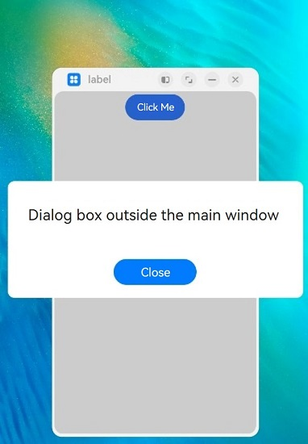
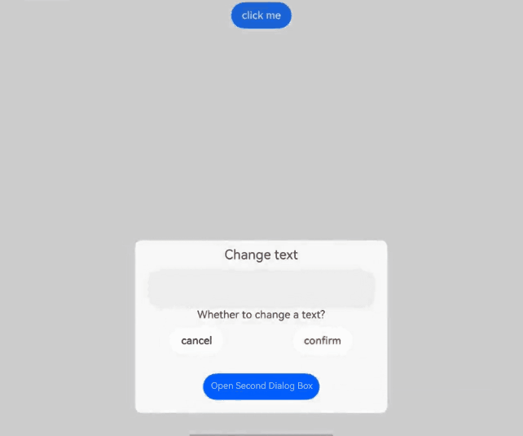

# Custom Dialog Box (CustomDialog)

A custom dialog box is a dialog box you customize by using APIs of the **CustomDialogController** class. You can set the style and content to your preference for a custom dialog box.

> **NOTE**
>
> The APIs of this module are supported since API version 7. Updates will be marked with a superscript to indicate their earliest API version.


## APIs

constructor(value: CustomDialogControllerOptions)

Defines a custom dialog box.

> **NOTE**
>
> No parameters of the custom dialog box can be dynamically updated.

**Atomic service API**: This API can be used in atomic services since API version 11.

**System capability**: SystemCapability.ArkUI.ArkUI.Full

**Parameters**

| Name| Type                                                        | Mandatory| Description                  |
| ------ | ------------------------------------------------------------ | ---- | ---------------------- |
| value  | [CustomDialogControllerOptions](#customdialogcontrolleroptions) | Yes  | Parameters of the custom dialog box.|

## CustomDialogControllerOptions

**System capability**: SystemCapability.ArkUI.ArkUI.Full

| Name                          | Type                                    | Mandatory  | Description                                    |
| ----------------------------- | ---------------------------------------- | ---- | ---------------------------------------- |
| builder                       | [CustomDialog](../../../ui/arkts-common-components-custom-dialog.md) | Yes   | Builder of the custom dialog box content.<br>**NOTE**<br>If the builder uses a callback as the input parameter, as in **build: custombuilder({ callback: ()=> {...}})**, pay attention to the binding of **this**.<br>To listen for data changes in the builder, use the @Link decorator; other decorators, such as @Prop and @ObjectLink, do not apply.<br>**Atomic service API**: This API can be used in atomic services since API version 11.|
| cancel                        | () =&gt; void                  | No   | Callback invoked when the dialog box is closed after the Back button or mask is touched or the Esc key is pressed.<br>**Atomic service API**: This API can be used in atomic services since API version 11.|
| autoCancel                    | boolean                                  | No   | Whether to close the dialog box when the mask is touched. The value **true** means to close the dialog box when the mask is touched, and **false** means the opposite.<br>Default value: **true**<br>**Atomic service API**: This API can be used in atomic services since API version 11.|
| alignment                     | [DialogAlignment](ts-methods-alert-dialog-box.md#dialogalignment) | No   | Alignment mode of the dialog box in the vertical direction.<br>Default value: **DialogAlignment.Default**<br>**Atomic service API**: This API can be used in atomic services since API version 11.|
| offset                        | [Offset](ts-types.md#offset)             | No   | Offset of the dialog box relative to the alignment position.<br>Default value: **{dx: 0, dy: 0}**<br>**Atomic service API**: This API can be used in atomic services since API version 11.|
| customStyle                   | boolean                                  | No   | Whether to use a custom style for the dialog box.<br>When this parameter is set to **false** (default value):<br>1. The rounded corner radius is 32 vp.<br>2. If the width and height of the dialog box are not set, the dialog box automatically adapts its width to the grid system and its height to the child components.<br>3. The set width of the dialog box cannot exceed the maximum width in the default style (100% width for a custom node), and the set height cannot exceed the maximum height (100% height for a custom node).<br>When this parameter is set to **true**:<br>1. The corner radius is 0, and the background color is transparent.<br>2. The width, height, border width, border style, border color, and shadow width cannot be set for the dialog box.<br>**Atomic service API**: This API can be used in atomic services since API version 11.|
| gridCount<sup>8+</sup>        | number                                   | No   | Number of [grid columns](../../../ui/arkts-layout-development-grid-layout.md) occupied by the dialog box.<br>The default value is subject to the window size, and the maximum value is the maximum number of columns supported by the system. If this parameter is set to an invalid value, the default value is used.<br>Value range: an integer no less than 0<br>**Atomic service API**: This API can be used in atomic services since API version 11.|
| maskColor<sup>10+</sup>       | [ResourceColor](ts-types.md#resourcecolor) | No   | Custom mask color.<br>Default value: **0x33000000**<br>**Atomic service API**: This API can be used in atomic services since API version 11.             |
| maskRect<sup>10+</sup>        | [Rectangle](ts-methods-alert-dialog-box.md#rectangle8) | No    | Mask area of the dialog box. Events outside the mask area are transparently transmitted, and events within the mask area are not.<br>Default value: **{ x: 0, y: 0, width: '100%', height: '100%' }**<br>**NOTE**<br>**maskRect** does not take effect when **showInSubWindow** is set to **true**.<br>**Atomic service API**: This API can be used in atomic services since API version 11.|
| openAnimation<sup>10+</sup>   | [AnimateParam](ts-explicit-animation.md#animateparam) | No   | Parameters for defining the open animation of the dialog box.<br>**NOTE**<br>**tempo**: The default value is **1**; a value less than or equal to 0 is handled as the default value.<br>**iterations**: The default value is **1**, indicating that the animation is played once; any other value is handled as the default value.<br>**playMode**: The default value is **PlayMode.Normal**; any other value is handled as the default value.<br>**Atomic service API**: This API can be used in atomic services since API version 11.|
| closeAnimation<sup>10+</sup>  | [AnimateParam](ts-explicit-animation.md#animateparam) | No   | Parameters for defining the close animation of the dialog box.<br>**NOTE**<br>**tempo**: The default value is **1**; a value less than or equal to 0 is handled as the default value.<br>**iterations**: The default value is **1**, indicating that the animation is played once; any other value is handled as the default value.<br>**playMode**: The default value is **PlayMode.Normal**; any other value is handled as the default value.<br>For page transition, you are advised to use the default close animation.<br>**Atomic service API**: This API can be used in atomic services since API version 11.|
| showInSubWindow<sup>10+</sup> | boolean                                  | No   | Whether to show the dialog box in a subwindow when the dialog box needs to be displayed outside the main window.<br>Default value: **false**<br>**NOTE**<br>A dialog box whose **showInSubWindow** attribute is **true** cannot trigger the display of another dialog box whose **showInSubWindow** attribute is also **true**. Avoid using the **CalendarPicker**, **CalendarPickerDialog**, **DatePickerDialog**, **TextPickerDialog**, and **TimePickerDialog** components in the dialog box where **showInSubWindow** is set to **true**, as the dialog box may affect the behavior of these components.<br>**Atomic service API**: This API can be used in atomic services since API version 11.|
| backgroundColor<sup>10+</sup> | [ResourceColor](ts-types.md#resourcecolor)      | No  | Background color of the dialog box.<br>Default value: **Color.Transparent**<br>**NOTE**<br>If the content builder also has the background color set, the background color set here will be overridden by the background color of the content builder.<br>When **backgroundColor** is set to a non-transparent color, **backgroundBlurStyle** must be set to **BlurStyle.NONE**; otherwise, the color display may not meet the expected effect.<br>**Atomic service API**: This API can be used in atomic services since API version 11.|
| cornerRadius<sup>10+</sup>    | [Dimension](ts-types.md#dimension10) \| [BorderRadiuses](ts-types.md#borderradiuses9) | No  | Radius of the rounded corners of the background.<br>You can set separate radiuses for the four rounded corners.<br>Default value: **{ topLeft: '32vp', topRight: '32vp', bottomLeft: '32vp', bottomRight: '32vp' }**<br>**NOTE**<br>This attribute must be used together with the [borderRadius](ts-universal-attributes-border.md#borderradius) attribute.<br>**Atomic service API**: This API can be used in atomic services since API version 11.|
| isModal<sup>11+</sup> | boolean | No| Whether the dialog box is a modal. A modal dialog box has a mask applied, while a non-modal dialog box does not.<br>Default value: **true**<br>**Atomic service API**: This API can be used in atomic services since API version 12.|
| onWillDismiss<sup>12+</sup> | Callback<[DismissDialogAction](#dismissdialogaction12)> | No| Callback for interactive closure of the dialog box.<br>**NOTE**<br>1. If this callback is registered, the dialog box will not be closed immediately after the user touches the mask or the Back button, presses the Esc key, or swipes left or right on the screen. The **reason** parameter in the callback is used to determine whether the dialog box can be closed. The reason returned by the component does not support the value **CLOSE_BUTTON**.<br>2. In the **onWillDismiss** callback, another **onWillDismiss** callback is not allowed.<br>**Atomic service API**: This API can be used in atomic services since API version 12.|
| borderWidth<sup>12+</sup> | [Dimension](ts-types.md#dimension10) \| [EdgeWidths](ts-types.md#edgewidths9)  | No| Border width of the dialog box.<br>You can set the width for all four sides or set separate widths for individual sides.<br>Default value: **0**<br> When set to a percentage, the value defines the border width as a percentage of the parent dialog box's width.<br>If the left and right borders are greater than its width, or the top and bottom borders are greater than its height, the dialog box may not display as expected.<br>**Atomic service API**: This API can be used in atomic services since API version 12.|
| borderColor<sup>12+</sup> | [ResourceColor](ts-types.md#resourcecolor) \| [EdgeColors](ts-types.md#edgecolors9)  | No| Border color of the dialog box.<br>Default value: **Color.Black**<br>**borderColor** must be used with **borderWidth** in pairs.<br>**Atomic service API**: This API can be used in atomic services since API version 12.|
| borderStyle<sup>12+</sup> | [BorderStyle](ts-appendix-enums.md#borderstyle) \| [EdgeStyles](ts-types.md#edgestyles9)  | No| Border style of the dialog box.<br>Default value: **BorderStyle.Solid**<br>**borderStyle** must be used with **borderWidth** in pairs.<br>**Atomic service API**: This API can be used in atomic services since API version 12.|
| width<sup>12+</sup> | [Dimension](ts-types.md#dimension10) | No  | Width of the dialog box.<br>**NOTE**<br>- Default maximum width of the dialog box: 400 vp<br>- When this parameter is set to a percentage, the reference width of the dialog box is the width of the window where the dialog box is located. You can decrease or increase the width as needed.<br>**Atomic service API**: This API can be used in atomic services since API version 12.|
| height<sup>12+</sup> | [Dimension](ts-types.md#dimension10)   | No| Height of the dialog box.<br>**NOTE**<br>- Default maximum height of the dialog box: 0.9 x (Window height – Safe area)<br>- When this parameter is set to a percentage, the reference height of the dialog box is the height of the window where the dialog box is located minus the safe area. You can decrease or increase the height as needed.<br>**Atomic service API**: This API can be used in atomic services since API version 12.|
| shadow<sup>12+</sup> | [ShadowOptions](ts-universal-attributes-image-effect.md#shadowoptions) \| [ShadowStyle](ts-universal-attributes-image-effect.md#shadowstyle10)   | No| Shadow of the dialog box.<br> Default value on 2-in-1 devices: **ShadowStyle.OUTER_FLOATING_MD** when the dialog box is focused and **ShadowStyle.OUTER_FLOATING_SM** otherwise<br>**Atomic service API**: This API can be used in atomic services since API version 12.|
| backgroundBlurStyle<sup>12+</sup> | [BlurStyle](ts-universal-attributes-background.md#blurstyle9)                 | No  | Background blur style of the dialog box.<br>Default value: **BlurStyle.COMPONENT_ULTRA_THICK**<br>**NOTE**<br>Setting this parameter to **BlurStyle.NONE** disables the background blur. When **backgroundBlurStyle** is set to a value other than **NONE**, do not set **backgroundColor**. If you do, the color display may not produce the expected visual effect.<br>**Atomic service API**: This API can be used in atomic services since API version 12.|
| backgroundBlurStyleOptions<sup>18+</sup> | [BackgroundBlurStyleOptions](ts-universal-attributes-background.md#backgroundblurstyleoptions10)| No| Options for customizing the background blur style.<br>**Atomic service API**: This API can be used in atomic services since API version 18.|
| backgroundEffect<sup>18+</sup> | [BackgroundEffectOptions](ts-universal-attributes-background.md#backgroundeffectoptions11) | No| Options for customizing the background effect.<br>**Atomic service API**: This API can be used in atomic services since API version 18.|
| keyboardAvoidMode<sup>12+</sup> | [KeyboardAvoidMode](ts-types.md#keyboardavoidmode12) | No| How the dialog box avoids the soft keyboard when it is brought up.<br>Default value: **KeyboardAvoidMode.DEFAULT**<br>**Atomic service API**: This API can be used in atomic services since API version 12.|
| enableHoverMode<sup>14+</sup>     | boolean | No  | Whether to enable the hover state.<br>Default value: **false**, meaning not to enable the hover state.<br>**Atomic service API**: This API can be used in atomic services since API version 14.|
| hoverModeArea<sup>14+</sup>       | [HoverModeAreaType](ts-appendix-enums.md#hovermodeareatype14) | No  | Display area of the dialog box in the hover state.<br>Default value: **HoverModeAreaType.BOTTOM_SCREEN**<br>**Atomic service API**: This API can be used in atomic services since API version 14.|
| onWillAppear<sup>18+</sup> | Callback&lt;void&gt; | No| Event callback when the dialog box is about to appear.<br>**NOTE**<br>1. The normal timing sequence is as follows: onWillAppear > onDidAppear > onWillDisappear > onDidDisappear.<br>2. You can set the callback event for changing the dialog box display effect in **onWillAppear**. The settings take effect next time the dialog box appears.<br>**Atomic service API**: This API can be used in atomic services since API version 18.|
| onDidAppear<sup>18+</sup> | Callback&lt;void&gt; | No| Event callback when the dialog box appears.<br>**NOTE**<br>1. The normal timing sequence is as follows: onWillAppear > onDidAppear > onWillDisappear > onDidDisappear.<br>2. You can set the callback event for changing the dialog box display effect in **onDidAppear**. The settings take effect next time the dialog box appears.<br>3. If the dialog is dismissed before its entrance animation is finished, the animation will be interrupted, and **onDidAppear** will not be triggered.<br>**Atomic service API**: This API can be used in atomic services since API version 18.|
| onWillDisappear<sup>18+</sup> | Callback&lt;void&gt; | No| Event callback when the dialog box is about to disappear.<br>**NOTE**<br>1. The normal timing sequence is as follows: onWillAppear > onDidAppear > onWillDisappear > onDidDisappear.<br> **Atomic service API**: This API can be used in atomic services since API version 18.|
| onDidDisappear<sup>18+</sup> | Callback&lt;void&gt; | No| Event callback when the dialog box disappears.<br>**NOTE**<br>1. The normal timing sequence is as follows: onWillAppear > onDidAppear > onWillDisappear > onDidDisappear.<br>**Atomic service API**: This API can be used in atomic services since API version 18.|
| keyboardAvoidDistance<sup>15+</sup>       | [LengthMetrics](../js-apis-arkui-graphics.md#lengthmetrics12) | No  | Distance between the dialog box and the keyboard after keyboard avoidance is applied.<br>**NOTE**<br>- Default value: **16vp**<br>- Default unit: vp<br>- This parameter takes effect only when **keyboardAvoidMode** is set to **DEFAULT**.<br>**Atomic service API**: This API can be used in atomic services since API version 15.|
| levelMode<sup>15+</sup>       | [LevelMode](../js-apis-promptAction.md#levelmode15) | No  | Display level of the dialog box.<br>**NOTE**<br>- Default value: **LevelMode.OVERLAY.**<br>- This parameter takes effect only when **showInSubWindow** is set to **false**.<br>**Atomic service API**: This API can be used in atomic services since API version 15.|
| levelUniqueId<sup>15+</sup>       | number | No  | [Unique ID](../js-apis-arkui-frameNode.md#getuniqueid12) of the node under the display level for the page-level dialog box.<br>**NOTE**<br>- This parameter takes effect only when **levelMode** is set to **LevelMode.EMBEDDED**.<br>**Atomic service API**: This API can be used in atomic services since API version 15.|
| immersiveMode<sup>15+</sup>       | [ImmersiveMode](../js-apis-promptAction.md#immersivemode15) | No  | Mask effect for the page-level dialog box.<br>**NOTE**<br>- Default value: **ImmersiveMode.DEFAULT**<br>- This parameter takes effect only when **levelMode** is set to **LevelMode.EMBEDDED**.<br>**Atomic service API**: This API can be used in atomic services since API version 15.|
| levelOrder<sup>18+</sup>       | [LevelOrder](../js-apis-promptAction.md#levelorder18) | No  | Display order of the dialog box.<br>**NOTE**<br>- Default value: **LevelOrder.clamp(0)**<br>- Dynamic updating is not supported.<br>**Atomic service API**: This API can be used in atomic services since API version 18.|
| focusable<sup>18+</sup>       | boolean | No  | Whether the dialog box can gain focus.<br>Default value: **true**<br>**NOTE**<br>Only dialog boxes that are displayed on top of the current window can gain focus.<br>**Atomic service API**: This API can be used in atomic services since API version 18.|

> **NOTE**
>
> - Pressing the Back or ESC key closes the dialog box.
> - If the dialog box reaches its maximum allowable height on the screen when avoiding the soft keyboard, it reduces its height to fit.
>   It should be noted that this height adjustment is applied to the outermost container. If a child component within this container has been assigned a larger fixed height, since the container does not clip its content by default, parts of the dialog box may still be displayed off-screen.
> - Use the custom dialog box to contain simple alert messages only. Do not use it as a page. When the dialog box avoids the soft keyboard, there is a 16 vp safe spacing between the two.
>
> - Currently, dialog boxes in ArkUI do not close automatically when you switch pages unless you manually call **close**. To enable a dialog box to be covered during page navigation, consider using the **Navigation** component. For details, see the [page display mode: dialog mode](../../../ui/arkts-navigation-navigation.md#page-display-mode).

## DismissDialogAction<sup>12+</sup>

Provides information about the action to dismiss the dialog box.

**Atomic service API**: This API can be used in atomic services since API version 12.

**System capability**: SystemCapability.ArkUI.ArkUI.Full

### Properties

| Name   | Type                                                        | Readable| Writable| Description                                                        |
| ------- | ------------------------------------------------------------ | ---- | ---- | ------------------------------------------------------------ |
| dismiss | Callback&lt;void&gt;                                         | No  | No  | Callback for dismissing the dialog box. This API is called only when the dialog box needs to be exited.|
| reason  | [DismissReason](../js-apis-promptAction.md#dismissreason12) | No  | No  | Reason why the dialog box cannot be dismissed. You must specify whether to close the dialog box for each of the listed actions.|

## CustomDialogController

**Atomic service API**: This API can be used in atomic services since API version 11.

### Objects to Import

```ts
dialogController : CustomDialogController | null = new CustomDialogController(CustomDialogControllerOptions)
```
> **NOTE**
>
> **CustomDialogController** is effective only when it is a member variable of the **@CustomDialog** and **@Component** decorated struct and is defined in the **@Component** decorated struct. For details, see the following example.

### constructor

constructor(value: CustomDialogControllerOptions)

Constructor for a custom dialog box.

**Atomic service API**: This API can be used in atomic services since API version 11.

**System capability**: SystemCapability.ArkUI.ArkUI.Full

**Parameters**

| Name| Type                                                        | Mandatory| Description                  |
| ------ | ------------------------------------------------------------ | ---- | ---------------------- |
| value  | [CustomDialogControllerOptions](#customdialogcontrolleroptions) | Yes  | Parameters of the custom dialog box.|

### open

open()

Opens the content of the custom dialog box. This API can be called multiple times. If the dialog box is displayed in a subwindow, no new subwindow is allowed.

**Atomic service API**: This API can be used in atomic services since API version 11.

**System capability**: SystemCapability.ArkUI.ArkUI.Full


### close

close()

**Atomic service API**: This API can be used in atomic services since API version 11.

**System capability**: SystemCapability.ArkUI.ArkUI.Full


Closes the custom dialog box. If the dialog box is closed, this API does not take effect.

## Example

### Example 1: Opening Nested Dialog Boxes

This example demonstrates how to open one or more custom dialog boxes within another custom dialog box.

```ts
// xxx.ets
@CustomDialog
struct CustomDialogExampleTwo {
  controllerTwo?: CustomDialogController
  build() {
    Column() {
      Text('I'm the second dialog box')
        .fontSize(30)
        .height(100)
      Button('Close Second Dialog Box')
        .onClick(() => {
          if (this.controllerTwo != undefined) {
            this.controllerTwo.close()
          }
        })
        .margin(20)
    }
  }
}
@CustomDialog
@Component
struct CustomDialogExample {
  @Link textValue: string
  @Link inputValue: string
  dialogControllerTwo: CustomDialogController | null = new CustomDialogController({
    builder: CustomDialogExampleTwo(),
    alignment: DialogAlignment.Bottom,
    onWillDismiss:(dismissDialogAction: DismissDialogAction)=> {
      console.info("reason=" + JSON.stringify(dismissDialogAction.reason))
      console.log("dialog onWillDismiss")
      if (dismissDialogAction.reason == DismissReason.PRESS_BACK) {
        dismissDialogAction.dismiss()
      }
      if (dismissDialogAction.reason == DismissReason.TOUCH_OUTSIDE) {
        dismissDialogAction.dismiss()
      }
    },
    offset: { dx: 0, dy: -25 } })
  controller?: CustomDialogController
  // You can pass in multiple other controllers in the CustomDialog to open one or more other CustomDialogs in the CustomDialog. In this case, you must place the controller pointing to the self behind all controllers.
  cancel: () => void = () => {
  }
  confirm: () => void = () => {
  }

  build() {
    Column() {
      Text('Change text').fontSize(20).margin({ top: 10, bottom: 10 })
      TextInput({ placeholder: '', text: this.textValue }).height(60).width('90%')
        .onChange((value: string) => {
          this.textValue = value
        })
      Text('Are you sure you want to change the text?').fontSize(16).margin({ bottom: 10 })
      Flex({ justifyContent: FlexAlign.SpaceAround }) {
        Button('No')
          .onClick(() => {
            if (this.controller != undefined) {
              this.controller.close()
              this.cancel()
            }
          }).backgroundColor(0xffffff).fontColor(Color.Black)
        Button('OK')
          .onClick(() => {
            if (this.controller != undefined) {
              this.inputValue = this.textValue
              this.controller.close()
              this.confirm()
            }
          }).backgroundColor(0xffffff).fontColor(Color.Red)
      }.margin({ bottom: 10 })

      Button('Open Second Dialog Box')
        .onClick(() => {
          if (this.dialogControllerTwo != null) {
            this.dialogControllerTwo.open()
          }
        })
        .margin(20)
    }.borderRadius(10)
    // When using the border or cornerRadius attribute, use it together with the borderRadius attribute.
  }
}
@Entry
@Component
struct CustomDialogUser {
  @State textValue: string = ''
  @State inputValue: string = 'click me'
  dialogController: CustomDialogController | null = new CustomDialogController({
    builder: CustomDialogExample({
      cancel: ()=> { this.onCancel() },
      confirm: ()=> { this.onAccept() },
      textValue: $textValue,
      inputValue: $inputValue
    }),
    cancel: this.exitApp,
    autoCancel: true,
    onWillDismiss:(dismissDialogAction: DismissDialogAction)=> {
      console.info("reason=" + JSON.stringify(dismissDialogAction.reason))
      console.log("dialog onWillDismiss")
      if (dismissDialogAction.reason == DismissReason.PRESS_BACK) {
        dismissDialogAction.dismiss()
      }
      if (dismissDialogAction.reason == DismissReason.TOUCH_OUTSIDE) {
        dismissDialogAction.dismiss()
      }
    },
    alignment: DialogAlignment.Bottom,
    offset: { dx: 0, dy: -20 },
    gridCount: 4,
    customStyle: false,
    cornerRadius: 10,
  })

  // Set dialogController to null when the custom component is about to be destroyed.
  aboutToDisappear() {
    this.dialogController = null // Set dialogController to null.
  }

  onCancel() {
    console.info('Callback when the first button is clicked')
  }

  onAccept() {
    console.info('Callback when the second button is clicked')
  }

  exitApp() {
    console.info('Click the callback in the blank area')
  }
  build() {
    Column() {
      Button(this.inputValue)
        .onClick(() => {
          if (this.dialogController != null) {
            this.dialogController.open()
          }
        }).backgroundColor(0x317aff)
    }.width('100%').margin({ top: 5 })
  }
}
```


### Example 2: Opening a Dialog Box Outside the Main Window

This example demonstrates how to configure a dialog box to display outside the main window on a 2-in-1 device by setting **showInSubWindow** to **true**.

```ts
// xxx.ets
@CustomDialog
struct CustomDialogExample {
  controller?: CustomDialogController
  cancel: () => void = () => {
  }
  confirm: () => void = () => {
  }
  build() {
    Column() {
      Text('Dialog box outside the main window')
        .fontSize(30)
        .height(100)
      Button('Close')
        .onClick(() => {
          if (this.controller != undefined) {
            this.controller.close()
          }
        })
        .margin(20)
    }
  }
}
@Entry
@Component
struct CustomDialogUser {
  dialogController: CustomDialogController | null = new CustomDialogController({
    builder: CustomDialogExample({
      cancel: ()=> { this.onCancel() },
      confirm: ()=> { this.onAccept() }
    }),
    cancel: this.existApp,
    autoCancel: true,
    onWillDismiss:(dismissDialogAction: DismissDialogAction)=> {
      console.info("reason=" + JSON.stringify(dismissDialogAction.reason))
      console.log("dialog onWillDismiss")
      if (dismissDialogAction.reason == DismissReason.PRESS_BACK) {
        dismissDialogAction.dismiss()
      }
      if (dismissDialogAction.reason == DismissReason.TOUCH_OUTSIDE) {
        dismissDialogAction.dismiss()
      }
    },
    alignment: DialogAlignment.Center,
    offset: { dx: 0, dy: -20 },
    gridCount: 4,
    showInSubWindow: true,
    isModal: true,
    customStyle: false,
    cornerRadius: 10,
    focusable: true
  })
  // Set dialogController to null when the custom component is about to be destroyed.
  aboutToDisappear() {
    this.dialogController = null // Set dialogController to null.
  }

  onCancel() {
    console.info('Callback when the first button is clicked')
  }

  onAccept() {
    console.info('Callback when the second button is clicked')
  }

  existApp() {
    console.info('Click the callback in the blank area')
  }

  build() {
    Column() {
      Button('Click Me')
        .onClick(() => {
          if (this.dialogController != null) {
            this.dialogController.open()
          }
        }).backgroundColor(0x317aff)
    }.width('100%').margin({ top: 5 })
  }
}
```



### Example 3: Setting the Dialog Box Style
This example demonstrates how to set styles of a custom dialog box, including the width, height, background color, and shadow.
```ts
// xxx.ets
@CustomDialog
struct CustomDialogExample {
  controller?: CustomDialogController
  cancel: () => void = () => {
  }
  confirm: () => void = () => {
  }
  build() {
    Column() {
      Text('This is a custom dialog box')
        .fontSize(30)
        .height(100)
      Button('Close')
        .onClick(() => {
          if (this.controller != undefined) {
            this.controller.close()
          }
        })
        .margin(20)
    }
  }
}
@Entry
@Component
struct CustomDialogUser {
  dialogController: CustomDialogController | null = new CustomDialogController({
    builder: CustomDialogExample({
      cancel: ()=> { this.onCancel() },
      confirm: ()=> { this.onAccept() }
    }),
    cancel: this.existApp,
    autoCancel: true,
    onWillDismiss:(dismissDialogAction: DismissDialogAction)=> {
      console.info("reason=" + JSON.stringify(dismissDialogAction.reason))
      console.log("dialog onWillDismiss")
      if (dismissDialogAction.reason == DismissReason.PRESS_BACK) {
        dismissDialogAction.dismiss()
      }
      if (dismissDialogAction.reason == DismissReason.TOUCH_OUTSIDE) {
        dismissDialogAction.dismiss()
      }
    },
    alignment: DialogAlignment.Center,
    offset: { dx: 0, dy: -20 },
    customStyle: false,
    cornerRadius: 20,
    width: 300,
    height: 200,
    borderWidth: 1,
    borderStyle: BorderStyle.Dashed,// borderStyle must be used with borderWidth in pairs.
    borderColor: Color.Blue,// borderColor must be used with borderWidth in pairs.
    backgroundColor: Color.White,
    shadow: ({ radius: 20, color: Color.Grey, offsetX: 50, offsetY: 0}),
  })
  // Set dialogController to null when the custom component is about to be destroyed.
  aboutToDisappear() {
    this.dialogController = null // Set dialogController to null.
  }

  onCancel() {
    console.info('Callback when the first button is clicked')
  }

  onAccept() {
    console.info('Callback when the second button is clicked')
  }

  existApp() {
    console.info('Click the callback in the blank area')
  }

  build() {
    Column() {
      Button('Click Me')
        .onClick(() => {
          if (this.dialogController != null) {
            this.dialogController.open()
          }
        }).backgroundColor(0x317aff)
    }.width('100%').margin({ top: 5 })
  }
}
```


### Example 4: Configuring a Dialog Box in the Hover State

This example demonstrates how to set the layout area of a dialog box in the hover state on a foldable device.

```ts
@CustomDialog
@Component
struct CustomDialogExample {
  @Link textValue: string;
  @Link inputValue: string;
  controller?: CustomDialogController;

  build() {
    Column() {
      Text('Change text').fontSize(20).margin({ top: 10, bottom: 10 })
      TextInput({ placeholder: '', text: this.textValue }).height(60).width('90%')
        .onChange((value: string) => {
          this.textValue = value;
        })
      Text('Are you sure you want to change the text?').fontSize(16).margin({ bottom: 10 })
      Flex({ justifyContent: FlexAlign.SpaceAround }) {
        Button('No')
          .onClick(() => {
            if (this.controller != undefined) {
              this.controller.close();
            }
          }).backgroundColor(0xffffff).fontColor(Color.Black)
        Button('OK')
          .onClick(() => {
            if (this.controller != undefined) {
              this.inputValue = this.textValue;
              this.controller.close();
            }
          }).backgroundColor(0xffffff).fontColor(Color.Red)
      }.margin({ bottom: 10 })

      Button('Open Second Dialog Box')
        .margin(20)
    }.borderRadius(10)
    // When using the border or cornerRadius attribute, use it together with the borderRadius attribute.
  }
}
@Entry
@Component
struct CustomDialogUser {
  @State textValue: string = '';
  @State inputValue: string = 'click me';
  dialogController: CustomDialogController | null = new CustomDialogController({
    builder: CustomDialogExample({
      textValue: $textValue,
      inputValue: $inputValue
    }),
    cancel: this.exitApp,
    autoCancel: true,
    onWillDismiss: (dismissDialogAction: DismissDialogAction)=> {
      console.info("reason=" + JSON.stringify(dismissDialogAction.reason));
      console.log("dialog onWillDismiss");
      if (dismissDialogAction.reason == DismissReason.PRESS_BACK) {
        dismissDialogAction.dismiss();
      }
      if (dismissDialogAction.reason == DismissReason.TOUCH_OUTSIDE) {
        dismissDialogAction.dismiss();
      }
    },
    alignment: DialogAlignment.Bottom,
    offset: { dx: 0, dy: -20 },
    gridCount: 4,
    customStyle: false,
    cornerRadius: 10,
    enableHoverMode: true,
    hoverModeArea: HoverModeAreaType.TOP_SCREEN
  })

  // Set dialogController to null when the custom component is about to be destroyed.
  aboutToDisappear() {
    this.dialogController = null; // Set dialogController to null.
  }

  exitApp() {
    console.info('Click the callback in the blank area');
  }

  build() {
    Column() {
      Button(this.inputValue)
        .onClick(() => {
          if (this.dialogController != null) {
            this.dialogController.open();
          }
        }).backgroundColor(0x317aff)
    }.width('100%').margin({ top: 5 })
  }
}
```


