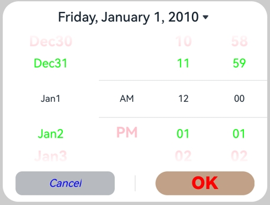

# Date Picker Dialog Box (DatePickerDialog)

A date picker dialog box is a dialog box that allows users to select a date from the given range.

>  **NOTE**
>
> The APIs of this module are supported since API version 8. Updates will be marked with a superscript to indicate their earliest API version.
>
> The functionality of this module depends on UI context. This means that the APIs of this module cannot be used where the UI context is unclear. For details, see [UIContext](../js-apis-arkui-UIContext.md#uicontext).
>
> Since API version 10, you can use the [showDatePickerDialog](../js-apis-arkui-UIContext.md#showdatepickerdialog) API in [UIContext](../js-apis-arkui-UIContext.md#uicontext), which ensures that the date picker dialog box is shown in the intended UI instance.

## DatePickerDialog

### show

static show(options?: DatePickerDialogOptions)

Shows a date picker dialog box.

**Atomic service API**: This API can be used in atomic services since API version 11.

**System capability**: SystemCapability.ArkUI.ArkUI.Full

**Parameters**

| Name | Type                                                       | Mandatory| Description                      |
| ------- | ----------------------------------------------------------- | ---- | -------------------------- |
| options | [DatePickerDialogOptions](#datepickerdialogoptions) | No  | Parameters of the date picker dialog box.|

## DatePickerDialogOptions

Inherited from [DatePickerOptions](ts-basic-components-datepicker.md#datepickeroptions).

**System capability**: SystemCapability.ArkUI.ArkUI.Full

| Name| Type| Mandatory| Description|
| -------- | -------- | -------- | -------- |
| lunar | boolean | No| Whether to display the lunar calendar. The value **true** means to display the lunar calendar, and **false** means the opposite.<br>Default value: **false**<br>**Atomic service API**: This API can be used in atomic services since API version 11.|
| showTime<sup>10+</sup> | boolean | No| Whether to display the time item. The value **true** means to display the time item, and **false** means the opposite.<br>Default value: **false**<br>**Atomic service API**: This API can be used in atomic services since API version 11.|
| useMilitaryTime<sup>10+</sup> | boolean | No| Whether to display time in 24-hour format. The value **true** means to display time in 24-hour format, and **false** means the opposite.<br>Default value: **false**<br>**NOTE**<br>When the display time is in 12-hour format, the AM/PM zone does not change depending on the hour portion.<br>**Atomic service API**: This API can be used in atomic services since API version 11.|
| lunarSwitch<sup>10+</sup> | boolean | No| Whether to display the lunar calendar switch. The value **true** means to display the lunar calendar switch, and **false** means the opposite.<br>Default value: **false**<br>**Atomic service API**: This API can be used in atomic services since API version 11.|
| disappearTextStyle<sup>10+</sup> | [PickerTextStyle](ts-basic-components-datepicker.md#pickertextstyle10) | No| Font color, font size, and font width for the top and bottom items.<br>Default value:<br>{<br>color: '#ff182431',<br>font: {<br>size: '14fp', <br>weight: FontWeight.Regular<br>}<br>}<br>**Atomic service API**: This API can be used in atomic services since API version 11.|
| textStyle<sup>10+</sup> | [PickerTextStyle](ts-basic-components-datepicker.md#pickertextstyle10) | No| Font color, font size, and font width of all items except the top, bottom, and selected items.<br>Default value:<br>{<br>color: '#ff182431',<br>font: {<br>size: '16fp', <br>weight: FontWeight.Regular<br>}<br>}<br>**Atomic service API**: This API can be used in atomic services since API version 11.|
| selectedTextStyle<sup>10+</sup> | [PickerTextStyle](ts-basic-components-datepicker.md#pickertextstyle10) | No| Font color, font size, and font width of the selected item.<br>Default value:<br>{<br>color: '#ff007dff',<br>font: {<br>size: '20vp', <br>weight: FontWeight.Medium<br>}<br>} <br>**Atomic service API**: This API can be used in atomic services since API version 11.|
| acceptButtonStyle<sup>12+</sup> | [PickerDialogButtonStyle](#pickerdialogbuttonstyle12) | No| Style of the accept button.<br>**NOTE**<br>In the **acceptButtonStyle** and **cancelButtonStyle** configurations, only one **primary** field can be set to **true** at most. If both the **primary** fields are set to **true**, neither will take effect.<br>**Atomic service API**: This API can be used in atomic services since API version 12.|
| cancelButtonStyle<sup>12+</sup> | [PickerDialogButtonStyle](#pickerdialogbuttonstyle12) | No| Style of the cancel button.<br>**NOTE**<br>In the **acceptButtonStyle** and **cancelButtonStyle** configurations, only one **primary** field can be set to **true** at most. If both the **primary** fields are set to **true**, neither will take effect.<br>**Atomic service API**: This API can be used in atomic services since API version 12.|
| alignment<sup>10+</sup>  | [DialogAlignment](ts-methods-alert-dialog-box.md#dialogalignment) | No  | Alignment mode of the dialog box in the vertical direction.<br>Default value: **DialogAlignment.Default**<br>**Atomic service API**: This API can be used in atomic services since API version 11.|
| offset<sup>10+</sup>     | [Offset](ts-types.md#offset) | No    | Offset of the dialog box based on the **alignment** settings.<br>Default value: **{ dx: 0 , dy: 0 }**<br>**Atomic service API**: This API can be used in atomic services since API version 11.|
| maskRect<sup>10+</sup>| [Rectangle](ts-methods-alert-dialog-box.md#rectangle8) | No    | Mask area of the dialog box. Events outside the mask area are transparently transmitted, and events within the mask area are not.<br>Default value: **{ x: 0, y: 0, width: '100%', height: '100%' }**<br>**Atomic service API**: This API can be used in atomic services since API version 11.|
| onAccept<sup>(deprecated)</sup> | (value: [DatePickerResult](ts-basic-components-datepicker.md#datepickerresult)) => void | No| Callback invoked when the OK button in the dialog box is clicked.<br>**NOTE**<br>This API is supported since API version 8 and deprecated since API version 10. You are advised to use **onDateAccept** instead.|
| onCancel | () => void | No| Callback invoked when the Cancel button in the dialog box is clicked.<br>**Atomic service API**: This API can be used in atomic services since API version 11.|
| onChange<sup>(deprecated)</sup> | (value: [DatePickerResult](ts-basic-components-datepicker.md#datepickerresult)) => void | No| Callback invoked when the selected item in the picker changes.<br>**NOTE**<br>This API is supported since API version 8 and deprecated since API version 10. You are advised to use **onDateChange** instead.|
| onDateAccept<sup>10+</sup> | (value:  Date) => void | No| Callback invoked when the OK button in the dialog box is clicked.<br>**NOTE**<br>When **showTime** is set to **true**, the hour and minute in the value returned by the callback are the hour and minute selected in the picker. Otherwise, the hour and minute are the hour and minute of the system time.<br>**Atomic service API**: This API can be used in atomic services since API version 11.|
| onDateChange<sup>10+</sup> | (value:  Date) => void | No| Callback invoked when the selected item in the picker changes.<br>**NOTE**<br>When **showTime** is set to **true**, the hour and minute in the value returned by the callback are the hour and minute selected in the picker. Otherwise, the hour and minute are the hour and minute of the system time.<br>**Atomic service API**: This API can be used in atomic services since API version 11.|
| backgroundColor<sup>11+</sup> | [ResourceColor](ts-types.md#resourcecolor)  | No| Backplane color of the dialog box.<br>Default value: **Color.Transparent**<br>**NOTE**<br>When **backgroundColor** is set to a non-transparent color, **backgroundBlurStyle** must be set to **BlurStyle.NONE**; otherwise, the color display may not meet the expected effect.<br>**Atomic service API**: This API can be used in atomic services since API version 12.|
| backgroundBlurStyle<sup>11+</sup> | [BlurStyle](ts-universal-attributes-background.md#blurstyle9) | No| Background blur style of the dialog box.<br>Default value: **BlurStyle.COMPONENT_ULTRA_THICK**<br>**NOTE**<br>Setting this parameter to **BlurStyle.NONE** disables the background blur. When **backgroundBlurStyle** is set to a value other than **NONE**, do not set **backgroundColor**. If you do, the color display may not produce the expected visual effect.<br>**Atomic service API**: This API can be used in atomic services since API version 12.|
| onDidAppear<sup>12+</sup> | () => void | No| Event callback when the dialog box appears.<br>**NOTE**<br>1. The normal timing sequence is as follows: onWillAppear > onDidAppear > (onDateAccept/onCancel/onDateChange) > onWillDisappear > onDidDisappear.<br>2. You can set the callback event for changing the dialog box display effect in **onDidAppear**. The settings take effect next time the dialog box appears.<br>3. If the user closes the dialog box immediately after it appears, **onWillDisappear** is invoked before **onDidAppear**.<br>4. If the dialog box is closed before its entrance animation is finished, this callback is not invoked.<br>**Atomic service API**: This API can be used in atomic services since API version 12.|
| onDidDisappear<sup>12+</sup> | () => void | No| Event callback when the dialog box disappears.<br>**NOTE**<br>1. The normal timing sequence is as follows: onWillAppear > onDidAppear > (onDateAccept/onCancel/onDateChange) > onWillDisappear > onDidDisappear.<br>**Atomic service API**: This API can be used in atomic services since API version 12.|
| onWillAppear<sup>12+</sup> | () => void | No| Event callback when the dialog box is about to appear.<br>**NOTE**<br>1. The normal timing sequence is as follows: onWillAppear > onDidAppear > (onDateAccept/onCancel/onDateChange) > onWillDisappear > onDidDisappear.<br>2. You can set the callback event for changing the dialog box display effect in **onWillAppear**. The settings take effect next time the dialog box appears.<br>**Atomic service API**: This API can be used in atomic services since API version 12.|
| onWillDisappear<sup>12+</sup> | () => void | No| Event callback when the dialog box is about to disappear.<br>**NOTE**<br>1. The normal timing sequence is as follows: onWillAppear > onDidAppear > (onDateAccept/onCancel/onDateChange) > onWillDisappear > onDidDisappear.<br>2. If the user closes the dialog box immediately after it appears, **onWillDisappear** is invoked before **onDidAppear**.<br>**Atomic service API**: This API can be used in atomic services since API version 12.|
| shadow<sup>12+</sup>              | [ShadowOptions](ts-universal-attributes-image-effect.md#shadowoptions) \| [ShadowStyle](ts-universal-attributes-image-effect.md#shadowstyle10) | No  | Shadow of the dialog box.<br> Default value on 2-in-1 devices: **ShadowStyle.OUTER_FLOATING_MD** when the dialog box is focused and **ShadowStyle.OUTER_FLOATING_SM** otherwise<br>**Atomic service API**: This API can be used in atomic services since API version 12.|
| dateTimeOptions<sup>12+</sup> | [DateTimeOptions](../../apis-localization-kit/js-apis-intl.md#datetimeoptions) | No| Whether to display a leading zero for the hours and minutes. Currently only the configuration of the **hour** and **minute** parameters is supported.<br>Default value:<br>**hour**: In the 24-hour format, it defaults to **2-digit**, which means a leading zero is used; In the 12-hour format, it defaults to **numeric**, which means no leading zero is used.<br>**minute**: defaults to **2-digit**, which means a leading zero is used.<br>**Atomic service API**: This API can be used in atomic services since API version 12.|

## PickerDialogButtonStyle<sup>12+</sup>

**Atomic service API**: This API can be used in atomic services since API version 12.

**System capability**: SystemCapability.ArkUI.ArkUI.Full

| Name  | Type                                    | Mandatory  | Description                     |
| ----- | ---------------------------------------- | ---- | ------------------------- |
| type | [ButtonType](ts-basic-components-button.md#buttontype) | No   | Button type.                    |
| style  | [ButtonStyleMode](ts-basic-components-button.md#buttonstylemode11)                 | No   | Style and importance of the button.|
| role | [ButtonRole](ts-basic-components-button.md#buttonrole12) | No   | Role of the button.                    |
| fontSize  | [Length](ts-types.md#length)                 | No   | Font size of the button.|
| fontColor | [ResourceColor](ts-types.md#resourcecolor) | No   | Font color of the button.                    |
| fontWeight  | [FontWeight](ts-appendix-enums.md#fontweight) \| number \| string| No   | Font weight of the button. For the number type, the value ranges from 100 to 900, at an interval of 100. A larger value indicates a thicker font.|
| fontStyle | [FontStyle](ts-appendix-enums.md#fontstyle) | No   | Font style of the button.                    |
| fontFamily  |  [Resource](ts-types.md#resource) \| string  | No   | Font family of the button. The 'HarmonyOS Sans' font and [registered custom fonts](../js-apis-font.md) are supported.|
| backgroundColor | [ResourceColor](ts-types.md#resourcecolor) | No   | Background color of the button.                    |
| borderRadius  | [Length](ts-types.md#length) \| [BorderRadiuses](ts-types.md#borderradiuses9)| No   | Rounded corner radius of the button.|
| primary  | boolean | No   | Whether the button responds to the **Enter** key by default when the dialog box has focus and the **Tab** key is not pressed for sequential focus navigation.|

**Handling in the case of exceptions**

| Exception  | Result |
| -------- |  ------------------------------------------------------------ |
| The start date is later than the end date, and the selected date is not set.   | The start date, end date, and selected date are set to the default values. |
| The start date is later than the end date, and the selected date is earlier than the default start date.   | The start date and end date are set to the default values, and the selected date is set to the default start date. |
| The start date is later than the end date, and the selected date is later than the default end date.   | The start date and end date are set to the default values, and the selected date is set to the default end date. |
| The start date is later than the end date, and the selected date is within the range of the default start date and end date.   | The start date and end date are set to the default values, and the selected date is set to the specified value.|
| The selected date is earlier than the start date.   | The selected date is set to the start date. |
| The selected date is later than the end date.   | The selected date is set to the end date. |
| The start date is later than the current system date, and the selected date is not set.   | The selected date is set to the start date. |
| The end date is earlier than the current system date, and the selected date is not set.   | The selected date is set to the end date. |
| The set date is in invalid format, for example, **'1999-13-32'**.  | The default value is used. |
| The start date or end date is earlier than the valid date range.   | The start date or end date is set to the earliest date in the valid date range. |
| The start date or end date is later than the valid date range.   | The start date or end date is set to the latest date in the valid date range. |

The valid date range is from 1900-1-31 to 2100-12-31.

The exception detection and handling with the selected date comes after that with the start date and end date.

## Example

>  **NOTE**
>
> For clarity in UI execution context, you are advised to use the [showDatePickerDialog](../js-apis-arkui-UIContext.md#showdatepickerdialog) API in [UIContext](../js-apis-arkui-UIContext.md#uicontext).

### Example 1

This example shows the basic usage of **DatePickerDialog**.

```ts
// xxx.ets
@Entry
@Component
struct DatePickerDialogExample {
  selectedDate: Date = new Date("2010-1-1")

  build() {
    Column() {
      Button("DatePickerDialog")
        .margin(20)
        .onClick(() => {
          DatePickerDialog.show({ // You are advised to use this.getUIContext().showDatePickerDialog().
            start: new Date("2000-1-1"),
            end: new Date("2100-12-31"),
            selected: this.selectedDate,
            showTime:true,
            useMilitaryTime:false,
            disappearTextStyle: {color: Color.Pink, font: {size: '22fp', weight: FontWeight.Bold}},
            textStyle: {color: '#ff00ff00', font: {size: '18fp', weight: FontWeight.Normal}},
            selectedTextStyle: {color: '#ff182431', font: {size: '14fp', weight: FontWeight.Regular}},
            onDateAccept: (value: Date) => {
              // Use the setFullYear method to set the date when the OK button is touched. In this way, when the date picker dialog box is displayed again, the selected date is the date last confirmed.
              this.selectedDate = value
              console.info("DatePickerDialog:onDateAccept()" + value.toString())
            },
            onCancel: () => {
              console.info("DatePickerDialog:onCancel()")
            },
            onDateChange: (value: Date) => {
              console.info("DatePickerDialog:onDateChange()" + value.toString())
            },
            onDidAppear: () => {
              console.info("DatePickerDialog:onDidAppear()")
            },
            onDidDisappear: () => {
              console.info("DatePickerDialog:onDidDisappear()")
            },
            onWillAppear: () => {
              console.info("DatePickerDialog:onWillAppear()")
            },
            onWillDisappear: () => {
              console.info("DatePickerDialog:onWillDisappear()")
            }
          })
        })

      Button("Lunar DatePickerDialog")
        .margin(20)
        .onClick(() => {
          DatePickerDialog.show({
            start: new Date("2000-1-1"),
            end: new Date("2100-12-31"),
            selected: this.selectedDate,
            lunar: true,
            disappearTextStyle: {color: Color.Pink, font: {size: '22fp', weight: FontWeight.Bold}},
            textStyle: {color: '#ff00ff00', font: {size: '18fp', weight: FontWeight.Normal}},
            selectedTextStyle: {color: '#ff182431', font: {size: '14fp', weight: FontWeight.Regular}},
            onDateAccept: (value: Date) => {
              this.selectedDate = value
              console.info("DatePickerDialog:onDateAccept()" + value.toString())
            },
            onCancel: () => {
              console.info("DatePickerDialog:onCancel()")
            },
            onDateChange: (value: Date) => {
              console.info("DatePickerDialog:onDateChange()" + value.toString())
            },
            onDidAppear: () => {
              console.info("DatePickerDialog:onDidAppear()")
            },
            onDidDisappear: () => {
              console.info("DatePickerDialog:onDidDisappear()")
            },
            onWillAppear: () => {
              console.info("DatePickerDialog:onWillAppear()")
            },
            onWillDisappear: () => {
              console.info("DatePickerDialog:onWillDisappear()")
            }
          })
        })
    }.width('100%')
  }
}
```


### Example 2

This example shows how to customize the button style.

```ts
// xxx.ets
@Entry
@Component
struct DatePickerDialogExample {
  selectedDate: Date = new Date("2010-1-1")

  build() {
    Column() {
      Button("DatePickerDialog")
        .margin(20)
        .onClick(() => {
          DatePickerDialog.show({
            start: new Date("2000-1-1"),
            end: new Date("2100-12-31"),
            selected: this.selectedDate,
            showTime:true,
            useMilitaryTime:false,
            disappearTextStyle: {color: Color.Pink, font: {size: '22fp', weight: FontWeight.Bold}},
            textStyle: {color: '#ff00ff00', font: {size: '18fp', weight: FontWeight.Normal}},
            selectedTextStyle: {color: '#ff182431', font: {size: '14fp', weight: FontWeight.Regular}},
            acceptButtonStyle: { type: ButtonType.Normal, style: ButtonStyleMode.NORMAL, role: ButtonRole.NORMAL, fontColor: Color.Red,
              fontSize: '26fp', fontWeight: FontWeight.Bolder, fontStyle: FontStyle.Normal, fontFamily: 'sans-serif', backgroundColor:'#80834511',
              borderRadius: 20 },
            cancelButtonStyle: { type: ButtonType.Normal, style: ButtonStyleMode.NORMAL, role: ButtonRole.NORMAL, fontColor: Color.Blue,
              fontSize: '16fp', fontWeight: FontWeight.Normal, fontStyle: FontStyle.Italic, fontFamily: 'sans-serif', backgroundColor:'#50182431',
              borderRadius: 10 },
            onDateAccept: (value: Date) => {
              // Use the setFullYear method to set the date when the OK button is touched. In this way, when the date picker dialog box is displayed again, the selected date is the date last confirmed.
              this.selectedDate = value
              console.info("DatePickerDialog:onDateAccept()" + value.toString())
            },
            onCancel: () => {
              console.info("DatePickerDialog:onCancel()")
            },
            onDateChange: (value: Date) => {
              console.info("DatePickerDialog:onDateChange()" + value.toString())
            },
            onDidAppear: () => {
              console.info("DatePickerDialog:onDidAppear()")
            },
            onDidDisappear: () => {
              console.info("DatePickerDialog:onDidDisappear()")
            },
            onWillAppear: () => {
              console.info("DatePickerDialog:onWillAppear()")
            },
            onWillDisappear: () => {
              console.info("DatePickerDialog:onWillDisappear()")
            }
          })
        })
    }.width('100%')
  }
}
```



> **NOTE**
>
> To implement a fully customized date picker dialog box, create a [custom dialog box](ts-methods-custom-dialog-box.md) and then implement the [\<DatePicker>](ts-basic-components-datepicker.md) component.
