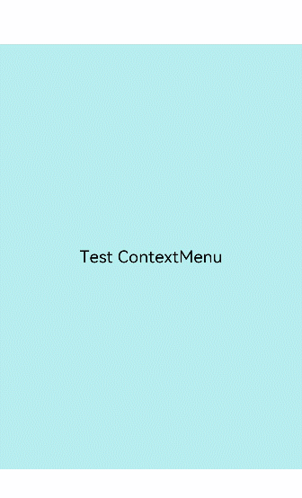

# ContextMenu

The menu bound to a component through [bindContextMenu](./ts-universal-attributes-menu.md#bindcontextmenu12) on a page can be closed as needed.

>  **NOTE**
>
> The APIs of this module are supported since API version 8. Updates will be marked with a superscript to indicate their earliest API version.
>
> Since API version 12, you can use the [getContextMenuController](../js-apis-arkui-UIContext.md#contextmenucontroller12) API in [UIContext](../js-apis-arkui-UIContext.md#uicontext) to obtain the UI context.

## ContextMenu.close

static close()

Closes the menu bound to this component through [bindContextMenu](./ts-universal-attributes-menu.md#bindcontextmenu12) on a page.

**Atomic service API**: This API can be used in atomic services since API version 11.

**System capability**: SystemCapability.ArkUI.ArkUI.Full


## Example

>  **NOTE**
>
> For clarity in UI execution context, you are advised to use the [getContextMenuController](../js-apis-arkui-UIContext.md#contextmenucontroller12) API in [UIContext](../js-apis-arkui-UIContext.md#uicontext).

```ts
// xxx.ets
@Entry
@Component
struct Index {
  @Builder MenuBuilder() {
    Flex({ direction: FlexDirection.Column, alignItems: ItemAlign.Center, justifyContent: FlexAlign.Center }) {
      Button('Test ContextMenu1')
      Divider().strokeWidth(2).margin(5).color(Color.Black)
      Button('Test ContextMenu2')
      Divider().strokeWidth(2).margin(5).color(Color.Black)
      Button('Test ContextMenu3')
    }
    .width(200)
    .height(160)
  }

  build() {
    Flex({ direction: FlexDirection.Column, alignItems: ItemAlign.Center, justifyContent: FlexAlign.Center }) {
      Column() {
        Text("Test ContextMenu")
          .fontSize(20)
          .width('100%')
          .height(500)
          .backgroundColor(0xAFEEEE)
          .textAlign(TextAlign.Center)
      }
      .bindContextMenu(this.MenuBuilder, ResponseType.LongPress)
      .onDragStart(()=>{
        // Close the menu when the component is dragged.
        ContextMenu.close() // You are advised to use this.getUIContext().getContextMenuController().close().
      })
    }
    .width('100%')
    .height('100%')
  }
}
```


