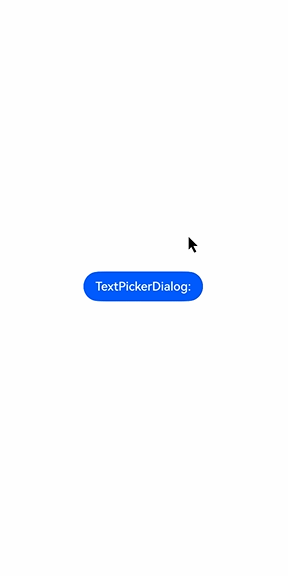
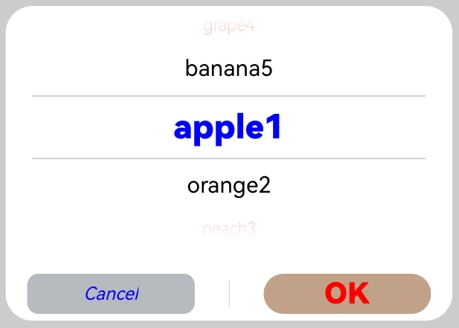

# Text Picker Dialog Box (TextPickerDialog)

A text picker dialog box is a dialog box that allows users to select text from the given range.

>  **NOTE**
>
> The APIs of this module are supported since API version 8. Updates will be marked with a superscript to indicate their earliest API version.
>
> The functionality of this module depends on UI context. This means that the APIs of this module cannot be used where the UI context is unclear. For details, see [UIContext](../js-apis-arkui-UIContext.md#uicontext).
>
> Since API version 10, you can use the [showTextPickerDialog](../js-apis-arkui-UIContext.md#showtextpickerdialog) API in [UIContext](../js-apis-arkui-UIContext.md#uicontext) to obtain the UI context.

## TextPickerDialog.show

static show(options?: TextPickerDialogOptions)

Shows a text picker in the given settings.

**Atomic service API**: This API can be used in atomic services since API version 11.

**System capability**: SystemCapability.ArkUI.ArkUI.Full

**Parameters**

| Name | Type                                                       | Mandatory| Description                      |
| ------- | ----------------------------------------------------------- | ---- | -------------------------- |
| options | [TextPickerDialogOptions](#textpickerdialogoptions) | No  | Parameters of the text picker dialog box.|

## TextPickerDialogOptions

Inherits from [TextPickerOptions](ts-basic-components-textpicker.md#textpickeroptions).

**System capability**: SystemCapability.ArkUI.ArkUI.Full

| Name| Type| Mandatory|  Description|
| -------- | -------- | -------- |  -------- |
| defaultPickerItemHeight | number \| string | No| Height of the picker item.<br>Default value: 56 vp (selected) and 36 vp (unselected). The set value applies to both selected and unselected items.<br>**Atomic service API**: This API can be used in atomic services since API version 11.|
| disappearTextStyle<sup>10+</sup> | [PickerTextStyle](ts-basic-components-datepicker.md#pickertextstyle10) | No| Font color, font size, and font weight for the top and bottom items.<br>Default value:<br>{<br>color: '#ff182431',<br>font: {<br>size: '14fp', <br>weight: FontWeight.Regular<br>}<br>}<br>**Atomic service API**: This API can be used in atomic services since API version 11. |
| textStyle<sup>10+</sup> | [PickerTextStyle](ts-basic-components-datepicker.md#pickertextstyle10) | No| Font color, font size, and font weight of all items except the top, bottom, and selected items.<br>Default value:<br>{<br>color: '#ff182431',<br>font: {<br>size: '16fp', <br>weight: FontWeight.Regular<br>}<br>}<br>**Atomic service API**: This API can be used in atomic services since API version 11. |
| selectedTextStyle<sup>10+</sup> | [PickerTextStyle](ts-basic-components-datepicker.md#pickertextstyle10) | No| Font color, font size, and font weight of the selected item.<br>Default value:<br>{<br>color: '#ff007dff',<br>font: {<br>size: '20vp', <br>weight: FontWeight.Medium<br>}<br>}<br>**Atomic service API**: This API can be used in atomic services since API version 11. |
| acceptButtonStyle<sup>12+</sup> | [PickerDialogButtonStyle](ts-methods-datepicker-dialog.md#pickerdialogbuttonstyle12) | No| Style of the accept button.<br>**NOTE**<br>In the **acceptButtonStyle** and **cancelButtonStyle** configurations, only one **primary** field can be set to **true** at most. If both the **primary** fields are set to **true**, neither will take effect.<br>**Atomic service API**: This API can be used in atomic services since API version 12.|
| cancelButtonStyle<sup>12+</sup> | [PickerDialogButtonStyle](ts-methods-datepicker-dialog.md#pickerdialogbuttonstyle12) | No| Style of the cancel button.<br>**NOTE**<br>In the **acceptButtonStyle** and **cancelButtonStyle** configurations, only one **primary** field can be set to **true** at most. If both the **primary** fields are set to **true**, neither will take effect.<br>**Atomic service API**: This API can be used in atomic services since API version 12.|
| canLoop<sup>10+</sup> | boolean | No| Whether to support scroll looping. The value **true** means to support scroll looping, and **false** means the opposite.<br>Default value: **true**<br>**Atomic service API**: This API can be used in atomic services since API version 11.|
| alignment<sup>10+</sup>  | [DialogAlignment](ts-methods-alert-dialog-box.md#dialogalignment) | No  | Alignment mode of the dialog box in the vertical direction.<br>Default value: **DialogAlignment.Default**<br>**Atomic service API**: This API can be used in atomic services since API version 11.|
| offset<sup>10+</sup>     | [Offset](ts-types.md#offset) | No    | Offset of the dialog box based on the **alignment** settings.<br>Default value: **{ dx: 0 , dy: 0 }**<br>**Atomic service API**: This API can be used in atomic services since API version 11.|
| maskRect<sup>10+</sup>| [Rectangle](ts-methods-alert-dialog-box.md#rectangle8) | No    | Mask area of the dialog box. Events outside the mask area are transparently transmitted, and events within the mask area are not.<br>Default value: **{ x: 0, y: 0, width: '100%', height: '100%' }**<br>**Atomic service API**: This API can be used in atomic services since API version 11.|
| onAccept | (value: [TextPickerResult](#textpickerresult)) => void | No| Callback invoked when the OK button in the dialog box is clicked.<br>**Atomic service API**: This API can be used in atomic services since API version 11.|
| onCancel | () => void | No| Callback invoked when the Cancel button in the dialog box is clicked.<br>**Atomic service API**: This API can be used in atomic services since API version 11.|
| onChange | (value: [TextPickerResult](#textpickerresult)) => void | No| Callback invoked when the selected item changes.<br>**Atomic service API**: This API can be used in atomic services since API version 11.|
| backgroundColor<sup>11+</sup> | [ResourceColor](ts-types.md#resourcecolor)  | No| Backplane color of the dialog box.<br>Default value: **Color.Transparent**<br>**Atomic service API**: This API can be used in atomic services since API version 12.|
| backgroundBlurStyle<sup>11+</sup> | [BlurStyle](ts-universal-attributes-background.md#blurstyle9) | No| Background blur style of the dialog box.<br>Default value: **BlurStyle.COMPONENT_ULTRA_THICK**<br>**Atomic service API**: This API can be used in atomic services since API version 12.|
| onDidAppear<sup>12+</sup> | () => void | No| Event callback when the dialog box appears.<br>**NOTE**<br>1. The normal timing sequence is as follows: onWillAppear > onDidAppear > (onAccept/onCancel/onChange) > onWillDisappear > onDidDisappear.<br>2. You can set the callback event for changing the dialog box display effect in **onDidAppear**. The settings take effect next time the dialog box appears.<br>3. If the user closes the dialog box immediately after it appears, **onWillDisappear** is invoked before **onDidAppear**.<br>4. If the dialog box is closed before its entrance animation is finished, this callback is not invoked.<br>**Atomic service API**: This API can be used in atomic services since API version 12.|
| onDidDisappear<sup>12+</sup> | () => void | No| Event callback when the dialog box disappears.<br>**NOTE**<br>1. The normal timing sequence is as follows: onWillAppear > onDidAppear > (onAccept/onCancel/onChange) > onWillDisappear > onDidDisappear.<br>**Atomic service API**: This API can be used in atomic services since API version 12.|
| onWillAppear<sup>12+</sup> | () => void | No| Event callback when the dialog box is about to appear.<br>**NOTE**<br>1. The normal timing sequence is as follows: onWillAppear > onDidAppear > (onAccept/onCancel/onChange) > onWillDisappear > onDidDisappear.<br>2. You can set the callback event for changing the dialog box display effect in **onWillAppear**. The settings take effect next time the dialog box appears.<br>**Atomic service API**: This API can be used in atomic services since API version 12.|
| onWillDisappear<sup>12+</sup> | () => void | No| Event callback when the dialog box is about to disappear.<br>**NOTE**<br>1. The normal timing sequence is as follows: onWillAppear > onDidAppear > (onAccept/onCancel/onChange) > onWillDisappear > onDidDisappear.<br>2. If the user closes the dialog box immediately after it appears, **onWillDisappear** is invoked before **onDidAppear**.<br>**Atomic service API**: This API can be used in atomic services since API version 12.|
| shadow<sup>12+</sup>              | [ShadowOptions](ts-universal-attributes-image-effect.md#shadowoptions) \| [ShadowStyle](ts-universal-attributes-image-effect.md#shadowstyle10) | No  | Shadow of the dialog box.<br>Default value on 2-in-1 devices: **ShadowStyle.OUTER_FLOATING_MD** when the dialog box is focused and **ShadowStyle.OUTER_FLOATING_SM** otherwise<br>**Atomic service API**: This API can be used in atomic services since API version 12.|

## TextPickerResult

**Atomic service API**: This API can be used in atomic services since API version 11.

**System capability**: SystemCapability.ArkUI.ArkUI.Full

| Name| Type| Read Only| Optional| Description|
| -------- | -------- | -------- | -------- | -------- |
| value | string \| string []<sup>10+</sup> | No| No| Text of the selected item.<br>**NOTE**<br>When the picker contains text only or both text and imagery, **value** indicates the text value of the selected item. (For a multi-column picker, **value** is of the array type.)<br>For an image list, **value** is empty.<br>The value cannot contain the following escape character: \\|
| index | number \| number []<sup>10+</sup> | No| No| Index of the selected item in the range. (For a multi-column picker, **index** is of the array type.)|

## Example

### Example 1

This example shows the basic usage of **TextPickerDialog**.

```ts
// xxx.ets
@Entry
@Component
struct TextPickerDialogExample {
  private select: number | number[] = 0
  private fruits: string[] = ['apple1', 'orange2', 'peach3', 'grape4', 'banana5']
  @State v:string = '';

  build() {
    Row() {
      Column() {
        Button("TextPickerDialog:" + this.v)
          .margin(20)
          .onClick(() => {
            TextPickerDialog.show({
              range: this.fruits,
              selected: this.select,
              disappearTextStyle: {color: Color.Red, font: {size: 15, weight: FontWeight.Lighter}},
              textStyle: {color: Color.Black, font: {size: 20, weight: FontWeight.Normal}},
              selectedTextStyle: {color: Color.Blue, font: {size: 30, weight: FontWeight.Bolder}},
              onAccept: (value: TextPickerResult) => {
                // Set select to the index of the item selected when the OK button is touched. In this way, when the text picker dialog box is displayed again, the selected item is the one last confirmed.
                this.select = value.index
                console.log(this.select + '')
                // After OK is clicked, the selected item is displayed on the page.
                this.v = value.value as string
                console.info("TextPickerDialog:onAccept()" + JSON.stringify(value))
              },
              onCancel: () => {
                console.info("TextPickerDialog:onCancel()")
              },
              onChange: (value: TextPickerResult) => {
                console.info("TextPickerDialog:onChange()" + JSON.stringify(value))
              },
              onDidAppear: () => {
                console.info("TextPickerDialog:onDidAppear()")
              },
              onDidDisappear: () => {
                console.info("TextPickerDialog:onDidDisappear()")
              },
              onWillAppear: () => {
                console.info("TextPickerDialog:onWillAppear()")
              },
              onWillDisappear: () => {
                console.info("TextPickerDialog:onWillDisappear()")
              }
            })
          })
      }.width('100%')
    }.height('100%')
  }
}
```




### Example 2

This example shows how to customize the button style.

```ts
// xxx.ets
@Entry
@Component
struct TextPickerDialogExample {
  private select: number | number[] = 0
  private fruits: string[] = ['apple1', 'orange2', 'peach3', 'grape4', 'banana5']
  @State v:string = '';

  build() {
    Row() {
      Column() {
        Button("TextPickerDialog:" + this.v)
          .margin(20)
          .onClick(() => {
            TextPickerDialog.show({
              range: this.fruits,
              selected: this.select,
              disappearTextStyle: {color: Color.Red, font: {size: 15, weight: FontWeight.Lighter}},
              textStyle: {color: Color.Black, font: {size: 20, weight: FontWeight.Normal}},
              selectedTextStyle: {color: Color.Blue, font: {size: 30, weight: FontWeight.Bolder}},
              acceptButtonStyle: { type: ButtonType.Normal, style: ButtonStyleMode.NORMAL, role: ButtonRole.NORMAL, fontColor: Color.Red,
                fontSize: '26fp', fontWeight: FontWeight.Bolder, fontStyle: FontStyle.Normal, fontFamily: 'sans-serif', backgroundColor:'#80834511',
                borderRadius: 20 },
              cancelButtonStyle: { type: ButtonType.Normal, style: ButtonStyleMode.NORMAL, role: ButtonRole.NORMAL, fontColor: Color.Blue,
                fontSize: '16fp', fontWeight: FontWeight.Normal, fontStyle: FontStyle.Italic, fontFamily: 'sans-serif', backgroundColor:'#50182431',
                borderRadius: 10 },
              onAccept: (value: TextPickerResult) => {
                // Set select to the index of the item selected when the OK button is touched. In this way, when the text picker dialog box is displayed again, the selected item is the one last confirmed.
                this.select = value.index
                console.log(this.select + '')
                // After OK is clicked, the selected item is displayed on the page.
                this.v = value.value as string
                console.info("TextPickerDialog:onAccept()" + JSON.stringify(value))
              },
              onCancel: () => {
                console.info("TextPickerDialog:onCancel()")
              },
              onChange: (value: TextPickerResult) => {
                console.info("TextPickerDialog:onChange()" + JSON.stringify(value))
              },
              onDidAppear: () => {
                console.info("TextPickerDialog:onDidAppear()")
              },
              onDidDisappear: () => {
                console.info("TextPickerDialog:onDidDisappear()")
              },
              onWillAppear: () => {
                console.info("TextPickerDialog:onWillAppear()")
              },
              onWillDisappear: () => {
                console.info("TextPickerDialog:onWillDisappear()")
              }
            })
          })
      }.width('100%')
    }.height('100%')
  }
}
```


