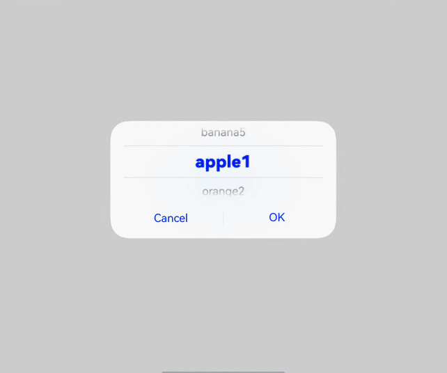
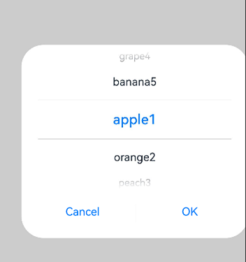
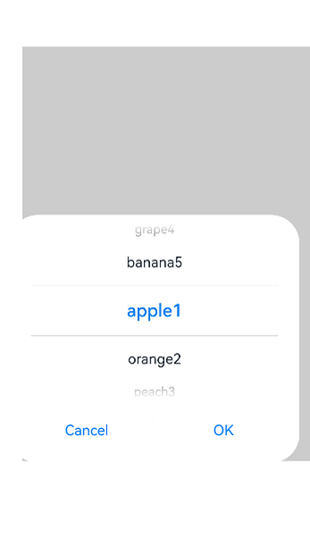
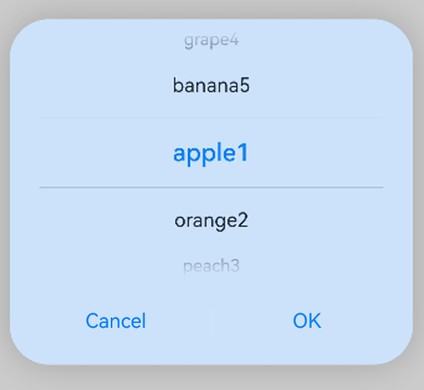
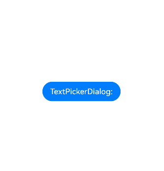

# Text Picker Dialog Box (TextPickerDialog)
<!--Kit: ArkUI-->
<!--Subsystem: ArkUI-->
<!--Owner: @luoying_ace_admin-->
<!--SE: @weixin_52725220-->
<!--TSE: @xiong0104-->

A text picker dialog box is a dialog box that allows users to select text from the given range.

>  **NOTE**
>
> - This component is supported since API version 8. Updates will be marked with a superscript to indicate their earliest API version.
>
> - The functionality of this module depends on UI context. This means that the APIs of this module cannot be used where [the UI context is unclear](../../../ui/arkts-global-interface.md). For details, see [UIContext](../arkts-apis-uicontext-uicontext.md).

## TextPickerDialog

### show<sup>(deprecated)</sup>

static show(options?: TextPickerDialogOptions)

Shows a text picker in the given settings.

> **NOTE**
> 
> This API is deprecated since API version 18. You are advised to use [showTextPickerDialog](../arkts-apis-uicontext-uicontext.md#showtextpickerdialog) in [UIContext](../arkts-apis-uicontext-uicontext.md) instead.
>
> Since API version 10, you can use the [showTextPickerDialog](../arkts-apis-uicontext-uicontext.md#showtextpickerdialog) API in [UIContext](../arkts-apis-uicontext-uicontext.md), which ensures that the text picker dialog box is shown in the intended UI instance.

**Atomic service API**: This API can be used in atomic services since API version 11.

**System capability**: SystemCapability.ArkUI.ArkUI.Full

**Device behavior**: This API has no effect on wearables and works on other devices.

**Parameters**

| Name | Type                                                       | Mandatory| Description                      |
| ------- | ----------------------------------------------------------- | ---- | -------------------------- |
| options | [TextPickerDialogOptions](#textpickerdialogoptions) | No  | Parameters of the text picker dialog box.|

## TextPickerDialogOptions

Inherits from [TextPickerOptions](ts-basic-components-textpicker.md#textpickeroptions).

**System capability**: SystemCapability.ArkUI.ArkUI.Full

| Name| Type| Read Only| Optional|  Description|
| -------- | -------- | -------- |  -------- |  -------- |
| defaultPickerItemHeight | number \| string | No| Yes| Height of the picker item. For the number type, the value range is [0, +∞). For the string type, only numeric string values, for example, **"56"**, are supported.<br>Default value: 56 vp (selected) and 36 vp (unselected). The set value applies to both selected and unselected items.<br>**Atomic service API**: This API can be used in atomic services since API version 11.|
| disappearTextStyle<sup>10+</sup> | [PickerTextStyle](ts-picker-common.md#pickertextstyle) | No| Yes| Text color, font size, and font weight of the items located two positions above or below the selected item.<br>Default value:<br>{<br>color: '#ff182431',<br>font: {<br>size: '14fp', <br>weight: FontWeight.Regular<br>}<br>}<br>**Atomic service API**: This API can be used in atomic services since API version 11.|
| textStyle<sup>10+</sup> | [PickerTextStyle](ts-picker-common.md#pickertextstyle) | No| Yes| Text color, font size, and font weight of the items located one position above or below the selected item.<br>Default value:<br>{<br>color: '#ff182431',<br>font: {<br>size: '16fp', <br>weight: FontWeight.Regular<br>}<br>}<br>**Atomic service API**: This API can be used in atomic services since API version 11.|
| selectedTextStyle<sup>10+</sup> | [PickerTextStyle](ts-picker-common.md#pickertextstyle) | No| Yes| Text color, font size, and font weight of the selected item.<br>Default value:<br>{<br>color: '#ff007dff',<br>font: {<br>size: '20fp', <br>weight: FontWeight.Medium<br>}<br>}<br>**Atomic service API**: This API can be used in atomic services since API version 11.|
| acceptButtonStyle<sup>12+</sup> | [PickerDialogButtonStyle](ts-picker-common.md#pickerdialogbuttonstyle12) | No| Yes| Style of the accept button.<br>**NOTE**<br>1. In **acceptButtonStyle** and **cancelButtonStyle**, at most one **primary** field can be set to **true**. If both are set to **true**, the **primary** field will remain at the default value of **false**.<br>2. The default button height is 40 vp and remains fixed even in accessibility and large-font modes. In addition, even if the button style is set to [ROUNDED_RECTANGLE](ts-basic-components-button.md#buttontype), the displayed effect is still a capsule button ([Capsule](ts-basic-components-button.md#buttontype)).<br>**Atomic service API**: This API can be used in atomic services since API version 12.|
| cancelButtonStyle<sup>12+</sup> | [PickerDialogButtonStyle](ts-picker-common.md#pickerdialogbuttonstyle12) | No| Yes| Style of the cancel button.<br>**NOTE**<br>1. In **acceptButtonStyle** and **cancelButtonStyle**, at most one **primary** field can be set to **true**. If both are set to **true**, the **primary** field will remain at the default value of **false**.<br>2. The default button height is 40 vp and remains fixed even in accessibility and large-font modes. In addition, even if the button style is set to [ROUNDED_RECTANGLE](ts-basic-components-button.md#buttontype), the displayed effect is still a capsule button ([Capsule](ts-basic-components-button.md#buttontype)).<br>**Atomic service API**: This API can be used in atomic services since API version 12.|
| canLoop<sup>10+</sup> | boolean | No| Yes| Whether to support scroll looping. The value **true** means to support scroll looping, and **false** means the opposite.<br>Default value: **true**<br>**Atomic service API**: This API can be used in atomic services since API version 11.|
| alignment<sup>10+</sup>  | [DialogAlignment](ts-methods-alert-dialog-box.md#dialogalignment) | No | Yes | Alignment mode of the dialog box in the vertical direction.<br>Default value: **DialogAlignment.Default**<br>**Atomic service API**: This API can be used in atomic services since API version 11.|
| offset<sup>10+</sup>     | [Offset](ts-types.md#offset) | No   | Yes   | Offset of the dialog box based on the **alignment** settings.<br>Default value: **{ dx: 0 , dy: 0 }**<br>**Atomic service API**: This API can be used in atomic services since API version 11.|
| maskRect<sup>10+</sup>| [Rectangle](ts-methods-alert-dialog-box.md#rectangle8) | No   | Yes   | Mask area of the dialog box. Events outside the mask area are transparently transmitted, and events within the mask area are not.<br>Default value: **{ x: 0, y: 0, width: '100%', height: '100%' }**<br>**Atomic service API**: This API can be used in atomic services since API version 11.|
| onAccept | (value: [TextPickerResult](#textpickerresult)) => void | No| Yes| Triggered when the OK button in the dialog box is clicked.<br>**Atomic service API**: This API can be used in atomic services since API version 11.|
| onCancel | () => void | No| Yes| Triggered when the Cancel button in the dialog box is clicked.<br>**Atomic service API**: This API can be used in atomic services since API version 11.|
| onChange | (value: [TextPickerResult](#textpickerresult)) => void | No| Yes| Triggered when the text picker in the dialog box snaps to the selected item.<br>This callback is triggered only after the scroll animation completes. To obtain real-time index changes, use **onEnterSelectedArea** instead.<br>**Atomic service API**: This API can be used in atomic services since API version 11.|
| onScrollStop<sup>14+</sup> | [Callback](ts-types.md#callback12)\<TextPickerResult> | No| Yes| Triggered when the scrolling in the text picker of the dialog box stops.<br>**Atomic service API**: This API can be used in atomic services since API version 14.|
| backgroundColor<sup>11+</sup> | [ResourceColor](ts-types.md#resourcecolor)  | No| Yes| Backplane color of the dialog box.<br>Default value: **Color.Transparent**<br>**NOTE**<br>When **backgroundColor** is set to a non-transparent color, **backgroundBlurStyle** must be set to **BlurStyle.NONE**; otherwise, the color display may not meet the expected effect.<br>**Atomic service API**: This API can be used in atomic services since API version 12.|
| backgroundBlurStyle<sup>11+</sup> | [BlurStyle](ts-universal-attributes-background.md#blurstyle9) | No| Yes| Background blur style of the dialog box.<br>Default value: **BlurStyle.COMPONENT_ULTRA_THICK**<br>**NOTE**<br>Setting this parameter to **BlurStyle.NONE** disables the background blur. When **backgroundBlurStyle** is set to a value other than **NONE**, do not set **backgroundColor**. If you do, the color display may not produce the expected visual effect.<br>**Atomic service API**: This API can be used in atomic services since API version 12.|
| backgroundBlurStyleOptions<sup>19+</sup> | [BackgroundBlurStyleOptions](ts-universal-attributes-background.md#backgroundblurstyleoptions10) | No| Yes| Options for customizing the background blur style.<br>**Atomic service API**: This API can be used in atomic services since API version 19.|
| backgroundEffect<sup>19+</sup> | [BackgroundEffectOptions](ts-universal-attributes-background.md#backgroundeffectoptions11) | No| Yes| Options for customizing the background effect.<br>**Atomic service API**: This API can be used in atomic services since API version 19.|
| onDidAppear<sup>12+</sup> | () => void | No| Yes| Event callback when the dialog box appears.<br>**NOTE**<br>1. The normal timing sequence is as follows: onWillAppear > onDidAppear > (onAccept/onCancel/onChange/onScrollStop) > onWillDisappear > onDidDisappear.<br>2. You can set the callback event for changing the dialog box display effect in **onDidAppear**. The settings take effect next time the dialog box appears.<br>3. If the user closes the dialog box immediately after it appears, **onWillDisappear** is invoked before **onDidAppear**.<br>4. If the dialog box is closed before its entrance animation is finished, this callback is not invoked.<br>**Atomic service API**: This API can be used in atomic services since API version 12.|
| onDidDisappear<sup>12+</sup> | () => void | No| Yes| Event callback when the dialog box disappears.<br>**NOTE**<br>1. The normal timing sequence is as follows: onWillAppear > onDidAppear > (onAccept/onCancel/onChange/onScrollStop) > onWillDisappear > onDidDisappear.<br>**Atomic service API**: This API can be used in atomic services since API version 12.|
| onWillAppear<sup>12+</sup> | () => void | No| Yes| Event callback when the dialog box is about to appear.<br>**NOTE**<br>1. The normal timing sequence is as follows: onWillAppear > onDidAppear > (onAccept/onCancel/onChange/onScrollStop) > onWillDisappear > onDidDisappear.<br>2. You can set the callback event for changing the dialog box display effect in **onWillAppear**. The settings take effect next time the dialog box appears.<br>**Atomic service API**: This API can be used in atomic services since API version 12.|
| onWillDisappear<sup>12+</sup> | () => void | No| Yes| Event callback when the dialog box is about to disappear.<br>**NOTE**<br>1. The normal timing sequence is as follows: onWillAppear > onDidAppear > (onAccept/onCancel/onChange/onScrollStop) > onWillDisappear > onDidDisappear.<br>2. If the user closes the dialog box immediately after it appears, **onWillDisappear** is invoked before **onDidAppear**.<br>**Atomic service API**: This API can be used in atomic services since API version 12.|
| shadow<sup>12+</sup>              | [ShadowOptions](ts-universal-attributes-image-effect.md#shadowoptions) \| [ShadowStyle](ts-universal-attributes-image-effect.md#shadowstyle10) | No | Yes | Shadow of the dialog box.<br>Default value on 2-in-1 devices: **ShadowStyle.OUTER_FLOATING_MD** when the dialog box is focused and **ShadowStyle.OUTER_FLOATING_SM** otherwise<br>**Atomic service API**: This API can be used in atomic services since API version 12.|
| enableHoverMode<sup>14+</sup>     | boolean | No | Yes | Whether to respond when the device is in semi-folded mode.<br>Default value: **false**, meaning not to respond when the device is in semi-folded mode.<br>**Atomic service API**: This API can be used in atomic services since API version 14.|
| hoverModeArea<sup>14+</sup>       | [HoverModeAreaType](ts-appendix-enums.md#hovermodeareatype14) | No | Yes | Display area of the dialog box when the device is in semi-folded mode.<br>Default value: **HoverModeAreaType.BOTTOM_SCREEN**<br>**Atomic service API**: This API can be used in atomic services since API version 14.|
| disableTextStyleAnimation<sup>15+</sup>   |  boolean | No | Yes | Sets whether to enable the text style change animation during the scrolling process.<br>**true**: Disable the text style change animation.<br>**false**: Enable the text style change animation.<br>Default value: **false**<br>**Atomic service API**: This API can be used in atomic services since API version 15.|
| defaultTextStyle<sup>15+</sup>   |  [TextPickerTextStyle](ts-basic-components-textpicker.md#textpickertextstyle15) | No | Yes | Style of the text items when the text style change animation during the scrolling process is disabled. It is effective only when **disableTextStyleAnimation** is **true**.<br>Default value: same as the default value of the [Text](ts-basic-components-text.md) component<br>**Atomic service API**: This API can be used in atomic services since API version 15.|
| onEnterSelectedArea<sup>18+</sup>   |  Callback\<[TextPickerResult](#textpickerresult)> | No | Yes |  Represents the callback triggered during the scrolling of the text picker when an item enters the divider area. Compared to the **onChange** event, this event is triggered earlier, specifically when the scroll distance of the current column exceeds half the height of the selected item, which indicates that the item has entered the divider area.<br>**NOTE**<br>In scenarios where the picker contains linked columns, the use of this callback is not recommended. The reason is that it identifies nodes where items enter the divider area during scrolling. However, items that change in response to the scrolling do not themselves scroll. As a result, the callback's return values will only reflect changes for the currently scrolling column, while other non-scrolling columns will remain unchanged.<br>**Atomic service API**: This API can be used in atomic services since API version 18.|
| enableHapticFeedback<sup>18+</sup> | boolean | No | Yes | Whether to enable haptic feedback.<br>**true** (default): Haptic feedback is enabled.<br>**false**: Haptic feedback is disabled.<br>**Atomic service API**: This API can be used in atomic services since API version 18.<br>**NOTE**<br>To enable haptic feedback, you must declare the ohos.permission.VIBRATE permission under **requestPermissions** in the **module.json5** file of the project.<br>"requestPermissions": [{"name": "ohos.permission.VIBRATE"}]|
| selectedBackgroundStyle<sup>20+</sup> | [PickerBackgroundStyle](ts-basic-components-textpicker.md) | No | Yes | Background color of the selected item.<br>Default value:<br>{ <br>color: '#0C182431'<br>borderRadius: { value:24 unit:1 }<br>}<br>**Atomic service API**: This API can be used in atomic services since API version 20.<br>|

## TextPickerDialogOptionsExt<sup>20+</sup>

Inherits from [TextPickerOptions](ts-basic-components-textpicker.md#textpickeroptions).

**Atomic service API**: This API can be used in atomic services since API version 20.

**System capability**: SystemCapability.ArkUI.ArkUI.Full

| Name| Type| Read Only| Optional|  Description|
| -------- | -------- | -------- |  -------- |  -------- |
| defaultPickerItemHeight | number \| string | No| Yes| Height of the picker item. For the number type, the value range is [0, +∞). For the string type, only numeric string values, for example, **"56"**, are supported.<br>Default value: 56 vp (selected) and 36 vp (unselected). The set value applies to both selected and unselected items.|
| acceptButtonStyle | [PickerDialogButtonStyle](ts-picker-common.md#pickerdialogbuttonstyle12) | No  | Yes  | Style of the accept button.<br>**NOTE**<br>1. In **acceptButtonStyle** and **cancelButtonStyle**, at most one **primary** field can be set to **true**. If both are set to **true**, the **primary** field will remain at the default value of **false**.<br>2. The default button height is 40 vp and remains fixed even in accessibility and large-font modes. In addition, even if the button style is set to [ROUNDED_RECTANGLE](ts-basic-components-button.md#buttontype), the displayed effect is still a capsule button ([Capsule](ts-basic-components-button.md#buttontype)).|
| cancelButtonStyle | [PickerDialogButtonStyle](ts-picker-common.md#pickerdialogbuttonstyle12) | No  | Yes  | Style of the cancel button.<br>**NOTE**<br>1. In **acceptButtonStyle** and **cancelButtonStyle**, at most one **primary** field can be set to **true**. If both are set to **true**, the **primary** field will remain at the default value of **false**.<br>2. The default button height is 40 vp and remains fixed even in accessibility and large-font modes. In addition, even if the button style is set to [ROUNDED_RECTANGLE](ts-basic-components-button.md#buttontype), the displayed effect is still a capsule button ([Capsule](ts-basic-components-button.md#buttontype)).|
| canLoop | boolean | No  | Yes  | Whether to support scroll looping. The value **true** means to support scroll looping, and **false** means the opposite.<br>Default value: **true**|
| alignment  | [DialogAlignment](ts-methods-alert-dialog-box.md#dialogalignment) | No | Yes| Alignment mode of the dialog box in the vertical direction.<br>Default value: **DialogAlignment.Default**|
| offset     | [Offset](ts-types.md#offset) | No   | Yes   | Offset of the dialog box based on the **alignment** settings.<br>Default value: **{ dx: 0 , dy: 0 }**|
| maskRect| [Rectangle](ts-methods-alert-dialog-box.md#rectangle8) | No   | Yes   | Mask area of the dialog box. Events outside the mask area are transparently transmitted, and events within the mask area are not.<br>Default value: **{ x: 0, y: 0, width: '100%', height: '100%' }**|
| onAccept | [Callback](ts-types.md#callback12)\<[TextPickerResult](#textpickerresult)> | No| Yes| Triggered when the OK button in the dialog box is clicked.|
| onCancel | [VoidCallback](ts-types.md#voidcallback12) | No| Yes| Triggered when the Cancel button in the dialog box is clicked.|
| onChange | [Callback](ts-types.md#callback12)\<[TextPickerResult](#textpickerresult)> | No| Yes| Triggered when the text picker in the dialog box snaps to the selected item.<br>This callback is triggered only after the scroll animation completes. To obtain real-time index changes, use **onEnterSelectedArea** instead.|
| onScrollStop | [Callback](ts-types.md#callback12)\<[TextPickerResult](#textpickerresult)> | No| Yes| Triggered when the scrolling in the text picker of the dialog box stops.|
| backgroundColor | [ResourceColor](ts-types.md#resourcecolor)  | No| Yes| Backplane color of the dialog box.<br>Default value: **Color.Transparent**<br>**NOTE**<br>When **backgroundColor** is set to a non-transparent color, **backgroundBlurStyle** must be set to **BlurStyle.NONE**; otherwise, the color display may not meet the expected effect.|
| backgroundBlurStyle | [BlurStyle](ts-universal-attributes-background.md#blurstyle9) | No| Yes| Background blur style of the dialog box.<br>Default value: **BlurStyle.COMPONENT_ULTRA_THICK**<br>**NOTE**<br>Setting this parameter to **BlurStyle.NONE** disables the background blur. When **backgroundBlurStyle** is set to a value other than **NONE**, do not set **backgroundColor**. If you do, the color display may not produce the expected visual effect.|
| backgroundBlurStyleOptions | [BackgroundBlurStyleOptions](ts-universal-attributes-background.md#backgroundblurstyleoptions10) | No| Yes| Options for customizing the background blur style.<br>**Atomic service API**: This API can be used in atomic services since API version 20.|
| backgroundEffect | [BackgroundEffectOptions](ts-universal-attributes-background.md#backgroundeffectoptions11) | No| Yes| Options for customizing the background effect.|
| onDidAppear | [VoidCallback](ts-types.md#voidcallback12) | No| Yes| Event callback when the dialog box appears.<br>**NOTE**<br>1. The normal timing sequence is as follows: onWillAppear > onDidAppear > (onAccept/onCancel/onChange/onScrollStop) > onWillDisappear > onDidDisappear.<br>2. You can set the callback event for changing the dialog box display effect in **onDidAppear**. The settings take effect next time the dialog box appears.<br>3. If the user closes the dialog box immediately after it appears, **onWillDisappear** is invoked before **onDidAppear**.<br>4. If the dialog box is closed before its entrance animation is finished, this callback is not invoked.|
| onDidDisappear | [VoidCallback](ts-types.md#voidcallback12) | No| Yes| Event callback when the dialog box disappears.<br>**NOTE**<br>1. The normal timing sequence is as follows: onWillAppear > onDidAppear > (onAccept/onCancel/onChange/onScrollStop) > onWillDisappear > onDidDisappear.|
| onWillAppear | [VoidCallback](ts-types.md#voidcallback12) | No| Yes| Event callback when the dialog box is about to appear.<br>**NOTE**<br>1. The normal timing sequence is as follows: onWillAppear > onDidAppear > (onAccept/onCancel/onChange/onScrollStop) > onWillDisappear > onDidDisappear.<br>2. You can set the callback event for changing the dialog box display effect in **onWillAppear**. The settings take effect next time the dialog box appears.|
| onWillDisappear | [VoidCallback](ts-types.md#voidcallback12) | No| Yes| Event callback when the dialog box is about to disappear.<br>**NOTE**<br>1. The normal timing sequence is as follows: onWillAppear > onDidAppear > (onAccept/onCancel/onChange/onScrollStop) > onWillDisappear > onDidDisappear.<br>2. If the user closes the dialog box immediately after it appears, **onWillDisappear** is invoked before **onDidAppear**.|
| shadow              | [ShadowOptions](ts-universal-attributes-image-effect.md#shadowoptions) \| [ShadowStyle](ts-universal-attributes-image-effect.md#shadowstyle10) | No | Yes | Shadow of the dialog box.<br>Default value on 2-in-1 devices: **ShadowStyle.OUTER_FLOATING_MD** when the dialog box is focused and **ShadowStyle.OUTER_FLOATING_SM** otherwise|
| enableHoverMode     | boolean | No | Yes | Whether to respond when the device is in semi-folded mode.<br>Default value: **false**, meaning not to respond when the device is in semi-folded mode.|
| hoverModeArea       | [HoverModeAreaType](ts-appendix-enums.md#hovermodeareatype14) | No | Yes | Display area of the dialog box when the device is in semi-folded mode.<br>Default value: **HoverModeAreaType.BOTTOM_SCREEN**|
| disableTextStyleAnimation   |  boolean | No | Yes |  Sets whether to enable the text style change animation during the scrolling process.<br>**true**: Disable the text style change animation.<br>**false**: Enable the text style change animation.<br>Default value: **false**|
| defaultTextStyle   |  [TextPickerTextStyle](ts-basic-components-textpicker.md#textpickertextstyle15) | No | Yes |  Style of the text items when the text style change animation during the scrolling process is disabled. It is effective only when **disableTextStyleAnimation** is **true**.<br>Default value: same as the default value of the [Text](ts-basic-components-text.md) component|
| onEnterSelectedArea   |  [Callback](ts-types.md#callback12)\<[TextPickerResult](#textpickerresult)> | No | Yes |  Represents the callback triggered during the scrolling of the text picker when an item enters the divider area. Compared to the **onChange** event, this event is triggered earlier, specifically when the scroll distance of the current column exceeds half the height of the selected item, which indicates that the item has entered the divider area.<br>**NOTE**<br>In scenarios where the picker contains linked columns, the use of this callback is not recommended. The reason is that it identifies nodes where items enter the divider area during scrolling. However, items that change in response to the scrolling do not themselves scroll. As a result, the callback's return values will only reflect changes for the currently scrolling column, while other non-scrolling columns will remain unchanged.|
| enableHapticFeedback | boolean | No | Yes | Whether to enable haptic feedback.<br>**true** (default): Haptic feedback is enabled.<br>**false**: Haptic feedback is disabled.<br>**NOTE**<br>To enable haptic feedback, you must declare the ohos.permission.VIBRATE permission under **requestPermissions** in the **module.json5** file of the project.<br>"requestPermissions": [{"name": "ohos.permission.VIBRATE"}]|
| selectedBackgroundStyle | [PickerBackgroundStyle](ts-basic-components-textpicker.md) | No | Yes | Background color of the selected item.<br>Default value:<br>{ <br>color: '#0C182431'<br>borderRadius: { value:24 unit:1 }<br>}|
| disappearTextStyle | [TextPickerTextStyle](ts-basic-components-textpicker.md#textpickertextstyle15) | No| Yes| Style of the items located two positions above or below the selected item, covering the following: text color, font size, font weight, maximum font size, minimum font size, text overflow mode.<br>Default value:<br>{<br>color: '#ff182431',<br>font: {<br>size: '14fp', <br>weight: FontWeight.Regular<br>},<br>minFontSize: 0,<br>maxFontSize: 0,<br>overflow: TextOverflow.CLIP<br>} |
| textStyle | [TextPickerTextStyle](ts-basic-components-textpicker.md#textpickertextstyle15) | No| Yes| Style of the items located one position above or below the selected item, covering the following: text color, font size, font weight, maximum font size, minimum font size, text overflow mode.<br>Default value:<br>{<br>color: '#ff182431',<br>font: {<br>size: '16fp', <br>weight: FontWeight.Regular<br>},<br>minFontSize: 0,<br>maxFontSize: 0,<br>overflow: TextOverflow.CLIP<br>} |
| selectedTextStyle | [TextPickerTextStyle](ts-basic-components-textpicker.md#textpickertextstyle15) | No| Yes| Style of the selected item, covering the following: text color, font size, font weight, maximum font size, minimum font size, text overflow mode.<br>Default value:<br>{<br>color: '#ff007dff',<br>font: {<br>size: '20fp', <br>weight: FontWeight.Medium<br>},<br>minFontSize: 0,<br>maxFontSize: 0,<br>overflow: TextOverflow.CLIP<br>} |


## TextPickerResult

Represents the selection result of a **TextPicker** component.

**Atomic service API**: This API can be used in atomic services since API version 11.

**System capability**: SystemCapability.ArkUI.ArkUI.Full

| Name| Type| Read Only| Optional| Description|
| -------- | -------- | -------- | -------- | -------- |
| value | string \| string []<sup>10+</sup> | No| No| Text of the selected item.<br>**NOTE**<br>When the picker contains text only or both text and imagery, **value** indicates the text value of the selected item. (For a multi-column picker, **value** is of the array type.)<br>For an image list, **value** is empty.<br>The value cannot contain the following escape character: \\|
| index | number \| number []<sup>10+</sup> | No| No| Index of the selected item in the range. The index is zero-based. (For a multi-column picker, **index** is of the array type.)|

## Example

>  **NOTE**
>
> For clarity in UI execution context, you are advised to use the [showTextPickerDialog](../arkts-apis-uicontext-uicontext.md#showtextpickerdialog) API in [UIContext](../arkts-apis-uicontext-uicontext.md).

### Example 1: Displaying a Text Picker Dialog Box

This example demonstrates how to display a text picker dialog box when a button is touched.

```ts
// xxx.ets
@Entry
@Component
struct TextPickerDialogExample {
  private select: number | number[] = 0;
  private fruits: string[] = ['apple1', 'orange2', 'peach3', 'grape4', 'banana5'];
  @State v: string = '';

  build() {
    Row() {
      Column() {
        Button("TextPickerDialog:" + this.v)
          .margin(20)
          .onClick(() => {
            this.getUIContext().showTextPickerDialog({
              range: this.fruits,
              selected: this.select,
              value: this.v,
              defaultPickerItemHeight: 40,
              onAccept: (value: TextPickerResult) => {
                // Set select to the index of the item selected when the OK button is touched. In this way, when the text picker dialog box is displayed again, the selected item is the one last confirmed.
                this.select = value.index;
                console.log(this.select + '');
                // After OK is clicked, the selected item is displayed on the page.
                this.v = value.value as string;
                console.info("TextPickerDialog:onAccept()" + JSON.stringify(value));
              },
              onCancel: () => {
                console.info("TextPickerDialog:onCancel()");
              },
              onChange: (value: TextPickerResult) => {
                console.info("TextPickerDialog:onChange()" + JSON.stringify(value));
              },
              onScrollStop: (value: TextPickerResult) => {
                console.info("TextPickerDialog:onScrollStop()" + JSON.stringify(value));
              },
              onDidAppear: () => {
                console.info("TextPickerDialog:onDidAppear()");
              },
              onDidDisappear: () => {
                console.info("TextPickerDialog:onDidDisappear()");
              },
              onWillAppear: () => {
                console.info("TextPickerDialog:onWillAppear()");
              },
              onWillDisappear: () => {
                console.info("TextPickerDialog:onWillDisappear()");
              }
            });
          })
      }.width('100%')
    }.height('100%')
  }
}
```


### Example 2: Customizing the Style

In this example, **disappearTextStyle**, **textStyle**, **selectedTextStyle**, **acceptButtonStyle**, and **cancelButtonStyle** are configured to customize the text and button style.

```ts
// xxx.ets
@Entry
@Component
struct TextPickerDialogExample {
  private select: number | number[] = 0;
  private fruits: string[] = ['apple1', 'orange2', 'peach3', 'grape4', 'banana5'];
  @State v: string = '';

  build() {
    Row() {
      Column() {
        Button("TextPickerDialog:" + this.v)
          .margin(20)
          .onClick(() => {
            this.getUIContext().showTextPickerDialog({
              range: this.fruits,
              selected: this.select,
              disappearTextStyle: { color: '#297bec', font: { size: 15, weight: FontWeight.Lighter } },
              textStyle: { color: Color.Black, font: { size: 20, weight: FontWeight.Normal } },
              selectedTextStyle: { color: Color.Blue, font: { size: 30, weight: FontWeight.Bolder } },
              acceptButtonStyle: {
                type: ButtonType.Normal,
                style: ButtonStyleMode.NORMAL,
                role: ButtonRole.NORMAL,
                fontColor: 'rgb(81, 81, 216)',
                fontSize: '26fp',
                fontWeight: FontWeight.Bolder,
                fontStyle: FontStyle.Normal,
                fontFamily: 'sans-serif',
                backgroundColor: '#A6ACAF',
                borderRadius: 20
              },
              cancelButtonStyle: {
                type: ButtonType.Normal,
                style: ButtonStyleMode.NORMAL,
                role: ButtonRole.NORMAL,
                fontColor: Color.Blue,
                fontSize: '16fp',
                fontWeight: FontWeight.Normal,
                fontStyle: FontStyle.Italic,
                fontFamily: 'sans-serif',
                backgroundColor: '#50182431',
                borderRadius: 10
              },
              onAccept: (value: TextPickerResult) => {
                // Set select to the index of the item selected when the OK button is touched. In this way, when the text picker dialog box is displayed again, the selected item is the one last confirmed.
                this.select = value.index;
                console.log(this.select + '');
                // After OK is clicked, the selected item is displayed on the page.
                this.v = value.value as string;
                console.info("TextPickerDialog:onAccept()" + JSON.stringify(value));
              },
              onCancel: () => {
                console.info("TextPickerDialog:onCancel()");
              },
              onChange: (value: TextPickerResult) => {
                console.info("TextPickerDialog:onChange()" + JSON.stringify(value));
              },
              onScrollStop: (value: TextPickerResult) => {
                console.info("TextPickerDialog:onScrollStop()" + JSON.stringify(value));
              },
              onDidAppear: () => {
                console.info("TextPickerDialog:onDidAppear()");
              },
              onDidDisappear: () => {
                console.info("TextPickerDialog:onDidDisappear()");
              },
              onWillAppear: () => {
                console.info("TextPickerDialog:onWillAppear()");
              },
              onWillDisappear: () => {
                console.info("TextPickerDialog:onWillDisappear()");
              }
            });
          })
      }.width('100%')
    }.height('100%')
  }
}
```


### Example 3: Configuring a Dialog Box in the Hover State

This example demonstrates how to set the layout area of a dialog box when the device is in semi-folded mode.

```ts
@Entry
@Component
struct TextPickerDialogExample {
  private select: number | number[] = 0;
  private fruits: string[] = ['apple1', 'orange2', 'peach3', 'grape4', 'banana5'];
  @State v: string = '';

  build() {
    Row() {
      Column() {
        Button("TextPickerDialog:" + this.v)
          .margin(20)
          .onClick(() => {
            this.getUIContext().showTextPickerDialog({
              range: this.fruits,
              selected: this.select,
              disappearTextStyle: { color: Color.Red, font: { size: 15, weight: FontWeight.Lighter }},
              textStyle: { color: Color.Black, font: { size: 20, weight: FontWeight.Normal }},
              selectedTextStyle: { color: Color.Blue, font: { size: 30, weight: FontWeight.Bolder }},
              onAccept: (value: TextPickerResult) => {
                // Set select to the index of the item selected when the OK button is touched. In this way, when the text picker dialog box is displayed again, the selected item is the one last confirmed.
                this.select = value.index;
                console.log(this.select + '');
                // After OK is clicked, the selected item is displayed on the page.
                this.v = value.value as string;
                console.info("TextPickerDialog:onAccept()" + JSON.stringify(value));
              },
              onCancel: () => {
                console.info("TextPickerDialog:onCancel()");
              },
              onChange: (value: TextPickerResult) => {
                console.info("TextPickerDialog:onChange()" + JSON.stringify(value));
              },
              onScrollStop: (value: TextPickerResult) => {
                console.info("TextPickerDialog:onScrollStop()" + JSON.stringify(value));
              },
              onDidAppear: () => {
                console.info("TextPickerDialog:onDidAppear()");
              },
              onDidDisappear: () => {
                console.info("TextPickerDialog:onDidDisappear()");
              },
              onWillAppear: () => {
                console.info("TextPickerDialog:onWillAppear()");
              },
              onWillDisappear: () => {
                console.info("TextPickerDialog:onWillDisappear()");
              },
              enableHoverMode: true,
              hoverModeArea: HoverModeAreaType.TOP_SCREEN
            });
          })
      }.width('100%')
    }.height('100%')
  }
}
```



### Example 4: Setting the Dialog Box Position

This example demonstrates how to set the position of a dialog box using **alignment** and **offset**.

```ts
// xxx.ets
@Entry
@Component
struct TextPickerDialogExample {
  private select: number | number[] = 0;
  private fruits: string[] = ['apple1', 'orange2', 'peach3', 'grape4', 'banana5'];
  @State v: string = '';

  build() {
    Row() {
      Column() {
        Button("TextPickerDialog:" + this.v)
          .margin(20)
          .onClick(() => {
            this.getUIContext().showTextPickerDialog({
              range: this.fruits,
              selected: this.select,
              alignment: DialogAlignment.Center,
              offset: { dx: 20, dy: 0 },
              onAccept: (value: TextPickerResult) => {
                // Set select to the index of the item selected when the OK button is touched. In this way, when the text picker dialog box is displayed again, the selected item is the one last confirmed.
                this.select = value.index;
                console.log(this.select + '');
                // After OK is clicked, the selected item is displayed on the page.
                this.v = value.value as string;
                console.info("TextPickerDialog:onAccept()" + JSON.stringify(value));
              }
            });
          })
      }.width('100%')
    }.height('100%')
  }
}
```



### Example 5: Setting the Mask Area

This example demonstrates how to set the mask area using **maskRect**.

```ts
// xxx.ets
@Entry
@Component
struct TextPickerDialogExample {
  private select: number | number[] = 0;
  private fruits: string[] = ['apple1', 'orange2', 'peach3', 'grape4', 'banana5'];
  @State v: string = '';

  build() {
    Row() {
      Column() {
        Button("TextPickerDialog:" + this.v)
          .margin(20)
          .onClick(() => {
            this.getUIContext().showTextPickerDialog({
              range: this.fruits,
              selected: this.select,
              maskRect: {
                x: 30,
                y: 60,
                width: '100%',
                height: '60%'
              },
              onAccept: (value: TextPickerResult) => {
                // Set select to the index of the item selected when the OK button is touched. In this way, when the text picker dialog box is displayed again, the selected item is the one last confirmed.
                this.select = value.index;
                console.log(this.select + '');
                // After OK is clicked, the selected item is displayed on the page.
                this.v = value.value as string;
                console.info("TextPickerDialog:onAccept()" + JSON.stringify(value));
              }
            });
          })
      }.width('100%')
    }.height('100%')
  }
}
```



### Example 6: Setting the Background

This example demonstrates how to set the dialog box background using **backgroundColor**, **backgroundBlurStyle**, and **shadow**.

```ts
// xxx.ets
@Entry
@Component
struct TextPickerDialogExample {
  private select: number | number[] = 0;
  private fruits: string[] = ['apple1', 'orange2', 'peach3', 'grape4', 'banana5'];
  @State v: string = '';

  build() {
    Row() {
      Column() {
        Button("TextPickerDialog:" + this.v)
          .margin(20)
          .onClick(() => {
            this.getUIContext().showTextPickerDialog({
              range: this.fruits,
              selected: this.select,
              backgroundColor: 'rgb(204, 226, 251)',
              backgroundBlurStyle: BlurStyle.NONE,
              shadow: ShadowStyle.OUTER_FLOATING_SM,
              onAccept: (value: TextPickerResult) => {
                // Set select to the index of the item selected when the OK button is touched. In this way, when the text picker dialog box is displayed again, the selected item is the one last confirmed.
                this.select = value.index;
                console.log(this.select + '');
                // After OK is clicked, the selected item is displayed on the page.
                this.v = value.value as string;
                console.info("TextPickerDialog:onAccept()" + JSON.stringify(value));
              }
            });
          })
      }.width('100%')
    }.height('100%')
  }
}
```




### Example 7: Setting Cyclic Scrolling

This example demonstrates how to set whether to enable cyclic scrolling using **canLoop**.

```ts
// xxx.ets
@Entry
@Component
struct TextPickerDialogExample {
  private select: number | number[] = 0;
  private fruits: string[] = ['apple1', 'orange2', 'peach3', 'grape4', 'banana5'];
  @State v: string = '';

  build() {
    Row() {
      Column() {
        Button("TextPickerDialog:" + this.v)
          .margin(20)
          .onClick(() => {
            this.getUIContext().showTextPickerDialog({
              range: this.fruits,
              selected: this.select,
              value: this.v,
              canLoop: false,
              onAccept: (value: TextPickerResult) => {
                // Set select to the index of the item selected when the OK button is touched. In this way, when the text picker dialog box is displayed again, the selected item is the one last confirmed.
                this.select = value.index;
                console.log(this.select + '');
                // After OK is clicked, the selected item is displayed on the page.
                this.v = value.value as string;
                console.info("TextPickerDialog:onAccept()" + JSON.stringify(value));
              }
            });
          })
      }.width('100%')
    }.height('100%')
  }
}
```



### Example 8: Setting the Background Style of the Selected Item

This example shows how to set the background style of the selected item by configuring **selectedBackgroundStyle**.

```ts
// xxx.ets
@Entry
@Component
struct TextPickerExample {
  private showText1: string [] = ['Text1', 'Text1', 'Text1', 'Text1']
  build() {
    Column() {
      Row() {
        Button("TextPickerDialog")
          .margin(20)
          .onClick(() => {
            this.getUIContext().showTextPickerDialog({
              range: this.showText1,
              selectedBackgroundStyle: {
                borderRadius: {
                  topLeft:15,
                  topRight:15,
                  bottomLeft:15,
                  bottomRight:15
                },
                color: "FFC3C3C3"
              }
            })
          })
      }
    }.height('100%')
  }
}
```


### Example 9: Customizing the Background Blur Effect

This example demonstrates how to customize the background blur effect by configuring [backgroundBlurStyleOptions](#textpickerdialogoptions). This functionality is supported since API version 19.

```ts
@Entry
@Component
struct TextPickerExample {
  private showText1: string [] = ['Text1', 'Text1', 'Text1', 'Text1']

  build() {
    Stack({ alignContent: Alignment.Top }) {
      Image($r('app.media.bg'))
      Column() {
        Button("TextPickerDialog")
          .margin(20)
          .onClick(() => {
            this.getUIContext().showTextPickerDialog({
              range: this.showText1,
              backgroundColor: undefined,
              backgroundBlurStyle: BlurStyle.Thin,
              backgroundBlurStyleOptions: {
                colorMode: ThemeColorMode.LIGHT,
                adaptiveColor: AdaptiveColor.AVERAGE,
                scale: 1,
                blurOptions: { grayscale: [20, 20] },
              },
            })
          })
      }.width('100%')
    }
  }
}
```


### Example 10: Customizing the Background Effect

This example demonstrates how to customize the background effect by configuring [backgroundEffect](#textpickerdialogoptions). This functionality is supported since API version 19.

```ts
@Entry
@Component
struct TextPickerExample {
  private showText1: string [] = ['Text1', 'Text1', 'Text1', 'Text1']

  build() {
    Stack({ alignContent: Alignment.Top }) {
      Image($r('app.media.bg'))
      Column() {
        Button("TextPickerDialog")
          .margin(20)
          .onClick(() => {
            this.getUIContext().showTextPickerDialog({
              range: this.showText1,
              backgroundColor: undefined,
              backgroundBlurStyle: BlurStyle.Thin,
              backgroundEffect: {
                radius: 60,
                saturation: 0,
                brightness: 1,
                color: Color.White,
                blurOptions: { grayscale: [20, 20] }
              },
            })
          })
      }.width('100%')
    }
  }
}
```


