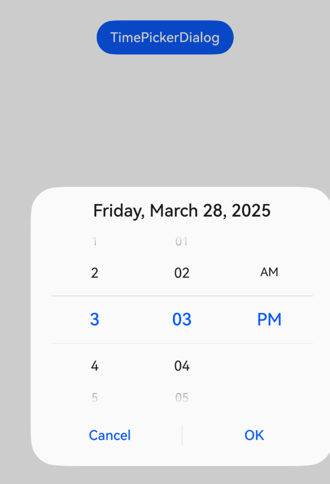
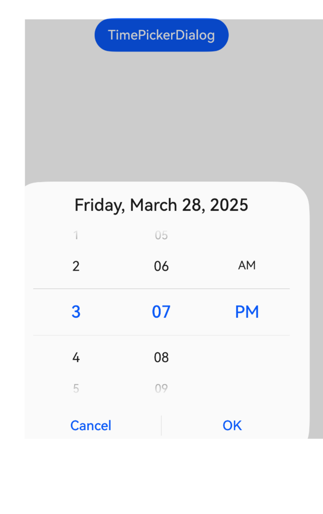
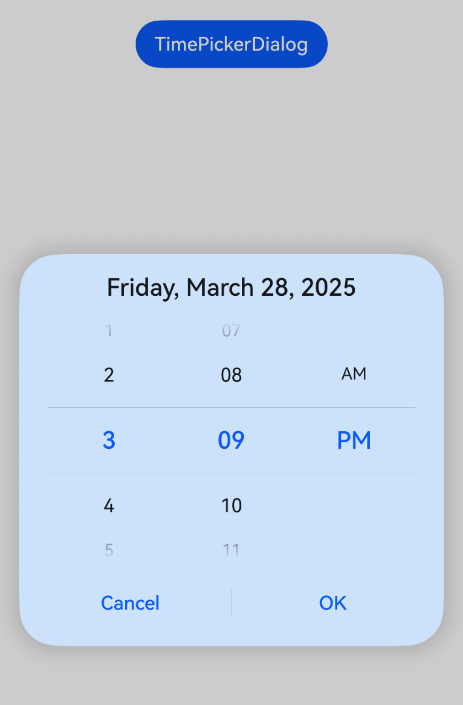
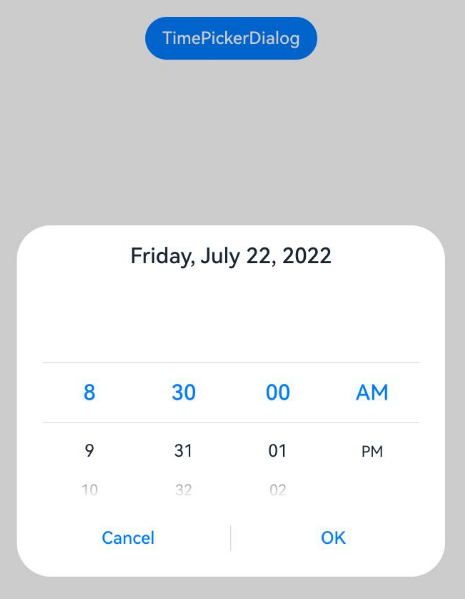
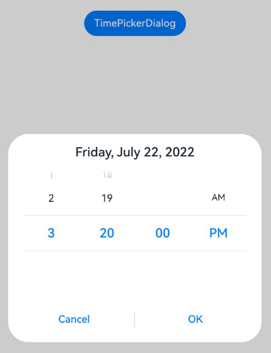
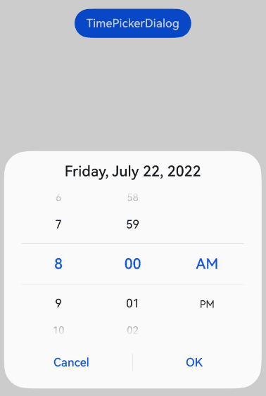

# Time Picker Dialog Box (TimePickerDialog)
<!--Kit: ArkUI-->
<!--Subsystem: ArkUI-->
<!--Owner: @luoying_ace_admin-->
<!--SE: @weixin_52725220-->
<!--TSE: @xiong0104-->

A time picker dialog box is a dialog box that allows users to select a time from the 24-hour range through scrolling.

>  **NOTE**
>
> - The APIs of this module are supported since API version 8. Updates will be marked with a superscript to indicate their earliest API version.
>
> - The functionality of this module depends on UI context. This means that the APIs of this module cannot be used where [the UI context is unclear](../../../ui/arkts-global-interface.md). For details, see [UIContext](../arkts-apis-uicontext-uicontext.md).

## TimePickerDialog

### show<sup>(deprecated)</sup>

static show(options?: TimePickerDialogOptions)

Shows a time picker dialog box.

> **NOTE**
> 
> This API is deprecated since API version 18. You are advised to use [showTimePickerDialog](../arkts-apis-uicontext-uicontext.md#showtimepickerdialog) in [UIContext](../arkts-apis-uicontext-uicontext.md) instead.
>
> Since API version 10, you can use the [showTimePickerDialog](../arkts-apis-uicontext-uicontext.md#showtimepickerdialog) API in [UIContext](../arkts-apis-uicontext-uicontext.md), which ensures that the time picker dialog box is shown in the intended UI instance.

**Atomic service API**: This API can be used in atomic services since API version 11.

**System capability**: SystemCapability.ArkUI.ArkUI.Full

**Device behavior**: This API has no effect on wearables and works on other devices.

**Parameters**

| Name | Type                                                       | Mandatory| Description                      |
| ------- | ----------------------------------------------------------- | ---- | -------------------------- |
| options | [TimePickerDialogOptions](#timepickerdialogoptions) | No  | Parameters of the time picker dialog box.|

## TimePickerDialogOptions

Defines the configuration options of the time picker dialog box.

Inherited from [TimePickerOptions](ts-basic-components-timepicker.md#timepickeroptions).

**System capability**: SystemCapability.ArkUI.ArkUI.Full

| Name| Type| Read-Only| Optional| Description|
| -------- | -------- | -------- | -------- | -------- |
| useMilitaryTime | boolean | No| Yes| Whether to display time in 24-hour format. The 12-hour format is used by default.<br>Default value: **false**<br>**NOTE**<br>When in the 12-hour format, the AM/PM zone does not change depending on the hour portion.<br>**Atomic service API**: This API can be used in atomic services since API version 11.|
| disappearTextStyle<sup>10+</sup> | [PickerTextStyle](ts-picker-common.md#pickertextstyle) | No| Yes| Text color, font size, and font weight of the items located two positions above or below the selected item.<br>Default value:<br>{<br>color: '#ff182431',<br>font: {<br>size: '14fp', <br>weight: FontWeight.Regular<br>}<br>}<br>**Atomic service API**: This API can be used in atomic services since API version 11.|
| textStyle<sup>10+</sup> | [PickerTextStyle](ts-picker-common.md#pickertextstyle) | No| Yes| Text color, font size, and font weight of the items located one position above or below the selected item.<br>Default value:<br>{<br>color: '#ff182431',<br>font: {<br>size: '16fp', <br>weight: FontWeight.Regular<br>}<br>}<br>**Atomic service API**: This API can be used in atomic services since API version 11.|
| selectedTextStyle<sup>10+</sup> | [PickerTextStyle](ts-picker-common.md#pickertextstyle) | No| Yes| Font color, font size, and font weight of the selected item.<br>Default value:<br>{<br>color: '#ff007dff',<br>font: {<br>size: '20fp', <br>weight: FontWeight.Medium<br>}<br>}<br>**Atomic service API**: This API can be used in atomic services since API version 11.|
| acceptButtonStyle<sup>12+</sup> | [PickerDialogButtonStyle](ts-picker-common.md#pickerdialogbuttonstyle12) | No| Yes| Style of the accept button.<br>**NOTE**<br> 1. In **acceptButtonStyle** and **cancelButtonStyle**, at most one **primary** field can be set to **true**. If both are set to **true**, the **primary** field will remain at the default value of **false**.<br>2. The default button height is 40 vp and remains fixed even in accessibility and large-font modes. In addition, even if the button style is set to [ROUNDED_RECTANGLE](ts-basic-components-button.md#buttontype), the displayed effect is still a capsule button ([Capsule](ts-basic-components-button.md#buttontype)).<br>**Atomic service API**: This API can be used in atomic services since API version 12.|
| cancelButtonStyle<sup>12+</sup> | [PickerDialogButtonStyle](ts-picker-common.md#pickerdialogbuttonstyle12) | No| Yes| Style of the cancel button.<br>**NOTE**<br>1. In **acceptButtonStyle** and **cancelButtonStyle**, at most one **primary** field can be set to **true**. If both are set to **true**, the **primary** field will remain at the default value of **false**.<br>2. The default button height is 40 vp and remains fixed even in accessibility and large-font modes. In addition, even if the button style is set to [ROUNDED_RECTANGLE](ts-basic-components-button.md#buttontype), the displayed effect is still a capsule button ([Capsule](ts-basic-components-button.md#buttontype)).<br>**Atomic service API**: This API can be used in atomic services since API version 12.|
| alignment<sup>10+</sup>  | [DialogAlignment](ts-methods-alert-dialog-box.md#dialogalignment) | No | Yes | Alignment mode of the dialog box in the vertical direction.<br>Default value: **DialogAlignment.Default**<br>**Atomic service API**: This API can be used in atomic services since API version 11.|
| offset<sup>10+</sup>     | [Offset](ts-types.md#offset) | No   | Yes   | Offset of the dialog box relative to the alignment position.<br>Default value: **{ dx: 0 , dy: 0 }**<br>**Atomic service API**: This API can be used in atomic services since API version 11.|
| maskRect<sup>10+</sup>| [Rectangle](ts-methods-alert-dialog-box.md#rectangle8) | No   | Yes   | Mask area of the dialog box. Events outside the mask area are transparently transmitted, and events within the mask area are not.<br>Default value: **{ x: 0, y: 0, width: '100%', height: '100%' }**<br>**Atomic service API**: This API can be used in atomic services since API version 11.|
| onAccept | (value: [TimePickerResult](ts-basic-components-timepicker.md#timepickerresult)) => void | No| Yes| Callback invoked when the OK button in the dialog box is clicked.<br>**Atomic service API**: This API can be used in atomic services since API version 11.|
| onCancel | () => void | No| Yes| Callback invoked when the Cancel button in the dialog box is clicked.<br>**Atomic service API**: This API can be used in atomic services since API version 11.|
| onChange | (value: [TimePickerResult](ts-basic-components-timepicker.md#timepickerresult)) => void | No| Yes| Triggered when the text picker in the dialog box snaps to the selected item.<br>**Atomic service API**: This API can be used in atomic services since API version 11.|
| backgroundColor<sup>11+</sup> | [ResourceColor](ts-types.md#resourcecolor)  | No| Yes| Backplane color of the dialog box.<br>Default value: **Color.Transparent**<br>**NOTE**<br>When **backgroundColor** is set to a non-transparent color, **backgroundBlurStyle** must be set to **BlurStyle.NONE**; otherwise, the color display may not meet the expected effect.<br>**Atomic service API**: This API can be used in atomic services since API version 12.|
| backgroundBlurStyle<sup>11+</sup> | [BlurStyle](ts-universal-attributes-background.md#blurstyle9) | No| Yes| Background blur style of the dialog box.<br>Default value: **BlurStyle.COMPONENT_ULTRA_THICK**<br>**NOTE**<br>Setting this parameter to **BlurStyle.NONE** disables the background blur. When **backgroundBlurStyle** is set to a value other than **NONE**, do not set **backgroundColor**. If you do, the color display may not produce the expected visual effect.<br>**Atomic service API**: This API can be used in atomic services since API version 12.|
| backgroundBlurStyleOptions<sup>19+</sup> | [BackgroundBlurStyleOptions](ts-universal-attributes-background.md#backgroundblurstyleoptions10) | No| Yes| Options for customizing the background blur style.<br>**Atomic service API**: This API can be used in atomic services since API version 19.|
| backgroundEffect<sup>19+</sup> | [BackgroundEffectOptions](ts-universal-attributes-background.md#backgroundeffectoptions11) | No| Yes| Options for customizing the background effect.<br>**Atomic service API**: This API can be used in atomic services since API version 19.|
| onDidAppear<sup>12+</sup> | () => void | No| Yes| Event callback when the dialog box appears.<br>**NOTE**<br>1. The normal timing sequence is as follows: onWillAppear > onDidAppear > (onAccept/onCancel/onChange) > onWillDisappear > onDidDisappear.<br>2. You can set the callback event for changing the dialog box display effect in **onDidAppear**. The settings take effect next time the dialog box appears.<br>3. If the user closes the dialog box immediately after it appears, **onWillDisappear** is invoked before **onDidAppear**.<br>4. If the dialog box is closed before its entrance animation is finished, this callback is not invoked.<br>**Atomic service API**: This API can be used in atomic services since API version 12.|
| onDidDisappear<sup>12+</sup> | () => void | No| Yes| Event callback when the dialog box disappears.<br>**NOTE**<br>1. The normal timing sequence is as follows: onWillAppear > onDidAppear > (onAccept/onCancel/onChange) > onWillDisappear > onDidDisappear.<br>**Atomic service API**: This API can be used in atomic services since API version 12.|
| onWillAppear<sup>12+</sup> | () => void | No| Yes| Event callback when the dialog box is about to appear.<br>**NOTE**<br>1. The normal timing sequence is as follows: onWillAppear > onDidAppear > (onAccept/onCancel/onChange) > onWillDisappear > onDidDisappear.<br>2. You can set the callback event for changing the dialog box display effect in **onWillAppear**. The settings take effect next time the dialog box appears.<br>**Atomic service API**: This API can be used in atomic services since API version 12.|
| onWillDisappear<sup>12+</sup> | () => void | No| Yes| Event callback when the dialog box is about to disappear.<br>**NOTE**<br>1. The normal timing sequence is as follows: onWillAppear > onDidAppear > (onAccept/onCancel/onChange) > onWillDisappear > onDidDisappear.<br>2. If the user closes the dialog box immediately after it appears, **onWillDisappear** is invoked before **onDidAppear**.<br>**Atomic service API**: This API can be used in atomic services since API version 12.|
| shadow<sup>12+</sup>              | [ShadowOptions](ts-universal-attributes-image-effect.md#shadowoptions) \| [ShadowStyle](ts-universal-attributes-image-effect.md#shadowstyle10) | No | Yes | Shadow of the dialog box.<br>Default value on 2-in-1 devices: **ShadowStyle.OUTER_FLOATING_MD** when the dialog box is focused and **ShadowStyle.OUTER_FLOATING_SM** otherwise<br>**Atomic service API**: This API can be used in atomic services since API version 12.|
| dateTimeOptions<sup>12+</sup> | [DateTimeOptions](../../apis-localization-kit/js-apis-intl.md#datetimeoptionsdeprecated) | No| Yes| Whether to display a leading zero for the hours and minutes. Currently only the configuration of the **hour** and **minute** parameters is supported.<br>Default value:<br>**hour**: For the 24-hour format, the default value is **"2-digit"**, meaning the hour is displayed as a two-digit number. If the actual value is less than 10, a leading zero is added, displayed as "0X". For the 12-hour format, the default value is **"numeric"**, meaning no leading zero.<br>**minute**: The default value is **"2-digit"**, meaning the minute is displayed as a two-digit number. If the actual value is less than 10, a leading zero is added, displayed as "0X".<br>**Atomic service API**: This API can be used in atomic services since API version 12.|
| enableHoverMode<sup>14+</sup>     | boolean | No | Yes | Whether to enable the hover mode.<br>Default value: **false**, meaning not to enable the hover mode.<br>**Atomic service API**: This API can be used in atomic services since API version 14.|
| hoverModeArea<sup>14+</sup>       | [HoverModeAreaType](ts-appendix-enums.md#hovermodeareatype14) | No | Yes | Display area of the dialog box in hover mode.<br>Default value: **HoverModeAreaType.BOTTOM_SCREEN**<br>**Atomic service API**: This API can be used in atomic services since API version 14.|
| onEnterSelectedArea<sup>18+</sup>   |  Callback\<[TimePickerResult](ts-basic-components-timepicker.md#timepickerresult)> | No | Yes |  Represents the callback triggered during the scrolling of the text picker when an item enters the divider area. Compared to the **onChange** event, this event is triggered earlier, specifically when the scroll distance of the current column exceeds half the height of the selected item, which indicates that the item has entered the divider area.<br>**NOTE**<br>When **enableCascade** is set to **true**, using this callback is not recommended due to the interdependent relationship between the AM/PM and hour columns. This callback indicates the moment an option enters the divider area during scrolling, and only the value of the currently scrolled column will change. The values of other non-scrolled columns will remain unchanged.<br>**Atomic service API**: This API can be used in atomic services since API version 18.|
| enableCascade<sup>18+</sup>              | boolean | No | Yes | Whether the AM/PM indicator automatically switches based on the hour in 12-hour format.<br>Default value: **false**. The value **true** means that the AM/PM indicator automatically switches based on the hour in 12-hour format, and **false** means the opposite.<br>**Atomic service API**: This API can be used in atomic services since API version 18.|
| enableHapticFeedback<sup>18+</sup> | boolean | No | Yes | Whether to enable haptic feedback.<br>The value **true** means to enable haptic feedback, and **false** means the opposite. The default value is **true**.<br>**Atomic service API**: This API can be used in atomic services since API version 18.<br>**Note**:<br>To enable haptic feedback, you must declare the ohos.permission.VIBRATE permission under **requestPermissions** in the **module.json5** file of the project.<br>"requestPermissions": [{"name": "ohos.permission.VIBRATE"}]|

**Handling in the case of exceptions**

| Exception  | Result |
| -------- |  ------------------------------------------------------------ |
| The start time is later than the end time.   | Both start time and end time are set to their default values. |
| The selected time is earlier than the start time.   | The selected time is set to the start time. |
| The selected time is later than the end time.   | The selected time is set to the end time. |
| The start time is later than the current system time, and the selected time is not set.   | The selected time is set to the start time.|
| The end time is earlier than the current system time, and the selected time is not set.   | The selected time is set to the end time. |
| The time format is invalid, such as **'01:61:61'**.  | The default value is used. |

## Example

>  **NOTE**
>
> For clarity in UI execution context, you are advised to use the [showTimePickerDialog](../arkts-apis-uicontext-uicontext.md#showtimepickerdialog) API in [UIContext](../arkts-apis-uicontext-uicontext.md).

### Example 1: Setting the Display Time Format

This example demonstrates how to set the display time using **useMilitaryTime**, **dateTimeOptions**, and **format**.

```ts
@Entry
@Component
struct TimePickerDialogExample {
  private selectTime: Date = new Date('2020-12-25T08:30:00');

  build() {
    Column() {
      Button("TimePickerDialog 12-hour format")
        .margin(20)
        .onClick(() => {
          this.getUIContext().showTimePickerDialog({
            selected: this.selectTime,
            format: TimePickerFormat.HOUR_MINUTE,
            useMilitaryTime: false,
            dateTimeOptions: { hour: "numeric", minute: "2-digit" },
            onAccept: (value: TimePickerResult) => {
              // Set selectTime to the time when the OK button is clicked. In this way, when the dialog box is displayed again, the selected time is the time when the operation was confirmed last time.
              if (value.hour != undefined && value.minute != undefined) {
                this.selectTime.setHours(value.hour, value.minute);
                console.info("TimePickerDialog:onAccept()" + JSON.stringify(value));
              }
            },
            onCancel: () => {
              console.info("TimePickerDialog:onCancel()");
            },
            onChange: (value: TimePickerResult) => {
              console.info("TimePickerDialog:onChange()" + JSON.stringify(value));
            },
            onDidAppear: () => {
              console.info("TimePickerDialog:onDidAppear()");
            },
            onDidDisappear: () => {
              console.info("TimePickerDialog:onDidDisappear()");
            },
            onWillAppear: () => {
              console.info("TimePickerDialog:onWillAppear()");
            },
            onWillDisappear: () => {
              console.info("TimePickerDialog:onWillDisappear()");
            }
          });
        })
      Button("TimePickerDialog 24-hour format")
        .margin(20)
        .onClick(() => {
          this.getUIContext().showTimePickerDialog({
            selected: this.selectTime,
            format: TimePickerFormat.HOUR_MINUTE_SECOND,
            useMilitaryTime: true,
            onAccept: (value: TimePickerResult) => {
              if (value.hour != undefined && value.minute != undefined) {
                this.selectTime.setHours(value.hour, value.minute);
                console.info("TimePickerDialog:onAccept()" + JSON.stringify(value));
              }
            },
          })
        })
    }.width('100%')
  }
}
```


### Example 2: Customizing the Style

In this example, **disappearTextStyle**, **textStyle**, **selectedTextStyle**, **acceptButtonStyle**, and **cancelButtonStyle** are configured to customize the text and button style.

```ts
// xxx.ets
@Entry
@Component
struct TimePickerDialogExample {
  private selectTime: Date = new Date('2020-12-25T08:30:00');

  build() {
    Column() {
      Button("TimePickerDialog 24-hour format")
        .margin(20)
        .onClick(() => {
          this.getUIContext().showTimePickerDialog({
            disappearTextStyle: { color: '#297bec', font: { size: 15, weight: FontWeight.Lighter } },
            textStyle: { color: Color.Black, font: { size: 20, weight: FontWeight.Normal } },
            selectedTextStyle: { color: Color.Blue, font: { size: 30, weight: FontWeight.Bolder } },
            acceptButtonStyle: {
              type: ButtonType.Normal,
              style: ButtonStyleMode.NORMAL,
              role: ButtonRole.NORMAL,
              fontColor: 'rgb(81, 81, 216)',
              fontSize: '26fp',
              fontWeight: FontWeight.Bolder,
              fontStyle: FontStyle.Normal,
              fontFamily: 'sans-serif',
              backgroundColor: '#A6ACAF',
              borderRadius: 20
            },
            cancelButtonStyle: {
              type: ButtonType.Normal,
              style: ButtonStyleMode.NORMAL,
              role: ButtonRole.NORMAL,
              fontColor: Color.Blue,
              fontSize: '16fp',
              fontWeight: FontWeight.Normal,
              fontStyle: FontStyle.Italic,
              fontFamily: 'sans-serif',
              backgroundColor: '#50182431',
              borderRadius: 10
            },
            onAccept: (value: TimePickerResult) => {
              if (value.hour != undefined && value.minute != undefined) {
                this.selectTime.setHours(value.hour, value.minute);
                console.info("TimePickerDialog:onAccept()" + JSON.stringify(value));
              }
            }
          });
        })
    }.width('100%')
  }
}
```


### Example 3: Configuring a Dialog Box in the Hover State

This example demonstrates how to set the layout area of a dialog box in hover mode on a foldable device.

```ts
@Entry
@Component
struct TimePickerDialogExample {
  private selectTime: Date = new Date('2020-12-25T08:30:00');

  build() {
    Column() {
      Button("TimePickerDialog 12-hour format")
        .margin(20)
        .onClick(() => {
          this.getUIContext().showTimePickerDialog({
            selected: this.selectTime,
            disappearTextStyle: { color: Color.Red, font: { size: 15, weight: FontWeight.Lighter } },
            textStyle: { color: Color.Black, font: { size: 20, weight: FontWeight.Normal } },
            selectedTextStyle: { color: Color.Blue, font: { size: 30, weight: FontWeight.Bolder } },
            onAccept: (value: TimePickerResult) => {
              // Set selectTime to the time when the OK button is clicked. In this way, when the dialog box is displayed again, the selected time is the time when the operation was confirmed last time.
              if (value.hour != undefined && value.minute != undefined) {
                this.selectTime.setHours(value.hour, value.minute);
                console.info("TimePickerDialog:onAccept()" + JSON.stringify(value));
              }
            },
            onCancel: () => {
              console.info("TimePickerDialog:onCancel()");
            },
            onChange: (value: TimePickerResult) => {
              console.info("TimePickerDialog:onChange()" + JSON.stringify(value));
            },
            onDidAppear: () => {
              console.info("TimePickerDialog:onDidAppear()");
            },
            onDidDisappear: () => {
              console.info("TimePickerDialog:onDidDisappear()");
            },
            onWillAppear: () => {
              console.info("TimePickerDialog:onWillAppear()");
            },
            onWillDisappear: () => {
              console.info("TimePickerDialog:onWillDisappear()");
            },
            enableHoverMode: true,
            hoverModeArea: HoverModeAreaType.TOP_SCREEN
          });
        })
    }.width('100%')
  }
}
```


### Example 4: Setting the Dialog Box Position

This example demonstrates how to set the position of a dialog box using **alignment** and **offset**.

```ts
// xxx.ets
@Entry
@Component
struct TimePickerDialogExample {
  private selectTime: Date = new Date('2020-12-25T08:30:00');

  build() {
    Column() {
      Button("TimePickerDialog")
        .margin(20)
        .onClick(() => {
          this.getUIContext().showTimePickerDialog({
            alignment: DialogAlignment.Center,
            offset: { dx: 20 , dy: 0 },
            onAccept: (value: TimePickerResult) => {
              // Set selectTime to the time when the OK button is clicked. In this way, when the dialog box is displayed again, the selected time is the time when the operation was confirmed last time.
              if (value.hour != undefined && value.minute != undefined) {
                this.selectTime.setHours(value.hour, value.minute);
                console.info("TimePickerDialog:onAccept()" + JSON.stringify(value));
              }
            }
          });
        })
    }.width('100%')
  }
}
```



### Example 5: Setting the Mask Area

This example demonstrates how to set the mask area using **maskRect**.

```ts
// xxx.ets
@Entry
@Component
struct TimePickerDialogExample {
  private selectTime: Date = new Date('2020-12-25T08:30:00');

  build() {
    Column() {
      Button("TimePickerDialog")
        .margin(20)
        .onClick(() => {
          this.getUIContext().showTimePickerDialog({
            maskRect: { x: 30, y: 60, width: '100%', height: '60%' },
            onAccept: (value: TimePickerResult) => {
              // Set selectTime to the time when the OK button is clicked. In this way, when the dialog box is displayed again, the selected time is the time when the operation was confirmed last time.
              if (value.hour != undefined && value.minute != undefined) {
                this.selectTime.setHours(value.hour, value.minute);
                console.info("TimePickerDialog:onAccept()" + JSON.stringify(value));
              }
            }
          });
        })
    }.width('100%')
  }
}
```



### Example 6: Setting the Background

This example demonstrates how to set the dialog box background using **maskRect**.

```ts
// xxx.ets
@Entry
@Component
struct TimePickerDialogExample {
  private selectTime: Date = new Date('2020-12-25T08:30:00');

  build() {
    Column() {
      Button("TimePickerDialog")
        .margin(20)
        .onClick(() => {
          this.getUIContext().showTimePickerDialog({
            backgroundColor: 'rgb(204, 226, 251)',
            backgroundBlurStyle: BlurStyle.NONE,
            shadow: ShadowStyle.OUTER_FLOATING_SM,
            onAccept: (value: TimePickerResult) => {
              // Set selectTime to the time when the OK button is clicked. In this way, when the dialog box is displayed again, the selected time is the time when the operation was confirmed last time.
              if (value.hour != undefined && value.minute != undefined) {
                this.selectTime.setHours(value.hour, value.minute);
                console.info("TimePickerDialog:onAccept()" + JSON.stringify(value));
              }
            }
          });
        })
    }.width('100%')
  }
}
```


### Example 7: Setting the Start Time

This example demonstrates how to set the start time for the time picker dialog box.

```ts
// xxx.ets
@Entry
@Component
struct TimePickerDialogExample {
  private selectTime: Date = new Date('2022-07-22T08:50:00');

  build() {
    Column() {
      Button("TimePickerDialog")
        .margin(20)
        .onClick(() => {
          this.getUIContext().showTimePickerDialog({
            useMilitaryTime: false,
            selected: this.selectTime,
            format: TimePickerFormat.HOUR_MINUTE_SECOND,
            start: new Date('2022-07-22T08:30:00'),
            onAccept: (value: TimePickerResult) => {
              // Set selectTime to the time when the OK button is clicked. In this way, when the dialog box is displayed again, the selected time is the time when the operation was confirmed last time.
              if (value.hour != undefined && value.minute != undefined) {
                this.selectTime.setHours(value.hour, value.minute);
                console.info("TimePickerDialog:onAccept()" + JSON.stringify(value));
              }
            }
          });
        })
    }.width('100%')
  }
}
```


### Example 8: Setting the End Time

This example demonstrates how to set the end time for the time picker dialog box.

```ts
// xxx.ets
@Entry
@Component
struct TimePickerDialogExample {
  private selectTime: Date = new Date('2022-07-22T08:50:00');

  build() {
    Column() {
      Button("TimePickerDialog")
        .margin(20)
        .onClick(() => {
          this.getUIContext().showTimePickerDialog({
            useMilitaryTime: false,
            selected: this.selectTime,
            format: TimePickerFormat.HOUR_MINUTE_SECOND,
            end: new Date('2022-07-22T15:20:00'),
            onAccept: (value: TimePickerResult) => {
              // Set selectTime to the time when the OK button is clicked. In this way, when the dialog box is displayed again, the selected time is the time when the operation was confirmed last time.
              if (value.hour != undefined && value.minute != undefined) {
                this.selectTime.setHours(value.hour, value.minute);
                console.info("TimePickerDialog:onAccept()" + JSON.stringify(value));
              }
            }
          });
        })
    }.width('100%')
  }
}
```


### Example 9: Enabling the AM/PM Indicator to Automatically Switch Based on the Hour in 12-hour Format

This example demonstrates how to enable AM/PM indicator to automatically switch based on the hour in 12-hour format using **enableCascade**.

```ts
// xxx.ets
@Entry
@Component
struct TimePickerDialogExample {
  private selectTime: Date = new Date('2022-07-22T08:00:00');

  build() {
    Column() {
      Button("TimePickerDialog")
        .margin(20)
        .onClick(() => {
          this.getUIContext().showTimePickerDialog({
            useMilitaryTime: false,
            selected: this.selectTime,
            enableCascade:true,
            onAccept: (value: TimePickerResult) => {
              // Set selectTime to the time when the OK button is clicked. In this way, when the dialog box is displayed again, the selected time is the time when the operation was confirmed last time.
              if (value.hour != undefined && value.minute != undefined) {
                this.selectTime.setHours(value.hour, value.minute);
                console.info("TimePickerDialog:onAccept()" + JSON.stringify(value));
              }
            }
          });
        })
    }.width('100%')
  }
}
```



### Example 10: Customizing the Background Blur Effect

This example demonstrates how to customize the background blur effect by configuring [backgroundBlurStyleOptions](#timepickerdialogoptions). This functionality is supported since API version 19.

```ts
@Entry
@Component
struct TimePickerDialogExample {
  build() {
    Stack({ alignContent: Alignment.Top }) {
      Image($r('app.media.bg'))
      Column() {
        Button("TimePickerDialog")
          .margin(20)
          .onClick(() => {
            this.getUIContext().showTimePickerDialog({
              backgroundColor: undefined,
              backgroundBlurStyle: BlurStyle.Thin,
              backgroundBlurStyleOptions: {
                colorMode: ThemeColorMode.LIGHT,
                adaptiveColor: AdaptiveColor.AVERAGE,
                scale: 1,
                blurOptions: { grayscale: [20, 20] },
              },
            });
          })
      }.width('100%')
    }
  }
}
```


### Example 11: Customizing the Background Effect

This example demonstrates how to customize the background effect by configuring [backgroundEffect](#timepickerdialogoptions). This functionality is supported since API version 19.

```ts
@Entry
@Component
struct TimePickerDialogExample {
  build() {
    Stack({ alignContent: Alignment.Top }) {
      Image($r('app.media.bg'))
      Column() {
        Button("TimePickerDialog")
          .margin(20)
          .onClick(() => {
            this.getUIContext().showTimePickerDialog({
              backgroundColor: undefined,
              backgroundBlurStyle: BlurStyle.Thin,
              backgroundEffect: {
                radius: 60,
                saturation: 0,
                brightness: 1,
                color: Color.White,
                blurOptions: { grayscale: [20, 20] }
              },
            });
          })
      }.width('100%')
    }
  }
}
```


