# OffscreenCanvasRenderingContext2D

Use **OffscreenCanvasRenderingContext2D** to draw rectangles, images, and text offscreen onto a canvas. Drawing offscreen onto a canvas is a process where content to draw onto the canvas is first drawn in the buffer, and then converted into a picture, and finally the picture is drawn on the canvas. This process increases the drawing efficiency.

>  **NOTE**
>
>  The APIs of this module are supported since API version 8. Updates will be marked with a superscript to indicate their earliest API version.


## APIs

OffscreenCanvasRenderingContext2D(width: number, height: number, settings?: RenderingContextSettings, unit?: LengthMetricsUnit)

**Widget capability**: This API can be used in ArkTS widgets since API version 9.

**Atomic service API**: This API can be used in atomic services since API version 11.

**System capability**: SystemCapability.ArkUI.ArkUI.Full

**Parameters**

| Name     | Type     | Mandatory  | Description |
| -------- | ---------------------------------------- | ---- | ------------------------------ |
| width    | number                                   | Yes   | Width of the offscreen canvas.<br>Default unit: vp                       |
| height   | number                                   | Yes   | Height of the offscreen canvas.<br>Default unit: vp                       |
| settings | [RenderingContextSettings](ts-canvasrenderingcontext2d.md#renderingcontextsettings) | No   | Settings of the **OffscreenCanvasRenderingContext2D** object. For details, see **RenderingContextSettings**.<br>Default value: **null** |
| unit<sup>12+</sup> | [LengthMetricsUnit](../js-apis-arkui-graphics.md#lengthmetricsunit12) | No | Unit mode of the **OffscreenCanvasRenderingContext2D** object. The value cannot be dynamically changed once set. The configuration method is the same as that of [CanvasRenderingContext2D](ts-canvasrenderingcontext2d.md#lengthmetricsunit12).<br>Default value: **DEFAULT**|

## Attributes

**Widget capability**: This API can be used in ArkTS widgets since API version 9.

**Atomic service API**: This API can be used in atomic services since API version 11.

**System capability**: SystemCapability.ArkUI.ArkUI.Full

| Name | Type | Read Only | Optional | Description |
| ---- | ---- | ---- | ---- | ---- |
| [fillStyle](#fillstyle) | string \|number<sup>10+</sup> \|[CanvasGradient](ts-components-canvas-canvasgradient.md) \| [CanvasPattern](ts-components-canvas-canvaspattern.md#canvaspattern) | No | No | Style to fill an area.<br>- When the type is **string**, this attribute indicates the color of the filling area.<br>- When the type is **number**, this attribute indicates the color of the filling area.<br>- When the type is **CanvasGradient**, this attribute indicates a gradient object, which is created using the **[createLinearGradient](#createlineargradient)** API.<br>- When the type is **CanvasPattern**, this attribute indicates a pattern, which is created using the **[createPattern](#createpattern)** API. |
| [lineWidth](#linewidth)                  | number                                   | No | No | Line width.<br>Default unit: vp<br>The value cannot be **0** or a negative number. If it is set to **0** or a negative number, the default value is used instead. |
| [strokeStyle](#strokestyle)              | string \|number<sup>10+</sup> \|[CanvasGradient](ts-components-canvas-canvasgradient.md) \| [CanvasPattern](ts-components-canvas-canvaspattern.md#canvaspattern) | No | No | Stroke color.<br> <br> <br>- When the type is **CanvasGradient**, this attribute indicates a gradient object, which is created using the **[createLinearGradient](#createlineargradient)** API.<br>- When the type is **CanvasPattern**, this attribute indicates a pattern, which is created using the **[createPattern](#createpattern)** API. |
| [lineCap](#linecap) | [CanvasLineCap](ts-canvasrenderingcontext2d.md#canvaslinecap) | No | No | Style of the line endpoints. The options are as follows:<br>- **butt**: The endpoints of the line are squared off.<br>- **round**: The endpoints of the line are rounded.<br>- **square**: The endpoints of the line are squared off, and each endpoint has added a rectangle whose length is the same as the line thickness and whose width is half of the line thickness.<br>Default value: **'butt'** |
| [lineJoin](#linejoin) | [CanvasLineJoin](ts-canvasrenderingcontext2d.md#canvaslinejoin) | No | No | Style of the shape used to join line segments. The options are as follows:<br>- **round**: The intersection is a sector, whose radius at the rounded corner is equal to the line width.<br>- **bevel**: The intersection is a triangle. The rectangular corner of each line is independent.<br>- **miter**: The intersection has a miter corner by extending the outside edges of the lines until they meet. You can view the effect of this attribute in **miterLimit**.<br>Default value: **'miter'** |
| [miterLimit](#miterlimit) | number | No | No | Maximum miter length. The miter length is the distance between the inner corner and the outer corner where two lines meet.<br>Default value: **10**<br>Unit: px<br>The value cannot be **0** or a negative number. If it is set to **0** or a negative number, the default value is used instead. |
| [font](#font) | string | No | No | Font style.<br>Syntax: ctx.font='font-size font-family'<br>- (Optional) **font-size**: font size and line height. The unit can be px or vp.<br>(Optional) **font-family**: font family.<br>Syntax: ctx.font='font-style font-weight font-size font-family'<br>- (Optional) **font-style**: font style. Available values are **normal** and **italic**.<br>- (Optional) **font-weight**: font weight. Available values are as follows: **normal**, **bold**, **bolder**, **lighter**, **100**, **200**, **300**, **400**, **500**, **600**, **700**, **800**, **900**.<br>- (Optional) **font-size**: font size and line height. The unit can be px or vp and must be specified.<br>- (Optional) **font-family**: font family. Available values are **sans-serif**, **serif**, and **monospace**.<br>Default value: **'normal normal 14px sans-serif'** |
| [textAlign](#textalign) | [CanvasTextAlign](ts-canvasrenderingcontext2d.md#canvastextalign) | No | No | Text alignment mode. Available values are as follows:<br>- **left**: The text is left-aligned.<br>- **right**: The text is right-aligned.<br>- **center**: The text is center-aligned.<br>- **start**: The text is aligned with the start bound.<br>- **end**: The text is aligned with the end bound.<br>**NOTE**<br><br>In the **ltr** layout mode, the value **'start'** equals **'left'**. In the **rtl** layout mode, the value **'start'** equals **'right'**.<br>Default value: **'left'** |
| [textBaseline](#textbaseline)            | [CanvasTextBaseline](ts-canvasrenderingcontext2d.md#canvastextbaseline) | No | No | Horizontal alignment mode of text. Available values are as follows:<br>- **alphabetic**: The text baseline is the normal alphabetic baseline.<br>- **top**: The text baseline is on the top of the text bounding box.<br>- **hanging**: The text baseline is a hanging baseline over the text.<br>- **middle**: The text baseline is in the middle of the text bounding box.<br>**'ideographic'**: The text baseline is the ideographic baseline. If a character exceeds the alphabetic baseline, the ideographic baseline is located at the bottom of the excess character.<br>- **bottom**: The text baseline is at the bottom of the text bounding box. Its difference from the ideographic baseline is that the ideographic baseline does not consider letters in the next line.<br>Default value: **'alphabetic'** |
| [globalAlpha](#globalalpha) | number | No | No | Opacity.<br>**0.0**: completely transparent.<br>**1.0**: completely opaque.<br>Default value: **1.0** |
| [lineDashOffset](#linedashoffset) | number | No | No | Offset of the dashed line. The precision is float.<br>Default value: **0.0**<br>Unit: px |
| [globalCompositeOperation](#globalcompositeoperation) | string | No | No | Composition operation type. Available values are as follows: **'source-over'**, **'source-atop'**, **'source-in'**, **'source-out'**, **'destination-over'**, **'destination-atop'**, **'destination-in'**, **'destination-out'**, **'lighter'**, **'copy'**, and **'xor'**.<br>- Default value: **'source-over'** |
| [shadowBlur](#shadowblur)                | number | No | No | Blur level during shadow drawing. A larger value indicates a more blurred effect. The precision is float.<br>Default value: **0.0**<br>The value cannot be a negative number. If it is set to a negative number, the default value is used instead. |
| [shadowColor](#shadowcolor)              | string | No | No | Shadow color.<br>Default value: transparent black |
| [shadowOffsetX](#shadowoffsetx)          | number | No | No | X-axis shadow offset relative to the original object.<br>Default value: **0**<br>Default unit: vp |
| [shadowOffsetY](#shadowoffsety)          | number | No | No | Y-axis shadow offset relative to the original object.<br>Default value: **0**<br>Default unit: vp |
| [imageSmoothingEnabled](#imagesmoothingenabled) | boolean | No | No | Whether to adjust the image smoothness during image drawing. The value **true** means to enable this feature, and **false** means the opposite.<br>Default value: **true** |
| [imageSmoothingQuality](#imagesmoothingquality) | [ImageSmoothingQuality](ts-canvasrenderingcontext2d.md#imagesmoothingquality-1) | No | No | Quality of image smoothing. This attribute works only when **imageSmoothingEnabled** is set to **true**. Available values are as follows:<br>- **'low'**: low quality.<br>- **'medium'**: medium quality.<br>- **'high'**: high quality.<br>Default value: **'low'** |
| [direction](#direction)                  | [CanvasDirection](ts-canvasrenderingcontext2d.md#canvasdirection) | No | No | Text direction used for drawing text. Available values are as follows:<br>- **'inherit'** The default layout direction is used.<br>- **'ltr'**: The text direction is from left to right.<br>- **'rtl'**: The text direction is from right to left.<br>Default value: **'inherit'** |
| [filter](#filter)                        | string | No | No | Filter effect. Available values are as follows:<br>- **'none'**: no filter effect.<br>- **'blur'**: applies the Gaussian blur for the image.<br>- **'brightness'**: applies a linear multiplication to the image to make it look brighter or darker.<br>- **'contrast'**: adjusts the image contrast.<br>- **'grayscale'**: converts the image to a grayscale image.<br>- **'hue-rotate'**: applies hue rotation to the image.<br>- **'invert'**: inverts the input image.<br>- **'opacity'**: sets the opacity of the image.<br>- **'saturate'**: sets the saturation of the image.<br>- **'sepia'**: converts the image to dark brown.<br>Default value: **'none'** |

> **NOTE**
> For **fillStyle**, **shadowColor**, and **strokeStyle**, the value format of the string type is 'rgb(255, 255, 255)', 'rgba(255, 255, 255, 1.0)', '\#FFFFFF'.


### fillStyle

```ts
// xxx.ets
@Entry
@Component
struct FillStyleExample {
  private settings: RenderingContextSettings = new RenderingContextSettings(true)
  private context: CanvasRenderingContext2D = new CanvasRenderingContext2D(this.settings)
  private offCanvas: OffscreenCanvas = new OffscreenCanvas(600, 600)

  build() {
    Flex({ direction: FlexDirection.Column, alignItems: ItemAlign.Center, justifyContent: FlexAlign.Center }) {
      Canvas(this.context)
        .width('100%')
        .height('100%')
        .backgroundColor('#ffff00')
        .onReady(() =>{
          let offContext = this.offCanvas.getContext("2d", this.settings)
          offContext.fillStyle = '#0000ff'
          offContext.fillRect(20, 20, 150, 100)
          let image = this.offCanvas.transferToImageBitmap()
          this.context.transferFromImageBitmap(image)
        })
    }
    .width('100%')
    .height('100%')
  }
}
```


```ts
// xxx.ets
@Entry
@Component
struct FillStyleExample {
  private settings: RenderingContextSettings = new RenderingContextSettings(true)
  private context: CanvasRenderingContext2D = new CanvasRenderingContext2D(this.settings)
  private offCanvas: OffscreenCanvas = new OffscreenCanvas(600, 600)

  build() {
    Flex({ direction: FlexDirection.Column, alignItems: ItemAlign.Center, justifyContent: FlexAlign.Center }) {
      Canvas(this.context)
        .width('100%')
        .height('100%')
        .backgroundColor('#ffff00')
        .onReady(() =>{
          let offContext = this.offCanvas.getContext("2d", this.settings)
          offContext.fillStyle = 0x0000FF
          offContext.fillRect(20, 20, 150, 100)
          let image = this.offCanvas.transferToImageBitmap()
          this.context.transferFromImageBitmap(image)
        })
    }
    .width('100%')
    .height('100%')
  }
}
```


### lineWidth

```ts
// xxx.ets
@Entry
@Component
struct LineWidthExample {
  private settings: RenderingContextSettings = new RenderingContextSettings(true)
  private context: CanvasRenderingContext2D = new CanvasRenderingContext2D(this.settings)
  private offCanvas: OffscreenCanvas = new OffscreenCanvas(600, 600)

  build() {
    Flex({ direction: FlexDirection.Column, alignItems: ItemAlign.Center, justifyContent: FlexAlign.Center }) {
      Canvas(this.context)
        .width('100%')
        .height('100%')
        .backgroundColor('#ffff00')
        .onReady(() =>{
          let offContext = this.offCanvas.getContext("2d", this.settings)
          offContext.lineWidth = 5
          offContext.strokeRect(25, 25, 85, 105)
          let image = this.offCanvas.transferToImageBitmap()
          this.context.transferFromImageBitmap(image)
      })
    }
    .width('100%')
    .height('100%')
  }
}
```

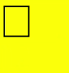


### strokeStyle

```ts
// xxx.ets
@Entry
@Component
struct StrokeStyleExample {
  private settings: RenderingContextSettings = new RenderingContextSettings(true)
  private context: CanvasRenderingContext2D = new CanvasRenderingContext2D(this.settings)
  private offCanvas: OffscreenCanvas = new OffscreenCanvas(600, 600)

  build() {
    Flex({ direction: FlexDirection.Column, alignItems: ItemAlign.Center, justifyContent: FlexAlign.Center }) {
      Canvas(this.context)
        .width('100%')
        .height('100%')
        .backgroundColor('#ffff00')
        .onReady(() =>{
          let offContext = this.offCanvas.getContext("2d", this.settings)
          offContext.lineWidth = 10
          offContext.strokeStyle = '#0000ff'
          offContext.strokeRect(25, 25, 155, 105)
          let image = this.offCanvas.transferToImageBitmap()
          this.context.transferFromImageBitmap(image)
        })
    }
    .width('100%')
    .height('100%')
  }
}
```


```ts
// xxx.ets
@Entry
@Component
struct StrokeStyleExample {
  private settings: RenderingContextSettings = new RenderingContextSettings(true)
  private context: CanvasRenderingContext2D = new CanvasRenderingContext2D(this.settings)
  private offCanvas: OffscreenCanvas = new OffscreenCanvas(600, 600)

  build() {
    Flex({ direction: FlexDirection.Column, alignItems: ItemAlign.Center, justifyContent: FlexAlign.Center }) {
      Canvas(this.context)
        .width('100%')
        .height('100%')
        .backgroundColor('#ffff00')
        .onReady(() =>{
          let offContext = this.offCanvas.getContext("2d", this.settings)
          offContext.lineWidth = 10
          offContext.strokeStyle = 0x0000ff
          offContext.strokeRect(25, 25, 155, 105)
          let image = this.offCanvas.transferToImageBitmap()
          this.context.transferFromImageBitmap(image)
        })
    }
    .width('100%')
    .height('100%')
  }
}
```


### lineCap

```ts
// xxx.ets
@Entry
@Component
struct LineCapExample {
  private settings: RenderingContextSettings = new RenderingContextSettings(true)
  private context: CanvasRenderingContext2D = new CanvasRenderingContext2D(this.settings)
  private offCanvas: OffscreenCanvas = new OffscreenCanvas(600, 600)

  build() {
    Flex({ direction: FlexDirection.Column, alignItems: ItemAlign.Center, justifyContent: FlexAlign.Center }) {
      Canvas(this.context)
        .width('100%')
        .height('100%')
        .backgroundColor('#ffff00')
        .onReady(() =>{
          let offContext = this.offCanvas.getContext("2d", this.settings)
          offContext.lineWidth = 8
          offContext.beginPath()
          offContext.lineCap = 'round'
          offContext.moveTo(30, 50)
          offContext.lineTo(220, 50)
          offContext.stroke()
          let image = this.offCanvas.transferToImageBitmap()
          this.context.transferFromImageBitmap(image)
        })
    }
    .width('100%')
    .height('100%')
  }
}
```


### lineJoin

```ts
// xxx.ets
@Entry
@Component
struct LineJoinExample {
  private settings: RenderingContextSettings = new RenderingContextSettings(true)
  private context: CanvasRenderingContext2D = new CanvasRenderingContext2D(this.settings)
  private offCanvas: OffscreenCanvas = new OffscreenCanvas(600, 600)

  build() {
    Flex({ direction: FlexDirection.Column, alignItems: ItemAlign.Center, justifyContent: FlexAlign.Center }) {
      Canvas(this.context)
        .width('100%')
        .height('100%')
        .backgroundColor('#ffff00')
        .onReady(() =>{
          let offContext = this.offCanvas.getContext("2d", this.settings)
          offContext.beginPath()
          offContext.lineWidth = 8
          offContext.lineJoin = 'miter'
          offContext.moveTo(30, 30)
          offContext.lineTo(120, 60)
          offContext.lineTo(30, 110)
          offContext.stroke()
          let image = this.offCanvas.transferToImageBitmap()
          this.context.transferFromImageBitmap(image)
      })
    }
    .width('100%')
    .height('100%')
  }
}
```


### miterLimit

```ts
// xxx.ets
@Entry
@Component
struct MiterLimit {
  private settings: RenderingContextSettings = new RenderingContextSettings(true)
  private context: CanvasRenderingContext2D = new CanvasRenderingContext2D(this.settings)
  private offCanvas: OffscreenCanvas = new OffscreenCanvas(600, 600)
  
  build() {
    Flex({ direction: FlexDirection.Column, alignItems: ItemAlign.Center, justifyContent: FlexAlign.Center }) {
      Canvas(this.context)
        .width('100%')
        .height('100%')
        .backgroundColor('#ffff00')
        .onReady(() =>{
          let offContext = this.offCanvas.getContext("2d", this.settings)
          offContext.lineWidth = 8
          offContext.lineJoin = 'miter'
          offContext.miterLimit = 3
          offContext.moveTo(30, 30)
          offContext.lineTo(60, 35)
          offContext.lineTo(30, 37)
          offContext.stroke()
          let image = this.offCanvas.transferToImageBitmap()
          this.context.transferFromImageBitmap(image)
      })
    }
    .width('100%')
    .height('100%')
  }
}
```


### font

```ts
// xxx.ets
@Entry
@Component
struct Fonts {
  private settings: RenderingContextSettings = new RenderingContextSettings(true)
  private context: CanvasRenderingContext2D = new CanvasRenderingContext2D(this.settings)
  private offCanvas: OffscreenCanvas = new OffscreenCanvas(600, 600)

  build() {
    Flex({ direction: FlexDirection.Column, alignItems: ItemAlign.Center, justifyContent: FlexAlign.Center }) {
      Canvas(this.context)
        .width('100%')
        .height('100%')
        .backgroundColor('#ffff00')
        .onReady(() =>{
          let offContext = this.offCanvas.getContext("2d", this.settings)
          offContext.font = '30px sans-serif'
          offContext.fillText("Hello px", 20, 60)
          offContext.font = '30vp sans-serif'
          offContext.fillText("Hello vp", 20, 100)
          let image = this.offCanvas.transferToImageBitmap()
          this.context.transferFromImageBitmap(image)
        })
    }
    .width('100%')
    .height('100%')
  }
}
```


### textAlign

```ts
// xxx.ets
@Entry
@Component
struct CanvasExample {
  private settings: RenderingContextSettings = new RenderingContextSettings(true)
  private context: CanvasRenderingContext2D = new CanvasRenderingContext2D(this.settings)
  private offCanvas: OffscreenCanvas = new OffscreenCanvas(600, 600)
  
  build() {
    Flex({ direction: FlexDirection.Column, alignItems: ItemAlign.Center, justifyContent: FlexAlign.Center }) {
      Canvas(this.context)
        .width('100%')
        .height('100%')
        .backgroundColor('#ffff00')
        .onReady(() =>{
        let offContext = this.offCanvas.getContext("2d", this.settings)
        offContext.strokeStyle = '#0000ff'
        offContext.moveTo(140, 10)
        offContext.lineTo(140, 160)
        offContext.stroke()

        offContext.font = '18px sans-serif'

        offContext.textAlign = 'start'
        offContext.fillText('textAlign=start', 140, 60)
        offContext.textAlign = 'end'
        offContext.fillText('textAlign=end', 140, 80)
        offContext.textAlign = 'left'
        offContext.fillText('textAlign=left', 140, 100)
        offContext.textAlign = 'center'
        offContext.fillText('textAlign=center',140, 120)
        offContext.textAlign = 'right'
        offContext.fillText('textAlign=right',140, 140)
        let image = this.offCanvas.transferToImageBitmap()
        this.context.transferFromImageBitmap(image)
      })
    }
    .width('100%')
    .height('100%')
  }
}
```


### textBaseline

```ts
// xxx.ets
@Entry
@Component
struct TextBaseline {
  private settings: RenderingContextSettings = new RenderingContextSettings(true)
  private context: CanvasRenderingContext2D = new CanvasRenderingContext2D(this.settings)
  private offCanvas: OffscreenCanvas = new OffscreenCanvas(600, 600)
  
  build() {
    Flex({ direction: FlexDirection.Column, alignItems: ItemAlign.Center, justifyContent: FlexAlign.Center }) {
      Canvas(this.context)
        .width('100%')
        .height('100%')
        .backgroundColor('#ffff00')
        .onReady(() =>{
          let offContext = this.offCanvas.getContext("2d", this.settings)
          offContext.strokeStyle = '#0000ff'
          offContext.moveTo(0, 120)
          offContext.lineTo(400, 120)
          offContext.stroke()

          offContext.font = '20px sans-serif'

          offContext.textBaseline = 'top'
          offContext.fillText('Top', 10, 120)
          offContext.textBaseline = 'bottom'
          offContext.fillText('Bottom', 55, 120)
          offContext.textBaseline = 'middle'
          offContext.fillText('Middle', 125, 120)
          offContext.textBaseline = 'alphabetic'
          offContext.fillText('Alphabetic', 195, 120)
          offContext.textBaseline = 'hanging'
          offContext.fillText('Hanging', 295, 120)
          let image = this.offCanvas.transferToImageBitmap()
          this.context.transferFromImageBitmap(image)
      })
    }
    .width('100%')
    .height('100%')
  }
}
```


### globalAlpha

```ts
// xxx.ets
@Entry
@Component
struct GlobalAlpha {
  private settings: RenderingContextSettings = new RenderingContextSettings(true)
  private context: CanvasRenderingContext2D = new CanvasRenderingContext2D(this.settings)
  private offCanvas: OffscreenCanvas = new OffscreenCanvas(600, 600)
  
  build() {
    Flex({ direction: FlexDirection.Column, alignItems: ItemAlign.Center, justifyContent: FlexAlign.Center }) {
      Canvas(this.context)
        .width('100%')
        .height('100%')
        .backgroundColor('#ffff00')
        .onReady(() =>{
          let offContext = this.offCanvas.getContext("2d", this.settings)
          offContext.fillStyle = 'rgb(0,0,255)'
          offContext.fillRect(0, 0, 50, 50)
          offContext.globalAlpha = 0.4
          offContext.fillStyle = 'rgb(0,0,255)'
          offContext.fillRect(50, 50, 50, 50)
          let image = this.offCanvas.transferToImageBitmap()
          this.context.transferFromImageBitmap(image)
      })
    }
    .width('100%')
    .height('100%')
  }
}
```


### lineDashOffset

```ts
// xxx.ets
@Entry
@Component
struct LineDashOffset {
  private settings: RenderingContextSettings = new RenderingContextSettings(true)
  private context: CanvasRenderingContext2D = new CanvasRenderingContext2D(this.settings)
  private offCanvas: OffscreenCanvas = new OffscreenCanvas(600, 600)
  
  build() {
    Flex({ direction: FlexDirection.Column, alignItems: ItemAlign.Center, justifyContent: FlexAlign.Center }) {
      Canvas(this.context)
        .width('100%')
        .height('100%')
        .backgroundColor('#ffff00')
        .onReady(() =>{
          let offContext = this.offCanvas.getContext("2d", this.settings)
          offContext.arc(100, 75, 50, 0, 6.28)
          offContext.setLineDash([10,20])
          offContext.lineDashOffset = 10.0
          offContext.stroke()
          let image = this.offCanvas.transferToImageBitmap()
          this.context.transferFromImageBitmap(image)
      })
    }
    .width('100%')
    .height('100%')
  }
}

```


### globalCompositeOperation

| Name              | Description                      |
| ---------------- | ------------------------ |
| source-over      | Displays the new drawing above the existing drawing. This attribute is used by default.  |
| source-atop      | Displays the new drawing on the top of the existing drawing.       |
| source-in        | Displays the new drawing inside the existing drawing.        |
| source-out       | Displays part of the new drawing that is outside of the existing drawing.       |
| destination-over | Displays the existing drawing above the new drawing.       |
| destination-atop | Displays the existing drawing on the top of the new drawing.       |
| destination-in   | Displays the existing drawing inside the new drawing.        |
| destination-out  | Displays the existing drawing outside the new drawing.        |
| lighter          | Displays both the new and existing drawing.         |
| copy             | Displays the new drawing and neglects the existing drawing.       |
| xor              | Combines the new drawing and existing drawing using the XOR operation. |

```ts
// xxx.ets
@Entry
@Component
struct GlobalCompositeOperation {
  private settings: RenderingContextSettings = new RenderingContextSettings(true)
  private context: CanvasRenderingContext2D = new CanvasRenderingContext2D(this.settings)
  private offCanvas: OffscreenCanvas = new OffscreenCanvas(600, 600)
  
  build() {
    Flex({ direction: FlexDirection.Column, alignItems: ItemAlign.Center, justifyContent: FlexAlign.Center }) {
      Canvas(this.context)
        .width('100%')
        .height('100%')
        .backgroundColor('#ffff00')
        .onReady(() =>{
          let offContext = this.offCanvas.getContext("2d", this.settings)
          offContext.fillStyle = 'rgb(255,0,0)'
          offContext.fillRect(20, 20, 50, 50)
          offContext.globalCompositeOperation = 'source-over'
          offContext.fillStyle = 'rgb(0,0,255)'
          offContext.fillRect(50, 50, 50, 50)
          offContext.fillStyle = 'rgb(255,0,0)'
          offContext.fillRect(120, 20, 50, 50)
          offContext.globalCompositeOperation = 'destination-over'
          offContext.fillStyle = 'rgb(0,0,255)'
          offContext.fillRect(150, 50, 50, 50)
          let image = this.offCanvas.transferToImageBitmap()
          this.context.transferFromImageBitmap(image)
      })
    }
    .width('100%')
    .height('100%')
  }
}
```


### shadowBlur

```ts
// xxx.ets
@Entry
@Component
struct ShadowBlur {
  private settings: RenderingContextSettings = new RenderingContextSettings(true)
  private context: CanvasRenderingContext2D = new CanvasRenderingContext2D(this.settings)
  private offCanvas: OffscreenCanvas = new OffscreenCanvas(600, 600)
  
  build() {
    Flex({ direction: FlexDirection.Column, alignItems: ItemAlign.Center, justifyContent: FlexAlign.Center }) {
      Canvas(this.context)
        .width('100%')
        .height('100%')
        .backgroundColor('#ffff00')
        .onReady(() =>{
          let offContext = this.offCanvas.getContext("2d", this.settings)
          offContext.shadowBlur = 30
          offContext.shadowColor = 'rgb(0,0,0)'
          offContext.fillStyle = 'rgb(255,0,0)'
          offContext.fillRect(20, 20, 100, 80)
          let image = this.offCanvas.transferToImageBitmap()
          this.context.transferFromImageBitmap(image)
      })
    }
    .width('100%')
    .height('100%')
  }
}
```


### shadowColor

```ts
// xxx.ets
@Entry
@Component
struct ShadowColor {
  private settings: RenderingContextSettings = new RenderingContextSettings(true)
  private context: CanvasRenderingContext2D = new CanvasRenderingContext2D(this.settings)
  private offCanvas: OffscreenCanvas = new OffscreenCanvas(600, 600)
  
  build() {
    Flex({ direction: FlexDirection.Column, alignItems: ItemAlign.Center, justifyContent: FlexAlign.Center }) {
      Canvas(this.context)
        .width('100%')
        .height('100%')
        .backgroundColor('#ffff00')
        .onReady(() =>{
          let offContext = this.offCanvas.getContext("2d", this.settings)
          offContext.shadowBlur = 30
          offContext.shadowColor = 'rgb(0,0,255)'
          offContext.fillStyle = 'rgb(255,0,0)'
          offContext.fillRect(30, 30, 100, 100)
          let image = this.offCanvas.transferToImageBitmap()
          this.context.transferFromImageBitmap(image)
      })
    }
    .width('100%')
    .height('100%')
  }
}
```


### shadowOffsetX

```ts
// xxx.ets
@Entry
@Component
struct ShadowOffsetX {
  private settings: RenderingContextSettings = new RenderingContextSettings(true)
  private context: CanvasRenderingContext2D = new CanvasRenderingContext2D(this.settings)
  private offCanvas: OffscreenCanvas = new OffscreenCanvas(600, 600)
  
  build() {
    Flex({ direction: FlexDirection.Column, alignItems: ItemAlign.Center, justifyContent: FlexAlign.Center }) {
      Canvas(this.context)
        .width('100%')
        .height('100%')
        .backgroundColor('#ffff00')
        .onReady(() =>{
          let offContext = this.offCanvas.getContext("2d", this.settings)
          offContext.shadowBlur = 10
          offContext.shadowOffsetX = 20
          offContext.shadowColor = 'rgb(0,0,0)'
          offContext.fillStyle = 'rgb(255,0,0)'
          offContext.fillRect(20, 20, 100, 80)
          let image = this.offCanvas.transferToImageBitmap()
          this.context.transferFromImageBitmap(image)
      })
    }
    .width('100%')
    .height('100%')
  }
}
```


### shadowOffsetY

```ts
// xxx.ets
@Entry
@Component
struct ShadowOffsetY {
  private settings: RenderingContextSettings = new RenderingContextSettings(true)
  private context: CanvasRenderingContext2D = new CanvasRenderingContext2D(this.settings)
  private offCanvas: OffscreenCanvas = new OffscreenCanvas(600, 600)

  build() {
    Flex({ direction: FlexDirection.Column, alignItems: ItemAlign.Center, justifyContent: FlexAlign.Center }) {
      Canvas(this.context)
        .width('100%')
        .height('100%')
        .backgroundColor('#ffff00')
        .onReady(() =>{
          let offContext = this.offCanvas.getContext("2d", this.settings)
          offContext.shadowBlur = 10
          offContext.shadowOffsetY = 20
          offContext.shadowColor = 'rgb(0,0,0)'
          offContext.fillStyle = 'rgb(255,0,0)'
          offContext.fillRect(30, 30, 100, 100)
          let image = this.offCanvas.transferToImageBitmap()
          this.context.transferFromImageBitmap(image)
      })
    }
    .width('100%')
    .height('100%')
  }
}
```


### imageSmoothingEnabled

```ts
// xxx.ets
@Entry
@Component
struct ImageSmoothingEnabled {
  private settings: RenderingContextSettings = new RenderingContextSettings(true)
  private context: CanvasRenderingContext2D = new CanvasRenderingContext2D(this.settings)
  private img:ImageBitmap = new ImageBitmap("common/images/icon.jpg")
  private offCanvas: OffscreenCanvas = new OffscreenCanvas(600, 600)
  
  build() {
    Flex({ direction: FlexDirection.Column, alignItems: ItemAlign.Center, justifyContent: FlexAlign.Center }) {
      Canvas(this.context)
        .width('100%')
        .height('100%')
        .backgroundColor('#ffff00')
        .onReady(() =>{
          let offContext = this.offCanvas.getContext("2d", this.settings)
          offContext.imageSmoothingEnabled = false
          offContext.drawImage(this.img,0,0,400,200)
          let image = this.offCanvas.transferToImageBitmap()
          this.context.transferFromImageBitmap(image)
      })
    }
    .width('100%')
    .height('100%')
  }
}
```


### imageSmoothingQuality

```ts
  // xxx.ets
  @Entry
  @Component
  struct ImageSmoothingQualityDemoOff {
    private settings: RenderingContextSettings = new RenderingContextSettings(true);
    private context: CanvasRenderingContext2D = new CanvasRenderingContext2D(this.
settings);
    private offCanvas: OffscreenCanvas = new OffscreenCanvas(600, 600)
    private img:ImageBitmap = new ImageBitmap("common/images/example.jpg");

    build() {
      Flex({ direction: FlexDirection.Column, alignItems: ItemAlign.Center, 
justifyContent: FlexAlign.Center }) {
        Canvas(this.context)
          .width('100%')
          .height('100%')
          .backgroundColor('#ffff00')
          .onReady(() =>{
            let offContext = this.offCanvas.getContext("2d", this.settings)
            let offctx = offContext
            offctx.imageSmoothingEnabled = true
            offctx.imageSmoothingQuality = 'high'
            offctx.drawImage(this.img, 0, 0, 400, 200)

            let image = this.offCanvas.transferToImageBitmap()
            this.context.transferFromImageBitmap(image)
          })
      }
      .width('100%')
      .height('100%')
    }
  }
```

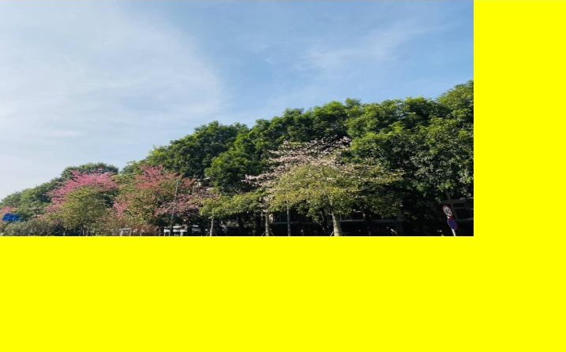

### direction

```ts
  // xxx.ets
  @Entry
  @Component
  struct DirectionDemoOff {
    private settings: RenderingContextSettings = new RenderingContextSettings(true);
    private context: CanvasRenderingContext2D = new CanvasRenderingContext2D(this.
settings);
    private offCanvas: OffscreenCanvas = new OffscreenCanvas(600, 600)

    build() {
      Flex({ direction: FlexDirection.Column, alignItems: ItemAlign.Center, 
justifyContent: FlexAlign.Center }) {
        Canvas(this.context)
          .width('100%')
          .height('100%')
          .backgroundColor('#ffff00')
          .onReady(() =>{
            let offContext = this.offCanvas.getContext("2d", this.settings)
            let offctx = offContext
            offctx.font = '48px serif';
            offctx.textAlign = 'start'
            offctx.fillText("Hi ltr!", 200, 50);

            offctx.direction = "rtl";
            offctx.fillText("Hi rtl!", 200, 100);

            let image = offctx.transferToImageBitmap()
            this.context.transferFromImageBitmap(image)
          })
      }
      .width('100%')
      .height('100%')
    }
  }
```


### filter

```ts
  // xxx.ets
  @Entry
  @Component
  struct FilterDemoOff {
    private settings: RenderingContextSettings = new RenderingContextSettings(true);
    private context: CanvasRenderingContext2D = new CanvasRenderingContext2D(this.settings);
    private offCanvas: OffscreenCanvas = new OffscreenCanvas(600, 600)
    private img:ImageBitmap = new ImageBitmap("common/images/example.jpg");

    build() {
      Flex({ direction: FlexDirection.Column, alignItems: ItemAlign.Center, justifyContent: FlexAlign.
Center }) {
        Canvas(this.context)
          .width('100%')
          .height('100%')
          .backgroundColor('#ffff00')
          .onReady(() =>{
            let offContext = this.offCanvas.getContext("2d", this.settings)
            let offctx = offContext
            let img = this.img

            offctx.drawImage(img, 0, 0, 100, 100);

            offctx.filter = 'grayscale(50%)';
            offctx.drawImage(img, 100, 0, 100, 100);

            offctx.filter = 'sepia(60%)';
            offctx.drawImage(img, 200, 0, 100, 100);

            offctx.filter = 'saturate(30%)';
            offctx.drawImage(img, 0, 100, 100, 100);

            offctx.filter = 'hue-rotate(90degree)';
            offctx.drawImage(img, 100, 100, 100, 100);

            offctx.filter = 'invert(100%)';
            offctx.drawImage(img, 200, 100, 100, 100);

            offctx.filter = 'opacity(25%)';
            offctx.drawImage(img, 0, 200, 100, 100);

            offctx.filter = 'brightness(0.4)';
            offctx.drawImage(img, 100, 200, 100, 100);

            offctx.filter = 'contrast(200%)';
            offctx.drawImage(img, 200, 200, 100, 100);

            offctx.filter = 'blur(5px)';
            offctx.drawImage(img, 0, 300, 100, 100);

            let image = this.offCanvas.transferToImageBitmap()
            this.context.transferFromImageBitmap(image)
          })
      }
      .width('100%')
      .height('100%')
    }
  }
```


## Method


### fillRect

fillRect(x: number, y: number, w: number, h: number): void

Fills a rectangle on the canvas.

**Widget capability**: This API can be used in ArkTS widgets since API version 9.

**Atomic service API**: This API can be used in atomic services since API version 11.

**System capability**: SystemCapability.ArkUI.ArkUI.Full

 **Parameters**

| Name   | Type    | Mandatory  | Description           |
| ------ | ------ | ---- | ------------- |
| x      | number | Yes  | X coordinate of the upper left corner of the rectangle.<br>Default unit: vp<br>Default value: **0** |
| y      | number | Yes  | Y coordinate of the upper left corner of the rectangle.<br>Default unit: vp<br>Default value: **0** |
| w      | number | Yes  | Width of the rectangle.<br>Default unit: vp<br>Default value: **0**     |
| h      | number | Yes  | Height of the rectangle.<br>Default unit: vp<br>Default value: **0**     |

 **Example**

  ```ts
  // xxx.ets
  @Entry
  @Component
  struct FillRect {
    private settings: RenderingContextSettings = new RenderingContextSettings(true)
    private context: CanvasRenderingContext2D = new CanvasRenderingContext2D(this.settings)
    private offCanvas: OffscreenCanvas = new OffscreenCanvas(600, 600)
    
    build() {
      Flex({ direction: FlexDirection.Column, alignItems: ItemAlign.Center, justifyContent: FlexAlign.Center }) {
        Canvas(this.context)
          .width('100%')
          .height('100%')
          .backgroundColor('#ffff00')
          .onReady(() =>{
            let offContext = this.offCanvas.getContext("2d", this.settings)
            offContext.fillRect(30,30,100,100)
            let image = this.offCanvas.transferToImageBitmap()
            this.context.transferFromImageBitmap(image)
         })
        }
      .width('100%')
      .height('100%')
    }
  }
  ```

  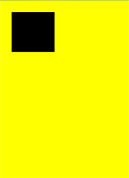


### strokeRect

strokeRect(x: number, y: number, w: number, h: number): void

Draws an outlined rectangle on the canvas.

**Widget capability**: This API can be used in ArkTS widgets since API version 9.

**Atomic service API**: This API can be used in atomic services since API version 11.

**System capability**: SystemCapability.ArkUI.ArkUI.Full

 **Parameters**

| Name    | Type    | Mandatory  | Description          |
| ------ | ------ | ---- | ------------ |
| x      | number | Yes  | X coordinate of the upper left corner of the rectangle.<br>Default unit: vp<br>Default value: **0** |
| y      | number | Yes  | Y coordinate of the upper left corner of the rectangle.<br>Default unit: vp<br>Default value: **0** |
| width  | number | Yes  | Width of the rectangle.<br>Default unit: vp<br>Default value: **0**    |
| height | number | Yes  | Height of the rectangle.<br>Default unit: vp<br>Default value: **0**    |

 **Example**

  ```ts
  // xxx.ets
  @Entry
  @Component
  struct StrokeRect {
    private settings: RenderingContextSettings = new RenderingContextSettings(true)
    private context: CanvasRenderingContext2D = new CanvasRenderingContext2D(this.settings)
    private offCanvas: OffscreenCanvas = new OffscreenCanvas(600, 600)

    build() {
      Flex({ direction: FlexDirection.Column, alignItems: ItemAlign.Center, justifyContent: FlexAlign.Center }) {
        Canvas(this.context)
          .width('100%')
          .height('100%')
          .backgroundColor('#ffff00')
          .onReady(() =>{
            let offContext = this.offCanvas.getContext("2d", this.settings)
            offContext.strokeRect(30, 30, 200, 150)
            let image = this.offCanvas.transferToImageBitmap()
            this.context.transferFromImageBitmap(image)
        })
      }
      .width('100%')
      .height('100%')
    }
  }
  ```

  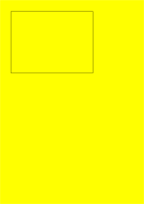


### clearRect

clearRect(x: number, y: number, w: number, h: number): void

Clears the content in a rectangle on the canvas.

**Widget capability**: This API can be used in ArkTS widgets since API version 9.

**Atomic service API**: This API can be used in atomic services since API version 11.

**System capability**: SystemCapability.ArkUI.ArkUI.Full

 **Parameters**

| Name  | Type    | Mandatory  | Description           |
| ------ | ------ | ---- | ------------- |
| x      | number | Yes  | X coordinate of the upper left corner of the rectangle.<br>Default unit: vp<br>Default value: **0** |
| y      | number | Yes  | Y coordinate of the upper left corner of the rectangle.<br>Default unit: vp<br>Default value: **0** |
| width  | number | Yes  | Width of the rectangle.<br>Default unit: vp<br>Default value: **0** |
| height | number | Yes  | Height of the rectangle.<br>Default unit: vp<br>Default value: **0** |

 **Example**

  ```ts
  // xxx.ets
  @Entry
  @Component
  struct ClearRect {
    private settings: RenderingContextSettings = new RenderingContextSettings(true)
    private context: CanvasRenderingContext2D = new CanvasRenderingContext2D(this.settings)
    private offCanvas: OffscreenCanvas = new OffscreenCanvas(600, 600)

    build() {
      Flex({ direction: FlexDirection.Column, alignItems: ItemAlign.Center, justifyContent: FlexAlign.Center }) {
        Canvas(this.context)
          .width('100%')
          .height('100%')
          .backgroundColor('#ffff00')
          .onReady(() =>{
            let offContext = this.offCanvas.getContext("2d", this.settings)
            offContext.fillStyle = 'rgb(0,0,255)'
            offContext.fillRect(20,20,200,200)
            offContext.clearRect(30,30,150,100)
            let image = this.offCanvas.transferToImageBitmap()
            this.context.transferFromImageBitmap(image)
        })
      }
      .width('100%')
      .height('100%')
    }
  }
  ```

  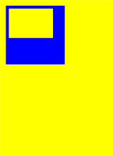


### fillText

fillText(text: string, x: number, y: number, maxWidth?: number): void

Draws filled text on the canvas.

**Widget capability**: This API can be used in ArkTS widgets since API version 9.

**Atomic service API**: This API can be used in atomic services since API version 11.

**System capability**: SystemCapability.ArkUI.ArkUI.Full

**Parameters**

| Name      | Type    | Mandatory  | Description             |
| -------- | ------ | ----  | --------------- |
| text     | string | Yes   | Text to draw.<br>Default value: **''**     |
| x        | number | Yes   | X coordinate of the lower left corner of the text.<br>Default unit: vp<br>Default value: **0** |
| y        | number | Yes   | Y coordinate of the lower left corner of the text.<br>Default unit: vp<br>Default value: **0** |
| maxWidth | number | No   | Maximum width allowed for the text.<br>Default unit: vp   |

 **Example**

  ```ts
  // xxx.ets
  @Entry
  @Component
  struct FillText {
    private settings: RenderingContextSettings = new RenderingContextSettings(true)
    private context: CanvasRenderingContext2D = new CanvasRenderingContext2D(this.settings)
    private offCanvas: OffscreenCanvas = new OffscreenCanvas(600, 600)

    build() {
      Flex({ direction: FlexDirection.Column, alignItems: ItemAlign.Center, justifyContent: FlexAlign.Center }) {
        Canvas(this.context)
          .width('100%')
          .height('100%')
          .backgroundColor('#ffff00')
          .onReady(() =>{
            let offContext = this.offCanvas.getContext("2d", this.settings)
            offContext.font = '30px sans-serif'
            offContext.fillText("Hello World!", 20, 100)
            let image = this.offCanvas.transferToImageBitmap()
            this.context.transferFromImageBitmap(image)
        })
      }
      .width('100%')
      .height('100%')
    }
  }
  ```

  


### strokeText

strokeText(text: string, x: number, y: number, maxWidth?: number): void

Draws a text stroke on the canvas.

**Widget capability**: This API can be used in ArkTS widgets since API version 9.

**Atomic service API**: This API can be used in atomic services since API version 11.

**System capability**: SystemCapability.ArkUI.ArkUI.Full

**Parameters**

| Name      | Type    | Mandatory  | Description      |
| -------- | ------ | ---- | --------------- |
| text     | string | Yes | Text to draw.<br>Default value: **''**     |
| x        | number | Yes | X coordinate of the lower left corner of the text.<br>Default unit: vp<br>Default value: **0** |
| y        | number | Yes | Y coordinate of the lower left corner of the text.<br>Default unit: vp<br>Default value: **0** |
| maxWidth | number | No | Maximum width of the text.<br>Default unit: vp |

 **Example**

  ```ts
  // xxx.ets
  @Entry
  @Component
  struct StrokeText {
    private settings: RenderingContextSettings = new RenderingContextSettings(true)
    private context: CanvasRenderingContext2D = new CanvasRenderingContext2D(this.settings)
    private offCanvas: OffscreenCanvas = new OffscreenCanvas(600, 600)

    build() {
      Flex({ direction: FlexDirection.Column, alignItems: ItemAlign.Center, justifyContent: FlexAlign.Center }) {
        Canvas(this.context)
          .width('100%')
          .height('100%')
          .backgroundColor('#ffff00')
          .onReady(() =>{
            let offContext = this.offCanvas.getContext("2d", this.settings)
            offContext.font = '55px sans-serif'
            offContext.strokeText("Hello World!", 20, 60)
            let image = this.offCanvas.transferToImageBitmap()
            this.context.transferFromImageBitmap(image)
        })
      }
      .width('100%')
      .height('100%')
    }
  }
  ```

  


### measureText

measureText(text: string): TextMetrics

Returns a **TextMetrics** object used to obtain the width of specified text.

**Widget capability**: This API can be used in ArkTS widgets since API version 9.

**Atomic service API**: This API can be used in atomic services since API version 11.

**System capability**: SystemCapability.ArkUI.ArkUI.Full

 **Parameters**

| Name | Type    | Mandatory | Description        |
| ---- | ------ | ---- | ---------- |
| text | string | Yes | Text to be measured.<br>Default value: **''** |

 **Return value**

| Type         | Description                                      |
| ----------- | ---------------------------------------- |
| [TextMetrics](ts-canvasrenderingcontext2d.md#textmetrics) | **TextMetrics** object. |

 **Example**

  ```ts
  // xxx.ets
  @Entry
  @Component
  struct MeasureText {
    private settings: RenderingContextSettings = new RenderingContextSettings(true)
    private context: CanvasRenderingContext2D = new CanvasRenderingContext2D(this.settings)
    private offCanvas: OffscreenCanvas = new OffscreenCanvas(600, 600)

    build() {
      Flex({ direction: FlexDirection.Column, alignItems: ItemAlign.Center, justifyContent: FlexAlign.Center }) {
        Canvas(this.context)
          .width('100%')
          .height('100%')
          .backgroundColor('#ffff00')
          .onReady(() =>{
            let offContext = this.offCanvas.getContext("2d", this.settings)
            offContext.font = '50px sans-serif'
            offContext.fillText("Hello World!", 20, 100)
            offContext.fillText("width:" + this.context.measureText("Hello World!").width, 20, 200)
            let image = this.offCanvas.transferToImageBitmap()
            this.context.transferFromImageBitmap(image)
        })
      }
      .width('100%')
      .height('100%')
    }
  }
  ```

  


### stroke

stroke(path?: Path2D): void

Strokes a path.

**Widget capability**: This API can be used in ArkTS widgets since API version 9.

**Atomic service API**: This API can be used in atomic services since API version 11.

**System capability**: SystemCapability.ArkUI.ArkUI.Full

 **Parameters**

| Name  | Type                                      | Mandatory  | Description |
| ---- | ---------------------------------------- | ---- | ------------ |
| path | [Path2D](ts-components-canvas-path2d.md) | No   |  A **Path2D** path to draw.<br>Default value: **null** |

 **Example**

  ```ts
  // xxx.ets
  @Entry
  @Component
  struct Stroke {
    private settings: RenderingContextSettings = new RenderingContextSettings(true)
    private context: CanvasRenderingContext2D = new CanvasRenderingContext2D(this.settings)
    private offCanvas: OffscreenCanvas = new OffscreenCanvas(600, 600)

    build() {
      Flex({ direction: FlexDirection.Column, alignItems: ItemAlign.Center, justifyContent: FlexAlign.Center }) {
        Canvas(this.context)
          .width('100%')
          .height('100%')
          .backgroundColor('#ffff00')
          .onReady(() =>{
            let offContext = this.offCanvas.getContext("2d", this.settings)
            offContext.moveTo(25, 25)
            offContext.lineTo(25, 105)
            offContext.lineTo(75, 105)
            offContext.lineTo(75, 25)
            offContext.strokeStyle = 'rgb(0,0,255)'
            offContext.stroke()
            let image = this.offCanvas.transferToImageBitmap()
            this.context.transferFromImageBitmap(image)
          })
      }
      .width('100%')
      .height('100%')
    }
  }
  ```

  


### beginPath

beginPath(): void

Creates a drawing path.

**Widget capability**: This API can be used in ArkTS widgets since API version 9.

**Atomic service API**: This API can be used in atomic services since API version 11.

**System capability**: SystemCapability.ArkUI.ArkUI.Full

 **Example**

  ```ts
  // xxx.ets
  @Entry
  @Component
  struct BeginPath {
    private settings: RenderingContextSettings = new RenderingContextSettings(true)
    private context: CanvasRenderingContext2D = new CanvasRenderingContext2D(this.settings)
    private offCanvas: OffscreenCanvas = new OffscreenCanvas(600, 600)

    build() {
      Flex({ direction: FlexDirection.Column, alignItems: ItemAlign.Center, justifyContent: FlexAlign.Center }) {
        Canvas(this.context)
          .width('100%')
          .height('100%')
          .backgroundColor('#ffff00')
          .onReady(() =>{
            let offContext = this.offCanvas.getContext("2d", this.settings)
            offContext.beginPath()
            offContext.lineWidth = 6
            offContext.strokeStyle = '#0000ff'
            offContext.moveTo(15, 80)
            offContext.lineTo(280, 160)
            offContext.stroke()
            let image = this.offCanvas.transferToImageBitmap()
            this.context.transferFromImageBitmap(image)
          })
      }
      .width('100%')
      .height('100%')
    }
  }
  ```

  


### moveTo

moveTo(x: number, y: number): void

Moves a drawing path to a target position on the canvas.

**Widget capability**: This API can be used in ArkTS widgets since API version 9.

**Atomic service API**: This API can be used in atomic services since API version 11.

**System capability**: SystemCapability.ArkUI.ArkUI.Full

 **Parameters**

| Name  | Type    | Mandatory  | Description       |
| ---- | ------ | ---- | --------- |
| x    | number | Yes   | X coordinate of the target position.<br>Default unit: vp<br>Default value: **0** |
| y    | number | Yes   | Y coordinate of the target position.<br>Default unit: vp<br>Default value: **0** |

 **Example**

  ```ts
  // xxx.ets
  @Entry
  @Component
  struct MoveTo {
    private settings: RenderingContextSettings = new RenderingContextSettings(true)
    private context: CanvasRenderingContext2D = new CanvasRenderingContext2D(this.settings)
    private offCanvas: OffscreenCanvas = new OffscreenCanvas(600, 600)

    build() {
      Flex({ direction: FlexDirection.Column, alignItems: ItemAlign.Center, justifyContent: FlexAlign.Center }) {
        Canvas(this.context)
          .width('100%')
          .height('100%')
          .backgroundColor('#ffff00')
          .onReady(() =>{
            let offContext = this.offCanvas.getContext("2d", this.settings)
            offContext.beginPath()
            offContext.moveTo(10, 10)
            offContext.lineTo(280, 160)
            offContext.stroke()
            let image = this.offCanvas.transferToImageBitmap()
            this.context.transferFromImageBitmap(image)
          })
      }
      .width('100%')
      .height('100%')
    }
  }
  ```

  


### lineTo

lineTo(x: number, y: number): void

Connects the current point to a target position using a straight line.

**Widget capability**: This API can be used in ArkTS widgets since API version 9.

**Atomic service API**: This API can be used in atomic services since API version 11.

**System capability**: SystemCapability.ArkUI.ArkUI.Full

 **Parameters**

| Name  | Type    | Mandatory  | Description       |
| ---- | ------ | ----  | --------- |
| x    | number | Yes   | X coordinate of the target position.<br>Default unit: vp<br>Default value: **0** |
| y    | number | Yes   | Y coordinate of the target position.<br>Default unit: vp<br>Default value: **0** |

 **Example**

  ```ts
  // xxx.ets
  @Entry
  @Component
  struct LineTo {
    private settings: RenderingContextSettings = new RenderingContextSettings(true)
    private context: CanvasRenderingContext2D = new CanvasRenderingContext2D(this.settings)
    private offCanvas: OffscreenCanvas = new OffscreenCanvas(600, 600)

    build() {
      Flex({ direction: FlexDirection.Column, alignItems: ItemAlign.Center, justifyContent: FlexAlign.Center }) {
        Canvas(this.context)
          .width('100%')
          .height('100%')
          .backgroundColor('#ffff00')
          .onReady(() =>{
            let offContext = this.offCanvas.getContext("2d", this.settings)
            offContext.beginPath()
            offContext.moveTo(10, 10)
            offContext.lineTo(280, 160)
            offContext.stroke()
            let image = this.offCanvas.transferToImageBitmap()
            this.context.transferFromImageBitmap(image)
          })
      }
      .width('100%')
      .height('100%')
    }
  }
  ```

  


### closePath

closePath(): void

Draws a closed path.

**Widget capability**: This API can be used in ArkTS widgets since API version 9.

**Atomic service API**: This API can be used in atomic services since API version 11.

**System capability**: SystemCapability.ArkUI.ArkUI.Full

 **Example**

  ```ts
  // xxx.ets
  @Entry
  @Component
  struct ClosePath {
    private settings: RenderingContextSettings = new RenderingContextSettings(true)
    private context: CanvasRenderingContext2D = new CanvasRenderingContext2D(this.settings)
    private offCanvas: OffscreenCanvas = new OffscreenCanvas(600, 600)

    build() {
      Flex({ direction: FlexDirection.Column, alignItems: ItemAlign.Center, justifyContent: FlexAlign.Center }) {
        Canvas(this.context)
          .width('100%')
          .height('100%')
          .backgroundColor('#ffff00')
          .onReady(() =>{
              let offContext = this.offCanvas.getContext("2d", this.settings)
              offContext.beginPath()
              offContext.moveTo(30, 30)
              offContext.lineTo(110, 30)
              offContext.lineTo(70, 90)
              offContext.closePath()
              offContext.stroke()
              let image = this.offCanvas.transferToImageBitmap()
              this.context.transferFromImageBitmap(image)
          })
      }
      .width('100%')
      .height('100%')
    }
  }
  ```

  


### createPattern

createPattern(image: ImageBitmap, repetition: string | null): CanvasPattern | null

Creates a pattern for image filling based on a specified source image and repetition mode.

**Widget capability**: This API can be used in ArkTS widgets since API version 9.

**Atomic service API**: This API can be used in atomic services since API version 11.

**System capability**: SystemCapability.ArkUI.ArkUI.Full

**Parameters**

| Name | Type | Mandatory  | Description |
| ---------- | ---------------------------------------- | ---- | ---------------------------------------- |
| image      | [ImageBitmap](ts-components-canvas-imagebitmap.md) | Yes   | Source image. For details, see **ImageBitmap**.<br>Default value: **null**|
| repetition | string \| null | Yes   | Repetition mode. The value can be **'repeat'**, **'repeat-x'**, **'repeat-y'**, **'no-repeat'**, **'clamp'**, or **'mirror'**.<br>Default value: **null** |

**Return value**

| Type                                      | Description                     |
| ---------------------------------------- | ----------------------- |
| [CanvasPattern](ts-components-canvas-canvaspattern.md#canvaspattern) \| null | Created pattern for image filling based on a specified source image and repetition mode. |

 **Example**

  ```ts
  // xxx.ets
  @Entry
  @Component
  struct CreatePattern {
    private settings: RenderingContextSettings = new RenderingContextSettings(true)
    private context: CanvasRenderingContext2D = new CanvasRenderingContext2D(this.settings)
    private img:ImageBitmap = new ImageBitmap("common/images/icon.jpg")
    private offCanvas: OffscreenCanvas = new OffscreenCanvas(600, 600)

    build() {
      Flex({ direction: FlexDirection.Column, alignItems: ItemAlign.Center, justifyContent: FlexAlign.Center }) {
        Canvas(this.context)
          .width('100%')
          .height('100%')
          .backgroundColor('#ffff00')
          .onReady(() =>{
            let offContext = this.offCanvas.getContext("2d", this.settings)
            let pattern = offContext.createPattern(this.img, 'repeat')
            offContext.fillStyle = pattern as CanvasPattern
            offContext.fillRect(0, 0, 200, 200)
            let image = this.offCanvas.transferToImageBitmap()
            this.context.transferFromImageBitmap(image)
          })
      }
      .width('100%')
      .height('100%')
    }
  }
  ```

  


### bezierCurveTo

bezierCurveTo(cp1x: number, cp1y: number, cp2x: number, cp2y: number, x: number, y: number): void

Draws a cubic bezier curve on the canvas.

**Widget capability**: This API can be used in ArkTS widgets since API version 9.

**Atomic service API**: This API can be used in atomic services since API version 11.

**System capability**: SystemCapability.ArkUI.ArkUI.Full

 **Parameters**

| Name  | Type    | Mandatory | Description            |
| ---- | ------ | ---- | -------------- |
| cp1x | number | Yes | X coordinate of the first parameter of the bezier curve.<br>Default unit: vp<br>Default value: **0** |
| cp1y | number | Yes | Y coordinate of the first parameter of the bezier curve.<br>Default unit: vp<br>Default value: **0** |
| cp2x | number | Yes | X coordinate of the second parameter of the bezier curve.<br>Default unit: vp<br>Default value: **0** |
| cp2y | number | Yes | Y coordinate of the second parameter of the bezier curve.<br>Default unit: vp<br>Default value: **0** |
| x    | number | Yes | X coordinate of the end point on the bezier curve.<br>Default unit: vp<br>Default value: **0** |
| y    | number | Yes | Y coordinate of the end point on the bezier curve.<br>Default unit: vp<br>Default value: **0** |

 **Example**

  ```ts
  // xxx.ets
  @Entry
  @Component
  struct BezierCurveTo {
    private settings: RenderingContextSettings = new RenderingContextSettings(true)
    private context: CanvasRenderingContext2D = new CanvasRenderingContext2D(this.settings)
    private offCanvas: OffscreenCanvas = new OffscreenCanvas(600, 600)

    build() {
      Flex({ direction: FlexDirection.Column, alignItems: ItemAlign.Center, justifyContent: FlexAlign.Center }) {
        Canvas(this.context)
          .width('100%')
          .height('100%')
          .backgroundColor('#ffff00')
          .onReady(() =>{
            let offContext = this.offCanvas.getContext("2d", this.settings)
            offContext.beginPath()
            offContext.moveTo(10, 10)
            offContext.bezierCurveTo(20, 100, 200, 100, 200, 20)
            offContext.stroke()
            let image = this.offCanvas.transferToImageBitmap()
            this.context.transferFromImageBitmap(image)
          })
      }
      .width('100%')
      .height('100%')
    }
  }
  ```

  


### quadraticCurveTo

quadraticCurveTo(cpx: number, cpy: number, x: number, y: number): void

Draws a quadratic curve on the canvas.

**Widget capability**: This API can be used in ArkTS widgets since API version 9.

**Atomic service API**: This API can be used in atomic services since API version 11.

**System capability**: SystemCapability.ArkUI.ArkUI.Full

 **Parameters**
 
| Name  | Type    | Mandatory | Description            |
| ---- | ------ | ---- | -------------- |
| cpx  | number | Yes  | X coordinate of the bezier curve parameter.<br>Default unit: vp<br>Default value: **0**|
| cpy  | number | Yes  | Y coordinate of the bezier curve parameter.<br>Default unit: vp<br>Default value: **0**|
| x    | number | Yes  | X coordinate of the end point on the bezier curve.<br>Default unit: vp<br>Default value: **0**|
| y    | number | Yes  | Y coordinate of the end point on the bezier curve.<br>Default unit: vp<br>Default value: **0**|

 **Example**

  ```ts
  // xxx.ets
  @Entry
  @Component
  struct QuadraticCurveTo {
    private settings: RenderingContextSettings = new RenderingContextSettings(true)
    private context: CanvasRenderingContext2D = new CanvasRenderingContext2D(this.settings)
    private offCanvas: OffscreenCanvas = new OffscreenCanvas(600, 600)

    build() {
      Flex({ direction: FlexDirection.Column, alignItems: ItemAlign.Center, justifyContent: FlexAlign.Center }) {
        Canvas(this.context)
          .width('100%')
          .height('100%')
          .backgroundColor('#ffff00')
          .onReady(() =>{
            let offContext = this.offCanvas.getContext("2d", this.settings)
            offContext.beginPath()
            offContext.moveTo(20, 20)
            offContext.quadraticCurveTo(100, 100, 200, 20)
            offContext.stroke()
            let image = this.offCanvas.transferToImageBitmap()
            this.context.transferFromImageBitmap(image)
        })
      }
      .width('100%')
      .height('100%')
    }
  }
  ```

  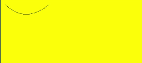


### arc

arc(x: number, y: number, radius: number, startAngle: number, endAngle: number, counterclockwise?: boolean): void

Draws an arc on the canvas.

**Widget capability**: This API can be used in ArkTS widgets since API version 9.

**Atomic service API**: This API can be used in atomic services since API version 11.

**System capability**: SystemCapability.ArkUI.ArkUI.Full

 **Parameters**

| Name | Type     | Mandatory  | Description        |
| ---------------- | ------- | ---- | ---------- |
| x                | number  | Yes  | X coordinate of the center point of the arc.<br>Default unit: vp<br>Default value: **0** |
| y                | number  | Yes  | Y coordinate of the center point of the arc.<br>Default unit: vp<br>Default value: **0** |
| radius           | number  | Yes  | Radius of the arc.<br>Default unit: vp<br>Default value: **0**   |
| startAngle       | number  | Yes  | Start radian of the arc.<br>Default value: **0**  |
| endAngle         | number  | Yes  | End radian of the arc.<br>Default value: **0**  |
| counterclockwise | boolean | No  | Whether to draw the arc counterclockwise.<br>Default value: **false** |

 **Example**

  ```ts
  // xxx.ets
  @Entry
  @Component
  struct Arc {
    private settings: RenderingContextSettings = new RenderingContextSettings(true)
    private context: CanvasRenderingContext2D = new CanvasRenderingContext2D(this.settings)
    private offCanvas: OffscreenCanvas = new OffscreenCanvas(600, 600)

    build() {
      Flex({ direction: FlexDirection.Column, alignItems: ItemAlign.Center, justifyContent: FlexAlign.Center }) {
        Canvas(this.context)
          .width('100%')
          .height('100%')
          .backgroundColor('#ffff00')
          .onReady(() =>{
            let offContext = this.offCanvas.getContext("2d", this.settings)
            offContext.beginPath()
            offContext.arc(100, 75, 50, 0, 6.28)
            offContext.stroke()
            let image = this.offCanvas.transferToImageBitmap()
            this.context.transferFromImageBitmap(image)
          })
      }
      .width('100%')
      .height('100%')
    }
  }
  ```

  


### arcTo

arcTo(x1: number, y1: number, x2: number, y2: number, radius: number): void

Draws an arc based on the radius and points on the arc.

**Widget capability**: This API can be used in ArkTS widgets since API version 9.

**Atomic service API**: This API can be used in atomic services since API version 11.

**System capability**: SystemCapability.ArkUI.ArkUI.Full

 **Parameters**

| Name   | Type    | Mandatory | Description        |
| ------ | ------ | ---- | --------------- |
| x1     | number | Yes | X coordinate of the first point on the arc.<br>Default unit: vp<br>Default value: **0** |
| y1     | number | Yes | Y coordinate of the first point on the arc.<br>Default unit: vp<br>Default value: **0** |
| x2     | number | Yes | X coordinate of the second point on the arc.<br>Default unit: vp<br>Default value: **0** |
| y2     | number | Yes | Y coordinate of the second point on the arc.<br>Default unit: vp<br>Default value: **0** |
| radius | number | Yes | Radius of the arc.<br>Default unit: vp<br>Default value: **0**       |

 **Example**

  ```ts
  // xxx.ets
  @Entry
  @Component
  struct ArcTo {
    private settings: RenderingContextSettings = new RenderingContextSettings(true)
    private context: CanvasRenderingContext2D = new CanvasRenderingContext2D(this.settings)
    private offCanvas: OffscreenCanvas = new OffscreenCanvas(600, 600)

    build() {
      Flex({ direction: FlexDirection.Column, alignItems: ItemAlign.Center, justifyContent: FlexAlign.Center }) {
        Canvas(this.context)
          .width('100%')
          .height('100%')
          .backgroundColor('#ffff00')
          .onReady(() =>{
            let offContext = this.offCanvas.getContext("2d", this.settings)
            offContext.moveTo(100, 20)
            offContext.arcTo(150, 20, 150, 70, 50)
            offContext.stroke()
            let image = this.offCanvas.transferToImageBitmap()
            this.context.transferFromImageBitmap(image)
          })
      }
      .width('100%')
      .height('100%')
    }
  }
  ```

  


### ellipse

ellipse(x: number, y: number, radiusX: number, radiusY: number, rotation: number, startAngle: number, endAngle: number, counterclockwise?: boolean): void

Draws an ellipse in the specified rectangular region on the canvas.

**Widget capability**: This API can be used in ArkTS widgets since API version 9.

**Atomic service API**: This API can be used in atomic services since API version 11.

**System capability**: SystemCapability.ArkUI.ArkUI.Full

 **Parameters**

| Name             | Type     | Mandatory  | Description |
| ---------------- | ------- | ---- | ---------------------------------------- |
| x                | number  | Yes    | X coordinate of the ellipse center.<br>Default unit: vp<br>Default value: **0** |
| y                | number  | Yes    | Y coordinate of the ellipse center.<br>Default unit: vp<br>Default value: **0** |
| radiusX          | number  | Yes    | Radius of the ellipse on the x-axis.<br>Default unit: vp<br>Default value: **0** |
| radiusY          | number  | Yes    | Radius of the ellipse on the y-axis.<br>Default unit: vp<br>Default value: **0** |
| rotation         | number  | Yes    | Rotation angle of the ellipse.<br>Unit: radian<br>Default value: **0** |
| startAngle       | number  | Yes    | Angle of the start point for drawing the ellipse. The unit is radian.<br>Default value: **0** |
| endAngle         | number  | Yes    | Angle of the end point for drawing the ellipse. The unit is radian.<br>Default value: **0** |
| counterclockwise | boolean | No    | Whether to draw the ellipse counterclockwise.<br>**true**: Draw the ellipse counterclockwise.<br>**false**: Draw the ellipse clockwise.<br>Default value: **false** |

 **Example**

  ```ts
  // xxx.ets
  @Entry
  @Component
  struct CanvasExample {
    private settings: RenderingContextSettings = new RenderingContextSettings(true)
    private context: CanvasRenderingContext2D = new CanvasRenderingContext2D(this.settings)
    private offCanvas: OffscreenCanvas = new OffscreenCanvas(600, 600)
    build() {
      Flex({ direction: FlexDirection.Column, alignItems: ItemAlign.Center, justifyContent: FlexAlign.Center }) {
        Canvas(this.context)
          .width('100%')
          .height('100%')
          .backgroundColor('#ffff00')
          .onReady(() =>{
            let offContext = this.offCanvas.getContext("2d", this.settings)
            offContext.beginPath()
            offContext.ellipse(200, 200, 50, 100, Math.PI * 0.25, Math.PI * 0.5, Math.PI * 2, false)
            offContext.stroke()
            offContext.beginPath()
            offContext.ellipse(200, 300, 50, 100, Math.PI * 0.25, Math.PI * 0.5, Math.PI * 2, true)
            offContext.stroke()
            let image = this.offCanvas.transferToImageBitmap()
            this.context.transferFromImageBitmap(image)
          })
      }
      .width('100%')
      .height('100%')
    }
  }
  ```

  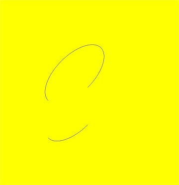


### rect

rect(x: number, y: number, w: number, h: number): void

Creates a rectangle on the canvas.

**Widget capability**: This API can be used in ArkTS widgets since API version 9.

**Atomic service API**: This API can be used in atomic services since API version 11.

**System capability**: SystemCapability.ArkUI.ArkUI.Full

 **Parameters**

| Name | Type    | Mandatory | Description |
| ---- | ------ | ---- | ------------- |
| x    | number | Yes | X coordinate of the upper left corner of the rectangle.<br>Default unit: vp<br>Default value: **0** |
| y    | number | Yes | Y coordinate of the upper left corner of the rectangle.<br>Default unit: vp<br>Default value: **0** |
| w    | number | Yes | Width of the rectangle.<br>Default unit: vp<br>Default value: **0** |
| h    | number | Yes | Height of the rectangle.<br>Default unit: vp<br>Default value: **0** |

 **Example**

  ```ts
  // xxx.ets
  @Entry
  @Component
  struct CanvasExample {
    private settings: RenderingContextSettings = new RenderingContextSettings(true)
    private context: CanvasRenderingContext2D = new CanvasRenderingContext2D(this.settings)
    private offCanvas: OffscreenCanvas = new OffscreenCanvas(600, 600)

    build() {
      Flex({ direction: FlexDirection.Column, alignItems: ItemAlign.Center, justifyContent: FlexAlign.Center }) {
        Canvas(this.context)
          .width('100%')
          .height('100%')
          .backgroundColor('#ffff00')
          .onReady(() =>{
            let offContext = this.offCanvas.getContext("2d", this.settings)
            offContext.rect(20, 20, 100, 100) // Create a 100*100 rectangle at (20, 20)
            offContext.stroke()
            let image = this.offCanvas.transferToImageBitmap()
            this.context.transferFromImageBitmap(image)
          })
      }
      .width('100%')
      .height('100%')
    }
  }
  ```

  


### fill

fill(fillRule?: CanvasFillRule): void

Fills the area inside a closed path on the canvas.

**Widget capability**: This API can be used in ArkTS widgets since API version 9.

**Atomic service API**: This API can be used in atomic services since API version 11.

**System capability**: SystemCapability.ArkUI.ArkUI.Full

**Parameters** 

| Name | Type | Mandatory  | Description |
| -------- | -------------- | ---- | ---------------------------------------- |
| fillRule | [CanvasFillRule](ts-canvasrenderingcontext2d.md#canvasfillrule) | No | Rule by which to determine whether a point is inside or outside the area to fill.<br>The options are **"nonzero"** and **"evenodd"**.<br>Default value: **"nonzero"** |

  ```ts
  // xxx.ets
  @Entry
  @Component
  struct Fill {
    private settings: RenderingContextSettings = new RenderingContextSettings(true)
    private context: CanvasRenderingContext2D = new CanvasRenderingContext2D(this.settings)
    private offCanvas: OffscreenCanvas = new OffscreenCanvas(600, 600)

    build() {
      Flex({ direction: FlexDirection.Column, alignItems: ItemAlign.Center, justifyContent: FlexAlign.Center }) {
        Canvas(this.context)
          .width('100%')
          .height('100%')
          .backgroundColor('#ffff00')
          .onReady(() =>{
            let offContext = this.offCanvas.getContext("2d", this.settings)
            offContext.fillStyle = '#000000'
            offContext.rect(20, 20, 100, 100) // Create a 100*100 rectangle at (20, 20)
            offContext.fill()
            let image = this.offCanvas.transferToImageBitmap()
            this.context.transferFromImageBitmap(image)
          })
      }
      .width('100%')
      .height('100%')
    }
  }
  ```

  


fill(path: Path2D, fillRule?: CanvasFillRule): void

Fills the area inside a closed path on the canvas.

**Widget capability**: This API can be used in ArkTS widgets since API version 9.

**Atomic service API**: This API can be used in atomic services since API version 11.

**System capability**: SystemCapability.ArkUI.ArkUI.Full

**Parameters** 

| Name      | Type | Mandatory | Description |
| -------- | -------------- | ---- | ----------------- |
| path     | [Path2D](ts-components-canvas-path2d.md)         | Yes  | A **Path2D** path to fill.                             |
| fillRule | [CanvasFillRule](ts-canvasrenderingcontext2d.md#canvasfillrule) | No | "nonzero" | Rule by which to determine whether a point is inside or outside the area to fill.<br>The options are **"nonzero"** and **"evenodd"**. |

**Example**  

```ts
// xxx.ets
@Entry
@Component
struct Fill {
  private settings: RenderingContextSettings = new RenderingContextSettings(true)
  private context: CanvasRenderingContext2D = new CanvasRenderingContext2D(this.settings)
  private offCanvas: OffscreenCanvas = new OffscreenCanvas(600, 600)

  build() {
    Flex({ direction: FlexDirection.Column, alignItems: ItemAlign.Center, justifyContent: FlexAlign.Center }) {
      Canvas(this.context)
        .width('100%')
        .height('100%')
        .backgroundColor('#ffff00')
        .onReady(() =>{
          let offContext = this.offCanvas.getContext("2d", this.settings)
          let region = new Path2D()
          region.moveTo(30, 90)
          region.lineTo(110, 20)
          region.lineTo(240, 130)
          region.lineTo(60, 130)
          region.lineTo(190, 20)
          region.lineTo(270, 90)
          region.closePath()
          // Fill path
          offContext.fillStyle = '#00ff00'
          offContext.fill(region, "evenodd")
          let image = this.offCanvas.transferToImageBitmap()
          this.context.transferFromImageBitmap(image)
        })
    }
    .width('100%')
    .height('100%')
  }
}
```

 


### clip

clip(fillRule?: CanvasFillRule): void

Sets the current path to a clipping path.

**Widget capability**: This API can be used in ArkTS widgets since API version 9.

**Atomic service API**: This API can be used in atomic services since API version 11.

**System capability**: SystemCapability.ArkUI.ArkUI.Full

**Parameters** 

| Name | Type | Mandatory  | Description |
| -------- | -------------- | ---- | ---------------------------------------- |
| fillRule | [CanvasFillRule](ts-canvasrenderingcontext2d.md#canvasfillrule) | No | Rule by which to determine whether a point is inside or outside the area to clip.<br>The options are **"nonzero"** and **"evenodd"**.<br>Default value: **"nonzero"** |

 **Example**

  ```ts
  // xxx.ets
  @Entry
  @Component
  struct Clip {
    private settings: RenderingContextSettings = new RenderingContextSettings(true)
    private context: CanvasRenderingContext2D = new CanvasRenderingContext2D(this.settings)
    private offCanvas: OffscreenCanvas = new OffscreenCanvas(600, 600)

    build() {
      Flex({ direction: FlexDirection.Column, alignItems: ItemAlign.Center, justifyContent: FlexAlign.Center }) {
        Canvas(this.context)
          .width('100%')
          .height('100%')
          .backgroundColor('#ffff00')
          .onReady(() =>{
            let offContext = this.offCanvas.getContext("2d", this.settings)
            offContext.rect(0, 0, 100, 200)
            offContext.stroke()
            offContext.clip()
            offContext.fillStyle = "rgb(255,0,0)"
            offContext.fillRect(0, 0, 200, 200)
            let image = this.offCanvas.transferToImageBitmap()
            this.context.transferFromImageBitmap(image)
          })
      }
      .width('100%')
      .height('100%')
    }
  }
  ```

  


clip(path: Path2D, fillRule?: CanvasFillRule): void

Sets a closed path to a clipping path.

**Widget capability**: This API can be used in ArkTS widgets since API version 9.

**Atomic service API**: This API can be used in atomic services since API version 11.

**System capability**: SystemCapability.ArkUI.ArkUI.Full

**Parameters** 

| Name      | Type | Mandatory  | Description                                      |
| -------- | -------------- | ---- | ---------------------------------------- |
| path | [Path2D](ts-components-canvas-path2d.md) | Yes | A **Path2D** path to clip. |
| fillRule | [CanvasFillRule](ts-canvasrenderingcontext2d.md#canvasfillrule) | No | Rule by which to determine whether a point is inside or outside the area to clip.<br>The options are **"nonzero"** and **"evenodd"**.<br>Default value: **"nonzero"** |

 **Example**

  ```ts
  // xxx.ets
  @Entry
  @Component
  struct Clip {
    private settings: RenderingContextSettings = new RenderingContextSettings(true)
    private context: CanvasRenderingContext2D = new CanvasRenderingContext2D(this.settings)
    private offCanvas: OffscreenCanvas = new OffscreenCanvas(600, 600)

    build() {
      Flex({ direction: FlexDirection.Column, alignItems: ItemAlign.Center, justifyContent: FlexAlign.Center }) {
        Canvas(this.context)
          .width('100%')
          .height('100%')
          .backgroundColor('#ffff00')
          .onReady(() =>{
            let offContext = this.offCanvas.getContext("2d", this.settings)
            let region = new Path2D()
            region.moveTo(30, 90)
            region.lineTo(110, 20)
            region.lineTo(240, 130)
            region.lineTo(60, 130)
            region.lineTo(190, 20)
            region.lineTo(270, 90)
            region.closePath()
            offContext.clip(region,"evenodd")
            offContext.fillStyle = "rgb(0,255,0)"
            offContext.fillRect(0, 0, 600, 600)
            let image = this.offCanvas.transferToImageBitmap()
            this.context.transferFromImageBitmap(image)
          })
      }
      .width('100%')
      .height('100%')
    }
  }
  ```

  


### reset<sup>12+</sup>

reset(): void

Resets this **OffscreenCanvasRenderingContext2D** object to its default state and clears the background buffer, drawing state stack, defined paths, and styles.

**System capability**: SystemCapability.ArkUI.ArkUI.Full

**Example**

  ```ts
  // xxx.ets
  @Entry
  @Component
  struct Reset {
    private settings: RenderingContextSettings = new RenderingContextSettings(true)
    private context: CanvasRenderingContext2D = new CanvasRenderingContext2D(this.settings)
    private offCanvas: OffscreenCanvas = new OffscreenCanvas(600, 600)

    build() {
      Flex({ direction: FlexDirection.Column, alignItems: ItemAlign.Center, justifyContent: FlexAlign.Center }) {
        Canvas(this.context)
          .width('100%')
          .height('100%')
          .backgroundColor('#ffff00')
          .onReady(() =>{
            let offContext = this.offCanvas.getContext("2d", this.settings)
            offContext.fillStyle = '#0000ff'
            offContext.fillRect(20, 20, 150, 100)
            offContext.reset()
            offContext.fillRect(20, 150, 150, 100)
            let image = this.offCanvas.transferToImageBitmap()
            this.context.transferFromImageBitmap(image)
          })
      }
      .width('100%')
      .height('100%')
    }
  }
  ```

  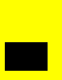

### saveLayer<sup>12+</sup>

saveLayer(): void

Saves this layer.

**Atomic service API**: This API can be used in atomic services since API version 12.

**System capability**: SystemCapability.ArkUI.ArkUI.Full

**Example**

  ```ts
  // xxx.ets
  @Entry
  @Component
  struct ResetTransform {
    private settings: RenderingContextSettings = new RenderingContextSettings(true)
    private context: CanvasRenderingContext2D = new CanvasRenderingContext2D(this.settings)
    private offCanvas: OffscreenCanvas = new OffscreenCanvas(600, 600)

    build() {
      Flex({ direction: FlexDirection.Column, alignItems: ItemAlign.Center, justifyContent: FlexAlign.Center }) {
        Canvas(this.context)
          .width('100%')
          .height('100%')
          .backgroundColor('#ffff00')
          .onReady(() => {
            let offContext = this.offCanvas.getContext("2d", this.settings)
            offContext.setTransform(1,0.5, -0.5, 1, 10, 10)
            offContext.fillStyle = 'rgb(0,0,255)'
            offContext.fillRect(0, 0, 100, 100)
            offContext.resetTransform()
            offContext.fillStyle = 'rgb(255,0,0)'
            offContext.fillRect(0, 0, 100, 100)
            let image = this.offCanvas.transferToImageBitmap()
            this.context.transferFromImageBitmap(image)
          })
      }
      .width('100%')
      .height('100%')
    }
  }
  ```
   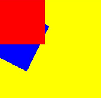

### restoreLayer<sup>12+</sup>

restoreLayer(): void

Restores the image transformation and cropping state to the state before **saveLayer**, and then draws the layer onto the canvas. For the sample code, see the code for **saveLayer**.

**Atomic service API**: This API can be used in atomic services since API version 12.

**System capability**: SystemCapability.ArkUI.ArkUI.Full

### resetTransform
 
resetTransform(): void

Resets the current transform to the identity matrix.

**Widget capability**: This API can be used in ArkTS widgets since API version 9.

**Atomic service API**: This API can be used in atomic services since API version 11.

**System capability**: SystemCapability.ArkUI.ArkUI.Full

**Example**

  ```ts
  // xxx.ets
  @Entry
  @Component
  struct ResetTransform {
    private settings: RenderingContextSettings = new RenderingContextSettings(true)
    private context: CanvasRenderingContext2D = new CanvasRenderingContext2D(this.settings)

    build() {
      Flex({ direction: FlexDirection.Column, alignItems: ItemAlign.Center, justifyContent: FlexAlign.Center }) {
        Canvas(this.context)
          .width('100%')
          .height('100%')
          .backgroundColor('#ffff00')
          .onReady(() =>{
            this.context.setTransform(1,0.5, -0.5, 1, 10, 10)
            this.context.fillStyle = 'rgb(0,0,255)'
            this.context.fillRect(0, 0, 100, 100)
            this.context.resetTransform()
            this.context.fillStyle = 'rgb(255,0,0)'
            this.context.fillRect(0, 0, 100, 100)
          })
      }
      .width('100%')
      .height('100%')
    }
  }
  ```

### rotate

rotate(angle: number): void

Rotates a canvas clockwise around its coordinate axes.

**Widget capability**: This API can be used in ArkTS widgets since API version 9.

**Atomic service API**: This API can be used in atomic services since API version 11.

**System capability**: SystemCapability.ArkUI.ArkUI.Full

 **Parameters**

| Name   | Type    | Mandatory  | Description |
| ----- | ------ | ---- | ---------------------------------------- |
| angle | number | Yes   | Clockwise rotation angle. You can use **Math.PI / 180** to convert the angle to a radian.<br>Default value: **0** |

 **Example**

  ```ts
  // xxx.ets
  @Entry
  @Component
  struct Rotate {
    private settings: RenderingContextSettings = new RenderingContextSettings(true)
    private context: CanvasRenderingContext2D = new CanvasRenderingContext2D(this.settings)
    private offCanvas: OffscreenCanvas = new OffscreenCanvas(600, 600)

    build() {
      Flex({ direction: FlexDirection.Column, alignItems: ItemAlign.Center, justifyContent: FlexAlign.Center }) {
        Canvas(this.context)
          .width('100%')
          .height('100%')
          .backgroundColor('#ffff00')
          .onReady(() =>{
            let offContext = this.offCanvas.getContext("2d", this.settings)
            offContext.rotate(45 * Math.PI / 180)
            offContext.fillRect(70, 20, 50, 50)
            let image = this.offCanvas.transferToImageBitmap()
            this.context.transferFromImageBitmap(image)
          })
      }
      .width('100%')
      .height('100%')
    }
  }
  ```

  


### scale

scale(x: number, y: number): void

Scales the canvas based on scale factors.

**Widget capability**: This API can be used in ArkTS widgets since API version 9.

**Atomic service API**: This API can be used in atomic services since API version 11.

**System capability**: SystemCapability.ArkUI.ArkUI.Full

 **Parameters**

| Name  | Type    | Mandatory  |  Description     |
| ---- | ------ | ---- | ----------- |
| x    | number | Yes | Horizontal scale factor.<br>Default value: **0** |
| y    | number | Yes | Vertical scale factor.<br>Default value: **0** |

 **Example**

  ```ts
  // xxx.ets
  @Entry
  @Component
  struct Scale {
    private settings: RenderingContextSettings = new RenderingContextSettings(true)
    private context: CanvasRenderingContext2D = new CanvasRenderingContext2D(this.settings)
    private offCanvas: OffscreenCanvas = new OffscreenCanvas(600, 600)

    build() {
      Flex({ direction: FlexDirection.Column, alignItems: ItemAlign.Center, justifyContent: FlexAlign.Center }) {
        Canvas(this.context)
          .width('100%')
          .height('100%')
          .backgroundColor('#ffff00')
          .onReady(() =>{
            let offContext = this.offCanvas.getContext("2d", this.settings)
            offContext.lineWidth = 3
            offContext.strokeRect(30, 30, 50, 50)
            offContext.scale(2, 2) // Scale to 200%
            offContext.strokeRect(30, 30, 50, 50)
            let image = this.offCanvas.transferToImageBitmap()
            this.context.transferFromImageBitmap(image)
          })
      }
      .width('100%')
      .height('100%')
    }
  }
  ```

  


### transform

transform(a: number, b: number, c: number, d: number, e: number, f: number): void

Defines a transformation matrix. To transform a graph, you only need to set parameters of the matrix. The coordinates of the graph are multiplied by the matrix values to obtain new coordinates of the transformed graph. You can use the matrix to implement multiple transform effects.

**Widget capability**: This API can be used in ArkTS widgets since API version 9.

**Atomic service API**: This API can be used in atomic services since API version 11.

**System capability**: SystemCapability.ArkUI.ArkUI.Full

> **NOTE**
> The following formulas calculate coordinates of the transformed graph. **x** and **y** represent coordinates before transformation, and **x'** and **y'** represent coordinates after transformation.
>
> - x' = scaleX \* x + skewY \* y + translateX
>
> - y' = skewX \* x + scaleY \* y + translateY

**Parameters**

| Name  | Type    | Mandatory | Description |
| ---- | ------ | ---- | -------------------- |
| a    | number | Yes   | X-axis scale.<br>Default value: **0**    |
| b    | number | Yes   | **skewY**: y-axis skew.<br>Default value: **0**    |
| c    | number | Yes   | **skewX**: y-axis skew.<br>Default value: **0**    |
| d    | number | Yes   | Y-axis scale.<br>Default value: **0**    |
| e    | number | Yes   | **translateX**: distance to translate on the x-axis.<br>Default unit: vp<br>Default value: **0** |
| f    | number | Yes   | **translateY**: distance to translate on the y-axis.<br>Default unit: vp<br>Default value: **0** |

 **Example**

  ```ts
  // xxx.ets
  @Entry
  @Component
  struct Transform {
    private settings: RenderingContextSettings = new RenderingContextSettings(true)
    private context: CanvasRenderingContext2D = new CanvasRenderingContext2D(this.settings)
    private offCanvas: OffscreenCanvas = new OffscreenCanvas(600, 600)

    build() {
      Flex({ direction: FlexDirection.Column, alignItems: ItemAlign.Center, justifyContent: FlexAlign.Center }) {
        Canvas(this.context)
          .width('100%')
          .height('100%')
          .backgroundColor('#ffff00')
          .onReady(() =>{
            let offContext = this.offCanvas.getContext("2d", this.settings)
            offContext.fillStyle = 'rgb(0,0,0)'
            offContext.fillRect(0, 0, 100, 100)
            offContext.transform(1, 0.5, -0.5, 1, 10, 10)
            offContext.fillStyle = 'rgb(255,0,0)'
            offContext.fillRect(0, 0, 100, 100)
            offContext.transform(1, 0.5, -0.5, 1, 10, 10)
            offContext.fillStyle = 'rgb(0,0,255)'
            offContext.fillRect(0, 0, 100, 100)
            let image = this.offCanvas.transferToImageBitmap()
            this.context.transferFromImageBitmap(image)
          })
      }
      .width('100%')
      .height('100%')
    }
  }
  ```

  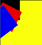


### setTransform

setTransform(a: number, b: number, c: number, d: number, e: number, f: number): void

Resets the existing transformation matrix and creates a new transformation matrix by using the same parameters as the **transform()** API.

**Widget capability**: This API can be used in ArkTS widgets since API version 9.

**Atomic service API**: This API can be used in atomic services since API version 11.

**System capability**: SystemCapability.ArkUI.ArkUI.Full

**Parameters**

| Name  | Type    | Mandatory | Description                  |
| ---- | ------ | ---- | -------------------- |
| a    | number | Yes   | X-axis scale.<br>Default value: **0**    |
| b    | number | Yes   | **skewY**: y-axis skew.<br>Default value: **0**    |
| c    | number | Yes   | **skewX**: y-axis skew.<br>Default value: **0**    |
| d    | number | Yes   | Y-axis scale.<br>Default value: **0**    |
| e    | number | Yes   | **translateX**: distance to translate on the x-axis.<br>Default unit: vp<br>Default value: **0** |
| f    | number | Yes   | **translateY**: distance to translate on the y-axis.<br>Default unit: vp<br>Default value: **0** |

 **Example**

  ```ts
  // xxx.ets
  @Entry
  @Component
  struct SetTransform {
    private settings: RenderingContextSettings = new RenderingContextSettings(true)
    private context: CanvasRenderingContext2D = new CanvasRenderingContext2D(this.settings)
    private offCanvas: OffscreenCanvas = new OffscreenCanvas(600, 600)

    build() {
      Flex({ direction: FlexDirection.Column, alignItems: ItemAlign.Center, justifyContent: FlexAlign.Center }) {
        Canvas(this.context)
          .width('100%')
          .height('100%')
          .backgroundColor('#ffff00')
          .onReady(() =>{
            let offContext = this.offCanvas.getContext("2d", this.settings)
            offContext.fillStyle = 'rgb(255,0,0)'
            offContext.fillRect(0, 0, 100, 100)
            offContext.setTransform(1,0.5, -0.5, 1, 10, 10)
            offContext.fillStyle = 'rgb(0,0,255)'
            offContext.fillRect(0, 0, 100, 100)
            let image = this.offCanvas.transferToImageBitmap()
            this.context.transferFromImageBitmap(image)
          })
      }
      .width('100%')
      .height('100%')
    }
  }
  ```

  


### setTransform

setTransform(transform?: Matrix2D): void

Resets the current transformation and creates a new transformation matrix based on the specified **Matrix2D** object.

**Widget capability**: This API can be used in ArkTS widgets since API version 9.

**Atomic service API**: This API can be used in atomic services since API version 11.

**System capability**: SystemCapability.ArkUI.ArkUI.Full

**Parameters**

| Name      | Type | Mandatory  | Description   |
| --------- | ---------------------------------------- | ---- | ----- |
| transform | [Matrix2D](ts-components-canvas-matrix2d.md#Matrix2D) | No | Transformation matrix.<br>Default value: **null** |

**Example**
 ```ts
 // xxx.ets
  @Entry
  @Component
  struct TransFormDemo {
    private settings: RenderingContextSettings = new RenderingContextSettings(true);
    private context1: CanvasRenderingContext2D = new CanvasRenderingContext2D(this.settings);
    private offcontext1: OffscreenCanvasRenderingContext2D = new OffscreenCanvasRenderingContext2D(600, 200, this.settings);
    private context2: CanvasRenderingContext2D = new CanvasRenderingContext2D(this.settings);
    private offcontext2: OffscreenCanvasRenderingContext2D = new OffscreenCanvasRenderingContext2D(600, 200, this.settings);

    build() {
      Flex({ direction: FlexDirection.Column, alignItems: ItemAlign.Center, justifyContent: FlexAlign.Center }) {
        Text('context1');
        Canvas(this.context1)
          .width('230vp')
          .height('160vp')
          .backgroundColor('#ffff00')
          .onReady(() =>{
            this.offcontext1.fillRect(100, 20, 50, 50);
            this.offcontext1.setTransform(1, 0.5, -0.5, 1, 10, 10);
            this.offcontext1.fillRect(100, 20, 50, 50);
            let image = this.offcontext1.transferToImageBitmap();
            this.context1.transferFromImageBitmap(image);
          })
        Text('context2');
        Canvas(this.context2)
          .width('230vp')
          .height('160vp')
          .backgroundColor('#0ffff0')
          .onReady(() =>{
            this.offcontext2.fillRect(100, 20, 50, 50);
            let storedTransform = this.offcontext1.getTransform();
            this.offcontext2.setTransform(storedTransform);
            this.offcontext2.fillRect(100, 20, 50, 50);
            let image = this.offcontext2.transferToImageBitmap();
            this.context2.transferFromImageBitmap(image);
          })
      }
      .width('100%')
      .height('100%')
    }
  }
 ```
 

### getTransform

getTransform(): Matrix2D

Obtains the current transformation matrix being applied to the context.

**Widget capability**: This API can be used in ArkTS widgets since API version 9.

**Atomic service API**: This API can be used in atomic services since API version 11.

**System capability**: SystemCapability.ArkUI.ArkUI.Full

**Return value**

| Type                                      | Description   |
| ---------------------------------------- | ----- |
| [Matrix2D](ts-components-canvas-matrix2d.md#Matrix2D) | Matrix object. |

**Example**

  ```ts
  // xxx.ets
  @Entry
  @Component
  struct TransFormDemo {
    private settings: RenderingContextSettings = new RenderingContextSettings(true);
    private context1: CanvasRenderingContext2D = new CanvasRenderingContext2D(this.settings);
    private offcontext1: OffscreenCanvasRenderingContext2D = new OffscreenCanvasRenderingContext2D(600, 100, this.settings);
    private context2: CanvasRenderingContext2D = new CanvasRenderingContext2D(this.settings);
    private offcontext2: OffscreenCanvasRenderingContext2D = new OffscreenCanvasRenderingContext2D(600, 100, this.settings);

    build() {
      Flex({ direction: FlexDirection.Column, alignItems: ItemAlign.Center, justifyContent: FlexAlign.Center }) {
        Text('context1');
        Canvas(this.context1)
          .width('230vp')
          .height('120vp')
          .backgroundColor('#ffff00')
          .onReady(() =>{
            this.offcontext1.fillRect(50, 50, 50, 50);
            this.offcontext1.setTransform(1.2, Math.PI/8, Math.PI/6, 0.5, 30, -25);
            this.offcontext1.fillRect(50, 50, 50, 50);
            let image = this.offcontext1.transferToImageBitmap();
            this.context1.transferFromImageBitmap(image);
          })
        Text('context2');
        Canvas(this.context2)
          .width('230vp')
          .height('120vp')
          .backgroundColor('#0ffff0')
          .onReady(() =>{
            this.offcontext2.fillRect(50, 50, 50, 50);
            let storedTransform = this.offcontext1.getTransform();
            console.log("Matrix [scaleX = " + storedTransform.scaleX + ", scaleY = " + storedTransform.scaleY +
            ", rotateX = " + storedTransform.rotateX + ", rotateY = " + storedTransform.rotateY +
            ", translateX = " + storedTransform.translateX + ", translateY = " + storedTransform.translateY + "]")
            this.offcontext2.setTransform(storedTransform);
            this.offcontext2.fillRect(50,50,50,50);
            let image = this.offcontext2.transferToImageBitmap();
            this.context2.transferFromImageBitmap(image);
          })
      }
      .width('100%')
      .height('100%')
    }
  }
  ```

  

### translate

translate(x: number, y: number): void

Moves the origin of the coordinate system.

**Widget capability**: This API can be used in ArkTS widgets since API version 9.

**Atomic service API**: This API can be used in atomic services since API version 11.

**System capability**: SystemCapability.ArkUI.ArkUI.Full

 **Parameters**

| Name  | Type    | Mandatory  | Description |
| ---- | ------ | ---- | -------- |
| x    | number | Yes | Distance to translate on the x-axis.<br>Default unit: vp<br>Default value: **0** |
| y    | number | Yes | Distance to translate on the y-axis.<br>Default unit: vp<br>Default value: **0** |

 **Example**

  ```ts
  // xxx.ets
  @Entry
  @Component
  struct Translate {
    private settings: RenderingContextSettings = new RenderingContextSettings(true)
    private context: CanvasRenderingContext2D = new CanvasRenderingContext2D(this.settings)
    private offCanvas: OffscreenCanvas = new OffscreenCanvas(600, 600)

    build() {
      Flex({ direction: FlexDirection.Column, alignItems: ItemAlign.Center, justifyContent: FlexAlign.Center }) {
        Canvas(this.context)
          .width('100%')
          .height('100%')
          .backgroundColor('#ffff00')
          .onReady(() =>{
            let offContext = this.offCanvas.getContext("2d", this.settings)
            offContext.fillRect(10, 10, 50, 50)
            offContext.translate(70, 70)
            offContext.fillRect(10, 10, 50, 50)
            let image = this.offCanvas.transferToImageBitmap()
            this.context.transferFromImageBitmap(image)
          })
      }
      .width('100%')
      .height('100%')
    }
  }
  ```

  


### drawImage

drawImage(image: ImageBitmap | PixelMap, dx: number, dy: number): void

drawImage(image: ImageBitmap | PixelMap, dx: number, dy: number, dw: number, dh: number): void

drawImage(image: ImageBitmap | PixelMap, sx: number, sy: number, sw: number, sh: number, dx: number, dy: number, dw: number, dh: number): void

Draws an image on the canvas.

**Widget capability**: This API can be used in ArkTS widgets since API version 9, except that **PixelMap** objects are not supported.

**Atomic service API**: This API can be used in atomic services since API version 11.

**System capability**: SystemCapability.ArkUI.ArkUI.Full

 **Parameters**

| Name   | Type | Mandatory  | Description |
| ----- | ---------------------------------------- | ---- | ----------------------------- |
| image | [ImageBitmap](ts-components-canvas-imagebitmap.md) or [PixelMap](../../apis-image-kit/js-apis-image.md#pixelmap7) | Yes | Image resource. For details, see **ImageBitmap** or **PixelMap**.<br>Default value: **null** |
| sx    | number | No | X coordinate of the upper left corner of the rectangle used to crop the source image.<br>Default unit: vp<br>Default value: **0** |
| sy    | number | No | Y coordinate of the upper left corner of the rectangle used to crop the source image.<br>Default unit: vp<br>Default value: **0** |
| sw    | number | No | Target width by which the source image is cropped.<br>Default unit: vp<br>Default value: **0**|
| sh    | number | No | Target height by which the source image is cropped.<br>Default unit: vp<br>Default value: **0**|
| dx    | number | Yes | X coordinate of the upper left corner of the drawing area on the canvas.<br>Default unit: vp<br>Default value: **0**|
| dy    | number | Yes | Y coordinate of the upper left corner of the drawing area on the canvas.<br>Default unit: vp<br>Default value: **0**|
| dw    | number | No | Width of the drawing area.<br>Default unit: vp<br>Default value: **0**|
| dh    | number | No | Height of the drawing area.<br>Default unit: vp<br>Default value: **0**|


 **Example**

  ```ts
  // xxx.ets
  @Entry
  @Component
  struct DrawImage {
    private settings: RenderingContextSettings = new RenderingContextSettings(true)
    private context: CanvasRenderingContext2D = new CanvasRenderingContext2D(this.settings)
    private img:ImageBitmap = new ImageBitmap("common/images/icon.jpg")
    private offCanvas: OffscreenCanvas = new OffscreenCanvas(600, 600)
    build() {
      Flex({ direction: FlexDirection.Column, alignItems: ItemAlign.Center, justifyContent: FlexAlign.Center }) {
        Canvas(this.context)
        .width('100%')
        .height('100%')
        .backgroundColor('#ffff00')
        .onReady(() => {
            let offContext = this.offCanvas.getContext("2d", this.settings)
            offContext.drawImage( this.img,0,0,400,200)
            let image = this.offCanvas.transferToImageBitmap()
            this.context.transferFromImageBitmap(image)
        })
      }
      .width('100%')
      .height('100%')
    }
  }
  ```

  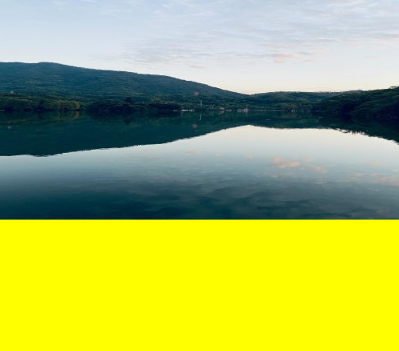


### createImageData

createImageData(sw: number, sh: number): ImageData

Creates an [ImageData](ts-components-canvas-imagedata.md) object with the same width and height of this **ImageData** object. The example is the same as that of **putImageData**.

**Widget capability**: This API can be used in ArkTS widgets since API version 9.

**Atomic service API**: This API can be used in atomic services since API version 11.

**System capability**: SystemCapability.ArkUI.ArkUI.Full

 **Parameters**

| Name  | Type    | Mandatory    | Description  |
| ---- | ------ | ---- | ------------- |
| sw   | number | Yes  | Width of the **ImageData** object.<br>Default unit: vp<br>Default value: **0** |
| sh   | number | Yes  | Height of the **ImageData** object.<br>Default unit: vp<br>Default value: **0** |


createImageData(imageData: ImageData): ImageData

Creates an **[ImageData](ts-components-canvas-imagedata.md)** object by copying an existing **ImageData** object. The example is the same as that of **putImageData**.

**Widget capability**: This API can be used in ArkTS widgets since API version 9.

 **Parameters**

| Name      | Type | Mandatory  | Description |
| --------- | ---------------------------------------- | ---- | ---------------- |
| imagedata | [ImageData](ts-components-canvas-imagedata.md) | Yes | **ImageData** object to copy.<br>Default value: **null** |

 **Return value**

| Type                                      | Description           |
| ---------------------------------------- | ------------- |
| [ImageData](ts-components-canvas-imagedata.md) | New **ImageData** object. |

### getPixelMap

getPixelMap(sx: number, sy: number, sw: number, sh: number): PixelMap

Obtains the [PixelMap](../../apis-image-kit/js-apis-image.md#pixelmap7) object created with the pixels within the specified area on the canvas. This API involves time-consuming memory copy. Therefore, avoid frequent calls to it.

**Atomic service API**: This API can be used in atomic services since API version 11.

**System capability**: SystemCapability.ArkUI.ArkUI.Full

 **Parameters**

| Name  | Type    | Mandatory | Description           |
| ---- | ------ | ---- | --------------- |
| sx   | number | Yes | X coordinate of the upper left corner of the output area.<br>Default unit: vp<br>Default value: **0** |
| sy   | number | Yes | Y coordinate of the upper left corner of the output area.<br>Default unit: vp<br>Default value: **0** |
| sw   | number | Yes | Width of the output area.<br>Default unit: vp<br>Default value: **0** |
| sh   | number | Yes | Height of the output area.<br>Default unit: vp<br>Default value: **0** |

**Return value**

| Type                                      | Description          |
| ---------------------------------------- | ------------ |
| [PixelMap](../../apis-image-kit/js-apis-image.md#pixelmap7) | **PixelMap** object. |

**Example**

  ```ts
  // xxx.ets
  @Entry
  @Component
  struct GetPixelMap {
    private settings: RenderingContextSettings = new RenderingContextSettings(true)
    private context: CanvasRenderingContext2D = new CanvasRenderingContext2D(this.settings)
    private offCanvas: OffscreenCanvas = new OffscreenCanvas(600, 600)
    private img:ImageBitmap = new ImageBitmap("/images/star.png")

    build() {
      Flex({ direction: FlexDirection.Column, alignItems: ItemAlign.Center, justifyContent: FlexAlign.Center }) {
        Canvas(this.context)
          .width('100%')
          .height('100%')
          .backgroundColor('#ffff00')
          .onReady(() =>{
             let offContext = this.offCanvas.getContext("2d", this.settings)
             offContext.drawImage(this.img, 100, 100, 130, 130)
             let pixelmap = offContext.getPixelMap(150, 150, 130, 130)
             offContext.setPixelMap(pixelmap)
             let image = this.offCanvas.transferToImageBitmap()
             this.context.transferFromImageBitmap(image)
          })
      }
      .width('100%')
      .height('100%')
    }
  }
  ```

  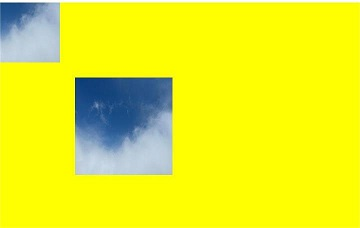

### setPixelMap

setPixelMap(value?: PixelMap): void

Draws the input [PixelMap](../../apis-image-kit/js-apis-image.md#pixelmap7) object on the canvas. The example is the same as that of **getPixelMap**.

**Atomic service API**: This API can be used in atomic services since API version 11.

**System capability**: SystemCapability.ArkUI.ArkUI.Full

 **Parameters**

| Name  | Type    | Mandatory  | Description |
| ---- | ------ | ---- | --------------- |
|  value  | [PixelMap](../../apis-image-kit/js-apis-image.md#pixelmap7) | No | **PixelMap** object that contains pixel values.<br>Default value: **null** |


### getImageData

getImageData(sx: number, sy: number, sw: number, sh: number): ImageData

Obtains the [ImageData](ts-components-canvas-imagedata.md) object created with the pixels within the specified area on the canvas. This API involves time-consuming memory copy. Therefore, avoid frequent calls to it.

**Widget capability**: This API can be used in ArkTS widgets since API version 9.

**Atomic service API**: This API can be used in atomic services since API version 11.

**System capability**: SystemCapability.ArkUI.ArkUI.Full

 **Parameters**

| Name  | Type    | Mandatory | Description     |
| ---- | ------ | ---- | --------------- |
| sx   | number | Yes | X coordinate of the upper left corner of the output area.<br>Default unit: vp<br>Default value: **0** |
| sy   | number | Yes | Y coordinate of the upper left corner of the output area.<br>Default unit: vp<br>Default value: **0** |
| sw   | number | Yes | Width of the output area.<br>Default unit: vp<br>Default value: **0**    |
| sh   | number | Yes | Height of the output area.<br>Default unit: vp<br>Default value: **0**    |

   **Return value**

| Type                                      | Description           |
| ---------------------------------------- | ------------- |
| [ImageData](ts-components-canvas-imagedata.md) | New **ImageData** object. |


**Example**

  ```ts
  // xxx.ets
  @Entry
  @Component
  struct GetImageData {
    private settings: RenderingContextSettings = new RenderingContextSettings(true)
    private context: CanvasRenderingContext2D = new CanvasRenderingContext2D(this.settings)
    private offCanvas: OffscreenCanvas = new OffscreenCanvas(600, 600)
    private img:ImageBitmap = new ImageBitmap("/common/images/1234.png")

    build() {
      Flex({ direction: FlexDirection.Column, alignItems: ItemAlign.Center, justifyContent: FlexAlign.Center }) {
        Canvas(this.context)
          .width('100%')
          .height('100%')
          .backgroundColor('#ffff00')
          .onReady(() =>{
            let offContext = this.offCanvas.getContext("2d", this.settings)
            offContext.drawImage(this.img,0,0,130,130)
            let imagedata = offContext.getImageData(50,50,130,130)
            offContext.putImageData(imagedata,150,150)
            let image = this.offCanvas.transferToImageBitmap()
            this.context.transferFromImageBitmap(image)
          })
      }
      .width('100%')
      .height('100%')
    }
  }
  ```

  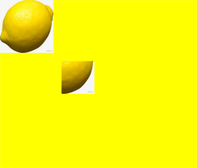


### putImageData

putImageData(imageData: ImageData, dx: number | string, dy: number | string): void

putImageData(imageData: ImageData, dx: number | string, dy: number | string, dirtyX: number | string, dirtyY: number | string, dirtyWidth?: number | string, dirtyHeight: number | string): void

Puts an **[ImageData](ts-components-canvas-imagedata.md)** object onto a rectangular area on the canvas.

**Widget capability**: This API can be used in ArkTS widgets since API version 9.

**Atomic service API**: This API can be used in atomic services since API version 11.

**System capability**: SystemCapability.ArkUI.ArkUI.Full

 **Parameters**

| Name         | Type | Mandatory | Description |
| ----------- | ---------------------------------------- | ---- | ----------------------------- |
| imagedata   | Object | Yes | **ImageData** object with pixels to put onto the canvas.<br>Default value: **null** |
| dx          | number \| string<sup>10+</sup> | Yes | X-axis offset of the rectangular area on the canvas.<br>Default unit: vp<br>Default value: **0**|
| dy          | number \| string<sup>10+</sup> | Yes  | Y-axis offset of the rectangular area on the canvas.<br>Default unit: vp<br>Default value: **0**|
| dirtyX      | number \| string<sup>10+</sup> | No | X-axis offset of the upper left corner of the rectangular area relative to that of the source image.<br>Default unit: vp<br>Default value: **0** |
| dirtyY      | number \| string<sup>10+</sup> | No | Y-axis offset of the upper left corner of the rectangular area relative to that of the source image.<br>Default unit: vp<br>Default value: **0** |
| dirtyWidth  | number \| string<sup>10+</sup> | No | Width of the rectangular area by which the source image is cropped.<br>Default unit: vp<br>Default value: width of the **ImageData** object|
| dirtyHeight | number \| string<sup>10+</sup> | No | Height of the rectangular area by which the source image is cropped.<br>Default unit: vp<br>Default value: height of the **ImageData** object|

 **Example**

  ```ts
  // xxx.ets
  @Entry
  @Component
  struct PutImageData {
    private settings: RenderingContextSettings = new RenderingContextSettings(true)
    private context: CanvasRenderingContext2D = new CanvasRenderingContext2D(this.settings)
    private offCanvas: OffscreenCanvas = new OffscreenCanvas(600, 600)
    build() {
      Flex({ direction: FlexDirection.Column, alignItems: ItemAlign.Center, justifyContent: FlexAlign.Center }) {
        Canvas(this.context)
          .width('100%')
          .height('100%')
          .backgroundColor('#ffff00')
          .onReady(() =>{
            let offContext = this.offCanvas.getContext("2d", this.settings)
            let imageDataNum = offContext.createImageData(100, 100)
            for (let i = 0; i < imageDataNum.data.length; i += 4) {
              imageDataNum.data[i + 0] = 255
              imageDataNum.data[i + 1] = 0
              imageDataNum.data[i + 2] = 255
              imageDataNum.data[i + 3] = 255
            }
            let imageData = this.context.createImageData(imageDataNum)
            offContext.putImageData(imageData, 10, 10)
            let image = this.offCanvas.transferToImageBitmap()
            this.context.transferFromImageBitmap(image)
          })
      }
      .width('100%')
      .height('100%')
    }
  }
  ```

  

### setLineDash

setLineDash(segments: number[]): void

Sets the dash line style.

**Widget capability**: This API can be used in ArkTS widgets since API version 9.

**Atomic service API**: This API can be used in atomic services since API version 11.

**Parameters** 

| Name     | Type  |  Mandatory | Description            |
| -------- | -------- | -------- | ------------------- |
| segments | number[] | Yes | An array of numbers that specify distances to alternately draw a line and a gap.<br>Default unit: vp |

**Example** 

  ```ts
  @Entry
  @Component
  struct SetLineDash {
    private settings: RenderingContextSettings = new RenderingContextSettings(true)
    private context: CanvasRenderingContext2D = new CanvasRenderingContext2D(this.settings)
    private offCanvas: OffscreenCanvas = new OffscreenCanvas(600, 600)
    
    build() {
      Flex({ direction: FlexDirection.Column, alignItems: ItemAlign.Center, justifyContent: FlexAlign.Center }) {
        Canvas(this.context)
          .width('100%')
          .height('100%')
          .backgroundColor('#ffff00')
          .onReady(() =>{
            let offContext = this.offCanvas.getContext("2d", this.settings)
            offContext.arc(100, 75, 50, 0, 6.28)
            offContext.setLineDash([10,20])
            offContext.stroke()
            let image = this.offCanvas.transferToImageBitmap()
            this.context.transferFromImageBitmap(image)
        })
      }
      .width('100%')
      .height('100%')
    }
  }
  ```
  


### getLineDash

getLineDash(): number[]

Obtains the dash line style.

**Widget capability**: This API can be used in ArkTS widgets since API version 9.

**Atomic service API**: This API can be used in atomic services since API version 11.

**Return value** 

| Type      | Description                      |
| -------- | ------------------------ |
| number[] | Interval of alternate line segments and the length of spacing.<br>Default unit: vp |

**Example** 

  ```ts
  // xxx.ets
  @Entry
  @Component
  struct OffscreenCanvasGetLineDash {
    @State message: string = 'Hello World'
    private settings: RenderingContextSettings = new RenderingContextSettings(true)
    private context: CanvasRenderingContext2D = new CanvasRenderingContext2D(this.settings)
    private offCanvas: OffscreenCanvas = new OffscreenCanvas(600, 600)
    build() {
      Row() {
        Column() {
          Text(this.message)
            .fontSize(50)
            .fontWeight(FontWeight.Bold)
            .onClick(()=>{
              console.error('before getlinedash clicked')
              let offContext = this.offCanvas.getContext("2d", this.settings)
              let res = offContext.getLineDash()
              console.error(JSON.stringify(res))
            })
          Canvas(this.context)
            .width('100%')
            .height('100%')
            .backgroundColor('#ffff00')
            .onReady(() => {
              let offContext = this.offCanvas.getContext("2d", this.settings)
              offContext.arc(100, 75, 50, 0, 6.28)
              offContext.setLineDash([10,20])
              offContext.stroke()
              let res = offContext.getLineDash()
              let image = this.offCanvas.transferToImageBitmap()
              this.context.transferFromImageBitmap(image)
            })
        }
        .width('100%')
      }
      .height('100%')
    }
  }
  ```
 


### toDataURL

toDataURL(type?: string, quality?: any): string

Generates a URL containing image display information.

**Widget capability**: This API can be used in ArkTS widgets since API version 9.

**Atomic service API**: This API can be used in atomic services since API version 11.

**System capability**: SystemCapability.ArkUI.ArkUI.Full

**Parameters** 

| Name    | Type  | Mandatory  | Description                                      |
| ------- | ------ | ---- | ---------------------------------------- |
| type    | string | No   | Image format. The default value is **image/png**.           |
| quality | any | No   | Image quality, which ranges from 0 to 1, when the image format is **image/jpeg** or **image/webp**. If the set value is beyond the value range, the default value **0.92** is used. |

**Return value** 

| Type    | Description       |
| ------ | --------- |
| string | Image URL. |

**Example**

  ```ts
  // xxx.ets
  @Entry
  @Component
  struct ToDataURL {
    private settings: RenderingContextSettings = new RenderingContextSettings(true)
    private context: CanvasRenderingContext2D = new CanvasRenderingContext2D(this.settings)
    private offCanvas: OffscreenCanvas = new OffscreenCanvas(100, 100)
    @State dataURL: string = ""

    build() {
      Flex({ direction: FlexDirection.Column, alignItems: ItemAlign.Center, justifyContent: FlexAlign.Center }) {
        Canvas(this.context)
          .width(100)
          .height(100)
          .onReady(() => {
            let offContext = this.offCanvas.getContext("2d", this.settings)
            offContext.fillRect(0,0,100,100)
            this.dataURL = offContext.toDataURL()
          })
        Text(this.dataURL)
      }
      .width('100%')
      .height('100%')
      .backgroundColor('#ffff00')
    }
  }
  ```
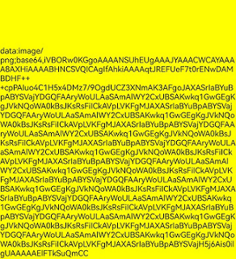


### transferToImageBitmap

transferToImageBitmap(): ImageBitmap

Creates an **ImageBitmap** object on the most recently rendered image of the **OffscreenCanvas**.

**Widget capability**: This API can be used in ArkTS widgets since API version 9.

**Atomic service API**: This API can be used in atomic services since API version 11.

**System capability**: SystemCapability.ArkUI.ArkUI.Full

**Return value** 

| Type                                      | Description             |
| ---------------------------------------- | --------------- |
| [ImageBitmap](ts-components-canvas-imagebitmap.md) | Pixel data rendered on the **OffscreenCanvas**. |


 **Example**

  ```ts
  // xxx.ets
  @Entry
  @Component
  struct PutImageData {
    private settings: RenderingContextSettings = new RenderingContextSettings(true)
    private context: CanvasRenderingContext2D = new CanvasRenderingContext2D(this.settings)
    private offCanvas: OffscreenCanvas = new OffscreenCanvas(600, 600)

    build() {
      Flex({ direction: FlexDirection.Column, alignItems: ItemAlign.Center, justifyContent: FlexAlign.Center }) {
        Canvas(this.context)
          .width('100%')
          .height('100%')
          .backgroundColor('#ffff00')
          .onReady(() =>{
            let offContext = this.offCanvas.getContext("2d", this.settings)
            let imageData = offContext.createImageData(100, 100)
            for (let i = 0; i < imageData.data.length; i += 4) {
              imageData.data[i + 0] = 255
              imageData.data[i + 1] = 0
              imageData.data[i + 2] = 255
              imageData.data[i + 3] = 255
            }
            offContext.putImageData(imageData, 10, 10)
            let image = this.offCanvas.transferToImageBitmap()
            this.context.transferFromImageBitmap(image)
          })
      }
      .width('100%')
      .height('100%')
    }
  }
  ```
 

### restore

restore(): void

Restores the saved drawing context.

**Widget capability**: This API can be used in ArkTS widgets since API version 9.

**Atomic service API**: This API can be used in atomic services since API version 11.

**System capability**: SystemCapability.ArkUI.ArkUI.Full

 **Example**

  ```ts
  // xxx.ets
  @Entry
  @Component
  struct CanvasExample {
    private settings: RenderingContextSettings = new RenderingContextSettings(true)
    private context: CanvasRenderingContext2D = new CanvasRenderingContext2D(this.settings)
    private offCanvas: OffscreenCanvas = new OffscreenCanvas(600, 600)
    
    build() {
      Flex({ direction: FlexDirection.Column, alignItems: ItemAlign.Center, justifyContent: FlexAlign.Center }) {
        Canvas(this.context)
          .width('100%')
          .height('100%')
          .backgroundColor('#ffff00')
          .onReady(() =>{
            let offContext = this.offCanvas.getContext("2d", this.settings)
            offContext.save() // save the default state
            offContext.fillStyle = "#00ff00"
            offContext.fillRect(20, 20, 100, 100)
            offContext.restore() // restore to the default state
            offContext.fillRect(150, 75, 100, 100)
            let image = this.offCanvas.transferToImageBitmap()
            this.context.transferFromImageBitmap(image)
          })
      }
      .width('100%')
      .height('100%')
    }
  }
  ```
 


### save

save(): void

Saves the current drawing context.

**Widget capability**: This API can be used in ArkTS widgets since API version 9.

**Atomic service API**: This API can be used in atomic services since API version 11.

**System capability**: SystemCapability.ArkUI.ArkUI.Full

 **Example** 

  ```ts
  // xxx.ets
  @Entry
  @Component
  struct CanvasExample {
    private settings: RenderingContextSettings = new RenderingContextSettings(true)
    private context: CanvasRenderingContext2D = new CanvasRenderingContext2D(this.settings)
    private offCanvas: OffscreenCanvas = new OffscreenCanvas(600, 600)
    
    build() {
      Flex({ direction: FlexDirection.Column, alignItems: ItemAlign.Center, justifyContent: FlexAlign.Center }) {
        Canvas(this.context)
          .width('100%')
          .height('100%')
          .backgroundColor('#ffff00')
          .onReady(() =>{
            let offContext = this.offCanvas.getContext("2d", this.settings)
            offContext.save() // save the default state
            offContext.fillStyle = "#00ff00"
            offContext.fillRect(20, 20, 100, 100)
            offContext.restore() // restore to the default state
            offContext.fillRect(150, 75, 100, 100)
            let image = this.offCanvas.transferToImageBitmap()
            this.context.transferFromImageBitmap(image)
          })
      }
      .width('100%')
      .height('100%')
    }
  }
  ```
 


### createLinearGradient

createLinearGradient(x0: number, y0: number, x1: number, y1: number): CanvasGradient

Creates a linear gradient.

**Widget capability**: This API can be used in ArkTS widgets since API version 9.

**Atomic service API**: This API can be used in atomic services since API version 11.

**System capability**: SystemCapability.ArkUI.ArkUI.Full

 **Parameters**

| Name  | Type    | Mandatory | Description |
| ---- | ------ | ---- | -------- |
| x0   | number | Yes | X coordinate of the start point.<br>Default unit: vp<br>Default value: **0** |
| y0   | number | Yes | Y coordinate of the start point.<br>Default unit: vp<br>Default value: **0** |
| x1   | number | Yes | X coordinate of the end point.<br>Default unit: vp<br>Default value: **0** |
| y1   | number | Yes | Y coordinate of the end point.<br>Default unit: vp<br>Default value: **0** |

**Return value** 

| Type    | Description       |
| ------ | --------- |
| [CanvasGradient](ts-components-canvas-canvasgradient.md) | New **CanvasGradient** object used to create a gradient on the offscreen canvas. |

 **Example** 

  ```ts
  // xxx.ets
  @Entry
  @Component
  struct CreateLinearGradient {
    private settings: RenderingContextSettings = new RenderingContextSettings(true)
    private context: CanvasRenderingContext2D = new CanvasRenderingContext2D(this.settings)
    private offCanvas: OffscreenCanvas = new OffscreenCanvas(600, 600)
    
    build() {
      Flex({ direction: FlexDirection.Column, alignItems: ItemAlign.Center, justifyContent: FlexAlign.Center }) {
        Canvas(this.context)
          .width('100%')
          .height('100%')
          .backgroundColor('#ffff00')
          .onReady(() =>{
            let offContext = this.offCanvas.getContext("2d", this.settings)
            let grad = offContext.createLinearGradient(50,0, 300,100)
            grad.addColorStop(0.0, '#ff0000')
            grad.addColorStop(0.5, '#ffffff')
            grad.addColorStop(1.0, '#00ff00')
            offContext.fillStyle = grad
            offContext.fillRect(0, 0, 400, 400)
            let image = this.offCanvas.transferToImageBitmap()
            this.context.transferFromImageBitmap(image)
          })
      }
      .width('100%')
      .height('100%')
    }
  }
  ```

  


### createRadialGradient

createRadialGradient(x0: number, y0: number, r0: number, x1: number, y1: number, r1: number): CanvasGradient

Creates a linear gradient.

**Widget capability**: This API can be used in ArkTS widgets since API version 9.

**Atomic service API**: This API can be used in atomic services since API version 11.

**System capability**: SystemCapability.ArkUI.ArkUI.Full

  **Parameters**

| Name  | Type    | Mandatory  | Description |
| ---- | ------ | ---- | ----------------- |
| x0   | number | Yes   | X coordinate of the center of the start circle.<br>Default unit: vp<br>Default value: **0**        |
| y0   | number | Yes   | Y coordinate of the center of the start circle.<br>Default unit: vp<br>Default value: **0**        |
| r0   | number | Yes   | Radius of the start circle, which must be a non-negative finite number.<br>Default unit: vp<br>Default value: **0** |
| x1   | number | Yes   | X coordinate of the center of the end circle.<br>Default unit: vp<br>Default value: **0**        |
| y1   | number | Yes   | Y coordinate of the center of the end circle.<br>Default unit: vp<br>Default value: **0**        |
| r1   | number | Yes   | Radius of the end circle, which must be a non-negative finite number.<br>Default unit: vp<br>Default value: **0** |

**Return value** 

| Type    | Description       |
| ------ | --------- |
| [CanvasGradient](ts-components-canvas-canvasgradient.md) | New **CanvasGradient** object used to create a gradient on the offscreen canvas. |

  **Example** 

  ```ts
  // xxx.ets
  @Entry
  @Component
  struct CreateRadialGradient {
    private settings: RenderingContextSettings = new RenderingContextSettings(true)
    private context: CanvasRenderingContext2D = new CanvasRenderingContext2D(this.settings)
    private offCanvas: OffscreenCanvas = new OffscreenCanvas(600, 600)
    
    build() {
      Flex({ direction: FlexDirection.Column, alignItems: ItemAlign.Center, justifyContent: FlexAlign.Center }) {
        Canvas(this.context)
          .width('100%')
          .height('100%')
          .backgroundColor('#ffff00')
          .onReady(() =>{
            let offContext = this.offCanvas.getContext("2d", this.settings)
            let grad = offContext.createRadialGradient(200,200,50, 200,200,200)
            grad.addColorStop(0.0, '#ff0000')
            grad.addColorStop(0.5, '#ffffff')
            grad.addColorStop(1.0, '#00ff00')
            offContext.fillStyle = grad
            offContext.fillRect(0, 0, 440, 440)
            let image = this.offCanvas.transferToImageBitmap()
            this.context.transferFromImageBitmap(image)
          })
      }
      .width('100%')
      .height('100%')
    }
  }
  ```

  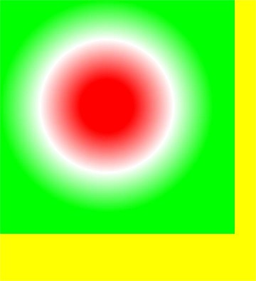

### createConicGradient<sup>10+</sup>

createConicGradient(startAngle: number, x: number, y: number): CanvasGradient

Creates a conic gradient.

**Atomic service API**: This API can be used in atomic services since API version 11.

**System capability**: SystemCapability.ArkUI.ArkUI.Full

**Parameters**

| Name | Type | Mandatory | Description |
| ---------- | ------ | ----  | ----------------------------------- |
| startAngle | number | Yes | Angle at which the gradient starts, in radians. The angle measurement starts horizontally from the right side of the center and moves clockwise.<br>Default value: **0** |
| x          | number | Yes | X coordinate of the center of the conic gradient.<br>Default unit: vp<br>Default value: **0**|
| y          | number | Yes | Y coordinate of the center of the conic gradient.<br>Default unit: vp<br>Default value: **0**|

| Type      | Description                      |
| -------- | ------------------------ |
| [CanvasGradient](ts-components-canvas-canvasgradient.md) | Returns a gradient object. |

**Return value** 

| Type    | Description       |
| ------ | --------- |
| [CanvasGradient](ts-components-canvas-canvasgradient.md) | New **CanvasGradient** object used to create a gradient on the offscreen canvas. |

**Example**

```ts
// xxx.ets
@Entry
@Component
struct OffscreenCanvasConicGradientPage {
  private settings: RenderingContextSettings = new RenderingContextSettings(true)
  private context: CanvasRenderingContext2D = new CanvasRenderingContext2D(this.settings)
  private offCanvas: OffscreenCanvas = new OffscreenCanvas(600, 600)

  build() {
    Flex({ direction: FlexDirection.Column, alignItems: ItemAlign.Center, justifyContent: FlexAlign.Center }) {
      Canvas(this.context)
        .width('100%')
        .height('100%')
        .backgroundColor('#ffffff')
        .onReady(() =>{
          let offContext = this.offCanvas.getContext("2d", this.settings)
          let grad = offContext.createConicGradient(0, 50, 80)
          grad.addColorStop(0.0, '#ff0000')
          grad.addColorStop(0.5, '#ffffff')
          grad.addColorStop(1.0, '#00ff00')
          offContext.fillStyle = grad
          offContext.fillRect(0, 30, 100, 100)
          let image = this.offCanvas.transferToImageBitmap()
          this.context.transferFromImageBitmap(image)
        })
    }
    .width('100%')
    .height('100%')
  }
}
```

  
