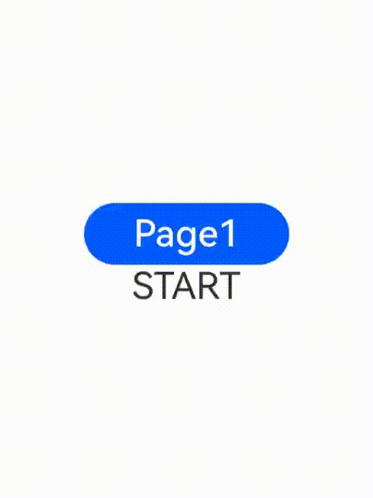

# Page Transition (pageTransition)

You can customize the page entrance and exit animations in the **pageTransition** API for transition between pages. For details, see [Page Transition Animation](../../../ui/arkts-page-transition-animation.md).

> **NOTE**
>
> This event is supported since API version 7. Updates will be marked with a superscript to indicate their earliest API version.
>
> To achieve a better transition effect, you are advised to use the [Navigation](../../../ui/arkts-navigation-navigation.md) component and [modal transition](../../../ui/arkts-modal-transition.md).

## pageTransition

pageTransition?(): void

Defines the transition animation to play when the user accesses this page or is redirected from this page to another page.

**Atomic service API**: This API can be used in atomic services since API version 11.

**System capability**: SystemCapability.ArkUI.ArkUI.Full

## PageTransitionEnter

PageTransitionEnter(value: PageTransitionOptions)

Sets the page entrance animation. Inherits from [CommonTransition](#commontransition).

**Atomic service API**: This API can be used in atomic services since API version 11.

**System capability**: SystemCapability.ArkUI.ArkUI.Full

**Parameters**

| Name| Type                                                  | Mandatory| Description                |
| ------ | ------------------------------------------------------ | ---- | -------------------- |
| value  | [PageTransitionOptions](#pagetransitionoptions) | Yes  | Page entrance animation.|

### onEnter

onEnter(event: PageTransitionCallback): PageTransitionEnterInterface

Invoked on a per-frame basis until the entrance animation is complete, with the **progress** parameter changing from 0 to 1.

**Atomic service API**: This API can be used in atomic services since API version 11.

**System capability**: SystemCapability.ArkUI.ArkUI.Full

**Parameters**

| Name| Type                                                              | Mandatory| Description                                               |
| ------ | ----------------------------------------------------------------- | ---- | ------------------------------------------------    |
| event  | [PageTransitionCallback](#pagetransitioncallback14) | Yes  | Callback invoked on a per-frame basis until the entrance animation is complete, with the **progress** parameter changing from 0 to 1.|

**Example**

```js
  pageTransition() {
    PageTransitionEnter({ duration: 1200, curve: Curve.Linear })
      // During the transition animation, the entrance animation has a type that represents the route type, and a progress that increases from 0 to 1.
      .onEnter((type: RouteType, progress: number) => {
        // Service logic
      })
  }
```

## PageTransitionExit

PageTransitionExit(value: PageTransitionOptions)

Sets the page exit animation. Inherits from [CommonTransition](#commontransition).

**Atomic service API**: This API can be used in atomic services since API version 11.

**System capability**: SystemCapability.ArkUI.ArkUI.Full

**Parameters**

| Name| Type                                                   | Mandatory| Description                |
| ------ | ------------------------------------------------------- | ---- | -------------------- |
| value  | [PageTransitionOptions](#pagetransitionoptions) | Yes  | Page exit animation.|

### onExit

onExit(event: PageTransitionCallback): PageTransitionExitInterface

Invoked on a per-frame basis until the exit animation is complete, with the **progress** parameter changing from 0 to 1.

**System capability**: SystemCapability.ArkUI.ArkUI.Full

**Atomic service API**: This API can be used in atomic services since API version 11.

**Parameters**

| Name| Type                                                              | Mandatory| Description                                               |
| ------ | ----------------------------------------------------------------- | ---- | ------------------------------------------------    |
| event  | [PageTransitionCallback](#pagetransitioncallback14) | Yes  | Callback invoked on a per-frame basis until the exit animation is complete, with the **progress** parameter changing from 0 to 1.|

**Example**

```js
  pageTransition() {
    PageTransitionExit({ duration: 1200, curve: Curve.Linear })
      // During the transition animation, the exit animation has a type that represents the route type, and a progress that increases from 0 to 1.
      .onExit((type: RouteType, progress: number) => {
        // Service logic
      })
  }
```

## PageTransitionOptions

**Atomic service API**: This API can be used in atomic services since API version 11.

**System capability**: SystemCapability.ArkUI.ArkUI.Full

| Name    | Type                                                        | Mandatory| Description                                                        |
| -------- | ------------------------------------------------------------ | ---- | ------------------------------------------------------------ |
| type     | [RouteType](#routetype)                              | No  | Route type for the page transition effect to take effect.<br>Default value: **RouteType.None**   |
| duration | number                                                       | No  | Animation duration.<br>Unit: ms<br>Default value: **1000**<br>Value range: [0, +∞)                |
| curve    | [Curve](ts-appendix-enums.md#curve) \| string \| [ICurve](../js-apis-curve.md#icurve9)<sup>10+</sup> | No  | Animation curve.<br>You are advised to specify the curve using the **Curve** or** ICurve** type.<br>For the string type, this parameter indicates an animation interpolation curve. For available values, see the **curve** parameter in [AnimateParam](./ts-explicit-animation.md#animateparam).<br>Default value: **Curve.Linear**|
| delay    | number                                                       | No  | Animation delay.<br>Unit: ms<br>Default value: **0**<br>**NOTE**<br>If no match is found, the default page transition effect is used (which may vary according to the device). To disable the default page transition effect, set **duration** to **0**.|

## CommonTransition

Defines a common transition animation for page transitions.

**Atomic service API**: This API can be used in atomic services since API version 11.

**System capability**: SystemCapability.ArkUI.ArkUI.Full

### constructor

constructor()

A constructor used to create a common transition animation.

**Atomic service API**: This API can be used in atomic services since API version 11.

**System capability**: SystemCapability.ArkUI.ArkUI.Full

### slide

slide(value: SlideEffect): T

Sets the slide-in and slide-out effects for page transitions.

**Atomic service API**: This API can be used in atomic services since API version 11.

**System capability**: SystemCapability.ArkUI.ArkUI.Full

**Parameters**

| Name | Type                                                        | Mandatory| Description                                                        |
| ------- | ------------------------------------------------------------ | ---- | ------------------------------------------------------------ |
| value   | [SlideEffect](#slideeffect) | Yes  | Slide-in and slide-out effects for page transitions.|

### translate

translate(value: TranslateOptions): T

Sets the translation effect for page transitions.

**Atomic service API**: This API can be used in atomic services since API version 11.

**System capability**: SystemCapability.ArkUI.ArkUI.Full

**Parameters**

| Name| Type                                                        | Mandatory| Description                                                        |
| ------ | ------------------------------------------------------------ | ---- | ------------------------------------------------------------ |
| value  | [TranslateOptions](ts-universal-attributes-transformation.md#translateoptions) | Yes  | Translation effect for page transitions, specifying the start value for entrance and the end value for exit. When this parameter is set together with **slide**, the latter takes effect by default.<br>- **x**: translation distance along the x-axis.<br>- **y**: translation distance along the y-axis.<br>- **z**: translation distance along the y-axis.|

### scale

scale(value: ScaleOptions): T

Sets the scaling effect for page transitions.

**Atomic service API**: This API can be used in atomic services since API version 11.

**System capability**: SystemCapability.ArkUI.ArkUI.Full

**Parameters**

| Name| Type                                                        | Mandatory| Description                                                        |
| ------ | ------------------------------------------------------------ | ---- | ------------------------------------------------------------ |
| value  | [ScaleOptions](ts-universal-attributes-transformation.md#scaleoptions) | Yes  | Scaling effect for page transitions, specifying the start value for entrance and the end value for exit.<br>- **x**: scale factor along the x-axis.<br>- **y**: scale factor along the y-axis.<br>- **z**: scale factor along the z-axis.<br>- **centerX** and **centerY**: scaling center. The default values are both **"50%"**, meaning the center of the page is used as the scaling center by default.<br>- If the center point is (0, 0), it refers to the upper left corner of the component.|

### opacity

opacity(value: number): T

Sets the starting opacity value for entrance or the ending opacity value for exit.

**Atomic service API**: This API can be used in atomic services since API version 11.

**System capability**: SystemCapability.ArkUI.ArkUI.Full

**Parameters**

| Name | Type                                                        | Mandatory| Description                                                        |
| ------- | ------------------------------------------------------------ | ---- | ------------------------------------------------------------ |
| value   | number | Yes  | Starting opacity value for entrance or the ending opacity value for exit.<br>Value range: [0, 1]|

## PageTransitionCallback<sup>14+</sup>

type PageTransitionCallback = (type: RouteType, progress: number) => void

Represents the callback for page transition events.

**Atomic service API**: This API can be used in atomic services since API version 14.

**System capability**: SystemCapability.ArkUI.ArkUI.Full

| Name | Type   | Mandatory| Description             |
| ------ | ------ | ---- | ---------------- |
| type | [RouteType](#routetype) | Yes|  Type of page transition.|
| progress | number | Yes| Transition progress, ranging from 0 to 1.|

 ## RouteType

**System capability**: SystemCapability.ArkUI.ArkUI.Full

**Atomic service API**: This API can be used in atomic services since API version 11.


| Name| Description                                                        |
| ---- | ------------------------------------------------------------ |
| Pop  | Redirects to a specified page. To redirect the user from page B back to page A, set **RouteType** of **PageTransitionExit** to **None** or **Pop** for page B and set **RouteType** of **PageTransitionEnter** to **None** or **Pop** for page A.|
| Push | Redirects to the next page. To redirect the user from page A to page B, set **RouteType** of **PageTransitionExit** to **None** or **Push** for page A and set **RouteType** of **PageTransitionEnter** to **None** or **Push** for page B.|
| None | The page is not redirected. The animation specified by **PageTransitionEnter** takes effect for page entrance, and the animation specified by **PageTransitionExit** takes effect for page exit.|

## SlideEffect

**Atomic service API**: This API can be used in atomic services since API version 11.

**System capability**: SystemCapability.ArkUI.ArkUI.Full

| Name               | Description                                                        |
| ------------------- | ------------------------------------------------------------ |
| Left                | When set to Enter, slides in from the left. When set to Exit, slides out to the left.<br>**Atomic service API**: This API can be used in atomic services since API version 11.|
| Right               | When set to Enter, slides in from the right. When set to Exit, slides out to the right.<br>**Atomic service API**: This API can be used in atomic services since API version 11.|
| Top                 | When set to Enter, slides in from the top. When set to Exit, slides out to the top.<br>**Atomic service API**: This API can be used in atomic services since API version 11.|
| Bottom              | When set to Enter, slides in from the bottom. When set to Exit, slides out to the bottom.<br>**Atomic service API**: This API can be used in atomic services since API version 11.|
| START<sup>12+</sup> | Left-to-right scripts: When set to Enter, slides in from the left; when set to Exit, slides out to the left. Right-to-left scripts: When set to Enter, slides in from the right; when set to Exit, slides out to the right.<br>**Atomic service API**: This API can be used in atomic services since API version 12.|
| END<sup>12+</sup>   | Left-to-right scripts: When set to Enter, slides in from the right; when set to Exit, slides out to the right. Right-to-left scripts: When set to Enter, slides in from the left; when set to Exit, slides out to the left.<br>**Atomic service API**: This API can be used in atomic services since API version 12.|

## Example

### Example 1: Configuring Entrance and Exit Animations

Method 1: Configure different entrance and exit animations based on different transition types.

```ts
// index.ets
import { router } from '@kit.ArkUI';

@Entry
@Component
struct Index {
  @State scale1: number = 1
  @State opacity1: number = 1

  build() {
    Column() {
      Image($r("app.media.transition_image1")).width('100%').height('100%')
    }
    .width('100%')
    .height('100%')
    .scale({ x: this.scale1 })
    .opacity(this.opacity1)
    .onClick(() => {
      router.pushUrl({ url: 'pages/Page1' })
    })
  }

  pageTransition() {
    PageTransitionEnter({ duration: 1200, curve: Curve.Linear })
      .onEnter((type: RouteType, progress: number) => {
        if (type == RouteType.Push || type == RouteType.Pop) {
          this.scale1 = progress
          this.opacity1 = progress
        }
      })
    PageTransitionExit({ duration: 1200, curve: Curve.Ease })
      .onExit((type: RouteType, progress: number) => {
        if (type == RouteType.Push) {
          this.scale1 = 1 - progress
          this.opacity1 = 1 - progress
        }
      })
  }
}
```

```ts
// page1.ets
import { router } from '@kit.ArkUI';

@Entry
@Component
struct Page1 {
  @State scale2: number = 1
  @State opacity2: number = 1

  build() {
    Column() {
      Image($r("app.media.transition_image2")).width('100%').height('100%') // Store the image in the media folder.
    }
    .width('100%')
    .height('100%')
    .scale({ x: this.scale2 })
    .opacity(this.opacity2)
    .onClick(() => {
      router.pushUrl({ url: 'pages/Index' })
    })
  }

  pageTransition() {
    PageTransitionEnter({ duration: 1200, curve: Curve.Linear })
      .onEnter((type: RouteType, progress: number) => {
        if (type == RouteType.Push || type == RouteType.Pop) {
          this.scale2 = progress
        }
        this.opacity2 = progress
      })
    PageTransitionExit({ duration: 1200, curve: Curve.Ease })
      .onExit((type: RouteType, progress: number) => {
        if (type == RouteType.Pop) {
          this.scale2 = 1 - progress
          this.opacity2 = 1 - progress
        }
      })
  }
}
```


Method 2: Configure the entrance animation of sliding in from the left and the exit animation of translating with opacity change.

```ts
// index.ets 
@Entry
@Component
struct PageTransitionExample {
  build() {
    Column() {
      Navigator({ target: 'pages/page1', type: NavigationType.Push }) {
        Image($r("app.media.transition_image2")).width('100%').height('100%') // The image is stored in the media folder.
      }
    }
  }

  // Use the default effects provided by the system, such as translation, scaling, and opacity.
  pageTransition() {
    // Set the duration of the entrance animation to 1200 ms, in the purpose of matching the duration of the exit animation of the other page.
    PageTransitionEnter({ duration: 1200 })
      .slide(SlideEffect.Left)
    // Set the duration of the exit animation to 1000 ms, in the purpose of matching the duration of the entrance animation of the other page.
    PageTransitionExit({ duration: 1000 })
      .translate({ x: 100.0, y: 100.0 })
      .opacity(0)
  }
}
```

```ts
// page1.ets
@Entry
@Component
struct PageTransitionExample1 {
  build() {
    Column() {
      Navigator({ target: 'pages/index', type: NavigationType.Push }) {
        Image($r('app.media.bg2')).width('100%').height('100%') // The image is stored in the media folder.
      }
    }
  }

  // Use the default effects provided by the system, such as translation, scaling, and opacity.
  pageTransition() {
    // Set the duration of the entrance animation to 1000 ms, in the purpose of matching the duration of the exit animation of the other page.
    PageTransitionEnter({ duration: 1000 })
      .slide(SlideEffect.Left)
    // Set the duration of the exit animation to 1200 ms, in the purpose of matching the duration of the entrance animation of the other page.
    PageTransitionExit({ duration: 1200 })
      .translate({ x: 100.0, y: 100.0 })
      .opacity(0)
  }
}
```


### Example 2: Setting Translation Effects for Entrance and Exit

Method 1: Configure the various translation effects provided, with the system language layout mode set to right-to-left (RTL).

```ts
// index.ets
import { router } from '@kit.ArkUI'

@Entry
@Component
struct PageTransitionExample {
  @State scale1: number = 1
  @State opacity1: number = 1

  build() {
    Column() {
      Button("Page 1").onClick(() => {
        router.pushUrl({
          url: "pages/page1"
        })
      })
        .width(200)
        .height(60)
        .fontSize(36)
      Text("START")
        .fontSize(36)
        .textAlign(TextAlign.Center)
    }
    .scale({ x: this.scale1 })
    .opacity(this.opacity1)
    .height("100%")
    .width("100%")
    .justifyContent(FlexAlign.Center)
  }

  // Customization method 2: Use the default effects provided by the system, such as translation, scaling, and opacity.
  pageTransition() {
    // Set the entrance animation.
    PageTransitionEnter({ duration: 200 })
      .slide(SlideEffect.START)
    // Set the exit animation.
    PageTransitionExit({ delay: 100 })
      .slide(SlideEffect.START) //Left
  }
}
```

```ts
// page1.ets
import { router } from '@kit.ArkUI'

@Entry
@Component
struct PageTransitionExample {
  @State scale1: number = 1
  @State opacity1: number = 1

  build() {
    Column() {
      Button("Page 2").onClick(() => {
        router.pushUrl({
          url: "pages/Index"
        })
      })
        .width(200)
        .height(60)
        .fontSize(36)
      Text("END")
        .fontSize(36)
        .textAlign(TextAlign.Center)
    }
    .scale({ x: this.scale1 })
    .opacity(this.opacity1)
    .height("100%")
    .width("100%")
    .justifyContent(FlexAlign.Center)
  }

  // Customization method 2: Use the default effects provided by the system, such as translation, scaling, and opacity.
  pageTransition() {
    PageTransitionEnter({ duration: 200 })
      .slide(SlideEffect.END) //Right
    PageTransitionExit({ delay: 100 })
      .slide(SlideEffect.END) //Right
  }
}

```



Method 2: Use the system's default entrance and exit effects, with the system language layout mode set to right-to-left (RTL).

```ts
// index.ets
import { router } from '@kit.ArkUI'

@Entry
@Component
struct PageTransitionExample {
  @State scale1: number = 1
  @State opacity1: number = 1

  build() {
    Column() {
      Button("Page 1").onClick(() => {
        router.pushUrl({
          url: "pages/page1"
        })
      })
        .width(200)
        .height(60)
        .fontSize(36)
    }
    .scale({ x: this.scale1 })
    .opacity(this.opacity1)
    .height("100%")
    .width("100%")
    .justifyContent(FlexAlign.Center)
  }
}
```

```ts
// page1.ets
import { router } from '@kit.ArkUI'

@Entry
@Component
struct PageTransitionExample {
  @State scale1: number = 1
  @State opacity1: number = 1

  build() {
    Column() {
      Button("Page 2").onClick(() => {
        router.pushUrl({
          url: "pages/Index"
        })
      })
        .width(200)
        .height(60)
        .fontSize(36)
    }
    .scale({ x: this.scale1 })
    .opacity(this.opacity1)
    .height("100%")
    .width("100%")
    .justifyContent(FlexAlign.Center)
  }
}
```


