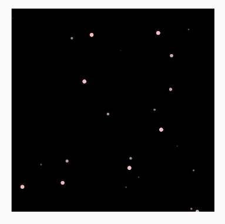
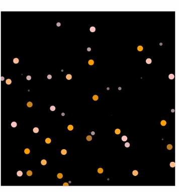
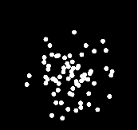

# Particle Animation (Particle)

Particle animation is an animation composed of a multitude of particles randomly generated within a certain range. The particles can be points or images. By animating different aspects of the particles, such as color, opacity, scale, velocity, acceleration, and spin angle, you can create engaging and dynamic aesthetics. For example, you can create an impressive snowfall animation by animating the particles – snowflakes.

The component used for producing particle animations is **Particle**.


>  **NOTE**
>
>  This component is supported since API version 10. Updates will be marked with a superscript to indicate their earliest API version.


## Child Components

Not supported


## APIs

```typescript
interface ParticleInterface {
  <
    PARTICLE extends ParticleType,
    COLOR_UPDATER extends ParticleUpdater,
    OPACITY_UPDATER extends ParticleUpdater,
    SCALE_UPDATER extends ParticleUpdater,
    ACC_SPEED_UPDATER extends ParticleUpdater,
    ACC_ANGLE_UPDATER extends ParticleUpdater,
    SPIN_UPDATER extends ParticleUpdater
  >(value: {
    particles: Array<
    ParticleOptions<
    PARTICLE,
    COLOR_UPDATER,
    OPACITY_UPDATER,
    SCALE_UPDATER,
    ACC_SPEED_UPDATER,
    ACC_ANGLE_UPDATER,
    SPIN_UPDATER
    >
    >;
  }): ParticleAttribute;
}
```

**Atomic service API**: This API can be used in atomic services since API version 11.

**Parameters**

| Name| Type| Mandatory| Description|
| -------- | -------- | -------- | -------- |
| value | {<br>particles:Array&lt;[ParticleOptions](#particleoptions)&lt;<br>[PARTICLE](#particletype), <br>[COLOR_UPDATER](#particleupdater),<br>[OPACITY_UPDATER](#particleupdater),<br>[SCALE_UPDATER](#particleupdater),<br>[ACC_SPEED_UPDATER](#particleupdater),<br> [ACC_ANGLE_UPDATER](#particleupdater),<br>[SPIN_UPDATER](#particleupdater)<br>&gt;&gt;<br>} | Yes| An array of particle options, each of which covers the emitter, color, opacity, scale, velocity, acceleration, and spin speed of particles. For details, see [ParticleOptions](#particleoptions).

## Attributes

In addition to the [universal attributes](ts-universal-attributes-size.md), the following attributes are supported.

### disturbanceFields<sup>12+</sup>

disturbanceFields(fields: Array&lt;DisturbanceFieldOptions&gt;)

Sets the disturbance fields.

**Atomic service API**: This API can be used in atomic services since API version 12.

**System capability**: SystemCapability.ArkUI.ArkUI.Full

**Parameters**

| Name| Type   | Mandatory| Description                        |
| ------ | ------- | ---- | ---------------------------- |
| fields  | Array<[DisturbanceFieldOptions](#disturbancefieldoptions12)> | Yes  | Array of disturbance fields.|

### emitter<sup>12+</sup>
emitter(value: Array&lt;EmitterProperty&gt;)

Sets the emitter parameters.

**Atomic service API**: This API can be used in atomic services since API version 12.

**System capability**: SystemCapability.ArkUI.ArkUI.Full

**Parameters**

| Name| Type   | Mandatory| Description                        |
| ------ | ------- | ---- | ---------------------------- |
| value  | Array<[EmitterProperty](#emitterproperty12)> | Yes  | Array of emitter parameters to set.|

## Events
The [universal events](ts-universal-events-click.md) are supported.

## ParticleOptions

```typescript
interface ParticleOptions<
  PARTICLE extends ParticleType,
  COLOR_UPDATER extends ParticleUpdater,
  OPACITY_UPDATER extends ParticleUpdater,
  SCALE_UPDATER extends ParticleUpdater,
  ACC_SPEED_UPDATER extends ParticleUpdater,
  ACC_ANGLE_UPDATER extends ParticleUpdater,
  SPIN_UPDATER extends ParticleUpdater
> {
  emitter: EmitterOptions<PARTICLE>;
  color?: ParticleColorPropertyOptions<COLOR_UPDATER>;
  opacity?: ParticlePropertyOptions<number, OPACITY_UPDATER>;
  scale?: ParticlePropertyOptions<number, SCALE_UPDATER>;
  velocity?: {
    speed: [number, number];
    angle: [number, number];
  };
  acceleration?: {
    speed?: ParticlePropertyOptions<number, ACC_SPEED_UPDATER>;
    angle?: ParticlePropertyOptions<number, ACC_ANGLE_UPDATER>;
  };
  spin?: ParticlePropertyOptions<number, SPIN_UPDATER>;
}
```

**Atomic service API**: This API can be used in atomic services since API version 11.

**System capability**: SystemCapability.ArkUI.ArkUI.Full

| Name| Type| Mandatory| Description|
| -------- | -------- | -------- | -------- |
| emitter | [EmitterOptions](#emitteroptions)<[PARTICLE](#particletype)> | Yes| Particle emitter.|
| color | [ParticleColorPropertyOptions](#particlecolorpropertyoptions)<[COLOR_UPDATER](#particleupdater)> | No| Particle color.<br>**NOTE**<br>Default value: **{ range:[Color.White,Color.White] }.** Colors cannot be set for image particles.|
| opacity | [ParticlePropertyOptions](#particlepropertyoptions)\<number, [OPACITY_UPDATER](#particleupdater)> | No| Particle opacity.<br>Default value: **{ range:[1.0,1.0] }**|
| scale | [ParticlePropertyOptions](#particlepropertyoptions)\<number, [SCALE_UPDATER](#particleupdater)> | No| Particle scale.<br>Default value: **{ range:[1.0,1.0] }**|
| velocity | {<br>speed: [number, number];<br>angle: [number, number];<br>} |No| Particle velocity.<br>**NOTE**<br>**speed** indicates the time rate at which the particle moves. **angle** indicates the direction (in angles) in which the particle moves, with the geometric center of the element as the coordinate origin and the horizontal direction as the x-axis. A positive number indicates clockwise rotation.<br>Default value: **{speed: [0.0,0.0],angle: [0.0,0.0] }**|
| acceleration | {<br>speed?: [ParticlePropertyOptions](#particlepropertyoptions)<number, [ACC_SPEED_UPDATER](#particleupdater)>;<br>angle?:  [ParticlePropertyOptions](#particlepropertyoptions)<number, [ACC_ANGLE_UPDATER](#particleupdater)>;<br>} | No| Particle acceleration.<br>**NOTE**<br>**speed** indicates the acceleration speed, and **angle** indicates the acceleration direction (in angles).<br>Default value: **{ speed:{range:[0.0,0.0]},angle:{range:[0.0,0.0]} }**|
| spin | [ParticlePropertyOptions](#particlepropertyoptions)<number, [SPIN_UPDATER](#particleupdater)> | No| Particle spin angle.<br>Default value: **{range:[0.0,0.0]}**<br>Direction: A positive number indicates clockwise spinning, and a negative number indicates anticlockwise spinning.|


## EmitterOptions
Provides particle emitter configuration.

```typescript
interface EmitterOptions<PARTICLE extends ParticleType> {   
  particle: {
    type: PARTICLE;
    config: ParticleConfigs[PARTICLE];
    count: number;
    lifetime?: number;
    lifetimeRange?: number;
  };
  emitRate?: number;
  shape?: ParticleEmitterShape;
  position?: [Dimension, Dimension];
  size?: [Dimension, Dimension];
}
```

**Atomic service API**: This API can be used in atomic services since API version 11.

**System capability**: SystemCapability.ArkUI.ArkUI.Full

| Name| Type| Mandatory| Description|
| -------- | -------- | -------- | -------- |
| particle | {<br>type: [PARTICLE](#particletype),<br>config: [ParticleConfigs](#particleconfigs),<br>count: number,<br>lifetime?: number<br>lifeTimeRange?:number<sup>12+<sup><br>} | Yes| Particle configuration.<br>- **type**: particle type, which can be **IMAGE** or **POINT**.<br><br>**Atomic service API**: This API can be used in atomic services since API version 11.<br>- **config**: configuration of the particle type.<br>- The value type of **config** is subject to the value of **type**.<br>1. If **type** is **ParticleType.POINT**, the **config** type is [PointParticleParameters](#pointparticleparameters).<br>2. If **type** is **ParticleType.IMAGE**, the **config** type is [ImageParticleParameters](#imageparticleparameters).<br>**Atomic service API**: This API can be used in atomic services since API version 11.<br>- **count**: number of particles. The value is greater than or equal to -1. The value **-1** indicates that the number of particles is infinite.<br>**Atomic service API**: This API can be used in atomic services since API version 11.<br>- **lifetime**: lifetime of a single particle. The default value is **1000** (that is, 1000 ms, 1s). The value is greater than or equal to -1. The value **-1** indicates that the lifetime of the particle is infinite. If the value specified is less than **-1**, the default value is used.<br>**Atomic service API**: This API can be used in atomic services since API version 11.<br>- **lifeTimeRange**: range of particle lifetime values. After **lifeTimeRange** is set, the lifetime of a particle is a random integer between [lifetime – lifeTimeRange, lifetime + lifeTimeRange]. **lifeTimeRange** has a default value of 0, and its value range is from 0 to positive infinity. If it is set to a negative value, the default value is used.<br>**Atomic service API**: This API can be used in atomic services since API version 12.|
| emitRate | number | No| Emit rate (that is, the number of particles emitted per second).<br> Default value: **5**. If the value specified is less than 0, the default value is used.<br> The **emitRate** value can significantly impact performance when it exceeds 5000; you are advised to set it to be less than 5000.|
| shape | [ParticleEmitterShape](#particleemittershape) | No| Emitter shape.<br> Default value: **ParticleEmitterShape.RECTANGLE**|
| position | \[[Dimension](ts-types.md#dimension10), [Dimension](ts-types.md#dimension10)\] | No| Emitter position (distance from the upper left corner of the component). The first parameter indicates the relative offset along the x-axis, and the second parameter indicates the relative offset along the y-axis.<br>Default value: **[0.0, 0.0]**|
| size |  \[[Dimension](ts-types.md#dimension10), [Dimension](ts-types.md#dimension10)\]     |No| Size of the emit window. The first parameter indicates the emitter width, and the second parameter indicates the emitter height.<br>Default value: **['100%', '100%']** (that is, the emit window fully occupies the component).|

## ParticleConfigs

```typescript
interface ParticleConfigs { 
  [ParticleType.POINT]: PointParticleParameters;
  [ParticleType.IMAGE]: ImageParticleParameters;
}
```

**Atomic service API**: This API can be used in atomic services since API version 11.

**System capability**: SystemCapability.ArkUI.ArkUI.Full

| Name  | Type  | Mandatory| Description|
| -------- | -------------- | -------- | -------- |
| [ParticleType.POINT]      | [PointParticleParameters](#pointparticleparameters) | Yes   | Point particle configuration.|
| [ParticleType.IMAGE]      | [ImageParticleParameters](#imageparticleparameters) | Yes   | Image particle configuration.|

## PointParticleParameters
```typescript
interface PointParticleParameters {
  radius: VP;
}
```

**Atomic service API**: This API can be used in atomic services since API version 11.

**System capability**: SystemCapability.ArkUI.ArkUI.Full

| Name  | Type  | Mandatory| Description|
| -------- | -------------- | -------- | -------- |
| radius      | [VP](ts-types.md#vp10)| Yes   | Particle radius.|

## ImageParticleParameters
```typescript
interface ImageParticleParameters {
  src: ResourceStr;
  size: [Dimension, Dimension];
  objectFit?: ImageFit;
}
```

**Atomic service API**: This API can be used in atomic services since API version 11.

**System capability**: SystemCapability.ArkUI.ArkUI.Full

| Name  | Type  | Mandatory| Description|
| -------- | -------------- | -------- | -------- |
| src      | [ResourceStr](ts-types.md#resourcestr) | Yes   | Image path. SVG images are not supported.|
| size     | \[[Dimension](ts-types.md#dimension10), [Dimension](ts-types.md#dimension10)\]| Yes   | Image size.|
| objectFit| [ImageFit](ts-appendix-enums.md#imagefit)| No   | Image display mode.|

## ParticleColorPropertyOptions

```typescript
interface ParticleColorPropertyOptions<UPDATER extends ParticleUpdater> {
  range: [ResourceColor, ResourceColor]; 
  distributionType?: DistributionType;
  updater?: {
    type: UPDATER;
    config: ParticleColorPropertyUpdaterConfigs[UPDATER];
  };
}
```
**Atomic service API**: This API can be used in atomic services since API version 11.

**System capability**: SystemCapability.ArkUI.ArkUI.Full

| Name| Type| Mandatory| Description|
| -------- | -------- | -------- | -------- |
| range | \[[ResourceColor](ts-types.md#resourcecolor), [ResourceColor](ts-types.md#resourcecolor)\] | Yes| Initial color range of the particle. The initial color of particles generated by the particle emitter is randomly selected in this range.<br>Default value: **range:[Color.White,Color.White]**<br>**Atomic service API**: This API can be used in atomic services since API version 11.
| distributionType<sup>12+<sup> | [DistributionType](#distributiontype12) | No| Type of random value distribution for the initial color of the particle. Both uniform distribution and normal (Gaussian) distribution are supported.<br>Default value: **DistributionType.UNIFORM**<br>**Atomic service API**: This API can be used in atomic services since API version 12.
| updater | {<br>type: [UPDATER](#particleupdater);<br>config: [ParticleColorPropertyUpdaterConfigs](#particlecolorpropertyupdaterconfigs)[UPDATER];<br>} | No| How the color property is updated. The available options of **type** are as follows:<br>1. **ParticleUpdater.NONE**: The property does not change. In this case, the **config** type is [ParticleColorPropertyUpdaterConfigs](#particlecolorpropertyupdaterconfigs)[ParticleUpdater.NONE].<br>2. **ParticleUpdater.RANDOM**: The property changes randomly. In this case, the **config** type is [ParticleColorPropertyUpdaterConfigs](#particlecolorpropertyupdaterconfigs)[ParticleUpdater.RANDOM].<br>3. **ParticleUpdater.CURVE**: The property changes with the animation curve. In this case, the **config** type is [ParticleColorPropertyUpdaterConfigs](#particlecolorpropertyupdaterconfigs)[ParticleUpdater.CURVE].<br>The default value of **type** is **ParticleUpdater.NONE**.<br>**NOTE**<br>When **type** is set to **ParticleUpdater.RANDOM** or **ParticleUpdater.CURVE**, the color configuration in **updater** has higher priority than that in **range**. During the animation time period configured in **updater**, the color configuration from **updater** is used. Outside of the animation time period configured in **updater**, the color configuration from **range** is used.<br>**Atomic service API**: This API can be used in atomic services since API version 11.|


## ParticleColorPropertyUpdaterConfigs
```typescript
interface ParticleColorPropertyUpdaterConfigs {
  [ParticleUpdater.NONE]: void;
  [ParticleUpdater.RANDOM]: {
    r: [number, number];
    g: [number, number];
    b: [number, number];
    a: [number, number];
  };
  [ParticleUpdater.CURVE]: Array<ParticlePropertyAnimation<ResourceColor>>;
}
```

**Atomic service API**: This API can be used in atomic services since API version 11.

**System capability**: SystemCapability.ArkUI.ArkUI.Full

| Name| Type| Mandatory| Description|
| -------- | -------- | -------- | -------- |
|[ParticleUpdater.NONE]|void | Yes| The color does not change.|
| [ParticleUpdater.RANDOM] | {<br>  r: [number, number];<br>  g: [number, number];<br>  b: [number, number];<br>  a: [number, number];<br>} | Yes| The color changes randomly, with the per-second change difference being a value randomly generated from the range. The target color is obtained by applying the change difference to the current color value of each of the R, G, B, A channels.  |
[ParticleUpdater.CURVE]|Array<[ParticlePropertyAnimation](#particlepropertyanimation)\<[ResourceColor](ts-types.md#resourcecolor)\>> | Yes| The color changes with the animation curve. The array type indicates that multiple animation segments can be set for the current property, for example, 0-3000 ms, 3000-5000 ms, and 5000-8000 ms.|

## ParticlePropertyOptions
```typescript
interface ParticlePropertyOptions<TYPE, UPDATER extends ParticleUpdater> {
  range: [TYPE, TYPE];
  updater?: {
    type: UPDATER;
    config: ParticlePropertyUpdaterConfigs<TYPE>[UPDATER];
  };
}
```

**Atomic service API**: This API can be used in atomic services since API version 11.

**System capability**: SystemCapability.ArkUI.ArkUI.Full

| Name| Type| Mandatory| Description|
| -------- | -------- | -------- | -------- |
| range | [TYPE, TYPE] | Yes| Initial property value range of the particle. The initial property value of particles generated by the particle emitter is randomly selected in this range.<br>**NOTE**<br>If a property is set to an invalid value, the default value will be used. If the maximum value is less than the minimum value, the default range will be used. **TYPE** is number.<br>The default value varies by property:<br>1. **opacity** property: **range:[1.0,1.0]**; the value ranges from 0 to 1; the default value is **0.0**.<br>2. **scale** property: **range:[1.0,1.0]**; the value is greater than or equal to 0; the default value is **1.0**.<br>3. **speed** property in **acceleration**: **range:[0.0,0.0]**; the value is greater than or equal to 0; the default value is **0.0**.<br>4. **angle** property in **acceleration**: **range:[0.0,0.0]**; the value range is (-∞, +∞); the default value is **0.0**.<br>5. **spin** property: **range:[0.0,0.0]**; the default value is **0.0**.
| updater | {type: [UPDATER](#particleupdater);config: [ParticlePropertyUpdaterConfigs](#particlepropertyupdaterconfigs)[UPDATER];} | No| How the property is updated. The available options of **type** are as follows:<br>1. **ParticleUpdater.NONE**: The property does not change. In this case, the **config** type is [ParticlePropertyUpdaterConfigs](#particlepropertyupdaterconfigs)[ParticleUpdater.NONE].<br>2. **ParticleUpdater.RANDOM**: The property changes randomly. In this case, the **config** type is [ParticlePropertyUpdaterConfigs](#particlepropertyupdaterconfigs)[ParticleUpdater.RANDOM].<br>3. **ParticleUpdater.CURVE**: The property changes with the animation curve. In this case, the **config** type is [ParticlePropertyUpdaterConfigs](#particlepropertyupdaterconfigs)[ParticleUpdater.CURVE].<br>The default value of **type** is **ParticleUpdater.NONE**.|


## ParticlePropertyUpdaterConfigs
```typescript
interface ParticlePropertyUpdaterConfigs<T> {
    [ParticleUpdater.NONE]: void;
    [ParticleUpdater.RANDOM]: [T, T];
    [ParticleUpdater.CURVE]: Array<ParticlePropertyAnimation<T>>;
}
```

**Atomic service API**: This API can be used in atomic services since API version 11.

**System capability**: SystemCapability.ArkUI.ArkUI.Full

| Name| Type| Mandatory| Description|
| -------- | -------- | -------- | -------- |
| [ParticleUpdater.NONE]|void | Yes| The color does not change.|
| [ParticleUpdater.RANDOM] | [T, T] | Yes| The property changes randomly, with the per-second change difference being a value randomly generated from the range.<br>The target property value is obtained by applying the change difference to the current property value. For example, if the current property value is **0.2** and **config** is set to **[0.1,1.0]**, then:<br>1. When the random change difference is 0.5, the target property value is 0.2 + 0.5 = 0.7.<br>2. The change difference may also be a negative value. For example, if the current property value is **0.2** and **config** is set to **[-3.0,2.0]**, then when the random change difference is **-2.0**, the target property value is 0.2 - 2.0 = -1.8.<br>**NOTE**<br>**config** sets the value range of the change difference. While the change difference does not have a maximum or minimum value limit, the target property value does. Therefore, if the target property value is greater than the maximum property value, the maximum property value will be used instead; if the target property value is less than the minimum property value, the minimum property value will be used instead. **T** represents a number.<br>For example, if the value range of **opacity** is **[0.0, 1.0]**, then if the target property value is greater than 1.0, **1.0** will be used instead.|
|[ParticleUpdater.CURVE]|Array<[ParticlePropertyAnimation](#particlepropertyanimation)\<T\>> | Yes| The property changes with the animation curve. The array type indicates that multiple animation segments can be set for the current property, for example, 0-3000 ms, 3000-5000 ms, and 5000-8000 ms. **T** represents a number.|


## ParticlePropertyAnimation
```typescript
interface ParticlePropertyAnimation<T> {
  from: T;
  to: T;
  startMillis: number;
  endMillis: number;
  curve?: Curve | ICurve;
}
```

**Atomic service API**: This API can be used in atomic services since API version 11.

**System capability**: SystemCapability.ArkUI.ArkUI.Full

| Name| Type| Mandatory| Description|
| -------- | -------- | -------- | -------- |
|from| T | Yes| Initial value of the property. If the value is invalid, the default value will be used.|
| to | T | Yes| Target value of the property. If the value is invalid, the default value will be used.|
|startMillis|number | Yes| Start time of the animation.|
|endMillis|number | Yes| End time of the animation.|
|curve|[Curve](ts-appendix-enums.md#curve) \| [ICurve](../js-apis-curve.md#icurve)| No| Animation curve.<br>Default value: **Curve.Linear**|


## ParticleType
```typescript
enum ParticleType {
  POINT = 'point',
  IMAGE = 'image',
}
```
**Atomic service API**: This API can be used in atomic services since API version 11.

**System capability**: SystemCapability.ArkUI.ArkUI.Full

| Name | Description|
| -------- |  -------- | 
POINT |Point particle.|
IMAGE | Image particle.|


## ParticleEmitterShape
```typescript
enum ParticleEmitterShape {
  RECTANGLE = 'rectangle',
  CIRCLE = 'circle',
  ELLIPSE = 'ellipse',
}
```

**Atomic service API**: This API can be used in atomic services since API version 11.

**System capability**: SystemCapability.ArkUI.ArkUI.Full

| Name | Description|
| -------- |  -------- | 
RECTANGLE |The particle emitter is rectangular.|
CIRCLE | The particle emitter is circular.|
ELLIPSE |The particle emitter is elliptical.|

## DistributionType<sup>12+<sup>
```typescript
enum DistributionType {
  UNIFORM = 0,
  GAUSSIAN = 1,
}
```
**Atomic service API**: This API can be used in atomic services since API version 12.

**System capability**: SystemCapability.ArkUI.ArkUI.Full

| Name | Description|
| -------- |  -------- | 
| UNIFORM |The initial color random values are distributed uniformly.|
| GAUSSIAN | The initial color random values are distributed according to a Gaussian distribution.|

## ParticleUpdater
```typescript
enum ParticleUpdater {
  NONE = 'none',
  RANDOM = 'random',
  CURVE = 'curve',
}
```

**Atomic service API**: This API can be used in atomic services since API version 11.

**System capability**: SystemCapability.ArkUI.ArkUI.Full

| Name | Description|
| -------- |  -------- | 
|NONE |No change.|
|RANDOM | Random change.|
|CURVE |Change with the animation curve.|

## DisturbanceFieldOptions<sup>12+</sup>

**Atomic service API**: This API can be used in atomic services since API version 12.

**System capability**: SystemCapability.ArkUI.ArkUI.Full

| Name| Type   | Mandatory| Description                        |
| ------ | ------- | ---- | ---------------------------- |
| strength  | number | No  |Field strength, which indicates the intensity of the repulsive force from the center outward. The default value is **0**. Positive values indicate a repulsive force directed outward, while negative values indicate an attractive force directed inward.|
| shape  |   [DisturbanceFieldShape](#disturbancefieldshape12) | No  | Shape of the field.<br>Default value: **DisturbanceFieldShape.RECT**|
| size  | [SizeT](../js-apis-arkui-graphics.md#sizett12)&lt;number&gt;| No |Size of the field.<br>Default value: {width:0, height:0}|
| position  | [PositionT](../js-apis-arkui-graphics.md#positiont12)&lt;number&gt; | No  |Position of the field.<br>Default value: {x:0, y:0}|
| feather  | number | No  |Feather value, which represents the degree of attenuation from the center of the field to its edges. The value is an integer ranging from 0 to 100. A value of 0 indicates that the field is rigid, and all particles within its range are repelled. The higher the feather value, the more gradual the field becomes, resulting in more particles close to the center point appearing within the field's range.<br>Default value: **0**|
| noiseScale  | number | No  |Noise scale, used to control the overall size of the noise pattern. The value is greater than or equal to 0.<br>Default value: **1**|
| noiseFrequency  | number | No  |Noise frequency. The higher the frequency, the finer the noise. The value is greater than or equal to 0.<br> Default value: **1**|
| noiseAmplitude  | number | No  |Noise amplitude, which indicates the range of noise fluctuations. The greater the amplitude, the greater the difference between the noises. The value is greater than or equal to 0.<br> Default value: **1**|

## DisturbanceFieldShape<sup>12+</sup>

**Atomic service API**: This API can be used in atomic services since API version 12.

**System capability**: SystemCapability.ArkUI.ArkUI.Full

| Name       | Description  |
| --------| ----------|
| RECT    | Rectangle.  |
|  CIRCLE | Circle.      |
| ELLIPSE | Ellipse.    |

## EmitterProperty<sup>12+</sup>

**Atomic service API**: This API can be used in atomic services since API version 12.

**System capability**: SystemCapability.ArkUI.ArkUI.Full

| Name| Type   | Mandatory| Description                        |
| ------ | ------- | ---- | ---------------------------- |
| index   | number | Yes  |Index of the emitter based on the index array of the emitters in the initialization parameters. The value is rounded to the nearest whole number. The default value **0** is used in case of exceptions.|
| emitRate  | number  | No  | Emit rate, that is, the number of particles emitted per second.<br>If no value is passed in, the current emit rate is retained. If a value less than 0 is passed in, the default value **5** is used. The **emitRate** value can significantly impact performance when it exceeds 5000; you are advised to set it to be less than 5000.|
| position  | [PositionT](../js-apis-arkui-graphics.md#positiont12)&lt;number&gt; | No  |Array of emitter positions. Only the number type is supported.<br>If no value is passed in, the current emitter position is retained. Two valid values must be passed in; if either is an invalid value, **position** will not take effect.|
| size  | [SizeT](../js-apis-arkui-graphics.md#sizett12)&lt;number&gt;| No |Size of the emit window. Only the number type is supported.<br>If no value is passed in, the current emitter window size is retained. Two valid values greater than 0 must be passed in; if either is an invalid value, **size** will not take effect.|

## Example

### Example 1

This example demonstrates the basic usage of particle animation, initializing point particles.

```ts
// xxx.ets
@Entry
@Component
struct ParticleExample {
  build() {
    Stack() {
      Text()
        .width(300).height(300).backgroundColor(Color.Black)
      Particle({particles:[
        {
          emitter:{
            particle:{
              type:ParticleType.POINT,// Particle type.
              config:{
                radius:10// Point radius.
              },
              count: 500,// Total number of particles.
              lifetime:10000,// Particle lifetime, in ms.
              lifetimeRange:100// Range of particle lifetime values, in ms.
            },
            emitRate:10,// Number of particles emitted per second.
            position:[0,0],
            shape:ParticleEmitterShape.RECTANGLE// Emitter shape.
          },
          color:{
            range:[Color.Red,Color.Yellow],// Initial color range.
            updater:{
              type:ParticleUpdater.CURVE,// Change with the animation curve.
              config:[
                {
                  from:Color.White,// Initial value of the change.
                  to:Color.Pink,// Target value of the change.
                  startMillis:0,// Start time.
                  endMillis:3000,// End time.
                  curve:Curve.EaseIn// Animation curve.
                },
                {
                  from:Color.Pink,
                  to:Color.Orange,
                  startMillis:3000,
                  endMillis:5000,
                  curve:Curve.EaseIn
                },
                {
                  from:Color.Orange,
                  to:Color.Pink,
                  startMillis:5000,
                  endMillis:8000,
                  curve:Curve.EaseIn
                },
              ]
            }
          },
          opacity:{
            range:[0.0,1.0],// The initial value of particle opacity is randomly generated from the [0.0, 1.0] range.
            updater:{
              type:ParticleUpdater.CURVE,
              config:[
                {
                  from:0.0,
                  to:1.0,
                  startMillis:0,
                  endMillis:3000,
                  curve:Curve.EaseIn
                },
                {
                  from:1.0,
                  to:0.0,
                  startMillis:5000,
                  endMillis:10000,
                  curve:Curve.EaseIn
                }
              ]
            }
          },
          scale:{
            range:[0.0,0.0],
            updater:{
              type:ParticleUpdater.CURVE,
              config:[
                {
                  from:0.0,
                  to:0.5,
                  startMillis:0,
                  endMillis:3000,
                  curve: Curve.EaseIn
                }
              ]
            }
          },
          acceleration:{// Acceleration. speed indicates the acceleration speed, and angle indicates the acceleration direction.
            speed:{
              range:[3,9],
              updater:{
                type:ParticleUpdater.RANDOM,// The speed changes randomly.
                config:[1,20]
              }
            },
            angle:{
              range:[90,90]
            }
          }

        }
      ]
      }).width(300).height(300)
    }.width("100%").height("100%").align(Alignment.Center)
  }
}
```



### Example 2

This example demonstrates the basic usage of particle animation, initializing image particles.

```ts
@Entry
@Component
struct ParticleExample {
  @State
  myCount : number = 100
  flag : boolean = false;
  build() {
    Column(){
      Stack() {
        Particle({particles:[
          {
            emitter:{
              particle:{
                type:ParticleType.IMAGE,
                config:{
                  src:$r("app.media.book"),
                  size:[10,10]
                },
                count: this.myCount,
                lifetime:10000,
                lifetimeRange:100
              },
              emitRate:3,
              shape:ParticleEmitterShape.CIRCLE
            },
            color:{
              range:[Color.White,Color.White]
            },
            opacity:{
              range:[1.0,1.0],
              updater:{
                type:ParticleUpdater.CURVE,
                config:[
                  {
                    from:0,
                    to:1.0,
                    startMillis:0,
                    endMillis:6000
                  },
                  {
                    from:1.0,
                    to:.0,
                    startMillis:6000,
                    endMillis:10000
                  }
                ]
              }
            },
            scale:{
              range:[0.1,1.0],
              updater:{
                type:ParticleUpdater.CURVE,
                config:[
                  {
                    from: 0,
                    to: 1.5,
                    startMillis: 0,
                    endMillis: 8000,
                    curve: Curve.EaseIn
                  }

                ]
              }
            },
            acceleration:{
              speed:{
                range:[3,9],
                updater:{
                  type: ParticleUpdater.CURVE,
                  config:[
                    {
                      from:10,
                      to:20,
                      startMillis:0,
                      endMillis:3000,
                      curve:Curve.EaseIn
                    },
                    {
                      from:10,
                      to:2,
                      startMillis:3000,
                      endMillis:8000,
                      curve:Curve.EaseIn
                    }
                  ]
                }
              },
              angle:{
                range:[0,180],
                updater:{
                  type:ParticleUpdater.CURVE,
                  config:[{
                    from:1,
                    to:2,
                    startMillis:0,
                    endMillis:1000,
                    curve:Curve.EaseIn
                  },
                    {
                      from:50,
                      to:-50,
                      startMillis:1000,
                      endMillis:3000,
                      curve:Curve.EaseIn
                    },
                    {
                      from:3,
                      to:5,
                      startMillis:3000,
                      endMillis:8000,
                      curve:Curve.EaseIn
                    }
                  ]
                }
              }
            },
            spin:{
              range:[0.1,1.0],
              updater:{
                type:ParticleUpdater.CURVE,
                config:[
                {
                  from: 0,
                  to: 360,
                  startMillis: 0,
                  endMillis: 8000,
                  curve: Curve.EaseIn
                }
                ]
              }
            },
          }
          ,{
          emitter:{
            particle:{
              type:ParticleType.IMAGE,
              config:{
                src:$r('app.media.heart'),
                size:[10,10]
              },
              count: this.myCount,
              lifetime:10000,
              lifetimeRange:100
            },
            emitRate:3,
            shape:ParticleEmitterShape.CIRCLE
          },
          color:{
            range:[Color.White,Color.White]
          },
          opacity:{
            range:[1.0,1.0],
            updater:{
              type:ParticleUpdater.CURVE,
              config:[
                {
                  from:0,
                  to:1.0,
                  startMillis:0,
                  endMillis:6000
                },
                {
                  from:1.0,
                  to:.0,
                  startMillis:6000,
                  endMillis:10000
                }
              ]
            }
          },
          scale:{
            range:[0.1,1.0],
            updater:{
              type:ParticleUpdater.CURVE,
              config:[
                {
                  from: 0,
                  to: 2.0,
                  startMillis: 0,
                  endMillis: 10000,
                  curve: Curve.EaseIn
                }

              ]
            }
          },
          acceleration:{
            speed:{
              range:[3,9],
              updater:{
                type: ParticleUpdater.CURVE,
                config:[
                  {
                    from:10,
                    to:20,
                    startMillis:0,
                    endMillis:3000,
                    curve:Curve.EaseIn
                  },
                  {
                    from:10,
                    to:2,
                    startMillis:3000,
                    endMillis:8000,
                    curve:Curve.EaseIn
                  }
                ]
              }
            },
            angle:{
              range:[0,180],
              updater:{
                type:ParticleUpdater.CURVE,
                config:[{
                  from:1,
                  to:2,
                  startMillis:0,
                  endMillis:1000,
                  curve:Curve.EaseIn
                },
                  {
                    from:50,
                    to:-50,
                    startMillis:0,
                    endMillis:3000,
                    curve:Curve.EaseIn
                  },
                  {
                    from:3,
                    to:5,
                    startMillis:3000,
                    endMillis:10000,
                    curve:Curve.EaseIn
                  }
                ]
              }
            }
          },
          spin:{
            range:[0.1,1.0],
            updater:{
              type:ParticleUpdater.CURVE,
              config:[
                {
                  from: 0,
                  to: 360,
                  startMillis: 0,
                  endMillis: 10000,
                  curve: Curve.EaseIn
                }
              ]
            }
          },
        },{
          emitter:{
            particle:{
              type:ParticleType.IMAGE,
              config:{
                src:$r('app.media.sun'),
                size:[10,10]
              },
              count: this.myCount,
              lifetime:10000,
              lifetimeRange:100
            },
            emitRate:3,
            shape:ParticleEmitterShape.CIRCLE
          },
          color:{
            range:[Color.White,Color.White]
          },
          opacity:{
            range:[1.0,1.0],
            updater:{
              type:ParticleUpdater.CURVE,
              config:[
                {
                  from:0,
                  to:1.0,
                  startMillis:0,
                  endMillis:6000
                },
                {
                  from:1.0,
                  to:.0,
                  startMillis:6000,
                  endMillis:10000
                }
              ]
            }
          },
          scale:{
            range:[0.1,1.0],
            updater:{
              type:ParticleUpdater.CURVE,
              config:[
                {
                  from: 0,
                  to: 2.0,
                  startMillis: 0,
                  endMillis: 10000,
                  curve: Curve.EaseIn
                }

              ]
            }
          },
          acceleration:{
            speed:{
              range:[3,9],
              updater:{
                type: ParticleUpdater.CURVE,
                config:[
                  {
                    from:10,
                    to:20,
                    startMillis:0,
                    endMillis:3000,
                    curve:Curve.EaseIn
                  },
                  {
                    from:10,
                    to:2,
                    startMillis:3000,
                    endMillis:8000,
                    curve:Curve.EaseIn
                  }
                ]
              }
            },
            angle:{
              range:[0,180],
              updater:{
                type:ParticleUpdater.CURVE,
                config:[{
                  from:1,
                  to:2,
                  startMillis:0,
                  endMillis:1000,
                  curve:Curve.EaseIn
                },
                  {
                    from:50,
                    to:-50,
                    startMillis:1000,
                    endMillis:3000,
                    curve:Curve.EaseIn
                  },
                  {
                    from:3,
                    to:5,
                    startMillis:3000,
                    endMillis:8000,
                    curve:Curve.EaseIn
                  }
                ]
              }
            }
          },
          spin:{
            range:[0.1,1.0],
            updater:{
              type:ParticleUpdater.CURVE,
              config:[
                {
                  from: 0,
                  to: 360,
                  startMillis: 0,
                  endMillis: 10000,
                  curve: Curve.EaseIn
                }
              ]
            }
          },
        }
        ]
        }).width(300).height(300)

      }.width(500).height(500).align(Alignment.Center)
    }.width("100%").height("100%")

  }
}
```


### Example 3

This example demonstrates how particles' trajectories change under the influence of a particle disturbance field.
```
@Entry
@Component
struct ParticleExample {
  build() {
    Stack() {
      Text()
        .width(300).height(300).backgroundColor(Color.Black)
      Particle({particles:[
        {
          emitter:{
            particle:{
              type:ParticleType.POINT,// Particle type.
              config:{
                radius:10// Point radius.
              },
              count: 500,// Total number of particles.
              lifetime:10000// Particle lifetime, in ms.
            },
            emitRate:10,// Number of particles emitted per second.
            position:[0,0],
            shape:ParticleEmitterShape.RECTANGLE// Emitter shape.
          },
          color:{
            range:[Color.Red,Color.Yellow],// Initial color range.
            updater:{
              type:ParticleUpdater.CURVE,// Change with the animation curve.
              config:[
                {
                  from:Color.White,// Initial value of the change.
                  to:Color.Pink,// Target value of the change.
                  startMillis:0,// Start time.
                  endMillis:3000,// End time.
                  curve:Curve.EaseIn// Animation curve.
                },
                {
                  from:Color.Pink,
                  to:Color.Orange,
                  startMillis:3000,
                  endMillis:5000,
                  curve:Curve.EaseIn
                },
                {
                  from:Color.Orange,
                  to:Color.Pink,
                  startMillis:5000,
                  endMillis:8000,
                  curve:Curve.EaseIn
                },
              ]
            }
          },
          opacity:{
            range:[0.0,1.0],// The initial value of particle opacity is randomly generated from the [0.0, 1.0] range.
            updater:{
              type:ParticleUpdater.CURVE,
              config:[
                {
                  from:0.0,
                  to:1.0,
                  startMillis:0,
                  endMillis:3000,
                  curve:Curve.EaseIn
                },
                {
                  from:1.0,
                  to:0.0,
                  startMillis:5000,
                  endMillis:10000,
                  curve:Curve.EaseIn
                }
              ]
            }
          },
          scale:{
            range:[0.0,0.0],
            updater:{
              type:ParticleUpdater.CURVE,
              config:[
                {
                  from:0.0,
                  to:0.5,
                  startMillis:0,
                  endMillis:3000,
                  curve: Curve.EaseIn
                }
              ]
            }
          },
          acceleration:{// Acceleration. speed indicates the acceleration speed, and angle indicates the acceleration direction.
            speed:{
              range:[3,9],
              updater:{
                type:ParticleUpdater.RANDOM,
                config:[1,20]
              }
            },
            angle:{
              range:[90,90]
            }
          }

        }
      ]
      }).width(300).height(300).disturbanceFields([{
        strength:10,
        shape:DisturbanceFieldShape.RECT,
        size:{width:100,height:100},
        position:{x:100,y:100},
        feather:15,
        noiseScale:10,
        noiseFrequency:15,
        noiseAmplitude:5
      }])
    }.width("100%").height("100%").align(Alignment.Center)
  }
}

```


### Example 4
This example demonstrates how to adjust the position of the particle emitter through **emitter()**.
```ts
@Entry
@Component
struct ParticleExample {
  @State emitterProperties: Array<EmitterProperty> = [
    {
      index: 0,
      emitRate: 100,
      position: { x: 60, y: 80 },
      size: { width: 200, height: 200 }
    }
  ]

  build() {
    Stack() {
      Text()
        .width(300).height(300).backgroundColor(Color.Black)
      Particle({ particles: [
        {
          emitter: {
            particle: {
              type: ParticleType.POINT, // Particle type.
              config: {
                radius: 5// Point radius.
              },
              count: 400, // Total number of particles.
              lifetime: -1// Particle lifetime. The value -1 indicates that the lifetime of the particle is infinite.
            },
            emitRate: 10, // Number of particles emitted per second.
            position: [0, 0], // Emitter position.
            shape: ParticleEmitterShape.CIRCLE// Emitter shape.
          },
          color: {
            range: [Color.Red, Color.Yellow], // Initial color range.
            updater: {
              type: ParticleUpdater.CURVE, // Change with the animation curve.
              config: [
                {
                  from: Color.White,
                  to: Color.Pink,
                  startMillis: 0,
                  endMillis: 3000,
                  curve: Curve.EaseIn
                },
                {
                  from: Color.Pink,
                  to: Color.Orange,
                  startMillis: 3000,
                  endMillis: 5000,
                  curve: Curve.EaseIn
                },
                {
                  from: Color.Orange,
                  to: Color.Pink,
                  startMillis: 5000,
                  endMillis: 8000,
                  curve: Curve.EaseIn
                },
              ]
            }
          },
        },
      ]
      })
        .width(300)
        .height(300)
        .emitter(this.emitterProperties)
    }.width("100%").height("100%").align(Alignment.Center)
  }
}
```

