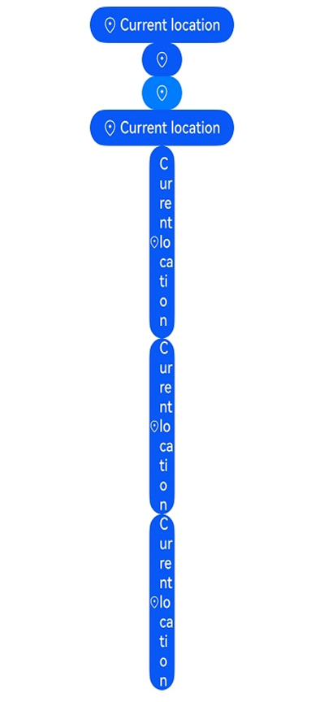

# LocationButton

The **\<LocationButton>** security component allows you to obtain temporary precise location permission from the user by their touching the button, eliminating the need for a permission request dialog box.

> **NOTE**
>
> This component is supported since API version 10. Updates will be marked with a superscript to indicate their earliest API version.

## Child Components

Not supported

## APIs

### LocationButton

LocationButton()

Creates a Location button with an icon, text, and background.

You may want to learn the [restrictions on security component styles](../../../security/AccessToken/security-component-overview.md#constraints) to avoid authorization failures caused by incompliant styles.

**Atomic service API**: This API can be used in atomic services since API version 11.

**System capability**: SystemCapability.ArkUI.ArkUI.Full

### LocationButton

LocationButton(option:LocationButtonOptions)

Creates a Location button that contains the specified elements.

You may want to learn the [restrictions on security component styles](../../../security/AccessToken/security-component-overview.md#constraints) to avoid authorization failures caused by incompliant styles.

**Atomic service API**: This API can be used in atomic services since API version 11.

**System capability**: SystemCapability.ArkUI.ArkUI.Full

**Parameters**

| Name| Type| Mandatory| Description|
| -------- | -------- | -------- | -------- |
| option | [LocationButtonOptions](#locationbuttonoptions) | No| Creates a Location button that contains the specified elements.|

## LocationButtonOptions

**Atomic service API**: This API can be used in atomic services since API version 11.

**System capability**: SystemCapability.ArkUI.ArkUI.Full

| Name| Type| Mandatory| Description|
| -------- | -------- | -------- | -------- |
| icon | [LocationIconStyle](#locationiconstyle) | No| Icon style of the Location button.<br>If this parameter is not specified, no icon is contained. Either **icon** or **text**, or both, must be set.|
| text | [LocationDescription](#locationdescription) | No| Text on the Location button.<br>If this parameter is not specified, no text is contained. Either **icon** or **text**, or both, must be set.|
| buttonType | [ButtonType](ts-basic-components-button.md#buttontype) | No| Background type of the Location button.<br>If this parameter is not specified, the system uses a capsule-type button. |

## LocationIconStyle

**Atomic service API**: This API can be used in atomic services since API version 11.

**System capability**: SystemCapability.ArkUI.ArkUI.Full

| Name| Value| Description|
| -------- | -------- | -------- |
| FULL_FILLED |  0 | Filled style icon.|
| LINES | 1 | Line style icon.|

## LocationDescription

**Atomic service API**: This API can be used in atomic services since API version 11.

**System capability**: SystemCapability.ArkUI.ArkUI.Full

| Name| Value| Description|
| -------- | -------- | -------- |
| CURRENT_LOCATION | 0 | The text on the Location button is **Current location**.|
| ADD_LOCATION | 1 | The text on the Location button is **Add location**.|
| SELECT_LOCATION | 2 | The text on the Location button is **Select location**.|
| SHARE_LOCATION | 3 | The text on the Location button is **Share location**.|
| SEND_LOCATION | 4 | The text on the Location button is **Send location**.|
| LOCATING | 5 | The text on the Location button is **Locate**.|
| LOCATION | 6 | The text on the Location button is **Location**.|
| SEND_CURRENT_LOCATION | 7 | The text on the Location button is **Send current location**.|
| RELOCATION | 8 | The text on the Location button is **Relocate**.|
| PUNCH_IN | 9 | The text on the Location button is **Punch in**.|
| CURRENT_POSITION | 10 | The text on the Location button is **Current position**.|

## LocationButtonOnClickResult

**Atomic service API**: This API can be used in atomic services since API version 11.

**System capability**: SystemCapability.ArkUI.ArkUI.Full

| Name| Value| Description|
| -------- | -------- | -------- |
| SUCCESS | 0 | The Location button is touched successfully.|
| TEMPORARY_AUTHORIZATION_FAILED | 1 | Temporary authorization fails after the Location button is touched.|

## Attributes

This component can only inherit the [universal attributes of security components](ts-securitycomponent-attributes.md#attributes)

## Events

Only the following events are supported.

### onClick

onClick(event: (event: ClickEvent, result: LocationButtonOnClickResult) =&gt; void)

Called when a click event occurs.

**Atomic service API**: This API can be used in atomic services since API version 11.

**System capability**: SystemCapability.ArkUI.ArkUI.Full

**Parameters**

| Name| Type                  | Mandatory| Description                  |
|------------|------|-------|---------|
| event  | [ClickEvent](ts-universal-events-click.md#clickevent) |Yes|See **ClickEvent**.|
| result | [LocationButtonOnClickResult](#locationbuttononclickresult)| Yes| Authorization result.|

## Example

```ts
// xxx.ets
@Entry
@Component
struct Index {
  build() {
    Row() {
      Column({space:10}) {
        // Create a default Location button with an icon, text, and background.
        LocationButton().onClick((event: ClickEvent, result: LocationButtonOnClickResult)=>{
          console.info("result " + result)
        })
        // Whether an element is contained depends on whether the parameter corresponding to the element is specified. If buttonType is not passed in, the button uses the ButtonType.Capsule settings.
        LocationButton({icon:LocationIconStyle.LINES})
        // Create a button with only an icon and background. If the alpha value of the most significant eight bits of the background color is less than 0x1A, the system forcibly adjusts the alpha value to 0xFF.
        LocationButton({icon:LocationIconStyle.LINES, buttonType:ButtonType.Capsule})
          .backgroundColor(0x10007dff)
        // Create a button with an icon, text, and background. If the alpha value of the most significant eight bits of the background color is less than 0x1A, the system forcibly adjusts the alpha value to 0xFF.
        LocationButton({icon:LocationIconStyle.LINES, text:LocationDescription.CURRENT_LOCATION, buttonType:ButtonType.Capsule})
      }.width('100%')
    }.height('100%')
  }
}
```


