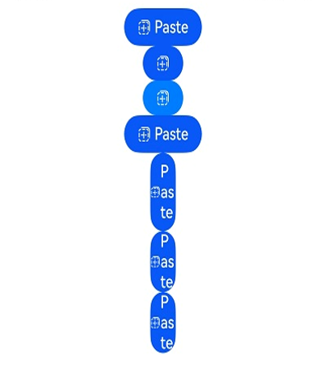

# PasteButton

The **PasteButton** security component represents a Paste button that allows you to obtain temporary pasteboard permissions from users with a simple button touch.

> **NOTE**
>
> This component is supported since API version 10. Updates will be marked with a superscript to indicate their earliest API version.

## Child Components

Not supported

## APIs

### PasteButton

PasteButton()

Creates a Paste button with an icon, text, and background.

You may want to learn the [restrictions on security component styles](../../../security/AccessToken/security-component-overview.md#constraints) to avoid authorization failures caused by incompliant styles.

**Atomic service API**: This API can be used in atomic services since API version 11.

**System capability**: SystemCapability.ArkUI.ArkUI.Full

### PasteButton

PasteButton(options:PasteButtonOptions)

Creates a Paste button that contains the specified elements.

You may want to learn the [restrictions on security component styles](../../../security/AccessToken/security-component-overview.md#constraints) to avoid authorization failures caused by incompliant styles.

**Atomic service API**: This API can be used in atomic services since API version 11.

**System capability**: SystemCapability.ArkUI.ArkUI.Full

**Parameters**

| Name| Type| Mandatory| Description|
| -------- | -------- | -------- | -------- |
| options | [PasteButtonOptions](#pastebuttonoptions) | Yes| Options for creating the Paste button.<br>Default value:<br>{<br>icon: PasteIconStyle.LINES,<br>text: PasteDescription.PASTE,<br>buttonType: ButtonType.Capsule <br>} |

## PasteButtonOptions

Describes the icon, text, and other specific elements for the Paste button.

> **NOTE**
> 
> At least one of **icon** or **text** must be provided.<br>
> If neither **icon** nor **text** is provided, the **options** parameter in [[PasteButton](#pastebutton-1) will not take effect, and the created Paste button will be in the default style.

**Atomic service API**: This API can be used in atomic services since API version 11.

**System capability**: SystemCapability.ArkUI.ArkUI.Full

| Name| Type| Mandatory| Description|
| -------- | -------- | -------- | -------- |
| icon | [PasteIconStyle](#pasteiconstyle) | No| Icon style of the Paste button.<br>If this parameter is not specified, there is no icon.|
| text | [PasteDescription](#pastedescription) | No| Text on the Paste button.<br>If this parameter is not specified, there is no text description.|
| buttonType | [ButtonType](ts-basic-components-button.md#buttontype) | No| Background style of the Paste button.<br>If this parameter is not specified, the system uses a capsule-type button.|

## Attributes

This component can only inherit the [universal attributes of security components](ts-securitycomponent-attributes.md).

## PasteIconStyle

**Atomic service API**: This API can be used in atomic services since API version 11.

**System capability**: SystemCapability.ArkUI.ArkUI.Full

| Name| Value| Description|
| -------- | -------- | -------- |
| LINES | 0 | Line style icon.|

## PasteDescription

**Atomic service API**: This API can be used in atomic services since API version 11.

**System capability**: SystemCapability.ArkUI.ArkUI.Full

| Name| Value| Description|
| -------- | -------- | -------- |
| PASTE | 0 | The text on the Paste button is **Paste**.|

## PasteButtonOnClickResult

**Atomic service API**: This API can be used in atomic services since API version 11.

**System capability**: SystemCapability.ArkUI.ArkUI.Full

| Name| Value| Description|
| -------- | -------- | -------- |
| SUCCESS | 0 | The Paste button is touched successfully.|
| TEMPORARY_AUTHORIZATION_FAILED | 1 | Temporary authorization fails after the Paste button is touched.|

## Events

Only the following events are supported.

### onClick

onClick(event: (event: ClickEvent, result: PasteButtonOnClickResult) =&gt; void)

Called when a click event occurs.

**Atomic service API**: This API can be used in atomic services since API version 11.

**System capability**: SystemCapability.ArkUI.ArkUI.Full

**Parameters**

| Name| Type                  | Mandatory| Description                  |
|------------|------|-------|---------|
| event  | [ClickEvent](ts-universal-events-click.md#clickevent) |Yes|See **ClickEvent**.|
| result | [PasteButtonOnClickResult](#pastebuttononclickresult)| Yes| Authorization result. After the authorization, the pasteboard content can be read.|

## Example

```ts
// xxx.ets
@Entry
@Component
struct Index {
  build() {
    Row() {
      Column({space:10}) {
        // Create a default button with an icon, text, and background.
        PasteButton().onClick((event: ClickEvent, result: PasteButtonOnClickResult)=>{
          console.info("result " + result)
        })
        // Whether an element is contained depends on whether the parameter corresponding to the element is specified. If buttonType is not passed in, the button uses the ButtonType.Capsule settings.
        PasteButton({icon:PasteIconStyle.LINES})
        // Create a button with only an icon and background. If the alpha value of the most significant eight bits of the background color is less than 0x1A, the system forcibly adjusts the alpha value to 0xFF.
        PasteButton({icon:PasteIconStyle.LINES, buttonType:ButtonType.Capsule})
          .backgroundColor(0x10007dff)
        // Create a button with an icon, text, and background. If the alpha value of the most significant eight bits of the background color is less than 0x1A, the system forcibly adjusts the alpha value to 0xFF.
        PasteButton({icon:PasteIconStyle.LINES, text:PasteDescription.PASTE, buttonType:ButtonType.Capsule})
        // Create a button with an icon, text, and background. If the set width is less than the minimum allowed, the button's text will wrap to guarantee full text display.
        PasteButton({icon:PasteIconStyle.LINES, text:PasteDescription.PASTE, buttonType:ButtonType.Capsule})
          .fontSize(16)
          .width(30)
        // Create a button with an icon, text, and background. If the set width is less than the minimum allowed, the button's text will wrap to guarantee full text display.
        PasteButton({icon:PasteIconStyle.LINES, text:PasteDescription.PASTE, buttonType:ButtonType.Capsule})
          .fontSize(16)
          .size({width: 30, height: 30})
        // Create a button with an icon, text, and background. If the set width is less than the minimum allowed, the button's text will wrap to guarantee full text display.
        PasteButton({icon:PasteIconStyle.LINES, text:PasteDescription.PASTE, buttonType:ButtonType.Capsule})
          .fontSize(16)
          .constraintSize({minWidth: 0, maxWidth: 30, minHeight: 0, maxHeight: 30})
      }.width('100%')
    }.height('100%')
  }
}
```


