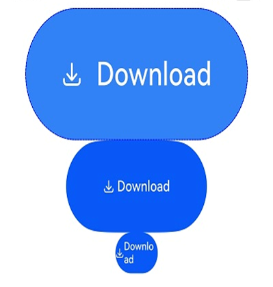
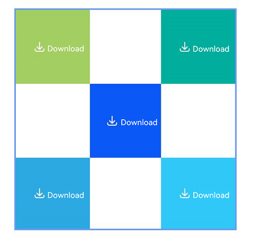

# Security Component Universal Attributes

Universal attributes of security components are basic attributes applicable to all security components.

> **NOTE**
>
> This component is supported since API version 10. Updates will be marked with a superscript to indicate their earliest API version.

## iconSize

iconSize(value: Dimension): T

Sets the icon size of the security component.

**Atomic service API**: This API can be used in atomic services since API version 11.

**System capability**: SystemCapability.ArkUI.ArkUI.Full

**Parameters**

| Name| Type| Mandatory| Description                  |
|------------|------|-------|---------|
| value | [Dimension](ts-types.md#dimension10) | Yes|Icon size of the security component.<br>Default value: **16vp**.<br>Percentage strings are not supported.|

**Return value**

| Type| Description|
| -------- | -------- |
| T | Attributes of the security component.|

## layoutDirection

layoutDirection(value: SecurityComponentLayoutDirection): T

Sets the layout direction of icons and text in the security component.

**Atomic service API**: This API can be used in atomic services since API version 11.

**System capability**: SystemCapability.ArkUI.ArkUI.Full

**Parameters**

| Name| Type| Mandatory| Description                  |
|------------|------|-------|---------|
| value | [SecurityComponentLayoutDirection](#securitycomponentlayoutdirection) |Yes| Layout direction of icons and text in the security component.<br>Default value: **SecurityComponentLayoutDirection.HORIZONTAL**.|

**Return value**

| Type| Description|
| -------- | -------- |
| T | Attributes of the security component.|

## position

position(value: Position): T

Sets the absolute position of the security component, that is, the offset of the component's upper left corner relative to its parent container's.

**Atomic service API**: This API can be used in atomic services since API version 11.

**System capability**: SystemCapability.ArkUI.ArkUI.Full

**Parameters**

| Name| Type| Mandatory| Description                  |
|------------|------|-------|---------|
| value | [Position](ts-types.md#position) |Yes|Offset of the security component's upper left corner relative to its parent container's.<br>Default value:<br>{<br>x: 0,<br>y: 0<br>}.|

**Return value**

| Type| Description|
| -------- | -------- |
| T | Attributes of the security component.|

## markAnchor

markAnchor(value: Position): T

Sets the anchor of the security component for moving the component with its upper left corner as the reference point.

**Atomic service API**: This API can be used in atomic services since API version 11.

**System capability**: SystemCapability.ArkUI.ArkUI.Full

**Parameters**

| Name| Type                  | Mandatory| Description                  |
|------------|------|-------|---------|
| value | [Position](ts-types.md#position) |Yes|Anchor of the security component for moving the component with its upper left corner as the reference point. Generally, this attribute is used together with the **position** and **offset** attributes. When used alone, it produces an effect similar to that produced by **offset**.<br>Default value:<br>{<br>x: 0,<br>y: 0<br>}.|

**Return value**

| Type| Description|
| -------- | -------- |
| T | Attributes of the security component.|

## offset

offset(value: Position | Edges | LocalizedEdges): T

Sets the coordinate offset of the security control relative to its own layout position.

**Atomic service API**: This API can be used in atomic services since API version 11.

**System capability**: SystemCapability.ArkUI.ArkUI.Full

**Parameters**

| Name| Type                  | Mandatory| Description                  |
|------------|------|-------|---------|
| value | [Position](ts-types.md#position) \| [Edges<sup>12+</sup>](ts-types.md#edges12) \| [LocalizedEdges<sup>12+</sup>](ts-types.md#localizededges12) |Yes|Coordinate offset of the security control relative to its own layout position. This attribute does not affect the layout in the parent container. The offset is used only during drawing.<br>Default value:<br>{<br>x: 0,<br>y: 0<br>}.|

**Return value**

| Type| Description|
| -------- | -------- |
| T | Attributes of the security component.|

## fontSize

fontSize(value: Dimension): T

Sets the font size of the text in the security component.

**Atomic service API**: This API can be used in atomic services since API version 11.

**System capability**: SystemCapability.ArkUI.ArkUI.Full

**Parameters**

| Name| Type                  | Mandatory| Description                  |
|------------|------|-------|---------|
| value | [Dimension](ts-types.md#dimension10) |Yes|Font size of the text in the security component.<br>Default value: **16fp**.<br>Percentage strings are not supported.|

**Return value**

| Type| Description|
| -------- | -------- |
| T | Attributes of the security component.|

## fontStyle

fontStyle(value: FontStyle): T

Sets the font style of the text in the security component.

**Atomic service API**: This API can be used in atomic services since API version 11.

**System capability**: SystemCapability.ArkUI.ArkUI.Full

**Parameters**

| Name| Type                  | Mandatory| Description                  |
|------------|------|-------|---------|
| value | [FontStyle](ts-appendix-enums.md#fontstyle) |Yes|Font style of the text in the security component.<br>Default value: **FontStyle.Normal**.|

**Return value**

| Type| Description|
| -------- | -------- |
| T | Attributes of the security component.|

## fontWeight

fontWeight(value: number | FontWeight | string): T

Sets the font weight of the text in the security component.

**Atomic service API**: This API can be used in atomic services since API version 11.

**System capability**: SystemCapability.ArkUI.ArkUI.Full

**Parameters**

| Name| Type                  | Mandatory| Description                  |
|------------|------|-------|---------|
| value | number \| [FontWeight](ts-appendix-enums.md#fontweight) \| string |Yes|Font weight of the text in the security component.<br>Default value: **FontWeight.Medium**.|

**Return value**

| Type| Description|
| -------- | -------- |
| T | Attributes of the security component.|

## fontFamily

fontFamily(value: string | Resource): T

Sets the font family of the text in the security component.

**Atomic service API**: This API can be used in atomic services since API version 11.

**System capability**: SystemCapability.ArkUI.ArkUI.Full

**Parameters**

| Name| Type                  | Mandatory| Description                  |
|------------|------|-------|---------|
| value | string \| [Resource](ts-types.md#resource) |Yes|Font family of the text in the security component.<br>Default font: **'HarmonyOS Sans'**.|

**Return value**

| Type| Description|
| -------- | -------- |
| T | Attributes of the security component.|

## fontColor

fontColor(value: ResourceColor): T

Sets the font color of the text in the security component.

**Atomic service API**: This API can be used in atomic services since API version 11.

**System capability**: SystemCapability.ArkUI.ArkUI.Full

**Parameters**

| Name| Type                  | Mandatory| Description                  |
|------------|------|-------|---------|
| value | [ResourceColor](ts-types.md#resourcecolor) |Yes|Font color of the text in the security component.<br>Default value: **$r('sys.color.font_on_primary')**.|

**Return value**

| Type| Description|
| -------- | -------- |
| T | Attributes of the security component.|

## iconColor

iconColor(value: ResourceColor): T

Sets the icon color of the security component.

**Atomic service API**: This API can be used in atomic services since API version 11.

**System capability**: SystemCapability.ArkUI.ArkUI.Full

**Parameters**

| Name| Type                  | Mandatory| Description                  |
|------------|------|-------|---------|
| value | [ResourceColor](ts-types.md#resourcecolor) |Yes|Icon color of the security component.<br>Default value: **$r('sys.color.icon_on_primary')**.|

**Return value**

| Type| Description|
| -------- | -------- |
| T | Attributes of the security component.|

## backgroundColor

backgroundColor(value: ResourceColor): T

Sets the background color of the security component.

**Atomic service API**: This API can be used in atomic services since API version 11.

**System capability**: SystemCapability.ArkUI.ArkUI.Full

**Parameters**

| Name| Type                  | Mandatory| Description                  |
|------------|------|-------|---------|
| value | [ResourceColor](ts-types.md#resourcecolor) |Yes|Background color of the security component. If the alpha value of the upper eight bits of the background color of the security component is less than 0x1a (for example, 0x1800ff00), the system will forcibly adjust this alpha value to 0xff.<br>Default value: **$r('sys.color.icon_emphasize')**.|

**Return value**

| Type| Description|
| -------- | -------- |
| T | Attributes of the security component.|

## borderStyle

borderStyle(value: BorderStyle): T

Sets the border style of the security component.

**Atomic service API**: This API can be used in atomic services since API version 11.

**System capability**: SystemCapability.ArkUI.ArkUI.Full

**Parameters**

| Name| Type                  | Mandatory| Description                  |
|------------|------|-------|---------|
| value | [BorderStyle](ts-appendix-enums.md#borderstyle) |Yes|Border style of the security component.<br>By default, the border style is not set.|

**Return value**

| Type| Description|
| -------- | -------- |
| T | Attributes of the security component.|

## borderWidth

borderWidth(value: Dimension): T

Sets the border width of the security component.

**Atomic service API**: This API can be used in atomic services since API version 11.

**System capability**: SystemCapability.ArkUI.ArkUI.Full

**Parameters**

| Name| Type                  | Mandatory| Description                  |
|------------|------|-------|---------|
| value | [Dimension](ts-types.md#dimension10) |Yes|Border width of the security component.<br>By default, the border width is not set.|

**Return value**

| Type| Description|
| -------- | -------- |
| T | Attributes of the security component.|

## borderColor

borderColor(value: ResourceColor): T

Sets the border color of the security component.

**Atomic service API**: This API can be used in atomic services since API version 11.

**System capability**: SystemCapability.ArkUI.ArkUI.Full

**Parameters**

| Name| Type                  | Mandatory| Description                  |
|------------|------|-------|---------|
| value | [ResourceColor](ts-types.md#resourcecolor) |Yes|Border color of the security component.<br>By default, the border color is not set.|

**Return value**

| Type| Description|
| -------- | -------- |
| T | Attributes of the security component.|

## borderRadius

borderRadius(value: Dimension): T

Sets the radius of the rounded border corners of the security component.

**Atomic service API**: This API can be used in atomic services since API version 11.

**System capability**: SystemCapability.ArkUI.ArkUI.Full

**Parameters**

| Name| Type                  | Mandatory| Description                  |
|------------|------|-------|---------|
| value |  [Dimension](ts-types.md#dimension10) |Yes|Radius of the rounded border corners of the security component.|

**Return value**

| Type| Description|
| -------- | -------- |
| T | Attributes of the security component.|

## borderRadius<sup>15+</sup>

borderRadius(radius: Dimension | BorderRadiuses): T

Sets the radius of the border corners for the security component. You can set the radius for each of the four corners individually.

**Atomic service API**: This API can be used in atomic services since API version 15.

**System capability**: SystemCapability.ArkUI.ArkUI.Full

**Parameters**

| Name| Type                  | Mandatory| Description                  |
|------------|------|-------|---------|
| radius |  [Dimension](ts-types.md#dimension10) \| [BorderRadiuses](ts-types.md#borderradiuses9) |Yes|Radius of the rounded border corners of the security component.|

**Return value**

| Type| Description|
| -------- | -------- |
| T | Attributes of the security component.|

## padding

padding(value: Padding | Dimension): T

Sets the padding of the security component.

**Atomic service API**: This API can be used in atomic services since API version 11.

**System capability**: SystemCapability.ArkUI.ArkUI.Full

**Parameters**

| Name| Type                  | Mandatory| Description                  |
|------------|------|-------|---------|
| value | [Padding](ts-types.md#padding) \| [Dimension](ts-types.md#dimension10) |Yes|Padding of the security component.<br>Default value: 8 vp for the top and bottom paddings and 16 vp for the left and right paddings.|

**Return value**

| Type| Description|
| -------- | -------- |
| T | Attributes of the security component.|

## align<sup>15+</sup>

align(alignType: Alignment): T

Sets the alignment of the icon and text in the security component.

**Atomic service API**: This API can be used in atomic services since API version 15.

**System capability**: SystemCapability.ArkUI.ArkUI.Full

**Parameters**

| Name| Type                  | Mandatory| Description                  |
|------------|------|-------|---------|
| alignType | [Alignment](ts-appendix-enums.md#alignment) |Yes|Alignment type of the icon and text in the security component. The icon and text are aligned as a whole in the component's background area, and the UX display is affected by the [padding](ts-securitycomponent-attributes.md#padding).<br>Default value: **Alignment.Center**.|

**Return value**

| Type| Description|
| -------- | -------- |
| T | Attributes of the security component.|

## textIconSpace

textIconSpace(value: Dimension): T

Sets the space between the icon and text in the security component.

**Atomic service API**: This API can be used in atomic services since API version 11.

**System capability**: SystemCapability.ArkUI.ArkUI.Full

**Parameters**

| Name| Type                  | Mandatory| Description                  |
|------------|------|-------|---------|
| value | [Dimension](ts-types.md#dimension10) |Yes|Space between the icon and text in the security component. Since API version 14, if a negative value is assigned, the default value is used instead.<br>Default value: **4vp**.|

**Return value**

| Type| Description|
| -------- | -------- |
| T | Attributes of the security component.|

## width<sup>11+</sup>

width(value: Length): T

Sets the width of the security component. By default, the security component automatically adapts its width to the content.

**Atomic service API**: This API can be used in atomic services since API version 12.

**System capability**: SystemCapability.ArkUI.ArkUI.Full

**Parameters**

| Name| Type                  | Mandatory| Description                  |
|------------|------|-------|---------|
|value | [Length](ts-types.md#length) |Yes|Width of the security component. By default, the security component automatically adapts its width to the content. If the set width is less than the minimum width allowed by the current combination of attributes, the width will be adjusted to the set value, and the button text will automatically wrap to maintain the complete display of the security component.|

**Return value**

| Type| Description|
| -------- | -------- |
| T | Attributes of the security component.|

## height<sup>11+</sup>

height(value: Length): T

Sets the height of the security component. By default, the security component automatically adapts its height to the content.

**Atomic service API**: This API can be used in atomic services since API version 12.

**System capability**: SystemCapability.ArkUI.ArkUI.Full

**Parameters**

| Name| Type                  | Mandatory| Description                  |
|------------|------|-------|---------|
| value | [Length](ts-types.md#length) |Yes|Height of the security component. By default, the security component automatically adapts its height to the content. If the value is less than the minimum height allowed by the current attribute combination, the actual height will be greater than the set value to ensure that content of the security component is fully displayed.|

**Return value**

| Type| Description|
| -------- | -------- |
| T | Attributes of the security component.|

## size<sup>11+</sup>

size(value: SizeOptions): T

Sets the size of the security component. By default, the security component automatically adapts its size to the content.

**Atomic service API**: This API can be used in atomic services since API version 12.

**System capability**: SystemCapability.ArkUI.ArkUI.Full

**Parameters**

| Name| Type                  | Mandatory| Description                  |
|------------|------|-------|---------|
| value | [SizeOptions](ts-types.md#sizeoptions) |Yes|Size of the security component. By default, the security component automatically adapts its size to the content. If the set size is less than the minimum size allowed by the current combination of attributes, the width will be adjusted to the set value while the height will not, and the button text will automatically wrap to ensure the integrity of the display for the security control.|

**Return value**

| Type| Description|
| -------- | -------- |
| T | Attributes of the security component.|

## constraintSize<sup>11+</sup>

constraintSize(value: ConstraintSizeOptions): T

Sets the size constraints of the component during component layout.

**Atomic service API**: This API can be used in atomic services since API version 12.

**System capability**: SystemCapability.ArkUI.ArkUI.Full

**Parameters**

| Name| Type                  | Mandatory| Description                  |
|------------|------|-------|---------|
| value | [ConstraintSizeOptions](ts-types.md#constraintsizeoptions) |Yes|Size constraints of the component during component layout. **constraintSize** takes precedence over **width** and **height**. Learn [how constraintSize affects the width and height](ts-universal-attributes-size.md).<br>As with width and height, if the set size is less than the minimum size allowed by the current combination of attributes, the width will be adjusted to the set value while the height will not, and the button text will automatically wrap to ensure the integrity of the display for the security control.<br>Default value:<br>{<br>minWidth: 0,<br>maxWidth: Infinity,<br>minHeight: 0,<br>maxHeight: Infinity<br>}.|

**Return value**

| Type| Description|
| -------- | -------- |
| T | Attributes of the security component.|

## alignRules<sup>15+</sup>

alignRules(alignRule: AlignRuleOption): T

Sets the alignment rules in the relative container. This API is valid only when the container is [RelativeContainer](ts-container-relativecontainer.md).

**Atomic service API**: This API can be used in atomic services since API version 15.

**System capability**: SystemCapability.ArkUI.ArkUI.Full

**Parameters**

| Name| Type                                       | Mandatory| Description                    |
| ------ | ------------------------------------------- | ---- | ------------------------ |
| alignRule | [AlignRuleOption](ts-universal-attributes-location.md#alignruleoption) | Yes  | Alignment rule in the relative container.|

**Return value**

| Type| Description|
| -------- | -------- |
| T | Attributes of the security component.|

## alignRules<sup>15+</sup>

alignRules(alignRule: LocalizedAlignRuleOptions): T

Sets the alignment rules in the relative container. This API is valid only when the container is [RelativeContainer](ts-container-relativecontainer.md). This API takes the right-to-left scripts into account, using **start** and **end** instead of **left** and **right** in [alignRules](#alignrules15) for alignment in the horizontal direction. Prioritize this API in aligning child components in the relative container.

**Atomic service API**: This API can be used in atomic services since API version 15.

**System capability**: SystemCapability.ArkUI.ArkUI.Full

**Parameters**

| Name| Type                                       | Mandatory| Description                    |
| ------ | ------------------------------------------- | ---- | ------------------------ |
| alignRule | [LocalizedAlignRuleOptions](ts-universal-attributes-location.md#localizedalignruleoptions12) | Yes  | Alignment rule in the relative container.|

**Return value**

| Type| Description|
| -------- | -------- |
| T | Attributes of the security component.|

## id<sup>15+</sup>

id(description: string): T

Unique ID you assigned for the component.

**Atomic service API**: This API can be used in atomic services since API version 15.

**System capability**: SystemCapability.ArkUI.ArkUI.Full

**Parameters**

| Name  | Type     | Mandatory| Description                      |
| ------ | -------- | -----|---------------------- |
| description | string   |  Yes | Unique ID you assigned for the component.<br>Default value: **''**.<br>|

**Return value**

| Type| Description|
| -------- | -------- |
| T | Attributes of the security component.|

## chainMode<sup>15+</sup>

chainMode(direction: Axis, style: ChainStyle): T

Sets the parameters of the chain in which the component is the head. This parameter has effect only when the parent container is [RelativeContainer](ts-container-relativecontainer.md).

**Atomic service API**: This API can be used in atomic services since API version 15.

**System capability**: SystemCapability.ArkUI.ArkUI.Full

**Parameters**

| Name| Type                                       | Mandatory| Description                    |
| ------ | ------------------------------------------- | ---- | ------------------------ |
| direction | [Axis](ts-appendix-enums.md#axis) | Yes  | Direction of the chain.|
| style | [ChainStyle](ts-universal-attributes-location.md#chainstyle12) | Yes  | Style of the chain.|

**Return value**

| Type| Description|
| -------- | -------- |
| T | Attributes of the security component.|

## minFontScale<sup>18+</sup>

minFontScale(scale: number | Resource): T

Sets the minimum font scale factor for text.

**Atomic service API**: This API can be used in atomic services since API version 18.

**System capability**: SystemCapability.ArkUI.ArkUI.Full

**Parameters**

| Name| Type                                         | Mandatory| Description                                         |
| ------ | --------------------------------------------- | ---- | --------------------------------------------- |
| scale  | number \| [Resource](ts-types.md#resource) | Yes  | Minimum font scale factor for text.<br>Value range: [0, 1].<br>**NOTE**<br>If the value is less than 0, it will be handled as 0, meaning no limit on scaling down. If the value is greater than 1, it will be handled as 1, meaning the scaling down will not take effect. Values outside the range are considered invalid and will not take effect by default.|

**Return value**

| Type| Description|
| -------- | -------- |
| T | Attributes of the security component.|

## maxFontScale<sup>18+</sup>

maxFontScale(scale: number | Resource): T

Sets the maximum font scale factor for text.

**Atomic service API**: This API can be used in atomic services since API version 18.

**System capability**: SystemCapability.ArkUI.ArkUI.Full

**Parameters**

| Name| Type                                         | Mandatory| Description                                         |
| ------ | --------------------------------------------- | ---- | --------------------------------------------- |
| scale  | number \| [Resource](ts-types.md#resource) | Yes  | Maximum font scale factor for text.<br>Value range: [1, +∞).<br>**NOTE**<br>A value less than 1 is handled as **1**. Abnormal values are ineffective by default.|

**Return value**

| Type| Description|
| -------- | -------- |
| T | Attributes of the security component.|

## minFontSize<sup>18+</sup>

minFontSize(minSize: number | string | Resource): T

Sets the minimum font size.
- When used in conjunction with [maxFontSize](#maxfontsize18) and [maxLines](#maxlines18), or in combination with layout size constraints, this attribute enables font size adaptation. Using this attribute alone will not take effect.
- If the value of **minFontSize** is less than or equal to 0, font size adaptation does not take effect.
- When font size adaptation is enabled, the **fontSize** settings do not take effect.

**Atomic service API**: This API can be used in atomic services since API version 18.

**System capability**: SystemCapability.ArkUI.ArkUI.Full

**Parameters**

| Name| Type                                                        | Mandatory| Description              |
| ------ | ------------------------------------------------------------ | ---- | ------------------ |
| value  | number \| string \| [Resource](ts-types.md#resource) | Yes  | Minimum font size.|

**Return value**

| Type| Description|
| -------- | -------- |
| T | Attributes of the security component.|

## maxFontSize<sup>18+</sup>

maxFontSize(maxSize: number | string | Resource): T

Sets the maximum font size.
- When used in conjunction with [minFontSize](#minfontsize18) and [maxLines](#maxlines18), or in combination with layout size constraints, this attribute enables font size adaptation. Using this attribute alone will not take effect.
- When font size adaptation is enabled, the **fontSize** settings do not take effect.

**Atomic service API**: This API can be used in atomic services since API version 18.

**System capability**: SystemCapability.ArkUI.ArkUI.Full

**Parameters**

| Name| Type                                                        | Mandatory| Description              |
| ------ | ------------------------------------------------------------ | ---- | ------------------ |
| value  | number \| string \| [Resource](ts-types.md#resource) | Yes  | Maximum font size.|

**Return value**

| Type| Description|
| -------- | -------- |
| T | Attributes of the security component.|

## maxLines<sup>18+</sup>

maxLines(line: number): T

Maximum number of lines in the text. By default, text is wrapped. After this attribute is specified, the maximum number of text lines does not exceed the specified value.

**Atomic service API**: This API can be used in atomic services since API version 18.

**System capability**: SystemCapability.ArkUI.ArkUI.Full

**Parameters**

| Name| Type  | Mandatory| Description            |
| ------ | ------ | ---- | ---------------- |
| value  | number | Yes  | Maximum number of lines in the text.<br>Value range: [1, +∞).<br>**NOTE**<br>If the value is less than 1, it is handled as the default value 100000.|

**Return value**

| Type| Description|
| -------- | -------- |
| T | Attributes of the security component.|

## heightAdaptivePolicy<sup>18+</sup>

heightAdaptivePolicy(policy: TextHeightAdaptivePolicy): T

Sets the policy for text height adaptation.

The text size is adjusted based on the specified height adaptation policy.

**TextHeightAdaptivePolicy.MAX_LINES_FIRST**: prioritizes the [maxLines](#maxlines18) attribute for adjusting the text height. If the layout size using the **maxLines** attribute exceeds the layout constraints, the security component attempts to reduce the font size within the range of [minFontSize](#minfontsize18) and [maxFontSize](#maxfontsize18) to display more text. If the text still cannot be fully displayed, the security component adaptively adjusts its height to fully display the text.

**TextHeightAdaptivePolicy.MIN_FONT_SIZE_FIRST**: prioritizes the [minFontSize](#minfontsize18) attribute for adjusting the text height. If the text can be laid out in a single line using **minFontSize**, the security component attempts to increase the font size within the range of **minFontSize** and [maxFontSize](#maxfontsize18) to use the largest possible font size. If the text cannot be laid out in a single line using **minFontSize**, the security component attempts to use the [maxLines](#maxlines18) attribute for layout. If the text still cannot be fully displayed, the security component adaptively adjusts its height to fully display the text.

**TextHeightAdaptivePolicy.LAYOUT_CONSTRAINT_FIRST**: prioritizes layout constraints for adjusting the text height. If the layout size exceeds the constraints, the security component attempts to reduce the font size within the range of [minFontSize](#minfontsize18) and [maxFontSize](#maxfontsize18). If the layout size still exceeds the constraints after the font size is reduced to **minFontSize**, the security component truncates the excess lines. If the [maxLines](#maxlines18) attribute is set, the number of lines does not exceed the **maxLines** value (horizontal truncation may occur). If **maxLines** is not set, there is no limit on the number of lines.

When the layout can fully display the text without adjustment, no adaptive adjustments are made to the text.

If the text in the security component is not fully displayed, authorization will not be granted upon clicking.

**Atomic service API**: This API can be used in atomic services since API version 18.

**System capability**: SystemCapability.ArkUI.ArkUI.Full

**Parameters**

| Name| Type                                                        | Mandatory| Description                                                        |
| ------ | ------------------------------------------------------------ | ---- | ------------------------------------------------------------ |
| value  | [TextHeightAdaptivePolicy](ts-appendix-enums.md#textheightadaptivepolicy10) | Yes  | Policy for text height adaptation.<br>Default value: **TextHeightAdaptivePolicy.MAX_LINES_FIRST**.|

**Return value**

| Type| Description|
| -------- | -------- |
| T | Attributes of the security component.|

## enabled<sup>18+</sup>

enabled(respond: boolean): T

Sets whether the security component is interactive.

**Atomic service API**: This API can be used in atomic services since API version 18.

**System capability**: SystemCapability.ArkUI.ArkUI.Full

**Parameters**

| Name| Type   | Mandatory| Description                                                        |
| ------ | ------- | ---- | ------------------------------------------------------------ |
| value  | boolean | Yes  | Whether the security component is interactive.<br>**true**: The component is interactive and responds to operations such as clicks.<br>**false**: The component is non-interactive and does not respond to operations such as clicks.<br>Default value: **true**.|

**Return value**

| Type| Description|
| -------- | -------- |
| T | Attributes of the security component.|


## SecurityComponentLayoutDirection

**Atomic service API**: This API can be used in atomic services since API version 11.

**System capability**: SystemCapability.ArkUI.ArkUI.Full

| Name| Value| Description|
| -------- | -------- | -------- |
| HORIZONTAL | 0 | The icons and text in the security component are horizontally arranged.|
| VERTICAL | 1 | The icons and text on the security component are vertically arranged.|

## ButtonType

Enumerates the button types.

The button type affects how the settings for the [borderRadius](ts-securitycomponent-attributes.md#borderradius) attribute are applied. The specific impact is as follows:

- For a button of the **Capsule** type, the **borderRadius** settings do not take effect, and the button's corner radius is always half of the button's height or width, whichever is smaller.
- For a button of the **Circle** type:
  - If both its width and height are set, the **borderRadius** settings do not take effect, and the button radius is half of the width or height, whichever is smaller.
  - If either its width or height is set, the **borderRadius** settings do not take effect, and the button radius is half of the set width or height.
  - If neither its width nor height is set, or if **borderRadius** is set to a negative value, the button radius is determined by the layout constraints.
- If **borderRadius** is not specified, the corner radius of a rounded rectangle button remains at the default value, 20 vp, regardless of the button's height.

**Atomic service API**: This API can be used in atomic services since API version 11.

**System capability**: SystemCapability.ArkUI.ArkUI.Full

| Name     | Description              |
| ------- | ------------------ |
| Capsule | Capsule-type button, with a default corner radius equal to half of the button's height.|
| Circle  | Circular button.             |
| Normal  | Normal button, with no rounded corners by default.     |
| ROUNDED_RECTANGLE<sup>16+</sup> | Rounded rectangle button, with a default corner radius of 20 vp.|

## Example

> **NOTE**
> You may want to learn the [restrictions on security component styles](../../../security/AccessToken/security-component-overview.md#constraints) to avoid authorization failures caused by incompliant styles.

### Example 1

This example shows how to create a **SaveButton** component and set its security component attributes.

```ts
@Entry
@Component
struct Index {
  build() {
    Row() {
      Column({ space: 5 }) {
        // Create a SaveButton component and set its security component attributes.
        SaveButton()
          .fontSize(35)
          .fontColor(Color.White)
          .iconSize(30)
          .layoutDirection(SecurityComponentLayoutDirection.HORIZONTAL)
          .borderWidth(1)
          .borderStyle(BorderStyle.Dashed)
          .borderColor(Color.Blue)
          .borderRadius(20)
          .fontWeight(100)
          .iconColor(Color.White)
          .padding({
            left: 50,
            top: 50,
            bottom: 50,
            right: 50
          })
          .textIconSpace(20)
          .backgroundColor(0x3282f6)
        SaveButton().size({ width: 200, height: 100 })
        SaveButton()
          .size({ width: 200, height: 100 })
          .align(Alignment.Start)
        SaveButton({ icon: SaveIconStyle.FULL_FILLED, text: SaveDescription.DOWNLOAD, buttonType: ButtonType.Normal })
          .size({ width: 150, height: 80 })
          .borderRadius({
            topLeft: 20,
            topRight: 25,
            bottomRight: 30,
            bottomLeft: 35
          })
        SaveButton().constraintSize({ maxWidth: 60 })
      }.width('100%')
    }.height('100%')
  }
}
```



### Example 2

This example demonstrates how to implement a layout using containers and components as anchors.

```ts
@Entry
@Component
struct Index {
  build() {
    Row() {
      RelativeContainer() {
        SaveButton({ icon: SaveIconStyle.FULL_FILLED, text: SaveDescription.DOWNLOAD, buttonType: ButtonType.Normal })
          .width(100)
          .height(100)
          .backgroundColor("#A3CF62")
          .alignRules({
            top: { anchor: "__container__", align: VerticalAlign.Top },
            left: { anchor: "__container__", align: HorizontalAlign.Start }
          })
          .id("row1")

        SaveButton({ icon: SaveIconStyle.FULL_FILLED, text: SaveDescription.DOWNLOAD, buttonType: ButtonType.Normal })
          .width(100)
          .height(100)
          .backgroundColor("#00AE9D")
          .alignRules({
            top: { anchor: "__container__", align: VerticalAlign.Top },
            right: { anchor: "__container__", align: HorizontalAlign.End }
          })
          .id("row2")

        SaveButton({ icon: SaveIconStyle.FULL_FILLED, text: SaveDescription.DOWNLOAD, buttonType: ButtonType.Normal })
          .height(100)
          .backgroundColor("#0A59F7")
          .alignRules({
            top: { anchor: "row1", align: VerticalAlign.Bottom },
            left: { anchor: "row1", align: HorizontalAlign.End },
            right: { anchor: "row2", align: HorizontalAlign.Start }
          })
          .id("row3")

        SaveButton({ icon: SaveIconStyle.FULL_FILLED, text: SaveDescription.DOWNLOAD, buttonType: ButtonType.Normal })
          .backgroundColor("#2CA9E0")
          .alignRules({
            top: { anchor: "row3", align: VerticalAlign.Bottom },
            bottom: { anchor: "__container__", align: VerticalAlign.Bottom },
            left: { anchor: "__container__", align: HorizontalAlign.Start },
            right: { anchor: "row1", align: HorizontalAlign.End }
          })
          .id("row4")

        SaveButton({ icon: SaveIconStyle.FULL_FILLED, text: SaveDescription.DOWNLOAD, buttonType: ButtonType.Normal })
          .backgroundColor("#30C9F7")
          .alignRules({
            top: { anchor: "row3", align: VerticalAlign.Bottom },
            bottom: { anchor: "__container__", align: VerticalAlign.Bottom },
            left: { anchor: "row2", align: HorizontalAlign.Start },
            right: { anchor: "__container__", align: HorizontalAlign.End }
          })
          .id("row5")
      }
      .width(300).height(300)
      .margin({ left: 50 })
      .border({ width: 2, color: "#6699FF" })
    }
    .height('100%')
  }
}
```


