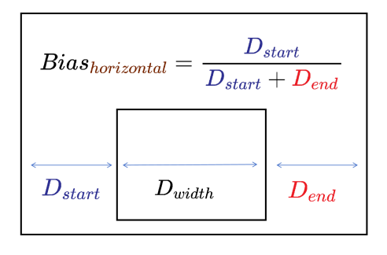

# Basic Types

<!--Kit: ArkUI-->
<!--Subsystem: ArkUI-->
<!--Owner: @yihao-lin-->
<!--Designer: @piggyguy-->
<!--Tester: @songyanhong-->
<!--Adviser: @Brilliantry_Rui-->
<!-- md-trans-meta sourceCommit=e78000786b6066ce7916b5b0601f1bca3cb44a49 translatedAt=2026-08-17T10:24:59.558Z pushedAt=2026-08-17T12:02:24.585Z -->

>**NOTE**
>
>The initial APIs of this module are supported since API version 7. Newly added APIs will be marked with a superscript to indicate their earliest API version.

## Resource

type Resource = import('../api/global/resource').Resource

Defines reference resources for component attributes. Resource files must be stored and managed in specific subdirectories. For examples of resource directories, see [Resource Categories](../../../quick-start/resource-categories-and-access.md#resource-categories).

| Type                    | Description                        |
| --------------------- | ------------------------- |
| import('../api/global/resource').[Resource](../../apis-localization-kit/js-apis-resource.md#resource-1)             | Resource reference type.                    |

**Widget capability**: This API can be used in ArkTS widgets since API version 9.

**Atomic service API**: This API can be used in atomic services since API version 11.

**System capability**: SystemCapability.ArkUI.ArkUI.Full

You can use `$r` or `$rawfile` to create a **Resource** object, but its attribute values cannot be changed.

- `$r('belonging.type.name')`

  **belonging**: group to which the resource belongs, which can be **'sys'** or **'app'**.

  **type**: resource type, which can be '**boolean'**, **'color'**, **'float'**, **'intarray'**, **'integer'**, **'pattern'**, '**plural'**, **'strarray'**, **'string'**, or **'media'**.

  **name**: resource name, which is determined during resource definition.

- `$rawfile('filename')`

  **filename**: name of the file in the **resources/rawfile** directory of the project.

> **NOTE**
>
> - When a resource type is referenced, ensure that the data type in the resource type object is consistent with the type of the attribute method that uses the resource type as a parameter. For example, if an attribute method supports setting string | Resource, the data type should also be string when the Resource reference type is used.
>
> - When a resource type is referenced, ensure that the usage of the resource type object is currently supported. Otherwise, the effect of the attribute that uses the resource type as a parameter will be the same as when the attribute is not set.
>
> - $rawfile does not support preview through the [Previewer](https://developer.huawei.com/consumer/en/doc/harmonyos-guides/ide-previewer-arkts-js).

## Length

type Length = string | number | Resource

Defines a size unit.

**Widget capability**: This API can be used in ArkTS widgets since API version 9.

**Atomic service API**: This API can be used in atomic services since API version 11.

**System capability**: SystemCapability.ArkUI.ArkUI.Full

| Type                   | Description                                    |
| --------------------- | -------------------------------------- |
| string                | String type. Specify the length [unit](ts-pixel-units.md) explicitly, for example, **'10px'**, or provide the length in percentage, for example, **'100%'**. **NOTE** If the unit is not specified, the default unit vp is used, in which case **'10'** is equivalent to 10 vp.|
| number                | Number type. The default unit is vp.                               |
| [Resource](#resource) | Size referenced from system or app resources.              |

## LengthMetricsUnit12+

type LengthMetricsUnit = import('../api/arkui/Graphics').LengthMetricsUnit

Defines the unit of a length attribute.

**Widget capability**: This API can be used in ArkTS widgets since API version 12.

**Atomic service API**: This API can be used in atomic services since API version 12.

**System capability:** SystemCapability.ArkUI.ArkUI.Full

| Type                    | Description                                     |
| --------------------- | -------------------------------------- |
|import('../api/arkui/Graphics').[LengthMetricsUnit](../js-apis-arkui-graphics.md#lengthmetricsunit12)   | Unit of a length attribute. |

## LengthMetrics12+

type LengthMetrics = import('../api/arkui/Graphics').LengthMetrics

Defines a length attribute.

**Widget capability**: This API can be used in ArkTS widgets since API version 12.

**Atomic service API**: This API can be used in atomic services since API version 12.

**System capability:** SystemCapability.ArkUI.ArkUI.Full

| Type                    | Description                                     |
| --------------------- | -------------------------------------- |
|import('../api/arkui/Graphics').[LengthMetrics](../js-apis-arkui-graphics.md#lengthmetrics12)   | Length attribute. |

## ColorMetrics12+

declare type ColorMetrics = import('../api/arkui/Graphics').ColorMetrics

Defines a mixed color.

**Widget capability**: This API can be used in ArkTS widgets since API version 12.

**Atomic service API**: This API can be used in atomic services since API version 12.

**System capability:** SystemCapability.ArkUI.ArkUI.Full

| Type                    | Description                                     |
| --------------------- | -------------------------------------- |
|import('../api/arkui/Graphics').[ColorMetrics](../js-apis-arkui-graphics.md#colormetrics12)   | Mixed color. |

## ResourceStr

type ResourceStr = string | Resource

Defines the types that can be used by input parameters of the string type.

**Widget capability**: This API can be used in ArkTS widgets since API version 9.

**Atomic service API**: This API can be used in atomic services since API version 11.

**System capability**: SystemCapability.ArkUI.ArkUI.Full

| Type                   | Description                       |
| --------------------- | ------------------------- |
| string                | String type.                   |
| [Resource](#resource) | String referenced from system or app resources.|

## Padding

type Padding = { top: Length; right: Length; bottom: Length; left: Length; }

Defines the paddings in different directions of a component.

To reference this object, at least one parameter must be passed.

**Widget capability**: This API can be used in ArkTS widgets since API version 9.

**Atomic service API**: This API can be used in atomic services since API version 11.

**System capability**: SystemCapability.ArkUI.ArkUI.Full

| Name | Type | Mandatory | Description |
| -------- | -------- | -------- | -------- |
| top    | [Length](#length) | No | Top padding, the size between the inner element of the component and the top edge of the component.  |
| right  | [Length](#length) | No | Right padding, the size between the inner element of the component and the right boundary of the component. |
| bottom | [Length](#length) | No | Bottom padding, the size between the inner element of the component and the bottom edge of the component.  |
| left   | [Length](#length) | No | Left padding, the size between the inner element of the component and the left boundary of the component. |

## LocalizedPadding12+

Defines the paddings in different directions of a component.

**Widget capability**: This API can be used in ArkTS widgets since API version 12.

**Atomic service API**: This API can be used in atomic services since API version 12.

**Model restriction:** This API can be used only in the stage model.

**System capability**: SystemCapability.ArkUI.ArkUI.Full

| Name| Type| Read-Only| Optional| Description|
| -------- | -------- | -------- | -------- | -------- |
| top    | [LengthMetrics](../js-apis-arkui-graphics.md#lengthmetrics12)12+ | No| Yes   | Height of the padding on the top of the component. |
| end    | [LengthMetrics](../js-apis-arkui-graphics.md#lengthmetrics12)12+ | No| Yes   | Width of the padding on the right of the component. Width of the padding on the left of the component in RTL mode.|
| bottom | [LengthMetrics](../js-apis-arkui-graphics.md#lengthmetrics12)12+ | No| Yes   | Height of the padding at the bottom of the component. |
| start  | [LengthMetrics](../js-apis-arkui-graphics.md#lengthmetrics12)12+ | No| Yes   | Width of the padding on the left of the component. Width of the padding on the right of the component in RTL mode.|

## Margin

type Margin = Padding

Defines the margins in different directions of a component.

To reference this object, at least one parameter must be passed.

**Widget capability**: This API can be used in ArkTS widgets since API version 9.

**Atomic service API**: This API can be used in atomic services since API version 11.

**System capability**: SystemCapability.ArkUI.ArkUI.Full

| Type                | Description                   |
| ----------------- | -------- |
| [Padding](#padding) | Margin type, used to describe the margins in different directions of a component. Its type is the same as the padding type.|

## LocalizedMargin12+

type LocalizedMargin = LocalizedPadding

Defines the margins in different directions of a component.

To reference this object, at least one parameter must be passed.

**Widget capability**: This API can be used in ArkTS widgets since API version 12.

**Atomic service API**: This API can be used in atomic services since API version 12.

**Model restriction:** This API can be used only in the stage model.

**System capability**: SystemCapability.ArkUI.ArkUI.Full

| Type                | Description                   |
| ----------------- | -------- |
| [LocalizedPadding](#localizedpadding12) | Margin type, used to describe the margins in different directions of a component. Its type is the same as the padding type.|

## EdgeWidths9+

type EdgeWidths = { top: Length; right: Length; bottom: Length; left: Length; }

Defines component edge widths for absolute directions.

To reference this object, at least one parameter must be passed.

**Widget capability**: This API can be used in ArkTS widgets since API version 9.

**Atomic service API**: This API can be used in atomic services since API version 11.

**System capability**: SystemCapability.ArkUI.ArkUI.Full

| Name   | Type | Mandatory | Description             |
| ------ | ---- | ------| ---------------- |
| top    | [Length](#length) | No | Width of the top border of the component. |
| right  | [Length](#length) | No | Width of the right border of the component. |
| bottom | [Length](#length) | No | Width of the bottom border of the component. |
| left   | [Length](#length) | No | Width of the left border of the component. |

## EdgeWidth10+

type EdgeWidth = EdgeWidths

Border width type, used to describe the widths of a component's border in different directions.

To reference this object, at least one parameter must be passed.

**Atomic service API**: This API can be used in atomic services since API version 11.

**Model restriction:** This API can be used only in the stage model.

**System capability:** SystemCapability.ArkUI.ArkUI.Full

| Type | Description             |
| ---- | ---------------- |
| [EdgeWidths](#edgewidths9) | Widths of a component's border in different directions. |

## LocalizedEdgeWidths12+

Defines component edge widths for localized logical directions.

To reference this object, at least one parameter must be passed.

**Widget capability**: This API can be used in ArkTS widgets since API version 12.

**Atomic service API**: This API can be used in atomic services since API version 12.

**Model restriction:** This API can be used only in the stage model.

**System capability**: SystemCapability.ArkUI.ArkUI.Full

| Name  | Type|Read-Only|Optional| Description            |
| ------ | ---- |------|------| ---------------- |
| top    | [LengthMetrics](../js-apis-arkui-graphics.md#lengthmetrics12)12+ | No|Yes  | Width of the top edge of the component.|
| end    | [LengthMetrics](../js-apis-arkui-graphics.md#lengthmetrics12)12+ | No|Yes  | Width of the right edge of the component. Width of the left edge of the component in RTL mode.|
| bottom | [LengthMetrics](../js-apis-arkui-graphics.md#lengthmetrics12)12+ | No|Yes  | Width of the bottom edge of the component.|
| start  | [LengthMetrics](../js-apis-arkui-graphics.md#lengthmetrics12)12+ | No|Yes  | Width of the left edge of the component. Width of the right edge of the component in RTL mode.|

## BorderRadiuses9+

type BorderRadiuses = { topLeft: Length; topRight: Length; bottomLeft: Length; bottomRight: Length; }

Defines the corner radius of a component's border.

To reference this object, at least one parameter must be passed.

**Widget capability**: This API can be used in ArkTS widgets since API version 9.

**Atomic service API**: This API can be used in atomic services since API version 11.

**System capability**: SystemCapability.ArkUI.ArkUI.Full

| Name | Type | Mandatory | Description |
| -------- | -------- | -------- | -------- |
| topLeft     | [Length](#length) | No | Radius of the top-left corner of the component. |
| topRight    | [Length](#length) | No | Radius of the top-right corner of the component. |
| bottomLeft  | [Length](#length) | No | Radius of the bottom-left corner of the component. |
| bottomRight | [Length](#length) | No | Radius of the bottom-right corner of the component. |

## LocalizedBorderRadiuses12+

Defines the corner radius of a component's border.

To reference this object, at least one parameter must be passed.

**Widget capability**: This API can be used in ArkTS widgets since API version 12.

**Atomic service API**: This API can be used in atomic services since API version 12.

**Model restriction:** This API can be used only in the stage model.

**System capability**: SystemCapability.ArkUI.ArkUI.Full

| Name| Type| Read-Only| Optional| Description|
| -------- | -------- | -------- | -------- | -------- |
| topStart    | [LengthMetrics](../js-apis-arkui-graphics.md#lengthmetrics12)12+ | No|Yes   | Radius of the top-left corner of the component. For right-to-left scripts, this indicates the radius of the top-right corner of the component.|
| topEnd      | [LengthMetrics](../js-apis-arkui-graphics.md#lengthmetrics12)12+ | No|Yes   | Radius of the top-right corner of the component. For right-to-left scripts, this indicates the corner radius of the top-left corner of the component.|
| bottomStart | [LengthMetrics](../js-apis-arkui-graphics.md#lengthmetrics12)12+ | No|Yes   | Radius of the bottom-left corner of the component. For right-to-left scripts, this indicates the corner radius of the bottom-right corner of the component.|
| bottomEnd   | [LengthMetrics](../js-apis-arkui-graphics.md#lengthmetrics12)12+ | No|Yes   | Radius of the bottom-right corner of the component. For right-to-left scripts, this indicates the corner radius of the bottom-left corner of the component.|

## EdgeColors9+

type EdgeColors = { top: ResourceColor; right: ResourceColor; bottom: ResourceColor; left: ResourceColor; }

Defines the edge colors of a component.

To reference this object, at least one parameter must be passed.

**Widget capability**: This API can be used in ArkTS widgets since API version 9.

**Atomic service API**: This API can be used in atomic services since API version 11.

**System capability**: SystemCapability.ArkUI.ArkUI.Full

| Name   | Type | Mandatory| Description             |
| ------ | ---- | ------| ---------------- |
| top    | [ResourceColor](#resourcecolor) | No | Color of the top border of the component. |
| right  | [ResourceColor](#resourcecolor) | No | Color of the right border of the component. |
| bottom | [ResourceColor](#resourcecolor) | No | Color of the bottom border of the component. |
| left   | [ResourceColor](#resourcecolor) | No | Color of the left border of the component. |

## LocalizedEdgeColors12+

Defines the edge colors of a component.

To reference this object, at least one parameter must be passed.

**Widget capability**: This API can be used in ArkTS widgets since API version 12.

**Atomic service API**: This API can be used in atomic services since API version 12.

**Model restriction:** This API can be used only in the stage model.

**System capability**: SystemCapability.ArkUI.ArkUI.Full

| Name  | Type|Read-Only|Optional| Description            |
| ------ | ---- |------|------| ---------------- |
| top    | [ResourceColor](#resourcecolor) | No|Yes   | Color of the top edge of the component.|
| end    | [ResourceColor](#resourcecolor) | No|Yes   | Color of the right edge of the component. Color of the left edge of the component in RTL mode.|
| bottom | [ResourceColor](#resourcecolor) | No|Yes   | Color of the bottom edge of the component.|
| start  | [ResourceColor](#resourcecolor) | No|Yes   | Color of the left edge of the component. Color of the right edge of the component in RTL mode.|

## EdgeStyles9+

type EdgeStyles = { top: BorderStyle; right: BorderStyle; bottom: BorderStyle; left: BorderStyle; }

Defines the edge styles of a component.

To reference this object, at least one parameter must be passed.

**Widget capability**: This API can be used in ArkTS widgets since API version 9.

**Atomic service API**: This API can be used in atomic services since API version 11.

**System capability**: SystemCapability.ArkUI.ArkUI.Full

| Name | Type | Mandatory | Description |
| -------- | -------- | -------- | -------- |
| top    | [BorderStyle](ts-appendix-enums.md#borderstyle) | No | Style of the top border of the component. |
| right  | [BorderStyle](ts-appendix-enums.md#borderstyle) | No | Style of the right border of the component. |
| bottom | [BorderStyle](ts-appendix-enums.md#borderstyle) | No | Style of the bottom border of the component. |
| left   | [BorderStyle](ts-appendix-enums.md#borderstyle) | No | Style of the left border of the component. |

## Offset

type Offset = { dx: Length; dy: Length; }

Defines the offset coordinates of a component in the layout.

**Atomic service API**: This API can be used in atomic services since API version 11.

**System capability**: SystemCapability.ArkUI.ArkUI.Full

| Name   | Type                | Mandatory | Description       |
| ---- | ----------------- | ---- | -------- |
| dx   | [Length](#length) | Yes  | Horizontal offset. |
| dy   | [Length](#length) | Yes  | Vertical offset. |

## ResourceColor

type ResourceColor = [Color](ts-appendix-enums.md#color) | number | string | [Resource](#resource)

Defines the color types of resources.

**Widget capability**: This API can be used in ArkTS widgets since API version 9.

**Atomic service API**: This API can be used in atomic services since API version 11.

**System capability**: SystemCapability.ArkUI.ArkUI.Full

| Type                               | Description                                                        |
| ----------------------------------- | ------------------------------------------------------------ |
| [Color](ts-appendix-enums.md#color) | Color enums.                                                |
| number                              | Color in HEX format. RGB and ARGB are supported. Examples: **0xffffff** and **0xffff0000**. The input length is not checked; the format is determined by the value range. For example, **0x00ffffff** is parsed as RGB.|
| string                              | Color in RGB, RGBA, or ARGB format. RGB examples: **'#ffffff'** and **'rgb(255, 100, 255)'** RGBA example: **'rgba(255, 100, 255, 0.5)'** ARGB example: **'#ff000000'**|
| [Resource](#resource)               | Color referenced from system or app resources.      |

## LengthConstrain

type LengthConstrain = { minLength: Length; maxLength: Length; }

Defines the maximum and minimum lengths of a component.

**Widget capability**: This API can be used in ArkTS widgets since API version 9.

**Atomic service API**: This API can be used in atomic services since API version 11.

**System capability**: SystemCapability.ArkUI.ArkUI.Full

| Name        | Type                | Mandatory | Description      |
| --------- | ----------------- | ---- | -------- |
| minLength | [Length](#length) | Yes | Minimum length of the component. |
| maxLength | [Length](#length) | Yes | Maximum length of the component. |

## Font

Sets the text style.

> **NOTE**
>
> You can use [loadFontSync](../../apis-arkgraphics2d/js-apis-graphics-text.md#loadfontsync) to register custom fonts.

**Atomic service API**: This API can be used in atomic services since API version 11.

**System capability**: SystemCapability.ArkUI.ArkUI.Full

| Name  | Type                                                        | Read-Only |  Optional| Description                                                        |
| ------ | ------------------------------------------------------------ | ---- | -------- | ------------------------------------------------------------ |
| size   | [Length](#length)                                            | No  |  Yes | Font size. If the value is of the number type, the unit fp is used. Percentage strings are not supported. Default value: **16.0**|
| weight | [FontWeight](ts-appendix-enums.md#fontweight) \| number \| string | No |  Yes| Font weight. For the number type, the value ranges from 100 to 900, at an interval of 100. A larger value indicates a thicker font. Default value: **400** \| **FontWeight.Normal**|
| family | string \| [Resource](#resource)                              | No  |  Yes | Font family. Default font: **'HarmonyOS Sans'**. To specify multiple fonts, separate them with commas (,), and fonts are applied in priority order. Example: **'Arial, HarmonyOS Sans'**.|
| style  | [FontStyle](ts-appendix-enums.md#fontstyle)                  | No  |  Yes | Font style. Default value: **FontStyle.Normal**            |

## Area8+

Defines the area information of a component.

**Widget capability**: This API can be used in ArkTS widgets since API version 9.

**Atomic service API**: This API can be used in atomic services since API version 11.

**System capability**: SystemCapability.ArkUI.ArkUI.Full

| Name             | Type                     | Read-Only | Optional | Description                             |
| -------------- | ---------------------- | --------| -----| ------------------------------ |
| width          | [Length](#length)      | No | No | Width of the target element. Unit: vp |
| height         | [Length](#length)      | No | No | Height of the target element. Unit: vp |
| position       | [Position](#position) | No | No | Position of the top-left corner of the target element in the [component coordinate system](../../../ui/arkui-glossary.md#component-coordinate-system) based on the parent element.            |
| globalPosition | [Position](#position) | No | No | Position of the top-left corner of the target element in the current window coordinate system.             |

## Position

Defines the coordinates of a point.

**Widget capability**: This API can be used in ArkTS widgets since API version 9.

**Atomic service API**: This API can be used in atomic services since API version 11.

**System capability**: SystemCapability.ArkUI.ArkUI.Full

| Name  | Type               | Read-Only |  Optional  | Description                         |
| ---- | ----------------- | ---- | -------- | --------------------------- |
| x    | [Length](#length) | No  |  Yes| X-coordinate. Unit: vp|
| y    | [Length](#length) | No  |  Yes| Y-coordinate. Unit: vp|

## LocalizedPosition12+

Defines the coordinates of a point.

**Atomic service API**: This API can be used in atomic services since API version 12.

**Model restriction:** This API can be used only in the stage model.

**System capability**: SystemCapability.ArkUI.ArkUI.Full

| Name  | Type               | Read-Only |  Optional  | Description                         |
| ---- | ----------------- | ---- | -------- | --------------------------- |
| start  | [LengthMetrics](../js-apis-arkui-graphics.md#lengthmetrics12) | No |  Yes | X-coordinate relative to the left for left-to-right (LTR) scripts; X-coordinate relative to the right for right-to-left (RTL) scripts. |
| top    | [LengthMetrics](../js-apis-arkui-graphics.md#lengthmetrics12) | No  |  Yes| Y-coordinate.|

## Edges12+

Defines the offset relative to the four edges. If both **top** and **bottom** are set, only **top** takes effect. If both **left** and **right** are set, only **left** takes effect.

**Widget capability**: This API can be used in ArkTS widgets since API version 12.

**Atomic service API**: This API can be used in atomic services since API version 12.

**Model restriction:** This API can be used only in the stage model.

**System capability**: SystemCapability.ArkUI.ArkUI.Full

| Name  | Type    | Read-Only |  Optional  | Description                         |
| ---- | ------ | ---- | -------- | --------------------------- |
| top    | [Dimension](#dimension10) | No | Yes | Offset relative to the top edge.|
| bottom    | [Dimension](#dimension10) | No | Yes | Offset relative to the bottom edge.|
| left    | [Dimension](#dimension10) | No  | Yes| Offset relative to the left edge.|
| right    | [Dimension](#dimension10) | No |  Yes | Offset relative to the right edge.|

## LocalizedEdges12+

Defines the offset relative to the four edges. If both **top** and** bottom **are set, only **top** takes effect. If both **start** and **end** are set, only **start** takes effect.

**Atomic service API**: This API can be used in atomic services since API version 12.

**Model restriction:** This API can be used only in the stage model.

**System capability**: SystemCapability.ArkUI.ArkUI.Full

| Name  | Type    | Read-Only |  Optional  | Description                         |
| ---- | ------ | ---- | -------- | --------------------------- |
| top    | [LengthMetrics](../js-apis-arkui-graphics.md#lengthmetrics12) | No |  Yes | Offset relative to the top edge.|
| bottom    | [LengthMetrics](../js-apis-arkui-graphics.md#lengthmetrics12) | No  | Yes| Offset relative to the bottom edge.|
| start    | [LengthMetrics](../js-apis-arkui-graphics.md#lengthmetrics12) | No  | Yes| Offset relative to the left in LTR mode; offset relative to the right in RTL mode.|
| end    | [LengthMetrics](../js-apis-arkui-graphics.md#lengthmetrics12) | No |  Yes | Offset relative to the right in LTR mode; offset relative to the left in RTL mode.|

## ConstraintSizeOptions

Defines the size constraints of a component during layout.

**Widget capability**: This API can be used in ArkTS widgets since API version 9.

**Atomic service API**: This API can be used in atomic services since API version 11.

**System capability**: SystemCapability.ArkUI.ArkUI.Full

| Name| Type| Read-Only| Optional| Description|
| -------- | -------- | -------- | -------- | -------- |
| minWidth  | [Length](#length) | No|Yes   | Minimum width of the component.|
| maxWidth  | [Length](#length) | No|Yes   | Maximum width of the component.|
| minHeight | [Length](#length) | No|Yes   | Minimum height of the component.|
| maxHeight | [Length](#length) | No|Yes   | Maximum height of the component.|

>  **NOTE**
>
>  In the [Row](./ts-container-row.md), [Column](./ts-container-column.md), and [RelativeContainer](./ts-container-relativecontainer.md) components, setting **width** and **height** to **auto** means that the size adapts to the size of their child components. In the [TextInput](./ts-basic-components-textinput.md) component, setting **width** to **auto** means that the width adapts to the width of the text content.

## SizeOptions

Defines the width and height of a component during layout.

**Widget capability**: This API can be used in ArkTS widgets since API version 9.

**Atomic service API**: This API can be used in atomic services since API version 11.

**System capability**: SystemCapability.ArkUI.ArkUI.Full

| Name| Type| Read-Only| Optional| Description|
| -------- | -------- | -------- | -------- | -------- |
| width  | [Length](#length) | No|Yes  | Width of the component.|
| height | [Length](#length) | No|Yes  | Height of the component.|

## BorderOptions

Defines border information.

**System capability**: SystemCapability.ArkUI.ArkUI.Full

| Name  | Type|Read-Only|Optional| Description            |
| ------ | ---- |------|------| ---------------- |
| width  | [EdgeWidths](./ts-types.md#edgewidths9)9+&nbsp;\|&nbsp;[Length](ts-types.md#length)&nbsp;\|&nbsp;[LocalizedEdgeWidths](./ts-types.md#localizededgewidths12)12+ | No|Yes  | Border width. **Atomic service API**: This API can be used in atomic services since API version 11. **Widget capability**: This API can be used in ArkTS widgets since API version 9.    |
| color  | [EdgeColors](./ts-types.md#edgecolors9)9+&nbsp;\|&nbsp;[ResourceColor](ts-types.md#resourcecolor)&nbsp;\|&nbsp;[LocalizedEdgeColors](#localizededgecolors12)12+ | No|Yes  | Border color. **Atomic service API**: This API can be used in atomic services since API version 11. **Widget capability**: This API can be used in ArkTS widgets since API version 9.    |
| radius | [BorderRadiuses](#borderradiuses9)9+&nbsp;\|&nbsp;[Length](ts-types.md#length)&nbsp;\|&nbsp;[LocalizedBorderRadiuses](#localizedborderradiuses12)12+ | No|Yes  | Border corner radius. **Atomic service API**: This API can be used in atomic services since API version 11. **Widget capability**: This API can be used in ArkTS widgets since API version 9.|
| style  | [EdgeStyles](#edgestyles9)9+&nbsp;\|&nbsp;[BorderStyle](ts-appendix-enums.md#borderstyle) | No|Yes  | Border style. **Atomic service API**: This API can be used in atomic services since API version 11. **Widget capability**: This API can be used in ArkTS widgets since API version 9.   |
| dashGap12+  | [EdgeWidths](#edgewidths9)&nbsp;\|&nbsp;[LengthMetrics](../js-apis-arkui-graphics.md#lengthmetrics12)&nbsp;\|&nbsp;[LocalizedEdgeWidths](#localizededgewidths12) | No|Yes  | Sets the gap between dashed line segments. This attribute takes effect only when the border style is dashed. Percentage values are not supported. **Atomic service API:** This API can be used in atomic services since API version 12. **Model restriction:** This API can be used only in the stage model. **Widget capability:** This API cannot be used in ArkTS widgets.|
| dashWidth12+  | [EdgeWidths](#edgewidths9)&nbsp;\|&nbsp;[LengthMetrics](../js-apis-arkui-graphics.md#lengthmetrics12)&nbsp;\|&nbsp;[LocalizedEdgeWidths](#localizededgewidths12) | No|Yes   | Sets the length of dashed line segments. This attribute takes effect only when the border style is dashed. Percentage values are not supported. **Atomic service API:** This API can be used in atomic services since API version 12. **Model restriction:** This API can be used only in the stage model. **Widget capability:** This API cannot be used in ArkTS widgets.     |

## ColorFilter9+

Defines a color filter with a 4 x 5 matrix.

**Widget capability**: This API can be used in ArkTS widgets since API version 9.

**Atomic service API**: This API can be used in atomic services since API version 11.

**System capability**: SystemCapability.ArkUI.ArkUI.Full

### constructor9+

constructor(value: number[])

Constructor of ColorFilter, which creates a color filter with a 4\*5 matrix.

**Widget capability**: This API can be used in ArkTS widgets since API version 9.

**Atomic service API**: This API can be used in atomic services since API version 11.

**System capability:** SystemCapability.ArkUI.ArkUI.Full

**Parameters**

| Name | Type | Mandatory | Description  |
| ---- | ---- | ---- | ---- |
| value | number[] | Yes   | Value of the 4\*5 color matrix. [m\*n] is the matrix value at row m and column n. The matrix is row-major. |

## CustomBuilder8+

Defines a custom UI content builder for component attribute methods.

| Name           | Type                  | Description                                      |
| ------------- | ---------------------- | ---------------------------------------- |
| CustomBuilder | (()&nbsp;=&gt;&nbsp;any) \| void | Builder used to generate a custom UI component when used with the [@Builder](../../../ui/state-management/arkts-builder.md) decorator.|

## CustomBuilderT\<T>23+

type CustomBuilderT\<T> = (t: T) => void

Defines a custom UI content builder. Compared with **CustomBuilder**, this API supports one input parameter.

**Widget capability**: This API can be used in ArkTS widgets since API version 23.

**Atomic service API**: This API can be used in atomic services since API version 23.

**Model restriction:** This API can be used only in the stage model.

**System capability**: SystemCapability.ArkUI.ArkUI.Full

**Parameters**

| Name| Type| Mandatory| Description|
| ----------- | -------- | ---- | ---------------------------------------- |
| t | T| Yes| Used with [@Builder](../../../ui/state-management/arkts-builder.md) to generate a custom component and accepts one input parameter.|

## MarkStyle10+

**Atomic service API**: This API can be used in atomic services since API version 11.

**Model restriction:** This API can be used only in the stage model.

**System capability**: SystemCapability.ArkUI.ArkUI.Full

| Name        | Type                                       | Read-Only  |  Optional   | Description                                                         |
| ----------- | ------------------------------------------ | ---- | -------- | ------------------------------------------------------------ |
| strokeColor | [ResourceColor](ts-types.md#resourcecolor) | No  |  Yes   | Color of the inner icon. Default value: Color.White                                               |
| size        | [Length](ts-types.md#length)               | No  |  Yes   | Size of the inner icon, in vp. The default size is the same as the width of the check box component. Percentage values are not supported. If an invalid value is set, the default value is used. |
| strokeWidth | [Length](ts-types.md#length)               | No  |  Yes   | Thickness of the inner icon, in vp. Percentage values are not supported. If an invalid value is set, the default value is used. Default value: 2 |

## ModalTransition10+

Enumerates full-screen modal transition types.

**Atomic service API**: This API can be used in atomic services since API version 11.

**Model restriction:** This API can be used only in the stage model.

**System capability**: SystemCapability.ArkUI.ArkUI.Full

| Name     | Description          |
| ------- | ------------ |
| NONE    | No transition animation for the modal.  |
| DEFAULT | Slide-up and slide-down animation for the modal. |
| ALPHA   | Opacity gradient animation for the modal.|

## OutlineOptions11+

Defines the outline options.

**Model restriction:** This API can be used only in the stage model.

**Atomic service API**: This API can be used in atomic services since API version 12.

**System capability:** SystemCapability.ArkUI.ArkUI.Full

**Widget capability**: This API can be used in ArkTS widgets since API version 11.

| Name  | Type                  | Read-Only  |   Optional                            | Description                                                        |
| ------ | ----------------------|----------------- | --------------------- | ------------------------------------------------------------ |
| width  | [EdgeOutlineWidths](#edgeoutlinewidths11)&nbsp;\|&nbsp;[Dimension](#dimension10)| No | Yes | Sets the outline width. Percentages are not supported. Default value: 0. In the outline effect, width is mandatory; otherwise, the outline is not displayed.  |
| color  | [EdgeColors](#edgecolors9)&nbsp;\|&nbsp;[ResourceColor](#resourcecolor)&nbsp;\|&nbsp;[LocalizedEdgeColors](#localizededgecolors12)12+ | No | Yes | Sets the outline color. Default value: Color.Black                    |
| radius | [OutlineRadiuses](#outlineradiuses11)&nbsp;\|&nbsp;[Dimension](#dimension10)| No | Yes | Sets the outline border radius. Percentages are not supported. Default value: 0 Maximum effective value: component width/2 + outlineWidth or component height/2 + outlineWidth.  |
| style  | [EdgeOutlineStyles](#edgeoutlinestyles11)&nbsp;\|&nbsp;[OutlineStyle](ts-universal-attributes-outline.md#outlinestyle)| No | Yes | Sets the outline style. Default value: OutlineStyle.SOLID             |

## EdgeOutlineWidths11+

To reference this object, at least one parameter must be passed.

**Atomic service API**: This API can be used in atomic services since API version 12.

**Widget capability**: This API can be used in ArkTS widgets since API version 11.

| Name    | Type                        | Read-Only| Optional  | Description     |
| ------ | ---------------------------- | -- | -- | ------- |
| left   | [Dimension](#dimension10) | No| Yes  | Width of the left outline.|
| right  | [Dimension](#dimension10) | No| Yes   | Width of the right outline.|
| top    | [Dimension](#dimension10) | No| Yes  | Width of the top outline.|
| bottom | [Dimension](#dimension10) | No| Yes | Width of the bottom outline.|

## OutlineRadiuses11+

To reference this object, at least one parameter must be passed.

**Atomic service API**: This API can be used in atomic services since API version 12.

**Widget capability**: This API can be used in ArkTS widgets since API version 11.

**Model restriction:** This API can be used only in the stage model.

**System capability**: SystemCapability.ArkUI.ArkUI.Full

| Name         | Type                        | Read-Only| Optional  | Description      |
| ----------- | -------------------- | -------- | ---- | -------- |
| topLeft     | [Dimension](ts-types.md#dimension10) | No| Yes  | Radius of the top-left corner.|
| topRight    | [Dimension](ts-types.md#dimension10) | No| Yes  | Radius of the top-right corner.|
| bottomLeft  | [Dimension](ts-types.md#dimension10) | No| Yes  | Radius of the bottom-left corner.|
| bottomRight | [Dimension](ts-types.md#dimension10) | No| Yes  | Radius of the bottom-right corner.|

## EdgeOutlineStyles11+

To reference this object, at least one parameter must be passed.

**Atomic service API**: This API can be used in atomic services since API version 12.

**Widget capability**: This API can be used in ArkTS widgets since API version 11.

**Model restriction:** This API can be used only in the stage model.

**System capability**: SystemCapability.ArkUI.ArkUI.Full

| Name    | Type                                    | Read-Only| Optional | Description     |
| ------ | ---------------------------------------- | -- | -- | ------- |
| left   | [OutlineStyle](ts-universal-attributes-outline.md#outlinestyle)| No| Yes  | Style of the left outline.|
| right  | [OutlineStyle](ts-universal-attributes-outline.md#outlinestyle)| No| Yes  | Style of the right outline.|
| top    | [OutlineStyle](ts-universal-attributes-outline.md#outlinestyle)| No| Yes  | Style of the top outline.|
| bottom | [OutlineStyle](ts-universal-attributes-outline.md#outlinestyle)| No | Yes | Style of the bottom outline.|

## Dimension10+

type Dimension = PX | VP | FP | LPX | Percentage | Resource

Defines a size unit.

**Widget capability**: This API can be used in ArkTS widgets since API version 23.

**Atomic service API**: This API can be used in atomic services since API version 11.

**Model restriction:** This API can be used only in the stage model.

**System capability**: SystemCapability.ArkUI.ArkUI.Full

| Type                   | Description                                    |
| --------------------- | -------------------------------------- |
| [PX](#px10)               | Physical pixel unit type. The unit px must be included, for example, **'10px'**.|
| [VP](#vp10)                | Viewport pixel unit. The unit vp can be included or omitted, for example, **10** or **'10vp'**.|
| [FP](#fp10)                | Font pixel unit type. The unit fp must be included, for example, **'10fp'**.|
| [LPX](#lpx10)              | Logical pixel unit type. The unit lpx must be included, for example, **'10lpx'**.|
| [Percentage](#percentage10)        | Specifies the percentage unit, for example, '10%'. |
| [Resource](#resource) | Size referenced from system or app resources.|

## PX10+

type PX = { number }px

Defines a length in px.

**Widget capability**: This API can be used in ArkTS widgets since API version 23.

**Atomic service API**: This API can be used in atomic services since API version 11.

**Model restriction:** This API can be used only in the stage model.

**System capability**: SystemCapability.ArkUI.ArkUI.Full

| Type                   | Description                                    |
| --------------------- | -------------------------------------- |
| { number }px               | The value must be specified in px, for example, '10px'. |

## VP10+

type VP = { number }vp | number

Length type, used to describe a length in vp.

**Widget capability**: This API can be used in ArkTS widgets since API version 23.

**Atomic service API**: This API can be used in atomic services since API version 11.

**Model restriction:** This API can be used only in the stage model.

**System capability**: SystemCapability.ArkUI.ArkUI.Full

| Type                   | Description                                    |
| --------------------- | -------------------------------------- |
| { number }vp \| number | A number or a vp pixel unit must be specified, for example, 10 or '10vp'. |

## FP10+

type FP = { number }fp

Defines a length in fp.

**Widget capability**: This API can be used in ArkTS widgets since API version 23.

**Atomic service API**: This API can be used in atomic services since API version 11.

**Model restriction:** This API can be used only in the stage model.

**System capability**: SystemCapability.ArkUI.ArkUI.Full

| Type                   | Description                                    |
| --------------------- | -------------------------------------- |
| { number }fp            | The value must be specified in fp, for example, '10fp'. |

## LPX10+

type LPX = { number }lpx

Defines a length in lpx.

**Widget capability**: This API can be used in ArkTS widgets since API version 23.

**Atomic service API**: This API can be used in atomic services since API version 11.

**Model restriction:** This API can be used only in the stage model.

**System capability**: SystemCapability.ArkUI.ArkUI.Full

| Type                   | Description                                    |
| --------------------- | -------------------------------------- |
| { number }lpx             | Specifies the value in lpx pixel units, for example, '10lpx'. |

## Percentage10+

type Percentage = { number }%

Length type, used to describe a length in percentage units.

**Widget capability**: This API can be used in ArkTS widgets since API version 23.

**Atomic service API**: This API can be used in atomic services since API version 11.

**Model restriction:** This API can be used only in the stage model.

**System capability**: SystemCapability.ArkUI.ArkUI.Full

| Type                   | Description                                    |
| --------------------- | -------------------------------------- |
| { number }%               | The percentage unit must be specified, for example, '10%'. |

## Degree10+

type Degree = `${number}deg`

Angle type, used to describe an angle in deg.

**Atomic service API**: This API can be used in atomic services since API version 11.

**Model restriction:** This API can be used only in the stage model.

**System capability**: SystemCapability.ArkUI.ArkUI.Full

| Type                   | Description                                    |
| --------------------- | -------------------------------------- |
| { number }deg               | The unit must be deg, for example, '10deg'. |

## TouchPoint11+

Defines the coordinates of the touch point. If it is not set, the touch point is centered.

**Atomic service API**: This API can be used in atomic services since API version 12.

**Model restriction:** This API can be used only in the stage model.

**System capability**: SystemCapability.ArkUI.ArkUI.Full

| Name   | Type | Read-Only | Optional | Description       |
| ------ | ------|--------|--------| ---------- |
| x | [Dimension](#dimension10) | No | No | X-axis coordinate of the follow point. |
| y | [Dimension](#dimension10) | No | No | Y-axis coordinate of the follow point. |

## VoidCallback12+

type VoidCallback = () => void

Function callback type with no parameters and no return value, used to define callback scenarios where no data needs to be passed and no result is returned.

**Atomic service API**: This API can be used in atomic services since API version 12.

**Model restriction:** This API can be used only in the stage model.

**System capability**: SystemCapability.ArkUI.ArkUI.Full

## Callback12+

type Callback<T, V = void> = (data: T) => V;

Defines the callback with parameters.

**Atomic service API**: This API can be used in atomic services since API version 12.

**Model restriction:** This API can be used only in the stage model.

**System capability**: SystemCapability.ArkUI.ArkUI.Full

## DividerStyleOptions12+

Defines divider information.

**Atomic service API**: This API can be used in atomic services since API version 12.

**Model restriction:** This API can be used only in the stage model.

**System capability**: SystemCapability.ArkUI.ArkUI.Full

| Name    | Type                                     | Read-Only| Optional| Description             |
| ------ | --------------------------------------- |---| -------- |-----------------|
| strokeWidth  | [LengthMetrics](../js-apis-arkui-graphics.md#lengthmetrics12)  | No | Yes | Width of the divider line.         |
| color  | [ResourceColor](#resourcecolor) | No | Yes| Color of the divider.        |
| startMargin | [LengthMetrics](../js-apis-arkui-graphics.md#lengthmetrics12) | No  | Yes | Distance between the divider and the start edge of the menu. |
| endMargin  | [LengthMetrics](../js-apis-arkui-graphics.md#lengthmetrics12)| No  | Yes | Distance between the divider and the end edge of the menu. |
| mode19+  | [DividerMode](ts-appendix-enums.md#dividermode19)| No  | Yes | Sets the divider mode. |

## ChainWeightOptions14+

Defines the layout weight of a component in a chain.

**Atomic service API**: This API can be used in atomic services since API version 14.

**Model restriction:** This API can be used only in the stage model.

**System capability**: SystemCapability.ArkUI.ArkUI.Full

| Name     | Type  | Read-Only| Optional| Description      |
| --------- | ------ | ---- | ---- | ---------- |
| horizontal | number | No| Yes| Layout weight of the component in the horizontal direction. It takes effect when set to a value greater than 0. Default value: **0** Invalid values are treated as **0**. |
| vertical     | number | No| Yes| Layout weight of the component in the vertical direction. It takes effect when set to a value greater than 0. Default value: **0** Invalid values are treated as **0**.|

## Configuration

 Defines the color mode and font scale.

**Widget capability**: This API can be used in ArkTS widgets since API version 9.

**Atomic service API**: This API can be used in atomic services since API version 11.

**System capability**: SystemCapability.ArkUI.ArkUI.Full

| Name     | Type  | Read-Only| Optional| Description      |
| --------- | ------ | ---- | ---- | ---------- |
| colorMode | string | Yes  | No  | Color mode.|
| fontScale | number | Yes  | No  | Font scale.|

## AccessibilityOptions14+

**Model restriction:** This API can be used only in the stage model.

**System capability**: SystemCapability.ArkUI.ArkUI.Full

| Name                  | Type   | Read-Only| Optional| Description                                                        |
| ---------------------- | ------- | ---- | ---- | ------------------------------------------------------------ |
| accessibilityPreferred | boolean | No| Yes  | If **accessibilityPreferred** is set to **true**, the accessibility text of this child node is prioritized during depth-first traversal of each child node. If **accessibilityText** is empty, the component's **Text** is used. The concatenated text is set for the parent node whose **accessibilityText** and **text** are both empty. If **accessibilityPreferred** is set to **false**, this feature is disabled. Default value: **false** **Atomic service API**: This API can be used in atomic services since API version 14.|
| stateControllerRoleType23+ | [AccessibilityRoleType](ts-universal-attributes-accessibility.md#accessibilityroletype18) | No| Yes  | Type of the target child component. After a container component with [accessibilityGroup](ts-universal-attributes-accessibility.md#accessibilitygroup14) enabled performs accessibility grouping, the selection state and state announcement text of the child component of the specified type are used as the state and announcement text of the grouped component. This aggregates state announcements during screen reading and eliminates the need to focus on child components individually. **NOTE** If multiple child components of the same type exist in the grouped component, the first matching child component found under the grouped component in the component tree acts as the controller component. Specific types in cross-process embedded components are not supported, such as widgets and **EmbeddedUIExtension**. Default value: no specified component **Atomic service API**: This API can be used in atomic services since API version 23.|
| stateControllerId23+ | string | No| Yes  | [Unique ID](ts-universal-attributes-component-id.md#id) of the target child component. After a container component with [accessibilityGroup](ts-universal-attributes-accessibility.md#accessibilitygroup14) enabled performs accessibility grouping, the selection state and state announcement text of the child component of the specified ID are used as the state and announcement text of the grouped component. This aggregates state announcements during screen reading and eliminates the need to focus on child components individually. **NOTE** If multiple child components of the same type exist in the grouped component, the first matching child component found under the grouped component in the component tree acts as the controller component. If this API is configured together with **stateControllerRoleType**, the component with a matching ID is prioritized. Specific types in cross-process embedded components are not supported, such as widgets and **EmbeddedUIExtension**. Default value: no specified component **Atomic service API**: This API can be used in atomic services since API version 23.|
| actionControllerRoleType23+ | [AccessibilityRoleType](ts-universal-attributes-accessibility.md#accessibilityroletype18) | No| Yes  | Type of the target child component. After a container component with [accessibilityGroup](ts-universal-attributes-accessibility.md#accessibilitygroup14) enabled performs accessibility grouping, any triggered accessibility control operation is forwarded to the child component of the specified type. This aggregates click events during screen reading and eliminates the need to focus on child components individually. **NOTE** If multiple child components of the same type exist in the grouped component, the first matching child component found under the grouped component in the component tree acts as the controller component. Currently, only accessibility click actions are supported. Specific types in cross-process embedded components are not supported, such as widgets and **EmbeddedUIExtension**. Default value: no specified component **Atomic service API**: This API can be used in atomic services since API version 23.|
| actionControllerId23+ | string | No| Yes  |  [Unique ID](ts-universal-attributes-component-id.md#id) of the target child component. After a container component with [accessibilityGroup](ts-universal-attributes-accessibility.md#accessibilitygroup14) enabled performs accessibility grouping, any triggered accessibility control operation is forwarded to the child component of the specified ID. This aggregates click events during screen reading and eliminates the need to focus on child components individually. **NOTE** If multiple child components of the same type exist in the grouped component, the first matching child component found under the grouped component in the component tree acts as the controller component. Currently, only accessibility click actions are supported. If this API is configured together with **actionControllerRoleType**, the component with a matching ID is prioritized. Specific types in cross-process embedded components are not supported, such as widgets and **EmbeddedUIExtension**. Default value: no specified component **Atomic service API**: This API can be used in atomic services since API version 23.|

## ScrollBarMargin20+

Defines the margin of the scroll bar.

**Atomic service API**: This API can be used in atomic services since API version 20.

**Model restriction:** This API can be used only in the stage model.

**System capability**: SystemCapability.ArkUI.ArkUI.Full

| Name | Type                                                        | Read-Only| Optional| Description                                  |
| ----- | ------------------------------------------------------------ | ---- | -- | -------------------------------------- |
| start | [LengthMetrics](../js-apis-arkui-graphics.md#lengthmetrics12) | No  | Yes| Start margin of the scroll bar. Default value: **0**, in vp|
| end   | [LengthMetrics](../js-apis-arkui-graphics.md#lengthmetrics12) | No  | Yes| End margin of the scroll bar. Default value: **0**, in vp|

## ResponsiveFillType22+

type ResponsiveFillType = PresetFillType

Responsive layout fill mode, used for the WaterFlow, Grid, List, Swiper, and LazyVWaterFlowLayout components. The LazyVWaterFlowLayout component is supported since API version 26.0.0.

**Atomic service API**: This API can be used in atomic services since API version 22.

**Model restriction:** This API can be used only in the stage model.

**System capability**: SystemCapability.ArkUI.ArkUI.Full

| Type                   | Description                       |
| --------------------- | ------------------------- |
| [PresetFillType](../arkui-ts/ts-appendix-enums.md#presetfilltype22)                | Column count for different responsive breakpoints.                   |

## ItemFillPolicy22+

Defines a responsive layout policy applicable to the WaterFlow, Grid, List, Swiper, and LazyVWaterFlowLayout components. The LazyVWaterFlowLayout component is supported since API version 26.0.0.

**Atomic service API**: This API can be used in atomic services since API version 22.

**Model restriction:** This API can be used only in the stage model.

**System capability**: SystemCapability.ArkUI.ArkUI.Full

| Name  | Type|Read-Only|Optional| Description            |
| ------ | ---- |------|------| ---------------- |
| fillType     | [ResponsiveFillType](#responsivefilltype22) |No| Yes  | Column count for different breakpoints. The default value is **BREAKPOINT_DEFAULT**.|

## DirectionalEdgesT\<T>12+

Defines component edge widths for localized logical directions. Globalization is supported.

**Widget capability**: This API can be used in ArkTS widgets since API version 12.

**Atomic service API**: This API can be used in atomic services since API version 12.

**Model restriction:** This API can be used only in the stage model.

**System capability**: SystemCapability.ArkUI.ArkUI.Full

| Name  | Type|Read-Only|Optional| Description            |
| ------ | ---- |------|------| ---------------- |
| start   | T    |No|No| Start edge. Corresponds to the left edge in LTR layout and the right edge in RTL layout.|
| end    | T    | No|No|End edge. Corresponds to the right edge in LTR layout and the left edge in RTL layout.|
| top  | T    | No|No|Top edge.|
| bottom | T    | No|No|Bottom edge.|

## Bias11+

Defines offset parameters for a component under anchor constraints.

Taking horizontal bias as an example, the value is the ratio of Dstart (the distance from the component to the left anchor) to Dstart +  Dend (the total horizontal distance between anchors). In a mirrored language, Dstart represents the distance from the component to the right anchor. In the following figure, Dwidth indicates the width of the component.

The same rule applies to the vertical direction. The value is the ratio of Dtop (the distance from the component to the top anchor) to Dtop + Dbottom (the total vertical distance between anchors). In the following figure, Dheight indicates the height of the component.

**Widget capability**: This API can be used in ArkTS widgets since API version 11.

**Atomic service API**: This API can be used in atomic services since API version 12.

**Model restriction:** This API can be used only in the stage model.

**System capability**: SystemCapability.ArkUI.ArkUI.Full

| Name| Type| Read-Only| Optional| Description|
| -------- | -------- | -------- | -------- | -------- |
| horizontal  | number | No|Yes| Bias value in the horizontal direction. This parameter takes effect only when the child component has a valid **width** value and two horizontal anchors. The value must be greater than or equal to 0. Default value: **0.5**|
| vertical  | number | No|Yes| Bias value in the vertical direction. This parameter takes effect only when the child component has a valid **height** value and two vertical anchors. The value must be greater than or equal to 0. Default value: **0.5**|

## CacheCountInfo22+

Defines the number of cached items.

**Atomic service API**: This API can be used in atomic services since API version 22.

**Model restriction:** This API can be used only in the stage model.

**System capability**: SystemCapability.ArkUI.ArkUI.Full

| Name | Type                                                        | Read-Only| Optional| Description                                  |
| ----- | ------------------------------------------------------------ | ---- | -- | -------------------------------------- |
| minCount | number | No  | No| Minimum number of cached items. When the actual number of cached items is lower than this value, cached items are loaded during idle intervals between scrolling animation frames. Value range: [0, +∞). Values less than 0 are clamped to **1**.|
| maxCount   | number | No  | No| Maximum number of cached items. When the actual number of cached items exceeds this value, redundant items are recycled or released. The system loads items to reach the maximum count when the UI is idle (no animations or user interactions). Value range: [**minCount**, +∞). Values less than **minCount** are clamped to **minCount**.|

## Coordinate2D

Describes a two-dimensional coordinate system.

**Since:** 26.0.0

**Model restriction:** This API can be used only in the stage model.

**Atomic service API:** This API can be used in atomic services since API version 26.0.0.

**System capability:** SystemCapability.ArkUI.ArkUI.Full

| Name  | Type                                                         | Read-Only | Optional | Description                                   |
| ----- | ------------------------------------------------------------ | ---- | -- | -------------------------------------- |
| x | number | No | No | X-axis coordinate, in vp. |
| y | number | No | No | Y-axis coordinate, in vp. |

## AccessibilityActionOptions23+

Defines optional parameters for accessibility operations of a component, which is used to restrict or modify the operations initiated by accessibility apps such as the screen reader. This API is supported only by the [Slider](ts-basic-components-slider.md) component. If this API is used on other components, compilation succeeds but the API does not take effect.

**Atomic service API**: This API can be used in atomic services since API version 23.

**Widget capability**: This API can be used in ArkTS widgets since API version 23.

**Model restriction:** This API can be used only in the stage model.

**System capability**: SystemCapability.ArkUI.ArkUI.Full

<!--Table: 15%; 10%; 10%; 10%; 55%-->

| Name                  | Type   | Read-Only| Optional| Description                                                        |
| ---------------------- | ------- | ---- | ---- | ------------------------------------------------------------ |
| scrollStep | number | No| Yes  | Operation step count for an accessibility scroll action triggered by an accessibility gesture. The default value is determined by the component. This setting does not take effect on unsupported components. Currently, the [Slider](ts-basic-components-slider.md) component is supported. This API triggers sliding for the **Slider** component through swipe gestures after the component gains focus. Scrolling distance: scrollStep * [step](ts-basic-components-slider.md#slideroptions). Value range: [1, ([max](ts-basic-components-slider.md#slideroptions) - [min](ts-basic-components-slider.md#slideroptions))/[step](ts-basic-components-slider.md#slideroptions)]. The default value is **1**. Out-of-range values fall back to **1**. For non-integer values within the valid range, the value is rounded down to the nearest integer. |

## AccessibilityNextFocusParams

Defines the detailed parameter object that can be used during the accessibility custom next focus processing.

**Since:** 26.0.0

**Widget capability:** This API can be used in ArkTS widgets since API version 26.0.0.

**Atomic service API:** This API can be used in atomic services since API version 26.0.0.

**System capability:** SystemCapability.ArkUI.ArkUI.Full

**Model restriction:** This API can be used only in the stage model.

| Name | Type | Read-Only | Optional | Description |
| ---- | ------ | ---- | ---- | ---- |
| isConsiderDescendants | boolean | No | Yes | Whether to search for the focus in descendant nodes during the accessibility custom next focus processing. The value **true** indicates that the focus in descendant nodes is searched during the accessibility custom next focus processing, and **false** indicates that the focus in descendant nodes is not searched. Default value: **false** |

## AccessibilityCustomAction

Custom accessibility action API.

**Since:** 26.0.0

**Widget capability:** This API can be used in ArkTS widgets since API version 26.0.0.

**Atomic service API:** This API can be used in atomic services since API version 26.0.0.

**System capability:** SystemCapability.ArkUI.ArkUI.Full

**Model restriction:** This API can be used only in the stage model.

| Name | Type  | Read-Only | Optional | Description                                                         |
| ------ | ------ | ---- | ---- | ------------------------------------------------------------ |
| name  | [ResourceStr](#resourcestr) | No | No | Name of the custom action, used to identify and bind the action callback. **NOTE** The text length of the name must be within 128 bytes. The excess part will be truncated. |
| onAction  | [VoidCallback](#voidcallback12) | No | No | Callback for processing the custom action. |