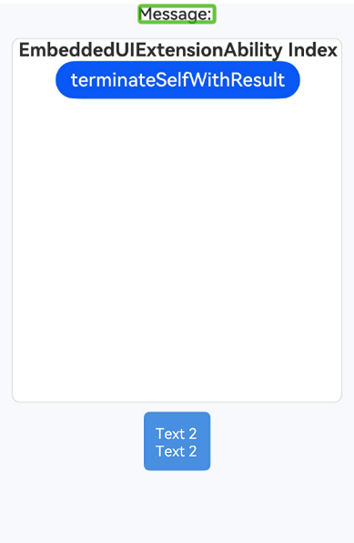

# Accessibility

You can set accessibility attributes and events for components to fully leverage accessibility features.

>  **NOTE**
>
>  The initial APIs of this module are supported since API version 10. Updates will be marked with a superscript to indicate their earliest API version.

## accessibilityGroup

accessibilityGroup(value: boolean)

Sets whether to enable accessibility grouping. When accessibility grouping is enabled, the component and all its children are treated as a single selectable unit, and the accessibility service will no longer focus on the individual child components.

If accessibility grouping is enabled for a component that does not contain a universal text attribute or an [accessibility text](#accessibilitytext) attribute, the system will concatenate the universal text attributes of its child components to generate merged text for the component. Child components without universal text attributes will be ignored during concatenation, and their accessibility text (if any) won't be used in the merged text.

**Widget capability**: This API can be used in ArkTS widgets since API version 12.

**Atomic service API**: This API can be used in atomic services since API version 11.

**System capability**: SystemCapability.ArkUI.ArkUI.Full

**Parameters**

| Name| Type   | Mandatory| Description                                                        |
| ------ | ------- | ---- | ------------------------------------------------------------ |
| value  | boolean | Yes  | Whether to enable accessibility grouping. The value **true** means to enable accessibility grouping, and **false** means the opposite. When accessibility grouping is enabled, the component and all its children are treated as a single selectable unit, and the accessibility service will no longer focus on the individual child components.<br>Default value: **false**|

## accessibilityGroup<sup>14+</sup>

accessibilityGroup(isGroup: boolean, accessibilityOptions: AccessibilityOptions)

Sets whether to enable accessibility grouping. When accessibility grouping is enabled, the component and all its children are treated as a single selectable unit, and the accessibility service will no longer focus on the individual child components.

If accessibility grouping is enabled for a component that does not contain a universal text attribute or an [accessibility text](#accessibilitytext) attribute, the system will concatenate the universal text attributes of its child components to generate merged text for the component. Child components without universal text attributes will be ignored during concatenation.

When **accessibilityPreferred** is set to **true**, the system will prioritize concatenating the accessibility text attributes of the child components. If a child component has no accessibility text set, its universal text attribute will be used instead. Components without either attribute will be excluded from concatenation.

**Widget capability**: This API can be used in ArkTS widgets since API version 14.

**Atomic service API**: This API can be used in atomic services since API version 14.

**System capability**: SystemCapability.ArkUI.ArkUI.Full

**Parameters**

| Name              | Type                                                   | Mandatory| Description                                                        |
| -------------------- | ------------------------------------------------------- | ---- | ------------------------------------------------------------ |
| isGroup              | boolean                                                 | Yes  | Whether to enable accessibility grouping. The value **true** means to enable accessibility grouping, and **false** means the opposite. When accessibility grouping is enabled, the component and all its children are treated as a single selectable unit, and the accessibility service will no longer focus on the individual child components.<br>Default value: **false**|
| accessibilityOptions | [AccessibilityOptions](#accessibilityoptions14) | Yes  | Options for accessibility grouping. When **accessibilityPreferred** is set to **true**, the system will prioritize concatenating accessibility text for screen readers. When **accessibilityPreferred** is set to **false**, accessibility text will not be prioritized.<br>Default value: **false**           |

## AccessibilityOptions<sup>14+</sup>

**System capability**: SystemCapability.ArkUI.ArkUI.Full

| Name                  | Type   | Mandatory| Description                                                        |
| ---------------------- | ------- | ---- | ------------------------------------------------------------ |
| accessibilityPreferred | boolean | No  | Whether to prioritize the accessibility text of child components during a deep traversal. The value **true** means to prioritize the accessibility text of child components.<br>If a child component's accessibility text is empty, the accessibility service uses the component's own text content. The concatenated text is then assigned to the parent node if both its accessibility text and text content are empty.<br>The value **false** means not to prioritize the accessibility text of child components.<br>Default value: **false**|

## accessibilityText

accessibilityText(value: string)

Sets the accessibility text. When a component does not contain a text attribute, you can use this API to set an accessibility text attribute, so that accessibility services can announce the specified content for the component.

**Widget capability**: This API can be used in ArkTS widgets since API version 12.

**Atomic service API**: This API can be used in atomic services since API version 11.

**System capability**: SystemCapability.ArkUI.ArkUI.Full

**Parameters**

| Name| Type  | Mandatory| Description                                                        |
| ------ | ------ | ---- | ------------------------------------------------------------ |
| value  | string | Yes  | Accessibility text. If a component does not contain text information, it will not be announced by the screen reader when selected. In this case, the screen reader user cannot know which component is selected. To solve this problem, you can set accessibility text for components without text information. When such a component is selected, the screen reader announces the specified accessibility text, informing the user which component is selected.<br>Default value: **""**<br>**NOTE**<br>If a component has both text content and accessibility text, only the accessibility text is announced.<br>If a component is grouped for accessibility purposes but lacks both text content and accessibility text, the screen reader will concatenate text from its child components (depth-first traversal).<br>To prioritize accessibility text concatenation, set **accessibilityPreferred** in **accessibilityGroup**.|

## accessibilityText<sup>12+</sup>

accessibilityText(text: Resource)

Sets the accessibility text, with support for resource references using **Resource**. When a component does not contain a text attribute, you can use this API to set an accessibility text attribute, so that accessibility services can announce the specified content for the component.

**Widget capability**: This API can be used in ArkTS widgets since API version 12.

**Atomic service API**: This API can be used in atomic services since API version 12.

**System capability**: SystemCapability.ArkUI.ArkUI.Full

**Parameters**

| Name| Type  | Mandatory| Description                                                                                                                                                                                                                                                                  |
| ------ | ------ | ---- |----------------------------------------------------------------------------------------------------------------------------------------------------------------------------------------------------------------------------------------------------------------------|
| text  | [Resource](ts-types.md#resource) | Yes  | Reference resource of accessibility text. If a component does not contain text information, it will not be announced by the screen reader when selected. In this case, the screen reader user cannot know which component is selected. To solve this problem, you can set accessibility text for components without text information. When such a component is selected, the screen reader announces the specified accessibility text, informing the user which component is selected.<br>**NOTE**<br>If a component has both text content and accessibility text, only the accessibility text is announced.<br>If a component is grouped for accessibility purposes but lacks both text content and accessibility text, the screen reader will concatenate text from its child components (depth-first traversal).<br>To prioritize accessibility text concatenation, set **accessibilityPreferred** in **accessibilityGroup**.|


## accessibilityDescription

accessibilityDescription(value: string)

Sets the accessibility description. This property provides additional context or explanation for the component, helping users understand the action or function it performs.

**Widget capability**: This API can be used in ArkTS widgets since API version 12.

**Atomic service API**: This API can be used in atomic services since API version 11.

**System capability**: SystemCapability.ArkUI.ArkUI.Full

**Parameters**

| Name| Type  | Mandatory| Description                                                        |
| ------ | ------ | ---- | ------------------------------------------------------------ |
| value  | string | Yes  | Accessibility description. You can specify further explanation of the current component, for example, possible operation consequences, especially those that cannot be learned from component attributes and accessibility text. If a component contains both text information and the accessibility description, the text is read first and then the accessibility description, when the component is selected.<br>Default value: **""**|

## accessibilityDescription<sup>12+</sup>

accessibilityDescription(description: Resource)

Sets the accessibility description, with support for resource references using **Resource**. This property provides additional context or explanation for the component, helping users understand the action or function it performs.

**Widget capability**: This API can be used in ArkTS widgets since API version 12.

**Atomic service API**: This API can be used in atomic services since API version 12.

**System capability**: SystemCapability.ArkUI.ArkUI.Full

**Parameters**

| Name| Type  | Mandatory| Description                                                                                                                                                                                   |
| ------ | ------ | ---- |---------------------------------------------------------------------------------------------------------------------------------------------------------------------------------------|
| description  | [Resource](ts-types.md#resource) | Yes  | Reference resource of the accessibility description. You can specify further explanation of the current component, for example, possible operation consequences, especially those that cannot be learned from component attributes and accessibility text. If a component contains both text information and the accessibility description, the text is read first and then the accessibility description, when the component is selected.|

## accessibilityLevel

accessibilityLevel(value: string)

Sets the accessibility level. This property determines whether the component can be recognized by accessibility services.

**Widget capability**: This API can be used in ArkTS widgets since API version 12.

**Atomic service API**: This API can be used in atomic services since API version 11.

**System capability**: SystemCapability.ArkUI.ArkUI.Full

**Parameters**

| Name| Type  | Mandatory| Description                                                        |
| ------ | ------ | ---- | ------------------------------------------------------------ |
| value  | string | Yes  | Accessibility level, which is used to decide whether a component can be identified by the accessibility service.<br>The options are as follows:<br>**"auto"**: The component's recognizability is determined by the accessibility grouping service and ArkUI.<br>**"yes"**: The component can be recognized by accessibility services.<br>**"no"**: The component cannot be recognized by accessibility services.<br>**"no-hide-descendants"**: Neither the component nor its child components can be recognized by accessibility services.<br>Default value: **"auto"**<br>**NOTE**<br>When accessibilityLevel is set to **"auto"**, the component's recognizability depends on the following factors:<br>1. The accessibility service internally determines whether the component can be recognized.<br>2. If the parent component's **accessibilityGroup** property has **isGroup** set to **true**, the accessibility service will not focus on its child components, making them unrecognizable.<br>3. If the parent component's **accessibilityLevel** is set to **"no-hide-descendants"**, the component will not be recognized by accessibility services.|

## accessibilityVirtualNode<sup>11+</sup>

accessibilityVirtualNode(builder: CustomBuilder)

Sets an accessibility virtual child node. For custom drawing components, a **CustomBuilder** is passed, which is used to provide accessibility information. The components within the **CustomBuilder** are only used for layout and not for display. When the accessibility service obtains node information, it returns the node information from the **CustomBuilder**.

**Widget capability**: This API can be used in ArkTS widgets since API version 12.

**Atomic service API**: This API can be used in atomic services since API version 11.

**System capability**: SystemCapability.ArkUI.ArkUI.Full

**Parameters**

| Name| Type  | Mandatory| Description                                                        |
| ------ | ------ | ---- | ------------------------------------------------------------ |
| builder  | [CustomBuilder](ts-types.md#custombuilder8) | Yes  | Accessibility virtual node, which enables you to pass in a custom builder to the self-drawing component. The components in the custom builder are only laid out but not displayed at the backend. When the accessibility application obtains the accessibility node information, the node information in the custom builder is returned.|

## accessibilityChecked<sup>13+</sup>

accessibilityChecked(isCheck: boolean)

Sets the checked state of the accessibility component. This property is used in multiselect scenarios.

**Widget capability**: This API can be used in ArkTS widgets since API version 13.

**Atomic service API**: This API can be used in atomic services since API version 13.

**System capability**: SystemCapability.ArkUI.ArkUI.Full

**Parameters**

| Name | Type   | Mandatory| Description                                                        |
| ------- | ------- | ---- | ------------------------------------------------------------ |
| isCheck | boolean | Yes  | Whether the current component is selected.<br>The options are as follows:<br>**true**: The component is selected.<br>**false**: The component is not selected.<br>**undefined**: The component determines its own selected state.<br>Default value: **undefined**.<br>**NOTE**<br>1. Setting this parameter to **true** or **false** will automatically set the component's **checkable** attribute to **true**.<br>2. When this parameter is set to **true** or **false**, to use it with **accessibilitySelected**, set the **accessibilitySelected** parameter to **undefined**.|

## accessibilitySelected<sup>13+</sup>

accessibilitySelected(isSelect: boolean)

Sets the selected state of the accessibility component. This property is used in single-select scenarios.

**Widget capability**: This API can be used in ArkTS widgets since API version 13.

**Atomic service API**: This API can be used in atomic services since API version 13.

**System capability**: SystemCapability.ArkUI.ArkUI.Full

**Parameters**

| Name  | Type   | Mandatory| Description                                                        |
| -------- | ------- | ---- | ------------------------------------------------------------ |
| isSelect | boolean | Yes  | Whether the current component is selected.<br>The options are as follows:<br>**true**: The component is selected.<br>**false**: The component is not selected.<br>**undefined**: The component determines its own selected state.<br>Default value: **undefined**.<br>**NOTE**<br>1. When this parameter is set to **true** or **false**, to use it with **accessibilityChecked**, set the **accessibilityChecked** parameter to **undefined**.|

## accessibilityRole<sup>18+</sup>

accessibilityRole(role: AccessibilityRoleType)

Sets the role type of the accessibility component, which affects how the component is announced by screen readers.

**Widget capability**: This API can be used in ArkTS widgets since API version 18.

**Atomic service API**: This API can be used in atomic services since API version 18.

**System capability**: SystemCapability.ArkUI.ArkUI.Full

**Parameters**

| Name  | Type   | Mandatory| Description                                                        |
| -------- | ------- | ---- | ------------------------------------------------------------ |
| role | [AccessibilityRoleType](ts-universal-attributes-accessibility.md#accessibilityroletype18) | Yes  | Role of the component as announced by screen readers (for example, button or chart). You can define custom roles.|

## AccessibilityRoleType<sup>18+</sup>

Enumerates the component role types used by screen readers.

**Atomic service API**: This API can be used in atomic services since API version 18.

**System capability**: SystemCapability.ArkUI.ArkUI.Full

| Name| Value | Description            |
| ---- | ---- | ------------------ |
| ACTION_SHEET | 0 | Action sheet.|
| ALERT_DIALOG | 1 | Alert dialog box.|
| INDEXER_COMPONENT | 2 | Indexer component.|
| BADGE_COMPONENT | 3 | Badge component.|
| BLANK  | 4 | Blank placeholder component.|
| BUTTON | 5 | Button.|
| BACK_BUTTON | 6 | Back button on a large image page.|
| SHEET_DRAG_BAR | 7 | Drag bar for sheets.|
| CALENDAR_PICKER | 8 | Calendar picker.|
| CALENDAR | 9 | Calendar.|
| CANVAS | 10 | Canvas component.|
| CANVAS_GRADIENT | 11 | Gradient object.|
| CANVAS_PATTERN | 12 | Pattern for image filling based on a specified source image and repetition mode.|
| CHECKBOX | 13 | Check box component.|
| CHECKBOX_GROUP | 14 | Check box group.|
| CIRCLE | 15 | Component for drawing circles.|
| COLUMN_SPLIT | 16 | Vertical layout of child components with horizontal dividers.|
| COLUMN | 17 | Container that lays out child components vertically.|
| CANVAS_RENDERING_CONTEXT_2D | 18 | 2D drawing object, which can be used to draw rectangles, images, and texts on the canvas component.|
| CHART | 19 | Chart component.|
| COUNTER | 20 | Counter component.|
| CONTAINER_MODAL | 21 | Modal container.|
| DATA_PANEL | 22 | Data panel component.|
| DATE_PICKER | 23 | Date picker.|
| DIALOG | 24 | Dialog box.|
| DIVIDER | 25 | Divider component.|
| DRAG_BAR | 26 | Drag bar.|
| EFFECT_COMPONENT | 27 | Container component for special effects.|
| ELLIPSE | 28 | Ellipse drawing component.|
| FLEX | 29 | Container that allows for flexible layout of child components.|
| FLOW_ITEM | 30 | Child component of a waterfall layout container.|
| FORM_COMPONENT | 31 | Widget component.|
| FORM_LINK | 32 | Static widget interaction component.|
| GAUGE | 33 | Gauge component.|
| GRID | 34 | Grid container.|
| GRID_COL | 35 | Grid column component.|
| GRID_CONTAINER | 36 | Grid container that lays out child components vertically.|
| GRID_ITEM | 37 | Single-item container within a grid container.|
| GRID_ROW | 38 | Grid row component.|
| HYPERLINK | 39 | Hyperlink component.|
| IMAGE | 40 | Image component|
| IMAGE_ANIMATOR | 41 | Frame animation component.|
| IMAGE_BITMAP | 42 | Pixel data for canvas rendering.|
| IMAGE_DATA | 43 | Pixel data for canvas rendering.|
| IMAGE_SPAN | 44 | Component used to display inline images.|
| LABEL | 45 | Label.|
| LINE | 46 | Line.|
| LIST | 47 | List.|
| LIST_ITEM | 48 | Specific item in a list.|
| LIST_ITEM_GROUP | 49 | List item group.|
| LOADING_PROGRESS | 50 | Component for display loading animations.|
| MARQUEE | 51 | Marquee component.|
| MATRIX2D | 52 | 2D matrix object.|
| MENU | 53 | Menu.|
| MENU_ITEM | 54 | Menu item.|
| MENU_ITEM_GROUP | 55 | Menu item group.|
| NAV_DESTINATION | 56 | Content area of the **Navigation** component.|
| NAV_ROUTER | 57 | Navigation component.|
| NAVIGATION | 58 | Root view container for navigation routing.|
| NAVIGATION_BAR | 59 | Navigation bar.|
| NAVIGATION_MENU | 60 | Navigation menu.|
| NAVIGATOR | 61 | Navigation container component.|
| OFFSCREEN_CANVAS | 62 | Canvas for custom drawing of graphics.|
| OFFSCREEN_CANVAS_RENDERING_CONTEXT2D | 63 | 2D drawing object, which can be used to draw rectangles, images, and texts on a canvas component.|
| OPTION | 64 | Specific item.|
| PANEL | 65 | Slidable panel.|
| PAPER_PAGE | 66 | Page.|
| PATH | 67 | Path drawing component.|
| PATH2D | 68 | Path object.|
| PATTERN_LOCK | 69 | Pattern lock component.|
| PICKER | 70 | Picker.|
| PICKER_VIEW | 71 | Picker view.|
| PLUGIN_COMPONENT | 72 | Plugin component.|
| POLYGON | 73 | Component used to draw a polygon.|
| POLYLINE | 74 | Component used to draw a polyline.|
| POPUP | 75 | Popup with a specific style.|
| PROGRESS | 76 | Text download button.|
| QRCODE | 77 | QR code.|
| RADIO | 78 | Radio button.|
| RATING | 79 | Component for selecting a rating within a given range.|
| RECT | 80 | Component used to draw a rectangle.|
| REFRESH | 81 | Pull-to-refresh container component.|
| RELATIVE_CONTAINER | 82 | Relative layout component.|
| REMOTE_WINDOW | 83 | Remote control window component.|
| RICH_EDITOR | 84 | Component that supports rich text editing and interactive text editing.|
| RICH_TEXT | 85 | Rich text component.|
| ROLE_PAGER | 86 | Pagination component.|
| ROW | 87 | Container that lays out child components horizontally.|
| ROW_SPLIT | 88 | Horizontal layout of child components with vertical dividers.|
| SCROLL | 89 | Scrollable container component.|
| SCROLL_BAR | 90 | Scrollbar.|
| SEARCH | 91 | Search box component.|
| SEARCH_FIELD | 92 | Search box.|
| SELECT | 93 | Drop-down list component.|
| SHAPE | 94 | Parent component of the drawing components.|
| SIDEBAR_CONTAINER | 95 | Sidebar container that can show and hide the sidebar.|
| SLIDER | 96 | Vertical slider.|
| SPAN | 97 | Component used to display inline text.|
| STACK | 98 | Stack container.|
| STEPPER | 99 | Stepper component.|
| STEPPER_ITEM | 100 | Page child component of the stepper component.|
| SWIPER | 101 | Swiper view container.|
| SWIPER_INDICATOR | 102 | Navigation indicator for the **Swiper** component.|
| SWITCH | 103 | Switch.|
| SYMBOL_GLYPH | 104 | Component for displaying a symbol glyph.|
| TAB_CONTENT | 105 | Content view for a tab in the **Tabs** component.|
| TAB_BAR | 106 | Tab bar.|
| TABS | 107 | Container that allows users to switch between content views through tabs.|
| TEXT | 108 | Text.|
| TEXT_CLOCK | 109 | Text clock component.|
| TEXT_ENTRY | 110 | Text input.|
| TEXT_INPUT | 111 | Text box component.|
| TEXT_PICKER | 112 | Text picker.|
| TEXT_TIMER | 113 | Component that displays timing information and is controlled in text format.|
| TEXT_AREA | 114 | Text area component.|
| TEXT_FIELD | 115 | Text box.|
| TIME_PICKER | 116 | Time picker.|
| TITLE_BAR | 117 | Title bar.|
| TOGGLER | 118 | Status component.|
| UI_EXTENSION_COMPONENT | 119 | UI extension component.|
| VIDEO | 120 | Component for playing video files and controlling playback.|
| WATER_FLOW | 121 | Waterfall layout container.|
| WEB | 122 | Component for loading web pages.|
| XCOMPONENT | 123 | Custom rendering component.|
| ROLE_NONE | 124 | Null.|

## accessibilityNextFocusId<sup>18+</sup>

accessibilityNextFocusId(nextId: string)

Sets the next focus target for the component during focus traversal.

**Widget capability**: This API can be used in ArkTS widgets since API version 18.

**Atomic service API**: This API can be used in atomic services since API version 18.

**System capability**: SystemCapability.ArkUI.ArkUI.Full

**Parameters**

| Name| Type  | Mandatory| Description                                                        |
| ------ | ------ | ---- | ------------------------------------------------------------ |
| nextId | string | Yes  | [Unique ID](ts-universal-attributes-component-id.md#id) of the next component to receive focus. If the ID does not correspond to any component, the setting is invalid.|

## accessibilityDefaultFocus<sup>18+</sup>

accessibilityDefaultFocus(focus: boolean)

Sets whether the component is the default initial focus for screen readers on the current page.

**Widget capability**: This API can be used in ArkTS widgets since API version 18.

**Atomic service API**: This API can be used in atomic services since API version 18.

**System capability**: SystemCapability.ArkUI.ArkUI.Full

**Parameters**

| Name| Type   | Mandatory| Description                                                        |
| ------ | ------- | ---- | ------------------------------------------------------------ |
| focus  | boolean | Yes  | Whether the component is the default initial focus for screen readers on the current page. The value **true** means the component is the default initial focus for screen readers on the current page. Other values are invalid.|

## accessibilityUseSamePage<sup>18+</sup>

accessibilityUseSamePage(pageMode: AccessibilitySamePageMode)

Solves focus jumping issues in sub-tree scenarios for cross-process embedded components, such as **UIExtensionComponent**. Focus jumping occurs when the timing of page events from the embedded component's process conflicts with those of the host application, causing focus to unexpectedly shift between components.

**Widget capability**: This API can be used in ArkTS widgets since API version 18.

**Atomic service API**: This API can be used in atomic services since API version 18.

**System capability**: SystemCapability.ArkUI.ArkUI.Full

**Parameters**

| Name  | Type                                                        | Mandatory| Description                                            |
| -------- | ------------------------------------------------------------ | ---- | ------------------------------------------------ |
| pageMode | [AccessibilitySamePageMode](#accessibilitysamepagemode18) | Yes  | Same-page mode for the cross-process embedded component and the host application.|

## AccessibilitySamePageMode<sup>18+</sup>

Enumerates the same-page modes for cross-process embedded components and their host applications.

**Atomic service API**: This API can be used in atomic services since API version 18.

**System capability**: SystemCapability.ArkUI.ArkUI.Full

| Name       | Value  | Description                                                        |
| ----------- | ---- | ------------------------------------------------------------ |
| SEMI_SILENT | 0    | Ignores initial page loading events and root node page events from the cross-process embedded component.|
| FULL_SILENT | 1    | Ignores all page events from the cross-process embedded component.                                     |

## accessibilityScrollTriggerable<sup>18+</sup>

accessibilityScrollTriggerable(isTriggerable: boolean)

Sets whether to enable automatic scrolling for screen readers when the current page has no focusable components.

**Widget capability**: This API can be used in ArkTS widgets since API version 18.

**Atomic service API**: This API can be used in atomic services since API version 18.

**System capability**: SystemCapability.ArkUI.ArkUI.Full

**Parameters**

| Name        |  Type   | Mandatory| Description                                                        |
| -------------- | ------- | ---- | ------------------------------------------------------------ |
| isTriggerable  | boolean | Yes  | Whether the component supports automatic scrolling for screen readers when the current page has no focusable components.<br>The options are as follows:<br>**true**: The component triggers automatic scrolling for screen readers when the current page has no focusable components.<br>**false**: The component does not trigger automatic scrolling for screen readers when the current page has no focusable components.<br>**undefined**: The default settings are restored.<br>Default value: **true**<br>**NOTE**<br>1. This parameter does not affect the original **scrollable** attribute of the component.<br>2. The final scrolling behavior is determined by the screen reader based on this parameter and whether the component supports scrolling.<br>3. This API applies to all basic components. It is recommended for scrollable components, including **List**, **Grid**, **Scroll**, and **WaterFlow**.|

## accessibilityTextHint<sup>12+</sup>

accessibilityTextHint(value: string)

Sets the text hint for the component, which can be queried by accessibility services.

**Widget capability**: This API can be used in ArkTS widgets since API version 12.

**Atomic service API**: This API can be used in atomic services since API version 12.

**System capability**: SystemCapability.ArkUI.ArkUI.Full

**Parameters**

| Name        |  Type   | Mandatory| Description                                                        |
| -------------- | ------- | ---- | ------------------------------------------------------------ |
| value  | string | Yes  | Text hint for the component, which can be queried by accessibility services.|

## accessibilityFocusDrawLevel<sup>19+</sup>

accessibilityFocusDrawLevel(drawLevel: FocusDrawLevel)

Sets the drawing level for the accessibility focus highlight frame.

> **NOTE**
>
> 1. By default, the accessibility focus highlight frame is drawn at the same level as the focused component. This can sometimes result in the frame being obscured or clipped by parent components or siblings with higher z-order.
>
> 2. Setting the drawing level to the topmost layer ensures that the accessibility focus highlight frame is not obscured by other components. This is useful when you want the highlight frame to be clearly visible at all times. However, this setting may not be suitable if you need to interact with components that should overlay the currently focused component and you do not want the accessibility highlight to be visible.


**Widget capability**: This API can be used in ArkTS widgets since API version 19.

**Atomic service API**: This API can be used in atomic services since API version 19.

**System capability**: SystemCapability.ArkUI.ArkUI.Full

**Parameters**

| Name  | Type   | Mandatory| Description                                                        |
| -------- | ------- | ---- | ------------------------------------------------------------ |
| drawLevel | [FocusDrawLevel](ts-appendix-enums.md#focusdrawlevel19) | Yes  | Drawing level for the accessibility focus highlight frame.|

## Example

### Example 1: Setting Accessibility Text and Description

This example demonstrates how to use **accessibilityText** and **accessibilityDescription** to customize the content announced by screen readers.

```ts
// xxx.ets
@Entry
@Component
struct Index {

  @Builder customAccessibilityNode() {
    Column() {
      Text(`virtual node`)
    }
    .width(10)
    .height(10)
  }

  build() {
    Row() {
      Column() {
        Text("Text 1")
          .fontSize(50)
          .fontWeight(FontWeight.Bold)
        Text("Text 2")
          .fontSize(50)
          .fontWeight(FontWeight.Bold)
      }
      .width('100%')
      .accessibilityGroup(true)
      .accessibilityLevel("yes")
      .accessibilityText("Group") // If a component has both text content and accessibility text, only the accessibility text is announced.
      .accessibilityDescription("The Column component can be selected, and the announced content is 'Group'")
      .accessibilityVirtualNode(this.customAccessibilityNode)
      .accessibilityChecked(true)
      .accessibilitySelected(undefined)
    }
    .height('100%')
  }
}
```

### Example 2: Setting the Accessibility Group

This example shows how to use **accessibilityGroup** to prioritize reading the accessibility text of child components.

```ts
// xxx.ets
@Entry
@Component
struct Focus {
  build() {
    Column({ space: 10 }) {
      Text('123456')
        .focusable(true)
        .borderRadius(5)
        .accessibilityText("Accessibility text is announced if both accessibility text and text content are present")
        .accessibilityLevel("yes")
      Button().accessibilityLevel("yes").accessibilityText("Accessibility text is announced if no text is present")
      Button("Text content is announced if no accessibility text is present").accessibilityLevel("yes")
      Button()
      Button('btn123').accessibilityText("Button with both accessibility text and text").accessibilityLevel("yes")
      Button('btn123').accessibilityLevel("yes")
    }
    .accessibilityGroup(true, { accessibilityPreferred: true })
    .borderWidth(5)
    .width('100%')
    .height('100%')
  }
}
```

### Example 3: Setting the Initial Focus and the Next Focus of a Component

This example demonstrates the use of **accessibilityDefaultFocus** to set the default initial focus for the screen reader on the current page and **accessibilityNextFocusId** to set the next focus for components during focus traversal.

```ts
// xxx.ets
@Entry
@Component
struct Index {
  build() {
    Column({ space: 20 }) {
      Text('Text Demo 1')
        .fontSize(50)
        .accessibilityLevel('yes')
        .accessibilityNextFocusId('text3')
      Text('Text Demo 2')
        .id('text2')
        .fontSize(50)
        .accessibilityLevel('yes')
        .accessibilityDefaultFocus(true)  // Set the component as initial focus for the screen reader.
        .accessibilityNextFocusId('text4')
      Text('Text Demo 3')
        .id('text3')
        .fontSize(50)
        .accessibilityLevel('yes')
        .accessibilityNextFocusId('text2')
      Text('Text Demo 4')
        .id('text4')
        .fontSize(50)
        .accessibilityLevel('yes')
    }
    .height('100%')
    .width('100%')
  }
}
```

### Example 4: Setting the Accessibility Component Type and Text Hint

This example demonstrates the use of **accessibilityRole** to set the accessibility component type and **accessibilityTextHint** to provide text hints for components that can be queried by assistive technologies.

```ts
// xxx.ets
@Entry
@Component
struct Index {
  @State isDownloading: boolean = false;
  @State hintStr: string = 'Click to start download';

  build() {
    Column({ space: 20 }) {
      Button(this.isDownloading ? 'Downloading' : 'Click to download')
        .accessibilityLevel('yes')
        .accessibilityTextHint(this.hintStr)
        .onClick(() => {
          this.isDownloading = !this.isDownloading;
          this.hintStr = this.isDownloading ? 'Status changed to downloading' : 'Status changed to paused';
        })
      TextInput({ placeholder: 'Enter phone number' })
        .accessibilityLevel('yes')
        .accessibilityTextHint('Enter an 11-digit phone number')
        .width('80%')
      Text('Announced as button type')
        .accessibilityLevel('yes')
        .accessibilityRole(AccessibilityRoleType.BUTTON)
        .accessibilityTextHint('The screen reader will announce this component as a button')
        .fontSize(30)
    }
    .height('100%')
    .width('100%')
  }
}
```

### Example 5: Configuring Screen Reader Scrolling, Focus Highlight Frame, and Cross-Process Focus

This example demonstrates the use of **accessibilityScrollTriggerable** to set whether an accessibility node supports screen reading scroll, **accessibilityFocusDrawLevel** to set the drawing level of the accessibility focus highlight frame, and **accessibilityUseSamePage** for cross-process embedded components like **EmbeddedComponent**.

```ts
// xxx.ets
import { Want } from '@kit.AbilityKit';

@Entry
@Component
struct Index {
  @State message: string = 'Message: ';
  private want: Want = {
    bundleName: 'com.example.embeddeddemo',
    abilityName: 'ExampleEmbeddedAbility',
  }

  build() {
    Row() {
      List() {
        ListItem() {
          Column() {
            Text(this.message)
              .fontSize(18)
              .fontColor('#2D2D2D')
              .fontWeight(FontWeight.Medium)
            Column() {
              EmbeddedComponent(this.want, EmbeddedType.EMBEDDED_UI_EXTENSION)
                .width('100%')
                .height('90%')
                .onTerminated((info) => {
                  this.message = 'Termination: code = ' + info.code + ', want = ' + JSON.stringify(info.want);
                })
                .onError((error) => {
                  this.message = 'Error: code = ' + error.code;
                })
                .accessibilityUseSamePage(AccessibilitySamePageMode.FULL_SILENT)
                .width('90%')
                .height('50%')
                .backgroundColor('#F0F0F0')
                .borderRadius(8)
                .borderWidth(1)
                .borderColor('#D9D9D9')

              Stack() {
                Column() {
                  Text('Text 1')
                    .fontSize(18)
                    .fontColor('#2D2D2D')
                    .fontWeight(FontWeight.Medium)
                  Text('Text 1')
                    .fontSize(18)
                    .fontColor('#2D2D2D')
                    .fontWeight(FontWeight.Medium)
                    .accessibilityFocusDrawLevel(FocusDrawLevel.TOP)
                }
                .padding({ top: 8, bottom: 8 })

                Column() {
                  Text('Text 2')
                    .fontSize(18)
                    .fontColor('#FFFFFF')
                    .fontWeight(FontWeight.Medium)
                  Text('Text 2')
                    .fontSize(18)
                    .fontColor('#FFFFFF')
                    .fontWeight(FontWeight.Medium)
                }
                .backgroundColor('#4A90E2')
                .padding({
                  left: 12,
                  right: 12,
                  top: 10,
                  bottom: 10
                })
                .borderRadius(6)
              }
              .width('100%')
              .margin({ top: 10, bottom: 10 })
            }
            .width('100%')
            .height('100%')
            .margin({ top: 15 })
            .accessibilityText($r('app.string.app_name'))
            .accessibilityDescription($r('app.string.module_desc'))
            Column() {
              Text('Text 4')
                .fontSize(18)
                .fontWeight(FontWeight.Medium)
            }
            .margin({ top: 15 })
          }
          .width('100%')
        }
      }
      .accessibilityScrollTriggerable(false)
      .width('100%')
    }
    .height('100%')
    .backgroundColor('#F7F9FC')
  }
}
```


