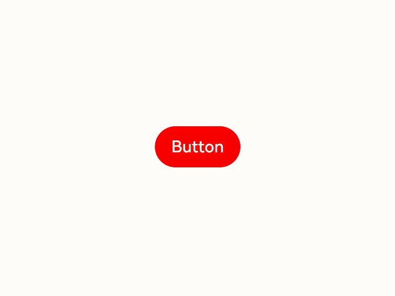

# Attribute Modifier

With the attribute modifier, you can dynamically set component attributes, complete with the **if/else** syntax and polymorphic style.

>  **NOTE**
>
>  This feature is supported since API version 11. Updates will be marked with a superscript to indicate their earliest API version.
>
> Ensure that the attributes set in **attributeModifier** are different from those set in other methods. Otherwise, **attributeModifier** does not take effect when the page is refreshed.
>
> **attributeModifier** does not support custom components.

## attributeModifier

attributeModifier(modifier: AttributeModifier\<T>)

Creates an attribute modifier.

**Atomic service API**: This API can be used in atomic services since API version 12.

**System capability**: SystemCapability.ArkUI.ArkUI.Full

**Parameters**

| Name  | Type                                        | Mandatory| Description                                                                                                                            |
| -------- | -------------------------------------------- | ---- | -------------------------------------------------------------------------------------------------------------------------------- |
| modifier | [AttributeModifier\<T>](#attributemodifiert) | Yes  | Modifier for dynamically setting attributes on the current component. The **if/else** syntax is supported.<br>**modifier**: attribute modifier. You need a custom class to implement the **AttributeModifier** API.|

## AttributeModifier\<T>

You need a custom class to implement the **AttributeModifier** API.

**Atomic service API**: This API can be used in atomic services since API version 12.

**System capability**: SystemCapability.ArkUI.ArkUI.Full

>  **NOTE**
>
>  In the following APIs, setting the same value or object for the same attribute of the **instance** object will not trigger an update.

### applyNormalAttribute
applyNormalAttribute(instance: T) : void

Applies the style of a component in the normal state.

**Atomic service API**: This API can be used in atomic services since API version 12.

**System capability**: SystemCapability.ArkUI.ArkUI.Full

### applyPressedAttribute
applyPressedAttribute(instance: T) : void

Applies the style of a component in the pressed state.

**Atomic service API**: This API can be used in atomic services since API version 12.

**System capability**: SystemCapability.ArkUI.ArkUI.Full

### applyFocusedAttribute
applyFocusedAttribute(instance: T) : void

Applies the style of a component in the focused state.

**Atomic service API**: This API can be used in atomic services since API version 12.

**System capability**: SystemCapability.ArkUI.ArkUI.Full

### applyDisabledAttribute
applyDisabledAttribute(instance: T) : void

Applies the style of a component in the disabled state.

**Atomic service API**: This API can be used in atomic services since API version 12.

**System capability**: SystemCapability.ArkUI.ArkUI.Full

### applySelectedAttribute
applySelectedAttribute(instance: T) : void

Applies the style of a component in the selected state.

In the preceding APIs, **instance** indicates the component type. You can customize these APIs and use them with the **if/else **syntax.

**Atomic service API**: This API can be used in atomic services since API version 12.

**System capability**: SystemCapability.ArkUI.ArkUI.Full

**Parameters**

| Name    | Description                                                                                                        |
| -------- | ------------------------------------------------------------------------------------------------------------ |
| instance | Component attribute class, which identifies the type of component to which attributes will be applied, for example, **ButtonAttribute** for the **Button** component and **TextAttribute** for the **Text** component.|

**Value range of the instance parameter**

AlphabetIndexerAttribute, BadgeAttribute, BlankAttribute, ButtonAttribute, CalendarPickerAttribute, CanvasAttribute, CheckboxAttribute, CheckboxGroupAttribute, CircleAttribute, ColumnAttribute, ColumnSplitAttribute, ShapeAttribute, CommonAttribute, CounterAttribute, DataPanelAttribute, DatePickerAttribute, DividerAttribute, EllipseAttribute, FlexAttribute, FlowItemAttribute, FormLinkAttribute, GaugeAttribute, GridAttribute, GridColAttribute, ColumnAttribute, GridItemAttribute, GridRowAttribute, HyperlinkAttribute, IndicatorComponentAttribute, ImageAttribute, ImageAnimatorAttribute, ImageSpanAttribute, LineAttribute, LinearIndicatorAttribute, ListAttribute, ListItemAttribute, ListItemGroupAttribute, LoadingProgressAttribute, MarqueeAttribute, MenuAttribute, MenuItemAttribute, MenuItemGroupAttribute, NavDestinationAttribute, NavigationAttribute, NavigatorAttribute, NavRouterAttribute, PanelAttribute, PathAttribute, PatternLockAttribute, PolygonAttribute, PolylineAttribute, ProgressAttribute, QRCodeAttribute, RadioAttribute, RatingAttribute, RectAttribute, RefreshAttribute, RelativeContainerAttribute, RichEditorAttribute, RichTextAttribute, RowAttribute, RowSplitAttribute, ScrollAttribute, ScrollBarAttribute, SearchAttribute, SelectAttribute, ShapeAttribute, SideBarContainerAttribute, SliderAttribute, SpanAttribute, StackAttribute, StepperAttribute, StepperItemAttribute, SwiperAttribute, SymbolGlyphAttribute, TabContentAttribute, TabsAttribute, TextAttribute, TextAreaAttribute, TextClockAttribute, TextInputAttribute, TextPickerAttribute, TextTimerAttribute, TimePickerAttribute, ToggleAttribute, VideoAttribute, WaterFlowAttribute, XComponentAttribute, ParticleAttribute<!--Del-->, EffectComponentAttribute, FormComponentAttribute, PluginComponentAttribute, RemoteWindowAttribute, UIExtensionComponentAttribute<!--DelEnd-->

**Supported attributes**

1. Attributes that accept or return a [CustomBuilder](ts-types.md#custombuilder8) are not supported.
2. Attributes that accept a [modifier](../../../ui/arkts-user-defined-modifier.md) type, such as [attributeModifier](#attributemodifier), [drawModifier](./ts-universal-attributes-draw-modifier.md), and [gestureModifier](./ts-universal-attributes-gesture-modifier.md), are not supported.
3. Attribute related to [animation](./ts-animatorproperty.md) are not supported.
4. Attributes of the [gesture](../../../ui/arkts-gesture-events-binding.md) type are not supported.
5. Attribute related to [stateStyles](./ts-universal-attributes-polymorphic-style.md) are not supported.
6. Deprecated attributes are not supported.
<!--Del-->
7. Built-in component attributes are not supported.<!--DelEnd-->

When unsupported or unimplemented attributes are used, exceptions such as "Method not implemented.", "is not callable", or "Builder is not supported." are thrown. The specific scope of supported attributes is the same as the base class attribute API. For details, see [Supported Scope of Attributes](#supported-scope-of-attributes).

## Custom Modifier
Custom modifiers can be used in building components and configuring attributes since API version 12. Through the custom modifiers, you can call the attribute and style APIs of encapsulated components.

**Supported custom modifiers** 

CommonModifier, ColumnModifier, ColumnSplitModifier, RowModifier, RowSplitModifier, SideBarContainerModifier, BlankModifier, DividerModifier, GridColModifier, GridRowModifier, NavDestinationModifier, NavigatorModifier, StackModifier, NavigationModifier, NavRouterModifier, StepperItemModifier, TabsModifier, GridModifier, GridItemModifier, ListModifier, ListItemModifier, ListItemGroupModifier, ScrollModifier, SwiperModifier, WaterFlowModifier, ButtonModifier, CounterModifier, TextPickerModifier, TimePickerModifier, ToggleModifier, CalendarPickerModifier, CheckboxModifier, CheckboxGroupModifier, DatePickerModifier, RadioModifier, RatingModifier, SelectModifier, SliderModifier, PatternLockModifier, SpanModifier, RichEditorModifier, RefreshModifier, SearchModifier, TextAreaModifier, TextModifier, TextInputModifier, ImageSpanModifier, ImageAnimatorModifier, ImageModifier, VideoModifier, DataPanelModifier, GaugeModifier, LoadingProgressModifier, MarqueeModifier, ProgressModifier, QRCodeModifier, TextClockModifier, TextTimerModifier, LineModifier, PathModifier, PolygonModifier, PolylineModifier, RectModifier, ShapeModifier, AlphabetIndexerModifier, FormComponentModifier, HyperlinkModifier, MenuModifier, MenuItemModifier, PanelModifier, SymbolGlyphModifier, ParticleModifier 
**CommonModifier** can be used for unexposed components.

**Precautions**
1. When a custom modifier is applied to a component, the corresponding attribute of the component takes effect. 
2. Updating the attribute value of a custom modifier changes the corresponding attribute of the component to which the modifier is applied. The custom modifier is a base class, and the constructed object is a child class object. When using the object, use **as** to assert the type as a child class. 
3. With a custom modifier applied to two components, updating the attribute value of the custom modifier changes the corresponding attributes of both components. 
4. If attributes A and B are set through a custom modifier, and then attributes C and D are set through other means, all the four attributes take effect on the component. 
5. The custom modifier does not support change observation for @State decorated variables. For details, see Example 2. 
6. If you use **attributeModifier** to set attributes multiple times, all the set attributes take effect, and those attributes that are set multiple times take effect based on the configuration sequence.  

## Example
### Example 1: Switching the Background Color with a Modifier

This example demonstrates how to switch the background color of a **Button** component by binding it to a modifier.

```ts
// xxx.ets
class MyButtonModifier implements AttributeModifier<ButtonAttribute> {
  isDark: boolean = false

  applyNormalAttribute(instance: ButtonAttribute): void {
    if (this.isDark) {
      instance.backgroundColor(Color.Black)
    } else {
      instance.backgroundColor(Color.Red)
    }
  }
}

@Entry
@Component
struct attributeDemo {
  @State modifier: MyButtonModifier = new MyButtonModifier()

  build() {
    Row() {
      Column() {
        Button("Button")
          .attributeModifier(this.modifier)
          .onClick(() => {
            this.modifier.isDark = !this.modifier.isDark
          })
      }
      .width('100%')
    }
    .height('100%')
  }
}
```


### Example 2: Implementing the Pressed State Effect with a Modifier

This example demonstrates how to implement a pressed state effect for a **Button** component by binding it to a modifier. For details about how to use the attribute modifier with state management V2, see [Modifier and makeObserved](../../../quick-start/arkts-v1-v2-migration.md#modifier).

```ts
// xxx.ets
class MyButtonModifier implements AttributeModifier<ButtonAttribute> {
  applyNormalAttribute(instance: ButtonAttribute): void {
    instance.backgroundColor(Color.Black)
  }

  applyPressedAttribute(instance: ButtonAttribute): void {
    instance.backgroundColor(Color.Red)
  }
}

@Entry
@Component
struct attributePressedDemo {
  @State modifier: MyButtonModifier = new MyButtonModifier()

  build() {
    Row() {
      Column() {
        Button("Button")
          .attributeModifier(this.modifier)
      }
      .width('100%')
    }
    .height('100%')
  }
}
```


### Example 3: Understanding Custom Modifiers Do Not Support State Data Changes

This example shows how to set the width of a custom modifier using state data. Custom modifiers do not support observing changes in data decorated with the @State decorator. Therefore, the width does not change when the button is clicked.

```ts
import { CommonModifier } from "@kit.ArkUI"

const TEST_TAG : string = "AttributeModifier";
class MyModifier extends CommonModifier {
  applyNormalAttribute(instance: CommonAttribute): void {
    super.applyNormalAttribute?.(instance);
  }
}

@Component
struct MyImage1 {
  @Link modifier: CommonModifier

  build() {
    Image($r("app.media.startIcon")).attributeModifier(this.modifier as MyModifier)
  }
}

@Entry
@Component
struct Index {
  index: number = 0;
  @State width1: number = 100;
  @State height1: number = 100;
  @State myModifier: CommonModifier = new MyModifier().width(this.width1).height(this.height1).margin(10)

  build() {
    Column() {
      Button($r("app.string.EntryAbility_label"))
        .margin(10)
        .onClick(() => {
          console.log(TEST_TAG, "onClick")
          this.index++;
          if (this.index % 2 === 1) {
            this.width1 = 10;
            console.log(TEST_TAG, "setGroup1")
          } else {
            this.width1 = 10;
            console.log(TEST_TAG, "setGroup2")
          }
        })
      MyImage1({ modifier: this.myModifier })
    }
    .width('100%')
  }
}
```


### Example 4: Combining Modifier and Custom Modifier Attributes

In this example, the custom modifier sets the **width** and **height** attributes, and the **borderStyle** and **borderWidth** attributes are set through a button click. In this case, all the four attributes take effect when the button is clicked.

```ts
import { CommonModifier } from "@kit.ArkUI"

const TEST_TAG: string = "AttributeModifier";

class MyModifier extends CommonModifier {
  applyNormalAttribute(instance: CommonAttribute): void {
    super.applyNormalAttribute?.(instance);
  }

  public setGroup1(): void {
    this.borderStyle(BorderStyle.Dotted)
    this.borderWidth(8)
  }

  public setGroup2(): void {
    this.borderStyle(BorderStyle.Dashed)
    this.borderWidth(8)
  }
}

@Component
struct MyImage1 {
  @Link modifier: CommonModifier

  build() {
    Image($r("app.media.startIcon")).attributeModifier(this.modifier as MyModifier)
  }
}

@Entry
@Component
struct Index {
  @State myModifier: CommonModifier = new MyModifier().width(100).height(100).margin(10)
  index: number = 0;

  build() {
    Column() {
      Button($r("app.string.EntryAbility_label"))
        .margin(10)
        .onClick(() => {
          console.log(TEST_TAG, "onClick")
          this.index++;
          if (this.index % 2 === 1) {
            (this.myModifier as MyModifier).setGroup1()
            console.log(TEST_TAG, "setGroup1")
          } else {
            (this.myModifier as MyModifier).setGroup2()
            console.log(TEST_TAG, "setGroup2")
          }
        })
      MyImage1({ modifier: this.myModifier })
    }
    .width('100%')
  }
}
```


## Supported Scope of Attributes

Attributes not listed in the table below are supported by default.

**Table 1** Unsupported attributes in the CommonAttribute API

| Attribute                    | Supported/Unsupported| Error Message                 | Remarks                                     |
| ------------------------ | -------- | ------------------------- | ----------------------------------------- |
| accessibilityChecked     | Not supported  | is not callable           | -                                         |
| accessibilitySelected    | Not supported  | is not callable           | -                                         |
| accessibilityTextHint    | Not supported  | is not callable           | -                                         |
| accessibilityVirtualNode | Not supported  | is not callable           | Attributes that accept a CustomBuilder are not supported.              |
| animation                | Not supported  | Method not implemented.   | Animation-related attributes are not supported.                |
| attributeModifier        | Not supported  | -                         | **attributeModifier** does not take effect when nested.|
| background               | Not supported  | Method not implemented.   | Attributes that accept a CustomBuilder are not supported.              |
| backgroundFilter         | Not supported  | is not callable           | -                                         |
| bindContentCover         | Not supported  | Method not implemented.   | Attributes that accept a CustomBuilder are not supported.              |
| bindContextMenu          | Not supported  | Method not implemented.   | Attributes that accept a CustomBuilder are not supported.              |
| bindPopup                | Not supported  | Method not implemented.   | Attributes that accept a CustomBuilder are not supported.              |
| bindSheet                | Not supported  | Method not implemented.   | Attributes that accept a CustomBuilder are not supported.              |
| chainWeight              | Not supported  | is not callable           | -                                         |
| compositingFilter        | Not supported  | is not callable           | -                                         |
| drawModifier             | Not supported  | is not callable           | Modifier-related attributes are not supported.               |
| foregroundFilter         | Not supported  | is not callable           | -                                         |
| freeze                   | Not supported  | is not callable           | -                                         |
| gesture                  | Not supported  | Method not implemented.   | Gesture-related attributes are not supported.                |
| gestureModifier          | Not supported  | is not callable           | Modifier-related attributes are not supported.               |
| onAccessibilityHover     | Not supported  | is not callable           | -                                         |
| onChildTouchTest         | Not supported  | is not callable           | -                                         |
| onDragStart              | Not supported  | Method not implemented.   | Attributes that return a CustomBuilder are not supported.            |
| onPreDrag                | Not supported  | Method not implemented.   | -                                         |
| onTouchIntercept         | Not supported  | is not callable           | -                                         |
| onVisibleAreaChange      | Not supported  | Method not implemented.   | -                                         |
| parallelGesture          | Not supported  | Method not implemented.   | Gesture-related attributes are not supported.                |
| priorityGesture          | Not supported  | Method not implemented.   | Gesture-related attributes are not supported.                |
| reuseId                  | Not supported  | Method not implemented.   | -                                         |
| stateStyles              | Not supported  | Method not implemented.   | **stateStyles**-related attributes are not supported.            |
| useSizeType              | Not supported  | Method not implemented.   | Deprecated attributes are not supported.                       |
| visualEffect             | Not supported  | is not callable           | -                                         |
| bindMenu                 | Partially supported| -                         | Attributes that accept a CustomBuilder are not supported.              |
| dragPreview              | Partially supported| Builder is not supported. | Attributes that accept a CustomBuilder are not supported.              |
