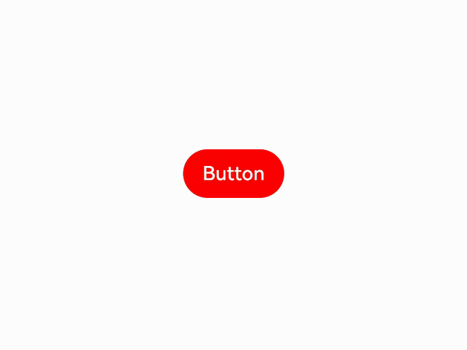
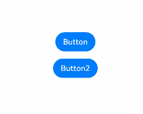
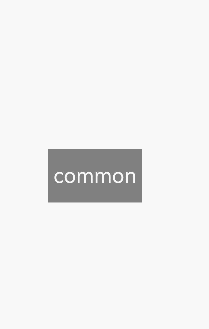
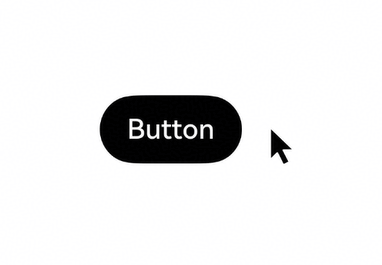

# Attribute Modifier

<!--Kit: ArkUI-->
<!--Subsystem: ArkUI-->
<!--Owner: @sunbees-->
<!--Designer: @sunbees-->
<!--Tester: @khq-->
<!--Adviser: @Brilliantry_Rui-->
<!-- md-trans-meta sourceCommit=bc9b7fc5f14ac723bec5875199abd5d577b47509 translatedAt=2026-08-18T03:11:43.114Z pushedAt=2026-08-18T11:15:28.236Z -->

Dynamically sets component attributes, allowing you to use the **if/else** syntax during attribute setting and apply polymorphic styles as needed. It is suitable for scenarios where styles need to be switched dynamically based on component states (such as pressed, focused, disabled, selected, and hovered), improving the flexibility of style management and code reuse.

> **NOTE**
>
> - This feature is supported since API version 11. Updates will be marked with a superscript to indicate their earliest API version.
>
> - The APIs of this module can be used only in the Stage model.
>
> - Avoid setting the same attributes through **attributeModifier** and other methods, as this may prevent **attributeModifier** from taking effect when the page is refreshed.
>
> - For simple scenarios where only a single component attribute needs to be set based on a condition, you can use the [ternary expression](../../../ui/state-management/arkts-declarative-ui-description.md#configuring-attributes) (for example, **.width(isFullScreen ? 200 : 100**)).
>
> - Since API version 20, **attributeModifier** supports custom components.
>
> - If a component is in multiple states at the same time and the same attribute is set in each state, the final effective style follows this priority: hover state &lt; pressed state &lt; focused state &lt; disabled state &lt; selected state. For example, if a component is in both the hover state and the pressed state, and the background color is set in both states, the background color of the pressed state takes effect.

## attributeModifier

attributeModifier(modifier: AttributeModifier\<T>): T

Creates an attribute modifier.

**Atomic service API**: This API can be used in atomic services since API version 12.

**System capability**: SystemCapability.ArkUI.ArkUI.Full

**Parameters**

| Name  | Type                                        | Mandatory| Description                                                                                                                            |
| -------- | -------------------------------------------- | ---- | -------------------------------------------------------------------------------------------------------------------------------- |
| modifier | [AttributeModifier\<T>](#attributemodifiert) | Yes | Dynamically sets attribute methods on the current component, and supports the use of if/else syntax.<br>**modifier**: attribute modifier. You need to customize a class to implement the **AttributeModifier** API. |

**Return value**

| Type| Description|
| --- | --- |
| T | Current component.|

## AttributeModifier\<T>

You need a custom class to implement the **AttributeModifier** API.

**Atomic service API**: This API can be used in atomic services since API version 12.

**System capability**: SystemCapability.ArkUI.ArkUI.Full

> **NOTE**
>
> In the following APIs, setting the same value or object for the same attribute of the **instance** object will not trigger an update.

### applyNormalAttribute

applyNormalAttribute?(instance: T): void

Applies the style of a component in the normal state.

**Atomic service API**: This API can be used in atomic services since API version 12.

**System capability**: SystemCapability.ArkUI.ArkUI.Full

**Parameters**

| Name   | Type  | Mandatory  | Description                                                                                                        |
| -------- | ------- | ------ | ------------------------------------------------------------------------------------------------------------ |
| instance | T       | Yes     | Attribute class of the component, used to identify the component type for attribute setting, for example, the [attribute](ts-basic-components-button.md#attributes) (**ButtonAttribute**) of the [Button](ts-basic-components-button.md) component and the [attribute](ts-basic-components-text.md#attributes) (**TextAttribute**) of the [Text](ts-basic-components-text.md) component. For details about the values, see [Attribute Type Support Scope](#attribute-type-support-scope). |

### applyPressedAttribute

applyPressedAttribute?(instance: T): void

Applies the style of a component in the pressed state. For implementation examples, see [Example 2: Implementing the Pressed State Effect with a Modifier](#example-2-implementing-the-pressed-state-effect-with-a-modifier) and [Example 8: Implementing the Pressed State Effect for a Custom Component with a Modifier](#example-8-implementing-the-pressed-state-effect-for-a-custom-component-with-a-modifier).

**Atomic service API**: This API can be used in atomic services since API version 12.

**System capability**: SystemCapability.ArkUI.ArkUI.Full

**Parameters**

| Name   | Type  | Mandatory  | Description                                                                                                        |
| -------- | ------- | ------ | ------------------------------------------------------------------------------------------------------------ |
| instance | T | Yes | Attribute class of the component, used to identify the type of the component for which attributes are set, for example, the [attribute](ts-basic-components-button.md#attributes) (**ButtonAttribute**) of the [Button](ts-basic-components-button.md) component, the [attribute](ts-basic-components-text.md#attributes) (**TextAttribute**) of the [Text](ts-basic-components-text.md) component, and so on. For details about the values, see [Attribute Type Support Scope](#attribute-type-support-scope). |

### applyFocusedAttribute

applyFocusedAttribute?(instance: T): void

Applies the style of a component in the focused state. For the implementation example, see [Example 5: Setting the Focused State Style with a Modifier](#example-5-setting-the-focused-state-style-with-a-modifier).

**Atomic service API**: This API can be used in atomic services since API version 12.

**System capability**: SystemCapability.ArkUI.ArkUI.Full

**Parameters**

| Name   | Type  | Mandatory  | Description                                                                                                        |
| -------- | ------- | ------ | ------------------------------------------------------------------------------------------------------------ |
| instance | T | Yes | Attribute class of the component, used to identify the component type for attribute setting. For example, the [attributes](ts-basic-components-button.md#attributes) of the [Button](ts-basic-components-button.md) component (**ButtonAttribute**), the [attributes](ts-basic-components-text.md#attributes) of the [Text](ts-basic-components-text.md) component (**TextAttribute**), and so on. For details about the values, see [Attribute Type Support Scope](#attribute-type-support-scope). |

### applyDisabledAttribute

applyDisabledAttribute?(instance: T): void

Style of a component in the disabled state. See [Example 6: Setting the Disabled State Style with a Modifier](#example-6-setting-the-disabled-state-style-with-a-modifier).

**Atomic service API**: This API can be used in atomic services since API version 12.

**System capability**: SystemCapability.ArkUI.ArkUI.Full

**Parameters**

| Name   | Type  | Mandatory  | Description                                                                                                        |
| -------- | ------- | ------ | ------------------------------------------------------------------------------------------------------------ |
| instance | T | Yes | Attribute class of the component, used to identify the component type for attribute setting, for example, the [attribute](ts-basic-components-button.md#attributes) (**ButtonAttribute**) of the [Button](ts-basic-components-button.md) component, the [attribute](ts-basic-components-text.md#attributes) (**TextAttribute**) of the [Text](ts-basic-components-text.md) component, and so on. For details, see [Attribute Type Support Scope](#attribute-type-support-scope). |

### applySelectedAttribute

applySelectedAttribute?(instance: T): void

Applies the style of a component in the selected state.

You can customize the implementation of the preceding callback methods as needed, identify the component type through the passed-in parameter, set attributes on the instance, and use the **if/else** syntax for dynamic setting. See [Example 7: Setting the Selected State Style with a Modifier](#example-7-setting-the-selected-state-style-with-a-modifier).

**Atomic service API**: This API can be used in atomic services since API version 12.

**System capability**: SystemCapability.ArkUI.ArkUI.Full

**Parameters**

| Name   | Type  | Mandatory  | Description                                                                                                        |
| -------- | ------- | ------ | ------------------------------------------------------------------------------------------------------------ |
| instance | T | Mandatory | Attribute class of the component, used to identify the component type for attribute setting, for example, the [attribute](ts-basic-components-button.md#attributes) (**ButtonAttribute**) of the [Button](ts-basic-components-button.md) component, the [attribute](ts-basic-components-text.md#attributes) (**TextAttribute**) of the [Text](ts-basic-components-text.md) component, and so on. For details, see [Attribute Type Support Scope](#attribute-type-support-scope). |

### applyHoveredAttribute

applyHoveredAttribute?(instance: T): void

Defines the style of a component in the hover state. See [Example 9: Implementing the Mouse Hover Effect with a Modifier](#example-9-implementing-the-mouse-hover-effect-with-a-modifier).

**Since:** 26.0.0

**Atomic service API:** This API can be used in atomic services since API version 26.0.0.

**System capability**: SystemCapability.ArkUI.ArkUI.Full

**Parameters**

| Name    | Type   | Mandatory   | Description                                                                                                         |
| -------- | ------- | ------ | ------------------------------------------------------------------------------------------------------------ |
| instance | T       | Yes     | Attribute class of the component, used to identify the type of the component on which attributes are set, for example, the [attributes](ts-basic-components-button.md#attributes) of the [Button](ts-basic-components-button.md) component (**ButtonAttribute**), the [attributes](ts-basic-components-text.md#attributes) of the [Text](ts-basic-components-text.md) component (**TextAttribute**), and so on. For details about the value range, see [Attribute Type Support Scope](#attribute-type-support-scope). |

### Attribute Type Support Scope

| Name | Description |
| ----------------- | --------------- |
| AlphabetIndexerAttribute | [Attributes](ts-container-alphabet-indexer.md#attributes) of AlphabetIndexer. |
| BadgeAttribute | [Attributes](ts-container-badge.md#attributes) of Badge. |
| BlankAttribute | [Attributes](ts-basic-components-blank.md#attributes) of Blank. |
| ButtonAttribute | [Attributes](ts-basic-components-button.md#attributes) of Button. |
| CalendarPickerAttribute | [Attributes](ts-basic-components-calendarpicker.md#attributes) of CalendarPicker. |
| CanvasAttribute | [Attributes](ts-components-canvas-canvas.md#attributes) of Canvas. |
| CheckboxAttribute | [Attributes](ts-basic-components-checkbox.md#attributes) of Checkbox. |
| CheckboxGroupAttribute | [Attributes](ts-basic-components-checkboxgroup.md#attributes) of CheckboxGroup. |
| CircleAttribute | [Attributes](ts-drawing-components-circle.md#attributes) of Circle. |
| ColumnAttribute | [Attributes](ts-container-column.md#attributes) of Column. |
| ColumnSplitAttribute | [Attributes](ts-container-columnsplit.md#attributes) of ColumnSplit. |
| CommonAttribute | [Attributes](ts-component-general-attributes.md) of Common. |
| CounterAttribute | [Attributes](ts-container-counter.md#attributes) of Counter. |
| DataPanelAttribute | [Attributes](ts-basic-components-datapanel.md#attributes) of DataPanel. |
| DatePickerAttribute | [Attributes](ts-basic-components-datepicker.md#attributes) of DatePicker. |
| DividerAttribute | [Attributes](ts-basic-components-divider.md#attributes) of Divider. |
| EllipseAttribute | [Attributes](ts-drawing-components-ellipse.md#attributes) of Ellipse. |
| FlexAttribute | [Attributes](ts-container-flex.md#attributes) of Flex. |
| FlowItemAttribute | [Attributes](ts-container-flowitem.md#attributes) of FlowItem. |
| FormLinkAttribute | [Attributes](ts-container-formlink.md#attributes) of FormLink. |
| GaugeAttribute | [Attributes](ts-basic-components-gauge.md#attributes) of Gauge. |
| GridAttribute | [Attributes](ts-container-grid.md#attributes) of Grid. |
| GridColAttribute | [Attributes](ts-container-gridcol.md#attributes) of GridCol. |
| GridItemAttribute | [Attributes](ts-container-griditem.md#attributes) of GridItem. |
| GridRowAttribute | [Attributes](ts-container-gridrow.md#attributes) of GridRow. |
| HyperlinkAttribute | [Attributes](ts-container-hyperlink.md#attributes) of Hyperlink. |
| IndicatorComponentAttribute | [Attributes](ts-swiper-components-indicator.md#attributes) of IndicatorComponent. |
| ImageAttribute | [Attributes](ts-basic-components-image.md#attributes) of Image. |
| ImageAnimatorAttribute | [Attributes](ts-basic-components-imageanimator.md#attributes) of ImageAnimator. |
| ImageSpanAttribute | [Attributes](ts-basic-components-imagespan.md#attributes) of ImageSpan. |
| ContainerSpanAttribute | [Attributes](ts-basic-components-containerspan.md#attributes) of ContainerSpan. |
| LineAttribute | [Attributes](ts-drawing-components-line.md#attributes) of Line. |
| ListAttribute | [Attributes](ts-container-list.md#attributes) of List. |
| ListItemAttribute | [Attributes](ts-container-listitem.md#attributes) of ListItem. |
| ListItemGroupAttribute | [Attributes](ts-container-listitemgroup.md#attributes) of ListItemGroup. |
| LoadingProgressAttribute | [Attributes](ts-basic-components-loadingprogress.md#attributes) of LoadingProgress. |
| MarqueeAttribute | [Attributes](ts-basic-components-marquee.md#attributes) of Marquee. |
| MenuAttribute | [Attributes](ts-basic-components-menu.md#attributes) of Menu. |
| MenuItemAttribute | [Attributes](ts-basic-components-menuitem.md#attributes) of MenuItem. |
| MenuItemGroupAttribute | Attributes of [MenuItemGroup](ts-basic-components-menuitemgroup.md). |
| NavDestinationAttribute | [Attributes](ts-basic-components-navdestination.md#attributes) of NavDestination. |
| NavigationAttribute | [Attributes](ts-basic-components-navigation.md#attributes) of Navigation. |
| NavigatorAttribute | [Attributes](ts-container-navigator.md#attributes) of Navigator. |
| NavRouterAttribute | [Attributes](ts-basic-components-navrouter.md#attributes) of NavRouter. |
| PanelAttribute | [Attributes](ts-container-panel.md#attributes) of Panel. |
| PathAttribute | [Attributes](ts-drawing-components-path.md#attributes) of Path. |
| PatternLockAttribute | [Attributes](ts-basic-components-patternlock.md#attributes) of PatternLock. |
| PolygonAttribute | [Attributes](ts-drawing-components-polygon.md#attributes) of Polygon. |
| PolylineAttribute | [Attributes](ts-drawing-components-polyline.md#attributes) of Polyline. |
| ProgressAttribute | [Attributes](ts-basic-components-progress.md#attributes) of Progress. |
| QRCodeAttribute | [Attributes](ts-basic-components-qrcode.md#attributes) of QRCode. |
| RadioAttribute | [Attributes](ts-basic-components-radio.md#attributes) of Radio. |
| RatingAttribute | [Attributes](ts-basic-components-rating.md#attributes) of Rating. |
| RectAttribute | [Attributes](ts-drawing-components-rect.md#attributes) of Rect. |
| RefreshAttribute | [Attributes](ts-container-refresh.md#attributes) of Refresh. |
| RelativeContainerAttribute | [Attributes](ts-container-relativecontainer.md#attributes) of RelativeContainer. |
| RichEditorAttribute | [Attributes](ts-basic-components-richeditor.md#attributes) of RichEditor. |
| RichTextAttribute | [Attributes](ts-basic-components-richtext.md#attributes) of RichText. |
| RowAttribute | [Attributes](ts-container-row.md#attributes) of Row. |
| RowSplitAttribute | [Attributes](ts-container-rowsplit.md#attributes) of RowSplit. |
| ScrollAttribute | [Attributes](ts-container-scroll.md#attributes) of Scroll. |
| ScrollBarAttribute | [Attributes](ts-basic-components-scrollbar.md#attributes) of ScrollBar. |
| SearchAttribute | [Attributes](ts-basic-components-search.md#attributes) of Search. |
| SelectAttribute | [Attributes](ts-basic-components-select.md#attributes) of Select. |
| ShapeAttribute | [Attributes](ts-drawing-components-shape.md#attributes) of Shape. |
| SideBarContainerAttribute | [Attributes](ts-container-sidebarcontainer.md#attributes) of SideBarContainer. |
| SliderAttribute | [Attributes](ts-basic-components-slider.md#attributes) of Slider. |
| SpanAttribute | [Attributes](ts-basic-components-span.md#attributes) of Span. |
| SymbolSpanAttribute | [Attributes](ts-basic-components-symbolSpan.md#attributes) of SymbolSpan. |
| StackAttribute | [Attributes](ts-container-stack.md#attributes) of Stack. |
| StepperAttribute | [Attributes](ts-basic-components-stepper.md#attributes) of Stepper. |
| StepperItemAttribute | [Attributes](ts-basic-components-stepperitem.md#attributes) of StepperItem. |
| SwiperAttribute | [Attributes](ts-container-swiper.md#attributes) of Swiper. |
| SymbolGlyphAttribute | [Attributes](ts-basic-components-symbolGlyph.md#attributes) of SymbolGlyph. |
| TabContentAttribute | [Attributes](ts-container-tabcontent.md#attributes) of TabContent. |
| TabsAttribute | [Attributes](ts-container-tabs.md#attributes) of Tabs. |
| TextAttribute | [Attributes](ts-basic-components-text.md#attributes) of Text. |
| TextAreaAttribute | [Attributes](ts-basic-components-textarea.md#attributes) of TextArea. |
| TextClockAttribute | [Attributes](ts-basic-components-textclock.md#attributes) of TextClock. |
| TextInputAttribute | [Attributes](ts-basic-components-textinput.md#attributes) of TextInput. |
| TextPickerAttribute | [Attributes](ts-basic-components-textpicker.md#attributes) of TextPicker. |
| TextTimerAttribute | [Attributes](ts-basic-components-texttimer.md#attributes) of TextTimer. |
| TimePickerAttribute | [Attributes](ts-basic-components-timepicker.md#attributes) of TimePicker. |
| ToggleAttribute | [Attributes](ts-basic-components-toggle.md#attributes) of Toggle. |
| VideoAttribute | [Attributes](ts-media-components-video.md#attributes) of Video. |
| WaterFlowAttribute | [Attributes](ts-container-waterflow.md#attributes) of WaterFlow. |
| XComponentAttribute | [Attributes](ts-basic-components-xcomponent.md#attributes) of XComponent. |
| ParticleAttribute | [Attributes](ts-particle-animation.md#attributes) of Particle. |
| UIPickerComponentAttribute<sup>22+</sup> | [Attributes](ts-container-ui-picker-component.md#attributes) of UIPickerComponent. |
| <!--DelRow-->EffectComponentAttribute | [Attributes](ts-container-effectcomponent-sys.md#attributes) of EffectComponent. |
| <!--DelRow-->FormComponentAttribute | [Attributes](ts-basic-components-formcomponent-sys.md#attributes) of FormComponent. |
| <!--DelRow-->PluginComponentAttribute | [Attributes](ts-basic-components-plugincomponent-sys.md#attributes) of PluginComponent. |
| <!--DelRow-->RemoteWindowAttribute | [Attributes](ts-basic-components-remotewindow-sys.md#attributes) of RemoteWindow. |
| UIExtensionComponentAttribute | [Properties](../js-apis-arkui-uiExtension.md#properties) of UIExtensionComponent. |
| ContainerReaderAttribute | [Attributes](../arkui-ts/ts-container-containerreader.md#attributes) of ContainerReader.<br>**Since:** 26.0.0|

> **NOTE**
>
> - **StepperAttribute** is supported since API version 11 and deprecated since API version 22. You are advised to use SwiperAttribute instead.
> - **StepperItemAttribute** is supported since API version 11 and deprecated since API version 22. You are advised to use **SwiperAttribute** instead.
> - **NavigatorAttribute** is supported since API version 11 and deprecated since API version 20. You are advised to use **NavigationAttribute** instead.
> - **NavRouterAttribute** is supported since API version 11 and deprecated since API version 20. You are advised to use NavigationAttribute instead.
> - **PanelAttribute** is supported since API version 11 and deprecated since API version 20. You are advised to use the universal attribute **bindSheet** instead.

**Supported attributes**

1. Attributes that accept or return a [CustomBuilder](ts-types.md#custombuilder8) are not supported.

2. Attributes whose input parameter is of the [modifier](../../../ui/arkts-user-defined-modifier.md) type are not supported, specifically the following attribute methods: [attributeModifier](#attributemodifier), [drawModifier](./ts-universal-attributes-draw-modifier.md#drawmodifier), and [gestureModifier](./ts-universal-attributes-gesture-modifier.md#gesturemodifier).

3. Attributes related to [animation](./ts-animatorproperty.md) are not supported.

4. Attributes of the [gesture](../../../ui/arkts-gesture-events-binding.md) type are not supported.

5. The [stateStyles](./ts-universal-attributes-polymorphic-style.md#statestyles) attribute is not supported.

6. Deprecated attributes are not supported.

   <!--Del-->

7. Built-in component attributes are not supported.<!--DelEnd-->

When unsupported or unimplemented attributes are used, exceptions such as "Method not implemented.", "is not callable", or "Builder is not supported." are thrown. For details about the supported scope of modifiers, see [attributeModifier Support for Attributes and Events](../../../ui/arkts-user-defined-extension-attributeModifier.md#attributemodifier-support-for-attributes-and-events).

## Custom Modifier

Since API version 12, developers can use a custom modifier to build components and configure attributes. Through this custom modifier, the attribute and style APIs of the encapsulated component can be called. It is suitable for scenarios where component attribute configurations need to be encapsulated and reused, simplifying component style management and improving code reuse.

**Supported custom modifiers** 

| Name | Description |
| ----------------- | --------------- |
| CommonModifier | Modifier corresponding to universal attributes |
| ColumnModifier | - |
| ColumnSplitModifier | - |
| RowModifier | - |
| RowSplitModifier | - |
| SideBarContainerModifier | - |
| BlankModifier | - |
| DividerModifier | - |
| GridColModifier | - |
| GridRowModifier | - |
| NavDestinationModifier | - |
| NavigatorModifier | - |
| StackModifier | - |
| NavigationModifier | - |
| NavRouterModifier | - |
| StepperItemModifier | - |
| StepperModifier<sup>20+</sup> | - |
| TabsModifier | - |
| GridModifier | - |
| GridItemModifier | - |
| ListModifier | - |
| ListItemModifier | - |
| ListItemGroupModifier | - |
| ScrollModifier | - |
| SwiperModifier | - |
| WaterFlowModifier | - |
| ButtonModifier | - |
| CounterModifier | - |
| TextPickerModifier | - |
| TimePickerModifier | - |
| ToggleModifier | - |
| CalendarPickerModifier | - |
| CheckboxModifier | - |
| CheckboxGroupModifier | - |
| DatePickerModifier | - |
| RadioModifier | - |
| RatingModifier | - |
| SelectModifier | - |
| SliderModifier | - |
| PatternLockModifier | - |
| SpanModifier | - |
| SymbolSpanModifier | - |
| ContainerSpanModifier | - |
| RichEditorModifier | - |
| RefreshModifier | - |
| SearchModifier | - |
| TextAreaModifier | - |
| TextModifier | - |
| TextInputModifier | - |
| ImageSpanModifier | - |
| ImageAnimatorModifier | - |
| ImageModifier | - |
| VideoModifier | - |
| DataPanelModifier | - |
| GaugeModifier | - |
| LoadingProgressModifier | - |
| MarqueeModifier | - |
| ProgressModifier | - |
| QRCodeModifier | - |
| TextClockModifier | - |
| TextTimerModifier | - |
| LineModifier | - |
| PathModifier | - |
| PolygonModifier | - |
| PolylineModifier | - |
| RectModifier | - |
| ShapeModifier | - |
| AlphabetIndexerModifier | - |
| FormComponentModifier | - |
| HyperlinkModifier | - |
| MenuModifier | - |
| MenuItemModifier | - |
| PanelModifier | - |
| SymbolGlyphModifier | - |
| ParticleModifier | - |
| UIPickerComponentModifier<sup>22+</sup> | - |
| ContainerReaderModifier| **Since:** 26.0.0 |

**CommonModifier** can be used for unexposed components.

> **NOTE**
>
> - **StepperModifier** is supported since API version 20 and deprecated since API version 22. You are advised to use [SwiperModifier](#custom-modifier) instead.
> - **StepperItemModifier** is supported since API version 12 and deprecated since API version 22. You are advised to use [SwiperModifier](#custom-modifier) instead.
> - **NavigatorModifier** is supported since API version 12 and deprecated since API version 20. You are advised to use [NavigationModifier](#custom-modifier) instead.
> - **NavRouterModifier** is supported since API version 12 and deprecated since API version 20. You are advised to use [NavigationModifier](#custom-modifier) instead.
> - **PanelModifier** is supported since API version 12 and deprecated since API version 20. You are advised to use the universal attribute **bindSheet** instead.

**Precautions**

1. When a custom modifier is applied to a component, the corresponding attribute of the component takes effect. 

2. Updating the attribute value of a custom modifier changes the corresponding attribute of the component to which the modifier is applied. The custom modifier is a base class, and the constructed object is a child class object. When using the object, use **as** to assert the type as a child class. 

3. With a custom modifier applied to two components, updating the attribute value of the custom modifier changes the corresponding attributes of both components. 

4. If attributes A and B are set through a custom modifier, and then attributes C and D are set through other means, all the four attributes take effect on the component. 

5. Custom modifiers do not support observing changes in data decorated with the @State decorator. See [Example 3: Understanding Custom Modifiers Do Not Support State Data Changes](#example-3-understanding-custom-modifiers-do-not-support-state-data-changes).  

6. When attributes are set through **attributeModifier** multiple times, the effective attributes are the union of all the set attributes, and for the same attribute, the value set last takes effect.

## Example

### Example 1: Switching the Background Color with a Modifier

This example demonstrates how to switch the background color of a **Button** component by binding it to a modifier.

```ts
// xxx.ets
// Set the custom AttributeModifier for the Button component attributes.
class MyButtonModifier implements AttributeModifier<ButtonAttribute> {
  public isDark: boolean = false;

  applyNormalAttribute(instance: ButtonAttribute): void {
    if (this.isDark) {
      instance.backgroundColor(Color.Black);
    } else {
      instance.backgroundColor(Color.Red);
    }
  }
}

@Entry
@Component
struct AttributeDemo {
  @State modifier: MyButtonModifier = new MyButtonModifier();

  build() {
    Row() {
      Column() {
        Button('Button')
          .attributeModifier(this.modifier)
          .onClick(() => {
            this.modifier.isDark = !this.modifier.isDark;
          })
      }
      .width('100%')
    }
    .height('100%')
  }
}
```



### Example 2: Implementing the Pressed State Effect with a Modifier

This example implements the pressed state effect by binding a modifier to a Button. For details about using it with state management V2, see [Modifier and makeObserved](../../../ui/state-management/arkts-v1-v2-migration-inner-object.md#modifier).

```ts
// xxx.ets
// Set the custom AttributeModifier for the Button component attributes.
class MyButtonModifier implements AttributeModifier<ButtonAttribute> {
  applyNormalAttribute(instance: ButtonAttribute): void {
    instance.backgroundColor(Color.Black);
  }

  applyPressedAttribute(instance: ButtonAttribute): void {
    instance.backgroundColor(Color.Red);
  }
}

@Entry
@Component
struct AttributePressedDemo {
  @State modifier: MyButtonModifier = new MyButtonModifier();

  build() {
    Row() {
      Column() {
        Button('Button')
          .attributeModifier(this.modifier)
      }
      .width('100%')
    }
    .height('100%')
  }
}
```


### Example 3: Understanding Custom Modifiers Do Not Support State Data Changes

This example shows how to set the width of a custom modifier using state data. Custom modifiers do not support observing changes in data decorated with the @State decorator. Therefore, the width does not change when the button is clicked.

```ts
import { CommonModifier } from '@kit.ArkUI';

const TEST_TAG: string = 'AttributeModifier';

// Set the custom AttributeModifier for the universal component attributes.
class MyModifier extends CommonModifier {
  applyNormalAttribute(instance: CommonAttribute): void {
    super.applyNormalAttribute?.(instance);
  }
}

@Component
struct MyImage1 {
  @Link modifier: CommonModifier;

  build() {
    Image($r('app.media.startIcon')).attributeModifier(this.modifier as MyModifier)
  }
}

@Entry
@Component
struct Index {
  index: number = 0;
  @State width1: number = 100;
  @State height1: number = 100;
  @State myModifier: CommonModifier = new MyModifier().width(this.width1).height(this.height1).margin(10);

  build() {
    Column() {
      Button($r('app.string.EntryAbility_label'))
        .margin(10)
        .onClick(() => {
          console.info(TEST_TAG, 'onClick');
          this.index++;
          if (this.index % 2 === 1) {
            this.width1 = 10;
            console.info(TEST_TAG, 'setGroup1');
          } else {
            this.height1 = 10;
            console.info(TEST_TAG, 'setGroup2');
          }
        })
      MyImage1({ modifier: this.myModifier })
    }
    .width('100%')
  }
}

```


### Example 4: Combining Modifier and Custom Modifier Attributes

This example sets width, height, and margin through a custom modifier. When the button is clicked, [borderStyle](ts-appendix-enums.md#borderstyle) and [borderWidth](ts-universal-attributes-border.md#borderwidth) are set. After the click, all five attributes take effect.

```ts
import { CommonModifier } from '@kit.ArkUI';

const TEST_TAG: string = 'AttributeModifier';

// Set the custom AttributeModifier for the universal component attributes.
class MyModifier extends CommonModifier {
  applyNormalAttribute(instance: CommonAttribute): void {
    super.applyNormalAttribute?.(instance);
  }

  public setGroup1(): void {
    this.borderStyle(BorderStyle.Dotted);
    this.borderWidth(8);
  }

  public setGroup2(): void {
    this.borderStyle(BorderStyle.Dashed);
    this.borderWidth(8);
  }
}

@Component
struct MyImage1 {
  @Link modifier: CommonModifier;

  build() {
    Image($r('app.media.startIcon')).attributeModifier(this.modifier as MyModifier)
  }
}

@Entry
@Component
struct Index {
  @State myModifier: CommonModifier = new MyModifier().width(100).height(100).margin(10);
  index: number = 0;

  build() {
    Column() {
      Button($r('app.string.EntryAbility_label'))
        .margin(10)
        .onClick(() => {
          console.info(TEST_TAG, 'onClick');
          this.index++;
          if (this.index % 2 === 1) {
            (this.myModifier as MyModifier).setGroup1();
            console.info(TEST_TAG, 'setGroup1');
          } else {
            (this.myModifier as MyModifier).setGroup2();
            console.info(TEST_TAG, 'setGroup2');
          }
        })
      MyImage1({ modifier: this.myModifier })
    }
    .width('100%')
  }
}
```


### Example 5: Setting the Focused State Style with a Modifier

This example demonstrates how to implement a focused state style for a **Button** component by binding it to a modifier. After **Button2** is clicked, the **Button** component displays the focused style when it has focus.

```ts
// Set the custom AttributeModifier for the Button component attributes.
class MyButtonModifier implements AttributeModifier<ButtonAttribute> {

  applyNormalAttribute(instance: ButtonAttribute): void {
    instance.backgroundColor(Color.Blue);
  }
  applyFocusedAttribute(instance: ButtonAttribute): void {
    instance.backgroundColor(Color.Green);
  }
}

@Entry
@Component
struct AttributeDemo {
  @State modifier: MyButtonModifier = new MyButtonModifier();
  @State isDisable: boolean = true;

  build() {
    Row() {
      Column() {
        Button('Button')
          .attributeModifier(this.modifier)
          .enabled(this.isDisable)
          .id('app')
        Divider().vertical(false).strokeWidth(15).color(Color.Transparent)
        Button('Button2')
          .onClick(() => {
            this.getUIContext().getFocusController().activate(true);
            this.getUIContext().getFocusController().requestFocus('app');
          })
      }
      .width('100%')
    }
    .height('100%')
  }
}
```


### Example 6: Setting the Disabled State Style with a Modifier

This example demonstrates how to implement a disabled state style for a **Button** component by binding it to a modifier. After **Button2** is clicked, the **Button** component displays the disabled style when it is disabled.

```ts
// Set the custom AttributeModifier for the Button component attributes.
class MyButtonModifier implements AttributeModifier<ButtonAttribute> {
  applyDisabledAttribute(instance: ButtonAttribute): void {
    instance.width(200);
  }
}

@Entry
@Component
struct AttributeDemo {
  @State modifier: MyButtonModifier = new MyButtonModifier();
  @State isDisable: boolean = true;

  build() {
    Row() {
      Column() {
        Button('Button')
          .attributeModifier(this.modifier)
          .enabled(this.isDisable)
        Divider().vertical(false).strokeWidth(15).color(Color.Transparent)
        Button('Button2')
          .onClick(() => {
            this.isDisable = !this.isDisable;
          })
      }
      .width('100%')
    }
    .height('100%')
  }
}
```



### Example 7: Setting the Selected State Style with a Modifier

This example implements the style effect when a component is selected by binding a modifier to a Radio.

```ts
// Set the custom AttributeModifier for the Radio component attributes.
class MyRadioModifier implements AttributeModifier<RadioAttribute> {
  applyNormalAttribute(instance: RadioAttribute): void {
    instance.backgroundColor(Color.Blue);
  }

  applySelectedAttribute(instance: RadioAttribute): void {
    instance.backgroundColor(Color.Red);
    instance.borderWidth(2);
  }
}

@Entry
@Component
struct AttributeDemo {
  @State modifier: MyRadioModifier = new MyRadioModifier();
  @State value: boolean = false;

  build() {
    Row() {
      Column() {
        Radio({ value: 'Radio1', group: 'radioGroup1' })
          .checked(this.value)
          .height(50)
          .width(50)
          .borderWidth(0)
          .borderRadius(30)
          .onClick(() => {
            this.value = !this.value;
          })
          .attributeModifier(this.modifier)
      }
      .width('100%')
    }
    .height('100%')
  }
}
```


### Example 8: Implementing the Pressed State Effect for a Custom Component with a Modifier

This example demonstrates how to implement a pressed state effect for a custom component (**Common**) by binding it to a modifier. 

```ts
// xxx.ets
// Set the custom AttributeModifier for the custom component attributes.
class CustomModifier implements AttributeModifier<CommonAttribute> {
  applyNormalAttribute(instance: CommonAttribute): void {
    instance.backgroundColor(Color.Blue);
  }

  applyPressedAttribute(instance: CommonAttribute): void {
    instance.backgroundColor(Color.Gray);
  }
}

@Entry
@Component
struct AttributePressedDemo {
  @State modifier: CustomModifier = new CustomModifier();

  build() {
    Row() {
      Column() {
        ChildComponent()
          .attributeModifier(this.modifier)
      }
      .width('100%')
    }
    .height('100%')
  }
}

// Custom component
@Component
struct ChildComponent {
  build() {
    Text('common')
      .fontColor(Color.White)
      .fontSize(28)
      .textAlign(TextAlign.Center)
      .width('35%')
      .height('10%')
  }
}
```



### Example 9: Implementing the Mouse Hover Effect with a Modifier

This example implements the mouse hover effect by binding a modifier to a 
**Button**. When the mouse moves over the **Button**, the background color of the **Button** changes to red, which is the hover effect; when the mouse leaves the **Button**, the background color changes to black, which is the normal state effect. The hover style is set through the [applyHoveredAttribute](#applyhoveredattribute) API.

Since API version 26.0.0, the [applyHoveredAttribute](#applyhoveredattribute) API is added.

```ts
// xxx.ets
// Set the custom AttributeModifier for the Button component attributes.
class MyButtonModifier implements AttributeModifier<ButtonAttribute> {
  applyNormalAttribute(instance: ButtonAttribute): void {
    instance.backgroundColor(Color.Black);
  }

  // Set the hover state style.
  applyHoveredAttribute(instance: ButtonAttribute): void {
    instance.backgroundColor(Color.Red);
  }
}

@Entry
@Component
struct AttributeHoveredDemo {
  @State modifier: MyButtonModifier = new MyButtonModifier();

  build() {
    Row() {
      Column() {
        Button('Button')
          .attributeModifier(this.modifier)
      }
      .width('100%')
    }
    .height('100%')
  }
}
```

