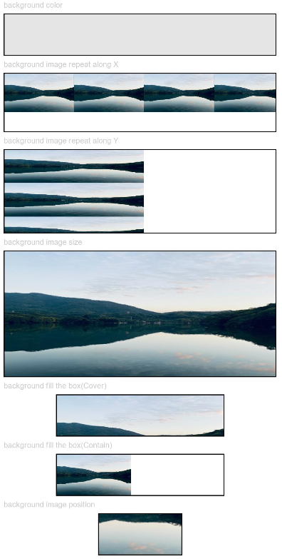
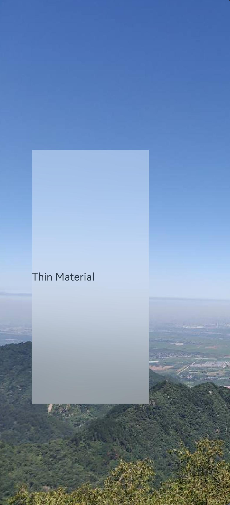
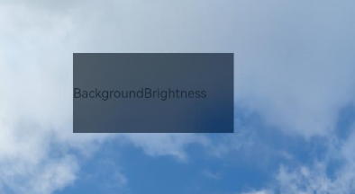
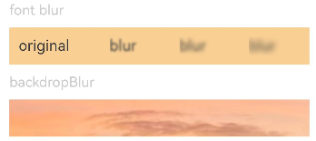
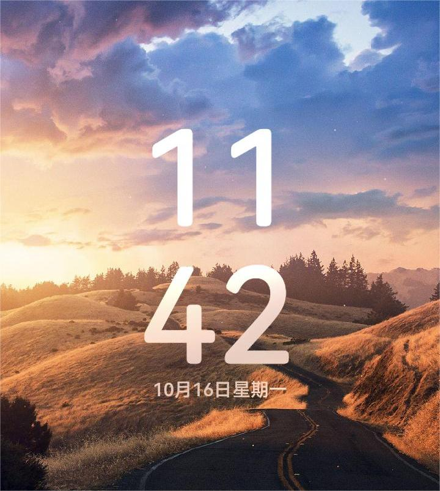

# Background

You can set the background for a component.

>  **NOTE**
>
>  The APIs of this module are supported since API version 7. Updates will be marked with a superscript to indicate their earliest API version.

## background<sup>10+</sup>

background(builder: CustomBuilder, options?: { align?: Alignment })

Sets the background color of the component.

**Atomic service API**: This API can be used in atomic services since API version 11.

**System capability**: SystemCapability.ArkUI.ArkUI.Full

**Parameters**

| Name | Type                                                | Mandatory| Description                                                        |
| ------- | ---------------------------------------------------- | ---- | ------------------------------------------------------------ |
| builder | [CustomBuilder](ts-types.md#custombuilder8)          | Yes  | Custom background.                                                |
| options | {align?:[Alignment](ts-appendix-enums.md#alignment)} | No  | Alignment mode between the custom background and the component.<br>If **background**, **backgroundColor**, and **backgroundImage** are set at the same time, they will all take effect, with **background** at the top layer.|

>  **NOTE**
>
>  The custom background takes some time to render, during which it cannot respond to events, or be dynamically updated. This attribute cannot be nested or be previewed in DevEco Studio Previewer.

## backgroundColor

backgroundColor(value: ResourceColor)

Sets the background color of the component.

**Widget capability**: This API can be used in ArkTS widgets since API version 9.

**Atomic service API**: This API can be used in atomic services since API version 11.

**System capability**: SystemCapability.ArkUI.ArkUI.Full

**Parameters**

| Name| Type                                      | Mandatory| Description              |
| ------ | ------------------------------------------ | ---- | ------------------ |
| value  | [ResourceColor](ts-types.md#resourcecolor) | Yes  | Background color of the component.|

## backgroundColor<sup>18+</sup>

backgroundColor(color: Optional\<ResourceColor>)

Sets the background color of the component. Compared to [backgroundColor](#backgroundcolor), the **color** parameter supports the **undefined** type.

**Widget capability**: This API can be used in ArkTS widgets since API version 18.

**Atomic service API**: This API can be used in atomic services since API version 18.

**System capability**: SystemCapability.ArkUI.ArkUI.Full

**Parameters**

| Name| Type                                                 | Mandatory| Description                                                        |
| ------ | ----------------------------------------------------- | ---- | ------------------------------------------------------------ |
| color  | Optional\<[ResourceColor](ts-types.md#resourcecolor)> | Yes  | Background color of the component.<br>If **color** is **undefined**, the background color reverts to the default transparent color.|

>  **NOTE**
>
>  If the background color is specified through **inactiveColor** in [backgroundBlurStyle](#backgroundblurstyle9), avoid setting the background color again using **backgroundColor**.

## backgroundImage

backgroundImage(src: ResourceStr | PixelMap, repeat?: ImageRepeat)

Sets the background image of the component.

**Widget capability**: This API can be used in ArkTS widgets since API version 9.

**Atomic service API**: This API can be used in atomic services since API version 11.

**System capability**: SystemCapability.ArkUI.ArkUI.Full

**Parameters**

| Name| Type                                           | Mandatory| Description                                                        |
| ------ | ----------------------------------------------- | ---- | ------------------------------------------------------------ |
| src    | [ResourceStr](ts-types.md#resourcestr) \| [PixelMap<sup>12+</sup>](../../apis-image-kit/js-apis-image.md#pixelmap7)          | Yes  | Image address, which can be the address of an online or local image, a Base64 encoded string, or a pixel map. SVG images are not supported.|
| repeat | [ImageRepeat](ts-appendix-enums.md#imagerepeat) | No  | Whether the background image is repeated. By default, the background image is not repeated. If the set image has a transparent background and **backgroundColor** is set, the image is overlaid on the background color.|

## backgroundImage<sup>18+</sup>

backgroundImage(src: ResourceStr | PixelMap, options?: BackgroundImageOptions)

Sets the background image of the component. Compared to [backgroundImage](#backgroundimage), this API supports the **BackgroundImageOptions** type, but not the **ImageRepeat** type.

**Widget capability**: This API can be used in ArkTS widgets since API version 18.

**Atomic service API**: This API can be used in atomic services since API version 18.

**System capability**: SystemCapability.ArkUI.ArkUI.Full

**Parameters**

| Name| Type                                           | Mandatory| Description                                                        |
| ------ | ----------------------------------------------- | ---- | ------------------------------------------------------------ |
| src    | [ResourceStr](ts-types.md#resourcestr) \| [PixelMap](../../apis-image-kit/js-apis-image.md#pixelmap7)          | Yes  | Image address, which can be the address of an online or local image, a Base64 encoded string, or a pixel map. SVG images are not supported.|
| options | [BackgroundImageOptions](ts-universal-attributes-image-effect.md#backgroundimageoptions18) | No  | Background image loading mode.<br> **NOTE**<br>By default, the image is loaded asynchronously.|

## backgroundImageSize

backgroundImageSize(value: SizeOptions | ImageSize)

Sets the width and height of the component background image.

**Widget capability**: This API can be used in ArkTS widgets since API version 9.

**Atomic service API**: This API can be used in atomic services since API version 11.

**System capability**: SystemCapability.ArkUI.ArkUI.Full

**Parameters**

| Name| Type                                                        | Mandatory| Description                                                        |
| ------ | ------------------------------------------------------------ | ---- | ------------------------------------------------------------ |
| value  | [SizeOptions](ts-universal-attributes-size.md#sizeoptions) \| [ImageSize](ts-appendix-enums.md#imagesize) | Yes  | Width and height of the background image. If the input is a **{width: Length, height: Length}** object and only one attribute is set, the other attribute is the set value multiplied by the original aspect ratio of the image. By default, the original image aspect ratio remains unchanged.<br>The value range of **width** and **height** is [0, +∞).<br>Default value: **ImageSize.Auto**<br>**NOTE**<br>If both **width** and **height** are set to values less than or equal to 0, they are treated as 0. If either **width** or **height** is unset or set to a value less than or equal to 0, the other one is adjusted based on the original aspect ratio of the image.|

## backgroundImagePosition

backgroundImagePosition(value: Position | Alignment)

Sets the position of the component background image.

**Widget capability**: This API can be used in ArkTS widgets since API version 9.

**Atomic service API**: This API can be used in atomic services since API version 11.

**System capability**: SystemCapability.ArkUI.ArkUI.Full

**Parameters**

| Name| Type                                                        | Mandatory| Description                                                        |
| ------ | ------------------------------------------------------------ | ---- | ------------------------------------------------------------ |
| value  | [Position](ts-types.md#position) \| [Alignment](ts-appendix-enums.md#alignment) | Yes  | Position of the background image in the component, that is, the coordinates relative to the upper left corner of the component.<br>Default value:<br>{<br>x: 0,<br>y: 0<br>} <br> When **x** and **y** are set in percentage, the offset is calculated based on the width and height of the component.|

## BlurStyle<sup>9+</sup>

**Widget capability**: This API can be used in ArkTS widgets since API version 9.

**System capability**: SystemCapability.ArkUI.ArkUI.Full

| Name                  | Description       |
| -------------------- | --------- |
| Thin                 | Thin material.<br>**Atomic service API**: This API can be used in atomic services since API version 11.  |
| Regular              | Regular material.<br>**Atomic service API**: This API can be used in atomic services since API version 11.|
| Thick                | Thick material.<br>**Atomic service API**: This API can be used in atomic services since API version 11.   |
| BACKGROUND_THIN<sup>10+</sup>       | Material that creates the minimum depth of field effect.<br>**Atomic service API**: This API can be used in atomic services since API version 11.  |
| BACKGROUND_REGULAR<sup>10+</sup>    | Material that creates a medium shallow depth of field effect.<br>**Atomic service API**: This API can be used in atomic services since API version 11.  |
| BACKGROUND_THICK<sup>10+</sup>      | Material that creates a high shallow depth of field effect.<br>**Atomic service API**: This API can be used in atomic services since API version 11.  |
| BACKGROUND_ULTRA_THICK<sup>10+</sup> | Material that creates the maximum depth of field effect.<br>**Atomic service API**: This API can be used in atomic services since API version 11. |
| NONE<sup>10+</sup> | No blur.<br>**Atomic service API**: This API can be used in atomic services since API version 11. |
| COMPONENT_ULTRA_THIN<sup>11+</sup> | Component ultra-thin material.<br>**Atomic service API**: This API can be used in atomic services since API version 12.|
| COMPONENT_THIN<sup>11+</sup> | Component thin material.<br>**Atomic service API**: This API can be used in atomic services since API version 12.|
| COMPONENT_REGULAR<sup>11+</sup> | Component regular material.<br>**Atomic service API**: This API can be used in atomic services since API version 12.|
| COMPONENT_THICK<sup>11+</sup> | Component thick material.<br>**Atomic service API**: This API can be used in atomic services since API version 12.|
| COMPONENT_ULTRA_THICK<sup>11+</sup> | Component ultra-thick material.<br>**Atomic service API**: This API can be used in atomic services since API version 12.|

## SystemAdaptiveOptions<sup>18+</sup>

Defines the system adaptive adjustment options.

**Widget capability**: This API can be used in ArkTS widgets since API version 18.

**Atomic service API**: This API can be used in atomic services since API version 18.

**System capability**: SystemCapability.ArkUI.ArkUI.Full

| Name       |   Type  |   Mandatory| Description                       |
| ----        |  ----   |   ---- | --------------------------  |
| disableSystemAdaptation   |  boolean   |   No  |  Whether to disable system adaptive adjustment. Whenever possible, do not include this parameter. This parameter only affects low-computing-power devices, the definition of which is determined by the device manufacturer. On low-computing-power devices, the system automatically decides whether to adjust effects (such as blur) to lower-computing-power alternatives based on conditions including computing power and load. To disable this feature, set this parameter to **true**.<br>Default value: **false**|

## backgroundBlurStyle<sup>9+</sup>

backgroundBlurStyle(value: BlurStyle, options?: BackgroundBlurStyleOptions)

Defines the blur style to apply between the background and content of a component. It encapsulates various blur radius, mask color, mask opacity, saturation, and brightness values through enum values.

**Widget capability**: This API can be used in ArkTS widgets since API version 9.

**Atomic service API**: This API can be used in atomic services since API version 11.

**System capability**: SystemCapability.ArkUI.ArkUI.Full

**Parameters**

| Name               | Type                                                        | Mandatory| Description                                                        |
| --------------------- | ------------------------------------------------------------ | ---- | ------------------------------------------------------------ |
| value                 | [BlurStyle](#blurstyle9)                                     | Yes  | Settings of the background blur style, including the blur radius, mask color, mask opacity, saturation, and brightness.|
| options<sup>10+</sup> | [BackgroundBlurStyleOptions](#backgroundblurstyleoptions10)| No  | Background blur options.                                              |

## backgroundBlurStyle<sup>18+</sup>

backgroundBlurStyle(style: Optional\<BlurStyle>, options?: BackgroundBlurStyleOptions, sysOptions?: SystemAdaptiveOptions)

Defines the blur style to apply between the background and content of a component. It encapsulates various blur radius, mask color, mask opacity, saturation, and brightness values through enum values. Compared to [backgroundBlurStyle<sup>9+</sup>](#backgroundblurstyle9), the **style** parameter supports the **undefined** type.

**Widget capability**: This API can be used in ArkTS widgets since API version 18.

**Atomic service API**: This API can be used in atomic services since API version 18.

**System capability**: SystemCapability.ArkUI.ArkUI.Full

**Parameters**

| Name               | Type                                                        | Mandatory| Description                                                        |
| --------------------- | ------------------------------------------------------------ | ---- | ------------------------------------------------------------ |
| style                 | Optional\<[BlurStyle](#blurstyle9)>                          | Yes  | Settings of the background blur style, including the blur radius, mask color, mask opacity, saturation, and brightness.<br>If **style** is **undefined**, the background blur reverts to its default state (that is, no blur).|
| options<sup>16+</sup> | [BackgroundBlurStyleOptions](#backgroundblurstyleoptions10)| No  | Background blur options.                                              |
| sysOptions<sup>18+</sup>   |  [SystemAdaptiveOptions](#systemadaptiveoptions18)    |   No  |  System adaptive adjustment options.<br>Default value: **{ disableSystemAdaptation: false }**   |

>  **NOTE**
>
>  If the background color is specified through **inactiveColor** in **backgroundBlurStyle**, avoid setting the background color again using [backgroundColor](#backgroundcolor).

## backdropBlur

backdropBlur(value: number, options?: BlurOptions)

Applies a background blur effect to the component. You can customize the blur radius and grayscale parameters.

**Widget capability**: This API can be used in ArkTS widgets since API version 9.

**Atomic service API**: This API can be used in atomic services since API version 11.

**System capability**: SystemCapability.ArkUI.ArkUI.Full

**Parameters**

| Name               | Type                                                        | Mandatory| Description                                                        |
| --------------------- | ------------------------------------------------------------ | ---- | ------------------------------------------------------------ |
| value                 | number                                                       | Yes  | Background blur effect to apply to the component. The input parameter is the blur radius. The larger the radius is, the more blurred the background is. If the value is **0**, the background is not blurred.|
| options<sup>11+</sup> | [BlurOptions](ts-universal-attributes-foreground-blur-style.md#bluroptions11) | No  | Grayscale parameters.                                                |

## backdropBlur<sup>18+</sup>

backdropBlur(radius: Optional\<number>, options?: BlurOptions, sysOptions?: SystemAdaptiveOptions)

Applies a background blur effect to the component. You can customize the blur radius and grayscale parameters. Compared to [backdropBlur](#backdropblur), the **radius** parameter supports the **undefined** type.

**Widget capability**: This API can be used in ArkTS widgets since API version 18.

**Atomic service API**: This API can be used in atomic services since API version 18.

**System capability**: SystemCapability.ArkUI.ArkUI.Full

**Parameters**

| Name               | Type                                                        | Mandatory| Description                                                        |
| --------------------- | ------------------------------------------------------------ | ---- | ------------------------------------------------------------ |
| radius                | Optional\<number>                                            | Yes  | Background blur effect to apply to the component. The input parameter is the blur radius. The larger the radius is, the more blurred the background is. If the value is **0**, the background is not blurred.<br>If **radius** is **undefined**, the background blur reverts to its default state (that is, no blur).|
| options<sup>16+</sup> | [BlurOptions](ts-universal-attributes-foreground-blur-style.md#bluroptions11) | No  | Grayscale parameters.                                                |
| sysOptions<sup>18+</sup>   |  [SystemAdaptiveOptions](#systemadaptiveoptions18)    |   No  |  System adaptive adjustment options.<br>Default value: **{ disableSystemAdaptation: false }**   |

>  **NOTE**
>
>  The **blur** and **backdropBlur** APIs provide real-time blurring by rendering each frame, which can be performance-intensive. For static blur effects where content and radius remain unchanged, you are advised to use the static [blur](../../apis-arkgraphics2d/js-apis-effectKit.md#blur) API to reduce the load.

## backgroundEffect<sup>11+</sup> 

backgroundEffect(options: BackgroundEffectOptions)

Sets the background effect of the component, including the blur radius, brightness, saturation, and color.

**Atomic service API**: This API can be used in atomic services since API version 11.

**System capability**: SystemCapability.ArkUI.ArkUI.Full

**Parameters**

| Name | Type                                                 | Mandatory| Description                                      |
| ------- | ----------------------------------------------------- | ---- | ------------------------------------------ |
| options | [BackgroundEffectOptions](#backgroundeffectoptions11) | Yes  | Background effect, including saturation, brightness, and color.|

## backgroundEffect<sup>18+</sup> 

backgroundEffect(options: Optional\<BackgroundEffectOptions>, sysOptions?: SystemAdaptiveOptions)

Sets the background effect of the component, including the blur radius, brightness, saturation, and color. Compared to [backgroundEffect<sup>11+</sup>](#backgroundeffect11), the **options** parameter supports the **undefined** type.

**Atomic service API**: This API can be used in atomic services since API version 18.

**System capability**: SystemCapability.ArkUI.ArkUI.Full

**Parameters**

| Name | Type                                                        | Mandatory| Description                                                        |
| ------- | ------------------------------------------------------------ | ---- | ------------------------------------------------------------ |
| options | Optional\<[BackgroundEffectOptions](#backgroundeffectoptions11)> | Yes  | Background effect, including saturation, brightness, and color.<br>If **options** is **undefined**, the background reverts to its default state with no effect.|
| sysOptions<sup>18+</sup>   |  [SystemAdaptiveOptions](#systemadaptiveoptions18)    |   No  |  System adaptive adjustment options.<br>Default value: **{ disableSystemAdaptation: false }**   |

## BackgroundEffectOptions<sup>11+</sup>
Describes the background effect.

**Atomic service API**: This API can be used in atomic services since API version 12.

**System capability**: SystemCapability.ArkUI.ArkUI.Full

| Name       |   Type        |   Mandatory|  Description                       |
| ----         |  ----         |   ---- | --------------------------  |
| radius       | number        |   Yes  |   Blur radius.<br>Value range: [0, +∞)<br>Default value: **0** |
| saturation   | number        |   No  |   Saturation.<br>Value range: [0, +∞)<br>Default value: **1** Recommended value range: [0, 50]    |
| brightness   | number        |   No  |   Brightness.<br>Value range: [0, +∞)<br>Default value: **1** Recommended value range: [0, 2]|
| color        | [ResourceColor](ts-types.md#resourcecolor)         |   No  |   Color.<br>Default value: transparent |
| adaptiveColor | [AdaptiveColor](ts-universal-attributes-foreground-blur-style.md#adaptivecolor10) |   No | Adaptive color mode used for the background blur effect.<br>Default value: **DEFAULT** When set to **AVERAGE**, the adaptive color mode takes effect only when the color has transparency.  |
| blurOptions  | [BlurOptions](ts-universal-attributes-foreground-blur-style.md#bluroptions11) |   No  |   Grayscale blur.<br>Default value: **[0, 0]** |
| policy<sup>14+</sup>    | [BlurStyleActivePolicy](#blurstyleactivepolicy14) | No   | Blur activation policy.<br> Default value: **BlurStyleActivePolicy.ALWAYS_ACTIVE**|
| inactiveColor<sup>14+</sup>  | [ResourceColor](ts-types.md#resourcecolor)  | No   | Background color of the components within the window after the window loses focus (in which case, the blur effect on the components within the window is removed).|

## backgroundImageResizable<sup>12+</sup>

backgroundImageResizable(value: ResizableOptions)

Sets the resizable background image options.

When **ResizableOptions** is set to a valid value, the **repeat** parameter in [backgroundImage](#backgroundimage) does not take effect.

When the sum of the values of **top** and **bottom** is greater than the source image height, or the sum of the values of **left** and **right** is greater than the source image width, the **ResizableOptions** attribute does not take effect.

**Atomic service API**: This API can be used in atomic services since API version 12.

**System capability**: SystemCapability.ArkUI.ArkUI.Full

**Parameters**

| Name| Type                                   | Mandatory| Description                            |
| ------ | --------------------------------------- | ---- | -------------------------------- |
| value  | [ResizableOptions](ts-basic-components-image.md#resizableoptions11) | Yes  | Resizable image options.|

## BackgroundBlurStyleOptions<sup>10+</sup>

Inherited from [BlurStyleOptions](ts-universal-attributes-foreground-blur-style.md).

**Atomic service API**: This API can be used in atomic services since API version 13.

**System capability**: SystemCapability.ArkUI.ArkUI.Full

| Name| Type                                                        | Mandatory| Description                                                |
| ------ | ------------------------------------------------------------ | ---- | ---------------------------------------------------- |
| policy<sup>14+</sup>  | [BlurStyleActivePolicy](#blurstyleactivepolicy14) | No   | Blur activation policy.<br> Default value: **BlurStyleActivePolicy.ALWAYS_ACTIVE**|
| inactiveColor<sup>14+</sup>  | [ResourceColor](ts-types.md#resourcecolor) | No   | Background color of the components within the window after the window loses focus (in which case, the blur effect on the components within the window is removed).|

## BlurStyleActivePolicy<sup>14+</sup>

**Atomic service API**: This API can be used in atomic services since API version 14.

**System capability**: SystemCapability.ArkUI.ArkUI.Full

| Name    | Value|Description                           |
| ------ | ----------------------------- |----------------------------- |
| FOLLOWS_WINDOW_ACTIVE_STATE| 0|The blur effect changes according to the window's focus state; it is inactive when the window is not in focus and active when the window is in focus.|
|  ALWAYS_ACTIVE  | 1|The blur effect is always active.|
| ALWAYS_INACTIVE |2 |The blur effect is always inactive.|

## backgroundBrightness<sup>12+</sup> 

backgroundBrightness(params: BackgroundBrightnessOptions)

Sets the background brightness of the component.

**Atomic service API**: This API can be used in atomic services since API version 12.

**System capability**: SystemCapability.ArkUI.ArkUI.Full

**Parameters**

| Name| Type                                                        | Mandatory| Description                                                |
| ------ | ------------------------------------------------------------ | ---- | ---------------------------------------------------- |
| params | [BackgroundBrightnessOptions](#backgroundbrightnessoptions12) | Yes  | Parameters for setting the background brightness.|

## backgroundBrightness<sup>18+</sup> 

backgroundBrightness(options: Optional\<BackgroundBrightnessOptions>)

Sets the background brightness of the component. Compared to [backgroundBrightness<sup>12+</sup>](#backgroundbrightness12), the **options** parameter supports the **undefined** type.

**Atomic service API**: This API can be used in atomic services since API version 18.

**System capability**: SystemCapability.ArkUI.ArkUI.Full

**Parameters**

| Name | Type                                                        | Mandatory| Description                                                        |
| ------- | ------------------------------------------------------------ | ---- | ------------------------------------------------------------ |
| options | Optional\<[BackgroundBrightnessOptions](#backgroundbrightnessoptions12)> | Yes  | Parameters for setting the background brightness.<br>If **options** is **undefined**, the background reverts to its default state with no brightness effect.|

## BackgroundBrightnessOptions<sup>12+</sup>

**Atomic service API**: This API can be used in atomic services since API version 12.

**System capability**: SystemCapability.ArkUI.ArkUI.Full

| Name         | Type  | Mandatory| Description                                                        |
| ------------- | ------ | ---- | ------------------------------------------------------------ |
| rate          | number | Yes  | Brightness change rate. A higher rate means that brightness decreases more quickly. If **rate** is set to **0**, **lightUpDegree** will not take effect, meaning no brightening effect will occur.<br>Default value: **0.0**<br>Value range: (0.0, +∞)|
| lightUpDegree | number | Yes  | Light up degree. A greater degree indicates a greater increase in brightness.<br> Default value: **0.0**<br>Value range: [-1.0, 1.0]|

>  **NOTE**
>
>  The brightness (gray scale value) of each pixel in the component background content is calculated using the following formula:
>  Y = (0.299R + 0.587G + 0.114B) / 255.0, where **R**, **G**, and **B** represent red, green, and blue channel values of the pixel, respectively, and **Y** is the gray scale value. This formula normalizes the gray scale value to a range of 0 to 1.
>  The formula for calculating the increase in brightness for each pixel is as follows: ΔY = -rate * Y + lightUpDegree. For example, when rate = 0.5 and lightUpDegree = 0.5, for a pixel with a gray scale value of 0.2, the increase in brightness is -0.5 * 0.2 + 0.5 = 0.4. For a pixel with a gray scale value of 1, the increase in brightness is -0.5 * 1 + 0.5 = 0.

## Example

### Example 1: Setting Basic Background Styles

This example shows how to configure basic background styles by setting **backgroundColor**, **backgroundImage**, **backgroundImageSize**, and **backgroundImagePosition**.

```ts
// xxx.ets
@Entry
@Component
struct BackgroundExample {

  build() {
    Column({ space: 5 }) {
      Text('background color').fontSize(9).width('90%').fontColor(0xCCCCCC)
      Row().width('90%').height(50).backgroundColor(0xE5E5E5).border({ width: 1 })

      Text('background image repeat along X').fontSize(9).width('90%').fontColor(0xCCCCCC)
      Row()
        .backgroundImage('/comment/bg.jpg', ImageRepeat.X)
        .backgroundImageSize({ width: '250px', height: '140px' })
        .width('90%')
        .height(70)
        .border({ width: 1 })

      Text('background image repeat along Y').fontSize(9).width('90%').fontColor(0xCCCCCC)
      Row()
        .backgroundImage('/comment/bg.jpg', ImageRepeat.Y)
        .backgroundImageSize({ width: '500px', height: '120px' })
        .width('90%')
        .height(100)
        .border({ width: 1 })

      Text('background image size').fontSize(9).width('90%').fontColor(0xCCCCCC)
      Row()
        .width('90%').height(150)
        .backgroundImage('/comment/bg.jpg', ImageRepeat.NoRepeat)
        .backgroundImageSize({ width: 1000, height: 500 })
        .border({ width: 1 })

      Text('background fill the box(Cover)').fontSize(9).width('90%').fontColor(0xCCCCCC)
      // Occupy all the space of the container, without ensuring that the image is completely displayed.
      Row()
        .width(200)
        .height(50)
        .backgroundImage('/comment/bg.jpg', ImageRepeat.NoRepeat)
        .backgroundImageSize(ImageSize.Cover)
        .border({ width: 1 })

      Text('background fill the box(Contain)').fontSize(9).width('90%').fontColor(0xCCCCCC)
      // Maximize the image while ensuring that it can be completely displayed.
      Row()
        .width(200)
        .height(50)
        .backgroundImage('/comment/bg.jpg', ImageRepeat.NoRepeat)
        .backgroundImageSize(ImageSize.Contain)
        .border({ width: 1 })

      Text('background image position').fontSize(9).width('90%').fontColor(0xCCCCCC)
      Row()
        .width(100)
        .height(50)
        .backgroundImage('/comment/bg.jpg', ImageRepeat.NoRepeat)
        .backgroundImageSize({ width: 1000, height: 560 })
        .backgroundImagePosition({ x: -500, y: -300 })
        .border({ width: 1 })
    }
    .width('100%').height('100%').padding({ top: 5 })
  }
}
```



### Example 2: Setting the Background Blur Style

This example sets the background blur style using **backgroundBlurStyle**.

```ts
// xxx.ets
@Entry
@Component
struct BackgroundBlurStyleDemo {
  build() {
    Column() {
      Row() {
        Text("Thin Material")
      }
      .width('50%')
      .height('50%')
      .backgroundBlurStyle(BlurStyle.Thin, { colorMode: ThemeColorMode.LIGHT, adaptiveColor: AdaptiveColor.DEFAULT, scale: 1.0 })
      .position({ x: '15%', y: '30%' })
    }
    .height('100%')
    .width('100%')
    .backgroundImage($r('app.media.bg'))
    .backgroundImageSize(ImageSize.Cover)
  }
}
```



### Example 3: Setting the Component Background

This example sets the component background using **background**.

```ts
// xxx.ets
@Entry
@Component
struct BackgroundExample {
  @Builder renderBackground() {
    Column() {
      Progress({value : 50})
    }
  }

  build() {
    Column() {
      Text("content")
        .width(100)
        .height(40)
        .fontColor("#FFF")
        .position({x:50, y:80})
        .textAlign(TextAlign.Center)
        .backgroundColor(Color.Green)
    }
    .width(200).height(200)
    .background(this.renderBackground)
    .backgroundColor(Color.Gray)
  }
}
```


### Example 4: Setting Component Background Brightness

This example sets the component background brightness using **backgroundBrightness**.

```ts
// xxx.ets
@Entry
@Component
struct BackgroundBrightnessDemo {
  build() {
    Column() {
      Row() {
        Text("BackgroundBrightness")
      }
      .width(200)
      .height(100)
      .position({ x: 100, y: 100 })
      .backgroundBlurStyle(BlurStyle.Thin, { colorMode: ThemeColorMode.LIGHT, adaptiveColor: AdaptiveColor.DEFAULT})
      .backgroundBrightness({rate:0.5,lightUpDegree:0.5}) // Background brightness
    }
    .width('100%')
    .height('100%')
    .backgroundImage($r('app.media.image'))
    .backgroundImageSize(ImageSize.Cover)
  }
}
```

The following figures show how the component looks with the background brightness set.

When **rate** and **lightUpDegree** are both set to **0.5**


When **rate** is set to **0.5** and **lightUpDegree** **-0.1**



The following figure shows how the component looks without the background brightness set.


### Example 5: Setting Blur Effects

This example shows how to use **blur** to apply a foreground blur effect and **backdropBlur** to apply a background blur effect.

```ts
// xxx.ets
@Entry
@Component
struct BlurEffectsExample {
  build() {
    Column({ space: 10 }) {
      // Blur the font.
      Text('font blur').fontSize(15).fontColor(0xCCCCCC).width('90%')
      Flex({ alignItems: ItemAlign.Center }) {
        Text('original text').margin(10)
        Text('blur text')
          .blur(5).margin(10)
        Text('blur text')
          .blur(10, undefined, { disableSystemAdaptation: true }).margin(10) // Set the foreground blur radius to 5 and disable system adaptive adjustment。
        Text('blur text')
          .blur(15).margin(10)
      }.width('90%').height(40)
      .backgroundColor(0xF9CF93)


      // Blur the background.
      Text('backdropBlur').fontSize(15).fontColor(0xCCCCCC).width('90%')
      Text()
        .width('90%')
        .height(40)
        .fontSize(16)
        .backdropBlur(3)
        .backgroundImage($r('app.media.image'))
        .backgroundImageSize({ width: 1200, height: 160 })
    }.width('100%').margin({ top: 5 })
  }
}
```



### Example 6: Setting Text Blur Effects

This example applies anamorphic blur effects on text using **blendMode** and **backgroundEffect**.<br>
If unwanted lines appear, make sure the sizes of the two owning components of **blendMode** are the same. If the issue persists, the component bounds may have fallen on the floating-point coordinates. In this case, set the universal attribute [pixelRound](ts-universal-attributes-pixelRound.md#pixelround) to align the component bounds on both sides of the unwanted lines with the integer pixel coordinates.

```ts
// xxx.ets
@Entry
@Component
struct Index {
  @State shColor: Color = Color.White;
  @State sizeDate: number = 20;
  @State rVal: number = 255;
  @State gVal: number = 255;
  @State bVal: number = 255;
  @State aVal: number = 0.1;
  @State rad: number = 40;
  @State satVal: number = 0.8;
  @State briVal: number = 1.5;
  build() {
    Stack() {
      Image($r('app.media.image'))
      Column() {
        Column({ space: 0 }) {
          Column() {
            Text('11')
              .fontSize(144)
              .fontWeight(FontWeight.Bold)
              .fontColor('rgba(255,255,255,1)')
              .fontFamily('HarmonyOS-Sans-Digit')
              .maxLines(1)
              .lineHeight(120 * 1.25)
              .height(120 * 1.25)
              .letterSpacing(4 * 1.25)
            Text('42')
              .fontSize(144)
              .fontWeight(FontWeight.Bold)
              .fontColor('rgba(255,255,255,1)')
              .fontFamily('HarmonyOS-Sans-Digit')
              .maxLines(1)
              .lineHeight(120 * 1.25)
              .height(120 * 1.25)
              .letterSpacing(4 * 1.25)
              .shadow({
                color: 'rgba(0,0,0,0)',
                radius: 20,
                offsetX: 0,
                offsetY: 0
              })
            Row() {
              Text('October 16')
                .fontSize(this.sizeDate)
                .height(22)
                .fontWeight('medium')
                .fontColor('rgba(255,255,255,1)')
              Text('Monday')
                .fontSize(this.sizeDate)
                .height(22)
                .fontWeight('medium')
                .fontColor('rgba(255,255,255,1)')
            }
          }
          .blendMode(BlendMode.DST_IN, BlendApplyType.OFFSCREEN)
          .pixelRound({
            start: PixelRoundCalcPolicy.FORCE_FLOOR ,
            top: PixelRoundCalcPolicy.FORCE_FLOOR ,
            end: PixelRoundCalcPolicy.FORCE_CEIL,
            bottom: PixelRoundCalcPolicy.FORCE_CEIL
          })
        }
        .blendMode(BlendMode.SRC_OVER, BlendApplyType.OFFSCREEN)
        .backgroundEffect({
          radius: this.rad,
          saturation: this.satVal,
          brightness: this.briVal,
          color: this.getVolumeDialogWindowColor()
        })
        .justifyContent(FlexAlign.Center)
        .pixelRound({
          start: PixelRoundCalcPolicy.FORCE_FLOOR ,
          top: PixelRoundCalcPolicy.FORCE_FLOOR ,
          end: PixelRoundCalcPolicy.FORCE_CEIL,
          bottom: PixelRoundCalcPolicy.FORCE_CEIL
        })
      }
    }
  }
  getVolumeDialogWindowColor(): ResourceColor | string {
    return `rgba(${this.rVal.toFixed(0)}, ${this.gVal.toFixed(0)}, ${this.bVal.toFixed(0)}, ${this.aVal.toFixed(0)})`;
  }
}
```



### Example 7: Comparing Blur Effects

This example compares three different blur effects: **backgroundEffect**, **backDropBlur**, and **backgroundBlurStyle**.

```ts
// xxx.ets
@Entry
@Component
struct BackGroundBlur {
  private imageSize: number = 150;

  build() {
    Column({ space: 5 }) {
      // Use backgroundBlurStyle with an enum value to set blur parameters.
      Stack() {
        Image($r('app.media.test'))
          .width(this.imageSize)
          .height(this.imageSize)
        Column()
          .width(this.imageSize)
          .height(this.imageSize)
          .backgroundBlurStyle(BlurStyle.Thin)
      }

      // backgroundEffect allows for custom settings for blur radius, brightness, saturation, and more.
      Stack() {
        Image($r('app.media.test'))
          .width(this.imageSize)
          .height(this.imageSize)
        Column()
          .width(this.imageSize)
          .height(this.imageSize)
          .backgroundEffect({ radius: 20, brightness: 0.6, saturation: 15 })
      }

      // backdropBlur only sets blur radius and grayscale parameters.
      Stack() {
        Image($r('app.media.test'))
          .width(this.imageSize)
          .height(this.imageSize)
        Column()
          .width(this.imageSize)
          .height(this.imageSize)
          .backdropBlur(20, { grayscale: [30, 50] })
      }
    }
    .width('100%')
    .padding({ top: 5 })
  }
}
```


