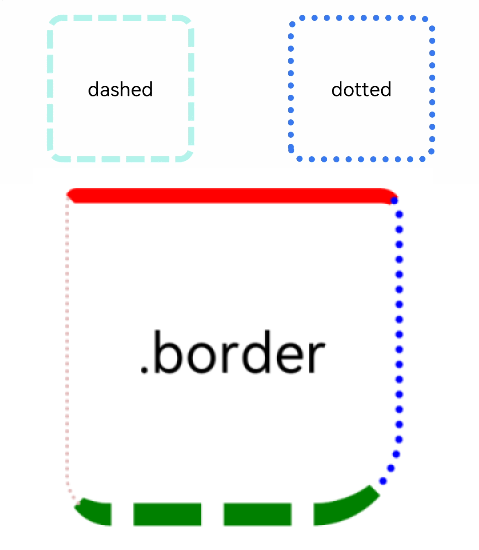
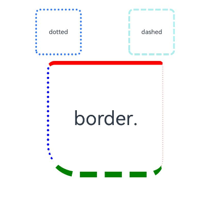

# Border

The border attributes are used to set border styles for components.

>  **NOTE**
>
>  The APIs of this module are supported since API version 7. Updates will be marked with a superscript to indicate their earliest API version.
>

## border

border(value: BorderOptions)

Sets the border.

**Widget capability**: This API can be used in ArkTS widgets since API version 9.

**Atomic service API**: This API can be used in atomic services since API version 11.

**System capability**: SystemCapability.ArkUI.ArkUI.Full

**Parameters**

| Name| Type                                   | Mandatory| Description                                                        |
| ------ | --------------------------------------- | ---- | ------------------------------------------------------------ |
| value  | [BorderOptions](#borderoptions) | Yes  | Unified border style.<br>**NOTE**<br>The default value is **0**, indicating that the border is not displayed.<br>The border of a component is displayed above the content of its child components since API version 9.|

## borderStyle

borderStyle(value: BorderStyle | EdgeStyles)

Sets the border style.

**Widget capability**: This API can be used in ArkTS widgets since API version 9.

**Atomic service API**: This API can be used in atomic services since API version 11.

**System capability**: SystemCapability.ArkUI.ArkUI.Full

**Parameters**

| Name| Type                                                        | Mandatory| Description                                              |
| ------ | ------------------------------------------------------------ | ---- | -------------------------------------------------- |
| value  | [BorderStyle](ts-appendix-enums.md#borderstyle) \| [EdgeStyles](#edgestyles9)<sup>9+</sup>| Yes  | Border style.<br>Default value: **BorderStyle.Solid**|

## borderWidth

borderWidth(value: Length | EdgeWidths | LocalizedEdgeWidths)

Sets the border width.

**Widget capability**: This API can be used in ArkTS widgets since API version 9.

**Atomic service API**: This API can be used in atomic services since API version 11.

**System capability**: SystemCapability.ArkUI.ArkUI.Full

**Parameters**

| Name| Type                                                        | Mandatory| Description                              |
| ------ | ------------------------------------------------------------ | ---- | ---------------------------------- |
| value  | [Length](ts-types.md#length) \| [EdgeWidths](#edgewidths9)<sup>9+</sup> \| [LocalizedEdgeWidths](#localizededgewidths12)<sup>12+</sup> | Yes  | Border width. Percentage values are not supported. |

## borderColor

borderColor(value: ResourceColor | EdgeColors | LocalizedEdgeColors)

Sets the border color.

**Widget capability**: This API can be used in ArkTS widgets since API version 9.

**Atomic service API**: This API can be used in atomic services since API version 11.

**System capability**: SystemCapability.ArkUI.ArkUI.Full

**Parameters**

| Name| Type                                                        | Mandatory| Description                                        |
| ------ | ------------------------------------------------------------ | ---- | -------------------------------------------- |
| value  | [ResourceColor](ts-types.md#resourcecolor) \| [EdgeColors](#edgecolors9)<sup>9+</sup> \| [LocalizedEdgeColors](#localizededgecolors12)<sup>12+</sup> | Yes  | Border color.<br>Default value: **Color.Black**|

## borderRadius

borderRadius(value: Length | BorderRadiuses | LocalizedBorderRadiuses)

Sets the radius of the border rounded corners. The radius is restricted by the component size. The maximum value is half of the component width or height.

**Widget capability**: This API can be used in ArkTS widgets since API version 9.

**Atomic service API**: This API can be used in atomic services since API version 11.

**System capability**: SystemCapability.ArkUI.ArkUI.Full

**Parameters**

| Name| Type                                                        | Mandatory| Description                                  |
| ------ | ------------------------------------------------------------ | ---- | -------------------------------------- |
| value  | [Length](ts-types.md#length) \| [BorderRadiuses](#borderradiuses9)<sup>9+</sup> \| [LocalizedBorderRadiuses](#localizedborderradiuses12)<sup>12+</sup> | Yes  | Radius of the border rounded corners. The value can be expressed as a percentage of the component's width.|

## BorderOptions

**Widget capability**: This API can be used in ArkTS widgets since API version 9.

**Atomic service API**: This API can be used in atomic services since API version 11.

| Name  | Type                                                    | Mandatory| Description              |
| ------ | ------------------------------------------------------------ | ---- | ------------------ |
| width  | [Length](ts-types.md#length) \| [EdgeWidths](#edgewidths9)<sup>9+</sup> \| [LocalizedEdgeWidths](#localizededgewidths12)<sup>12+</sup> | No  | Border width.    |
| color  | [ResourceColor](ts-types.md#resourcecolor) \| [EdgeColors](#edgecolors9)<sup>9+</sup> \| [LocalizedEdgeColors](#localizededgecolors12)<sup>12+</sup> | No  | Border color.    |
| radius | [Length](ts-types.md#length) \| [BorderRadiuses](#borderradiuses9)<sup>9+</sup> \| [LocalizedBorderRadiuses](#localizedborderradiuses12)<sup>12+</sup> | No  | Radius of the border rounded corners.|
| style  | [BorderStyle](ts-appendix-enums.md#borderstyle) \| [EdgeStyles](#edgestyles9)<sup>9+</sup>| No  | Sets the border.    |
| dashGap<sup>12+</sup>  | [LengthMetrics](../js-apis-arkui-graphics.md#lengthmetrics12) \| [EdgeWidths](#edgewidths9) \| [LocalizedEdgeWidths](#localizededgewidths12) | No | Gap between dashed line segments. It takes effect when the border style is set to dashed.<br>Percentage values are not supported.    |
| dashWidth<sup>12+</sup>  | [LengthMetrics](../js-apis-arkui-graphics.md#lengthmetrics12) \| [EdgeWidths](#edgewidths9) \| [LocalizedEdgeWidths](#localizededgewidths12) | No  | Width of dashed line segments. It takes effect when the border style is set to dashed.<br>Percentage values are not supported.    |

## EdgeWidths<sup>9+</sup>

To reference this object, at least one parameter must be passed.

**Widget capability**: This API can be used in ArkTS widgets since API version 9.

**Atomic service API**: This API can be used in atomic services since API version 11.

| Name    | Type                        | Mandatory  | Description     |
| ------ | ---------------------------- | ---- | ------- |
| left   | [Length](ts-types.md#length) | No   | Width of the left border.|
| right  | [Length](ts-types.md#length) | No   | Width of the right border.|
| top    | [Length](ts-types.md#length) | No   | Width of the top border.|
| bottom | [Length](ts-types.md#length) | No   | Width of the bottom border.|

## LocalizedEdgeWidths<sup>12+</sup>

Represents the edge widths in different directions of a component.

To reference this object, at least one parameter must be passed.

**Widget capability**: This API can be used in ArkTS widgets since API version 12.

| Name    | Type                        | Mandatory  | Description     |
| ------ | ---------------------------- | ---- | ------- |
| start   | [LengthMetrics](../js-apis-arkui-graphics.md#lengthmetrics12) | No   | Width of the left border.<br>Width of the right border for right-to-left scripts.|
| end     | [LengthMetrics](../js-apis-arkui-graphics.md#lengthmetrics12) | No   | Width of the right border.<br>Width of the left border for right-to-left scripts.|
| top     | [LengthMetrics](../js-apis-arkui-graphics.md#lengthmetrics12) | No   | Width of the top border.|
| bottom  | [LengthMetrics](../js-apis-arkui-graphics.md#lengthmetrics12) | No   | Width of the bottom border.|

## EdgeColors<sup>9+</sup>

To reference this object, at least one parameter must be passed.

**Widget capability**: This API can be used in ArkTS widgets since API version 9.

**Atomic service API**: This API can be used in atomic services since API version 11.

| Name    | Type                                    | Mandatory  | Description     |
| ------ | ---------------------------------------- | ---- | ------- |
| left   | [ResourceColor](ts-types.md#resourcecolor) | No   | Color of the left border.|
| right  | [ResourceColor](ts-types.md#resourcecolor) | No   | Color of the right border.|
| top    | [ResourceColor](ts-types.md#resourcecolor) | No   | Color of the top border.|
| bottom | [ResourceColor](ts-types.md#resourcecolor) | No   | Color of the bottom border.|

## LocalizedEdgeColors<sup>12+</sup>

Describes the edge colors of a component.

To reference this object, at least one parameter must be passed.

**Widget capability**: This API can be used in ArkTS widgets since API version 12.

**Atomic service API**: This API can be used in atomic services since API version 12.

| Name    | Type                                    | Mandatory  | Description     |
| ------ | ---------------------------------------- | ---- | ------- |
| start   | [ResourceColor](ts-types.md#resourcecolor) | No   | Color of the left border.<br>Color of the right border for right-to-left scripts.|
| end     | [ResourceColor](ts-types.md#resourcecolor) | No   | Color of the right border.<br>Color of the left border for right-to-left scripts.|
| top     | [ResourceColor](ts-types.md#resourcecolor) | No   | Color of the top border.|
| bottom  | [ResourceColor](ts-types.md#resourcecolor) | No   | Color of the bottom border.|

## BorderRadiuses<sup>9+</sup>

To reference this object, at least one parameter must be passed.

**Widget capability**: This API can be used in ArkTS widgets since API version 9.

**Atomic service API**: This API can be used in atomic services since API version 11.

| Name         | Type                        | Mandatory  | Description      |
| ----------- | ---------------------------- | ---- | -------- |
| topLeft     | [Length](ts-types.md#length) | No   | Radius of the upper left rounded corner.|
| topRight    | [Length](ts-types.md#length) | No   | Radius of the upper right rounded corner.|
| bottomLeft  | [Length](ts-types.md#length) | No   | Radius of the lower left rounded corner.|
| bottomRight | [Length](ts-types.md#length) | No   | Radius of the lower right rounded corner.|

## LocalizedBorderRadiuses<sup>12+</sup>

Describes the corner radius of a component's border.

To reference this object, at least one parameter must be passed.

**Widget capability**: This API can be used in ArkTS widgets since API version 12.

**Atomic service API**: This API can be used in atomic services since API version 12.

| Name         | Type                        | Mandatory  | Description      |
| ----------- | ---------------------------- | ---- | -------- |
| topStart     | [LengthMetrics](../js-apis-arkui-graphics.md#lengthmetrics12)<sup>12+</sup> | No   | Radius of the upper left rounded corner.<br>Radius of the upper right rounded corner for right-to-left scripts.|
| topEnd       | [LengthMetrics](../js-apis-arkui-graphics.md#lengthmetrics12)<sup>12+</sup> | No   | Radius of the upper right rounded corner.<br>Radius of the upper left rounded corner for right-to-left scripts.|
| bottomStart  | [LengthMetrics](../js-apis-arkui-graphics.md#lengthmetrics12)<sup>12+</sup> | No   | Radius of the lower left rounded corner.<br>Radius of the lower right rounded corner for right-to-left scripts.|
| bottomEnd    | [LengthMetrics](../js-apis-arkui-graphics.md#lengthmetrics12)<sup>12+</sup> | No   | Radius of the lower right rounded corner.<br>Radius of the lower left rounded corner for right-to-left scripts.|

## EdgeStyles<sup>9+</sup>

To reference this object, at least one parameter must be passed.

**Widget capability**: This API can be used in ArkTS widgets since API version 9.

**Atomic service API**: This API can be used in atomic services since API version 11.

| Name    | Type                                    | Mandatory  | Description     |
| ------ | ---------------------------------------- | ---- | ------- |
| left   | [BorderStyle](ts-appendix-enums.md#borderstyle) | No   | Style of the left border.|
| right  | [BorderStyle](ts-appendix-enums.md#borderstyle) | No   | Style of the right border.|
| top    | [BorderStyle](ts-appendix-enums.md#borderstyle) | No   | Style of the top border.|
| bottom | [BorderStyle](ts-appendix-enums.md#borderstyle) | No   | Style of the bottom border.|

## Example

### Example 1

```ts
// xxx.ets
@Entry
@Component
struct BorderExample {
  build() {
    Column() {
      Flex({ justifyContent: FlexAlign.SpaceAround, alignItems: ItemAlign.Center }) {
        // Dashed border
        Text('dashed')
          .borderStyle(BorderStyle.Dashed).borderWidth(5).borderColor(0xAFEEEE).borderRadius(10)
          .width(120).height(120).textAlign(TextAlign.Center).fontSize(16)
        // Dotted border
        Text('dotted')
          .border({ width: 5, color: 0x317AF7, radius: 10, style: BorderStyle.Dotted })
          .width(120).height(120).textAlign(TextAlign.Center).fontSize(16)
      }.width('100%').height(150)

      Text('.border')
        .fontSize(50)
        .width(300)
        .height(300)
        .border({
          width: { left: 3, right: 6, top: 10, bottom: 15 },
          color: { left: '#e3bbbb', right: Color.Blue, top: Color.Red, bottom: Color.Green },
          radius: { topLeft: 10, topRight: 20, bottomLeft: 40, bottomRight: 80 },
          style: {
            left: BorderStyle.Dotted,
            right: BorderStyle.Dotted,
            top: BorderStyle.Solid,
            bottom: BorderStyle.Dashed
          }
        }).textAlign(TextAlign.Center)
    }
  }
}
```



### Example 2
```ts
// xxx.ets
// The width, radius, and color attributes of border use the LocalizedEdgeWidths and LocalizedEdgeColors types.

import { LengthMetrics } from '@kit.ArkUI';
@Entry
@Component
struct BorderExample {
  build() {
    Column() {
      Flex({ justifyContent: FlexAlign.SpaceAround, alignItems: ItemAlign.Center }) {
        // Dashed border
        Text('dashed')
          .borderStyle(BorderStyle.Dashed)
          .borderWidth(5)
          .borderColor(0xAFEEEE)
          .borderRadius(10)
          .width(120)
          .height(120)
          .textAlign(TextAlign.Center)
          .fontSize(16)
        // Dotted border
        Text('dotted')
          .border({ width: 5, color: 0x317AF7, radius: 10, style: BorderStyle.Dotted })
          .width(120)
          .height(120)
          .textAlign(TextAlign.Center)
          .fontSize(16)
      }.width('100%').height(150)

      Text('.border')
        .fontSize(50)
        .width(300)
        .height(300)
        .border({
          width: {
            start: LengthMetrics.vp(3),
            end: LengthMetrics.vp(6),
            top: LengthMetrics.vp(10),
            bottom: LengthMetrics.vp(15)
          },
          color: { start: '#e3bbbb', end: Color.Blue, top: Color.Red, bottom: Color.Green },
          radius: {
            topStart: LengthMetrics.vp(10),
            topEnd: LengthMetrics.vp(20),
            bottomStart: LengthMetrics.vp(40),
            bottomEnd: LengthMetrics.vp(80)
          },
          style: {
            left: BorderStyle.Dotted,
            right: BorderStyle.Dotted,
            top: BorderStyle.Solid,
            bottom: BorderStyle.Dashed
          }
        })
        .textAlign(TextAlign.Center)
    }
  }
}
```

The following shows how the example is represented with left-to-right scripts.


The following shows how the example is represented with right-to-left scripts.


