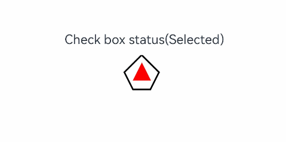

# Content Modifier

You can apply a content modifier to a component to customize its content area using a style builder.

> **NOTE**
>
> The initial APIs of this module are supported since API version 12. Updates will be marked with a superscript to indicate their earliest API version.

## contentModifier

contentModifier(modifier: ContentModifier\<T>): T

Creates a content modifier.

**System capability**: SystemCapability.ArkUI.ArkUI.Full

**Parameters**

| Name  | Type              | Mandatory| Description                                                        |
| -------- | ------------------ | ---- | ------------------------------------------------------------ |
| modifier | ContentModifier\<T> | Yes  | Content modifier to apply to the current component.<br>**modifier**: content modifier. You need a custom class to implement the **ContentModifier** API.|

**Return value**

| Type| Description|
| --- | --- |
| T | Current component.|

## ContentModifier\<T>

You need a custom class to implement the **ContentModifier** API.

### applyContent

applyContent(): WrappedBuilder<[T]>

Builder of the custom content area.

**Atomic service API**: This API can be used in atomic services since API version 12.

**System capability**: SystemCapability.ArkUI.ArkUI.Full

**Parameters**

| Name| Description                                                        |
| ---- | ------------------------------------------------------------ |
| T    | Component attribute class, which is used to distinguish different information required by different components after content areas are customized, for example, **ButtonConfiguration** for the **Button** component and **CheckBoxConfiguration** of the **Checkbox** component.|

**Value range of the T parameter:**

ButtonConfiguration, CheckBoxConfiguration, DataPanelConfiguration, TextClockConfiguration, ToggleConfiguration, GaugeConfiguration, LoadingProgressConfiguration, RadioConfiguration, ProgressConfiguration, RatingConfiguration, SliderConfiguration

**Supported attributes**

The universal attribute **enabled** and **contentModifier** are supported.
## CommonConfiguration\<T><sup>12+</sup>

You need a custom class to implement the **ContentModifier** API.

**Atomic service API**: This API can be used in atomic services since API version 12.

**System capability**: SystemCapability.ArkUI.ArkUI.Full

| Name | Type   | Description             |
| ------ | ------ | ---------------- |
| enabled | boolean | Whether to enable the content modifier and respond to operations such as **triggerChange**. The value **true** means to enable the content modifier and respond to operations such as **triggerChange**, and **false** means the opposite.|
| contentModifier | ContentModifier\<T> | Content modifier that sends the component information required by users to the custom content area.|


## Example

This example demonstrates how to create a custom check box using **ContentModifier**. This check box comes in the custom pentagon style instead of the original check box style. When selected, the check box shows a red triangle pattern inside, and the title displays the word "Selected;" when deselected, the check box hides the red triangle pattern inside, and the title displays the word "Unselected."

```ts
// xxx.ets
class MyCheckboxStyle implements ContentModifier<CheckBoxConfiguration> {
  selectedColor: Color = Color.White;

  constructor(selectedColor: Color) {
    this.selectedColor = selectedColor;
  }

  applyContent(): WrappedBuilder<[CheckBoxConfiguration]> {
    return wrapBuilder(buildCheckbox);
  }
}

@Builder
function buildCheckbox(config: CheckBoxConfiguration) {
  Column({ space: 10 }) {
    Text(config.name + (config.selected ? "(Selected)" : ""(Not selected)"))
    Shape() {
      // Pentagon check box style
      Path()
        .width(200)
        .height(60)
        .commands('M100 0 L0 100 L50 200 L150 200 L200 100 Z')
        .fillOpacity(0)
        .strokeWidth(3)
      // Red triangle pattern style
      Path()
        .width(10)
        .height(10)
        .commands('M50 0 L100 100 L0 100 Z')
        .visibility(config.selected ? Visibility.Visible : Visibility.Hidden)
        .fill(config.selected ? (config.contentModifier as MyCheckboxStyle).selectedColor : Color.Black)
        .stroke((config.contentModifier as MyCheckboxStyle).selectedColor)
        .margin({ left: 11, top: 10 })
    }
    .width(300)
    .height(200)
    .viewPort({
      x: 0,
      y: 0,
      width: 310,
      height: 310
    })
    .strokeLineJoin(LineJoinStyle.Miter)
    .strokeMiterLimit(5)
    .onClick(() => {
      // Trigger the check box state change upon click.
      if (config.selected) {
        config.triggerChange(false);
      } else {
        config.triggerChange(true);
      }
    })
    .margin({ left: 150 })
  }
}

@Entry
@Component
struct Index {
  build() {
    Row() {
      Column() {
        Checkbox({ name: 'Check box status', group: 'checkboxGroup' })
          .select(true)
          .contentModifier(new MyCheckboxStyle(Color.Red))
          .onChange((value: boolean) => {
            console.info('Checkbox change is' + value);
          })
      }
      .width('100%')
    }
    .height('100%')
  }
}
```


