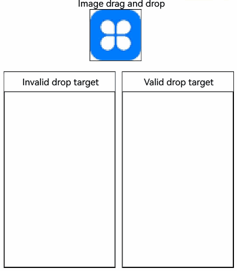
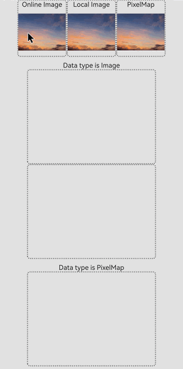

# Drag and Drop Control

The drag and drop control attributes set whether a component can respond to drag events.

> **NOTE**
> 
> The APIs of this module are supported since API version 10. Updates will be marked with a superscript to indicate their earliest API version.

The ArkUI framework provides default drag and drop capabilities for the following components, allowing them to serve as the drag source (from which data can be dragged) or drop target (to which data can be dropped). You can also define drag responses by implementing common drag events.

- The following component supports drag actions by default: [Search](ts-basic-components-search.md), [TextInput](ts-basic-components-textinput.md), [TextArea](ts-basic-components-textarea.md), [RichEditor](ts-basic-components-richeditor.md), [Text](ts-basic-components-text.md), [Image](ts-basic-components-image.md), <!--Del-->[FormComponent](ts-basic-components-formcomponent-sys.md), <!--DelEnd-->[Hyperlink](ts-container-hyperlink.md). You can control the default drag behavior by setting the [draggable](ts-universal-attributes-drag-drop.md#draggable) attribute.

- The following component supports drop actions by default: [Search](ts-basic-components-search.md), [TextInput](ts-basic-components-textinput.md), [TextArea](ts-basic-components-textarea.md), [RichEditor](ts-basic-components-richeditor.md). You can disable the default drag behavior by setting the [allowDrop](ts-universal-attributes-drag-drop.md#allowdrop) attribute to **null**.

<!--RP1--><!--RP1End-->To enable drag and drop for other components, you need to set the **draggable** attribute to **true** and implement data transmission in APIs such as **onDragStart**.

> **NOTE**
>
> When using the **Text** component, set [copyOption](ts-basic-components-text.md#copyoption9) to **CopyOptions.InApp** or **CopyOptions.LocalDevice**.

## allowDrop

allowDrop(value: Array&lt;UniformDataType&gt; | null)

Sets the type of data that can be dropped to the component.

**Atomic service API**: This API can be used in atomic services since API version 11.

**System capability**: SystemCapability.ArkUI.ArkUI.Full

**Parameters**

| Name| Type                                                        | Mandatory| Description                                           |
| ------ | ------------------------------------------------------------ | ---- | ----------------------------------------------- |
| value  | Array\<[UniformDataType](../../apis-arkdata/js-apis-data-uniformTypeDescriptor.md#uniformdatatype)> \| null<sup>12+</sup> | Yes  | Type of data that can be dropped to the component. Since API version 12, this parameter can be set to **null** to make the component reject all data types.<br>Default value: empty|

## draggable

draggable(value: boolean)

Sets whether the component is draggable.

**Atomic service API**: This API can be used in atomic services since API version 11.

**System capability**: SystemCapability.ArkUI.ArkUI.Full

**Parameters**

| Name| Type   | Mandatory| Description                                          |
| ------ | ------- | ---- | ---------------------------------------------- |
| value  | boolean | Yes  | Whether the component is draggable.<br>Default value: **false**|

## dragPreview<sup>11+</sup>

dragPreview(value: CustomBuilder | DragItemInfo | string)

Sets the preview displayed when the component is dragged.

**Atomic service API**: This API can be used in atomic services since API version 12.

**System capability**: SystemCapability.ArkUI.ArkUI.Full

**Parameters**

| Name| Type                                                        | Mandatory| Description                                                        |
| ------ | ------------------------------------------------------------ | ---- | ------------------------------------------------------------ |
| value  | [CustomBuilder](ts-types.md#custombuilder8) \| [DragItemInfo](ts-universal-events-drag-drop.md#dragiteminfo) \| string<sup>12+</sup> | Yes  | Preview displayed when the component is dragged. This attribute has effect for **onDragStart** only.<br>If the component supports drag and drop and a preview is specified through [bindContextMenu](ts-universal-attributes-menu.md#bindcontextmenu8), that specified preview is displayed when the component is dragged. The priority of the background image returned in [onDragStart](ts-universal-events-drag-drop.md#onDragStart) is lower than that of the preview set in [dragPreview](ts-universal-attributes-drag-drop.md#dragPreview11). This means that, once set, the latter will be used in place of the former. Because [CustomBuilder](ts-types.md#custombuilder8) can be used only after offline rendering, it may increase performance overhead and latency. In light of this, you are advised to use [PixelMap](../../apis-image-kit/js-apis-image.md#pixelmap7) in [DragItemInfo](ts-universal-events-drag-drop.md#dragiteminfo) to set the preview.<br> When an ID of the string type is passed in, the snapshot of the component assigned the ID is used as the preview image. If the component assigned the ID cannot be found or its **Visibility** attribute is set to **none** or **hidden**, a snapshot of the current component is used as the preview image. Currently, snapshots do not support visual effects, such as brightness, shadow, blur, and rotation.<br>Default value: empty<br>|

## dragPreviewOptions<sup>11+</sup>

dragPreviewOptions(value: DragPreviewOptions, options?: DragInteractionOptions)

Sets the processing mode of the drag preview and the display of the number badge during dragging. The **onItemDragStart** dragging mode is not supported.

**Atomic service API**: This API can be used in atomic services since API version 12.

**System capability**: SystemCapability.ArkUI.ArkUI.Full

**Parameters**

| Name| Type                                                           | Mandatory| Description                                                        |
| ------ | -------------------------------------------------------------- | ---- | ------------------------------------------------------------ |
| value  | [DragPreviewOptions](#dragpreviewoptions11)<sup>11+</sup>      | Yes  | Processing mode of the drag preview and the display of the number badge during dragging.<br>Default value: empty|
| options<sup>12+</sup>| [DragInteractionOptions](#draginteractionoptions12)<sup>12+</sup>| No  | Interaction mode of the drag preview.<br>Default value: empty|

## DragPreviewOptions<sup>11+</sup>

**Atomic service API**: This API can be used in atomic services since API version 12.

| Name| Type| Mandatory| Description|
| -------- | -------- | -------- | -------- |
| mode | [DragPreviewMode](#dragpreviewmode11)  \|  Array<[DragPreviewMode](#dragpreviewmode11)><sup>12+</sup>| No| How the background image is processed when the component is dragged.<br>Default value: **DragPreviewMode.AUTO**<br>If **DragPreviewMode.AUTO** is along with other enum values, the setting takes precedence with **DragPreviewMode.AUTO**, and other enum values do not take effect.|
| numberBadge<sup>12+</sup> | boolean  \|  number | No| Whether to display the number badge or the number displayed on the badge. For a number badge, the value range is [0, 2<sup>31</sup>-1]. Values outside this range will be processed as the default state. If the value specified is a floating-point number, only the integer part is displayed.<br>**NOTE**<br>When multiple items are dragged, use this API to set the number of items dragged.<br>Default value: **true**|
| modifier<sup>12+</sup> | [ImageModifier](ts-universal-attributes-attribute-modifier.md)| No| Style modifier to apply to the drag preview. You can use the attributes and styles supported by the image component to configure the drag preview style (see example 6). Currently, opacity, shadow, background blur, and rounded corners are supported. This parameter does not work for text dragging, which only supports the default effect.<br>1. Opacity<br>Use the [opacity](ts-universal-attributes-opacity.md#opacity) attribute to set the opacity. The value ranges from 0 to 1. If the value is set to **0** or left unspecified, it reverts to the default value **0.95**. Setting it to **1** or an invalid value makes the object completely opaque.<br>2. Shadow<br>Use the [shadow](ts-universal-attributes-image-effect.md#shadow) attribute to set the shadow.<br>3. Background blur<br>Use the [backgroundEffect](ts-universal-attributes-background.md#backgroundeffect11) or [backgroundBlurStyle](ts-universal-attributes-background.md#backgroundblurstyle) attribute to set the background blur. If both are used, **backgroundEffect** takes precedence.<br>4. Rounded corner<br>Use the [border](ts-universal-attributes-border.md#border) or [borderRadius](ts-universal-attributes-border.md#borderRadius) attribute to set rounded corners. If you set rounded corners in both **mode** and **modifier**, the settings in **modifier** prevail.<br>Default value: empty. The attribute cannot be modified.|

## DragPreviewMode<sup>11+</sup>

**Atomic service API**: This API can be used in atomic services since API version 12.

| Name| Value| Description|
| -------- | ------- | -------- |
| AUTO  | 1 | Enables the system to automatically change the position of the dragged point based on the scenario and apply scaling transformations to the drag preview based on set rules.|
| DISABLE_SCALE  | 2 | Disables the system's scaling behavior for the drag preview.|
| ENABLE_DEFAULT_SHADOW<sup>12+</sup> | 3 | Enables the default shadow effect for non-text components.|
| ENABLE_DEFAULT_RADIUS<sup>12+</sup> | 4 | Enables a unified rounded corner effect for non-text components, with the default value of 12 vp. If the custom rounded corner value set by the application is greater than the default value or the value set by **modifier**, the custom value is used.|
| ENABLE_DRAG_ITEM_GRAY_EFFECT<sup>16+</sup> | 5 | Enables the gray (transparency) effect for the original drag item, which does not apply to text content dragging. When the user starts dragging, the original item displays a gray effect. When released, the original item returns to its original appearance. After enabling the default gray effect, avoid manually modifying the opacity after dragging starts. Otherwise, the gray effect will be overridden, and the original opacity will not be correctly restored when dragging ends.|
| ENABLE_MULTI_TILE_EFFECT<sup>16+</sup> | 6 | Enables the effect where multiple selected objects do not cluster when dragged with the mouse. This parameter takes effect only when** isMultiSelectionEnabled** is **true** and effective under multi-selection conditions. The non-clustering effect has a higher priority than [dragPreview](#dragpreview11). This setting does not support secondary dragging, rounded corners, or scaling.|

## DragInteractionOptions<sup>12+</sup>

**Atomic service API**: This API can be used in atomic services since API version 12.

| Name| Type| Mandatory| Description|
| -------- | -------- | -------- | -------- |
| isMultiSelectionEnabled | boolean | No| Whether to enable multiselect for the drag preview. This parameter takes effect only for the [grid items](ts-container-griditem.md) and [list items](ts-container-listitem.md) in the [Grid](ts-container-grid.md) and [List](ts-container-list.md) containers.<br>When multiselect is enabled for an item, the child components of the item cannot be dragged. The precendence levels of drag previews for multiselect, from high to low, are as follows: preview specified through a string value in [dragPreview](#dragpreview11), preview specified through **PixelMap** in **dragPreview**, and component snapshot. The Builder format in **dragPreview** is not supported.<br>The context menu bound to the component through [bindContextMenu](ts-universal-attributes-menu.md#bindcontextmenu12) cannot contain the **isShown** parameter.<br>Default value: **false**<br>|
| defaultAnimationBeforeLifting | boolean | No| Whether to enable the default pressed state animation (compressing in size) of the component before a lift animation starts.<br>Default value: **false**<br>|
| enableEdgeAutoScroll<sup>16+</sup> | boolean | No| Whether to trigger automatic scrolling for dragging to the edge of a scrollable component.<br>Default value: **true**, which enables automatic scrolling|
| enableHapticFeedback<sup>16+</sup> | boolean | No| Whether to enable haptic feedback during dragging. This parameter takes effect only in preview scenarios with a mask (using [bindContextMenu](ts-universal-attributes-menu.md#bindcontextmenu12)).<br>Default value: **false**|

## Example
### Example 1: Allowing Drag and Drop

This example demonstrates how to configure whether a component can be dragged and dropped into by setting **allowDrop** and **draggable**.

```ts
// xxx.ets
import { unifiedDataChannel, uniformTypeDescriptor } from '@kit.ArkData';

@Entry
@Component
struct ImageExample {
  @State uri: string = ""
  @State AblockArr: string[] = []
  @State BblockArr: string[] = []
  @State AVisible: Visibility = Visibility.Visible
  @State dragSuccess :Boolean = false

  build() {
    Column() {
      Text('Image drag and drop')
        .fontSize('30dp')
      Flex({ direction: FlexDirection.Row, alignItems: ItemAlign.Center, justifyContent: FlexAlign.SpaceAround }) {
        Image($r('app.media.icon'))
          .width(100)
          .height(100)
          .border({ width: 1 })
          .visibility(this.AVisible)
          .draggable(true)
          .onDragEnd((event: DragEvent) => {
            let ret = event.getResult();
            if(ret == 0) {
              console.log("enter ret == 0")
              this.AVisible = Visibility.Hidden;
            } else {
              console.log("enter ret != 0")
              this.AVisible = Visibility.Visible;
            }
          })
      }
      .margin({ bottom: 20 })
      Row() {
        Column(){
          Text('Invalid drop target')
            .fontSize('15dp')
            .height('10%')
          List(){
            ForEach(this.AblockArr, (item:string, index) => {
              ListItem() {
                Image(item)
                  .width(100)
                  .height(100)
                  .border({width: 1})
              }
              .margin({ left: 30 , top : 30})
            }, (item:string) => item)
          }
          .height('90%')
          .width('100%')
          .allowDrop([uniformTypeDescriptor.UniformDataType.TEXT])
          .onDrop((event?: DragEvent, extraParams?: string) => {
            this.uri = JSON.parse(extraParams as string).extraInfo;
            this.AblockArr.splice(JSON.parse(extraParams as string).insertIndex, 0, this.uri);
            console.log("ondrop not udmf data");
          })
          .border({width: 1})
        }
        .height("50%")
        .width("45%")
        .border({ width: 1 })
        .margin({ left: 12 })
        Column(){
          Text('Valid drop target')
            .fontSize('15dp')
            .height('10%')
          List(){
            ForEach(this.BblockArr, (item:string, index) => {
              ListItem() {
                Image(item)
                  .width(100)
                  .height(100)
                  .border({width: 1})
              }
              .margin({ left: 30 , top : 30})
            }, (item:string) => item)
          }
          .border({width: 1})
          .height('90%')
          .width('100%')
          .allowDrop([uniformTypeDescriptor.UniformDataType.IMAGE])
          .onDrop((event?: DragEvent, extraParams?: string) => {
            console.log("enter onDrop")
            let dragData:UnifiedData = (event as DragEvent).getData() as UnifiedData;
            if(dragData != undefined) {
              let arr:Array<unifiedDataChannel.UnifiedRecord> = dragData.getRecords();
              if(arr.length > 0) {
                let image = arr[0] as unifiedDataChannel.Image;
                this.uri = image.imageUri;
                this.BblockArr.splice(JSON.parse(extraParams as string).insertIndex, 0, this.uri);
              } else {
                console.log(`dragData arr is null`)
              }
            } else {
              console.log(`dragData  is undefined`)
            }
            console.log("ondrop udmf data");
            this.dragSuccess = true
          })
        }
        .height("50%")
        .width("45%")
        .border({ width: 1 })
        .margin({ left: 12 })
      }
    }.width('100%')
  }
}
```



### Example 2: Setting the Drag Preview

This example demonstrates how to configure the preview displayed during the drag process using **dragPreview**.

```ts
// xxx.ets
@Entry
@Component
struct DragPreviewDemo{
  @Builder dragPreviewBuilder() {
    Column() {
      Text("dragPreview")
        .width(150)
        .height(50)
        .fontSize(20)
        .borderRadius(10)
        .textAlign(TextAlign.Center)
        .fontColor(Color.Black)
        .backgroundColor(Color.Pink)
    }
  }

  @Builder MenuBuilder() {
    Flex({ direction: FlexDirection.Column, justifyContent: FlexAlign.Center, alignItems: ItemAlign.Center }) {
      Text("menu item 1")
        .fontSize(15)
        .width(100)
        .height(40)
        .textAlign(TextAlign.Center)
        .fontColor(Color.Black)
        .backgroundColor(Color.Pink)
      Divider()
        .height(5)
      Text("menu item 2")
        .fontSize(15)
        .width(100)
        .height(40)
        .textAlign(TextAlign.Center)
        .fontColor(Color.Black)
        .backgroundColor(Color.Pink)
    }
    .width(100)
  }

  build() {
    Row() {
      Column() {
        Image('/resource/image.jpeg')
          .width("30%")
          .draggable(true)
          .bindContextMenu(this.MenuBuilder, ResponseType.LongPress)
          .onDragStart(() => {
            console.log("Image onDragStart")
          })
          .dragPreview(this.dragPreviewBuilder)
      }
      .width("100%")
    }
    .height("100%")
  }
}
```


### Example 3: Setting the Drag Preview Style

This example demonstrates how to set default shadows, unified rounded corners, and gray effects by configuring **dragPreviewOptions** with **ENABLE_DEFAULT_SHADOW**, **ENABLE_DEFAULT_RADIUS**, and **ENABLE_DRAG_ITEM_GRAY_EFFECT**.

```ts
// xxx.ets
@Entry
@Component
struct dragPreviewOptionsDemo{
  build() {
    Row() {
      Column() {
        Image('/resource/image.jpeg')
          .margin({ top: 10 })
          .width("30%")
          .draggable(true)
          .dragPreviewOptions({ mode: DragPreviewMode.AUTO })
        Image('/resource/image.jpeg')
          .margin({ top: 10 })
          .width("30%")
          .border({ radius: { topLeft: 1, topRight: 2, bottomLeft: 4, bottomRight: 8 } })
          .draggable(true)
          .onDragStart(() => {
            console.log("Image onDragStart")
          })
          .dragPreviewOptions({ mode: [ DragPreviewMode.ENABLE_DEFAULT_SHADOW, DragPreviewMode.ENABLE_DEFAULT_RADIUS, DragPreviewMode.ENABLE_DRAG_ITEM_GRAY_EFFECT ] })
      }
      .width("100%")
      .height("100%")
    }
  }
}
```


### Example 4: Enabling Multiselect for Dragging

This example demonstrates how to enable multiselect for dragging in a **Grid** component by configuring **isMultiSelectionEnabled**.

```ts
@Entry
@Component
struct Example {
  @State numbers: number[] = [0, 1, 2, 3, 4 , 5, 6, 7, 8]
  build() {
    Column({ space: 5}) {
      Grid() {
        ForEach(this.numbers, (item: number) => {
          GridItem() {
            Column()
              .backgroundColor(Color.Blue)
              .width('100%')
              .height('100%')
          }
          .width(90)
          .height(90)
          .selectable(true)
          .selected(true)
          .dragPreviewOptions({}, {isMultiSelectionEnabled:true})
          .onDragStart(()=>{

          })
    }, (item: string) => item)
      }
      .columnsTemplate('1fr 1fr 1fr')
      .rowsTemplate('1fr 1fr 1fr')
      .height(300)
    }
    .width('100%')
  }
}
```


### Example 5: Enabling the Default Pressed State Animation

This example demonstrates how to enable the default pressed state animation for a **Grid** component by configuring **defaultAnimationBeforeLifting**.

```ts
@Entry
@Component
struct Example {
  @State numbers: number[] = [0, 1, 2, 3, 4 , 5, 6, 7, 8]
  build() {
    Column({ space: 5}) {
      Grid() {
        ForEach(this.numbers, (item: number) => {
          GridItem() {
            Column()
              .backgroundColor(Color.Blue)
              .width('100%')
              .height('100%')
          }
          .width(90)
          .height(90)
          .selectable(true)
          .selected(true)
          .dragPreviewOptions({}, {isMultiSelectionEnabled:true, defaultAnimationBeforeLifting:true})
          .onDragStart(()=>{

          })
    }, (item: string) => item)
      }
      .columnsTemplate('1fr 1fr 1fr')
      .rowsTemplate('1fr 1fr 1fr')
      .height(300)
    }
    .width('100%')
  }
}
```


### Example 6: Customizing the Preview Style

This example demonstrates how to customize the preview style for an **Image** component by configuring **ImageModifier**.

```ts
// xxx.ets
import { ImageModifier } from '@kit.ArkUI'

@Entry
@Component
struct dragPreviewOptionsDemo{
  @State myModifier: ImageAttribute = new ImageModifier().opacity(0.5)
  @State vis: boolean = true
  @State changeValue: string = ''
  @State submitValue: string = ''
  @State positionInfo: CaretOffset = { index: 0, x: 0, y: 0 }
  controller: SearchController = new SearchController()
  @State OpacityIndex: number = 0
  @State OpacityList:(number | undefined | null)[]=[
    0.3,0.5,0.7,1,-50,0,10,undefined,null
  ]
  build() {
    Row() {
      Column() {
        Text(this.OpacityList[this.OpacityIndex] + "")
        Button("Opacity")
          .onClick(()=> {
            this.OpacityIndex++
            if(this.OpacityIndex > this.OpacityList.length - 1){
              this.OpacityIndex = 0
            }
          })
        Image($r('app.media.image'))
          .margin({ top: 10 })
          .width("100%")
          .draggable(true)
          .dragPreviewOptions({modifier: this.myModifier.opacity(this.OpacityList[this.OpacityIndex]) as ImageModifier})
      }
      .width("50%")
      .height("50%")
    }
  }
}
```


### Example 7: Configuring Image Dragging Settings

This example shows the settings for different types of images (online image resources, local image resources, and PixelMap) during drag operations.
The **ohos.permission.INTERNET** permission is required for using online images. For details about how to apply for a permission, see [Declaring Permissions](../../../security/AccessToken/declare-permissions.md).

```ts
// xxx.ets
import { uniformTypeDescriptor, unifiedDataChannel } from '@kit.ArkData';
import { image } from '@kit.ImageKit';
import { request } from '@kit.BasicServicesKit';
import { common } from '@kit.AbilityKit';
import { fileIo } from '@kit.CoreFileKit';
import { buffer } from '@kit.ArkTS';
import { BusinessError } from '@kit.BasicServicesKit';

@Entry
@Component
struct ImageDrag {
  @State targetImage1: string | PixelMap | null = null;
  @State targetImage2: string | PixelMap | null = null;
  @State targetImage3: string | PixelMap | null = null;
  context = getContext(this) as common.UIAbilityContext;
  filesDir = this.context.filesDir;

  public async createPixelMap(pixelMap: unifiedDataChannel.SystemDefinedPixelMap): Promise<image.PixelMap | null> {
    let mWidth: number = (pixelMap.details?.width ?? -1) as number;
    let mHeight: number = (pixelMap.details?.width ?? -1) as number;
    let mPixelFormat: image.PixelMapFormat =
      (pixelMap.details?.['pixel-format'] ?? image.PixelMapFormat.UNKNOWN) as image.PixelMapFormat;
    let mItemPixelMapData: Uint8Array = pixelMap.rawData;
    const opts: image.InitializationOptions = {
      editable: false, pixelFormat: mPixelFormat, size: {
        height: mHeight,
        width: mWidth
      }
    };
    const buffer: ArrayBuffer = mItemPixelMapData.buffer.slice(mItemPixelMapData.byteOffset,
      mItemPixelMapData.byteLength + mItemPixelMapData.byteOffset);
    try {
      let pixelMap: image.PixelMap = await image.createPixelMap(buffer, opts);
      return pixelMap;
    } catch (err) {
      console.error('dragtest--> getPixelMap', err);
      return null;
    }
  }

  build() {
    Column() {
      Flex({ direction: FlexDirection.Row, justifyContent: FlexAlign.Center }) {
        // Drag an online image.
        Column() {
          Text('Online Image').fontSize(14)
          Image('https://www.example.com/xxx.png') // Enter a specific online image URL.
            .objectFit(ImageFit.Contain).draggable(true)
            .onDragStart(() => {})
            .width(100).height(100)
        }
        .border({ width: 2, color: Color.Gray, radius: 5, style: BorderStyle.Dotted })
        .alignItems(HorizontalAlign.Center).justifyContent(FlexAlign.Center)

        // Drag a local image.
        Column() {
          Text('Local Image').fontSize(14)
          Image($r('app.media.example'))
            .objectFit(ImageFit.Contain).draggable(true)
            .onDragStart(() => {})
            .width(100).height(100)
        }
        .border({ width: 2, color: Color.Gray, radius: 5, style: BorderStyle.Dotted })
        .alignItems(HorizontalAlign.Center).justifyContent(FlexAlign.Center)

        // Drag a PixelMap object.
        Column() {
          Text('PixelMap').fontSize(14)
          Image(this.context.resourceManager.getDrawableDescriptor($r('app.media.example').id).getPixelMap())
            .objectFit(ImageFit.Contain).draggable(true)
            .onDragStart(() => {})
            .width(100).height(100)
        }
        .border({ width: 2, color: Color.Gray, radius: 5, style: BorderStyle.Dotted })
        .alignItems(HorizontalAlign.Center).justifyContent(FlexAlign.Center)
      }

      // Set the drop data type to Image.
      Text('Data type is Image').fontSize(14).margin({ top: 10 })
      Column() {
        Image(this.targetImage1)
          .objectFit(ImageFit.Contain)
          .width('70%').height('70%')
          .allowDrop([uniformTypeDescriptor.UniformDataType.IMAGE])
          .onDrop((event: DragEvent, extraParams: string) => {
            // Obtain the image through extraParams.
            let arr: Record<string, object> = JSON.parse(extraParams) as Record<string, object>;
            let uri = arr['extraInfo'];
            if (typeof uri == 'string') {
              this.targetImage1 = uri;

              try {
                request.downloadFile(this.context, {
                  url: uri,
                  filePath: this.filesDir + '/example.png'
                }).then((downloadTask: request.DownloadTask) => {
                  let file = fileIo.openSync(this.filesDir + '/example.png', fileIo.OpenMode.READ_WRITE);
                  let arrayBuffer = new ArrayBuffer(1024);
                  let readLen = fileIo.readSync(file.fd, arrayBuffer);
                  let buf = buffer.from(arrayBuffer, 0, readLen);
                  console.info(`The content of file: ${buf.toString()}`);
                  fileIo.closeSync(file);
                })
              } catch (error) {}
            }
          })
      }
      .width('70%').height('25%')
      .border({ width: 2, color: Color.Gray, radius: 5, style: BorderStyle.Dotted })
      .alignItems(HorizontalAlign.Center).justifyContent(FlexAlign.Center)

      Column() {
        Image(this.targetImage2)
          .objectFit(ImageFit.Contain)
          .width('70%').height('70%')
          .allowDrop([uniformTypeDescriptor.UniformDataType.IMAGE])
          .onDrop((event: DragEvent, extraParams: string) => {
            // Obtain the image through uniformTypeDescriptor.
            let data: UnifiedData = event.getData();
            let records: Array<unifiedDataChannel.UnifiedRecord> = data.getRecords();
            if (records[0].getType() ===uniformTypeDescriptor.UniformDataType.IMAGE) {
              let image: unifiedDataChannel.Image = records[0] as unifiedDataChannel.Image;
              this.targetImage2 = image.imageUri;
            }
          })
      }
      .width('70%').height('25%')
      .border({ width: 2, color: Color.Gray, radius: 5, style: BorderStyle.Dotted })
      .alignItems(HorizontalAlign.Center).justifyContent(FlexAlign.Center)

      // Set the drop data type to PixelMap.
      Text('Data type is PixelMap').fontSize(14).margin({ top: 10 })
      Column() {
        Image(this.targetImage3)
          .objectFit(ImageFit.Contain)
          .width('70%').height('70%')
          .allowDrop([uniformTypeDescriptor.UniformDataType.OPENHARMONY_PIXEL_MAP])
          .onDrop(async (event: DragEvent, extraParams: string) => {
            // Obtain the image through uniformTypeDescriptor.
            let data: UnifiedData = event.getData();
            let records: Array<unifiedDataChannel.UnifiedRecord> = data.getRecords();
            if (records[0].getType() ===uniformTypeDescriptor.UniformDataType.OPENHARMONY_PIXEL_MAP) {
              let record: unifiedDataChannel.SystemDefinedPixelMap = records[0] as unifiedDataChannel.SystemDefinedPixelMap;
              this.targetImage3 = await this.createPixelMap(record);

              // Save data to local storage.
              const imagePackerApi = image.createImagePacker();
              let packOpts : image.PackingOption = { format: "image/jpeg", quality:98 };
              const path : string = this.context.cacheDir + "/pixel_map.jpg";
              let file = fileIo.openSync(path, fileIo.OpenMode.CREATE | fileIo.OpenMode.READ_WRITE);
              imagePackerApi.packToFile(this.targetImage3, file.fd, packOpts).then(() => {
                // Pack the image into the file.
              }).catch((error : BusinessError) => {
                console.error('Failed to pack the image. And the error is: ' + error);
              })
            }
          })
      }
      .width('70%').height('25%')
      .border({ width: 2, color: Color.Gray, radius: 5, style: BorderStyle.Dotted })
      .alignItems(HorizontalAlign.Center).justifyContent(FlexAlign.Center)

    }.width('100%').height('100%')
  }
}
```



### Example 8: Enabling Haptic Feedback for Dragging
This example demonstrates how to enable haptic feedback for image dragging by setting **enableHapticFeedback**.
```ts
// xxx.ets
@Entry
@Component
struct DragPreviewDemo{
  @Builder MenuBuilder() {
    Flex({ direction: FlexDirection.Column, justifyContent: FlexAlign.Center, alignItems: ItemAlign.Center }) {
      Text("menu item 1")
        .fontSize(15)
        .width(100)
        .height(40)
        .textAlign(TextAlign.Center)
        .fontColor(Color.Black)
        .backgroundColor(Color.Pink)
      Divider()
        .height(5)
      Text("menu item 2")
        .fontSize(15)
        .width(100)
        .height(40)
        .textAlign(TextAlign.Center)
        .fontColor(Color.Black)
        .backgroundColor(Color.Pink)
    }
    .width(100)
  }

  build() {
    Row() {
      Column() {
        Image($r('app.media.app_icon'))
          .width("30%")
          .draggable(true)
          .dragPreviewOptions({}, {isMultiSelectionEnabled:true, defaultAnimationBeforeLifting:true, enableHapticFeedback: true})
          .bindContextMenu(this.MenuBuilder, ResponseType.LongPress)
          .onDragStart(() => {
            console.log("Image onDragStart")
          })
      }
      .width("100%")
    }
    .height("100%")
  }
}
```
