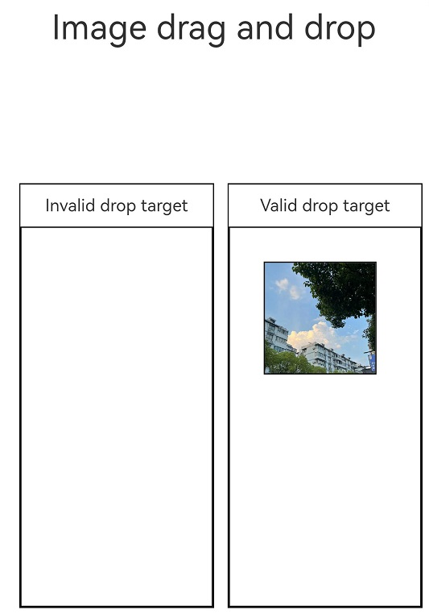
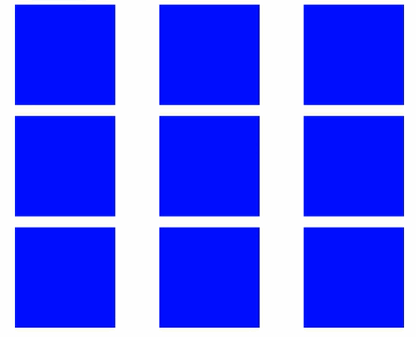

# Drag and Drop Control

The drag and drop control attributes set whether a component can respond to drag events.

> **NOTE**
> 
> The APIs of this module are supported since API version 10. Updates will be marked with a superscript to indicate their earliest API version.

The ArkUI framework implements the drag and drop capability for some components, allowing them to serve as the drag source (from which data can be dragged) or drop target (to which data can be dropped). To enable drag and drop for these components, you only need to set their **draggable** attribute to **true**.<!--RP1--><!--RP1End-->

- The following component supports drag actions by default: [Search](ts-basic-components-search.md), [TextInput](ts-basic-components-textinput.md), [TextArea](ts-basic-components-textarea.md), [RichEditor](ts-basic-components-richeditor.md), [Text](ts-basic-components-text.md), [Image](ts-basic-components-image.md), <!--Del-->[FormComponent](ts-basic-components-formcomponent-sys.md), <!--DelEnd-->[Hyperlink](ts-container-hyperlink.md)

- The following component supports drop actions by default: [Search](ts-basic-components-search.md), [TextInput](ts-basic-components-textinput.md), [TextArea](ts-basic-components-textarea.md), [Video](ts-media-components-video.md), [RichEditor](ts-basic-components-richeditor.md)

You can also define drag responses by implementing common drag events.

To enable drag and drop for other components, you need to set the **draggable** attribute to **true** and implement data transmission in APIs such as **onDragStart**.

## allowDrop

allowDrop(value: Array&lt;UniformDataType&gt; | null)

Sets the type of data that can be dropped to the component.

**Atomic service API**: This API can be used in atomic services since API version 11.

**System capability**: SystemCapability.ArkUI.ArkUI.Full

**Parameters**

| Name| Type                                                        | Mandatory| Description                                           |
| ------ | ------------------------------------------------------------ | ---- | ----------------------------------------------- |
| value  | Array\<[UniformDataType](../../apis-arkdata/js-apis-data-uniformTypeDescriptor.md#uniformdatatype)> \| null<sup>12+</sup> | Yes  | Type of data that can be dropped to the component. Since API version 12, this parameter can be set to **null** to make the component reject all data types.<br>Default value: empty|

## draggable

draggable(value: boolean)

Sets whether the component is draggable.

**Atomic service API**: This API can be used in atomic services since API version 11.

**System capability**: SystemCapability.ArkUI.ArkUI.Full

**Parameters**

| Name| Type   | Mandatory| Description                                          |
| ------ | ------- | ---- | ---------------------------------------------- |
| value  | boolean | Yes  | Whether the component is draggable.<br>Default value: **false**|

## dragPreview<sup>11+</sup>

dragPreview(value: CustomBuilder | DragItemInfo | string)

Sets the preview displayed when the component is dragged

**Atomic service API**: This API can be used in atomic services since API version 12.

**System capability**: SystemCapability.ArkUI.ArkUI.Full

**Parameters**

| Name| Type                                                        | Mandatory| Description                                                        |
| ------ | ------------------------------------------------------------ | ---- | ------------------------------------------------------------ |
| value  | [CustomBuilder](ts-types.md#custombuilder8) \| [DragItemInfo](ts-universal-events-drag-drop.md#dragiteminfo) \| string<sup>12+</sup> | Yes  | Preview displayed when the component is dragged. This attribute has effect for **onDragStart** only.<br>If the component supports drag and drop and a preview is specified through [bindContextMenu](ts-universal-attributes-menu.md#bindcontextmenu8), that specified preview is displayed when the component is dragged. The priority of the background image returned in [onDragStart](ts-universal-events-drag-drop.md#onDragStart) is lower than that of the preview set in [dragPreview](ts-universal-attributes-drag-drop.md#dragPreview11). This means that, once set, the latter will be used in place of the former. Because [CustomBuilder](ts-types.md#custombuilder8) can be used only after offline rendering, it may increase performance overhead and latency. In light of this, you are advised to use [PixelMap](../../apis-image-kit/js-apis-image.md#pixelmap7) in [DragItemInfo](ts-universal-events-drag-drop.md#dragiteminfo) to set the preview.<br> When an ID of the string type is passed in, the snapshot of the component assigned the ID is used as the preview image. If the component assigned the ID cannot be found or its **Visibility** attribute is set to **none** or **hidden**, a snapshot of the current component is used as the preview image. Currently, snapshots do not support visual effects, such as brightness, shadow, blur, and rotation.<br>Default value: empty<br>|

## dragPreviewOptions<sup>11+</sup>

dragPreviewOptions(value: DragPreviewOptions, options?: DragInteractionOptions)

Sets the processing mode of the drag preview and the display of the number badge during dragging. The **onItemDragStart** dragging mode is not supported.

**Atomic service API**: This API can be used in atomic services since API version 12.

**System capability**: SystemCapability.ArkUI.ArkUI.Full

**Parameters**

| Name| Type                                                           | Mandatory| Description                                                        |
| ------ | -------------------------------------------------------------- | ---- | ------------------------------------------------------------ |
| value  | [DragPreviewOptions](#dragpreviewoptions11)<sup>11+</sup>      | Yes  | Processing mode of the drag preview and the display of the number badge during dragging.<br>Default value: empty|
| options<sup>12+</sup>| [DragInteractionOptions](#draginteractionoptions12)<sup>12+</sup>| No  | Interaction mode of the drag preview.<br>Default value: empty|

## DragPreviewOptions<sup>11+</sup>

**Atomic service API**: This API can be used in atomic services since API version 12.

| Name| Type| Mandatory| Description|
| -------- | -------- | -------- | -------- |
| mode | [DragPreviewMode](#dragpreviewmode11)  \|  Array<[DragPreviewMode](#dragpreviewmode11)><sup>12+</sup>| No| How the background image is processed when the component is dragged.<br>Default value: **DragPreviewMode.AUTO**<br>If **DragPreviewMode.AUTO** is along with other enum values, the setting takes precedence with **DragPreviewMode.AUTO**, and other enum values do not take effect.|
| numberBadge<sup>12+</sup> | boolean  \|  number | No| Whether to display the badge or the number displayed via the badge. For a number badge, the value range is [0, 2<sup>31</sup>-1]. If the value specified is a floating-point number, only the integer part is displayed<br>**NOTE**<br>When multiple items are dragged, use this API to set the number of items dragged.<br>Default value: **true**|
| modifier<sup>12+</sup> | [ImageModifier](ts-universal-attributes-attribute-modifier.md)| No| Style modifier to apply to the drag preview. You can use the attributes and styles supported by the image component to configure the drag preview style (see example 6). Currently, opacity, shadow, background blur, and rounded corners are supported. This parameter does not work for text dragging, which only supports the default effect.<br>1. Opacity<br>Use the [opacity](ts-universal-attributes-opacity.md#opacity) attribute to set the opacity. The value ranges from 0 to 1. If the value is set to **0** or left unspecified, it reverts to the default value **0.95**. Setting it to **1** or an invalid value makes the object completely opaque.<br>2. Shadow<br>Use the [shadow](ts-universal-attributes-image-effect.md#shadow) attribute to set the shadow.<br>3. Background blur<br>Use the [backgroundEffect](ts-universal-attributes-background.md#backgroundeffect11) or [backgroundBlurStyle](ts-universal-attributes-background.md#backgroundblurstyle9) attribute to set the background blur. If both are used, **backgroundEffect** takes precedence.<br>4. Rounded corner<br>Use the [border](ts-universal-attributes-border.md#border) or [borderRadius](ts-universal-attributes-border.md#borderRadius) attribute to set rounded corners. If you set rounded corners in both **mode** and **modifier**, the settings in **modifier** prevail.<br>Default value: empty. The attribute cannot be modified.|

## DragPreviewMode<sup>11+</sup>

**Atomic service API**: This API can be used in atomic services since API version 12.

| Name| Value| Description|
| -------- | ------- | -------- |
| AUTO  | 1 | The system automatically changes the position of the dragged point based on the scenario and scales the drag preview based on set rules.|
| DISABLE_SCALE  | 2 | The system does not scale the drag preview.|
| ENABLE_DEFAULT_SHADOW<sup>12+</sup> | 3 | The default shadow effect is enabled for non-text components.|
| ENABLE_DEFAULT_RADIUS<sup>12+</sup> | 4 | The default rounded corners (12 vp) are used for non-text components. If the custom rounded corner value set by the application is greater than the default value or the value set by **modifier**, the custom value is used.|

## DragInteractionOptions<sup>12+</sup>

**Atomic service API**: This API can be used in atomic services since API version 12.

| Name| Type| Mandatory| Description|
| -------- | -------- | -------- | -------- |
| isMultiSelectionEnabled | boolean | No| Whether to enable multiselect for the drag preview. This parameter takes effect only for the [grid items](ts-container-griditem.md) and [list items](ts-container-listitem.md) in the [\<Grid>](ts-container-grid.md) and [\<List>](ts-container-list.md) containers.<br>When multiselect is enabled for an item, the child components of the item cannot be dragged. The precendence levels of drag previews for multiselect, from high to low, are as follows: preview specified through a string value in [dragPreview](#dragpreview11), preview specified through **PixelMap** in **dragPreview**, and component snapshot. The Builder format in **dragPreview** is not supported.<br>The context menu bound to the component through [bindContextMenu](ts-universal-attributes-menu.md#bindcontextmenu12) cannot contain the **isShown** parameter.<br>Default value: **false**<br>|
| defaultAnimationBeforeLifting | boolean | No| Whether to enable the default pressed state animation (compressing in size) of the component before a lift animation starts.<br>Default value: **false**<br>|

## Example
### Example 1
Example of using the **allowDrop** and **draggable** attributes:

```ts
// xxx.ets
import { unifiedDataChannel, uniformTypeDescriptor } from '@kit.ArkData';

@Entry
@Component
struct ImageExample {
  @State uri: string = ""
  @State AblockArr: string[] = []
  @State BblockArr: string[] = []
  @State AVisible: Visibility = Visibility.Visible
  @State dragSuccess :Boolean = false

  build() {
    Column() {
      Text ('Image drag and drop')
        .fontSize('30dp')
      Flex({ direction: FlexDirection.Row, alignItems: ItemAlign.Center, justifyContent: FlexAlign.SpaceAround }) {
        Image($r('app.media.icon'))
          .width(100)
          .height(100)
          .border({ width: 1 })
          .visibility(this.AVisible)
          .draggable(true)
          .onDragEnd((event: DragEvent) => {
            let ret = event.getResult();
            if(ret == 0) {
              console.log("enter ret == 0")
              this.AVisible = Visibility.Hidden;
            } else {
              console.log("enter ret != 0")
              this.AVisible = Visibility.Visible;
            }
          })
      }
      .margin({ bottom: 20 })
      Row() {
        Column(){
          Text('Invalid drop target')
            .fontSize('15dp')
            .height('10%')
          List(){
            ForEach(this.AblockArr, (item:string, index) => {
              ListItem() {
                Image(item)
                  .width(100)
                  .height(100)
                  .border({width: 1})
              }
              .margin({ left: 30 , top : 30})
            }, (item:string) => item)
          }
          .height('90%')
          .width('100%')
          .allowDrop([uniformTypeDescriptor.UniformDataType.TEXT])
          .onDrop((event?: DragEvent, extraParams?: string) => {
            this.uri = JSON.parse(extraParams as string).extraInfo;
            this.AblockArr.splice(JSON.parse(extraParams as string).insertIndex, 0, this.uri);
            console.log("ondrop not udmf data");
          })
          .border({width: 1})
        }
        .height("50%")
        .width("45%")
        .border({ width: 1 })
        .margin({ left: 12 })
        Column(){
          Text ('Valid drop target')
            .fontSize('15dp')
            .height('10%')
          List(){
            ForEach(this.BblockArr, (item:string, index) => {
              ListItem() {
                Image(item)
                  .width(100)
                  .height(100)
                  .border({width: 1})
              }
              .margin({ left: 30 , top : 30})
            }, (item:string) => item)
          }
          .border({width: 1})
          .height('90%')
          .width('100%')
          .allowDrop([uniformTypeDescriptor.UniformDataType.IMAGE])
          .onDrop((event?: DragEvent, extraParams?: string) => {
            console.log("enter onDrop")
            let dragData:UnifiedData = (event as DragEvent).getData() as UnifiedData;
            if(dragData != undefined) {
              let arr:Array<unifiedDataChannel.UnifiedRecord> = dragData.getRecords();
              if(arr.length > 0) {
                let image = arr[0] as unifiedDataChannel.Image;
                this.uri = image.imageUri;
                this.BblockArr.splice(JSON.parse(extraParams as string).insertIndex, 0, this.uri);
              } else {
                console.log(`dragData arr is null`)
              }
            } else {
              console.log(`dragData  is undefined`)
            }
            console.log("ondrop udmf data");
            this.dragSuccess = true
          })
        }
        .height("50%")
        .width("45%")
        .border({ width: 1 })
        .margin({ left: 12 })
      }
    }.width('100%')
  }
}
```




### Example 2
Example of using the **dragPreview** attribute:
```ts
// xxx.ets
@Entry
@Component
struct DragPreviewDemo{
  @Builder dragPreviewBuilder() {
    Column() {
      Text("dragPreview")
        .width(150)
        .height(50)
        .fontSize(20)
        .borderRadius(10)
        .textAlign(TextAlign.Center)
        .fontColor(Color.Black)
        .backgroundColor(Color.Pink)
    }
  }

  @Builder MenuBuilder() {
    Flex({ direction: FlexDirection.Column, justifyContent: FlexAlign.Center, alignItems: ItemAlign.Center }) {
      Text("menu item 1")
        .fontSize(15)
        .width(100)
        .height(40)
        .textAlign(TextAlign.Center)
        .fontColor(Color.Black)
        .backgroundColor(Color.Pink)
      Divider()
        .height(5)
      Text("menu item 2")
        .fontSize(15)
        .width(100)
        .height(40)
        .textAlign(TextAlign.Center)
        .fontColor(Color.Black)
        .backgroundColor(Color.Pink)
    }
    .width(100)
  }

  build() {
    Row() {
      Column() {
        Image('/resource/image.jpeg')
          .width("30%")
          .draggable(true)
          .bindContextMenu(this.MenuBuilder, ResponseType.LongPress)
          .onDragStart(() => {
            console.log("Image onDragStart")
          })
          .dragPreview(this.dragPreviewBuilder)
      }
      .width("100%")
    }
    .height("100%")
  }
}
```


### Example 3
Example of using the **dragPreviewOptions** attribute:
```ts
// xxx.ets
@Entry
@Component
struct dragPreviewOptionsDemo{
  build() {
    Row() {
      Column() {
        Image('/resource/image.jpeg')
          .margin({ top: 10 })
          .width("100%")
          .draggable(true)
          .dragPreviewOptions({ mode: DragPreviewMode.AUTO })
        Image('/resource/image.jpeg')
          .margin({ top: 10 })
          .width("80%")
          .border({ radius: { topLeft: 1, topRight: 2, bottomLeft: 4, bottomRight: 8 } })
          .draggable(true)
          .dragPreviewOptions({ mode: [ DragPreviewMode.ENABLE_DEFAULT_SHADOW, DragPreviewMode.ENABLE_DEFAULT_RADIUS ] })
      }
      .width("100%")
      .height("100%")
    }
  }
}
```


### Example 4
Example of using the **isMultiSelectionEnabled** parameter in **DragInteractionOptions**:
```ts
@Entry
@Component
struct Example {
  @State numbers: number[] = [0, 1, 2, 3, 4 , 5, 6, 7, 8]
  build() {
    Column({ space: 5}) {
      Grid() {
        ForEach(this.numbers, (item: number) => {
          GridItem() {
            Column()
              .backgroundColor(Color.Red)
              .width('100%')
              .height('100%')
          }
          .width(90)
          .height(90)
          .selectable(true)
          .selected(true)
          .dragPreviewOptions({}, {isMultiSelectionEnabled:true})
          .onDragStart(()=>{

          })
    }, (item: string) => item)
      }
      .columnsTemplate('1fr 1fr 1fr')
      .rowsTemplate('1fr 1fr 1fr')
      .height(300)
    }
    .width('100%')
  }
}
```


### Example 5
Example of using the **defaultAnimationBeforeLifting** parameter in **DragInteractionOptions**:
```ts
@Entry
@Component
struct Example {
  @State numbers: number[] = [0, 1, 2, 3, 4 , 5, 6, 7, 8]
  build() {
    Column({ space: 5}) {
      Grid() {
        ForEach(this.numbers, (item: number) => {
          GridItem() {
            Column()
              .backgroundColor(Color.Red)
              .width('100%')
              .height('100%')
          }
          .width(90)
          .height(90)
          .selectable(true)
          .selected(true)
          .dragPreviewOptions({}, {isMultiSelectionEnabled:true, defaultAnimationBeforeLifting:true})
          .onDragStart(()=>{

          })
    }, (item: string) => item)
      }
      .columnsTemplate('1fr 1fr 1fr')
      .rowsTemplate('1fr 1fr 1fr')
      .height(300)
    }
    .width('100%')
  }
}
```



### Example 6
This example shows how to use the **ImageModifier** parameter in **dragPreviewOptions**.
```ts
// xxx.ets
import { ImageModifier } from '@kit.ArkUI'

@Entry
@Component
struct dragPreviewOptionsDemo{
  @State myModifier: ImageAttribute = new ImageModifier().opacity(0.5)
  @State vis: boolean = true
  @State changeValue: string = ''
  @State submitValue: string = ''
  @State positionInfo: CaretOffset = { index: 0, x: 0, y: 0 }
  controller: SearchController = new SearchController()
  @State OpacityIndex: number = 0
  @State OpacityList:(number | undefined | null)[]=[
    0.3,0.5,0.7,1,-50,0,10,undefined,null
  ]
  build() {
    Row() {
      Column() {
        Text(this.OpacityList[this.OpacityIndex] + "")
        Button("Opacity")
          .onClick(()=> {
            this.OpacityIndex++
            if(this.OpacityIndex > this.OpacityList.length - 1){
              this.OpacityIndex = 0
            }
          })
        Image($r('app.media.image'))
          .margin({ top: 10 })
          .width("100%")
          .draggable(true)
          .dragPreviewOptions({modifier: this.myModifier.opacity(this.OpacityList[this.OpacityIndex]) as ImageModifier})
      }
      .width("50%")
      .height("50%")
    }
  }
}
```


