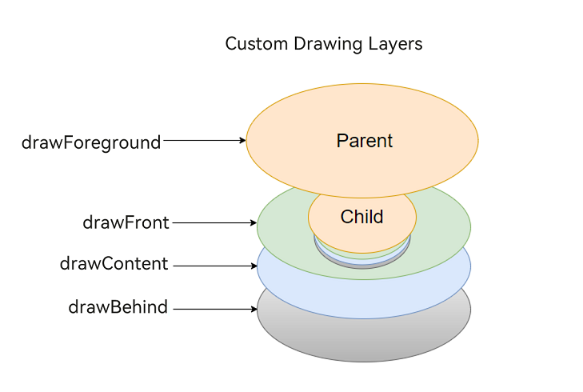
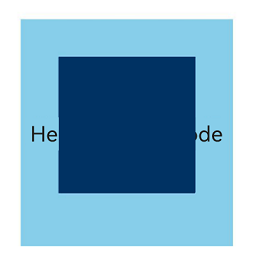

# Drawing Modifier

If the drawn content of some components does not meet the requirements, you can use the custom drawing features to draw part or all of the components to achieve the expected effect. For example, you can create buttons in special shapes or icons that mix text and imagery. The drawing modifier offers higher flexibility in your custom drawing.

> **NOTE**
>
> The initial APIs of this module are supported since API version 12. Updates will be marked with a superscript to indicate their earliest API version.

## drawModifier

drawModifier(modifier: DrawModifier | undefined): T

Creates a drawing modifier.

**Atomic service API**: This API can be used in atomic services since API version 12.

**System capability**: SystemCapability.ArkUI.ArkUI.Full

**Supported components:**

AlphabetIndexer, Badge, Blank, Button, CalendarPicker, Checkbox, CheckboxGroup, Circle, Column, ColumnSplit, Counter, DataPanel, DatePicker, Ellipse, Flex, FlowItem, FolderStack, FormLink, Gauge, Grid, GridCol, GridItem, GridRow, Hyperlink, Image, ImageAnimator, ImageSpan, Line, List, ListItem, ListItemGroup, LoadingProgress, Marquee, Menu, MenuItem, MenuItemGroup, NavDestination, Navigation, Navigator, NavRouter, NodeContainer, Path, PatternLock, Polygon, Polyline, Progress, QRCode, Radio, Rating, Rect, Refresh, RelativeContainer, RichEditor, Row, RowSplit, Scroll, ScrollBar, Search, Select, Shape, SideBarContainer, Slider, Stack, Stepper, StepperItem, Swiper, SymbolGlyph, TabContent, Tabs, Text, TextArea, TextClock, TextInput, TextPicker, TextTimer, TimePicker, Toggle, WaterFlow, XComponent

**Parameters**

| Name| Type                                                | Mandatory| Description                                                        |
| ------ | ---------------------------------------------------- | ---- | ------------------------------------------------------------ |
| modifier  |  [DrawModifier](#drawmodifier-1) \| undefined | Yes  | Custom drawing modifier, which defines the logic of custom drawing.<br> Default value: **undefined**<br>**NOTE**<br> A custom modifier applies only to the FrameNode of the currently bound component, not to its subnodes.|

**Return value**

| Type| Description|
| --- | --- |
| T | Current component.|

## DrawModifier

Implements a **DrawModifier** instance for using the **drawForeground**, **drawFront**, **drawContent**, and **drawBehind** APIs for custom drawing as well as the [invalidate](#invalidate) API for redrawing. Each **DrawModifier** instance can be set for only one component. Repeated setting is not allowed.

The figure below shows the custom drawing layers.



**Atomic service API**: This API can be used in atomic services since API version 12.

**System capability**: SystemCapability.ArkUI.ArkUI.Full

### drawFront

drawFront?(drawContext: DrawContext): void

Draws the content foreground. Override this method to implement custom content foreground drawing.

**Atomic service API**: This API can be used in atomic services since API version 12.

**System capability**: SystemCapability.ArkUI.ArkUI.Full

**Parameters**

| Name | Type                                                  | Mandatory| Description            |
| ------- | ------------------------------------------------------ | ---- | ---------------- |
| drawContext | [DrawContext](../js-apis-arkui-graphics.md#drawcontext) | Yes  | Graphics drawing context.|

### drawContent

drawContent?(drawContext: DrawContext): void

Draws the content. Override this method to implement custom content drawing, which will replace the component's default content drawing function.

**Atomic service API**: This API can be used in atomic services since API version 12.

**System capability**: SystemCapability.ArkUI.ArkUI.Full

**Parameters**

| Name | Type                                                  | Mandatory| Description            |
| ------- | ------------------------------------------------------ | ---- | ---------------- |
| drawContext | [DrawContext](../js-apis-arkui-graphics.md#drawcontext) | Yes  | Graphics drawing context.|

### drawBehind

drawBehind?(drawContext: DrawContext): void

Draws the background. Override this method to implement custom background drawing.

**Atomic service API**: This API can be used in atomic services since API version 12.

**System capability**: SystemCapability.ArkUI.ArkUI.Full

**Parameters**

| Name | Type                                                  | Mandatory| Description            |
| ------- | ------------------------------------------------------ | ---- | ---------------- |
| drawContext | [DrawContext](../js-apis-arkui-graphics.md#drawcontext) | Yes  | Graphics drawing context.|

### drawForeground<sup>20+</sup>

drawForeground?(drawContext: DrawContext): void

Draws the foreground. Override this method to implement custom foreground drawing.

**Atomic service API**: This API can be used in atomic services since API version 20.

**System capability**: SystemCapability.ArkUI.ArkUI.Full

**Parameters**

| Name | Type                                                  | Mandatory| Description            |
| ------- | ------------------------------------------------------ | ---- | ---------------- |
| drawContext | [DrawContext](../js-apis-arkui-graphics.md#drawcontext) | Yes  | Graphics drawing context.|

### invalidate

invalidate(): void

Triggers redrawing of the bound component. No overloading is allowed or needed.

**Atomic service API**: This API can be used in atomic services since API version 12.

**System capability**: SystemCapability.ArkUI.ArkUI.Full

## Example

### Example 1: Implementing Custom Drawing Through DrawModifier

This example shows how to implement custom drawing for a **Text** component using **DrawModifier**.

```ts
// xxx.ets
import { drawing } from '@kit.ArkGraphics2D';
import { AnimatorResult } from '@kit.ArkUI';

class MyFullDrawModifier extends DrawModifier {
  public scaleX: number = 1;
  public scaleY: number = 1;
  uiContext: UIContext;

  constructor(uiContext: UIContext) {
    super();
    this.uiContext = uiContext;
  }

  drawBehind(context: DrawContext): void {
    const brush = new drawing.Brush();
    brush.setColor({
      alpha: 255,
      red: 255,
      green: 0,
      blue: 0
    });
    context.canvas.attachBrush(brush);
    const halfWidth = context.size.width / 2;
    const halfHeight = context.size.width / 2;
    context.canvas.drawRect({
      left: this.uiContext.vp2px(halfWidth - 50 * this.scaleX),
      top: this.uiContext.vp2px(halfHeight - 50 * this.scaleY),
      right: this.uiContext.vp2px(halfWidth + 50 * this.scaleX),
      bottom: this.uiContext.vp2px(halfHeight + 50 * this.scaleY)
    });
  }

  drawContent(context: DrawContext): void {
    const brush = new drawing.Brush();
    brush.setColor({
      alpha: 255,
      red: 0,
      green: 255,
      blue: 0
    });
    context.canvas.attachBrush(brush);
    const halfWidth = context.size.width / 2;
    const halfHeight = context.size.width / 2;
    context.canvas.drawRect({
      left: this.uiContext.vp2px(halfWidth - 30 * this.scaleX),
      top: this.uiContext.vp2px(halfHeight - 30 * this.scaleY),
      right: this.uiContext.vp2px(halfWidth + 30 * this.scaleX),
      bottom: this.uiContext.vp2px(halfHeight + 30 * this.scaleY)
    });
  }

  drawFront(context: DrawContext): void {
    const brush = new drawing.Brush();
    brush.setColor({
      alpha: 255,
      red: 0,
      green: 0,
      blue: 255
    });
    context.canvas.attachBrush(brush);
    const halfWidth = context.size.width / 2;
    const halfHeight = context.size.width / 2;
    const radiusScale = (this.scaleX + this.scaleY) / 2;
    context.canvas.drawCircle(this.uiContext.vp2px(halfWidth), this.uiContext.vp2px(halfHeight), this.uiContext.vp2px(20 * radiusScale));
  }
}

class MyFrontDrawModifier extends DrawModifier {
  public scaleX: number = 1;
  public scaleY: number = 1;
  uiContext: UIContext;

  constructor(uiContext: UIContext) {
    super();
    this.uiContext = uiContext;
  }

  drawFront(context: DrawContext): void {
    const brush = new drawing.Brush();
    brush.setColor({
      alpha: 255,
      red: 0,
      green: 0,
      blue: 255
    });
    context.canvas.attachBrush(brush);
    const halfWidth = context.size.width / 2;
    const halfHeight = context.size.width / 2;
    const radiusScale = (this.scaleX + this.scaleY) / 2;
    context.canvas.drawCircle(this.uiContext.vp2px(halfWidth), this.uiContext.vp2px(halfHeight), this.uiContext.vp2px(20 * radiusScale));
  }
}

@Entry
@Component
struct DrawModifierExample {
  private fullModifier: MyFullDrawModifier = new MyFullDrawModifier(this.getUIContext());
  private frontModifier: MyFrontDrawModifier = new MyFrontDrawModifier(this.getUIContext());
  private drawAnimator: AnimatorResult | undefined = undefined;
  @State modifier: DrawModifier = new MyFrontDrawModifier(this.getUIContext());
  private count = 0;

  create() {
    let self = this;
    this.drawAnimator = this.getUIContext().createAnimator({
      duration: 1000,
      easing: 'ease',
      delay: 0,
      fill: 'forwards',
      direction: 'normal',
      iterations: 1,
      begin: 0,
      end: 2
    });
    this.drawAnimator.onFrame = (value: number) => {
      console.log('frame value =', value);
      const tempModifier = self.modifier as MyFullDrawModifier | MyFrontDrawModifier;
      tempModifier.scaleX = Math.abs(value - 1);
      tempModifier.scaleY = Math.abs(value - 1);
      self.modifier.invalidate();
    };
  }

  build() {
    Column() {
      Row() {
        Text('test text')
          .width(100)
          .height(100)
          .margin(10)
          .backgroundColor(Color.Gray)
          .onClick(() => {
            const tempModifier = this.modifier as MyFullDrawModifier | MyFrontDrawModifier;
            tempModifier.scaleX -= 0.1;
            tempModifier.scaleY -= 0.1;
          })
          .drawModifier(this.modifier)
      }

      Row() {
        Button('create')
          .width(100)
          .height(100)
          .margin(10)
          .onClick(() => {
            this.create();
          })
        Button('play')
          .width(100)
          .height(100)
          .margin(10)
          .onClick(() => {
            if (this.drawAnimator) {
              this.drawAnimator.play();
            }
          })
        Button('changeModifier')
          .width(100)
          .height(100)
          .margin(10)
          .onClick(() => {
            this.count += 1;
            if (this.count % 2 === 1) {
              console.log('change to full modifier');
              this.modifier = this.fullModifier;
            } else {
              console.log('change to front modifier');
              this.modifier = this.frontModifier;
            }
          })
      }
    }
    .width('100%')
    .height('100%')
  }
}
```


### Example 2: Implementing Custom Foreground Drawing for a Container Through DrawModifier

This example demonstrates how to implement custom foreground drawing for a **Column** container using **DrawModifier**.

```ts
// xxx.ets
import { drawing } from '@kit.ArkGraphics2D';

class MyForegroundDrawModifier extends DrawModifier {
  public scaleX: number = 3;
  public scaleY: number = 3;
  uiContext: UIContext;

  constructor(uiContext: UIContext) {
    super();
    this.uiContext = uiContext;
  }

  drawForeground(context: DrawContext): void {
    const brush = new drawing.Brush();
    brush.setColor({
      alpha: 255,
      red: 0,
      green: 50,
      blue: 100
    });
    context.canvas.attachBrush(brush);
    const halfWidth = context.size.width / 2;
    const halfHeight = context.size.width / 2;
    context.canvas.drawRect({
      left: this.uiContext.vp2px(halfWidth - 30 * this.scaleX),
      top: this.uiContext.vp2px(halfHeight - 30 * this.scaleY),
      right: this.uiContext.vp2px(halfWidth + 30 * this.scaleX),
      bottom: this.uiContext.vp2px(halfHeight + 30 * this.scaleY)
    });
  }
}

@Entry
@Component
struct DrawModifierExample {
  private foregroundModifier: MyForegroundDrawModifier = new MyForegroundDrawModifier(this.getUIContext());

  build() {
    Column() {
      Text('Here is a child node')
        .fontSize(36)
        .width('100%')
        .height('100%')
        .textAlign(TextAlign.Center)
    }
    .margin(50)
    .width(280)
    .height(300)
    .backgroundColor(0x87CEEB)
    .drawModifier(this.foregroundModifier)
  }
}

```

