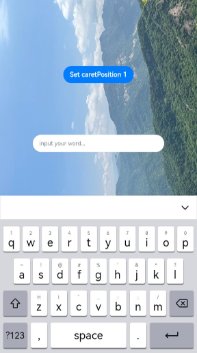
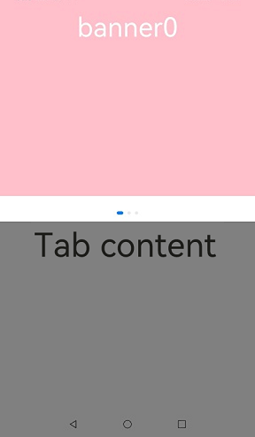
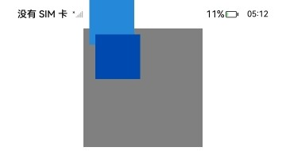
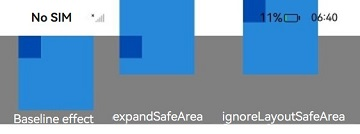

# Safe Area
<!--Kit: ArkUI-->
<!--Subsystem: ArkUI-->
<!--Owner: @WendongPang-->
<!--Designer: @lanshouren-->
<!--Tester: @liuli0427-->
<!--Adviser: @HelloCrease-->

A safe area refers to the display area that is not covered by system-defined non-safe area components such as the status bar, navigation bar, or other system UI elements. By default, all content you develop is placed within the safe area. If necessary, you can expand a component's safe area through the [expandSafeArea](#expandsafearea) attribute. This allows the component to extend its rendering area beyond the safe area without altering the layout. In addition, you can specify how to make space for the virtual keyboard through the [setKeyboardAvoidMode](#setkeyboardavoidmode11) attribute. To prevent text elements, such as a title bar, from overlapping with non-safe areas, you are advised to set the **expandSafeArea** attribute for the component to achieve an immersive effect. Alternatively, you can use the [setWindowLayoutFullScreen](../arkts-apis-window-Window.md#setwindowlayoutfullscreen9) API directly to set an immersive layout.

> **NOTE**
>
> This attribute is supported since API version 10. Updates will be marked with a superscript to indicate their earliest API version.<br>
> The camera cutout area is not considered part of the non-safe area by default, and pages do not automatically avoid it.<br>
> You can set the camera cutout area as a non-safe area since API version 12, so that content is not displayed in this area. To do so, add the following to the **module.json5** file:<br>
  "metadata": [<br>
      {<br>
        "name": "avoid_cutout",<br>
        "value": "true",<br>
      }<br>
  ],<br>
  

## expandSafeArea

expandSafeArea(types?: Array&lt;SafeAreaType&gt;, edges?: Array&lt;SafeAreaEdge&gt;): T

Sets the safe area to be expanded to.

**Atomic service API**: This API can be used in atomic services since API version 11.

**System capability**: SystemCapability.ArkUI.ArkUI.Full

**Parameters**

| Name| Type                                              | Mandatory| Description                                                        |
| ------ | -------------------------------------------------- | ---- | ------------------------------------------------------------ |
| types  | Array <[SafeAreaType](#safeareatype)> | No  | Types of non-safe areas to extend into. For the **CUTOUT** type to take effect, the [Metadata](../../apis-ability-kit/js-apis-bundleManager-metadata.md) item must be added to the configuration file.<br>Default value: **[SafeAreaType.SYSTEM, SafeAreaType.CUTOUT, SafeAreaType.KEYBOARD]**<br>Invalid values are treated as the default value.|
| edges  | Array <[SafeAreaEdge](#safeareaedge)> | No  | Edges for expanding the safe area.<br>Default value: **[SafeAreaEdge.TOP, SafeAreaEdge.BOTTOM, SafeAreaEdge.START, SafeAreaEdge.END]**<br>Invalid values are treated as the default value.<br>The default value means to extend to all non-safe areas.|

**Return value**

| Type| Description|
| --- | --- |
|  T | Current component.|

>  **NOTE**
>
>  When using **expandSafeArea** to expand the drawing of a component, avoid setting a fixed width or height for the component (except for percentages). If a fixed width or height is set, the edges for the expanded safe area can only be [SafeAreaEdge.TOP, SafeAreaEdge.START], and the size of the component remains unchanged after the expansion.
>
>  The safe area does not restrict the layout or size of components inside, nor does it clip the components.
>
>  If the parent container is a scrollable container, the **expandSafeArea** attribute does not take effect.
>
>  When **expandSafeArea()** is set, no parameter is passed in, and the default value is used. When **expandSafeArea([],[])** is set, an empty array is passed in, and the settings do not take effect.
>   
>  Prerequisites for the **expandSafeArea** attribute to take effect: 
>  1. When **type** is set to **SafeAreaType.KEYBOARD**, the settings take effect by default. This behaves as the component not avoiding the virtual keyboard.<br>
>  2. When **type** is set to any other value, the settings take effect only if its boundaries overlap with the safe area. For example, if the height of the status bar is 100, the absolute position of the component on the screen must be 0 <= y <= 100 for the settings to take effect.
>   
>  When a component extends into a non-safe area, events in the non-safe area (such as click events) may be intercepted by the system. Built-in components like the status bar will be given priority to respond to these events.
>  
>  Avoid setting the **expandSafeArea** attribute for components within scrollable containers. If you do set it, you must apply the **expandSafeArea** attribute to all direct nodes from the current node to the scrollable ancestor container, following the component nesting relationship. Otherwise, the **expandSafeArea** attribute may become ineffective after scrolling. For the correct implementation, see [Example 7](#example-7-expanding-the-safe-area-in-scrollable-containers).
> 
>  The **expandSafeArea** attribute only affects the current component and does not propagate to parent or child components. Therefore, all relevant components must be configured individually.
> 
>  When both **expandSafeArea** and **position** attributes are set, the **position** attribute takes effect first, followed by the **expandSafeArea** attribute. For components that do not have **position**, **offset**, or other rendering attributes set, such as dialog boxes and sheets, the **expandSafeArea** attribute will not take effect if their boundaries do not overlap with the non-safe area.
> 
>  In scenarios where the **expandSafeArea** attribute is ineffective, and you need to place a component in the safe area, you will need to manually adjust the component's coordinates.

## SafeAreaType

Enumerates the types for expanding layout safe areas.

**Atomic service API**: This API can be used in atomic services since API version 11.

**System capability**: SystemCapability.ArkUI.ArkUI.Full

| Name   | Value  | Description                              |
| ------- | ---- | ---------------------------------- |
| SYSTEM   |-| Default non-safe area of the system, including the status bar and navigation bar.  |
| CUTOUT   |- | Device-specific non-safe area, such as the notch area or camera cutout area.|
| KEYBOARD |- |Soft keyboard area.                              |

## SafeAreaEdge

Enumerates the edges for expanding the safe area.

**Atomic service API**: This API can be used in atomic services since API version 11.

**System capability**: SystemCapability.ArkUI.ArkUI.Full

| Name   | Value  | Description                              |
| ------- | ---- | ---------------------------------- |
| TOP    |-| Top edge.|
| BOTTOM |-| Bottom edge.|
| START  |-| Start edge.|
| END    |-| End edge.|

## setKeyboardAvoidMode<sup>11+</sup>

setKeyboardAvoidMode(value: KeyboardAvoidMode): void

Sets the avoidance mode for the virtual keyboard.

**Atomic service API**: This API can be used in atomic services since API version 11.

**System capability**: SystemCapability.ArkUI.ArkUI.Full

**Parameters**

| Name| Type                                                | Mandatory| Description                                                        |
| ------ | ---------------------------------------------------- | ---- | ------------------------------------------------------------ |
| value  | [KeyboardAvoidMode](../arkts-apis-uicontext-e.md#keyboardavoidmode11) | Yes  | Avoidance mode of the virtual keyboard.<br>Default value: **KeyboardAvoidMode.OFFSET**, which means that the page moves up when the keyboard is displayed.|

>  **NOTE**
>
>  With **KeyboardAvoidMode.RESIZE**, the page is resized to prevent the virtual keyboard from obstructing the view. Regarding components on the page, those whose width and height are set in percentage are resized with the page, and those whose width and height are set to specific values are laid out according to their settings. With **KeyboardAvoidMode.RESIZE**, **expandSafeArea([SafeAreaType.KEYBOARD],[SafeAreaEdge.BOTTOM])** does not take effect.
>
>  With **KeyboardAvoidMode.NONE**, keyboard avoidance is disabled, and the page will be covered by the displayed keyboard.
>
>  **setKeyboardAvoidMode** only affects page layouts. It does not apply to popup components, including the following: **Dialog**, **Popup**, **Menu**, **BindSheet**, **BindContentCover**, **Toast**, **OverlayManager**. For details about the avoidance mode of popup components, see [CustomDialogControllerOptions](./ts-methods-custom-dialog-box.md#customdialogcontrolleroptions).

## getKeyboardAvoidMode<sup>11+</sup>

getKeyboardAvoidMode(): KeyboardAvoidMode

Obtains the avoidance mode of the virtual keyboard.

**Atomic service API**: This API can be used in atomic services since API version 11.

**System capability**: SystemCapability.ArkUI.ArkUI.Full

**Return value**

| Name                                                | Description                              |
| ---------------------------------------------------- | ---------------------------------- |
| [KeyboardAvoidMode](../arkts-apis-uicontext-e.md#keyboardavoidmode11) | Avoidance mode of the virtual keyboard.|

## ignoreLayoutSafeArea<sup>20+</sup>

ignoreLayoutSafeArea(types?: Array&lt;LayoutSafeAreaType&gt;, edges?: Array&lt;LayoutSafeAreaEdge&gt;): T

Ignores the safe area for component layout.

**Atomic service API**: This API can be used in atomic services since API version 20.

**System capability**: SystemCapability.ArkUI.ArkUI.Full

**Parameters**

| Name| Type                                              | Mandatory| Description                                                        |
| ------ | -------------------------------------------------- | ---- | ------------------------------------------------------------ |
| types  | Array <[LayoutSafeAreaType](#layoutsafeareatype12)> | No  | Types of layout safe areas to expand.<br>Default value: [LayoutSafeAreaType.SYSTEM] (expands to all safe areas, including the status bar, navigation bar, and [component-level safe area (**safeAreaPadding**)](./ts-universal-attributes-size.md#safeareapadding14).<br>Invalid values are treated as the default value.|
| edges  | Array <[LayoutSafeAreaEdge](#layoutsafeareaedge12)> | No  | Edges of the layout safe area to expand, with mirroring capability supported.<br>Default value: [LayoutSafeAreaEdge.ALL] (expands all edges of the component).<br>Invalid values are treated as the default value.|

**Return value**

| Type| Description|
| --- | --- |
|  T | Current component.|

>  **NOTE**
>
> For a component that ignores layout safe area edges: If its width or height is set to [LayoutPolicy.matchParent](ts-universal-attributes-size.md#layoutpolicy15), both its size and position will change; otherwise, only its position will change.
>
> Based on the **safeAreaPadding** accumulation feature, a component can expand its safe area edges to all detectable continuous safe areas.
>
> When child elements of scrollable components ignore layout safe area edges, the safe areas of the scrollable component itself and its parent components are not considered in the scrolling direction. Scrollable components include **List**, **ArcListItem**, **Grid**, **WaterFlow**, **Swiper**, and **Tabs**.
>
> When both the layout safe area ignore attribute (**.ignoreLayoutSafeArea**) and the rendering safe area ignore attribute (**.expandSafeArea**) are set: **.ignoreLayoutSafeArea** takes effect first, and **.expandSafeArea** takes effect on the basis of the former.

## LayoutSafeAreaType<sup>12+</sup>

Enumerates the types for expanding layout safe areas.

**Atomic service API**: This API can be used in atomic services since API version 12.

**System capability**: SystemCapability.ArkUI.ArkUI.Full

| Name   | Value  | Description                              |
| ------- | ---- | ---------------------------------- |
| SYSTEM   |  0 |The component's layout range can be expanded to include both [component-level safe areas (safeAreaPadding)](./ts-universal-attributes-size.md#safeareapadding14) and page-level safe areas (status bar, navigation bar, and cutout area).  |

## LayoutSafeAreaEdge<sup>12+</sup>

Enumerates the edges for expanding the safe area.

**System capability**: SystemCapability.ArkUI.ArkUI.Full

| Name   | Value  | Description                              |
| ------- | ---- | ---------------------------------- |
| TOP    | 0 | Top edge.<br>**Atomic service API**: This API can be used in atomic services since API version 12.|
| BOTTOM | 1 | Bottom edge.<br>**Atomic service API**: This API can be used in atomic services since API version 12.|
| START<sup>20+</sup>      | 2 | Start edge. This represents the left edge for in LTR mode and the right edge in RTL mode.<br>**Atomic service API**: This API can be used in atomic services since API version 20.|
| END<sup>20+</sup>        | 3 |End edge. This represents the right edge for in LTR mode and the left edge in RTL mode.<br>**Atomic service API**: This API can be used in atomic services since API version 20.|
| VERTICAL<sup>20+</sup>   | 4 |Vertical edges.<br>**Atomic service API**: This API can be used in atomic services since API version 20.|
| HORIZONTAL<sup>20+</sup> | 5 |Horizontal edges.<br>**Atomic service API**: This API can be used in atomic services since API version 20.|
| ALL<sup>20+</sup>        | 6 |All edges.<br>**Atomic service API**: This API can be used in atomic services since API version 20.|

## Example

### Example 1: Implementing an Immersive Effect

This example demonstrates how to use the **expandSafeArea** attribute to expand the safe area to the top and bottom to achieve an immersive effect.

```ts
// xxx.ets
@Entry
@Component
struct SafeAreaExample1 {
  @State text: string = ''
  controller: TextInputController = new TextInputController()

  build() {
    Row() {
        Column()
          .height('100%').width('100%')
          .backgroundImage($r('app.media.bg')).backgroundImageSize(ImageSize.Cover)
          .expandSafeArea([SafeAreaType.SYSTEM], [SafeAreaEdge.TOP, SafeAreaEdge.BOTTOM])
    }.height('100%')
  }
}
```


### Example 2: Setting a Fixed Width or Height with expandSafeArea

This example demonstrates the effect of setting both a fixed width or height and the **expandSafeArea** attribute.

```ts
// xxx.ets
@Entry
@Component
struct SafeAreaExample2 {
  @State text: string = ''
  controller: TextInputController = new TextInputController()

  build() {
    Column() {
      TextInput({ text: this.text, placeholder: 'input your word...', controller: this.controller })
        .placeholderFont({ size: 14, weight: 400 })
        .width(320).height(40).offset({y: 120})
        .fontSize(14).fontColor(Color.Black)
        .backgroundColor(Color.White)
    }
    .height('780')
    .width('100%')
    .backgroundColor('rgb(179,217,235)')
    .expandSafeArea([SafeAreaType.SYSTEM], [SafeAreaEdge.TOP, SafeAreaEdge.BOTTOM])
  }
}
```

As shown in the figure below, the **Column** component expands to the top status bar ([SafeAreaEdge.TOP]) but does not expand to the bottom navigation bar ([SafeAreaEdge.BOTTOM]). The height of the component after expansion remains consistent with the set height.


### Example 3: Fixing the Background Image Position During Keyboard Avoidance

This example shows how to set the **expandSafeArea** attribute for the background image to keep it fixed when the keyboard is displayed and the layout is adjusted.

```ts
// xxx.ets
@Entry
@Component
struct SafeAreaExample3 {
  @State text: string = ''
  controller: TextInputController = new TextInputController()

  build() {
    Row() {
      Stack() {
        Column()
          .height('100%').width('100%')
          .backgroundImage($r('app.media.bg')).backgroundImageSize(ImageSize.Cover)
          .expandSafeArea([SafeAreaType.KEYBOARD, SafeAreaType.SYSTEM])
        Column() {
          Button('Set caretPosition 1')
            .onClick(() => {
              this.controller.caretPosition(1)
            })
          TextInput({ text: this.text, placeholder: 'input your word...', controller: this.controller })
            .placeholderFont({ size: 14, weight: 400 })
            .width(320).height(40).offset({y: 120})
            .fontSize(14).fontColor(Color.Black)
            .backgroundColor(Color.White)
        }.width('100%').alignItems(HorizontalAlign.Center)
      }
    }.height('100%')
  }
}
```



### Example 4: Setting the Keyboard Avoidance Mode to Resize

This example demonstrates how to use **setKeyboardAvoidMode** to set the keyboard avoidance mode to **RESIZE**, which resizes the page when the keyboard is displayed.

<!--code_no_check-->
```ts
// EntryAbility.ets
import { KeyboardAvoidMode } from '@kit.ArkUI';
export default class EntryAbility extends UIAbility{
  onWindowStageCreate(windowStage: window.WindowStage) {
    // Main window is created, set main page for this ability
    hilog.info(0x0000, 'testTag', '%{public}s', 'Ability onWindowStageCreate');

    windowStage.loadContent('pages/Index', (err, data) => {
      let keyboardAvoidMode = windowStage.getMainWindowSync().getUIContext().getKeyboardAvoidMode();
      // When the virtual keyboard is displayed, the page is resized to its original height minus the keyboard height.
    windowStage.getMainWindowSync().getUIContext().setKeyboardAvoidMode(KeyboardAvoidMode.RESIZE);
      if (err.code) {
        hilog.error(0x0000, 'testTag', 'Failed to load the content. Cause: %{public}s', JSON.stringify(err) ?? '');
        return;
      }
      hilog.info(0x0000, 'testTag', 'Succeeded in loading the content. Data: %{public}s', JSON.stringify(data) ?? '');
    });
  }
}
```

```ts
// xxx.ets
@Entry
@Component
struct KeyboardAvoidExample1 {
  build() {
    Column() {
      Row().height("30%").width("100%").backgroundColor(Color.Gray)
      TextArea().width("100%").borderWidth(1)
      Text("I can see the bottom of the page").width("100%").textAlign(TextAlign.Center).backgroundColor('rgb(179,217,235)').layoutWeight(1)
    }.width('100%').height("100%")
  }
}
```


### Example 5: Setting Keyboard Avoidance Mode to Offset

This example demonstrates how to use **setKeyboardAvoidMode** to set the keyboard avoidance mode to **OFFSET**, which lifts the page when the keyboard is displayed. However, if the input cursor is positioned more than the keyboard's height from the bottom of the screen, the page will not be lifted, as demonstrated in this example.

<!--code_no_check-->
```ts
// EntryAbility.ets
import { KeyboardAvoidMode } from '@kit.ArkUI';
export default class EntryAbility extends UIAbility{
  onWindowStageCreate(windowStage: window.WindowStage) {
    // Main window is created, set main page for this ability
    hilog.info(0x0000, 'testTag', '%{public}s', 'Ability onWindowStageCreate');

    windowStage.loadContent('pages/Index', (err, data) => {
      let keyboardAvoidMode = windowStage.getMainWindowSync().getUIContext().getKeyboardAvoidMode();
      // When the virtual keyboard is displayed, the page is moved up until the caret is displayed.
    windowStage.getMainWindowSync().getUIContext().setKeyboardAvoidMode(KeyboardAvoidMode.OFFSET);
      if (err.code) {
        hilog.error(0x0000, 'testTag', 'Failed to load the content. Cause: %{public}s', JSON.stringify(err) ?? '');
        return;
      }
      hilog.info(0x0000, 'testTag', 'Succeeded in loading the content. Data: %{public}s', JSON.stringify(data) ?? '');
    });
  }
}
```

```ts
// xxx.ets
@Entry
@Component
struct KeyboardAvoidExample2 {
  build() {
    Column() {
      Row().height("30%").width("100%").backgroundColor(Color.Gray)
      TextArea().width("100%").borderWidth(1)
      Text("I can see the bottom of the page").width("100%").textAlign(TextAlign.Center).backgroundColor('rgb(179,217,235)').layoutWeight(1)
    }.width('100%').height("100%")
  }
}
```


### Example 6: Switching Avoidance Modes

This example demonstrates how to switch between **OFFSET**, **RESIZE**, and **NONE** modes using **setKeyboardAvoidMode** to achieve three different keyboard avoidance effects.

```ts
import { hilog } from '@kit.PerformanceAnalysisKit';
import { KeyboardAvoidMode } from '@kit.ArkUI';
@Entry
@Component

struct KeyboardAvoidExample3 {
  build() {
    Column() {
      Row({space:15}) {
        Button('OFFSET')
          .onClick(() => {
            this.getUIContext().setKeyboardAvoidMode(KeyboardAvoidMode.OFFSET);
            hilog.info(0x0000, 'keyboardAvoidMode: %{public}s', JSON.stringify(this.getUIContext().getKeyboardAvoidMode()));
          })
          .layoutWeight(1)
        Button('RESIZE')
          .onClick(() => {
            this.getUIContext().setKeyboardAvoidMode(KeyboardAvoidMode.RESIZE);
            hilog.info(0x0000, 'keyboardAvoidMode: %{public}s', JSON.stringify(this.getUIContext().getKeyboardAvoidMode()));
          })
          .layoutWeight(1)
        Button('NONE')
          .onClick(() => {
            this.getUIContext().setKeyboardAvoidMode(KeyboardAvoidMode.NONE);
            hilog.info(0x0000, 'keyboardAvoidMode: %{public}s', JSON.stringify(this.getUIContext().getKeyboardAvoidMode()));
          })
          .layoutWeight(1)
      }
      .height("30%")
      .width("100%")
      .backgroundColor(Color.Gray)

      TextArea()
        .width("100%")
        .borderWidth(1)
      
      Text("I can see the bottom of the page")
        .width("100%")
        .textAlign(TextAlign.Center)
        .backgroundColor('rgb(179,217,235)')
        .layoutWeight(1)
      
      TextArea()
        .width("100%")
        .borderWidth(1)
    }
    .width('100%')
    .height("100%")
  }
}
```
OFFSET mode


RESIZE mode


NONE mode


### Example 7: Expanding the Safe Area in Scrollable Containers

This example demonstrates how to use the **expandSafeArea** attribute in a scrollable container to implement an immersive effect. The **Swiper** component in the **Scroll** container can extend into the status bar.

```ts
class SwiperDataSource implements IDataSource {
  private list: Array<Color> = []
  constructor(list: Array<Color>) {
    this.list = list
  }
  totalCount(): number {
    return this.list.length
  }
  getData(index: number): Color {
    return this.list[index]
  }
  registerDataChangeListener(listener: DataChangeListener): void {
  }
  unregisterDataChangeListener(listener: DataChangeListener): void {
  }
}
@Entry
@Component
struct ExpandSafeAreaTest {
  private swiperController: SwiperController = new SwiperController()
  private swiperData: SwiperDataSource = new SwiperDataSource([])
  private list: Array<Color> = [
    Color.Pink,
    Color.Blue,
    Color.Green
  ]
  aboutToAppear(): void {
    this.swiperData = new SwiperDataSource(this.list)
  }
  build() {
    Scroll() {
      Column() {
        Swiper(this.swiperController) {
          LazyForEach(this.swiperData, (item: Color, index: number) => {
            Column() {
              Text('banner' + index).fontSize(50).fontColor(Color.White)
            }
            .expandSafeArea([SafeAreaType.SYSTEM], [SafeAreaEdge.TOP, SafeAreaEdge.BOTTOM])
            .width('100%')
            .height(400)
            .backgroundColor(item)
          })
        }
        .loop(true)
        .expandSafeArea([SafeAreaType.SYSTEM], [SafeAreaEdge.TOP, SafeAreaEdge.BOTTOM])
        .clip(false)
        Column(){
          Text("Tab content").fontSize(50)
        }.width("100%").height(1000)
        .backgroundColor(Color.Grey)
      }.expandSafeArea([SafeAreaType.SYSTEM], [SafeAreaEdge.TOP, SafeAreaEdge.BOTTOM])
    }
    .clip(false)
    .edgeEffect(EdgeEffect.None)
    .width("100%").height("100%")
  }
}
```


### Example 8: Extending the Component Layout Area with ignoreLayoutSafeArea

This example shows how to use [ignoreLayoutSafeArea](#ignorelayoutsafearea20) to adjust the component position. The comparison with the default behavior (without this attribute) is as follows: After **ignoreLayoutSafeArea** is applied, the **Row** component is positioned in the upper left corner of the combined range consisting of the **Stack** content area, the **Stack** component-level safe area, and the system status bar. The component occupies the upper left portion of this expanded layout boundary.

```ts
import { LengthMetrics } from '@kit.ArkUI'

@Entry
@Component
struct IgnoreLayoutSafeAreaTest1 {
  build() {
    Column() {
      Stack() {
        Row()
          .backgroundColor('rgb(39, 135, 217)')
          .width(75)  // Fixed width
          .height(75) // Fixed height
          .ignoreLayoutSafeArea([LayoutSafeAreaType.SYSTEM], [LayoutSafeAreaEdge.START, LayoutSafeAreaEdge.TOP])  // Extend the layout area to the left and top edges, covering the system non-safe area (SYSTEM).
        
        Row()
          .backgroundColor('rgb(0, 74, 175)')
          .width(75)
          .height(75)

      }
      .width(200)
      .height(200)
      .backgroundColor(Color.Gray)
      .align(Alignment.TopStart) // Align child components with the upper left corner of the Stack container.
      .padding({
        left: 10  // Set a 10 vp normal left padding.
      })
      .safeAreaPadding(LengthMetrics.vp(10))  // Set a 10 vp safe area padding (that is, component-level safe area).
    }
    .width("100%")
  }
}
```


### Example 9: Extending the Component Layout Area with ignoreLayoutSafeArea and LayoutPolicy.matchParent

This example demonstrates how to use both [ignoreLayoutSafeArea](#ignorelayoutsafearea20) and [LayoutPolicy.matchParent](ts-universal-attributes-size.md#layoutpolicy15) to adjust the component's size and position simultaneously. After **ignoreLayoutSafeArea** is applied, the **Row** component takes the lower right portion of the combined range consisting of the **Stack** content area and the Stack component-level safe area, and expands to fill the available space.

```ts
import { LengthMetrics } from '@kit.ArkUI'

@Entry
@Component
struct IgnoreLayoutSafeAreaTest2 {
  build() {
    Column() {
      Stack() {
        Row()
          .backgroundColor('rgb(39, 135, 217)')
          .width(LayoutPolicy.matchParent)  // Adaptive width
          .height(LayoutPolicy.matchParent) // Adaptive height
          .ignoreLayoutSafeArea([LayoutSafeAreaType.SYSTEM], [LayoutSafeAreaEdge.END, LayoutSafeAreaEdge.BOTTOM])  // Extend the layout area to the right and bottom edges, covering the system non-safe area (SYSTEM).

        Row()
          .backgroundColor('rgb(0, 74, 175)')
          .width(LayoutPolicy.matchParent)
          .height(LayoutPolicy.matchParent)

      }
      .width(200)
      .height(200)
      .backgroundColor(Color.Gray)
      .align(Alignment.TopStart) // Align child components with the upper left corner of the Stack container.
      .padding(10) // Set a 10 vp normal padding.
      .safeAreaPadding(LengthMetrics.vp(10))  // Set a 10 vp safe area padding (that is, component-level safe area).
    }
    .width("100%")
  }
}
```


### Example 10: Understanding the Difference Between expandSafeArea and ignoreLayoutSafeArea

This example demonstrates the layout effects of a container with **expandSafeArea** and **ignoreLayoutSafeArea** set, respectively, and their impact on the layout of child components. In both cases, the container visibly extends. However, the child components of the container with **expandSafeArea** are not affected by the container's extension, while the child components of the container with **ignoreLayoutSafeArea** have their positions adjusted due to the container's extension.

```ts
import { LengthMetrics } from '@kit.ArkUI'

@Entry
@Component
struct IgnoreLayoutSafeAreaTest3 {
  build() {
    Row(){
      Column(){
        Stack(){
          Stack(){

          }
          .width(30)
          .height(30)
          .backgroundColor('rgb(0, 74, 175)')
        }
        .width(100)
        .height(100)
        .backgroundColor('rgb(39, 135, 217)')
        .align(Alignment.TopStart)

        Text("Baseline Effect").fontColor(Color.White)
      }

      Column(){
        Stack(){
          Stack(){

          }
          .width(30)
          .height(30)
          .backgroundColor('rgb(0, 74, 175)')
        }
        .width(100)
        .height(100)
        .backgroundColor('rgb(39, 135, 217)')
        .align(Alignment.TopStart)
        .expandSafeArea()  // Extend the rendering area: the container's rendering area shifts upward, but the child component's position relative to the screen remains unchanged.

        Text("expandSafeArea").fontColor(Color.White)
      }

      Column(){
        Stack(){
          Stack(){

          }
          .width(30)
          .height(30)
          .backgroundColor('rgb(0, 74, 175)')
        }
        .width(100)
        .height(100)
        .backgroundColor('rgb(39, 135, 217)')
        .align(Alignment.TopStart)
        .ignoreLayoutSafeArea()  // Extend the layout area: The container's layout area shifts upward, and the child component's position relative to the container remains unchanged.

        Text("ignoreLayoutSafeArea").fontColor(Color.White)
      }
    }
    .width("100%")
    .backgroundColor(Color.Gray)
    .justifyContent(FlexAlign.SpaceEvenly)
  }
}
```

