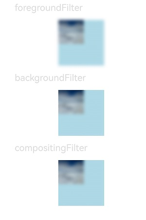

# Visual Effect

This module provides APIs for setting the visual effect of the component, including the filter effect (such as blur and pixel extension) and non-filter effect (such as point light source).

>  **NOTE**
>
>  The initial APIs of this module are supported since API version 12. Updates will be marked with a superscript to indicate their earliest API version.

## visualEffect

visualEffect(effect: VisualEffect): T

Sets a visual effect.

**System capability**: SystemCapability.ArkUI.ArkUI.Full

Parameters

| Parameter | Type                                                        | Mandatory | Description                                                |
| ------ | ------------------------------------------------------------ | ---- | ---------------------------------------------------- |
| effect | [VisualEffect](../../apis-arkgraphics2d/js-apis-uiEffect.md#visualeffect) | Yes  | Visual effect. |

## backgroundFilter

backgroundFilter(filter: Filter): T

Sets the visual effect of the background filter.

**System capability**: SystemCapability.ArkUI.ArkUI.Full

Parameters

| Parameter | Type                                                        | Mandatory | Note:                                                |
| ------ | ------------------------------------------------------------ | ---- | ---------------------------------------------------- |
| filter | [Filter](../../apis-arkgraphics2d/js-apis-uiEffect.md#filter) | Yes  | Visual effect of the background filter. |

## foregroundFilter

foregroundFilter(filter: Filter): T

Sets the visual effect of the foreground filter (content).

**System capability**: SystemCapability.ArkUI.ArkUI.Full

Parameters

| Parameter | Type                                                        | Mandatory | Note:                                                |
| ------ | ------------------------------------------------------------ | ---- | ---------------------------------------------------- |
| filter | [Filter](../../apis-arkgraphics2d/js-apis-uiEffect.md#filter) | Yes  | Visual effect of the foreground filter (content). |

## compositingFilter

compositingFilter(filter: Filter): T

Sets the visual effect of the synthesis filter.

**System capability**: SystemCapability.ArkUI.ArkUI.Full

Parameters

| Parameter | Type                                                        | Mandatory | Description                                                |
| ------ | ------------------------------------------------------------ | ---- | ---------------------------------------------------- |
| filter | [Filter](../../apis-arkgraphics2d/js-apis-uiEffect.md#filter) | Yes  | Synthetic filter visual effect. |


## Example
```ts
// xxx.ets
import uiEffect from '@ohos.graphics.uiEffect'

@Entry
@Component
struct FilterEffectExample {

  @State filterTest: uiEffect.Filter = uiEffect.createFilter()

  build() {
    Column({ space: 15 }) {

      Text('foregroundFilter').fontSize(20).width('75%').fontColor('#DCDCDC')
      Text()
        .width(100)
        .height(100)
        .backgroundColor('#ADD8E6')
        .backgroundImage($r("app.media.testImage"))
     .foregroundFilter(this.filterTest.blur(10)) //Use foregroundFilter to extend pixels.

      Text('backgroundFilter').fontSize(20).width('75%').fontColor('#DCDCDC')
      Text()
        .width(100)
        .height(100)
        .backgroundColor('#ADD8E6')
        .backgroundImage($r("app.media.testImage"))
        .backgroundFilter(this.filterTest.blur(10)) //Use backgroundFilter to set the blur effect.

      Text('compositingFilter').fontSize(20).width('75%').fontColor('#DCDCDC')
      Text()
        .width(100)
        .height(100)
        .backgroundColor('#ADD8E6')
        .backgroundImage($r("app.media.testImage"))
        .compositingFilter(this.filterTest.blur(10)) //Set the blur effect through compositingFilter.
    }
    .height('100%')
    .width('100%')
  }
}
```


