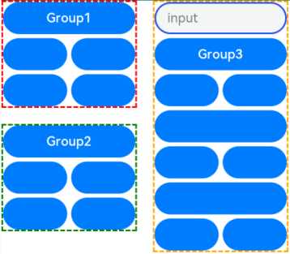
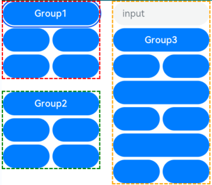
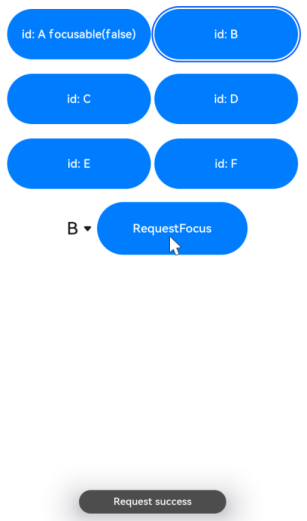
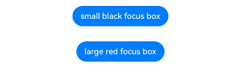

# Focus Control

Focus control attributes set whether a component is focusable and how it participates in focus navigation.

>  **NOTE**
>
>  - The APIs of this module are supported since API version 8. Updates will be marked with a superscript to indicate their earliest API version.
>  
>  - Custom components are inherently unfocusable, and setting [focusable](#focusable) and [enabled](ts-universal-attributes-enable.md#enabled) attributes to **false** or setting the [visibility](ts-universal-attributes-visibility.md#visibility) attribute to **Hidden** or **None** does not impact their child components' capability to gain focus.
>  
>  - Components can actively acquire focus independently of the window's focus state.
>  
>  - For details about focus development, see [Focus Event](../../../ui/arkts-common-events-focus-event.md).

## focusable

focusable(value: boolean)

Sets whether the component is focusable.

**Atomic service API**: This API can be used in atomic services since API version 11.

**System capability**: SystemCapability.ArkUI.ArkUI.Full

**Parameters**

| Name| Type   | Mandatory| Description                                                        |
| ------ | ------- | ---- | ------------------------------------------------------------ |
| value  | boolean | Yes  | Whether the component is focusable.<br>**NOTE**<br>Components that have default interaction logic, such as [Button](ts-basic-components-button.md) and [TextInput](ts-basic-components-textinput.md), are focusable by default. Other components, such as [Text](ts-basic-components-text.md) and [Image](ts-basic-components-image.md), are not focusable by default. Only focusable components can trigger a [focus event](ts-universal-focus-event.md).|

## tabIndex<sup>9+</sup>

tabIndex(index: number)

Sets the Tab order of the component in sequential focus navigation with the **Tab** key.

**Atomic service API**: This API can be used in atomic services since API version 11.

**System capability**: SystemCapability.ArkUI.ArkUI.Full

**Parameters**

| Name| Type  | Mandatory| Description                                                        |
| ------ | ------ | ---- | ------------------------------------------------------------ |
| index  | number | Yes  | Tab order of the component in sequential focus navigation with the **Tab** key. When components with positive **tabIndex** values are present, only these components are reachable through sequential focus navigation, and they are navigated cyclically in ascending order based on the **tabIndex** value. When components with positive **tabIndex** values are not present, those components with a **tabIndex** value of **0** are navigated based on the preset focus navigation rule.<br>**tabIndex** is not yet compatible with [UiExtension](../js-apis-arkui-uiExtension.md) component. As such, using **tabIndex** on a page that contains [UiExtension](../js-apis-arkui-uiExtension.md) may lead to disordered focus navigation.<br>- **tabIndex** >= 0: The component is focusable and can be reached through sequential keyboard navigation.<br>- **tabIndex** < 0 (usually **tabIndex** = -1): The component is focusable, but cannot be reached through sequential keyboard navigation.<br>Default value: **0**<br> **NOTE**<br> **tabIndex** and **focusScopeId** cannot be used together.
|

## defaultFocus<sup>9+</sup>

defaultFocus(value: boolean)

Specifies whether to set the component as the default focus of the page.

**Atomic service API**: This API can be used in atomic services since API version 11.

**System capability**: SystemCapability.ArkUI.ArkUI.Full

**Parameters**

| Name| Type   | Mandatory| Description                                                        |
| ------ | ------- | ---- | ------------------------------------------------------------ |
| value  | boolean | Yes  | Whether to set the component as the default focus of the page. This parameter takes effect only when the page is new and accessed for the first time.<br>Default value: **false**<br>**NOTE**<br>The value **true** means to set the component as the default focus, and the value **false** has no effect.<br>If no component on the page has **defaultFocus(true)** set:<br>For API version 11 and earlier, the default focus is on the first focusable non-container component on the page.<br>For API version versions later than 11, the default focus is on the page's root container.<br>If **defaultFocus(true)** is set for multiple components on the page, the first component found in the component tree in-depth traversal is used as the default focus.|

## groupDefaultFocus<sup>9+</sup>

groupDefaultFocus(value: boolean)

Specifies whether to set the component as the default focus of the container.

**Atomic service API**: This API can be used in atomic services since API version 11.

**System capability**: SystemCapability.ArkUI.ArkUI.Full

**Parameters**

| Name| Type   | Mandatory| Description                                                        |
| ------ | ------- | ---- | ------------------------------------------------------------ |
| value  | boolean | Yes  | Whether to set the component as the default focus of the parent container. This parameter takes effect only when the container is new and obtains focus for the first time.<br>Default value: **false**<br>**NOTE**<br>This parameter must be used together with [tabIndex](#tabindex9). When **tabIndex** is set for a container and **groupDefaultFocus(true)** is set for a child in the container or for the container itself, then when the container obtains focus for the first time through sequential Tab navigation, the focus automatically moves to the specified component. If **groupDefaultFocus(true)** is set for multiple components in the container (including the container itself), the first component found in the component tree in-depth traversal receives the focus.|

## focusOnTouch<sup>9+</sup>

focusOnTouch(value: boolean)

Sets whether the component is focusable on touch.

**Atomic service API**: This API can be used in atomic services since API version 11.

**System capability**: SystemCapability.ArkUI.ArkUI.Full

**Parameters**

| Name| Type   | Mandatory| Description                                                        |
| ------ | ------- | ---- | ------------------------------------------------------------ |
| value  | boolean | Yes  | Whether the component is focusable on touch.<br>Default value: **false**<br>**NOTE**<br>The component is focusable only when it is touchable.|

## focusBox<sup>12+</sup>

focusBox(style: FocusBoxStyle): T

Sets the system focus box style for the component.

**Atomic service API**: This API can be used in atomic services since API version 12.

**System capability**: SystemCapability.ArkUI.ArkUI.Full

**Parameters**

| Name| Type| Mandatory| Description|
| ---- | ---- | ---- | ---- |
| style  | [FocusBoxStyle](#focusboxstyle12) | Yes  | System focus box style for the component.<br>**NOTE**<br>This style affects only the components that display the system focus frame during focus traversal.|


## focusControl<sup>9+</sup>

Implements focus control.

**Atomic service API**: This API can be used in atomic services since API version 11.

### requestFocus<sup>9+</sup>

requestFocus(value: string): boolean

Requests the focus to move to the specified component. It is a global API. This API does not take effect in the current frame; the focus change will occur in the next frame. Use the [requestFocus](../js-apis-arkui-UIContext.md#requestfocus12) API in **FocusController** for immediate effect.

**Atomic service API**: This API can be used in atomic services since API version 11.

**Parameters**

| Name| Type| Mandatory| Description|
| ----- | ------ | ---- | ---- |
| value | string | Yes  | String bound to the target component using **key(value: string)** or **id(value: string)**.|

**Return value**

| Type| Description|
| ------- | ---- |
| boolean | Returns whether the focus is successfully moved to the target component. Returns **true** if the specified component exists and the focus is successfully moved to the target component; returns **false** otherwise.|

>  **NOTE**
>
>  The following components support focus control: [TextInput](ts-basic-components-textinput.md), [TextArea](ts-basic-components-textarea.md), [Search](ts-basic-components-search.md), [Button](ts-basic-components-button.md), [Text](ts-basic-components-text.md), [Image](ts-basic-components-image.md), [List](ts-container-list.md), [Grid](ts-container-grid.md). Currently, the running effect of the focus event can be displayed only on a real device.


## FocusController<sup>12+</sup>
In the following **clearFocus** and **requestFocus** API examples, you must first use [getFocusController()](../js-apis-arkui-UIContext.md#getfocuscontroller12) in **UIContext** to obtain a **UIContext** instance, and then call the APIs using the obtained instance.


### clearFocus<sup>12+</sup>

clearFocus(): void

Clears the focus and forcibly moves the focus to the root container node of the current page. Other nodes on the focus chain all lose focus.

>  **NOTE**
>
>  For details, see [clearFocus](../js-apis-arkui-UIContext.md#clearfocus12).

### requestFocus<sup>12+</sup>

requestFocus(key: string): void

Sets focus on the specified entity node in the component tree based on the component ID.

>  **NOTE**
>
>  For details, see [requestFocus](../js-apis-arkui-UIContext.md#requestfocus12).

### activate<sup>14+</sup>

activate(): void

Sets the current screen to immediately enter the focused state, where the single focused component on the screen is highlighted (with a focus box, for example), producing an effect similar to that of pressing the **Tab** key.

>  **NOTE**
>
>  For details, see [activate](../js-apis-arkui-UIContext.md#activate14).

## FocusBoxStyle<sup>12+</sup>

**Atomic service API**: This API can be used in atomic services since API version 12.

| Name| Type| Mandatory| Description|
| ---- | ---- | ---- | ---- |
| margin  | [LengthMetrics](../js-apis-arkui-graphics.md#lengthmetrics12) | No| Distance of the focus box from the component's edge.<br>A positive number indicates the outside, and a negative number indicates the inside. The value cannot be in percentage.|
| strokeColor  | [ColorMetrics](../js-apis-arkui-graphics.md#colormetrics12) | No| Stroke color of the focus frame.|
| strokeWidth | [LengthMetrics](../js-apis-arkui-graphics.md#lengthmetrics12) | No| Width of the focus frame.<br>Negative numbers and percentages are not supported.|

## focusScopePriority<sup>12+</sup>

focusScopePriority(scopeId: string, priority?: FocusPriority): T

Sets the focus priority of this component in a specified container. It must be used together with **focusScopeId**.

**Atomic service API**: This API can be used in atomic services since API version 12.

**System capability**: SystemCapability.ArkUI.ArkUI.Full

**Parameters**

| Name| Type   | Mandatory| Description                                                        |
| ------ | ------- | ---- | ------------------------------------------------------------ |
| scopeId  | string | Yes  | ID of the container component where the current component's focus priority takes effect.<br>**NOTE**<br>1. The current component must be within the container identified by **scopeId**, or the container to which the current component belongs must be within the container identified by **scopeId**.<br>2. A component cannot set multiple priorities.<br>3. A container component with **focusScopeId** set cannot have its priority set.|
| priority  | [FocusPriority](#focuspriority12)  | No  | Focus priority.<br>**NOTE**<br>If **priority** is not set, the component uses the default **AUTO** priority.<br>Impact of the priority on focus traversal and component focus:<br>1. When the container gains focus as a whole (page level switching/focus switching to a focus group/container component requesting focus with **requestFocus**), if there is a component with a priority of **PREVIOUS** within the container, that component gains focus; otherwise, the last focused component does.<br>2. When a container does not gain focus as a whole (using **Tab** or arrow keys in non-focus group scenarios), the highest priority component gets focus on first focus; subsequent focus follows position order regardless of priority.|

### FocusPriority<sup>12+</sup>

**Atomic service API**: This API can be used in atomic services since API version 12.

**System capability**: SystemCapability.ArkUI.ArkUI.Full

| Name         | Description       |
| ----------- | --------- |
| AUTO | Default priority, that is, the focus priority assigned by default.|
| PRIOR | Priority that indicates the component is prioritized in the container. This level is higher than **AUTO**.|
| PREVIOUS | Priority of a previously focused node in the container. This level is higher than **PRIOR**.|

## focusScopeId<sup>12+</sup>

focusScopeId(id: string, isGroup?: boolean)

Assigns an ID to this container component and specifies whether the container is a focus group.

**System capability**: SystemCapability.ArkUI.ArkUI.Full

**Parameters**

| Name| Type   | Mandatory| Description                                                        |
| ------ | ------- | ---- | ------------------------------------------------------------ |
| id  | string | Yes  | ID of the current container component.<br>**NOTE**<br>The ID must be unique within a single level page.<br>**Atomic service API**: This API can be used in atomic services since API version 12.|
| isGroup  | boolean | No  | Whether the current container component is a focus group.<br>**NOTE**<br>Focus groups cannot be nested and should not be configured repeatedly.<br> The focus group and **tabIndex** cannot be used together.<br>The focus group enables the container and its elements to navigate focus according to the focus group rules as follows:<br>1. Only arrow keys are allowed for focus traversal within the focus group; the **Tab** key will move the focus out of the focus group.<br>2. When arrow keys are used to move the focus from outside the focus group to inside, if there is a component with a priority of **PREVIOUS** within the focus group, that component gains focus; otherwise, the last focused component does.<br>**Atomic service API**: This API can be used in atomic services since API version 12.|
| arrowStepOut<sup>14+</sup>  | boolean | No  | Whether the focus can be moved out of the current focus group using arrow keys.<br>**Atomic service API**: This API can be used in atomic services since API version 14.|

## Example

### Example 1

This example shows how to use **defaultFocus**, **groupDefaultFocus**, and **focusOnTouch**.

**defaultFocus** sets the bound component as the initial focus of the page after the page is created. **groupDefaultFocus** sets the bound component as the initial focus of the **tabIndex** container after the container is created. **focusOnTouch** sets the bound component to obtain focus upon being clicked.

```ts
// focusTest.ets
@Entry
@Component
struct FocusableExample {
  @State inputValue: string = ''

  build() {
    Scroll() {
      Row({ space: 20 }) {
        Column({ space: 20 }) {
          Column({ space: 5 }) {
            Button('Group1')
              .width(165)
              .height(40)
              .fontColor(Color.White)
              .focusOnTouch(true)           // The button is focusable on touch.
            Row({ space: 5 }) {
              Button()
                .width(80)
                .height(40)
                .fontColor(Color.White)
              Button()
                .width(80)
                .height(40)
                .fontColor(Color.White)
                .focusOnTouch(true)           // The button is focusable on touch.
            }
            Row({ space: 5 }) {
              Button()
                .width(80)
                .height(40)
                .fontColor(Color.White)
              Button()
                .width(80)
                .height(40)
                .fontColor(Color.White)
            }
          }.borderWidth(2).borderColor(Color.Red).borderStyle(BorderStyle.Dashed)
          .tabIndex(1)                      // The column is the initial component to have focus in sequential keyboard navigation.
          Column({ space: 5 }) {
            Button('Group2')
              .width(165)
              .height(40)
              .fontColor(Color.White)
            Row({ space: 5 }) {
              Button()
                .width(80)
                .height(40)
                .fontColor(Color.White)
              Button()
                .width(80)
                .height(40)
                .fontColor(Color.White)
                .groupDefaultFocus(true)      // The button obtains focus when its upper-level column is in focus.
            }
            Row({ space: 5 }) {
              Button()
                .width(80)
                .height(40)
                .fontColor(Color.White)
              Button()
                .width(80)
                .height(40)
                .fontColor(Color.White)
            }
          }.borderWidth(2).borderColor(Color.Green).borderStyle(BorderStyle.Dashed)
          .tabIndex(2)                      // The column is the second component to have focus in sequential keyboard navigation.
        }
        Column({ space: 5 }) {
          TextInput({placeholder: 'input', text: this.inputValue})
            .onChange((value: string) => {
              this.inputValue = value
            })
            .width(156)
            .defaultFocus(true)             // The <TextInput> component is the initial default focus of the page.
          Button('Group3')
            .width(165)
            .height(40)
            .fontColor(Color.White)
          Row({ space: 5 }) {
            Button()
              .width(80)
              .height(40)
              .fontColor(Color.White)
            Button()
              .width(80)
              .height(40)
              .fontColor(Color.White)
          }
          Button()
            .width(165)
            .height(40)
            .fontColor(Color.White)
          Row({ space: 5 }) {
            Button()
              .width(80)
              .height(40)
              .fontColor(Color.White)
            Button()
              .width(80)
              .height(40)
              .fontColor(Color.White)
          }
          Button()
            .width(165)
            .height(40)
            .fontColor(Color.White)
          Row({ space: 5 }) {
            Button()
              .width(80)
              .height(40)
              .fontColor(Color.White)
            Button()
              .width(80)
              .height(40)
              .fontColor(Color.White)
          }
        }.borderWidth(2).borderColor(Color.Orange).borderStyle(BorderStyle.Dashed)
        .tabIndex(3)                      // The column is the third component to have focus in sequential keyboard navigation.
      }.alignItems(VerticalAlign.Top)
    }
  }
}
```
Diagrams:

On first-time access, the focus is on the **TextInput** component bound to **defaultFocus**.



When you press the **Tab** key for the first time, the focus switches to the container that matches **tabIndex(1)** and automatically moves to the component bound to **groupDefaultFocus**.



When you press the **Tab** key for the second time, the focus switches to the container that matches **tabIndex(2)** and automatically moves to the component bound to **groupDefaultFocus**.


When you press the **Tab** key for the third time, the focus switches to the container that matches **tabIndex(3)** and automatically moves to the component bound to **groupDefaultFocus**.


Clicking the component bound to **focusOnTouch** sets the focus on the component and removes the focus indicator. Pressing the Tab key again displays the focus indicator.


### Example 2

> **NOTE**
> 
> To avoid confusion with **focusControl** instances, it is recommended that you obtain a **UIContext** instance using the [getUIContext](../js-apis-arkui-UIContext.md#uicontext) API, and then obtain the **focusControl** instance bound to the context through the [getFocusController](../js-apis-arkui-UIContext.md#getfocuscontroller12) API.

This example shows how to use **focusControl.requestFocus** to move the focus to the specified component.
```ts
// requestFocus.ets
@Entry
@Component
struct RequestFocusExample {
  @State idList: string[] = ['A', 'B', 'C', 'D', 'E', 'F', 'LastPageId']
  @State selectId: string = 'LastPageId'

  build() {
    Column({ space:20 }){
      Row({space: 5}) {
        Button("id: " + this.idList[0] + " focusable(false)")
          .width(200).height(70).fontColor(Color.White)
          .id(this.idList[0])
          .focusable(false)
        Button("id: " + this.idList[1])
          .width(200).height(70).fontColor(Color.White)
          .id(this.idList[1])
      }
      Row({space: 5}) {
        Button("id: " + this.idList[2])
          .width(200).height(70).fontColor(Color.White)
          .id(this.idList[2])
        Button("id: " + this.idList[3])
          .width(200).height(70).fontColor(Color.White)
          .id(this.idList[3])
      }
      Row({space: 5}) {
        Button("id: " + this.idList[4])
          .width(200).height(70).fontColor(Color.White)
          .id(this.idList[4])
        Button("id: " + this.idList[5])
          .width(200).height(70).fontColor(Color.White)
          .id(this.idList[5])
      }
      Row({space: 5}) {
        Select([{value: this.idList[0]},
                {value: this.idList[1]},
                {value: this.idList[2]},
                {value: this.idList[3]},
                {value: this.idList[4]},
                {value: this.idList[5]},
                {value: this.idList[6]}])
          .value(this.selectId)
          .onSelect((index: number) => {
            this.selectId = this.idList[index]
          })
        Button("RequestFocus")
          .width(200).height(70).fontColor(Color.White)
          .onClick(() => {
            // You are advised to use this.getUIContext().getFocusController().requestFocus().
            let res = focusControl.requestFocus(this.selectId)      // Move the focus to the component specified by this.selectId.
            if (res) {
              this.getUIContext().getPromptAction().showToast({message: 'Request success'})
            } else {
              this.getUIContext().getPromptAction().showToast({message: 'Request failed'})
            }
          })
      }
    }.width('100%').margin({ top:20 })
  }
}
```

Diagrams:

Press the **Tab** key to activate the focus state.
Below shows how the UI behaves when you request focus for a component that does not exist.


Below shows how the UI behaves when you request focus for a component that is not focusable.


Below shows how the UI behaves when you request focus for a focusable component.



### Example 3

This example demonstrates how to use **focusBox** to change the focus box style of a component, making the focus box red, bold, and with an inner border.
```ts
import { ColorMetrics, LengthMetrics } from '@kit.ArkUI'

@Entry
@Component
struct RequestFocusExample {
  build() {
    Column({ space: 30 }) {
      Button("small black focus box")
        .focusBox({
          margin: new LengthMetrics(0),
          strokeColor: ColorMetrics.rgba(0, 0, 0),
        })
      Button("large red focus box")
        .focusBox({
          margin: LengthMetrics.px(20),
          strokeColor: ColorMetrics.rgba(255, 0, 0),
          strokeWidth: LengthMetrics.px(10)
        })
    }
    .alignItems(HorizontalAlign.Center)
    .width('100%')
  }
}
```




### Example 4

This example illustrates how to use **focusScopePriority** and **focusScopeId**.

**focusScopePriority** makes the bound component the focus when its container first gains focus. **focusScopeId** makes the bound container component a focus group.

```ts
// focusTest.ets
@Entry
@Component
struct FocusableExample {
  @State inputValue: string = ''

  build() {
    Scroll() {
      Row({ space: 20 }) {
        Column({ space: 20 }) {  // Labeled as Column1.
          Column({ space: 5 }) {
            Button('Group1')
              .width(165)
              .height(40)
              .fontColor(Color.White)
            Row({ space: 5 }) {
              Button()
                .width(80)
                .height(40)
                .fontColor(Color.White)
              Button()
                .width(80)
                .height(40)
                .fontColor(Color.White)
            }
            Row({ space: 5 }) {
              Button()
                .width(80)
                .height(40)
                .fontColor(Color.White)
              Button()
                .width(80)
                .height(40)
                .fontColor(Color.White)
            }
          }.borderWidth(2).borderColor(Color.Red).borderStyle(BorderStyle.Dashed)
          Column({ space: 5 }) {
            Button('Group2')
              .width(165)
              .height(40)
              .fontColor(Color.White)
            Row({ space: 5 }) {
              Button()
                .width(80)
                .height(40)
                .fontColor(Color.White)
              Button()
                .width(80)
                .height(40)
                .fontColor(Color.White)
                .focusScopePriority('ColumnScope1', FocusPriority.PRIOR) // Focuses when Column1 first gains focus.
            }
            Row({ space: 5 }) {
              Button()
                .width(80)
                .height(40)
                .fontColor(Color.White)
              Button()
                .width(80)
                .height(40)
                .fontColor(Color.White)
            }
          }.borderWidth(2).borderColor(Color.Green).borderStyle(BorderStyle.Dashed)
        }
        .focusScopeId('ColumnScope1')
        Column({ space: 5 }) {  // Labeled as Column2.
          TextInput({placeholder: 'input', text: this.inputValue})
            .onChange((value: string) => {
              this.inputValue = value
            })
            .width(156)
          Button('Group3')
            .width(165)
            .height(40)
            .fontColor(Color.White)
          Row({ space: 5 }) {
            Button()
              .width(80)
              .height(40)
              .fontColor(Color.White)
            Button()
              .width(80)
              .height(40)
              .fontColor(Color.White)
          }
          Button()
            .width(165)
            .height(40)
            .fontColor(Color.White)
            .focusScopePriority('ColumnScope2', FocusPriority.PREVIOUS)  // Focuses when Column2 first gains focus.
          Row({ space: 5 }) {
            Button()
              .width(80)
              .height(40)
              .fontColor(Color.White)
            Button()
              .width(80)
              .height(40)
              .fontColor(Color.White)
          }
          Button()
            .width(165)
            .height(40)
            .fontColor(Color.White)
          Row({ space: 5 }) {
            Button()
              .width(80)
              .height(40)
              .fontColor(Color.White)
            Button()
              .width(80)
              .height(40)
              .fontColor(Color.White)
          }
        }.borderWidth(2).borderColor(Color.Orange).borderStyle(BorderStyle.Dashed)
        .focusScopeId('ColumnScope2', true) // Column2 is a focus group.
      }.alignItems(VerticalAlign.Top)
    }
  }
}
```
<!--no_check-->