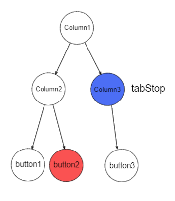
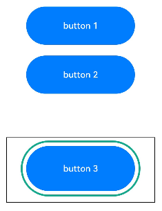
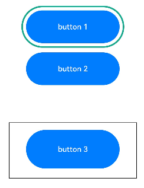

# Focus Control

Focus control attributes set whether a component is focusable and how it participates in focus navigation.

>  **NOTE**
>
>  - The initial APIs of this module are supported since API version 8. Updates will be marked with a superscript to indicate their earliest API version.
>  
>  - Custom components are inherently unfocusable, and setting [focusable](#focusable) and [enabled](ts-universal-attributes-enable.md#enabled) attributes to **false** or setting the [visibility](ts-universal-attributes-visibility.md) attribute to **Hidden** or **None** does not impact their child components' capability to gain focus.
>  
>  - Components can actively acquire focus independently of the window's focus state.
>  
>  - For details about focus development, see [Focus Event](../../../ui/arkts-common-events-focus-event.md).

## focusable

focusable(value: boolean): T

Sets whether the component is focusable.

**Atomic service API**: This API can be used in atomic services since API version 11.

**System capability**: SystemCapability.ArkUI.ArkUI.Full

**Parameters**

| Name| Type   | Mandatory| Description                                                        |
| ------ | ------- | ---- | ------------------------------------------------------------ |
| value  | boolean | Yes  | Whether the component is focusable.<br>**true**: The component is focusable.<br>**false**: The component is not focusable.<br>**NOTE**<br>Components that have default interaction logic, such as [Button](ts-basic-components-button.md) and [TextInput](ts-basic-components-textinput.md), are focusable by default. Other components, such as [Text](ts-basic-components-text.md) and [Image](ts-basic-components-image.md), are not focusable by default. Only focusable components can trigger a [focus event](ts-universal-focus-event.md).|

**Return value**

| Type| Description|
| -------- | -------- |
| T | Current component.|

## tabIndex<sup>9+</sup>

tabIndex(index: number): T

Sets the Tab order of the component in sequential focus navigation with the **Tab** key.

**Atomic service API**: This API can be used in atomic services since API version 11.

**System capability**: SystemCapability.ArkUI.ArkUI.Full

**Parameters**

| Name| Type  | Mandatory| Description                                                        |
| ------ | ------ | ---- | ------------------------------------------------------------ |
| index  | number | Yes  | Tab order of the component in sequential focus navigation with the **Tab** key. When components with positive **tabIndex** values are present, only these components are reachable through sequential focus navigation, and they are navigated cyclically in ascending order based on the **tabIndex** value. When components with positive **tabIndex** values are not present, those components with a **tabIndex** value of **0** are navigated based on the preset focus navigation rule.<br>The [UiExtension](../js-apis-arkui-uiExtension.md) component does not support **tabIndex**. As such, using **tabIndex** on [hierarchical pages](../../../ui/arkts-common-events-focus-event.md#basic-concepts) that contain **UiExtension** components may lead to disordered focus navigation.<br>- **tabIndex** >= 0: The component is focusable and can be reached through sequential keyboard navigation.<br>- **tabIndex** < 0 (usually **tabIndex** = -1): The component is focusable, but cannot be reached through sequential keyboard navigation.<br>Default value: **0**<br> **NOTE**<br> **tabIndex** and **focusScopeId** cannot be used together.
|

**Return value**

| Type| Description|
| -------- | -------- |
| T | Current component.|

## defaultFocus<sup>9+</sup>

defaultFocus(value: boolean): T

Specifies whether to set this component as the default focus of the current [hierarchical page](../../../ui/arkts-common-events-focus-event.md#basic-concepts).

>  **NOTE**
>
>  This setting applies to pages that support routing or modal-type container components, such as **Page**, **NaviDestination**, **NavBar**, **PopUp**, and **Dialog**.

**Atomic service API**: This API can be used in atomic services since API version 11.

**System capability**: SystemCapability.ArkUI.ArkUI.Full

**Parameters**

| Name| Type   | Mandatory| Description                                                        |
| ------ | ------- | ---- | ------------------------------------------------------------ |
| value  | boolean | Yes  | Whether to set the component as the default focus of the current [hierarchical page](../../../ui/arkts-common-events-focus-event.md#basic-concepts). This parameter takes effect only when the hierarchical page is new and accessed for the first time.<br>Default value: **false**<br>**NOTE**<br>The value **true** means to set the component as the default focus, and the value **false** has no effect.<br>If no component on the hierarchical page has **defaultFocus(true)** set:<br>For API version 11 and earlier, the default focus is on the first focusable non-container component.<br>For API version versions later than 11, the default focus is on the hierarchical page's root container.<br>If **defaultFocus(true)** is set for multiple components on the hierarchical page, the first component found in the component tree depth-first traversal is used as the default focus.|

**Return value**

| Type| Description|
| -------- | -------- |
| T | Current component.|

## groupDefaultFocus<sup>9+</sup>

groupDefaultFocus(value: boolean): T

Specifies whether to set the component as the default focus of the container.

**Atomic service API**: This API can be used in atomic services since API version 11.

**System capability**: SystemCapability.ArkUI.ArkUI.Full

**Parameters**

| Name| Type   | Mandatory| Description                                                        |
| ------ | ------- | ---- | ------------------------------------------------------------ |
| value  | boolean | Yes  | Whether to set the component as the default focus of the parent container. This parameter takes effect only when the container is new and obtains focus for the first time. <br>**true**: The component is the default focus of the parent container.<br>**false**: The component is not the default focus of the parent container.<br>Default value: **false**<br>**NOTE**<br>This parameter must be used together with [tabIndex](#tabindex9). When **tabIndex** is set for a container and **groupDefaultFocus(true)** is set for a child in the container or for the container itself, then when the container obtains focus for the first time through sequential Tab navigation, the focus automatically moves to the specified component. If **groupDefaultFocus(true)** is set for multiple components in the container (including the container itself), the first component found in the component tree in-depth traversal receives the focus.|

**Return value**

| Type| Description|
| -------- | -------- |
| T | Current component.|

## focusOnTouch<sup>9+</sup>

focusOnTouch(value: boolean): T

Sets whether the component is focusable on touch.

**Atomic service API**: This API can be used in atomic services since API version 11.

**System capability**: SystemCapability.ArkUI.ArkUI.Full

**Parameters**

| Name| Type   | Mandatory| Description                                                        |
| ------ | ------- | ---- | ------------------------------------------------------------ |
| value  | boolean | Yes  | Whether the component is focusable on touch. <br>**true**: The component is focusable on touch.<br>**false**: The component is not focusable on touch.<br>Default value: **false**<br>**NOTE**<br>The component is focusable only when it is touchable.|

**Return value**

| Type| Description|
| -------- | -------- |
| T | Current component.|

## focusBox<sup>12+</sup>

focusBox(style: FocusBoxStyle): T

Sets the system focus box style for the component.

**Atomic service API**: This API can be used in atomic services since API version 12.

**System capability**: SystemCapability.ArkUI.ArkUI.Full

**Parameters**

| Name| Type| Mandatory| Description|
| ---- | ---- | ---- | ---- |
| style  | [FocusBoxStyle](#focusboxstyle12) | Yes  | System focus box style for the component.<br>**NOTE**<br>This style affects only the components that display the system focus box during focus traversal.|

**Return value**

| Type| Description|
| -------- | -------- |
| T | Current component.|

## focusControl<sup>9+</sup>

Implements focus control.

**Atomic service API**: This API can be used in atomic services since API version 11.

### requestFocus<sup>9+</sup>

requestFocus(value: string): boolean

Requests focus transfer to the specified component during the next frame rendering. This global API provides asynchronous focus control.
For scenarios requiring immediate focus changes, it is recommended that you use the focus synchronization transfer API [requestFocus](../arkts-apis-uicontext-focuscontroller.md#requestfocus12) in **FocusController**.

**Atomic service API**: This API can be used in atomic services since API version 11.

**Parameters**

| Name| Type| Mandatory| Description|
| ----- | ------ | ---- | ---- |
| value | string | Yes  | String bound to the target component using **key(value: string)** or **id(value: string)**.|

**Return value**

| Type| Description|
| ------- | ---- |
| boolean | Returns whether focus transfer is successfully requested for the target component. Returns **true** if the target component exists and can receive focus; returns **false** otherwise.|

>  **NOTE**
>
>  The following components support focus control: [TextInput](ts-basic-components-textinput.md), [TextArea](ts-basic-components-textarea.md), [Search](ts-basic-components-search.md), [Button](ts-basic-components-button.md), [Text](ts-basic-components-text.md), [Image](ts-basic-components-image.md), [List](ts-container-list.md), [Grid](ts-container-grid.md). Currently, the running effect of the focus event can be displayed only on a real device.

## FocusBoxStyle<sup>12+</sup>

**Atomic service API**: This API can be used in atomic services since API version 12.

| Name| Type| Mandatory| Description|
| ---- | ---- | ---- | ---- |
| margin  | [LengthMetrics](../js-apis-arkui-graphics.md#lengthmetrics12) | No| Distance of the focus box from the component's edge.<br>A positive number indicates the outside, and a negative number indicates the inside. The value cannot be in percentage.|
| strokeColor  | [ColorMetrics](../js-apis-arkui-graphics.md#colormetrics12) | No| Stroke color of the focus box.|
| strokeWidth | [LengthMetrics](../js-apis-arkui-graphics.md#lengthmetrics12) | No| Stroke width of the focus box.<br>Negative numbers and percentages are not supported.|

## focusScopePriority<sup>12+</sup>

focusScopePriority(scopeId: string, priority?: FocusPriority): T

Sets the focus priority of this component in a specified container. It must be used together with **focusScopeId**.

**Atomic service API**: This API can be used in atomic services since API version 12.

**System capability**: SystemCapability.ArkUI.ArkUI.Full

**Parameters**

| Name| Type   | Mandatory| Description                                                        |
| ------ | ------- | ---- | ------------------------------------------------------------ |
| scopeId  | string | Yes  | ID of the container component where the current component's focus priority takes effect.<br>**NOTE**<br>1. The current component must be inside the container identified by **scopeId** or inside a sub-container of that container.<br>2. A component cannot set multiple priorities.<br>3. A container component with **focusScopeId** set cannot have its priority set.|
| priority  | [FocusPriority](#focuspriority12)  | No  | Focus priority.<br>**NOTE**<br>If **priority** is not set, **AUTO** is used by default.<br>Impact of the priority on focus traversal and component focus:<br>1. When the container gains focus as a whole (hierarchical page level switching/focus switching to a focus group/container component requesting focus with **requestFocus**), if there is a component with a priority of **PREVIOUS** within the container, that component gains focus; otherwise, the last focused component does.<br>2. When a container does not gain focus as a whole (using **Tab** or arrow keys in non-focus group scenarios), the highest priority component gets focus on first focus; subsequent focus follows position order regardless of priority.|

**Return value**

| Type| Description|
| -------- | -------- |
| T | Current component.|

### FocusPriority<sup>12+</sup>

**Atomic service API**: This API can be used in atomic services since API version 12.

**System capability**: SystemCapability.ArkUI.ArkUI.Full

| Name         | Description       |
| ----------- | --------- |
| AUTO | Default priority, that is, the focus priority assigned by default.|
| PRIOR | Priority that indicates the component is prioritized in the container. This level is higher than **AUTO**.|
| PREVIOUS | Priority of a previously focused node in the container. This level is higher than **PRIOR**.|

### KeyProcessingMode<sup>15+</sup>

Enumerates the modes for processing key events.

**Atomic service API**: This API can be used in atomic services since API version 15.

**System capability**: SystemCapability.ArkUI.ArkUI.Full

| Name    | Value   | Description       |
| -----------| ----------- | --------- |
| FOCUS_NAVIGATION  | 0 | Default value. When the current component does not consume the key event, focus navigation using the **Tab** and arrow keys preferentially stays within the current container.|
| ANCESTOR_EVENT  | 1  |  When the current component does not consume the key event, focus navigation using the **Tab** and arrow keys is bubbled up to the parent component.|

## focusScopeId<sup>12+</sup>

focusScopeId(id: string, isGroup?: boolean): T

Assigns an ID to this container component and specifies whether the container is a focus group.

**Atomic service API**: This API can be used in atomic services since API version 12.

**System capability**: SystemCapability.ArkUI.ArkUI.Full

**Parameters**

| Name| Type   | Mandatory| Description                                                        |
| ------ | ------- | ---- | ------------------------------------------------------------ |
| id  | string | Yes  | ID of the current container component.<br>**NOTE**<br>The ID must be unique within a single [hierarchical page](../../../ui/arkts-common-events-focus-event.md#basic-concepts).|
| isGroup  | boolean | No  | Whether the current container component is a focus group. <br>**true**: The current container component is a focus group.<br>**false**: The current container component is not a focus group.<br> Default value: **false**.<br>**NOTE**<br>Focus groups cannot be nested and should not be configured repeatedly.<br> The focus group and **tabIndex** cannot be used together.<br>The focus group enables the container and its elements to navigate focus according to the focus group rules as follows:<br>1. Only arrow keys are allowed for focus traversal within the focus group; the **Tab** key will move the focus out of the focus group.<br>2. When arrow keys are used to move the focus from outside the focus group to inside, if there is a component with a priority of **PREVIOUS** within the focus group, that component gains focus; otherwise, the last focused component does.|

**Return value**

| Type| Description|
| -------- | -------- |
| T | Current component.|

## focusScopeId<sup>14+</sup>

focusScopeId(id: string, isGroup?: boolean, arrowStepOut?: boolean): T

Assigns an ID to this container component and specifies whether the container is a focus group.

**System capability**: SystemCapability.ArkUI.ArkUI.Full

**Parameters**

| Name| Type   | Mandatory| Description                                                        |
| ------ | ------- | ---- | ------------------------------------------------------------ |
| id  | string | Yes  | ID of the current container component.<br>**NOTE**<br>The ID must be unique within a single [hierarchical page](../../../ui/arkts-common-events-focus-event.md#basic-concepts).<br>**Atomic service API**: This API can be used in atomic services since API version 12.|
| isGroup  | boolean | No  | Whether the current container component is a focus group. <br>**true**: The current container component is a focus group.<br>**false**: The current container component is not a focus group.<br> Default value: **false**.<br>**NOTE**<br>Focus groups cannot be nested and should not be configured repeatedly.<br> The focus group and **tabIndex** cannot be used together.<br>The focus group enables the container and its elements to navigate focus according to the focus group rules as follows:<br>1. Only arrow keys are allowed for focus traversal within the focus group; the **Tab** key will move the focus out of the focus group.<br>2. When arrow keys are used to move the focus from outside the focus group to inside, if there is a component with a priority of **PREVIOUS** within the focus group, that component gains focus; otherwise, the last focused component does.<br>**Atomic service API**: This API can be used in atomic services since API version 12.|
| arrowStepOut<sup>14+</sup>  | boolean | No  | Whether the focus can be moved out of the current focus group using arrow keys. <br>**true**: The focus can be moved out of the current focus group using arrow keys.<br>**false**: The focus cannot be moved out of the current focus group using arrow keys.<br> The default value is **true**.<br>**Atomic service API**: This API can be used in atomic services since API version 14.|

**Return value**

| Type| Description|
| -------- | -------- |
| T | Current component.|

## tabStop<sup>14+</sup>

tabStop(isTabStop: boolean): T

Sets whether this container component is a focus stop. During focus traversal, the focus stops at the container component serving as a focus stop.

**Atomic service API**: This API can be used in atomic services since API version 14.

**System capability**: SystemCapability.ArkUI.ArkUI.Full

**Parameters**

| Name| Type   | Mandatory| Description                                                        |
| ------ | ------- | ---- | ------------------------------------------------------------ |
| isTabStop  | boolean | Yes  | Whether the current container component is a focus stop. <br>**true**: The current container component is a focus stop.<br>**false**: The current container component is not a focus stop.<br>**NOTE**<br>1. To configure **tabStop**, make sure the component is a container and has focusable child components. By default, container components cannot directly gain focus.<br> 2. When [requestFocus](../arkts-apis-uicontext-focuscontroller.md#requestfocus12) is used for requesting focus, if the component is a container and **tabStop** is configured, the focus can stop at the container. If **tabStop** is not configured, the component can still gain focus, even if there are other components in the focus chain with **tabStop** configured.<br>3. Containers with **tabStop** configured should not be nested more than two levels deep.<br>Focus traversal rules with **tabStop**:<br>1. During focus traversal using the **Tab** key or arrow keys, the focus stops at components with **tabStop** configured. If the focus is inside a container with **tabStop** configured, it can move to the next focusable component within the container. If the focus is outside such a container, it can move to the next focusable component outside the container.<br>2. When the focus is on a container with **tabStop** configured: Pressing **Enter** moves the focus to the first focusable component inside the container.<br>Pressing **ESC** moves the focus back to the last component with **tabStop** configured within the current [hierarchical page](../../../ui/arkts-common-events-focus-event.md#basic-concepts).<br>Pressing the spacebar triggers the **onClick** event of the container.<br>3. Whenever possible, avoid configuring **tabStop** on the root container. If **tabStop** is configured on the root container, the following behaviors will occur:<br>- Using [clearFocus](../arkts-apis-uicontext-focuscontroller.md#clearfocus12) to clear the focus to the root container and then pressing **Enter** will move the focus to the previously focused component inside the root container.<br>- Using **ESC** to clear the focus to the root container and then pressing **Enter** will move the focus to the first focusable component inside the root container.|

**Return value**

| Type| Description|
| -------- | -------- |
| T | Current component.|

**Example for describing the keys and focusable components during focus traversal**



If the current focus is on **button2**, pressing the **Tab** key will move the focus to **Column3**. Pressing the **Tab** key again will move the focus back to **button1**.

## nextFocus<sup>18+</sup>

nextFocus(nextStep: Optional\<FocusMovement>): T

Sets the custom focus movement logic for the component.

**Atomic service API**: This API can be used in atomic services since API version 18.

**System capability**: SystemCapability.ArkUI.ArkUI.Full

**Parameters**

| Name| Type   | Mandatory| Description                                                        |
| ------ | ------- | ---- | ------------------------------------------------------------ |
| nextStep  | [FocusMovement](#focusmovement18) | No| Custom focus movement logic of the component.<br>**NOTE**<br>The default value resets **nextStep** to empty.<br>If custom focus movement is not set or the specified component does not exist, the default focus movement logic applies.|

**Return value**

| Type| Description|
| -------- | -------- |
| T | Current component.|

## FocusMovement<sup>18+</sup>

Sets the target component for focus movement based on key presses. If it is not specified, the default focus movement logic applies.

**Atomic service API**: This API can be used in atomic services since API version 18.

**System capability**: SystemCapability.ArkUI.ArkUI.Full

| Name| Type| Read-Only/Optional| Description|
| ---- | ---- | ---- | ---- |
| forward  | string | Optional| ID of the component to focus on when the **Tab** key is pressed.<br>The default value resets **forward** to empty.|
| backward  | string | Optional| ID of the component to focus on when **Shift+Tab** is pressed.<br>The default value resets **backward** to empty.|
| up  | string | Optional| ID of the component to focus on when the up arrow key is pressed.<br>The default value resets **up** to empty.|
| down  | string | Optional| ID of the component to focus on when the down arrow key is pressed.<br>The default value resets **down** to empty.|
| left  | string | Optional| ID of the component to focus on when the left arrow key is pressed.<br>The default value resets **left** to empty.|
| right  | string | Optional| ID of the component to focus on when the right arrow key is pressed.<br>The default value resets **right** to empty.|

## Example

### Example 1: Setting Focus and Focus Traversal Effects for Components

This example shows how to use **defaultFocus**, **groupDefaultFocus**, and **focusOnTouch**. **defaultFocus** sets the bound component as the initial focus after the [hierarchical page](../../../ui/arkts-common-events-focus-event.md#basic-concepts) is created. **groupDefaultFocus** sets the bound component as the initial focus after the container with the specified **tabIndex** is created. **focusOnTouch** sets the bound component to obtain focus upon being clicked.

```ts
// focusTest.ets
@Entry
@Component
struct FocusableExample {
  @State inputValue: string = '';

  build() {
    Scroll() {
      Row({ space: 20 }) {
        Column({ space: 20 }) {
          Column({ space: 5 }) {
            Button('Group1')
              .width(165)
              .height(40)
              .fontColor(Color.White)
              .focusOnTouch(true)           // The button is focusable on touch.
            Row({ space: 5 }) {
              Button()
                .width(80)
                .height(40)
                .fontColor(Color.White)
              Button()
                .width(80)
                .height(40)
                .fontColor(Color.White)
                .focusOnTouch(true)           // The button is focusable on touch.
            }
            Row({ space: 5 }) {
              Button()
                .width(80)
                .height(40)
                .fontColor(Color.White)
              Button()
                .width(80)
                .height(40)
                .fontColor(Color.White)
            }
          }.borderWidth(2).borderColor(Color.Red).borderStyle(BorderStyle.Dashed)
          .tabIndex(1)                      // The column is the initial component to have focus in sequential keyboard navigation.
          Column({ space: 5 }) {
            Button('Group2')
              .width(165)
              .height(40)
              .fontColor(Color.White)
            Row({ space: 5 }) {
              Button()
                .width(80)
                .height(40)
                .fontColor(Color.White)
              Button()
                .width(80)
                .height(40)
                .fontColor(Color.White)
                .groupDefaultFocus(true)      // The button obtains focus when its upper-level column is in focus.
            }
            Row({ space: 5 }) {
              Button()
                .width(80)
                .height(40)
                .fontColor(Color.White)
              Button()
                .width(80)
                .height(40)
                .fontColor(Color.White)
            }
          }.borderWidth(2).borderColor(Color.Green).borderStyle(BorderStyle.Dashed)
          .tabIndex(2)                      // The column is the second component to have focus in sequential keyboard navigation.
        }
        Column({ space: 5 }) {
          TextInput({placeholder: 'input', text: this.inputValue})
            .onChange((value: string) => {
              this.inputValue = value
            })
            .width(156)
            .defaultFocus(true)             // The TextInput component is the initial default focus of the hierarchical page.
          Button('Group3')
            .width(165)
            .height(40)
            .fontColor(Color.White)
          Row({ space: 5 }) {
            Button()
              .width(80)
              .height(40)
              .fontColor(Color.White)
            Button()
              .width(80)
              .height(40)
              .fontColor(Color.White)
          }
          Button()
            .width(165)
            .height(40)
            .fontColor(Color.White)
          Row({ space: 5 }) {
            Button()
              .width(80)
              .height(40)
              .fontColor(Color.White)
            Button()
              .width(80)
              .height(40)
              .fontColor(Color.White)
          }
          Button()
            .width(165)
            .height(40)
            .fontColor(Color.White)
          Row({ space: 5 }) {
            Button()
              .width(80)
              .height(40)
              .fontColor(Color.White)
            Button()
              .width(80)
              .height(40)
              .fontColor(Color.White)
          }
        }.borderWidth(2).borderColor(Color.Orange).borderStyle(BorderStyle.Dashed)
        .tabIndex(3)                      // The column is the third component to have focus in sequential keyboard navigation.
      }.alignItems(VerticalAlign.Top)
    }
  }
}
```
Diagrams:

On first-time access, the focus is on the **TextInput** component bound to **defaultFocus**.


Pressing the **Tab** key for the first time moves the focus to the container with **tabIndex(1)** and automatically navigates to the first focusable component inside the container.


Pressing the **Tab** key a second time shifts the focus to the container with **tabIndex(2)** and automatically navigates to the component bound to **groupDefaultFocus**.


Pressing the **Tab** key a third time shifts the focus to the container with **tabIndex(3)** and automatically navigates to the component bound to **DefaultFocus**.


Clicking the component bound to **focusOnTouch** sets the focus on the component and removes the focus indicator. Pressing the **Tab** key again displays the focus indicator.


### Example 2: Setting Focus on a Specific Component

This example demonstrates how to set focus on a specific component using **focusControl.requestFocus**.

> **NOTE**
> 
> Directly using **focusControl** can lead to the issue of [ambiguous UI context](../../../ui/arkts-global-interface.md#ambiguous-ui-context). To avoid this, obtain a [UIContext](../arkts-apis-uicontext-uicontext.md) instance using **getUIContext()**, and then obtain the associated **focusControl** object using [getFocusController](../arkts-apis-uicontext-uicontext.md#getfocuscontroller12).

```ts
// requestFocus.ets
@Entry
@Component
struct RequestFocusExample {
  @State idList: string[] = ['A', 'B', 'C', 'D', 'E', 'F', 'LastPageId'];
  @State selectId: string = 'LastPageId';

  build() {
    Column({ space:20 }){
      Row({space: 5}) {
        Button("id: " + this.idList[0] + " focusable(false)")
          .width(200).height(70).fontColor(Color.White)
          .id(this.idList[0])
          .focusable(false)
        Button("id: " + this.idList[1])
          .width(200).height(70).fontColor(Color.White)
          .id(this.idList[1])
      }
      Row({space: 5}) {
        Button("id: " + this.idList[2])
          .width(200).height(70).fontColor(Color.White)
          .id(this.idList[2])
        Button("id: " + this.idList[3])
          .width(200).height(70).fontColor(Color.White)
          .id(this.idList[3])
      }
      Row({space: 5}) {
        Button("id: " + this.idList[4])
          .width(200).height(70).fontColor(Color.White)
          .id(this.idList[4])
        Button("id: " + this.idList[5])
          .width(200).height(70).fontColor(Color.White)
          .id(this.idList[5])
      }
      Row({space: 5}) {
        Select([{value: this.idList[0]},
                {value: this.idList[1]},
                {value: this.idList[2]},
                {value: this.idList[3]},
                {value: this.idList[4]},
                {value: this.idList[5]},
                {value: this.idList[6]}])
          .value(this.selectId)
          .onSelect((index: number) => {
            this.selectId = this.idList[index]
          })
        Button("RequestFocus")
          .width(200).height(70).fontColor(Color.White)
          .onClick(() => {
            // You are advised to use this.getUIContext().getFocusController().requestFocus().
            let res = focusControl.requestFocus(this.selectId)      // Move the focus to the component specified by this.selectId.
            if (res) {
              this.getUIContext().getPromptAction().showToast({message: 'Request success'})
            } else {
              this.getUIContext().getPromptAction().showToast({message: 'Request failed'})
            }
          })
      }
    }.width('100%').margin({ top:20 })
  }
}
```

Diagrams:

Press the **Tab** key to activate the focus state.
Below shows how the UI behaves when you request focus for a component that does not exist.


Below shows how the UI behaves when you request focus for a component that is not focusable.


Below shows how the UI behaves when you request focus for a focusable component.


### Example 3: Customizing the Focus Box Style

This example shows how to change the focus box style of a component by configuring **focusBox**.

```ts
import { ColorMetrics, LengthMetrics } from '@kit.ArkUI';

@Entry
@Component
struct RequestFocusExample {
  build() {
    Column({ space: 30 }) {
      Button("small black focus box")
        .focusBox({
          margin: new LengthMetrics(0),
          strokeColor: ColorMetrics.rgba(0, 0, 0),
        })
      Button("large red focus box")
        .focusBox({
          margin: LengthMetrics.px(20),
          strokeColor: ColorMetrics.rgba(255, 0, 0),
          strokeWidth: LengthMetrics.px(10)
        })
    }
    .alignItems(HorizontalAlign.Center)
    .width('100%')
  }
}
```


### Example 4: Setting Focus Group Traversal

This example demonstrates how to set a component as the initial focus when its container gains focus by configuring **focusScopePriority**. Configuring **focusScopeId** allows the bound container component to become a focus group.

```ts
// focusTest.ets
@Entry
@Component
struct FocusableExample {
  @State inputValue: string = '';

  build() {
    Scroll() {
      Row({ space: 20 }) {
        Column({ space: 20 }) {  // Labeled as Column1.
          Column({ space: 5 }) {
            Button('Group1')
              .width(165)
              .height(40)
              .fontColor(Color.White)
            Row({ space: 5 }) {
              Button()
                .width(80)
                .height(40)
                .fontColor(Color.White)
              Button()
                .width(80)
                .height(40)
                .fontColor(Color.White)
            }
            Row({ space: 5 }) {
              Button()
                .width(80)
                .height(40)
                .fontColor(Color.White)
              Button()
                .width(80)
                .height(40)
                .fontColor(Color.White)
            }
          }.borderWidth(2).borderColor(Color.Red).borderStyle(BorderStyle.Dashed)
          Column({ space: 5 }) {
            Button('Group2')
              .width(165)
              .height(40)
              .fontColor(Color.White)
            Row({ space: 5 }) {
              Button()
                .width(80)
                .height(40)
                .fontColor(Color.White)
              Button()
                .width(80)
                .height(40)
                .fontColor(Color.White)
                .focusScopePriority('ColumnScope1', FocusPriority.PRIOR) // Focus when Column1 first gains focus.
            }
            Row({ space: 5 }) {
              Button()
                .width(80)
                .height(40)
                .fontColor(Color.White)
              Button()
                .width(80)
                .height(40)
                .fontColor(Color.White)
            }
          }.borderWidth(2).borderColor(Color.Green).borderStyle(BorderStyle.Dashed)
        }
        .focusScopeId('ColumnScope1')
        Column({ space: 5 }) {  // Labeled as Column2.
          TextInput({placeholder: 'input', text: this.inputValue})
            .onChange((value: string) => {
              this.inputValue = value
            })
            .width(156)
          Button('Group3')
            .width(165)
            .height(40)
            .fontColor(Color.White)
          Row({ space: 5 }) {
            Button()
              .width(80)
              .height(40)
              .fontColor(Color.White)
            Button()
              .width(80)
              .height(40)
              .fontColor(Color.White)
          }
          Button()
            .width(165)
            .height(40)
            .fontColor(Color.White)
            .focusScopePriority('ColumnScope2', FocusPriority.PREVIOUS)  // Focuses when Column2 first gains focus.
          Row({ space: 5 }) {
            Button()
              .width(80)
              .height(40)
              .fontColor(Color.White)
            Button()
              .width(80)
              .height(40)
              .fontColor(Color.White)
          }
          Button()
            .width(165)
            .height(40)
            .fontColor(Color.White)
          Row({ space: 5 }) {
            Button()
              .width(80)
              .height(40)
              .fontColor(Color.White)
            Button()
              .width(80)
              .height(40)
              .fontColor(Color.White)
          }
        }.borderWidth(2).borderColor(Color.Orange).borderStyle(BorderStyle.Dashed)
        .focusScopeId('ColumnScope2', true) // Column2 is a focus group.
      }.alignItems(VerticalAlign.Top)
    }
  }
}
```
Diagrams:

Pressing the **Tab** key for the first time shifts the focus to the component bound to **focusScopePriority** in container 1.


Pressing the **Tab** key again moves the focus to the next component in container 1.


Pressing the **Tab** key once more shifts the focus to the subsequent component in container 1.


Continuing to press the **Tab** key transfers the focus to the component configured with **focusScopePriority** in container 2.


Pressing the **Tab** key again moves the focus to the component named **Group1** in container 1.


### Example 5: Setting Focus Stop

This example illustrates how to use **tabStop** to enable focus stop on a component during focus traversal with the **Tab** key.

```ts
import { ColorMetrics, LengthMetrics } from '@kit.ArkUI';

@Entry
@Component
struct TabStop {
  build() {
    Column({ space: 20 }) {
      Column({ space: 20 }) {
        Column({ space: 20 }) {
          Row({ space: 5 }) {
            Button("button 1")
              .width(200).height(70).fontColor(Color.White)
              .focusBox({
                margin: LengthMetrics.px(20),
                strokeColor: ColorMetrics.rgba(23, 169, 141),
                strokeWidth: LengthMetrics.px(10)
              })
          }
          Row({ space: 5 }) {
            Button("button 2")
              .width(200).height(70).fontColor(Color.White)
              .focusBox({
                margin: LengthMetrics.px(20),
                strokeColor: ColorMetrics.rgba(23, 169, 141),
                strokeWidth: LengthMetrics.px(10)
              })
          }
        }.width('80%').margin({ top: 30 }).borderColor(Color.Black)
      }.width('95%').margin({ top: 60 }).borderColor(Color.Black)
      Column({ space: 20 }) {
        Column({ space: 20 }) {
          Row({ space: 5 }) {
            Button("button 3")
              .width(200)
              .height('70%')
              .fontColor(Color.White)
              .focusBox({
                margin: LengthMetrics.px(20),
                strokeColor: ColorMetrics.rgba(23, 169, 141),
                strokeWidth: LengthMetrics.px(10)
              })
              .margin({ top: 15 })
          }
        }
        .width('80%')
        .height('120')
        .borderColor(Color.Black)
        .margin({ top: 10 })
        .tabStop(true)
        .focusBox({
          margin: LengthMetrics.px(20),
          strokeColor: ColorMetrics.rgba(23, 169, 141),
          strokeWidth: LengthMetrics.px(10)
        })
        .borderWidth(1)
      }.width('95%').margin({ top: 50 }).borderColor(Color.Black)
    }
  }
}
```
Diagrams:

Pressing **Tab** twice moves the focus to **button2**.


Pressing **Tab** again moves the focus to the component configured with **tabStop**.


Pressing **Enter** moves the focus to **button3**.



Pressing **ESC** again moves the focus to the component configured with **tabStop**.


Pressing **Tab** moves the focus back to **button1**.



### Example 6: Setting Custom Focus Movement

This example demonstrates how to implement custom focus movement logic using the **nextFocus** API.
Without **nextFocus** configured, the default focus navigation order using the **Tab** key is as follows: M -> A -> B -> C. After **nextFocus** is configured, the order changes to the following: M -> D -> F -> B.

```ts
class MyButtonModifier implements AttributeModifier<ButtonAttribute> {
  applyNormalAttribute(instance: ButtonAttribute): void {
    instance.id('M')
    instance.nextFocus({forward: 'D', up: 'C', down: 'D'})
  }
}

@Entry
@Component
struct Index {
  @State modifier: MyButtonModifier = new MyButtonModifier();
  @State idList: string[] = ['A', 'B', 'C', 'D', 'E', 'F'];

  build() {
    Column({space: 10}) {
      Row({space: 10}) {
        Button("id: M")
          .attributeModifier(this.modifier)
        Button("id: " + this.idList[0])
          .id(this.idList[0])
          .nextFocus({forward: 'C', backward: 'M', up: 'E', right: 'F', down: 'B', left: 'D'});
        Button("id: " + this.idList[1])
          .id(this.idList[1])
      }
      Column({space: 10}) {
        Button("id: " + this.idList[2])
          .id(this.idList[2]);
        Button("id: " + this.idList[3])
          .id(this.idList[3])
          .nextFocus({forward: 'F'});
      }
      Row({space: 10}) {
        Button("id: " + this.idList[4])
          .id(this.idList[4]);
        Button("id: " + this.idList[5])
          .id(this.idList[5])
          .nextFocus({forward: 'B'});
      }
    }
  }
}
```

