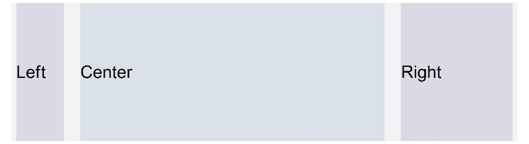

# Grid

>  **NOTE**
>
>  - This module is deprecated since API version 9. You are advised to use [GridCol](ts-container-gridcol.md) and [GridRow](ts-container-gridrow.md) instead.
>
>  - The column width and column gap in the grid layout are determined by the nearest parent component **GridContainer**. The component tree that uses grid attributes must contain one **GridContainer** component or more.
>
>  - To call the **gridSpan** or **gridOffset** attribute, its parent or ancestor component must be **GridContainer**.

## Attributes

| Name       | Type                                                    | Description                                                        |
| ----------- | ------------------------------------------------------------ | ------------------------------------------------------------ |
| useSizeType<sup>(deprecated) </sup> | {<br>xs?: number \| { span: number, offset: number },<br>sm?: number \| { span: number, offset: number },<br>md?: number \| { span: number, offset: number },<br>lg?: number \| { span: number, offset: number }<br>} | Number of occupied columns and offset columns for a specific device width type. **span** indicates the number of occupied columns, and **offset** indicates the number of offset columns.<br>If the value is of the number type, only the number of columns can be set. If the value is in the format of {"span": 1, "offset": 0}, both the number of occupied columns and the number of offset columns need to be set.<br>- **xs** indicates that the device width type is **SizeType.XS**.<br>- **sm** indicates that the device width type is **SizeType.SM**.<br>- **md** indicates that the device width type is **SizeType.MD**.<br>- **lg** indicates that the device width type is **SizeType.LG**.<br>This attribute is deprecated since API version 9. You are advised to use [GridCol](ts-container-gridcol.md) and [GridRow](ts-container-gridrow.md) instead.|
| gridSpan<sup>(deprecated) </sup>    | number                   | Default number of occupied columns, that is, the number of occupied columns when **span** in **useSizeType** is not set.<br>**NOTE**<br>If the **span** attribute is set, the component width is determined by the grid layout.<br>Default value: **1**<br>**Atomic service API**: This API can be used in atomic services since API version 11.<br>This attribute is deprecated since API version 14. You are advised to use [GridCol](ts-container-gridcol.md) and [GridRow](ts-container-gridrow.md) instead. |
| gridOffset<sup>(deprecated) </sup>  | number                                                       | Default number of offset columns, that is, the number of offset columns in the start direction of the parent component (which is also the nth column that the component is in) when **offset** in **useSizeType** is not set.<br>**NOTE**<br>- After this attribute is set, the horizontal layout of the current component does not follow the original layout of the parent component. Instead, it offsets along the start direction of the parent component.<br>- Offset = (Column width + Gap) \* Number of columns.<br>- After this attribute is set, sibling components will be arranged relatively to this component, as in the relative layout.<br>Default value: **0**<br>**Atomic service API**: This API can be used in atomic services since API version 11.<br>This attribute is deprecated since API version 14. You are advised to use [GridCol](ts-container-gridcol.md) and [GridRow](ts-container-gridrow.md) instead.|

## Example

This example demonstrates how to set different widths for various device types and individually configure the **span** and **offset** attributes for components. It also shows how to implement the same effect using **useSizeType** for sm-sized devices.

<!--code_no_check-->

```ts
// xxx.ets
@Entry
@Component
struct GridContainerExample1 {
  build() {
    Column() {
      Text('useSizeType').fontSize(15).fontColor(0xCCCCCC).width('90%')
      GridContainer() {
        Row() {
          Row() {
            Text('Left').fontSize(25)
          }
          .useSizeType({
            xs: { span: 1, offset: 0 }, sm: { span: 1, offset: 0 },
            md: { span: 1, offset: 0 }, lg: { span: 2, offset: 0 }
          })
          .height("100%")
          .backgroundColor(0x66bbb2cb)

          Row() {
            Text('Center').fontSize(25)
          }
          .useSizeType({
            xs: { span: 1, offset: 0 }, sm: { span: 2, offset: 1 },
            md: { span: 5, offset: 1 }, lg: { span: 7, offset: 2 }
          })
          .height("100%")
          .backgroundColor(0x66b6c5d1)

          Row() {
            Text('Right').fontSize(25)
          }
          .useSizeType({
            xs: { span: 1, offset: 0 }, sm: { span: 1, offset: 3 },
            md: { span: 2, offset: 6 }, lg: { span: 3, offset: 9 }
          })
          .height("100%")
          .backgroundColor(0x66bbb2cb)
        }
        .height(200)

      }
      .backgroundColor(0xf1f3f5)
      .margin({ top: 10 })

      // Set the span and offset of the component separately. The resultant effect is equivalent to that achieved by using sm in useSizeType on the device of the sm type.
      Text('gridSpan,gridOffset').fontSize(15).fontColor(0xCCCCCC).width('90%')
      GridContainer() {
        Row() {
          Row() {
            Text('Left').fontSize(25)
          }
          .gridSpan(1)
          .height("100%")
          .backgroundColor(0x66bbb2cb)

          Row() {
            Text('Center').fontSize(25)
          }
          .gridSpan(2)
          .gridOffset(1)
          .height("100%")
          .backgroundColor(0x66b6c5d1)

          Row() {
            Text('Right').fontSize(25)
          }
          .gridSpan(1)
          .gridOffset(3)
          .height("100%")
          .backgroundColor(0x66bbb2cb)
        }.height(200)
      }
    }
  }
}
```

**Figure 1** Device width type SM


**Figure 2** Device width type MD



**Figure 3** Device width type LG


**Figure 4** Setting gridSpan and gridOffset separately has the same effect as useSizeType for a specific device width type


