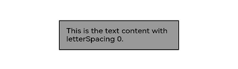

# Image Effects

Image effects include blur, shadow, spherical effect, and much more.

>  **NOTE**
>
>  The APIs of this module are supported since API version 7. Updates will be marked with a superscript to indicate their earliest API version.

## blur

blur(value: number, options?: BlurOptions)

Applies a foreground blur effect to the component.

**Widget capability**: This API can be used in ArkTS widgets since API version 9.

**Atomic service API**: This API can be used in atomic services since API version 11.

**System capability**: SystemCapability.ArkUI.ArkUI.Full

**Parameters**

| Name               | Type                                                        | Mandatory| Description                                                        |
| --------------------- | ------------------------------------------------------------ | ---- | ------------------------------------------------------------ |
| value                 | number                                                       | Yes  | Foreground blur effect to apply to the component. The input parameter is the blur radius. The larger the radius is, the more blurred the content is. If the value is **0**, the content is not blurred.|
| options<sup>11+</sup> | [BlurOptions](ts-universal-attributes-foreground-blur-style.md#bluroptions11) | No  | Grayscale parameters.                                                |

## blur<sup>16+</sup>

blur(blurRadius: Optional\<number>, options?: BlurOptions)

Applies a foreground blur effect to the component. Compared to [blur](#blur), the **blurRadius** parameter supports the **undefined** type.

**Widget capability**: This API can be used in ArkTS widgets since API version 16.

**Atomic service API**: This API can be used in atomic services since API version 16.

**System capability**: SystemCapability.ArkUI.ArkUI.Full

**Parameters**

| Name               | Type                                                        | Mandatory| Description                                                        |
| --------------------- | ------------------------------------------------------------ | ---- | ------------------------------------------------------------ |
| blurRadius            | Optional\<number>                                            | Yes  | Foreground blur effect to apply to the component. The input parameter is the blur radius. The larger the radius is, the more blurred the content is. If the value is **0**, the content is not blurred.<br>If **blurRadius** is set to **undefined**, the previous value is retained.|
| options<sup>16+</sup> | [BlurOptions](ts-universal-attributes-foreground-blur-style.md#bluroptions11) | No  | Grayscale parameters.                                                |

## shadow

shadow(value: ShadowOptions | ShadowStyle)

Applies a shadow effect to the component.

**Widget capability**: Since API version 9, this API is supported in ArkTS widgets. Yet, the [ShadowStyle](ts-universal-attributes-image-effect.md#shadowstyle10) type is not supported in ArkTS widgets.

**Atomic service API**: This API can be used in atomic services since API version 11.

**System capability**: SystemCapability.ArkUI.ArkUI.Full

**Parameters**

| Name| Type                                                        | Mandatory| Description                                                        |
| ------ | ------------------------------------------------------------ | ---- | ------------------------------------------------------------ |
| value  | [ShadowOptions](#shadowoptions) \| [ShadowStyle](#shadowstyle10)<sup>10+</sup> | Yes  | Shadow of the component.<br>When the value type is **ShadowOptions**, the blur radius, shadow color, and offset along the x-axis and y-axis can be specified.<br>When the value type is **ShadowStyle**, the shadow style can be specified.|

## shadow<sup>16+</sup>

shadow(options: Optional\<ShadowOptions | ShadowStyle>)

Applies a shadow effect to the component. Compared to [shadow](#shadow), the **options** parameter supports the **undefined** type.

**Widget capability**: Since API version 16, this API is supported in ArkTS widgets. Yet, the [ShadowStyle](ts-universal-attributes-image-effect.md#shadowstyle10) type is not supported in ArkTS widgets.

**Atomic service API**: This API can be used in atomic services since API version 16.

**System capability**: SystemCapability.ArkUI.ArkUI.Full

**Parameters**

| Name | Type                                                        | Mandatory                                                        | Description|
| ------- | ------------------------------------------------------------ | ------------------------------------------------------------ | ---- |
| options | Optional\<[ShadowOptions](#shadowoptions) \| [ShadowStyle](#shadowstyle10<sup>10+</sup>> | Shadow of the component.<br>When the value type is **ShadowOptions**, the blur radius, shadow color, and offset along the x-axis and y-axis can be specified.<br>When the value type is **ShadowStyle**, the shadow style can be specified.<br>If **options** is **undefined**, the component reverts to its original effect with no shadow.|      |

## grayscale

grayscale(value: number)

Applies a grayscale effect to the component.

**Widget capability**: This API can be used in ArkTS widgets since API version 9.

**Atomic service API**: This API can be used in atomic services since API version 11.

**System capability**: SystemCapability.ArkUI.ArkUI.Full

**Parameters**

| Name| Type  | Mandatory| Description                                                        |
| ------ | ------ | ---- | ------------------------------------------------------------ |
| value  | number | Yes  | Grayscale conversion ratio of the component. If the value is **1.0**, the component is completely converted to grayscale. If the value is **0.0**, the component remains unchanged. Between **0** and **1**, the value applies a linear multiplier on the grayscale effect. The unit is percentage.<br>Default value: **0.0**<br>Value range: [0.0, 1.0]<br>**NOTE**<br>A value less than **0.0** evaluates to the value **0.0**. A value greater than **1.0** evaluates to the value **1.0**.|

## grayscale<sup>16+</sup>

grayscale(grayscale: Optional\<number>)

Applies a grayscale effect to the component. Compared to [grayscale](#grayscale), the **grayscale** parameter supports the **undefined** type.

**Widget capability**: This API can be used in ArkTS widgets since API version 16.

**Atomic service API**: This API can be used in atomic services since API version 16.

**System capability**: SystemCapability.ArkUI.ArkUI.Full

**Parameters**

| Name   | Type             | Mandatory| Description                                                        |
| --------- | ----------------- | ---- | ------------------------------------------------------------ |
| grayscale | Optional\<number> | Yes  | Grayscale conversion ratio of the component. If the value is **1.0**, the component is completely converted to grayscale. If the value is **0.0**, the component remains unchanged. Between **0** and **1**, the value applies a linear multiplier on the grayscale effect. The unit is percentage.<br>Default value: **0.0**<br>Value range: [0.0, 1.0]<br>**NOTE**<br>A value less than **0.0** evaluates to the value **0.0**. A value greater than **1.0** evaluates to the value **1.0**.<br>If **grayscale** is set to **undefined**, the default value is used, which means the component reverts to its original effect with no grayscale.|

## brightness

brightness(value: number)

Applies a brightness effect to the component.

**Widget capability**: This API can be used in ArkTS widgets since API version 9.

**Atomic service API**: This API can be used in atomic services since API version 11.

**System capability**: SystemCapability.ArkUI.ArkUI.Full

**Parameters**

| Name| Type  | Mandatory| Description                                                        |
| ------ | ------ | ---- | ------------------------------------------------------------ |
| value  | number | Yes  | Brightness of the component. The value **1** indicates no effects. The value **0** indicates the complete darkness. If the value is less than **1**, the brightness decreases. If the value is greater than **1**, the brightness increases. A larger value indicates a higher brightness. A brightness of 2 turns the component completely white.<br>Default value: **1.0**<br>Recommended value range: [0, 2]<br>**NOTE**<br>A value less than 0 evaluates to the value **0**.<br>**Widget capability**: This API can be used in ArkTS widgets since API version 9.|

## brightness<sup>16+</sup>

brightness(brightness: Optional\<number>)

Applies a brightness effect to the component. Compared to [brightness](#brightness), the **brightness** parameter supports the **undefined** type.

**Widget capability**: This API can be used in ArkTS widgets since API version 16.

**Atomic service API**: This API can be used in atomic services since API version 16.

**System capability**: SystemCapability.ArkUI.ArkUI.Full

**Parameters**

| Name    | Type             | Mandatory| Description                                                        |
| ---------- | ----------------- | ---- | ------------------------------------------------------------ |
| brightness | Optional\<number> | Yes  | Brightness of the component. The value **1** indicates no effects. The value **0** indicates the complete darkness. If the value is less than **1**, the brightness decreases. If the value is greater than **1**, the brightness increases. A larger value indicates a higher brightness. A brightness of 2 turns the component completely white.<br>Default value: **1.0**<br>Recommended value range: [0, 2]<br>**NOTE**<br>A value less than 0 evaluates to the value **0**.<br>**Widget capability**: This API can be used in ArkTS widgets since API version 16.<br>If **brightness** is **undefined**, the brightness level is reset to **0**.|

## saturate

saturate(value: number)

Applies a saturation effect to the component.

**Widget capability**: This API can be used in ArkTS widgets since API version 9.

**Atomic service API**: This API can be used in atomic services since API version 11.

**System capability**: SystemCapability.ArkUI.ArkUI.Full

**Parameters**

| Name| Type  | Mandatory| Description                                                        |
| ------ | ------ | ---- | ------------------------------------------------------------ |
| value  | number | Yes  | Saturation of the component. The saturation is the ratio of the chromatic component to the achromatic component (gray) in a color. If the value is **1**, the original image is displayed. If the value is greater than **1**, a higher percentage of the chromatic component indicates a higher saturation. If the value is less than **1**, a higher percentage of the achromatic component indicates a lower saturation. The unit is percentage.<br>Default value: **1.0**<br>Recommended value range: [0, 50)<br>**NOTE**<br>A value less than 0 evaluates to the value **0**.|

## saturate<sup>16+</sup>

saturate(saturate: Optional\<number>)

Applies a saturation effect to the component. Compared to [saturate](#saturate), the **saturate** parameter supports the **undefined** type.

**Widget capability**: This API can be used in ArkTS widgets since API version 16.

**Atomic service API**: This API can be used in atomic services since API version 16.

**System capability**: SystemCapability.ArkUI.ArkUI.Full

**Parameters**

| Name  | Type             | Mandatory| Description                                                        |
| -------- | ----------------- | ---- | ------------------------------------------------------------ |
| saturate | Optional\<number> | Yes  | Saturation of the component. The saturation is the ratio of the chromatic component to the achromatic component (gray) in a color. If the value is **1**, the original image is displayed. If the value is greater than **1**, a higher percentage of the chromatic component indicates a higher saturation. If the value is less than **1**, a higher percentage of the achromatic component indicates a lower saturation. The unit is percentage.<br>Default value: **1.0**<br>Recommended value range: [0, 50)<br>**NOTE**<br>A value less than 0 evaluates to the value **0**.<br>If **saturate** is **undefined**, the saturation effect is reset to **1.0**.|

## contrast

contrast(value: number)

Applies a contrast effect to the component.

**Widget capability**: This API can be used in ArkTS widgets since API version 9.

**Atomic service API**: This API can be used in atomic services since API version 11.

**System capability**: SystemCapability.ArkUI.ArkUI.Full

**Parameters**

| Name| Type  | Mandatory| Description                                                        |
| ------ | ------ | ---- | ------------------------------------------------------------ |
| value  | number | Yes  | Contrast of the component. The input parameter is a contrast value. If the value is **1**, the source image is displayed. If the value is greater than 1, a larger value indicates a higher contrast and a clearer image. If the value is less than 1, a smaller value indicates a lower contrast is. If the value is **0**, the image becomes all gray. The unit is percentage.<br>Default value: **1.0**<br>Recommended value range: [0, 10)<br>**NOTE**<br>A value less than 0 evaluates to the value **0**.|

## contrast<sup>16+</sup>

contrast(contrast: Optional\<number>)

Applies a contrast effect to the component. Compared to [contrast](#contrast), the **contrast** parameter supports the **undefined** type.

**Widget capability**: This API can be used in ArkTS widgets since API version 16.

**Atomic service API**: This API can be used in atomic services since API version 16.

**System capability**: SystemCapability.ArkUI.ArkUI.Full

**Parameters**

| Name  | Type             | Mandatory| Description                                                        |
| -------- | ----------------- | ---- | ------------------------------------------------------------ |
| contrast | Optional\<number> | Yes  | Contrast of the component. The input parameter is a contrast value. If the value is **1**, the source image is displayed. If the value is greater than 1, a larger value indicates a higher contrast and a clearer image. If the value is less than 1, a smaller value indicates a lower contrast is. If the value is **0**, the image becomes all gray. The unit is percentage.<br>Default value: **1.0**<br>Recommended value range: [0, 10)<br>**NOTE**<br>A value less than 0 evaluates to the value **0**.<br>If **contrast** is **undefined**, the contrast effect is reset to **1.0**.|

## invert

invert(value: number | InvertOptions)

Inverts the image.

**Widget capability**: This API can be used in ArkTS widgets since API version 9.

**Atomic service API**: This API can be used in atomic services since API version 11.

**System capability**: SystemCapability.ArkUI.ArkUI.Full

**Parameters**

| Name| Type                                                        | Mandatory| Description                                                        |
| ------ | ------------------------------------------------------------ | ---- | ------------------------------------------------------------ |
| value  | number \| [InvertOptions](#invertoptions11)<sup>11+</sup> | Yes  | How the image is inverted.<br>If the value is of the number type, it indicates the inversion ratio. If the value is **1**, the image is completely inverted. If the value is **0**, the image remains unchanged. The unit is percentage.<br>Value range: [0, 1]<br>A value less than 0 evaluates to the value **0**.<br>If the value is of the InvertOptions type, the grayscale value of the background color is compared with the threshold range. If the grayscale value is greater than the upper bound of the threshold range, the **high** value is used. If the grayscale value is less than the lower bound of the threshold range, the **low** value is used. If the grayscale value is within the threshold range, the background color changes linearly from high to low.|

## invert<sup>16+</sup>

invert(options: Optional\<number | InvertOptions>)

Inverts the image. Compared to [invert](#invert), the **options** parameter supports the **undefined** type.

**Widget capability**: This API can be used in ArkTS widgets since API version 16.

**Atomic service API**: This API can be used in atomic services since API version 16.

**System capability**: SystemCapability.ArkUI.ArkUI.Full

**Parameters**

| Name | Type                                                        | Mandatory| Description                                                        |
| ------- | ------------------------------------------------------------ | ---- | ------------------------------------------------------------ |
| options | Optional\<number \| [InvertOptions](#invertoptions11)<sup>11+</sup>> | Yes  | How the image is inverted.<br>If the value is of the number type, it indicates the inversion ratio. If the value is **1**, the image is completely inverted. If the value is **0**, the image remains unchanged. The unit is percentage.<br>Value range: [0, 1]<br>A value less than 0 evaluates to the value **0**.<br>If the value is of the InvertOptions type, the grayscale value of the background color is compared with the threshold range. If the grayscale value is greater than the upper bound of the threshold range, the **high** value is used. If the grayscale value is less than the lower bound of the threshold range, the **low** value is used. If the grayscale value is within the threshold range, the background color changes linearly from high to low.<br>If **options** is **undefined**, the component reverts to its original effect.|

## sepia

sepia(value: number)

Sepia conversion ratio of the component.

**Widget capability**: This API can be used in ArkTS widgets since API version 9.

**Atomic service API**: This API can be used in atomic services since API version 11.

**System capability**: SystemCapability.ArkUI.ArkUI.Full

**Parameters**

| Name| Type  | Mandatory| Description                                                        |
| ------ | ------ | ---- | ------------------------------------------------------------ |
| value  | number | Yes  | Sepia conversion ratio of the component. If the value is **1**, the image is completely sepia. If the value is **0**, the component remains unchanged. The unit is percentage.|

## sepia<sup>16+</sup>

sepia(sepia: Optional\<number>)

Sepia conversion ratio of the component. Compared to [sepia](#sepia), the **sepia** parameter supports the **undefined** type.

**Widget capability**: This API can be used in ArkTS widgets since API version 16.

**Atomic service API**: This API can be used in atomic services since API version 16.

**System capability**: SystemCapability.ArkUI.ArkUI.Full

**Parameters**

| Name| Type             | Mandatory| Description                                                        |
| ------ | ----------------- | ---- | ------------------------------------------------------------ |
| sepia  | Optional\<number> | Yes  | Sepia conversion ratio of the component. If the value is **1**, the image is completely sepia. If the value is **0**, the component remains unchanged. The unit is percentage.<br>If **sepia** is **undefined**, the component reverts to its original effect.|

## hueRotate

hueRotate(value: number | string)

Rotates the hue of the component.

**Widget capability**: This API can be used in ArkTS widgets since API version 9.

**Atomic service API**: This API can be used in atomic services since API version 11.

**System capability**: SystemCapability.ArkUI.ArkUI.Full

**Parameters**

| Name| Type                      | Mandatory| Description                                                        |
| ------ | -------------------------- | ---- | ------------------------------------------------------------ |
| value  | number \| string | Yes  | Hue rotation angle of the component.<br>Default value: **'0deg'**<br>Value range: (-∞, +∞)<br>**NOTE**<br>A rotation of 360 degrees leaves the color unchanged. A rotation of 180 degrees and then -180 degrees also leaves the color unchanged. When the data type is number, the value **90** is equivalent to **'90deg'**.|

## hueRotate<sup>16+</sup>

hueRotate(rotation: Optional\<number | string>)

Rotates the hue of the component. Compared to [hueRotate](#huerotate), the **rotation** parameter supports the **undefined** type.

**Widget capability**: This API can be used in ArkTS widgets since API version 16.

**Atomic service API**: This API can be used in atomic services since API version 16.

**System capability**: SystemCapability.ArkUI.ArkUI.Full

**Parameters**

| Name  | Type                                 | Mandatory                                                        | Description|
| -------- | ------------------------------------- | ------------------------------------------------------------ | ---- |
| rotation | Optional\<number \| string> | Hue rotation angle of the component.<br>Default value: **'0deg'**<br>Value range: (-∞, +∞)<br>**NOTE**<br>A rotation of 360 degrees leaves the color unchanged. A rotation of 180 degrees and then -180 degrees also leaves the color unchanged. When the data type is number, the value **90** is equivalent to **'90deg'**.<br>If **sepia** is **undefined**, the component reverts to its original effect with no hue rotation.|      |

## colorBlend<sup>7+</sup>

colorBlend(value: Color | string | Resource)

Applies a color blend effect to the component.

**System capability**: SystemCapability.ArkUI.ArkUI.Full

**Atomic service API**: This API can be used in atomic services since API version 11.

**Widget capability**: This API can be used in ArkTS widgets since API version 9.

**Parameters**

| Name| Type                                                        | Mandatory| Description                                          |
| ------ | ------------------------------------------------------------ | ---- | ---------------------------------------------- |
| value  | [Color](ts-appendix-enums.md#color) \| string \| [Resource](ts-types.md#resource) | Yes  | Color to blend with the component.|

## colorBlend<sup>16+</sup>

colorBlend(color: Optional\<Color | string | Resource>)

Applies a color blend effect to the component. Compared to [colorBlend<sup>7+</sup>](#colorblend7), the **color** parameter supports the **undefined** type.

**System capability**: SystemCapability.ArkUI.ArkUI.Full

**Atomic service API**: This API can be used in atomic services since API version 16.

**Widget capability**: This API can be used in ArkTS widgets since API version 16.

**Parameters**

| Name| Type                                                        | Mandatory| Description                                                        |
| ------ | ------------------------------------------------------------ | ---- | ------------------------------------------------------------ |
| color  | Optional\<[Color](ts-appendix-enums.md#color) \| string \| [Resource](ts-types.md#resource)> | Yes  | Color to blend with the component.<br>If **color** is **undefined**, the component reverts to its original effect with no color blending.|

## linearGradientBlur<sup>12+</sup> 

linearGradientBlur(value: number, options: LinearGradientBlurOptions)

Applies a linear gradient foreground blur effect to the component.

**Atomic service API**: This API can be used in atomic services since API version 12.

**System capability**: SystemCapability.ArkUI.ArkUI.Full

**Parameters**

| Name | Type                                                        | Mandatory| Description                                                        |
| ------- | ------------------------------------------------------------ | ---- | ------------------------------------------------------------ |
| value   | number                                                       | Yes  | Blur radius. A larger value indicates a higher blur degree. If the value is 0, the content is not blurred.<br>Value range: [0, 1000]<br>Linear gradient blur consists of two parts: **fractionStops** and **direction**.|
| options | [LinearGradientBlurOptions](#lineargradientbluroptions12) | Yes  | Linear gradient blur effect.                                      |

## linearGradientBlur<sup>16+</sup> 

linearGradientBlur(value: Optional\<number>, options: Optional\<LinearGradientBlurOptions>)

Applies a linear gradient foreground blur effect to the component. Compared to [linearGradientBlur<sup>12+</sup>](#lineargradientblur12), the **value** parameter supports the **undefined** type.

**Atomic service API**: This API can be used in atomic services since API version 16.

**System capability**: SystemCapability.ArkUI.ArkUI.Full

**Parameters**

| Name | Type                                                        | Mandatory| Description                                                        |
| ------- | ------------------------------------------------------------ | ---- | ------------------------------------------------------------ |
| value   | Optional\<number>                                            | Yes  | Blur radius. A larger value indicates a higher blur degree. If the value is 0, the content is not blurred.<br>Value range: [0, 1000]<br>Linear gradient blur consists of two parts: **fractionStops** and **direction**.<br>If **color** is **undefined**, the gradient blur effect reverts to **0**.|
| options | Optional\<[LinearGradientBlurOptions](#lineargradientbluroptions12)> | Yes  | Linear gradient blur effect.<br>If **options** is **undefined**, the gradient blur effect reverts to **0**.|

## renderGroup<sup>10+</sup>

renderGroup(value: boolean)

Sets whether the component and its child components are rendered off the screen as a whole before being blended with its parent.

**Atomic service API**: This API can be used in atomic services since API version 11.

**System capability**: SystemCapability.ArkUI.ArkUI.Full

**Parameters**

| Name| Type   | Mandatory| Description                                                        |
| ------ | ------- | ---- | ------------------------------------------------------------ |
| value  | boolean | Yes  | Whether the component and its child components are rendered off the screen as a whole before being blended with its parent. If the opacity of the component is not 1, the drawing effect may vary depending on the value.<br>Default value: **false**|

## renderGroup<sup>16+</sup>

renderGroup(isGroup: Optional\<boolean>)

Sets whether the component and its child components are rendered off the screen as a whole before being blended with its parent. Compared to [renderGroup<sup>10+</sup>](#rendergroup10), the **isGroup** parameter supports the **undefined** type.

**Atomic service API**: This API can be used in atomic services since API version 16.

**System capability**: SystemCapability.ArkUI.ArkUI.Full

**Parameters**

| Name | Type              | Mandatory| Description                                                        |
| ------- | ------------------ | ---- | ------------------------------------------------------------ |
| isGroup | Optional\<boolean> | Yes  | Whether the component and its child components are rendered off the screen as a whole before being blended with its parent. If the opacity of the component is not 1, the drawing effect may vary depending on the value.<br>Default value: **false**<br>If **isGroup** is **undefined**, the component reverts to its original effect of not enabling offscreen rendering as a whole before blending with the parent component.|

## blendMode<sup>11+</sup> 

blendMode(value: BlendMode, type?: BlendApplyType)

Defines how the component's content (including the content of it child components) is blended with the existing content on the canvas (possibly offscreen canvas) below.

**Widget capability**: This API can be used in ArkTS widgets since API version 11.

**Atomic service API**: This API can be used in atomic services since API version 12.

**System capability**: SystemCapability.ArkUI.ArkUI.Full

**Parameters**

| Name| Type                               | Mandatory| Description                                                        |
| ------ | ----------------------------------- | ---- | ------------------------------------------------------------ |
| value  | [BlendMode](#blendmode11)   | Yes  | Blend mode.<br>Default value: **BlendMode.NONE**                       |
| type   | [BlendApplyType](#blendapplytype11) | No  | Whether the blend mode is implemented offscreen.<br>Default value: **BlendApplyType.FAST**<br>**NOTE**<br>1. Available options:<br>**BlendApplyType.FAST**: The blend mode is not implemented offscreen.<br>2. When **BlendApplyType.OFFSCREEN** is set, an offscreen canvas the size of the current component is created. The content of the current component (including child components) is then drawn onto the offscreen canvas, and blended with the existing content on the canvas below using the specified blend mode.|

## blendMode<sup>16+</sup> 

blendMode(mode: Optional\<BlendMode>, type?: BlendApplyType)

Defines how the component's content (including the content of it child components) is blended with the existing content on the canvas (possibly offscreen canvas) below. Compared to [blendMode<sup>11+</sup>](#blendmode11), the **mode** parameter supports the **undefined** type.

**Widget capability**: This API can be used in ArkTS widgets since API version 16.

**Atomic service API**: This API can be used in atomic services since API version 16.

**System capability**: SystemCapability.ArkUI.ArkUI.Full

**Parameters**

| Name| Type                           | Mandatory| Description                                                        |
| ------ | ------------------------------- | ---- | ------------------------------------------------------------ |
| mode | Optional\<[BlendMode](#blendmode11)> | Yes  | Blend mode.<br>Default value: **BlendMode.NONE**<br>If **mode** is **undefined**, the component reverts to its original effect of not enabling offscreen rendering as a whole before blending with the parent component.|
| type   | [BlendApplyType](#blendapplytype11)  |    No   | Whether the blend mode is implemented offscreen.<br>Default value: **BlendApplyType.FAST**<br>**NOTE**<br>1. Available options:<br>**BlendApplyType.FAST**: The blend mode is not implemented offscreen.<br>2. When **BlendApplyType.OFFSCREEN** is set, an offscreen canvas the size of the current component is created. The content of the current component (including child components) is then drawn onto the offscreen canvas, and blended with the existing content on the canvas below using the specified blend mode.    |

## BlendApplyType<sup>11+</sup>

Defines how to apply the specified blend mode to the content of a view.

**Widget capability**: This API can be used in ArkTS widgets since API version 11.

**Atomic service API**: This API can be used in atomic services since API version 12.

**System capability**: SystemCapability.ArkUI.ArkUI.Full

| Name          | Description                                                            |
| ---------------| ---------------------------------------------------------------- |
| FAST           |   The content of the view is blended in sequence on the target image.                       |
| OFFSCREEN      |   The content of the component and its child components are drawn on the offscreen canvas, and then blended with the existing content on the canvas.   |

## useShadowBatching<sup>11+</sup> 

useShadowBatching(value: boolean)

Sets whether to draw shadows of child nodes in the component at the same layer, so that the shadows of elements at the same layer overlap.

**Atomic service API**: This API can be used in atomic services since API version 12.

**System capability**: SystemCapability.ArkUI.ArkUI.Full

**Widget capability**: This API can be used in ArkTS widgets since API version 11.

**Parameters**

| Name| Type   | Mandatory| Description                                                        |
| ------ | ------- | ---- | ------------------------------------------------------------ |
| value  | boolean | Yes  | Whether to draw shadows of child nodes in the component at the same layer, so that the shadows of elements at the same layer overlap.<br>Default value: **false**<br>**NOTE**<br>1. When this feature is disabled (default), if the shadow radius of a child node is large, the shadows of the child nodes may overlap. This overlap issue does not occur when the feature is enabled.<br>2. Avoid nesting **useShadowBatching**. When used in nested mode, **useShadowBatching** takes effect for the current child node only and cannot be recursively used.|

## useShadowBatching<sup>16+</sup> 

useShadowBatching(use: Optional\<boolean>)

Sets whether to draw shadows of child nodes in the component at the same layer, so that the shadows of elements at the same layer overlap. Compared to [useShadowBatching<sup>11+</sup>](#useshadowbatching11), the **use** parameter supports the **undefined** type.

**Atomic service API**: This API can be used in atomic services since API version 16.

**System capability**: SystemCapability.ArkUI.ArkUI.Full

**Widget capability**: This API can be used in ArkTS widgets since API version 11.

**Parameters**

| Name| Type              | Mandatory| Description                                                        |
| ------ | ------------------ | ---- | ------------------------------------------------------------ |
| use    | Optional\<boolean> | Yes  | Whether to draw shadows of child nodes in the component at the same layer, so that the shadows of elements at the same layer overlap.<br>Default value: **false**<br>**NOTE**<br>1. When this feature is disabled (default), if the shadow radius of a child node is large, the shadows of the child nodes may overlap. This overlap issue does not occur when the feature is enabled.<br>2. Avoid nesting **useShadowBatching**. When used in nested mode, **useShadowBatching** takes effect for the current child node only and cannot be recursively used.<br>If **use** is **undefined**, the component reverts to its original effect of not using shadow overlapping.|

## sphericalEffect<sup>12+</sup>

sphericalEffect(value: number)

Applies a spherical effect to the component.

**Atomic service API**: This API can be used in atomic services since API version 12.

**System capability**: SystemCapability.ArkUI.ArkUI.Full

**Parameters**

| Name| Type  | Mandatory| Description                                                        |
| ------ | ------ | ---- | ------------------------------------------------------------ |
| value  | number | Yes  | Spherical degree of the component.<br>The value ranges from 0 to 1.<br>**NOTE**<br>1. If the value is **0**, the component remains unchanged. If the value is 1, the component is completely spherical. Between **0** and **1**, a larger value indicates a higher spherical degree.<br>A value less than 0 is handled as the value **0**. A value greater than 1 is handled as the value **1**.<br>2. The component's shadow and outer stroke do not support spherical effects.<br>3. If the value is greater than 0, the component is frozen and not updated, and its content is drawn to the transparent offscreen buffer. To update the component attributes, set the value to **0**.|

## sphericalEffect<sup>16+</sup>

sphericalEffect(effect: Optional\<number>)

Applies a spherical effect to the component. Compared to [sphericalEffect<sup>12+</sup>](#sphericaleffect12), the **effect** parameter supports the **undefined** type.

**Atomic service API**: This API can be used in atomic services since API version 16.

**System capability**: SystemCapability.ArkUI.ArkUI.Full

**Parameters**

| Name| Type             | Mandatory| Description                                                        |
| ------ | ----------------- | ---- | ------------------------------------------------------------ |
| effect | Optional\<number> | Yes  | Spherical degree of the component.<br>The value ranges from 0 to 1.<br>**NOTE**<br>1. If the value is **0**, the component remains unchanged. If the value is 1, the component is completely spherical. Between **0** and **1**, a larger value indicates a higher spherical degree.<br>A value less than 0 is handled as the value **0**. A value greater than 1 is handled as the value **1**.<br>2. The component's shadow and outer stroke do not support spherical effects.<br>3. If the value is greater than 0, the component is frozen and not updated, and its content is drawn to the transparent offscreen buffer. To update the component attributes, set the value to **0**.<br>If **effect** is **undefined**, the spherical degree reverts to **0**.|

## lightUpEffect<sup>12+</sup> 

lightUpEffect(value: number)

Applies a light up effect to the component.

**Atomic service API**: This API can be used in atomic services since API version 12.

**System capability**: SystemCapability.ArkUI.ArkUI.Full

**Parameters**

| Name| Type  | Mandatory| Description                                                        |
| ------ | ------ | ---- | ------------------------------------------------------------ |
| value  | number | Yes  | Light up degree of the component.<br>The value ranges from 0 to 1.<br>If the value is **0**, the component is dark. If the value is **1**, the component is fully illuminated. Between **0** and **1**, a larger value indicates higher luminance. A value less than 0 is handled as the value **0**. A value greater than 1 is handled as the value **1**.|

## lightUpEffect<sup>16+</sup> 

lightUpEffect(degree: Optional\<number>)

Applies a light up effect to the component. Compared to [lightUpEffect<sup>12+</sup>](#lightupeffect12), the **degree** parameter supports the **undefined** type.

**Atomic service API**: This API can be used in atomic services since API version 16.

**System capability**: SystemCapability.ArkUI.ArkUI.Full

**Parameters**

| Name| Type             | Mandatory| Description                                                        |
| ------ | ----------------- | ---- | ------------------------------------------------------------ |
| degree | Optional\<number> | Yes  | Light up degree of the component.<br>The value ranges from 0 to 1.<br>If the value is **0**, the component is dark. If the value is **1**, the component is fully illuminated. Between **0** and **1**, a larger value indicates higher luminance. A value less than 0 is handled as the value **0**. A value greater than 1 is handled as the value **1**.<br>If **degree** is **undefined**, the light up degree reverts to **1**.|

## pixelStretchEffect<sup>12+</sup> 

pixelStretchEffect(options: PixelStretchEffectOptions)

Applies a pixel stretch effect to the component.

**Atomic service API**: This API can be used in atomic services since API version 12.

**System capability**: SystemCapability.ArkUI.ArkUI.Full

**Parameters**

| Name | Type                                                     | Mandatory| Description                                                        |
| ------- | --------------------------------------------------------- | ---- | ------------------------------------------------------------ |
| options | [PixelStretchEffectOptions](#pixelstretcheffectoptions10) | Yes  | Pixel stretch effect options.<br>The value includes the length by which a pixel is stretched toward the four edges.<br>**NOTE**<br>1. If the length is a positive value, the original image is stretched, and the image size increases. The edge pixels grow by the set length toward the top, bottom, left, and right edges.<br>2. If the length is a negative value, the original image shrinks as follows, but the image size remains unchanged:<br>Shrinking mode:<br>(1) The image shrinks from the four edges by the absolute value of length set through **options**.<br>(2) The image is stretched back to the original size with edge pixels.<br>3. Constraints on **options**:<br>(1) The length values for the four edges must be all positive or all negative. That is, the four edges are stretched or shrink at the same time in the same direction.<br>(2) The length values must all be a percentage or a specific value. Combined use of the percentage and specific value is not allowed.<br>(3) If the input value is invalid, the image is displayed as {0, 0, 0, 0}, that is, the image is the same as the original image.|

## pixelStretchEffect<sup>16+</sup> 

pixelStretchEffect(options: Optional\<PixelStretchEffectOptions>)

Applies a pixel stretch effect to the component. Compared to [pixelStretchEffect<sup>12+</sup>](#pixelstretcheffect12), the **options** parameter supports the **undefined** type.

**Atomic service API**: This API can be used in atomic services since API version 16.

**System capability**: SystemCapability.ArkUI.ArkUI.Full

**Parameters**

| Name | Type                                                        | Mandatory| Description                                                        |
| ------- | ------------------------------------------------------------ | ---- | ------------------------------------------------------------ |
| options | Optional\<[PixelStretchEffectOptions](#pixelstretcheffectoptions10)> | Yes  | Pixel stretch effect options.<br>The value includes the length by which a pixel is stretched toward the four edges.<br>**NOTE**<br>1. If the length is a positive value, the original image is stretched, and the image size increases. The edge pixels grow by the set length toward the top, bottom, left, and right edges.<br>2. If the length is a negative value, the original image shrinks as follows, but the image size remains unchanged:<br>Shrinking mode:<br>(1) The image shrinks from the four edges by the absolute value of length set through **options**.<br>(2) The image is stretched back to the original size with edge pixels.<br>3. Constraints on **options**:<br>(1) The length values for the four edges must be all positive or all negative. That is, the four edges are stretched or shrink at the same time in the same direction.<br>(2) The length values must all be a percentage or a specific value. Combined use of the percentage and specific value is not allowed.<br>(3) If the input value is invalid, the image is displayed as {0, 0, 0, 0}, that is, the image is the same as the original image.<br>If **options** is **undefined**, the component reverts to its original effect with no pixel stretch.|

## PixelStretchEffectOptions<sup>10+</sup>

Describes the pixel stretch effect options.

**Atomic service API**: This API can be used in atomic services since API version 11.

**System capability**: SystemCapability.ArkUI.ArkUI.Full

| Name    | Type               | Mandatory  | Description            |
| ------ | ----------------- | ---- | -------------- |
| left   | [Length](ts-types.md#length) | No   | Length by which a pixel is stretched towards the left edge of the image.|
| right  | [Length](ts-types.md#length) | No   | Length by which a pixel is stretched towards the right edge of the image.|
| top    | [Length](ts-types.md#length) | No   | Length by which a pixel is stretched towards the top edge of the image.|
| bottom | [Length](ts-types.md#length) | No   | Length by which a pixel is stretched towards the right edge of the image.|

## systemBarEffect<sup>12+</sup>

systemBarEffect()

Applies a system bar effect to the component, which means to invert colors based on the background and add a blur.

**Atomic service API**: This API can be used in atomic services since API version 12.

**System capability**: SystemCapability.ArkUI.ArkUI.Full

## ShadowType<sup>10+<sup>

**Atomic service API**: This API can be used in atomic services since API version 11.

**System capability**: SystemCapability.ArkUI.ArkUI.Full

| Name      | Description                                  |
| -------- | ---------------------------------------- |
| COLOR    | Color.                                   |
| BLUR     | Blur.                                   |


## ShadowOptions

Provides the shadow attributes, including the blur radius, color, and offset along the x-axis and y-axis.


**System capability**: SystemCapability.ArkUI.ArkUI.Full

**Widget capability**: This API can be used in ArkTS widgets since API version 9.

| Name     | Type                                      | Mandatory  | Description                                      |
| ------- | ---------------------------------------- | ---- | ---------------------------------------- |
| radius  | number \| [Resource](ts-types.md#resource) | Yes   | Blur radius of the shadow.<br>Value range: [0, +∞)<br>Unit: px<br>**NOTE**<br>A value less than 0 evaluates to the value **0**.<br>To use a value in the vp unit, call [vp2px](ts-pixel-units.md#pixel-unit-conversion) to convert it into px.<br>If **radius** is of the Resource type, its value must be of the number type.<br>**Atomic service API**: This API can be used in atomic services since API version 11.|
| type<sup>10+</sup> | [ShadowType<sup>10+</sup>](#shadowtype10)  |      No   | Shadow type.<br>Default value: **COLOR**<br>**Atomic service API**: This API can be used in atomic services since API version 11.      |
| color   | [Color](ts-appendix-enums.md#color) \| string \| [Resource](ts-types.md#resource)\| [ColoringStrategy<sup>10+</sup> ](ts-appendix-enums.md#coloringstrategy10) | No   | Color of the shadow.<br>The default color is black.<br>**NOTE**<br>Since API version 11, this API supports **ColoringStrategy**, which cannot be used with ArkTS widgets or the [textShadow](ts-basic-components-text.md#textshadow10) attribute.<br>With **ColoringStrategy**, the average color or primary color can be obtained, and the obtained color is applied to the shadow drawing area.<br>The **'average'** string can be used to trigger the mode for obtaining the average color, and the **'primary'** string for obtaining the primary color.<br>**Atomic service API**: This API can be used in atomic services since API version 11.|
| offsetX | number \| [Resource](ts-types.md#resource) | No   | Offset of the shadow along the x-axis.<br>Default value: **0**<br>Unit: px<br>**NOTE**<br>To use a value in the vp unit, call [vp2px](ts-pixel-units.md#pixel-unit-conversion) to convert it into px.<br>If **offsetX** is of the Resource type, its value must be of the number type.<br> **Atomic service API**: This API can be used in atomic services since API version 11.|
| offsetY | number \| [Resource](ts-types.md#resource) | No   | Offset of the shadow along the y-axis.<br>Default value: **0**<br>Unit: px<br>**NOTE**<br>To use a value in the vp unit, call [vp2px](ts-pixel-units.md#pixel-unit-conversion) to convert it into px.<br>If **offsetY** is of the Resource type, its value must be of the number type.<br>**Atomic service API**: This API can be used in atomic services since API version 11.|
| fill<sup>11+</sup>     | boolean                                    | No   | Whether to fill the inside of the component with shadow.<br>The default value is **false**.<br>**NOTE**<br>This attribute does not take effect in [textShadow](ts-basic-components-text.md#textshadow10).<br>**Atomic service API**: This API can be used in atomic services since API version 12.|

## ShadowStyle<sup>10+</sup>

**Atomic service API**: This API can be used in atomic services since API version 11.

| Name               | Description    |
| ----------------- | ------ |
| OUTER_DEFAULT_XS  | Mini shadow. |
| OUTER_DEFAULT_SM  | Small shadow.  |
| OUTER_DEFAULT_MD  | Medium shadow.  |
| OUTER_DEFAULT_LG  | Large shadow.  |
| OUTER_FLOATING_SM | Floating small shadow.|
| OUTER_FLOATING_MD | Floating medium shadow.|

## BlendMode<sup>11+</sup>

>  **NOTE**
>
>  In the **blendMode** enums, **s** indicates the source pixel, **d** indicates the target pixel, **sa** indicates the opacity of the source pixel, **da** indicates the opacity of the target pixel, **r** indicates the pixel after blending, and **ra** indicates the opacity of the pixel after blending.

**Widget capability**: This API can be used in ArkTS widgets since API version 11.

**Atomic service API**: This API can be used in atomic services since API version 12.

| Name          | Description                                                            |
| ---------------| ------                                                        |
| NONE            | The top image is superimposed on the bottom image without any blending.             |
| CLEAR           | The target pixels covered by the source pixels are erased by being turned to completely transparent.                     |
| SRC             | r = s: Only the source pixels are displayed.                   |
| DST             | r = d: Only the target pixels are displayed.                 |
| SRC_OVER        | r = s + (1 - sa) * d: The source pixels are blended based on opacity and cover the target pixels.                |
| DST_OVER        | r = d + (1 - da) * s: The target pixels are blended based on opacity and cover on the source pixels.                |
| SRC_IN          | r = s * da: Only the part of the source pixels that overlap with the target pixels is displayed.                       |
| DST_IN          | r = d * sa: Only the part of the target pixels that overlap with the source pixels is displayed.                       |
| SRC_OUT         | r = s * (1 - da): Only the part of the source pixels that do not overlap with the target pixels is displayed.               |
| DST_OUT         | r = d * (1 - sa): Only the part of the target pixels that do not overlap with the source pixels is displayed.               |
| SRC_ATOP        | r = s * da + d * (1 - sa): The part of the source pixels that overlap with the target pixels is displayed and the part of the target pixels that do not overlap with the source pixels are displayed.                |
| DST_ATOP        | r = d * sa + s * (1 - da): The part of the target pixels that overlap with the source pixels and the part of the source pixels that do not overlap with the target pixels are displayed.                |
| XOR             | r = s * (1 - da) + d * (1 - sa): Only the non-overlapping part between the source pixels and the target pixels is displayed.                    |
| PLUS            | r = min(s + d, 1): New pixels resulting from adding the source pixels to the target pixels are displayed.                    |
| MODULATE        | r = s * d: New pixels resulting from multiplying the source pixels with the target pixels are displayed.                         |
| SCREEN          | r = s + d - s * d: Pixels are blended by adding the source pixels to the target pixels and subtracting the product of their multiplication.                   |
| OVERLAY         | The MULTIPLY or SCREEN mode is used based on the target pixels.                                 |
| DARKEN          | rc = s + d - max(s * da, d * sa), ra = kSrcOver: When two colors overlap, whichever is darker is used.                |
| LIGHTEN         | rc = s + d - min(s * da, d * sa), ra = kSrcOver: The darker of the pixels (source and target) is used.           |
| COLOR_DODGE     | The colors of the target pixels are lightened to reflect the source pixels.                    |
| COLOR_BURN      | The colors of the target pixels are darkened to reflect the source pixels.                    |
| HARD_LIGHT      | The MULTIPLY or SCREEN mode is used, depending on the source pixels.                 |
| SOFT_LIGHT      | The LIGHTEN or DARKEN mode is used, depending on the source pixels.                                                            |
| DIFFERENCE      | rc = s + d - 2 * (min(s * da, d * sa)), ra = kSrcOver: The final pixel is the result of subtracting the darker of the two pixels (source and target) from the lighter one.                     |
| EXCLUSION       | rc = s + d - two(s * d), ra = kSrcOver: The final pixel is similar to **DIFFERENCE**, but with less contrast.         |
| MULTIPLY        | r = s * (1 - da) + d * (1 - sa) + s * d: The final pixel is the result of multiplying the source pixel by the target pixel.                          |
| HUE             | The resultant image is created with the luminance and saturation of the source image and the hue of the target image.                                  |
| SATURATION      | The resultant image is created with the luminance and hue of the target image and the saturation of the source image.                               |
| COLOR           | The resultant image is created with the saturation and hue of the source image and the luminance of the target image.                                  |
| LUMINOSITY      | The resultant image is created with the saturation and hue of the target image and the luminance of the source image.                                    |

## LinearGradientBlurOptions<sup>12+</sup>

**Atomic service API**: This API can be used in atomic services since API version 12.

| Name         | Type                                                       | Mandatory | Description                                                        |
| ------------- | ----------------------------------------------------------- | ----- | ------------------------------------------------------------ |
| fractionStops | Array\<[FractionStop](#fractionstop12)>                                    | Yes   | Gradient blur stops. The value is a set of binary arrays, each of which indicates [blur degree, blur position] and consists of numbers ranging from 0 to 1 (those less than 0 are treated as **0**, and those greater than 1 are treated as **1**). The blur positions in the arrays must be in strict ascending order. Noncompliance will be logged. For the blur settings to take effect, the number of binary arrays must be greater than or equal to 2.|
| direction     | [GradientDirection](ts-appendix-enums.md#gradientdirection) | Yes   | Gradient blur direction.<br>Default value:<br>GradientDirection.Bottom |

## FractionStop<sup>12+</sup>

FractionStop = [ number, number ]

Defines a gradient blur stop.

**Atomic service API**: This API can be used in atomic services since API version 12.

**System capability**: SystemCapability.ArkUI.ArkUI.Full

| Value Range      | Description                                                      |
| ------------- | ---------------------------------------------------------- |
| number        |   Blur degree, represented by a fraction. The value **1** means opaque, and **0** means completely transparent.<br>Value range: [0, 1]     |
| number        |   Stop position. The value **1** indicates the end position and **0** the end position.<br> Value range: [0, 1]|

## InvertOptions<sup>11+</sup>

Describes the options for inverting the foreground color.

**Atomic service API**: This API can be used in atomic services since API version 12.

| Name           |  Type | Mandatory | Description                                      |
| -------------- | ------ | ----- | ------------------------------------------ |
| low            | number | Yes   | Value when the background color is greater than the grayscale threshold.                 |
| high           | number | Yes   | Value when the background color is less than the grayscale threshold.             |
| threshold      | number | Yes   | Grayscale threshold.                                 |
| thresholdRange | number | Yes   | Threshold value range.<br>**NOTE**<br>This range defines the upper and lower bounds of the grayscale threshold. The grayscale value changes linearly from high to low within the range.|

## BackgroundImageOptions<sup>16+</sup>

Defines the background image options.

**Atomic service API**: This API can be used in atomic services since API version 16.

**System capability**: SystemCapability.ArkUI.ArkUI.Full

| Name           |  Type                                          | Mandatory | Description                                                    |
| -------------- | ------------------------------------------------| ----- | --------------------------------------------------------|
| syncLoad       | boolean                                         | No   | Whether to load the background image synchronously.<br>Default value: **false**       |
| repeat         | [ImageRepeat](ts-appendix-enums.md#imagerepeat) | No   | Repeat pattern of the background image.                                  |

## freeze<sup>12+</sup>

freeze(value: boolean)

Sets whether to freeze the component. A frozen component can no longer be changed once it and its child components are rendered off the screen: Its attributes cannot be updated across renders.

**Atomic service API**: This API can be used in atomic services since API version 12.

**System capability**: SystemCapability.ArkUI.ArkUI.Full

**Parameters**

| Name| Type   | Mandatory| Description                                                        |
| ------ | ------- | ---- | ------------------------------------------------------------ |
| value  | boolean | Yes  | Whether to freeze the component. A frozen component can no longer be changed once it and its child components are rendered off the screen: Its attributes cannot be updated across renders. If the opacity of the component is not 1, the drawing effect may vary depending on the value.<br>Default value: **false**|

## freeze<sup>16+</sup>

freeze(freeze: Optional\<boolean>)

Sets whether to freeze the component. A frozen component can no longer be changed once it and its child components are rendered off the screen: Its attributes cannot be updated across renders. Compared to [freeze](#freeze12), the **freeze** parameter supports the **undefined** type.

**Atomic service API**: This API can be used in atomic services since API version 16.

**System capability**: SystemCapability.ArkUI.ArkUI.Full

**Parameters**

| Name| Type              | Mandatory| Description                                                        |
| ------ | ------------------ | ---- | ------------------------------------------------------------ |
| freeze | Optional\<boolean> | Yes  | Whether to freeze the component. A frozen component can no longer be changed once it and its child components are rendered off the screen: Its attributes cannot be updated across renders. If the opacity of the component is not 1, the drawing effect may vary depending on the value.<br>Default value: **false**<br>If **freeze** is set to **undefined**, the previous value is retained.|

## Example

### Example 1: Setting Different Image Attributes
This example applies different image effects.
```ts
// xxx.ets
@Entry
@Component
struct ImageEffectsExample {
  build() {
    Column({ space: 5 }) {
      // Apply the shadow effect.
      Text('shadow').fontSize(15).fontColor(0xCCCCCC).width('90%')
      Image($r('app.media.image'))
        .width('90%')
        .height(30)
        .shadow({ radius: 10, color: Color.Green, offsetX: 20, offsetY: 20 })

      // Add the internal shadow effect.
      Text('shadow').fontSize(15).fontColor(0xCCCCCC).width('90%')
      Image($r('app.media.image'))
        .width('90%')
        .height(30)
        .shadow({ radius: 5, color: Color.Green, offsetX: 20, offsetY: 20,fill:true }).opacity(0.5)

      // Apply the grayscale effect. The grayscale value ranges from 0 to 1. The closer the grayscale value is to 1, the more obvious the grayscale effect is.
      Text('grayscale').fontSize(15).fontColor(0xCCCCCC).width('90%')
      Image($r('app.media.image')).width('90%').height(30).grayscale(0.3)
      Image($r('app.media.image')).width('90%').height(30).grayscale(0.8)

      // Apply the brightness effect. The value 1 indicates no effects. If the value is less than 1, the brightness decreases. If the value is greater than 1, the brightness increases.
      Text('brightness').fontSize(15).fontColor(0xCCCCCC).width('90%')
      Image($r('app.media.image')).width('90%').height(30).brightness(1.2)

      // Apply the saturation effect. If the value is 1, the source image is displayed.
      Text('saturate').fontSize(15).fontColor(0xCCCCCC).width('90%')
      Image($r('app.media.image')).width('90%').height(30).saturate(2.0)
      Image($r('app.media.image')).width('90%').height(30).saturate(0.7)

      // Apply the contrast effect. If the value is 1, the source image is displayed. If the value is greater than 1, a larger value indicates a higher contrast and a clearer image. If the value is less than 1, a smaller value indicates a lower contrast is.
      Text('contrast').fontSize(15).fontColor(0xCCCCCC).width('90%')
      Image($r('app.media.image')).width('90%').height(30).contrast(2.0)
      Image($r('app.media.image')).width('90%').height(30).contrast(0.8)

      // Invert the image.
      Text('invert').fontSize(15).fontColor(0xCCCCCC).width('90%')
      Image($r('app.media.image')).width('90%').height(30).invert(0.2)
      Image($r('app.media.image')).width('90%').height(30).invert(0.8)

      // Apply the color blend effect.
      Text('colorBlend').fontSize(15).fontColor(0xCCCCCC).width('90%')
      Image($r('app.media.image')).width('90%').height(30).colorBlend(Color.Green)
      Image($r('app.media.image')).width('90%').height(30).colorBlend(Color.Blue)

      // Convert the image color to sepia.
      Text('sepia').fontSize(15).fontColor(0xCCCCCC).width('90%')
      Image($r('app.media.image')).width('90%').height(30).sepia(0.8)

      // Apply the hue rotation effect.
      Text('hueRotate').fontSize(15).fontColor(0xCCCCCC).width('90%')
      Image($r('app.media.image')).width('90%').height(30).hueRotate(90)
    }.width('100%').margin({ top: 5 })
  }
}
```


### Example 2: Applying a Linear Gradient Blur Effect

This example demonstrates how to apply a linear gradient blur effect on a component using **linearGradientBlur**.

```ts
// xxx.ets
@Entry
@Component
struct ImageExample1 {
  private_resource1:Resource = $r('app.media.testlinearGradientBlurOrigin')
  @State image_src: Resource = this.private_resource1
  build() {
    Column() {
      Flex({ direction: FlexDirection.Column, alignItems: ItemAlign.Start }) {
        Row({ space: 5 }) {
          Image(this.image_src)
            .linearGradientBlur(60, { fractionStops: [[0,0],[0,0.33],[1,0.66],[1,1]], direction: GradientDirection.Bottom })
        }
      }
    }
  }
}

```


### Example 3: Setting Offscreen Rendering Effect

This example demonstrates how to use **renderGroup** to set whether to render a component offscreen before blending it with its parent component.

```ts
// xxx.ets
@Component
struct Component1 {
  @Prop renderGroupValue: boolean;
  build() {
    Row() {
      Row() {
        Row()
          .backgroundColor(Color.Black)
          .width(100)
          .height(100)
          .opacity(1)
      }
      .backgroundColor(Color.White)
      .width(150)
      .height(150)
      .justifyContent(FlexAlign.Center)
      .opacity(0.6)
      .renderGroup(this.renderGroupValue)
    }
    .backgroundColor(Color.Black)
    .width(200)
    .height(200)
    .justifyContent(FlexAlign.Center)
    .opacity(1)
  }
}
@Entry
@Component
struct RenderGroupExample {
  build() {
    Column() {
      Component1({renderGroupValue: true})
        .margin(20)
      Component1({renderGroupValue: false})
        .margin(20)
    }
    .width("100%")
    .height("100%")
    .alignItems(HorizontalAlign.Center)
  }
}
```


### Example 4: Blending the Current Component Content with Canvas Content

This example demonstrates how to blend the current component content with the canvas content below using **blendMode**.

```ts
// xxx.ets
@Entry
@Component
struct Index {
  build() {
    Column() {
      Text("blendMode")
        .fontSize(20)
        .fontWeight(FontWeight.Bold)
        .fontColor('#ffff0101')
      Row() {
        Circle()
          .width(200)
          .height(200)
          .fill(Color.Green)
          .position({ x: 50, y: 50 })
        Circle()
          .width(200)
          .height(200)
          .fill(Color.Blue)
          .position({ x: 150, y: 50 })
      }
      .blendMode(BlendMode.OVERLAY,BlendApplyType.OFFSCREEN)
      .alignItems(VerticalAlign.Center)
      .height(300)
      .width('100%')
    }
    .height('100%')
    .width('100%')
    .backgroundImage($r('app.media.image'))
    .backgroundImageSize(ImageSize.Cover)
  }
}
```

<br>BlendMode.OVERLAY,BlendApplyType.OFFSCREEN<br>

<br>**blendMode** can be used with offscreen rendering to produce different effects.

### Example 5: Inverting the Foreground Color

This example demonstrates how to invert the foreground color using **InvertOptions**.

```ts
// xxx.ets
 @Entry
 @Component
 struct Index {
   build() {
    Stack() {
      Column()
        Stack(){
          Image($r('app.media.r')).width('100%')
         Column(){
           Column().width("100%").height(30).invert({
             low:0,
             high:1,
             threshold:0.5,
             thresholdRange:0.2
           })
           Column().width("100%").height(30).invert({
             low:0.2,
             high:0.5,
             threshold:0.3,
             thresholdRange:0.2
           })
         }
        }
        .width('100%')
        .height('100%')
    }
  }
 }

```


### Example 6: Setting Non-Overlapping Same-Layer Shadows

This example demonstrates how to implement non-overlapping shadows at the same layer using **useShadowBatching** with **shadow**.

```ts
// xxx.ets
@Entry
@Component
struct UseShadowBatchingExample {
  build() {
    Column() {
      Column({ space: 10 }) {
        Stack() {

        }.width('90%').height(50).margin({ top: 5 }).backgroundColor(0xFFE4C4)
        .shadow({ radius: 120, color: Color.Green, offsetX: 0, offsetY: 0 })
        .align(Alignment.TopStart).shadow({ radius: 120, color: Color.Green, offsetX: 0, offsetY: 0 })

        Stack() {

        }.width('90%').height(50).margin({ top: 5 }).backgroundColor(0xFFE4C4)
        .align(Alignment.TopStart).shadow({ radius: 120, color: Color.Red, offsetX: 0, offsetY: 0 })
        .width('90%')
        .backgroundColor(Color.White)

        Column() {
          Text()
            .fontWeight(FontWeight.Bold)
            .fontSize(20)
            .fontColor(Color.White)
        }
        .justifyContent(FlexAlign.Center)
        .width(150)
        .height(150)
        .borderRadius(10)
        .backgroundColor(0xf56c6c)
        .shadow({ radius: 300, color: Color.Yellow, offsetX: 0, offsetY: 0 })

        Column() {
          Text()
            .fontWeight(FontWeight.Bold)
            .fontSize(20)
            .fontColor(Color.White)
        }
        .justifyContent(FlexAlign.Center)
        .width(150)
        .height(150)
        .backgroundColor(0x67C23A)
        .borderRadius(10)
        .translate({ y: -50})
        .shadow({ radius: 220, color: Color.Blue, offsetX: 0, offsetY: 0 })
      }
      .useShadowBatching(true)
    }
    .width('100%').margin({ top: 5 })
  }
}
```


### Example 7: Applying a Spherical Effect to a Component

This example demonstrates how to apply a spherical effect to a component using **sphericalEffect**.

```ts
// xxx.ets
@Entry
@Component
struct SphericalEffectExample {
  build() {
    Stack() {
      TextInput({placeholder: "Enter a percentage."})
        .width('50%')
        .height(35)
        .type(InputType.Number)
        .enterKeyType(EnterKeyType.Done)
        .caretColor(Color.Red)
        .placeholderColor(Color.Blue)
        .placeholderFont({
          size: 20,
          style: FontStyle.Italic,
          weight: FontWeight.Bold
        })
        .sphericalEffect(0.5)
    }.alignContent(Alignment.Center).width("100%").height("100%")
  }
}

```

Below is how the component looks with the spherical effect applied.


Below is how the component looks without the spherical effect applied.


### Example 8: Applying a Light Up Effect to a Component

This example demonstrates how to apply a light up effect to a component using **lightUpEffect**.

```ts
// xxx.ets
@Entry
@Component
struct LightUpExample {
  build() {
    Stack() {
      Text('This is the text content with letterSpacing 0.')
        .letterSpacing(0)
        .fontSize(12)
        .border({ width: 1 })
        .padding(10)
        .width('50%')
        .lightUpEffect(0.6)
    }.alignContent(Alignment.Center).width("100%").height("100%")
  }
}

```

Below is how the component looks with the light up effect applied.



Below is how the component looks with **lightUpEffect** set to **0.2**:


Below is how the component looks without the light up effect applied.


### Example 9: Applying a Pixel Stretch Effect to a Component

This example demonstrates how to apply a pixel stretch effect to a component using **pixelStretchEffect**.

```ts
// xxx.ets
@Entry
@Component
struct PixelStretchExample {
  build() {
    Stack() {
      Text('This is the text content with letterSpacing 0.')
        .letterSpacing(0)
        .fontSize(12)
        .border({ width: 1 })
        .padding(10)
        .clip(false)
        .width('50%')
        .pixelStretchEffect({top:10,left:10,right:10,bottom:10 })
    }.alignContent(Alignment.Center).width("100%").height("100%")
  }
}

```

Below is how the component looks with the pixel stretch effect applied.


Below is how the component looks without the pixel stretch effect applied.


### Example 10: Applying a System Bar Effect to a Component

This example demonstrates how to apply a system bar effect to a component using **systemBarEffect**.

```ts
// xxx.ets
@Entry
@Component
struct Index {
  build() {
    Column() {
      Stack(){
        Image($r('app.media.testImage')).width('100%').height('100%')
         Column().width(150).height(10)
          .systemBarEffect()
           .border({radius:5})
           .margin({bottom:80})
      }.alignContent(Alignment.Center)
    }
  }
}

```

Below is how the component looks with the system bar effect applied.


