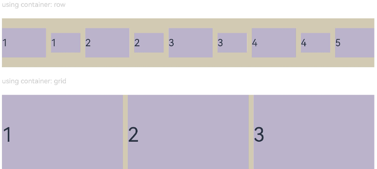

# Layout Constraints

Layout constraints refer to constraints on the aspect ratio and display priority of components.

>  **NOTE**
>
>  The APIs of this module are supported since API version 7. Updates will be marked with a superscript to indicate their earliest API version.

## aspectRatio

aspectRatio(value: number)

Sets the aspect ratio of the component, which can be obtained using the following formula: width/height.
- If only **width** and **aspectRatio** are set, the height is calculated using the following formula: width/aspectRatio.
- If only **height** and **aspectRatio** are set, the width is calculated using the following formula: height x aspectRatio.
- If **width**, **height**, and **aspectRatio** are all set, the explicitly set height is ignored, and the effective height is calculated using the following formula: width/aspectRatio.

After **aspectRatio** is set, the width and height of the component are constrained by the size of the parent component's content area.

**Widget capability**: This API can be used in ArkTS widgets since API version 9.

**Atomic service API**: This API can be used in atomic services since API version 11.

**System capability**: SystemCapability.ArkUI.ArkUI.Full

**Parameters**

| Name| Type  | Mandatory| Description                                                        |
| ------ | ------ | ---- | ------------------------------------------------------------ |
| value  | number | Yes  | Aspect ratio of the component.<br>The default value varies by API version.<br>API version 9 and earlier: **1.0**<br><br>API version 10: none<br>**NOTE**<br>This parameter takes effect only when a valid value greater than 0 is specified.<br>For example, if a **Row** component has only its width set and does not have any child component, then when **aspectRatio** is not set or is set to a negative value, the height of the **Row** component is 0.|

## displayPriority

displayPriority(value: number)

Sets the display priority for the component in the layout container.

**Widget capability**: This API can be used in ArkTS widgets since API version 9.

**Atomic service API**: This API can be used in atomic services since API version 11.

**System capability**: SystemCapability.ArkUI.ArkUI.Full

**Parameters**

| Name| Type  | Mandatory| Description                                                        |
| ------ | ------ | ---- | ------------------------------------------------------------ |
| value  | number | Yes  | Display priority of the component in the layout container.<br>Default value: **1**<br>**NOTE**<br>This parameter is only effective in [Row](./ts-container-row.md), [Column](./ts-container-column.md), and [Flex (single-line)](./ts-container-flex.md) container components.<br> The digits after the decimal point are not counted in determining the display priority. That is, numbers in the [x, x + 1) range are considered to represent the same priority. For example, **1.0** and **1.9** represent the same priority.<br>If the **displayPriority** value of all child components is not greater than 1, there is no difference in priority.<br>When the **displayPriority** value of a child component is greater than 1, a larger value indicates higher priority. If the parent container does not have enough space, child components with lower priority are hidden. If child components of a certain priority are hidden, those with an even lower priority are also hidden.|

## Example

### Example 1: Setting the Component Aspect Ratio

This example illustrates how to use the **aspectRatio** attribute to set different aspect ratios for a component.

```ts
// xxx.ets
@Entry
@Component
struct AspectRatioExample {
  private children: string[] = ['1', '2', '3', '4', '5', '6']

  build() {
    Column({ space: 20 }) {
      Text('using container: row').fontSize(14).fontColor(0xCCCCCC).width('100%')
      Row({ space: 10 }) {
        ForEach(this.children, (item:string) => {
          // Component width = Component height x 1.5 = 90
          Text(item)
            .backgroundColor(0xbbb2cb)
            .fontSize(20)
            .aspectRatio(1.5)
            .height(60)
          // Component height = Component width/1.5 = 60/1.5 = 40
          Text(item)
            .backgroundColor(0xbbb2cb)
            .fontSize(20)
            .aspectRatio(1.5)
            .width(60)
        }, (item:string) => item)
      }
      .size({ width: "100%", height: 100 })
      .backgroundColor(0xd2cab3)
      .clip(true)

      // Grid child component width/height = 3/2
      Text('using container: grid').fontSize(14).fontColor(0xCCCCCC).width('100%')
      Grid() {
        ForEach(this.children, (item:string) => {
          GridItem() {
            Text(item)
              .backgroundColor(0xbbb2cb)
              .fontSize(40)
              .width('100%')
              .aspectRatio(1.5)
          }
        }, (item:string) => item)
      }
      .columnsTemplate('1fr 1fr 1fr')
      .columnsGap(10)
      .rowsGap(10)
      .size({ width: "100%", height: 165 })
      .backgroundColor(0xd2cab3)
    }.padding(10)
  }
}
```

**Figure 1** Portrait display<br>


**Figure 2** Landscape display<br>


### Example 2: Setting the Component Display Priority

This example shows how to use **displayPriority** to assign display priorities to child components.

```ts
class ContainerInfo {
  label: string = '';
  size: string = '';
}

class ChildInfo {
  text: string = '';
  priority: number = 0;
}

@Entry
@Component
struct DisplayPriorityExample {
  // Display the container size.
  private container: ContainerInfo[] = [
    { label: 'Big container', size: '90%' },
    { label: 'Middle container', size: '50%' },
    { label: 'Small container', size: '30%' }
  ]
  private children: ChildInfo[] = [
    { text: '1\n(priority:2)', priority: 2 },
    { text: '2\n(priority:1)', priority: 1 },
    { text: '3\n(priority:3)', priority: 3 },
    { text: '4\n(priority:1)', priority: 1 },
    { text: '5\n(priority:2)', priority: 2 }
  ]
  @State currentIndex: number = 0;

  build() {
    Column({ space: 10 }) {
      // Switch the size of the parent container.
      Button(this.container[this.currentIndex].label).backgroundColor(0x317aff)
        .onClick(() => {
          this.currentIndex = (this.currentIndex + 1) % this.container.length;
        })
      // Set the width for the parent flex container through variables.
      Flex({ justifyContent: FlexAlign.SpaceBetween }) {
        ForEach(this.children, (item:ChildInfo) => {
          // Bind the display priority to the child component through displayPriority.
          Text(item.text)
            .width(120)
            .height(60)
            .fontSize(24)
            .textAlign(TextAlign.Center)
            .backgroundColor(0xbbb2cb)
            .displayPriority(item.priority)
        }, (item:ChildInfo) => item.text)
      }
      .width(this.container[this.currentIndex].size)
      .backgroundColor(0xd2cab3)
    }.width("100%").margin({ top: 50 })
  }
}
```

Landscape display in containers of different sizes


