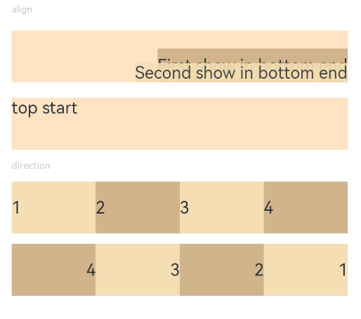
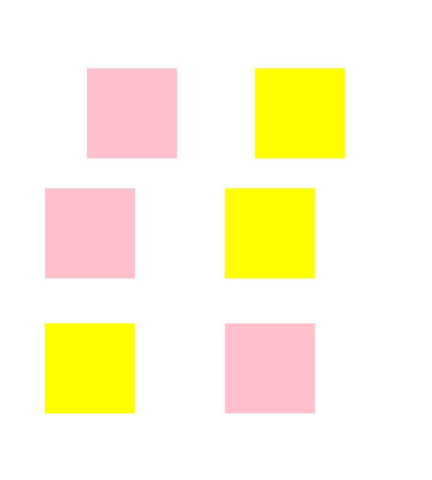

# Location

The location attributes set the alignment mode, layout direction, and position of a component.

>  **NOTE**
>
>  The APIs of this module are supported since API version 7. Updates will be marked with a superscript to indicate their earliest API version.

## align

align(value: Alignment)

Sets the alignment mode of the component content in the drawing area.

**Widget capability**: This API can be used in ArkTS widgets since API version 9.

**Atomic service API**: This API can be used in atomic services since API version 11.

**System capability**: SystemCapability.ArkUI.ArkUI.Full

**Parameters**

| Name| Type                                       | Mandatory| Description                                                        |
| ------ | ------------------------------------------- | ---- | ------------------------------------------------------------ |
| value  | [Alignment](ts-appendix-enums.md#alignment) | Yes  | Sets the alignment mode of the component content in the drawing area.<br>This attribute is available only in the following components: **Stack**, **Button**, **StepperItem**,**FolderStack**, **Marquee**, **Text**, **TextArea**, and **TextInput**. For details about the alignment results of text-related components (the last four aforementioned components), see [textAlign](ts-basic-components-text.md#attributes).<br>If the component does not support the **textAlign** attribute, horizontal alignment cannot be set for text.<br>Default value: **Alignment.Center**<br>**NOTE**<br>In the **Stack** component, this attribute has the same effect as **alignContent**, which means that it sets the alignment mode of child components in the container.|

## direction

direction(value: Direction)

Sets how elements are laid out along the main axis of the container.

**Widget capability**: This API can be used in ArkTS widgets since API version 9.

**Atomic service API**: This API can be used in atomic services since API version 11.

**System capability**: SystemCapability.ArkUI.ArkUI.Full

**Parameters**

| Name| Type                                       | Mandatory| Description                                               |
| ------ | ------------------------------------------- | ---- | --------------------------------------------------- |
| value  | [Direction](ts-appendix-enums.md#direction) | Yes  | How elements are laid out along the main axis of the container.<br>If this parameter is set to **auto**, the layout is subject to the system language.<br>The attribute does not take effect in the **Column** component.<br>Default value: **Direction.Auto**|

## position

position(value: Position | Edges | LocalizedEdges)

Sets the absolute position of the component relative to the position of the parent component.

**Widget capability**: This API can be used in ArkTS widgets since API version 9.

**Atomic service API**: This API can be used in atomic services since API version 11.

**System capability**: SystemCapability.ArkUI.ArkUI.Full

**Parameters**

| Name| Type                                                        | Mandatory| Description                                                        |
| ------ | ------------------------------------------------------------ | ---- | ------------------------------------------------------------ |
| value  | [Position](ts-types.md#position) \| [Edges<sup>12+</sup>](ts-types.md#edges12) \| [LocalizedEdges<sup>12+</sup>](ts-types.md#localizededges12) | Yes  | Absolute position of the component relative to the position of the parent component. If the parent container is **Row**, **Column**, or **Flex**, the child component for which **position** is set does not take up space in the container.<br>If of the Position type, this parameter sets the position based on the upper left corner of the parent component. If of the Edges type, this parameter sets the position based on the offset relative to the four edges of the parent component. If of the LocalizedEdges type, this parameter sets the position based on the offset relative to the four edges of the parent component, with support for the mirror mode.<br>The **position** attribute is applicable to scenarios where the component's position in the parent container is fixed, for example, where it is pinned to top or floating on the UI.<br>The attribute is not available for a layout container whose width and height are zero.<br>The attribute does not take effect when the component is in a [RelativeContainer](ts-container-relativecontainer.md) component and with the **alignRules** attribute set.|

## markAnchor

markAnchor(value: Position | LocalizedPosition)

Sets the anchor for locating the component.

**Widget capability**: This API can be used in ArkTS widgets since API version 9.

**Atomic service API**: This API can be used in atomic services since API version 11.

**System capability**: SystemCapability.ArkUI.ArkUI.Full

**Parameters**

| Name| Type                            | Mandatory| Description                                                        |
| ------ | -------------------------------- | ---- | ------------------------------------------------------------ |
| value  | [Position](ts-types.md#position) \| [LocalizedPosition<sup>12+</sup>](ts-types.md#localizedposition12) | Yes  | Anchor for locating the component, which is used to move the component further away from the position specified by **position** or **offset**.<br>**.position({x: value1, y: value2}).markAnchor({x: value3, y: value4})** has the same effect as **.position({x: value1 - value3, y: value2 - value4})**. The same applies to **offset**.<br>When **markAnchor** is used alone, **markAnchor ({x: value1, y: value2})** has the same effect as **.offset ({x: -value1, y: -value2})**.<br>The default value varies by API version.<br>API version 9 and earlier:<br>{<br>x: 0,<br>y: 0<br>}<br>API version 10: none|

## offset

offset(value: Position | Edges | LocalizedEdges)

Sets the offset of the component relative to its original position.

**Widget capability**: This API can be used in ArkTS widgets since API version 9.

**Atomic service API**: This API can be used in atomic services since API version 11.

**System capability**: SystemCapability.ArkUI.ArkUI.Full

**Parameters**

| Name| Type                                                        | Mandatory| Description                                                        |
| ------ | ------------------------------------------------------------ | ---- | ------------------------------------------------------------ |
| value  | [Position](ts-types.md#position) \| [Edges<sup>12+</sup>](ts-types.md#edges12)  \| [LocalizedEdges<sup>12+</sup>](ts-types.md#localizededges12) | Yes  | Offset of the component relative to its original position. The **offset** attribute does not affect the layout of the parent container. It adjusts the component position only during drawing.<br>If of the Position type, this parameter sets the offset relative to the upper left corner of the component. If of the Edges type, this parameter sets the offset relative to the four edges of the component. **{x: x, y: y}** has the same effect as **{left: x, top: y}** and **{right: -x, bottom: -y}**. The LocalizedEdges type supports the mirror mode: **start** is equivalent to **x** with left-to-right scripts and **-x** with right-to-left scripts.<br>The default value varies by API version.<br>API version 9 and earlier:<br>{<br>x: 0,<br>y: 0<br>}<br>Default unit: vp<br>API version 10: none|

## alignRules<sup>9+</sup>

alignRules(value: AlignRuleOption)

Sets the alignment rules in the relative container. This API is valid only when the container is [RelativeContainer](ts-container-relativecontainer.md).

**Widget capability**: This API can be used in ArkTS widgets since API version 9.

**Atomic service API**: This API can be used in atomic services since API version 11.

**System capability**: SystemCapability.ArkUI.ArkUI.Full

**Parameters**

| Name| Type                                       | Mandatory| Description                    |
| ------ | ------------------------------------------- | ---- | ------------------------ |
| value  | [AlignRuleOption](#alignruleoption) | Yes  | Alignment rules in the relative container.|

## alignRules<sup>12+</sup>

alignRules(alignRule: LocalizedAlignRuleOptions)

Sets the alignment rules in the relative container. This API is valid only when the container is [RelativeContainer](ts-container-relativecontainer.md). This API takes the right-to-left scripts into account, using **start** and **end** instead of **left** and **right** for alignment in the horizontal direction. Prioritize this API in aligning child components in the relative container.

**Widget capability**: This API can be used in ArkTS widgets since API version 12.

**Atomic service API**: This API can be used in atomic services since API version 12.

**System capability**: SystemCapability.ArkUI.ArkUI.Full

**Parameters**

| Name| Type                                       | Mandatory| Description                    |
| ------ | ------------------------------------------- | ---- | ------------------------ |
| alignRule  | [LocalizedAlignRuleOptions](#localizedalignruleoptions12) | Yes  | Alignment rules in the relative container.|

## AlignRuleOption

**Widget capability**: This API can be used in ArkTS widgets since API version 9.

| Name  | Type                                                        | Description                                                        |
| ------ | ------------------------------------------------------------ | ------------------------------------------------------------ |
| left   | { anchor: string, align: [HorizontalAlign](ts-appendix-enums.md#horizontalalign) } | Left alignment.<br>- **anchor**: ID of the component that functions as the anchor point.<br>- **align**: alignment mode relative to the anchor component.<br>**Atomic service API**: This API can be used in atomic services since API version 11.|
| right  | { anchor: string, align: [HorizontalAlign](ts-appendix-enums.md#horizontalalign) } | Right alignment.<br>- **anchor**: ID of the component that functions as the anchor point.<br>- **align**: alignment mode relative to the anchor component.<br>**Atomic service API**: This API can be used in atomic services since API version 11.|
| middle | { anchor: string, align: [HorizontalAlign](ts-appendix-enums.md#horizontalalign) } | Horizontal center alignment.<br>- **anchor**: ID of the component that functions as the anchor point.<br>- **align**: alignment mode relative to the anchor component.<br>**Atomic service API**: This API can be used in atomic services since API version 11.|
| top    | { anchor: string, align: [VerticalAlign](ts-appendix-enums.md#verticalalign) } | Top alignment.<br>- **anchor**: ID of the component that functions as the anchor point.<br>- **align**: alignment mode relative to the anchor component.<br>**Atomic service API**: This API can be used in atomic services since API version 11.|
| bottom | { anchor: string, align: [VerticalAlign](ts-appendix-enums.md#verticalalign) } | Bottom alignment.<br>- **anchor**: ID of the component that functions as the anchor point.<br>- **align**: alignment mode relative to the anchor component.<br>**Atomic service API**: This API can be used in atomic services since API version 11.|
| center | { anchor: string, align: [VerticalAlign](ts-appendix-enums.md#verticalalign) } | Vertical center alignment.<br>**Atomic service API**: This API can be used in atomic services since API version 11.                                |
| bias<sup>11+</sup>   | [Bias](#bias) | Offset of the component under the anchor constraints. The value is the ratio of the distance to the left/upper anchor to the total distance between anchors.<br>**Widget capability**: This API can be used in ArkTS widgets since API version 11.<br>**Atomic service API**: This API can be used in atomic services since API version 12.|

## LocalizedAlignRuleOptions<sup>12+</sup>

**Atomic service API**: This API can be used in atomic services since API version 12.

| Name  | Type                                                        | Description                                                        |
| ------ | ------------------------------------------------------------ | ------------------------------------------------------------ |
| start  | [LocalizedHorizontalAlignParam](#localizedhorizontalalignparam12) | Left alignment with left-to-right scripts and right alignment with right-to-left scripts in the horizontal direction.|
| end    | [LocalizedHorizontalAlignParam](#localizedhorizontalalignparam12) | Right alignment with left-to-right scripts and left alignment with right-to-left scripts in the horizontal direction.|
| middle | [LocalizedHorizontalAlignParam](#localizedhorizontalalignparam12) | Center alignment in the horizontal direction.|
| top    | [LocalizedVerticalAlignParam](#localizedverticalalignparam12) | Top alignment in the vertical direction.|
| bottom | [LocalizedVerticalAlignParam](#localizedverticalalignparam12) | Bottom alignment in the vertical direction.|
| center | [LocalizedVerticalAlignParam](#localizedverticalalignparam12) | Center alignment in the vertical direction.     |
| bias   | [Bias](#bias) | Offset of the component under the anchor constraints. The value is the ratio of the distance to the left/upper anchor to the total distance between anchors.|

## LocalizedHorizontalAlignParam<sup>12+</sup>

**Atomic service API**: This API can be used in atomic services since API version 12.

| Name  | Type                                                        | Description                                                        |
| ------ | ------------------------------------------------------------ | ------------------------------------------------------------ |
| anchor  | string  | ID of the component that serves as the anchor.|
| align   | [HorizontalAlign](ts-appendix-enums.md#horizontalalign)  | Horizontal alignment mode relative to the anchor component.|

## LocalizedVerticalAlignParam<sup>12+</sup>

**Atomic service API**: This API can be used in atomic services since API version 12.

| Name  | Type                                                        | Description                                                        |
| ------ | ------------------------------------------------------------ | ------------------------------------------------------------ |
| anchor  | string | ID of the component that serves as the anchor.|
| align   | [VerticalAlign](ts-appendix-enums.md#verticalalign)  | Vertical alignment mode relative to the anchor component.|

## Bias

**Atomic service API**: This API can be used in atomic services since API version 12.

| Name  | Type                                      | Mandatory  | Description                                      |
| ----- | ---------------------------------------- | ---- | ---------------------------------------- |
| horizontal  | number | No| Bias value in the horizontal direction.<br>This parameter takes effect when the child component has a correct width and two horizontal anchors.<br>Default value: **0.5**|
| vertical  | number | No| Bias value in the vertical direction.<br>This parameter takes effect when the child component has a correct height and two vertical anchors.<br>Default value: **0.5**|

## chainMode<sup>12+</sup>

chainMode(direction: Axis, style: ChainStyle)

Sets the parameters of the chain in which the component is the head. This parameter has effect only when the parent container is [RelativeContainer](ts-container-relativecontainer.md).

**System capability**: SystemCapability.ArkUI.ArkUI.Full

**Parameters**

| Name| Type                                       | Mandatory| Description                    |
| ------ | ------------------------------------------- | ---- | ------------------------ |
| direction  | [Axis](ts-appendix-enums.md#axis) | Yes  | Direction of the chain.|
| style  | [ChainStyle](ts-appendix-enums.md#chainstyle12) | Yes  | Style of the chain.|

## Example
### Example 1
```ts
// xxx.ets
@Entry
@Component
struct PositionExample1 {
  build() {
    Column() {
      Column({ space: 10 }) {
        // When the component content is within the area specified by the component width and height, set the alignment mode of the content in the component.
        Text('align').fontSize(9).fontColor(0xCCCCCC).width('90%')
        Stack() {
          Text('First show in bottom end').height('65%').backgroundColor(0xD2B48C)
          Text('Second show in bottom end').backgroundColor(0xF5DEB3).opacity(0.9)
        }.width('90%').height(50).margin({ top: 5 }).backgroundColor(0xFFE4C4)
        .align(Alignment.BottomEnd)
        Stack() {
          Text('top start')
        }.width('90%').height(50).margin({ top: 5 }).backgroundColor(0xFFE4C4)
        .align(Alignment.TopStart)

        // To arrange the child components from left to right, set direction of the parent container to Direction.Ltr.
        Text('direction').fontSize(9).fontColor(0xCCCCCC).width('90%')
        Row() {
          Text('1').height(50).width('25%').fontSize(16).backgroundColor(0xF5DEB3)
          Text('2').height(50).width('25%').fontSize(16).backgroundColor(0xD2B48C)
          Text('3').height(50).width('25%').fontSize(16).backgroundColor(0xF5DEB3)
          Text('4').height(50).width('25%').fontSize(16).backgroundColor(0xD2B48C)
        }
        .width('90%')
        .direction(Direction.Ltr)
        // To arrange the child components from right to left, set direction of the parent container to Direction.Rtl.
        Row() {
          Text('1').height(50).width('25%').fontSize(16).backgroundColor(0xF5DEB3).textAlign(TextAlign.End)
          Text('2').height(50).width('25%').fontSize(16).backgroundColor(0xD2B48C).textAlign(TextAlign.End)
          Text('3').height(50).width('25%').fontSize(16).backgroundColor(0xF5DEB3).textAlign(TextAlign.End)
          Text('4').height(50).width('25%').fontSize(16).backgroundColor(0xD2B48C).textAlign(TextAlign.End)
        }
        .width('90%')
        .direction(Direction.Rtl)
      }
    }
    .width('100%').margin({ top: 5 })
  }
}
```



### Example 2
```ts
// xxx.ets
@Entry
@Component
struct PositionExample2 {
  build() {
    Column({ space: 20 }) {
      // Set the offset of the component's upper left corner relative to the parent component's upper left corner.
      Text('position').fontSize(12).fontColor(0xCCCCCC).width('90%')
      Row() {
        Text('1').size({ width: '30%', height: '50' }).backgroundColor(0xdeb887).border({ width: 1 }).fontSize(16)
          .textAlign(TextAlign.Center)
        Text('2 position(30, 10)')
          .size({ width: '60%', height: '30' })
          .backgroundColor(0xbbb2cb)
          .border({ width: 1 })
          .fontSize(16)
          .align(Alignment.Start)
          .position({ x: 30, y: 10 })
        Text('3').size({ width: '45%', height: '50' }).backgroundColor(0xdeb887).border({ width: 1 }).fontSize(16)
          .textAlign(TextAlign.Center)
        Text('4 position(50%, 70%)')
          .size({ width: '50%', height: '50' })
          .backgroundColor(0xbbb2cb)
          .border({ width: 1 })
          .fontSize(16)
          .position({ x: '50%', y: '70%' })
      }.width('90%').height(100).border({ width: 1, style: BorderStyle.Dashed })

      // Offset relative to the start point. x indicates the horizontal distance between the end point and the start point. If the value of x is greater than 0, the component is offset to the left. Otherwise, the component is offset to the right.
      // y indicates the vertical distance between the end point and the start point. If the value of y is greater than 0, the component is offset to the top. Otherwise, the component is offset to the bottom.
      Text('markAnchor').fontSize(12).fontColor(0xCCCCCC).width('90%')
      Stack({ alignContent: Alignment.TopStart }) {
        Row()
          .size({ width: '100', height: '100' })
          .backgroundColor(0xdeb887)
        Text('text')
          .fontSize('30px')
          .textAlign(TextAlign.Center)
          .size({ width: 25, height: 25 })
          .backgroundColor(Color.Green)
          .markAnchor({ x: 25, y: 25 })
        Text('text')
          .fontSize('30px')
          .textAlign(TextAlign.Center)
          .size({ width: 25, height: 25 })
          .backgroundColor(Color.Green)
          .markAnchor({ x: -100, y: -25 })
        Text('text')
          .fontSize('30px')
          .textAlign(TextAlign.Center)
          .size({ width: 25, height: 25 })
          .backgroundColor(Color.Green)
          .markAnchor({ x: 25, y: -25 })
      }.margin({ top: 25 }).border({ width: 1, style: BorderStyle.Dashed })

      // Offset of the component relative to itself. If the value of x is greater than 0, the component is offset to the right. Otherwise, the component is offset to the left. If the value of y is greater than 0, the component is offset to the bottom. Otherwise, the component is offset to the top.
      Text('offset').fontSize(12).fontColor(0xCCCCCC).width('90%')
      Row() {
        Text('1').size({ width: '15%', height: '50' }).backgroundColor(0xdeb887).border({ width: 1 }).fontSize(16)
          .textAlign(TextAlign.Center)
        Text('2  offset(15, 30)')
          .size({ width: 120, height: '50' })
          .backgroundColor(0xbbb2cb)
          .border({ width: 1 })
          .fontSize(16)
          .align(Alignment.Start)
          .offset({ x: 15, y: 30 })
        Text('3').size({ width: '15%', height: '50' }).backgroundColor(0xdeb887).border({ width: 1 }).fontSize(16)
          .textAlign(TextAlign.Center)
        Text('4 offset(-5%, 20%)')
          .size({ width: 100, height: '50' })
          .backgroundColor(0xbbb2cb)
          .border({ width: 1 })
          .fontSize(16)
          .offset({ x: '-5%', y: '20%' })
      }.width('90%').height(100).border({ width: 1, style: BorderStyle.Dashed })
    }
    .width('100%').margin({ top: 25 })
  }
}
```


### Example 3
```ts
// xxx.ets
@Entry
@Component
struct Example3 {
  build() {
    Column({ space: 20 }){
      Text('position use Edges').fontSize(12).fontColor(0xCCCCCC).width('90%')
      Row() {
        Text('bottom:0, right:0').size({ width: '30%', height: '50' }).backgroundColor(0xdeb887).border({ width: 1 }).fontSize(16)
          .textAlign(TextAlign.Center).position({bottom: 0, right: 0})
        Text('top:0, left:0').size({ width: '30%', height: '50' }).backgroundColor(0xdeb887).border({ width: 1 }).fontSize(16)
          .textAlign(TextAlign.Center).position({top: 0, left: 0})
        Text('top:10%, left:50%').size({ width: '50%', height: '30' }).backgroundColor(0xbbb2cb).border({ width: 1 }).fontSize(16)
          .textAlign(TextAlign.Center).position({ top: '10%', left: '50%' })
        Text('bottom:0, left:30').size({ width: '50%', height: '30' }).backgroundColor(0xbbb2cb).border({ width: 1 }).fontSize(16)
          .textAlign(TextAlign.Center).position({ bottom: 0, left: 30 })
      }.width('90%').height(100).border({ width: 1, style: BorderStyle.Dashed })


      Text('offset use Edges').fontSize(12).fontColor(0xCCCCCC).width('90%')
      Row() {
        Text('1').size({ width: '25%', height: 50 }).backgroundColor(0xdeb887).border({ width: 1 }).fontSize(16)
          .textAlign(TextAlign.Center)
        Text('2 top:30, left:0').size({ width: '25%', height: 50 }).backgroundColor(0xbbb2cb).border({ width: 1 }).fontSize(16)
          .textAlign(TextAlign.Center).offset({top: 30, left: 0})
        Text('3').size({ width: '25%', height: 50 }).backgroundColor(0xdeb887).border({ width: 1 }).fontSize(16)
          .textAlign(TextAlign.Center)
        Text('4 bottom:10, right:30').size({ width: '25%', height: 50 }).backgroundColor(0xbbb2cb).border({ width: 1 }).fontSize(12)
          .textAlign(TextAlign.Center).offset({bottom: 10, right: 30})
      }.width('90%').height(150).border({ width: 1, style: BorderStyle.Dashed })
    }.width('100%').margin({ top: 25 })
  }
}
```


### Example 4
```ts
// xxx.ets 
// The mirror mode is supported.
// The example shows the configuration effects of the **position**, **offset**, and **markAnchor** attributes, from top to bottom.
// The yellow blocks indicate the original effect, and the pink blocks indicate the mirror effect.
import { LengthMetrics } from '@kit.ArkUI';
@Entry
@Component
struct Example4 {
  private scroller: Scroller = new Scroller()

  build() {
    Column() {
      Stack({ alignContent: Alignment.End }) {
        Scroll(this.scroller) {
          Flex({ direction: FlexDirection.Column }) {
            RelativeContainer() {
              Row() {
              }
              .position({ start: LengthMetrics.px(200), top: LengthMetrics.px(100) })
              .width("30%")
              .height("20%")
              .backgroundColor(Color.Pink)
              .padding(50)
              .margin(50)
              Row() {
              }
              .position({ left:'200px', top: '100px' })
              .width("30%")
              .height("20%")
              .backgroundColor(Color.Yellow)
              .padding(50)
              .margin(50)
              Row() {
              }
              .offset({ start: LengthMetrics.vp(100), top: LengthMetrics.vp(200)  })
              .width("30%")
              .height("20%")
              .backgroundColor(Color.Pink)
              .padding(50)
              .margin(50)
              Row() {
              }
              .offset({ left: 100, top: 200  })
              .width("30%")
              .height("20%")
              .backgroundColor(Color.Yellow)
              .padding(50)
              .margin(50)
              Row() {
              }
              .markAnchor({ start: LengthMetrics.fp(100), top: LengthMetrics.fp(-350) })
              .width("30%")
              .height("20%")
              .backgroundColor(Color.Pink)
              .padding(50)
              .margin(50)
              Row() {
              }
              .markAnchor({ x: '100fp', y: '-350fp' })
              .width("30%")
              .height("20%")
              .backgroundColor(Color.Yellow)
              .padding(50)
              .margin(50)
            }
            .backgroundColor(Color.White)
            .padding(50)
            .margin(50)
          }
        }
        .width('100%')
        .scrollBar(BarState.Off)
        .scrollable(ScrollDirection.Vertical)

        ScrollBar({ scroller: this.scroller, direction: ScrollBarDirection.Vertical, state: BarState.Auto }) {
          Text()
            .width(20)
            .height(100)
            .borderRadius(10)
            .backgroundColor('#C0C0C0')
        }.width(20).backgroundColor('#ededed')
      }
    }.height('90%')
  }
}
```

