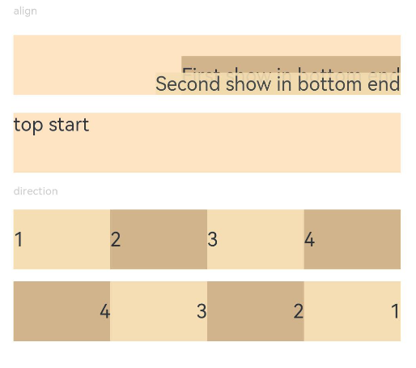
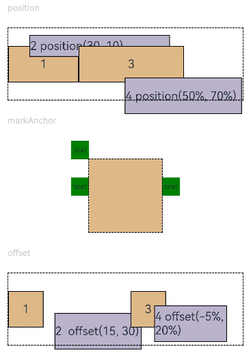
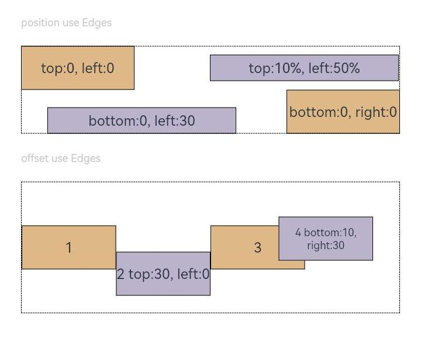
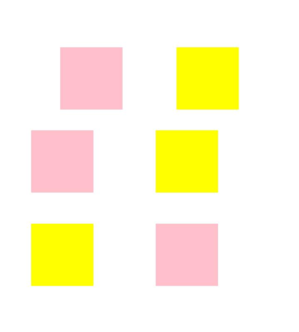

# Location
<!--Kit: ArkUI-->
<!--Subsystem: ArkUI-->
<!--Owner: @zju_ljz-->
<!--Designer: @lanshouren-->
<!--Tester: @liuli0427-->
<!--Adviser: @Brilliantry_Rui-->

The location attributes set the alignment mode, layout direction, and position of a component.

> **NOTE**
> 
> - The initial APIs of this module are supported since API version 7. Updates will be marked with a superscript to indicate their earliest API version.

## align

align(value: Alignment): T

Sets the alignment mode for child elements within the container's drawing area. This attribute can be dynamically set using [attributeModifier](ts-universal-attributes-attribute-modifier.md#attributemodifier).

**Widget capability**: This API can be used in ArkTS widgets since API version 9.

**Atomic service API**: This API can be used in atomic services since API version 11.

**System capability**: SystemCapability.ArkUI.ArkUI.Full

**Parameters**

| Name| Type                                       | Mandatory| Description                                                        |
| ------ | ------------------------------------------- | ---- | ------------------------------------------------------------ |
| value  | [Alignment](ts-appendix-enums.md#alignment) | Yes  | Alignment mode for child elements in container drawing area.<br>This setting takes effect only in [Stack](ts-container-stack.md), [FolderStack](ts-container-folderstack.md), [Shape](ts-drawing-components-shape.md), [Button](ts-basic-components-button.md), [Marquee](ts-basic-components-marquee.md), [StepperItem](ts-basic-components-stepperitem.md), [Text](ts-basic-components-text.md), [TextArea](ts-basic-components-textarea.md), [TextInput](ts-basic-components-textinput.md), [RichEditor](ts-basic-components-richeditor.md), [Hyperlink](ts-container-hyperlink.md), [SymbolGlyph](ts-basic-components-symbolGlyph.md), [ListItem](ts-container-listitem.md), [GridItem](ts-container-griditem.md), [Scroll](ts-container-scroll.md), [FlowItem](ts-container-flowitem.md), [ImageAnimator](ts-basic-components-imageanimator.md), [LoadingProgress](ts-basic-components-loadingprogress.md), [PatternLock](ts-basic-components-patternlock.md), [Progress](ts-basic-components-progress.md), [QRCode](ts-basic-components-qrcode.md), [TextClock](ts-basic-components-textclock.md), [TextTimer](ts-basic-components-texttimer.md), [MenuItem](ts-basic-components-menuitem.md), [Toggle](ts-basic-components-toggle.md), [Checkbox](ts-basic-components-checkbox.md), and [NodeContainer](ts-basic-components-nodecontainer.md). For the alignment of the **Marquee**, **Text**, **TextArea**, **TextInput**, **RichEditor**, and **Hyperlink** components related to text, see [textAlign](ts-basic-components-text.md#textalign).<br>If a component does not support the **textAlign** attribute, horizontal text alignment cannot be configured.<br>Default value: **Alignment.Center**<br>**NOTE**<br>This attribute supports the mirroring capability only in the [Stack](ts-container-stack.md) component.<br>In the **Stack** component, this attribute has the same effect as **alignContent**, which means that it sets the alignment mode of child components in the container.|

**Return value**

| Type| Description|
| --- | --- |
|  T | Current component.|

## align<sup>20+</sup>

align(alignment: Alignment | LocalizedAlignment): T

Sets the alignment mode for child elements within the container's drawing area. The mirroring capability is supported. This attribute can be dynamically set using [attributeModifier](ts-universal-attributes-attribute-modifier.md#attributemodifier).

**Widget capability**: This API can be used in ArkTS widgets since API version 20.

**Atomic service API**: This API can be used in atomic services since API version 20.

**System capability**: SystemCapability.ArkUI.ArkUI.Full

**Parameters**

| Name| Type                                       | Mandatory| Description                                                        |
| ------ | ------------------------------------------- | ---- | ------------------------------------------------------------ |
| alignment  | [Alignment](ts-appendix-enums.md#alignment) \| [LocalizedAlignment](ts-appendix-enums.md#localizedalignment20) | Yes  | Alignment mode for child elements in container drawing area. The mirroring capability is supported.<br>The LocalizedAlignment type is effective only in the following components: [Shape](ts-drawing-components-shape.md), [Button](ts-basic-components-button.md), [GridItem](ts-container-griditem.md), [FlowItem](ts-container-flowitem.md), [ImageAnimator](ts-basic-components-imageanimator.md), [LoadingProgress](ts-basic-components-loadingprogress.md), [PatternLock](ts-basic-components-patternlock.md), [Progress](ts-basic-components-progress.md), [QRCode](ts-basic-components-qrcode.md), [TextClock](ts-basic-components-textclock.md), [TextTimer](ts-basic-components-texttimer.md), [StepperItem](ts-basic-components-stepperitem.md), [MenuItem](ts-basic-components-menuitem.md), [Toggle](ts-basic-components-toggle.md), [Checkbox](ts-basic-components-checkbox.md), and [ListItem](ts-container-listitem.md).<br>For the above components, mirror switching is effective for all except the [ListItem](ts-container-listitem.md) component, which behaves identically to **Alignment**. Components where **LocalizedAlignment** is not applicable will be rendered in accordance with their default behavior.<br>Default value: **Alignment.Center**, **LocalizedAlignment.CENTER**.<br>If an invalid value is passed, the default value will be used, indicating center alignment.<br>**NOTE**<br>The Alignment type does not support the mirroring capability. The LocalizedAlignment type supports mirroring based on the layout direction (configurable via **direction**) or system language. The **direction** setting takes precedence over the system language direction. When **direction** is explicitly set to any value other than **auto**, LocalizedAlignment mirroring follows the specified direction. If **direction** is set to **auto** or not configured, LocalizedAlignment mirroring adapts to the system language direction.|

**Return value**

| Type| Description|
| --- | --- |
|  T | Current component.|

## direction

direction(value: Direction): T

Sets how elements are laid out along the main axis of the container. This attribute supports dynamic configuration via [attributeModifier](ts-universal-attributes-attribute-modifier.md#attributemodifier).

**Widget capability**: This API can be used in ArkTS widgets since API version 9.

**Atomic service API**: This API can be used in atomic services since API version 11.

**System capability**: SystemCapability.ArkUI.ArkUI.Full

**Parameters**

| Name| Type                                       | Mandatory| Description                                               |
| ------ | ------------------------------------------- | ---- | --------------------------------------------------- |
| value  | [Direction](ts-appendix-enums.md#direction) | Yes  | How elements are laid out along the main axis of the container.<br>If this parameter is set to **auto**, the layout is subject to the system language.<br>The setting does not take effect in the **Column** component.<br>Default value: **Direction.Auto**.<br>If the **direction** attribute receives an **undefined** or **null** input parameter, the system will apply the default value.|

**Return value**

| Type| Description|
| --- | --- |
|  T | Current component.|

## position

position(value: Position | Edges | LocalizedEdges): T

Sets the absolute positioning, which determines the position of a child component relative to the content area of the parent component. Dynamic configuration via [attributeModifier](ts-universal-attributes-attribute-modifier.md#attributemodifier) is supported.

> **NOTE**
> 
> - This API takes effect after the component's size measurement is complete.
> - When the parent container is [Row](./ts-container-row.md), [Column](./ts-container-column.md), or [Flex](./ts-container-flex.md), the child component with **position** set does not occupy any space.
> - The Position type uses the upper left corner of the parent's content area as the reference point. The Edges type uses all four sides of the parent's content area as reference, where **top**, **left**, **right**, and **bottom** define the margins between the component and corresponding sides of the parent's content area. The LocalizedEdges type provides the same functionality as Edges while supporting layout mirroring.
> - This attribute is applicable to scenarios where the component's position in the parent container is fixed, for example, where it is pinned to top or floating on the UI.
> - This attribute is unavailable for a layout container whose width and height are zero.
> - In [RelativeContainer](ts-container-relativecontainer.md), if the child component has **alignRules** set, the **position** attribute will not take effect.

**Widget capability**: This API can be used in ArkTS widgets since API version 9.

**Atomic service API**: This API can be used in atomic services since API version 11.

**System capability**: SystemCapability.ArkUI.ArkUI.Full

**Parameters**

| Name| Type                                                        | Mandatory| Description                                                        |
| ------ | ------------------------------------------------------------ | ---- | ------------------------------------------------------------ |
| value  | [Position](ts-types.md#position) \| [Edges<sup>12+</sup>](ts-types.md#edges12) \| [LocalizedEdges<sup>12+</sup>](ts-types.md#localizededges12) | Yes  | Absolute positioning that determines the child component's position relative to the parent's content area. The content area of the parent component is calculated by subtracting the [border](ts-universal-attributes-border.md#border), [padding](ts-universal-attributes-size.md#padding), and [safeAreaPadding](ts-universal-attributes-size.md#safeareapadding14) values from the parent component's total size. This resulting content area defines the available layout space for child components.<br>This attribute does not take effect when it is set to an abnormal value.|

**Return value**

| Type| Description|
| --- | --- |
|  T | Current component.|

## markAnchor

markAnchor(value: Position | LocalizedPosition): T

Sets the anchor for element positioning. This attribute supports dynamic configuration via [attributeModifier](ts-universal-attributes-attribute-modifier.md#attributemodifier).

**Widget capability**: This API can be used in ArkTS widgets since API version 9.

**Atomic service API**: This API can be used in atomic services since API version 11.

**System capability**: SystemCapability.ArkUI.ArkUI.Full

**Parameters**

| Name| Type                            | Mandatory| Description                                                        |
| ------ | -------------------------------- | ---- | ------------------------------------------------------------ |
| value  | [Position](ts-types.md#position) \| [LocalizedPosition<sup>12+</sup>](ts-types.md#localizedposition12) | Yes  | Positioning anchor that offsets an element from the position specified by **position** or **offset**.<br>**.position({x: value1, y: value2}).markAnchor({x: value3, y: value4})** has the same effect as **.position({x: value1 - value3, y: value2 - value4})**. The same applies to **offset**.<br>If **.markAnchor({x: value1, y: value2})** is set separately, the effect is the same as that of **.offset({x: -value1, y: -value2})**.<br>API version 9 and earlier: The default value is **{x: 0, y: 0}**.<br>API version 10: no default value.<br>This attribute does not take effect when it is set to an abnormal value.|

**Return value**

| Type| Description|
| --- | --- |
|  T | Current component.|

## offset

offset(value: Position | Edges | LocalizedEdges): T

Sets the offset of the component relative to its original position. When **offset** is used in combination with the **position** attribute, the **position** attribute takes precedence and the configured offset will not be applied. This attribute supports dynamic configuration via [attributeModifier](ts-universal-attributes-attribute-modifier.md#attributemodifier).

**Widget capability**: This API can be used in ArkTS widgets since API version 9.

**Atomic service API**: This API can be used in atomic services since API version 11.

**System capability**: SystemCapability.ArkUI.ArkUI.Full

**Parameters**

| Name| Type                                                        | Mandatory| Description                                                        |
| ------ | ------------------------------------------------------------ | ---- | ------------------------------------------------------------ |
| value  | [Position](ts-types.md#position) \| [Edges<sup>12+</sup>](ts-types.md#edges12)  \| [LocalizedEdges<sup>12+</sup>](ts-types.md#localizededges12) | Yes  | Offset of the component relative to its original layout position. The **offset** attribute does not affect the layout of the parent container. It adjusts the component position only during drawing.<br>If of the Position type, this parameter sets the offset relative to the upper left corner of the component. If of the Edges type, this parameter sets the offset relative to the four edges of the component. **{x: x, y: y}** has the same effect as **{left: x, top: y}** and **{right: -x, bottom: -y}**. The LocalizedEdges type supports the mirror mode: **start** is equivalent to **x** with left-to-right scripts and **-x** with right-to-left scripts.<br>API version 9 and earlier: The default value is **{x: 0, y: 0}**.<br>Default unit: vp<br>API version 10: no default value.<br>This attribute does not take effect when it is set to an abnormal value.|

**Return value**

| Type| Description|
| --- | --- |
|  T | Current component.|

## alignRules<sup>9+</sup>

alignRules(value: AlignRuleOption): T

Sets the alignment rule for child components within the relative container. This attribute only takes effect when the parent container is [RelativeContainer](ts-container-relativecontainer.md), and supports dynamic configuration via [attributeModifier](ts-universal-attributes-attribute-modifier.md#attributemodifier).

**Widget capability**: This API can be used in ArkTS widgets since API version 9.

**Atomic service API**: This API can be used in atomic services since API version 11.

**System capability**: SystemCapability.ArkUI.ArkUI.Full

**Parameters**

| Name| Type                                       | Mandatory| Description                    |
| ------ | ------------------------------------------- | ---- | ------------------------ |
| value  | [AlignRuleOption](#alignruleoption9) | Yes  | Alignment rules in the relative container.|

**Return value**

| Type| Description|
| --- | --- |
|  T | Current component.|

## alignRules<sup>12+</sup>

alignRules(alignRule: LocalizedAlignRuleOptions): T

Sets the alignment rules in the relative container. This API is valid only when the container is [RelativeContainer](ts-container-relativecontainer.md). This attribute replaces the original **left** and **right** directional parameters with **start** and **end** to support proper mirroring in right-to-left (RTL) layout modes. It is recommended that you use this attribute for configuring child component alignment rules in relative containers. This attribute supports dynamic configuration via [attributeModifier](ts-universal-attributes-attribute-modifier.md#attributemodifier).

**Widget capability**: This API can be used in ArkTS widgets since API version 12.

**Atomic service API**: This API can be used in atomic services since API version 12.

**System capability**: SystemCapability.ArkUI.ArkUI.Full

**Parameters**

| Name| Type                                       | Mandatory| Description                    |
| ------ | ------------------------------------------- | ---- | ------------------------ |
| alignRule  | [LocalizedAlignRuleOptions](#localizedalignruleoptions12) | Yes  | Alignment rules in the relative container.|

**Return value**

| Type| Description|
| --- | --- |
|  T | Current component.|

## layoutGravity<sup>20+</sup>

layoutGravity(alignment: LocalizedAlignment): T

Sets the alignment rule for child components in the **Stack** container. This API only takes effect when the parent container is **Stack**. When used with the **align** attribute, **layoutGravity** takes precedence. This attribute supports dynamic configuration via [attributeModifier](ts-universal-attributes-attribute-modifier.md#attributemodifier).

**Widget capability**: This API can be used in ArkTS widgets since API version 20.

**Atomic service API**: This API can be used in atomic services since API version 20.

**System capability**: SystemCapability.ArkUI.ArkUI.Full

**Parameters**

| Name| Type                                       | Mandatory| Description                    |
| ------ | ------------------------------------------- | ---- | ------------------------ |
| alignment  | [LocalizedAlignment](ts-appendix-enums.md#localizedalignment20) | Yes  | Alignment rule of child components in the **Stack** container.<br>Default value: **LocalizedAlignment.CENTER**. Note: If an invalid value is passed, the default value is used.|

**Return value**

| Type| Description|
| -------- | -------- |
| T | Current component.|

## AlignRuleOption<sup>9+</sup>

**Widget capability**: This API can be used in ArkTS widgets since API version 9.

**System capability**: SystemCapability.ArkUI.ArkUI.Full

| Name| Type| Read-Only| Optional| Description|
| -------- | -------- | -------- | -------- | -------- |
| left   | [HorizontalAlignParam](#horizontalalignparam23)|No|Yes| Left alignment.<br>In versions earlier than API version 23, the input parameter type is **{ anchor: string, align: [HorizontalAlign](ts-appendix-enums.md#horizontalalign) }**.<br>**Atomic service API**: This API can be used in atomic services since API version 11.|
| right  | [HorizontalAlignParam](#horizontalalignparam23)|No|Yes| Right alignment.<br>In versions earlier than API version 23, the input parameter type is **{ anchor: string, align: [HorizontalAlign](ts-appendix-enums.md#horizontalalign) }**.<br>**Atomic service API**: This API can be used in atomic services since API version 11.|
| middle | [HorizontalAlignParam](#horizontalalignparam23)|No|Yes| Center alignment in the horizontal direction.<br>In versions earlier than API version 23, the input parameter type is **{ anchor: string, align: [HorizontalAlign](ts-appendix-enums.md#horizontalalign) }**.<br>**Atomic service API**: This API can be used in atomic services since API version 11.|
| top    | [VerticalAlignParam](#verticalalignparam23)|No|Yes| Top alignment.<br>In versions earlier than API version 23, the input parameter type is **{ anchor: string, align: [VerticalAlign](ts-appendix-enums.md#verticalalign) }**.<br>**Atomic service API**: This API can be used in atomic services since API version 11.|
| bottom | [VerticalAlignParam](#verticalalignparam23)|No|Yes| Bottom alignment.<br>In versions earlier than API version 23, the input parameter type is **{ anchor: string, align: [VerticalAlign](ts-appendix-enums.md#verticalalign) }**.<br>**Atomic service API**: This API can be used in atomic services since API version 11.|
| center | [VerticalAlignParam](#verticalalignparam23)|No|Yes| Center alignment in the vertical direction.<br>In versions earlier than API version 23, the input parameter type is **{ anchor: string, align: [VerticalAlign](ts-appendix-enums.md#verticalalign) }**.<br>**Atomic service API**: This API can be used in atomic services since API version 11.                                |
| bias<sup>11+</sup>   | [Bias](./ts-types.md#bias11) |No|Yes| Offset of the component under the anchor constraints. The value is the ratio of the distance to the left/upper anchor to the total distance between anchors.<br>**Widget capability**: This API can be used in ArkTS widgets since API version 11.<br>**Atomic service API**: This API can be used in atomic services since API version 12.|

## HorizontalAlignParam<sup>23+</sup>

Defines the horizontal alignment rules of child components in relative containers.

> **NOTE**
>
> To standardize the definition of anonymous objects, the element definition has been modified since API version 23. While historical version information is preserved for anonymous objects, there may be cases where the outer element's @since version number is higher than inner elements'. This does not affect API usability.

**Widget capability**: This API can be used in ArkTS widgets since API version 23.

**Atomic service API**: This API can be used in atomic services since API version 23.

**System capability**: SystemCapability.ArkUI.ArkUI.Full

| Name| Type| Read-Only| Optional| Description|
| -------- | -------- | -------- | -------- | -------- |
| anchor<sup>9+</sup>  | string  |No|No| ID of the component that serves as the anchor.<br>**Widget capability**: This API can be used in ArkTS widgets since API version 9.<br>**Atomic service API**: This API can be used in atomic services since API version 11.|
| align<sup>9+</sup>   | [HorizontalAlign](ts-appendix-enums.md#horizontalalign)  |No|No| Horizontal alignment mode relative to the anchor component.<br>**Widget capability**: This API can be used in ArkTS widgets since API version 9.<br>**Atomic service API**: This API can be used in atomic services since API version 11.|

## VerticalAlignParam<sup>23+</sup>

Defines the vertical alignment rules of child components in relative containers.

> **NOTE**
>
> To standardize the definition of anonymous objects, the element definition has been modified since API version 23. While historical version information is preserved for anonymous objects, there may be cases where the outer element's @since version number is higher than inner elements'. This does not affect API usability.

**Widget capability**: This API can be used in ArkTS widgets since API version 23.

**Atomic service API**: This API can be used in atomic services since API version 23.

**System capability**: SystemCapability.ArkUI.ArkUI.Full

| Name| Type| Read-Only| Optional| Description|
| -------- | -------- | -------- | -------- | -------- |
| anchor<sup>9+</sup>  | string |No|No| ID of the component that serves as the anchor.<br>**Widget capability**: This API can be used in ArkTS widgets since API version 9.<br>**Atomic service API**: This API can be used in atomic services since API version 11.|
| align<sup>9+</sup>   | [VerticalAlign](ts-appendix-enums.md#verticalalign)  |No|No| Vertical alignment mode relative to the anchor component.<br>**Widget capability**: This API can be used in ArkTS widgets since API version 9.<br>**Atomic service API**: This API can be used in atomic services since API version 11.|

## LocalizedAlignRuleOptions<sup>12+</sup>

**Atomic service API**: This API can be used in atomic services since API version 12.

**System capability**: SystemCapability.ArkUI.ArkUI.Full

| Name| Type| Read-Only| Optional| Description|
| -------- | -------- | -------- | -------- | -------- |
| start  | [LocalizedHorizontalAlignParam](#localizedhorizontalalignparam12) |No|Yes| Left alignment with left-to-right scripts and right alignment with right-to-left scripts in the horizontal direction.|
| end    | [LocalizedHorizontalAlignParam](#localizedhorizontalalignparam12) |No|Yes| Right alignment with left-to-right scripts and left alignment with right-to-left scripts in the horizontal direction.|
| middle | [LocalizedHorizontalAlignParam](#localizedhorizontalalignparam12) |No|Yes| Center alignment in the horizontal direction.|
| top    | [LocalizedVerticalAlignParam](#localizedverticalalignparam12) |No|Yes| Top alignment in the vertical direction.|
| bottom | [LocalizedVerticalAlignParam](#localizedverticalalignparam12) |No|Yes| Bottom alignment in the vertical direction.|
| center | [LocalizedVerticalAlignParam](#localizedverticalalignparam12) |No|Yes| Center alignment in the vertical direction.     |
| bias   | [Bias](./ts-types.md#bias11) |No|Yes| Offset of the component under the anchor constraints. The value is the ratio of the distance to the left/upper anchor to the total distance between anchors.|

## LocalizedHorizontalAlignParam<sup>12+</sup>

**Atomic service API**: This API can be used in atomic services since API version 12.

**System capability**: SystemCapability.ArkUI.ArkUI.Full

| Name| Type| Read-Only| Optional| Description|
| -------- | -------- | -------- | -------- | -------- |
| anchor  | string  |No|No| ID of the component that serves as the anchor.|
| align   | [HorizontalAlign](ts-appendix-enums.md#horizontalalign)  |No|No| Horizontal alignment mode relative to the anchor component.|

## LocalizedVerticalAlignParam<sup>12+</sup>

**Atomic service API**: This API can be used in atomic services since API version 12.

**System capability**: SystemCapability.ArkUI.ArkUI.Full

| Name| Type| Read-Only| Optional| Description|
| -------- | -------- | -------- | -------- | -------- |
| anchor  | string |No|No| ID of the component that serves as the anchor.|
| align   | [VerticalAlign](ts-appendix-enums.md#verticalalign)  |No|No| Vertical alignment mode relative to the anchor component.|

## chainMode<sup>12+</sup>

chainMode(direction: Axis, style: ChainStyle): T

Sets the parameters of the chain in which the component is the head. This attribute takes effect only when the parent container is [RelativeContainer](ts-container-relativecontainer.md). The chain head is the first component in the chain that satisfies the chain formation rules. In a horizontal layout, it starts from the left (or from the right in a mirrored language layout). In a vertical layout, it starts from the top.

For details, see [RelativeContainer Example 7](ts-container-relativecontainer.md#example-7-creating-chains).

**Atomic service API**: This API can be used in atomic services since API version 12.

**System capability**: SystemCapability.ArkUI.ArkUI.Full

**Parameters**

| Name| Type                                       | Mandatory| Description                    |
| ------ | ------------------------------------------- | ---- | ------------------------ |
| direction  | [Axis](ts-appendix-enums.md#axis) | Yes  | Direction of the chain.|
| style  | [ChainStyle](#chainstyle12) | Yes  | Style of the chain.|

**Return value**

| Type| Description|
| --- | --- |
|  T | Current component.|

## ChainStyle<sup>12+</sup>

Enumerates the chain layout styles. Dynamic configuration via [attributeModifier](ts-universal-attributes-attribute-modifier.md#attributemodifier) is supported.

**Atomic service API**: This API can be used in atomic services since API version 12.

**System capability**: SystemCapability.ArkUI.ArkUI.Full

| Name         | Description                                                        |
| ------------- | ------------------------------------------------------------ |
| SPREAD        | Child components are evenly distributed among constraint anchors. For details, see [RelativeContainer Example 7](ts-container-relativecontainer.md#example-7-creating-chains).|
| SPREAD_INSIDE | All child components except the first and last ones are evenly distributed among constraint anchors. For details, see [RelativeContainer Example 7](ts-container-relativecontainer.md#example-7-creating-chains).|
| PACKED        | There is no gap between child components in the chain. For details, see [RelativeContainer Example 7](ts-container-relativecontainer.md#example-7-creating-chains).|

>  **NOTE**
>
>  When a chain is used, **RelativeContainer** defines a size calculation sequence for interdependent components within the chain. **ChainStyle** positioning is determined after size calculation completes. Therefore, with **SPREAD** or **PACKED** styles, non-chain component A (which uses the chain head as its layout anchor) and other chain nodes share the same layout priority. If component A's ID has earlier lexicographical order, its **alignRules** take effect before the chain's **ChainStyle**.

## chainWeight<sup>14+</sup>

chainWeight(chainWeight: ChainWeightOptions): T

Sets the weight of the component in a chain, which is used to re-lay out components that form the chain. This attribute takes effect only when the parent container is [RelativeContainer](ts-container-relativecontainer.md).

> **NOTE**
>
> Since API version 23, dynamic configuration via [attributeModifier](ts-universal-attributes-attribute-modifier.md#attributemodifier) is supported.

**System capability**: SystemCapability.ArkUI.ArkUI.Full

**Atomic service API**: This API can be used in atomic services since API version 14.

**Parameters**

| Name| Type                                       | Mandatory| Description                    |
| ------ | ------------------------------------------- | ---- | ------------------------ |
| chainWeight  | [ChainWeightOptions](ts-types.md#chainweightoptions14) | Yes  | Layout weight of the component in the horizontal or vertical direction. The component with **chainWeight** set will have its size in the horizontal or vertical direction allocated according to the set weights. The allocation ignores the component's intrinsic size and enables the component to adaptively fill the remaining space.|

**Return value**

| Type| Description|
| --- | --- |
|  T | Current component.|

**Example**

For details, see [Example 10: Setting Component Weights in a Chain](ts-container-relativecontainer.md#example-10-setting-component-weights-in-a-chain).

## Example

### Example 1: Setting the Alignment Mode and Main Axis Layout

This example demonstrates setting the alignment mode of content within a component and the layout of child components along the main axis of the parent container.

```ts
// xxx.ets
@Entry
@Component
struct PositionExample1 {
  build() {
    Column() {
      Column({ space: 10 }) {
        // When the component content is within the area specified by the component width and height, set the alignment mode of the content in the component.
        Text('align').fontSize(9).fontColor(0xCCCCCC).width('90%')
        Stack() {
          Text('First show in bottom end').height('65%').backgroundColor(0xD2B48C)
          Text('Second show in bottom end').backgroundColor(0xF5DEB3).opacity(0.9)
        }.width('90%').height(50).margin({ top: 5 }).backgroundColor(0xFFE4C4)
        .align(Alignment.BottomEnd)
        Stack() {
          Text('top start')
        }.width('90%').height(50).margin({ top: 5 }).backgroundColor(0xFFE4C4)
        .align(Alignment.TopStart)

        // To arrange the child components from left to right, set direction of the parent container to Direction.Ltr.
        Text('direction').fontSize(9).fontColor(0xCCCCCC).width('90%')
        Row() {
          Text('1').height(50).width('25%').fontSize(16).backgroundColor(0xF5DEB3)
          Text('2').height(50).width('25%').fontSize(16).backgroundColor(0xD2B48C)
          Text('3').height(50).width('25%').fontSize(16).backgroundColor(0xF5DEB3)
          Text('4').height(50).width('25%').fontSize(16).backgroundColor(0xD2B48C)
        }
        .width('90%')
        .direction(Direction.Ltr)
        // To arrange the child components from right to left, set direction of the parent container to Direction.Rtl.
        Row() {
          Text('1').height(50).width('25%').fontSize(16).backgroundColor(0xF5DEB3).textAlign(TextAlign.End)
          Text('2').height(50).width('25%').fontSize(16).backgroundColor(0xD2B48C).textAlign(TextAlign.End)
          Text('3').height(50).width('25%').fontSize(16).backgroundColor(0xF5DEB3).textAlign(TextAlign.End)
          Text('4').height(50).width('25%').fontSize(16).backgroundColor(0xD2B48C).textAlign(TextAlign.End)
        }
        .width('90%')
        .direction(Direction.Rtl)
      }
    }
    .width('100%').margin({ top: 5 })
  }
}
```



### Example 2: Setting the Position Offset

This example demonstrates position offsets based on the parent component, relative positioning, and anchors.

```ts
// xxx.ets
@Entry
@Component
struct PositionExample2 {
  build() {
    Column({ space: 20 }) {
      // Set the offset of the component's upper left corner relative to the parent component's upper left corner.
      Text('position').fontSize(12).fontColor(0xCCCCCC).width('90%')
      Row() {
        Text('1').size({ width: '30%', height: '50' }).backgroundColor(0xdeb887).border({ width: 1 }).fontSize(16)
          .textAlign(TextAlign.Center)
        Text('2 position(30, 10)')
          .size({ width: '60%', height: '30' })
          .backgroundColor(0xbbb2cb)
          .border({ width: 1 })
          .fontSize(16)
          .align(Alignment.Start)
          .position({ x: 30, y: 10 })
        Text('3').size({ width: '45%', height: '50' }).backgroundColor(0xdeb887).border({ width: 1 }).fontSize(16)
          .textAlign(TextAlign.Center)
        Text('4 position(50%, 70%)')
          .size({ width: '50%', height: '50' })
          .backgroundColor(0xbbb2cb)
          .border({ width: 1 })
          .fontSize(16)
          .position({ x: '50%', y: '70%' })
      }.width('90%').height(100).border({ width: 1, style: BorderStyle.Dashed })

      // Offset relative to the start point. x indicates the horizontal distance between the end point and the start point. If the value of x is greater than 0, the component is offset to the left. Otherwise, the component is offset to the right.
      // y indicates the vertical distance between the end point and the start point. If the value of y is greater than 0, the component is offset to the top. Otherwise, the component is offset to the bottom.
      Text('markAnchor').fontSize(12).fontColor(0xCCCCCC).width('90%')
      Stack({ alignContent: Alignment.TopStart }) {
        Row()
          .size({ width: '100', height: '100' })
          .backgroundColor(0xdeb887)
        Text('text')
          .fontSize('30px')
          .textAlign(TextAlign.Center)
          .size({ width: 25, height: 25 })
          .backgroundColor(Color.Green)
          .markAnchor({ x: 25, y: 25 })
        Text('text')
          .fontSize('30px')
          .textAlign(TextAlign.Center)
          .size({ width: 25, height: 25 })
          .backgroundColor(Color.Green)
          .markAnchor({ x: -100, y: -25 })
        Text('text')
          .fontSize('30px')
          .textAlign(TextAlign.Center)
          .size({ width: 25, height: 25 })
          .backgroundColor(Color.Green)
          .markAnchor({ x: 25, y: -25 })
      }.margin({ top: 25 }).border({ width: 1, style: BorderStyle.Dashed })

      // Offset of the component relative to itself. If the value of x is greater than 0, the component is offset to the right. Otherwise, the component is offset to the left. If the value of y is greater than 0, the component is offset to the bottom. Otherwise, the component is offset to the top.
      Text('offset').fontSize(12).fontColor(0xCCCCCC).width('90%')
      Row() {
        Text('1').size({ width: '15%', height: '50' }).backgroundColor(0xdeb887).border({ width: 1 }).fontSize(16)
          .textAlign(TextAlign.Center)
        Text('2  offset(15, 30)')
          .size({ width: 120, height: '50' })
          .backgroundColor(0xbbb2cb)
          .border({ width: 1 })
          .fontSize(16)
          .align(Alignment.Start)
          .offset({ x: 15, y: 30 })
        Text('3').size({ width: '15%', height: '50' }).backgroundColor(0xdeb887).border({ width: 1 }).fontSize(16)
          .textAlign(TextAlign.Center)
        Text('4 offset(-5%, 20%)')
          .size({ width: 100, height: '50' })
          .backgroundColor(0xbbb2cb)
          .border({ width: 1 })
          .fontSize(16)
          .offset({ x: '-5%', y: '20%' })
      }.width('90%').height(100).border({ width: 1, style: BorderStyle.Dashed })
    }
    .width('100%').margin({ top: 25 })
  }
}
```



### Example 3: Setting the Absolute Positioning and Relative Offset

This example demonstrates how to use **position** to set absolute positioning, which determines the position of child components relative to the parent component. It also shows how to use **offset** to set relative offsets for moving components from their original layout positions.

```ts
// xxx.ets
@Entry
@Component
struct Example3 {
  build() {
    Column({ space: 20 }) {
      Text('position use Edges').fontSize(12).fontColor(0xCCCCCC).width('90%')
      Row() {
        Text('bottom:0, right:0')
          .size({ width: '30%', height: '50' })
          .backgroundColor(0xdeb887)
          .border({ width: 1 })
          .fontSize(16)
          .textAlign(TextAlign.Center)
          .position({ bottom: 0, right: 0 })
        Text('top:0, left:0')
          .size({ width: '30%', height: '50' })
          .backgroundColor(0xdeb887)
          .border({ width: 1 })
          .fontSize(16)
          .textAlign(TextAlign.Center)
          .position({ top: 0, left: 0 })
        Text('top:10%, left:50%')
          .size({ width: '50%', height: '30' })
          .backgroundColor(0xbbb2cb)
          .border({ width: 1 })
          .fontSize(16)
          .textAlign(TextAlign.Center)
          .position({ top: '10%', left: '50%' })
        Text('bottom:0, left:30')
          .size({ width: '50%', height: '30' })
          .backgroundColor(0xbbb2cb)
          .border({ width: 1 })
          .fontSize(16)
          .textAlign(TextAlign.Center)
          .position({ bottom: 0, left: 30 })
      }.width('90%').height(100).border({ width: 1, style: BorderStyle.Dashed })


      Text('offset use Edges').fontSize(12).fontColor(0xCCCCCC).width('90%')
      Row() {
        Text('1')
          .size({ width: '25%', height: 50 })
          .backgroundColor(0xdeb887)
          .border({ width: 1 })
          .fontSize(16)
          .textAlign(TextAlign.Center)
        Text('2 top:30, left:0')
          .size({ width: '25%', height: 50 })
          .backgroundColor(0xbbb2cb)
          .border({ width: 1 })
          .fontSize(16)
          .textAlign(TextAlign.Center)
          .offset({ top: 30, left: 0 })
        Text('3')
          .size({ width: '25%', height: 50 })
          .backgroundColor(0xdeb887)
          .border({ width: 1 })
          .fontSize(16)
          .textAlign(TextAlign.Center)
        Text('4 bottom:10, right:30')
          .size({ width: '25%', height: 50 })
          .backgroundColor(0xbbb2cb)
          .border({ width: 1 })
          .fontSize(12)
          .textAlign(TextAlign.Center)
          .offset({ bottom: 10, right: 30 })
      }.width('90%').height(150).border({ width: 1, style: BorderStyle.Dashed })
    }.width('100%').margin({ top: 25 })
  }
}
```



### Example 4: Implementing a Mirror Effect

Common layout attributes support the [mirroring capability](./../../../ui/arkts-internationalization.md#using-the-mirroring-capability). This example demonstrates how to implement a mirroring effect using the [position](#position), [offset](#offset), and [markAnchor](#markanchor) attributes. The light blue blocks indicate the original effect, and the dark blue blocks indicate the mirroring effect.

```ts
// xxx.ets
import { LengthMetrics } from '@kit.ArkUI';

@Entry
@Component
struct Example4 {
  private scroller: Scroller = new Scroller()

  build() {
    Column() {
      Stack({ alignContent: Alignment.End }) {
        Scroll(this.scroller) {
          Flex({ direction: FlexDirection.Column }) {
            RelativeContainer() {
              Row() {
              }
              .position({ start: LengthMetrics.px(200), top: LengthMetrics.px(100) }) // The parameters in the position API use the LocalizedEdges type, supporting the mirroring effect.
              .width("30%")
              .height("20%")
              .backgroundColor('rgb(0, 74, 175)')
              .padding(50)
              .margin(50)

              Row() {
              }
              .position({ left: '200px', top: '100px' }) // The parameters in the position API use the Edges type, not supporting the mirroring effect.
              .width("30%")
              .height("20%")
              .backgroundColor('rgb(39, 135, 217)')
              .padding(50)
              .margin(50)

              Row() {
              }
              .offset({ start: LengthMetrics.vp(100), top: LengthMetrics.vp(200) }) // The parameters in the offset API use the LocalizedEdges type, supporting the mirroring effect.
              .width("30%")
              .height("20%")
              .backgroundColor('rgb(0, 74, 175)')
              .padding(50)
              .margin(50)

              Row() {
              }
              .offset({ left: 100, top: 200 }) // The parameters in the offset API use the Edges type, not supporting the mirroring effect.
              .width("30%")
              .height("20%")
              .backgroundColor('rgb(39, 135, 217)')
              .padding(50)
              .margin(50)

              Row() {
              }
              .markAnchor({
                start: LengthMetrics.fp(100),
                top: LengthMetrics.fp(-350)
              }) // The parameters in the markAnchor API use the LocalizedPosition type, supporting the mirroring effect.
              .width("30%")
              .height("20%")
              .backgroundColor('rgb(0, 74, 175)')
              .padding(50)
              .margin(50)

              Row() {
              }
              .markAnchor({ x: '100fp', y: '-350fp' }) // The parameters in the markAnchor API use the Position type, not supporting the mirroring effect.
              .width("30%")
              .height("20%")
              .backgroundColor('rgb(39, 135, 217)')
              .padding(50)
              .margin(50)
            }
            .backgroundColor(Color.White)
            .padding(50)
            .margin(50)
          }
        }
        .width('100%')
        .scrollBar(BarState.Off)
        .scrollable(ScrollDirection.Vertical)

        ScrollBar({ scroller: this.scroller, direction: ScrollBarDirection.Vertical, state: BarState.Auto }) {
          Text()
            .width(20)
            .height(100)
            .borderRadius(10)
            .backgroundColor('#C0C0C0')
        }.width(20).backgroundColor('#ededed')
      }
    }.height('90%')
  }
}
```

Before mirroring:



After mirroring (For details about the conditions for mirroring to take effect, see [Using the Mirroring Capability](./../../../ui/arkts-internationalization.md#using-the-mirroring-capability)):


### Example 5: Using the align Property with Mirroring Adaptation

This example demonstrates setting the alignment mode of content within a component and the layout of child components along the main axis of the parent container.

```ts
// xxx.ets
@Entry
@Component
struct buttonTestDemo {
  @State isLocalizedAlignment: LocalizedAlignment[] =
    [LocalizedAlignment.TOP_START, LocalizedAlignment.TOP, LocalizedAlignment.TOP_END, LocalizedAlignment.START,
      LocalizedAlignment.CENTER, LocalizedAlignment.END, LocalizedAlignment.BOTTOM_START, LocalizedAlignment.BOTTOM,
      LocalizedAlignment.BOTTOM_END]
  @State isLocalizedAlignmentIndex: number = 4
  @State isDirection: Direction[] = [Direction.Ltr, Direction.Rtl, Direction.Auto]
  @State isDirectionIndex: number = 0

  build() {
    Row() {
      Column() {

        Row({ space: 5 }) {
          Button('START')
            .onClick(() => {
              this.isLocalizedAlignmentIndex = 3
            })
          Button('CENTER')
            .onClick(() => {
              this.isLocalizedAlignmentIndex = 4
            })
          Button('END')
            .onClick(() => {
              this.isLocalizedAlignmentIndex = 5
            })
        }.margin(20)

        Row({ space: 5 }) {
          Button('Ltr')
            .onClick(() => {
              this.isDirectionIndex = 0
            })
          Button('Rtl')
            .onClick(() => {
              this.isDirectionIndex = 1
            })
          Button('Auto')
            .onClick(() => {
              this.isDirectionIndex = 2
            })
        }.margin(20)

        Row() {
          Button('OK', { type: ButtonType.Capsule, stateEffect: true })
            .backgroundColor(0x317aff)
            .width(200)
            .height(100)
            .direction(this.isDirection[this.isDirectionIndex])
            .align(this.isLocalizedAlignment[this.isLocalizedAlignmentIndex])
        }.margin(20)
      }
      .width('100%')
    }
    .height('100%')
  }
}
```


### Example 6: Using layoutGravity to Specify Child Component Alignment in the Stack Container

This example shows how to adjust the text position within the **Stack** container.

```ts
// xxx.ets
@Entry
@Component
struct Index5 {
  private layoutGravityArr: LocalizedAlignment[] = [
    LocalizedAlignment.TOP_START, LocalizedAlignment.TOP, LocalizedAlignment.TOP_END,
    LocalizedAlignment.START, LocalizedAlignment.CENTER, LocalizedAlignment.END,
    LocalizedAlignment.BOTTOM_START, LocalizedAlignment.BOTTOM, LocalizedAlignment.BOTTOM_END];
  @State layoutGravityIndex: number = 0;
  private directionArr: Direction[] = [Direction.Ltr, Direction.Rtl, Direction.Auto];
  @State directionIndex: number = 0;

  build() {
    Row() {
      Column() {
        Stack({
          alignContent: Alignment.TopStart
        }) {
          Text('StackChildAlign_TopStart').fontSize(15)
          Text('Child Text')
            .width(150)
            .height(150)
            .backgroundColor(Color.Yellow)
            .fontSize(15)
            .layoutGravity(this.layoutGravityArr[this.layoutGravityIndex])
        }
        .width('100%')
        .height(400)
        .backgroundColor(Color.Grey)
        .margin({ top: 10, bottom: 10 })
        .direction(this.directionArr[this.directionIndex])

        Button("LayoutGravity: " + this.layoutGravityArr[this.layoutGravityIndex])
          .width(300)
          .fontSize(16)
          .onClick(() => {
            this.layoutGravityIndex = ++this.layoutGravityIndex % this.layoutGravityArr.length;
          })
          .margin({ bottom: 10 })

        Button("Direction: " + this.directionArr[this.directionIndex])
          .width(150)
          .fontSize(16)
          .onClick(() => {
            this.directionIndex = ++this.directionIndex % this.directionArr.length;
          })
          .margin({ bottom: 10 })
      }
      .width('100%')
    }
    .height('100%')
  }
}
```

