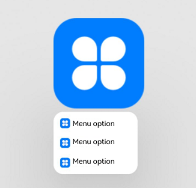
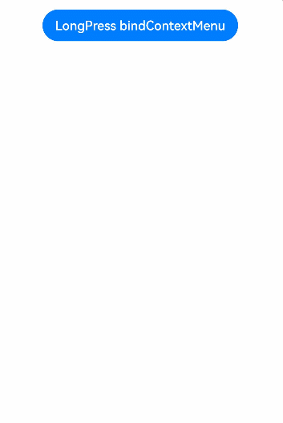
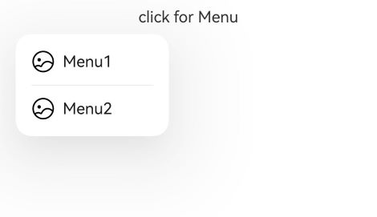

# Menu Control

A context menu – a vertical list of items – can be bound to a component and displayed by long-pressing, clicking, or right-clicking the component.

>  **NOTE**
>
>  - The APIs of this module are supported since API version 7. Updates will be marked with a superscript to indicate their earliest API version.
>
>  - **CustomBuilder** does not support the use of **bindMenu** and **bindContextMenu** methods. To display a multi-level menu, use the [Menu](ts-basic-components-menu.md) component instead.
>
>  - The text in the context menu cannot be selected by long-pressing.
>
>  - When the window size changes, the menu is automatically hidden.
>
>  - The menu animation uses a spring curve. Due to the rebound and oscillation of the spring curve during the exit of the animation, there is a prolonged tail effect, which prevents the menu from responding to other events after it disappears.
>
>  - If a component is a draggable node and **bindContextMenu** is used without a preview specified, the menu will display a floating drag preview, and the menu options will not avoid the preview. To address this issue, you can set a preview or configure the target node to be non-draggable, based on the use case.
>
>  - Since API version 12, a 500 ms long-press on the menu reveals submenus.
>
>  - Since API version 12, the pressed state of the menu follows finger movement.
>
>    1. This feature is only available in scenarios where the [Menu](ts-basic-components-menu.md) component is used and the child components include [MenuItem](ts-basic-components-menuitem.md) or [MenuItemGroup](ts-basic-components-menuitemgroup.md).
>
>    2. This feature is only available for menus with [MenuPreviewMode](#menupreviewmode11) set to **NONE**.


## bindMenu

bindMenu(content: Array<MenuElement&gt; | CustomBuilder, options?: MenuOptions)

Binds a menu to this component, which is displayed when the user clicks the component. A menu item can be a combination of text and icons or a custom component.

**Atomic service API**: This API can be used in atomic services since API version 11.

**System capability**: SystemCapability.ArkUI.ArkUI.Full

**Parameters**

| Name | Type                                                        | Mandatory| Description                                        |
| ------- | ------------------------------------------------------------ | ---- | -------------------------------------------- |
| content | Array<[MenuElement](#menuelement)&gt; \| [CustomBuilder](ts-types.md#custombuilder8) | Yes  | Array of menu item icons and text, or custom component.|
| options | [MenuOptions](#menuoptions10)                                | No  | Parameters of the context menu.                        |

## bindMenu<sup>11+</sup>

bindMenu(isShow: boolean, content: Array<MenuElement&gt; | CustomBuilder, options?: MenuOptions)

Binds a menu to this component, which is displayed when the user clicks the component. A menu item can be a combination of text and icons or a custom component.

**Atomic service API**: This API can be used in atomic services since API version 12.

**System capability**: SystemCapability.ArkUI.ArkUI.Full

**Parameters**

| Name              | Type                                                        | Mandatory| Description                                                        |
| -------------------- | ------------------------------------------------------------ | ---- | ------------------------------------------------------------ |
| isShow<sup>11+</sup> | boolean                                                      | Yes  | Whether to show the menu. The default value is **false**. The menu can be displayed only after the entire page is fully constructed. Therefore, to avoid incorrect display positions and shapes, do not set this parameter to **true** while the page is still being constructed.|
| content              | Array<[MenuElement](#menuelement)&gt; \| [CustomBuilder](ts-types.md#custombuilder8) | Yes  | Array of menu item icons and text, or custom component.                |
| options              | [MenuOptions](#menuoptions10)                                | No  | Parameters of the context menu.                                        |

## bindContextMenu<sup>8+</sup>

bindContextMenu(content: CustomBuilder, responseType: ResponseType, options?: ContextMenuOptions)

Binds a context menu to this component, which is displayed when the user long-presses or right-clicks the component. Only custom menu items are supported.

**Atomic service API**: This API can be used in atomic services since API version 11.

**System capability**: SystemCapability.ArkUI.ArkUI.Full

**Parameters**

| Name      | Type                                              | Mandatory| Description                            |
| ------------ | -------------------------------------------------- | ---- | -------------------------------- |
| content      | [CustomBuilder](ts-types.md#custombuilder8)        | Yes  | Builder of the custom menu content.          |
| responseType | [ResponseType](ts-appendix-enums.md#responsetype8) | Yes  | How the context menu is triggered, which can be long-press or right-click. Long pressing with a mouse device is not supported.|
| options      | [ContextMenuOptions](#contextmenuoptions10)        | No  | Parameters of the context menu.            |

## bindContextMenu<sup>12+</sup>

bindContextMenu(isShown: boolean, content: CustomBuilder, options?: ContextMenuOptions)

Binds a context menu to the component, whose visibility is subject to the **isShown** settings.

If **isShown** is **true**, the menu is displayed. If **isShown** is set to **false**, the menu is hidden. The menu items need to be customized.

The position of the context menu is subject to the **placement** settings, rather than where the component is clicked.


**System capability**: SystemCapability.ArkUI.ArkUI.Full

**Atomic service API**: This API can be used in atomic services since API version 11.

**Parameters**

| Name      | Type                                              | Mandatory| Description                                        |
| ------------ | -------------------------------------------------- | ---- | -------------------------------------------- |
| isShown | boolean | Yes  | Whether to show the context menu. The value **true** means to show the context menu, and **false** (default) means the opposite. The menu can be displayed properly only when the related page has been constructed. If this parameter is set to **true** before the construction is complete, display issues, such as misplacement, distortion, or failure to pop up, may occur. To trigger dragging by long presses is not supported. This parameter supports two-way binding through the [!! syntax](../../../quick-start/arkts-new-binding.md).|
| content      | [CustomBuilder](ts-types.md#custombuilder8)        | Yes  | Builder of the custom menu content.|
| options      | [ContextMenuOptions](#contextmenuoptions10)                      | No  | Parameters of the context menu.                        |

## MenuElement

| Name                 | Type                                  | Mandatory| Description                                                        |
| --------------------- | -------------------------------------- | ---- | ------------------------------------------------------------ |
| value                 | [ResourceStr](ts-types.md#resourcestr) | Yes  | Menu item text.<br>**Atomic service API**: This API can be used in atomic services since API version 11.                                                |
| icon<sup>10+</sup>    | [ResourceStr](ts-types.md#resourcestr) | No  | Menu item icon.<br>**Atomic service API**: This API can be used in atomic services since API version 11.                                                |
| enabled<sup>11+</sup> | boolean                                | No  | Whether to enable interactions with the menu item.<br>Default value: **true**, indicating that interactions with the menu item are enabled.<br>**Atomic service API**: This API can be used in atomic services since API version 12.|
| action                | () =&gt; void                | Yes  | Action triggered when a menu item is clicked.<br>**Atomic service API**: This API can be used in atomic services since API version 11.                                      |
| symbolIcon<sup>12+</sup>                | [SymbolGlyphModifier](ts-universal-attributes-attribute-modifier.md)                | No  | Icon of a menu item. When this parameter is set, the original icon is not displayed.<br>**Atomic service API**: This API can be used in atomic services since API version 12.                                      |

## MenuOptions<sup>10+</sup>

Inherits from [ContextMenuOptions](#contextmenuoptions10).

| Name                         | Type                                  | Mandatory| Description                                                        |
| ----------------------------- | -------------------------------------- | ---- | ------------------------------------------------------------ |
| title                         | [ResourceStr](ts-types.md#resourcestr) | No  | Menu title.<br>**NOTE**<br>This parameter is effective only when **content** is set to Array<[MenuElement](#menuelement)>.<br>**Atomic service API**: This API can be used in atomic services since API version 11.|
| showInSubWindow<sup>11+</sup> | boolean                                | No  | Whether to show the menu in a subwindow.<br>Default value: **true** for 2-in-1 devices and **false** for other devices<br>**Atomic service API**: This API can be used in atomic services since API version 12.                    |

## ContextMenuOptions<sup>10+</sup>

| Name                 | Type                                                        | Mandatory| Description                                                        |
| --------------------- | ------------------------------------------------------------ | ---- | ------------------------------------------------------------ |
| offset                | [Position](ts-types.md#position)                            | No  | Offset for showing the context menu, which should not cause the menu to extend beyond the screen.<br>Default value: **{x:0, y:0}**<br>**NOTE**<br>When the menu is displayed relative to the parent component area, the width or height of the area is automatically counted into the offset based on the **placement** attribute of the menu.<br>When the menu is displayed above the parent component (that is, **placement** is set to **Placement.TopLeft**, **Placement.Top**, or **Placement.TopRight**), a positive value of **x** indicates rightward movement relative to the parent component, and a positive value of **y** indicates upward movement.<br>When the menu is displayed below the parent component (that is, **placement** is set to **Placement.BottomLeft**, **Placement.Bottom**, or **Placement.BottomRight**), a positive value of **x** indicates rightward movement relative to the parent component, and a positive value of **y** indicates downward movement.<br>When the menu is displayed on the left of the parent component (that is, **placement** is set to **Placement.LeftTop**, **Placement.Left**, or **Placement.LeftBottom**), a positive value of **x** indicates leftward movement relative to the parent component, and a positive value of **y** indicates downward movement.<br>When the menu is displayed on the right of the parent component (that is, **placement** is set to **Placement.RightTop**, **Placement.Right**, or **Placement.RightBottom**), a positive value of **x** indicates rightward movement relative to the parent component, and a positive value of **y** indicates downward movement.<br>If the display position of the menu is adjusted (different from the main direction of the initial **placement** value), the offset value is invalid.<br>**Atomic service API**: This API can be used in atomic services since API version 11.|
| placement             | [Placement](ts-appendix-enums.md#placement8)                 | No  | Preferred position of the context menu. If the set position is insufficient for holding the component, it will be automatically adjusted.<br>**NOTE**<br>Setting **placement** to **undefined** or **null** is equivalent to not setting it at all. In this case, if [bindMenu](#bindmenu11) is used, the default value of **placement** is **Placement.BottomLeft**; if [bindContextMenu<sup>8+</sup>](#bindcontextmenu8) is used, the menu is displayed at the touched position; if [bindContextMenu<sup>12+</sup>](#bindcontextmenu12) is used, the default value is **Placement.BottomLeft**.<br>**Atomic service API**: This API can be used in atomic services since API version 11.|
| enableArrow           | boolean                                                      | No  | Whether to display an arrow. If the size and position of the context menu are insufficient for holding an arrow, no arrow is displayed.<br>Default value: **false**, indicating that no arrow is displayed<br>**NOTE**<br>When **enableArrow** is **true**, an arrow is displayed in the position specified by **placement**. If **placement** is not set or its value is invalid, the arrow is displayed above the target. If the position is insufficient for holding the arrow, it is automatically adjusted. When **enableArrow** is **undefined**, no arrow is displayed. This API is supported in **bindContextMenu** since API version 10 and **bindMenu** since API version 12.<br>**Atomic service API**: This API can be used in atomic services since API version 11.|
| enableHoverMode<sup>13+</sup>      | boolean                                                      | No  | Whether to enable the hover mode, that is, whether the menu responds in hover mode. When its touched position is within the crease region of the foldable device, the menu does not respond in hover mode.<br>Default value: **false**, indicating that the menu does not respond in hover mode<br>**NOTE**<br>The menu responds in hover mode when **enableHoverMode** is set to **true** and does not when **enableHoverMode** is set to **false** or an invalid value or is not set at all.<br>**Atomic service API**: This API can be used in atomic services since API version 13.|
| arrowOffset           | [Length](ts-types.md#length)                                 | No  | Offset of the arrow relative to the context menu. The offset settings take effect only when the value is valid, can be converted to a number greater than 0, and does not cause the arrow to extend beyond the safe area of the context menu.<br>Default value: **0**<br>Unit: vp<br>**NOTE**<br>The safe distance of the arrow from the four sides of the menu is the sum of the menu's corner radius and half the width of the arrow.<br>The value of **placement** determines whether the offset is horizontal or vertical.<br>When the arrow is in the horizontal direction of the menu, the offset is the distance from the arrow to the leftmost arrow's safe distance. When the arrow is in the vertical direction of the menu, the offset is the distance from the arrow to the topmost arrow's safe distance.<br>The default position where the arrow is displayed varies with the value of **placement**:<br>Without any avoidance by the menu, when **placement** is set to **Placement.Top** or **Placement.Bottom**, the arrow is displayed horizontally and is centered by default;<br>when **placement** is set to **Placement.Left** or **Placement.Right**, the arrow is displayed vertically and is centered by default;<br>when **placement** is set to **Placement.TopLeft** or **Placement.BottomLeft**, the arrow is displayed horizontally by default, and the distance from the arrow to the left edge of the menu is the arrow's safe distance;<br>when **placement** is set to **Placement.TopRight** or **Placement.BottomRight**, the arrow is displayed horizontally by default, and the distance from the arrow to the right edge of the menu is the arrow's safe distance;<br>when **placement** is set to **Placement.LeftTop** or **Placement.RightTop**, the arrow is displayed vertically by default, and the distance from the arrow to the top edge of the menu is the arrow's safe distance;<br>when **placement** is set to **Placement.LeftBottom** or **Placement.RightBottom**, the arrow is displayed vertically by default, and the distance from the arrow to the bottom edge of the menu is the arrow's safe distance.<br>  This API is supported in **bindContextMenu** since API version 10 and **bindMenu** since API version 12.<br>**Atomic service API**: This API can be used in atomic services since API version 11.|
| preview<sup>11+</sup> | [MenuPreviewMode](#menupreviewmode11)\| [CustomBuilder](ts-types.md#custombuilder8) | No  | Preview displayed when the context menu is triggered by a long-press or by calling [bindContextMenu<sup>12+</sup>](#bindcontextmenu12). It can be a screenshot of the target component or custom content.<br>Default value: **MenuPreviewMode.NONE**, indicating no preview.<br>**NOTE**<br>- This parameter has no effect when **responseType** is set to **ResponseType.RightClick**.<br>- If **preview** is set to **MenuPreviewMode.NONE** or is not set, the **enableArrow** parameter is effective.<br>- If **preview** is set to **MenuPreviewMode.IMAGE** or **CustomBuilder**, no arrow will be displayed even when **enableArrow** is **true**.<br>**Atomic service API**: This API can be used in atomic services since API version 12.|
| previewAnimationOptions<sup>11+</sup> | [ContextMenuAnimationOptions](#contextmenuanimationoptions11) | No   | Start scale ratio and end scale ratio (relative to the original preview image) of the preview animation displayed when the component is long pressed<br>Default value: **{ scale: [0.95, 1.1], transition: undefined, hoverScale: undefined }**<br>**NOTE**<br>If the value is less than or equal to 0, this API does not take effect.<br>**Atomic service API**: This API can be used in atomic services since API version 12.|
| onAppear              | () =&gt; void                                      | No  | Callback triggered when the menu is displayed.<br>**Atomic service API**: This API can be used in atomic services since API version 11.                                      |
| onDisappear           | () =&gt; void                                      | No  | Callback triggered when the menu is hidden.<br>**Atomic service API**: This API can be used in atomic services since API version 11.                                      |
| aboutToAppear              | () =&gt; void                                      | No  | Callback triggered when the menu is about to appear.<br>**Atomic service API**: This API can be used in atomic services since API version 12.                                      |
| aboutToDisappear           | () =&gt; void                                      | No  | Callback triggered when the menu is about to disappear.<br>**Atomic service API**: This API can be used in atomic services since API version 12.                                      |
| backgroundColor<sup>11+</sup> | [ResourceColor](ts-types.md#resourcecolor)  | No| Backplane color of the dialog box.<br>Default value: **Color.Transparent**<br>**Atomic service API**: This API can be used in atomic services since API version 12.|
| backgroundBlurStyle<sup>11+</sup> | [BlurStyle](ts-universal-attributes-background.md#blurstyle9) | No| Background blur style of the dialog box.<br>Default value: **BlurStyle.COMPONENT_ULTRA_THICK**<br>**Atomic service API**: This API can be used in atomic services since API version 12.|
| transition<sup>12+</sup> | [TransitionEffect](ts-transition-animation-component.md#transitioneffect10)| No  | Transition effect for the entrance and exit of the menu.<br>**NOTE**<br>During the exit animation of the menu, if there is a switch between landscape and portrait modes, the menu will make way. Level-2 menus do not inherit custom animations. The level-2 menu can be clicked during the pop-up process, but not during the execution of the exit animation.<br>For details, see [TransitionEffect](ts-transition-animation-component.md#transitioneffect10).<br>**Atomic service API**: This API can be used in atomic services since API version 12.|
| borderRadius<sup>12+</sup>  | [Length](ts-types.md#length) \| [BorderRadiuses](ts-types.md#borderradiuses9) \| [LocalizedBorderRadiuses](ts-types.md#localizedborderradiuses12) | No  | Border radius of the menu.<br>Default value: **8vp** for 2-in-1 devices and **20vp** for other devices<br>**NOTE**<br> The value can be in percentage.<br>If the sum of the two maximum corner radii in the horizontal direction exceeds the menu's width, or if the sum of the two maximum corner radii in the vertical direction exceeds the menu's height, the default corner radius of the menu will be used.<br>**Atomic service API**: This API can be used in atomic services since API version 12.|
| layoutRegionMargin<sup>13+</sup>  | [Margin](ts-types.md#margin) | No  | Minimum margin between the preview and menu layout for top, bottom, left, and right edges.<br>**NOTE**<br> Only vp, px, fp, lpx, and percentage units are supported.<br> Any abnormal or negative values will be treated as the default values.<br> If **preview** is set to **CustomBuilder**, setting **margin.left** or **margin.right** will remove the maximum grid width restriction for the preview.<br> Be cautious not to set excessively large margins that are too large, which could reduce the layout area and affect the proper layout of the preview and menu.<br>If the sum of horizontal margins exceeds the maximum layout width, **margin.left** and **margin.right** will be ignored and default values will be applied.<br> If the sum of vertical margins exceeds the maximum layout width, **margin.top** and **margin.bottom** will be ignored and default values will be applied.<br>**Atomic service API**: This API can be used in atomic services since API version 13.|

## MenuPreviewMode<sup>11+</sup>

**Atomic service API**: This API can be used in atomic services since API version 12.

**System capability**: SystemCapability.ArkUI.ArkUI.Full

| Name | Description                                  |
| ----- | -------------------------------------- |
| NONE  | No preview is displayed.                      |
| IMAGE | The preview is a screenshot of the component on which a long-press triggers the context menu.|

## ContextMenuAnimationOptions<sup>11+</sup>

**Atomic service API**: This API can be used in atomic services since API version 12.

| Name | Type                                      | Mandatory| Description                                |
| ----- | ------------------------------------------ | ---- | ------------------------------------ |
| scale | [AnimationRange](#animationrange11)\<number> | No  | Scale ratio of the preview image when the animation starts and scale ratio when the animation ends.<br>**Atomic service API**: This API can be used in atomic services since API version 12.|
| transition<sup>12+</sup> | [TransitionEffect](ts-transition-animation-component.md#transitioneffect10)| No  | Transition effect for the entrance and exit of the menu.<br>**NOTE**<br>During the exit animation of the menu, if there is a switch between landscape and portrait modes, the menu will make way. Level-2 menus do not inherit custom animations. The level-2 menu can be clicked during the pop-up process, but not during the execution of the exit animation.<br>For details, see [TransitionEffect](ts-transition-animation-component.md#transitioneffect10).|
| hoverScale<sup>12+</sup> | [AnimationRange](#animationrange11)\<number> | No  | Sets the scale ratio of the original component snapshot to the preview image at the beginning and end of the scale animation in a custom long press scenario. There is a transition animation for the switch with the preview image.<br>**NOTE**<br> If the value is less than or equal to 0, this API does not take effect.<br>This API does not take effect in [bindContextMenu<sup>12+</sup>](#bindcontextmenu12) scenarios.<br> This API does not take effect when **transition** is set.<br> If this API and the **scale** API are used at the same time, the start value of the **scale** API does not take effect.<br> To ensure the optimal experience, it is not recommended that the final preview image size be smaller than the size of the original component snapshot. The width and height of the preview animation are affected by the component snapshot and the custom preview size. Verify the display effect based on the actual use case.|

## AnimationRange<sup>11+</sup>

Describes the scale ratio relative to the preview image at the beginning and end of the scale animation.

**System capability**: SystemCapability.ArkUI.ArkUI.Full

**Atomic service API**: This API can be used in atomic services since API version 12.

| Value Range        | Description                                                                          |
| ---------------- | ------------------------------------------------------------------------------ |
| [from: T, to: T] | **from** indicates the scale ratio at the beginning of the animation, and **to** indicates the scale ratio at the end of the animation.|

## Example

### Example 1

Menu with textual menu items:

```ts
// xxx.ets
@Entry
@Component
struct MenuExample {
  build() {
    Column() {
      Text('click for Menu')
        .bindMenu([
          {
            value: 'Menu1',
            action: () => {
              console.info('handle Menu1 select')
            }
          },
          {
            value: 'Menu2',
            action: () => {
              console.info('handle Menu2 select')
            }
          },
        ])
    }
    .width('100%')
    .margin({ top: 5 })
  }
}
```


### Example 2

Menu with custom menu items:

```ts
@Entry
@Component
struct MenuExample {
  @State listData: number[] = [0, 0, 0]

  @Builder MenuBuilder() {
    Flex({ direction: FlexDirection.Column, justifyContent: FlexAlign.Center, alignItems: ItemAlign.Center }) {
      ForEach(this.listData, (item:number, index) => {
        Column() {
          Row() {
            Image($r("app.media.icon")).width(20).height(20).margin({ right: 5 })
            Text(`Menu${index as number + 1}`).fontSize(20)
          }
          .width('100%')
          .height(30)
          .justifyContent(FlexAlign.Center)
          .align(Alignment.Center)
          .onClick(() => {
            console.info(`Menu${index as number + 1} Clicked!`)
          })

          if (index != this.listData.length - 1) {
            Divider().height(10).width('80%').color('#ccc')
          }
        }.padding(5).height(40)
      })
    }.width(100)
  }

  build() {
    Column() {
      Text('click for menu')
        .fontSize(20)
        .margin({ top: 20 })
        .bindMenu(this.MenuBuilder)
    }
    .height('100%')
    .width('100%')
    .backgroundColor('#f0f0f0')
  }
}
```


### Example 3

Context menu displayed upon long-press:

```ts
// xxx.ets
@Entry
@Component
struct ContextMenuExample {
  @Builder MenuBuilder() {
    Flex({ direction: FlexDirection.Column, justifyContent: FlexAlign.Center, alignItems: ItemAlign.Center }) {
      Text('Test menu item 1')
        .fontSize(20)
        .width(100)
        .height(50)
        .textAlign(TextAlign.Center)
      Divider().height(10)
      Text('Test menu item 2')
        .fontSize(20)
        .width(100)
        .height(50)
        .textAlign(TextAlign.Center)
    }.width(100)
  }

  build() {
    Column() {
      Text('LongPress for menu')
    }
    .width('100%')
    .margin({ top: 5 })
    .bindContextMenu(this.MenuBuilder, ResponseType.LongPress)
  }
}
```


### Example 4

Directive menu displayed upon right-click:

```ts
// xxx.ets
@Entry
@Component
struct DirectiveMenuExample {
  @Builder MenuBuilder() {
    Flex({ direction: FlexDirection.Column, alignItems: ItemAlign.Center, justifyContent: FlexAlign.Center }) {
      Text('Options')
      Divider().strokeWidth(2).margin(5).color('#F0F0F0')
      Text('Hide')
      Divider().strokeWidth(2).margin(5).color('#F0F0F0')
      Text('Exit')
    }
    .width(200)
  }

  build() {
    Flex({ direction: FlexDirection.Column, alignItems: ItemAlign.Center, justifyContent: FlexAlign.Center }) {
      Column() {
        Text("DirectiveMenuExample")
          .fontSize(20)
          .width('100%')
          .height("25%")
          .backgroundColor('#F0F0F0')
          .textAlign(TextAlign.Center)
          .bindContextMenu(this.MenuBuilder, ResponseType.RightClick, {
            enableArrow: true,
            placement: Placement.Bottom
          })
      }
    }
    .width('100%')
    .height('100%')
  }
}
```


### Example 5

Context menu displayed upon long-pressing (with preview of component screenshot):

```ts
// xxx.ets
@Entry
@Component
struct Index {
  private iconStr: ResourceStr = $r("app.media.icon")

  @Builder
  MyMenu() {
    Menu() {
      MenuItem({ startIcon: this.iconStr, content: "Menu option" })
      MenuItem({ startIcon: this.iconStr, content: "Menu option" })
      MenuItem({ startIcon: this.iconStr, content: "Menu option" })
    }
  }

  build() {
    Column({ space: 50 }) {
      Column() {
        Column() {
          Text('preview-image')
            .width(200)
            .height(100)
            .textAlign(TextAlign.Center)
            .margin(100)
            .fontSize(30)
            .bindContextMenu(this.MyMenu, ResponseType.LongPress,
              { preview: MenuPreviewMode.IMAGE,
                previewAnimationOptions: {scale: [0.8, 1.0]},
              })
            .backgroundColor("#ff3df2f5")
        }
      }.width('100%')
    }
  }
}
```


### Example 6

Context menu displayed upon long-pressing (with preview of custom content):

```ts
// xxx.ets
@Entry
@Component
struct Index {
  private iconStr: ResourceStr = $r("app.media.icon")

  @Builder
  MyMenu() {
    Menu() {
      MenuItem({ startIcon: this.iconStr, content: "Menu option" })
      MenuItem({ startIcon: this.iconStr, content: "Menu option" })
      MenuItem({ startIcon: this.iconStr, content: "Menu option" })
    }
  }

  @Builder
  MyPreview() {
    Column() {
      Image($r('app.media.icon'))
        .width(200)
        .height(200)
    }
  }

  build() {
    Column({ space: 50 }) {
      Column() {
        Column() {
          Text('preview-builder')
            .width(200)
            .height(100)
            .textAlign(TextAlign.Center)
            .margin(100)
            .fontSize(30)
            .bindContextMenu(this.MyMenu, ResponseType.LongPress,
              {
                preview: this.MyPreview
              })
        }
      }.width('100%')
    }
  }
}
```



### Example 7

Context menu displayed upon setting isShown (with preview of custom content):

```ts
// xxx.ets
@Entry
@Component
struct Index {
  private iconStr: ResourceStr = $r("app.media.icon")
  @State isShown: boolean = false

  @Builder
  MyMenu() {
    Menu() {
      MenuItem({ startIcon: this.iconStr, content: "Menu option" })
      MenuItem({ startIcon: this.iconStr, content: "Menu option" })
      MenuItem({ startIcon: this.iconStr, content: "Menu option" })
    }
  }

  @Builder
  MyPreview() {
    Column() {
      Image($r('app.media.icon'))
        .width(200)
        .height(200)
    }
  }

  build() {
    Column({ space: 50 }) {
      Column() {
        Column() {
          Text('preview-builder')
            .width(200)
            .height(100)
            .textAlign(TextAlign.Center)
            .margin(100)
            .fontSize(30)
            .bindContextMenu(this.isShown, this.MyMenu,
              {
                preview: this.MyPreview,
                onDisappear: ()=>{
                    this.isShown = false;
                }
              })
          Button('click')
            .onClick(()=>{
                this.isShown = true;
             })
        }
      }.width('100%')
    }
  }
}
```

### Example 8

This example customizes the display and exit animation effects of the menu and preview through the **transition** attribute.

```ts
// xxx.ets
@Entry
@Component
struct MenuExample {
  @Builder MenuBuilder() {
    Flex({ direction: FlexDirection.Column, justifyContent: FlexAlign.Center, alignItems: ItemAlign.Center }) {
      Text('Test menu item 1')
        .fontSize(12)
        .width(200)
        .height(30)
        .textAlign(TextAlign.Center)
      Divider().height(10)
      Text('Test menu item 2')
        .fontSize(12)
        .width(100)
        .height(30)
        .textAlign(TextAlign.Center)
    }.width(100)
  }
  @Builder
  MyPreview() {
    Column() {
      Image($r('app.media.icon'))
        .width(50)
        .height(50)
    }
  }
  @State isShow:boolean = false
  private iconStr: ResourceStr = $r("app.media.icon")

  @Builder
  MyMenu() {
    Menu() {
      MenuItem({ startIcon: this.iconStr, content: "Menu option" })
      MenuItem({ startIcon: this.iconStr, content: "Menu option" })
      MenuItem({ startIcon: this.iconStr, content: "Menu option" })
    }
  }
  build() {
    Column() {
      Button('LongPress bindContextMenu')
        .margin({ top: 15 })
        .bindContextMenu(
          this.MenuBuilder,
          ResponseType.LongPress,{
          transition: TransitionEffect.OPACITY.animation({ duration: 4000, curve: Curve.Ease }).combine(
            TransitionEffect.rotate({ z: 1, angle: 180 })),
          preview: this.MyPreview,
          previewAnimationOptions: {
            scale: [0.8, 1.0],
            transition: TransitionEffect.OPACITY.animation({ duration: 4000, curve: Curve.Ease }).combine(
              TransitionEffect.rotate({ z: 1, angle: 180 }))
          }
        })
    }
    .width('100%')
    .margin({ top: 5 })
  }
}
```



### Example 9

This example demonstrates a regular menu (using symbol-type icons).

```ts
// xxx.ets
import { SymbolGlyphModifier } from '@kit.ArkUI';
@Entry
@Component
struct MenuExample {
  @State symbolIconModifier1: SymbolGlyphModifier = new SymbolGlyphModifier($r('sys.symbol.ohos_photo')).fontSize('24vp');
  @State symbolIconModifier2: SymbolGlyphModifier = new SymbolGlyphModifier($r('sys.symbol.ohos_photo')).fontSize('24vp');
  build() {
    Column() {
      Text('click for Menu')
    }
    .width('100%')
    .margin({ top: 5 })
    .bindMenu([
      {
        value: 'Menu1',
        symbolIcon:this.symbolIconModifier1,
        action: () => {
          console.info('handle Menu1 select')
        }
      },
      {
        value: 'Menu2',
        symbolIcon:this.symbolIconModifier2,
        action: () => {
          console.info('handle Menu2 select')
        }
      },
    ])
  }
}
```



### Example 10

This example uses **hoverScale** to implement the transition from the component snapshot to the custom preview image.

```ts
// xxx.ets
@Entry
@Component
struct Index {
  private iconStr: ResourceStr = $r("app.media.app_icon")

  @Builder
  MyMenu() {
    Menu() {
      MenuItem({ startIcon: this.iconStr, content: "Menu option" })
      MenuItem({ startIcon: this.iconStr, content: "Menu option" })
      MenuItem({ startIcon: this.iconStr, content: "Menu option" })
    }
  }

  @Builder
  MyPreview() {
    Column() {
      Image($r('app.media.example'))
        .width(200)
        .height(200)
    }
  }

  build() {
    Column({ space: 50 }) {
      Column() {
        Column() {
          Image($r('app.media.example'))
            .width(100)
            .height(100)
            .margin(100)
            .bindContextMenu(this.MyMenu, ResponseType.LongPress,
              {
                preview: this.MyPreview,
                previewAnimationOptions: {
                  hoverScale: [1.0, 0.95]
                }
              })
        }
      }.width('100%')
    }
  }
}
```


